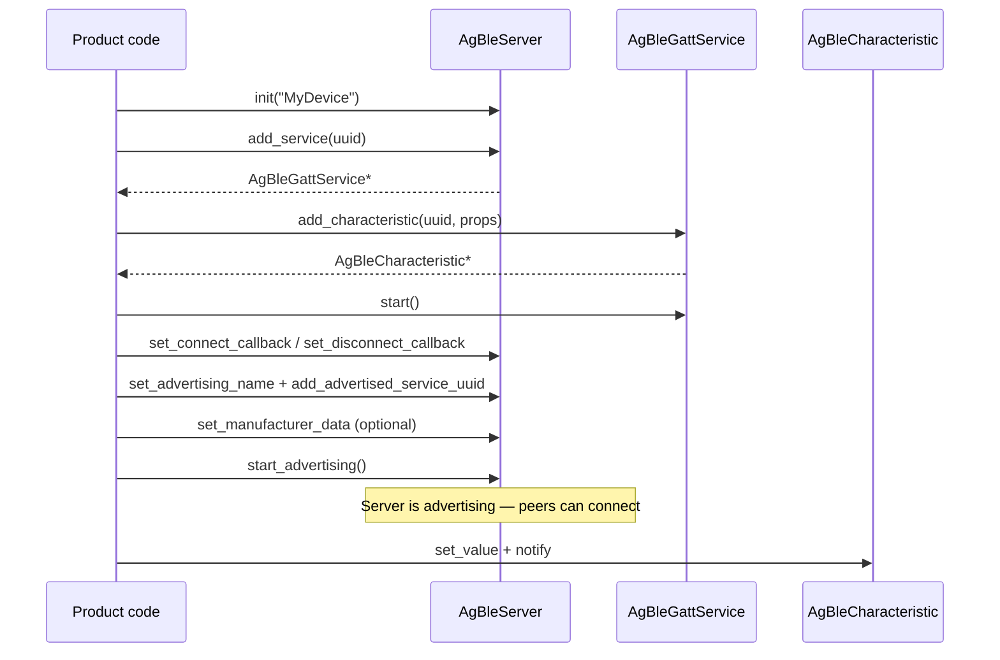
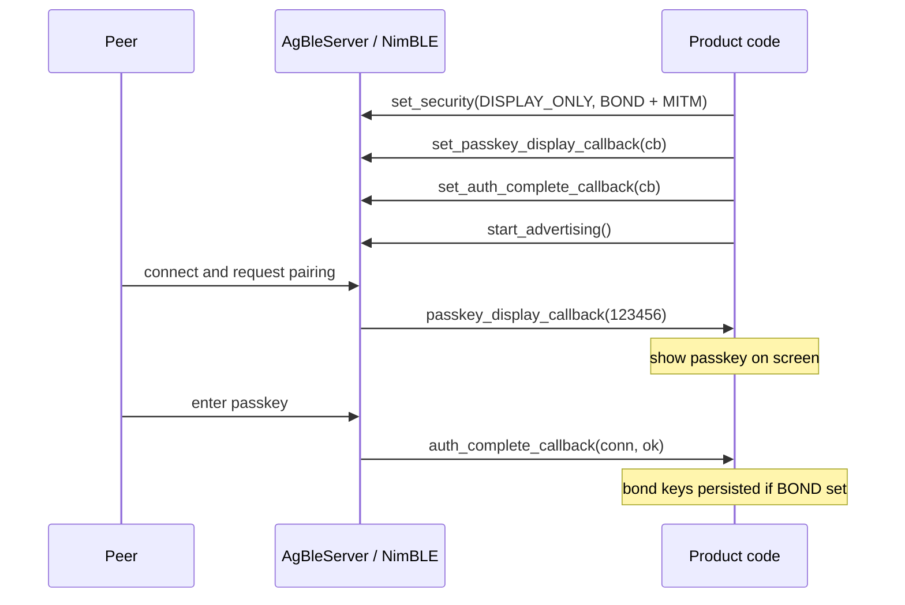

# airgradient-ble

Generic BLE peripheral (GATT server) HAL backed by `esp-nimble-cpp`. Wraps
the NimBLE stack behind clean abstract interfaces so product code and
services depend only on the HAL, not on NimBLE directly.

## Status

`Stable`.

## Scope

This component owns:

- BLE stack initialisation and teardown
- GATT service and characteristic registration
- BLE advertising control (local name, advertised service UUIDs,
  manufacturer-specific data)
- connect / disconnect event delivery via callbacks
- per-characteristic write event delivery via callbacks
- characteristic value updates and notifications to connected clients
- pairing, bonding, and link encryption configuration

This component does not own:

- BLE central / scanner functionality
- product-specific GATT profiles or payload encoding
- application-level reconnection or retry policy

## Directory Layout

```text
components/airgradient-ble/
  hal/
  drivers/
  CMakeLists.txt
  README.md
```

- `hal/` — public BLE types and abstract interfaces
  (`AgBleServer`, `AgBleGattService`, `AgBleCharacteristic`, `AgBleProperty`,
  `AgBleIoCapability`, `AgBleAuth`)
- `drivers/` — NimBLE-backed implementation (`NimbleBleServer`, plus the
  internal `NimbleBleGattService` / `NimbleBleCharacteristic`)

## Public Includes

```cpp
#include "hal/ble_server.h"
#include "hal/ble_types.h"
#include "drivers/nimble_ble_server.h"
```

Guideline:

- include from `hal/` when depending on the abstract server / characteristic
  interfaces or BLE property / security flags
- include from `drivers/` only when instantiating the NimBLE-backed server

## Design

```text
caller -> AgBleServer& -> NimbleBleServer -> esp-nimble-cpp -> NimBLE stack
```

Product composition code creates a `NimbleBleServer` instance and passes a
`AgBleServer &` into services or tasks that need BLE access. NimBLE headers
are confined to `drivers/` and never leak to callers.

## Usage

```cpp
NimbleBleServer ble;
ble.init("MyDevice");

AgBleGattService *svc = ble.add_service("ABCD");
AgBleCharacteristic *ch = svc->add_characteristic(
    "1234", AgBleProperty::READ | AgBleProperty::NOTIFY);
svc->start();

ble.set_advertising_name("MyDevice");
ble.add_advertised_service_uuid("ABCD");
ble.set_manufacturer_data(mfg_buf, mfg_len);  // optional
ble.start_advertising();

ch->set_value(data, len);
ch->notify();
```

Typical lifecycle:



`AgBleGattService::start()` registers the service definition and its
characteristics with the NimBLE GATT database; it must be called before
`start_advertising()`. The HAL has no separate "server start" call —
`start_advertising()` starts the underlying `NimBLEServer` first.

For a production wiring, see `products/go/main/go_ble.cpp`.

## Security

`set_security()` is optional. If it is never called, the server operates
without security (connections are unauthenticated and unencrypted).

```cpp
ble.set_security(AgBleIoCapability::DISPLAY_ONLY,
                 AgBleAuth::BOND | AgBleAuth::MITM);
```

- IO capabilities: `DISPLAY_ONLY`, `DISPLAY_YES_NO`, `KEYBOARD_ONLY`,
  `NO_INPUT_NO_OUTPUT`, `KEYBOARD_DISPLAY`
- Auth flags (combinable with `|`): `BOND` (persist keys), `MITM`
  (man-in-the-middle protection), `SC` (LE Secure Connections)

Characteristic flags require the corresponding link state for read or write
access:

| Flag | Meaning |
|---|---|
| `READ_ENC` | Read requires an encrypted link |
| `READ_AUTHEN` | Read requires an authenticated (MITM) link |
| `WRITE_ENC` | Write requires an encrypted link |
| `WRITE_AUTHEN` | Write requires an authenticated (MITM) link |

Passkey pairing flow:



`delete_all_bonds()` erases all stored pairing keys (factory reset) while BLE
is active. It is a safe no-op after BLE teardown.

Bond persistence requires `CONFIG_BT_NIMBLE_NVS_PERSIST=y` in the product
`sdkconfig.defaults`.

## Dependencies

- `esp-nimble-cpp` (private) — NimBLE C++ wrapper

## Tests

This component does not currently own host tests. BLE-dependent product
behavior is exercised at the product level (e.g.
`products/go/tests/go_ble.tests.cpp`) and via the BLE integration suite
under `products/go/tests/ble-integration/`.

## Notes

The HAL exposes the most common advertising payload fields — local name,
one or more service UUIDs, and optional manufacturer-specific data. All
must be set after `init()` and before `start_advertising()`.
