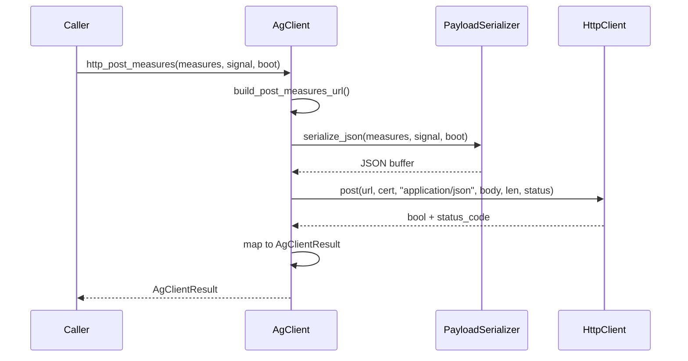

# airgradient-client Spec

> **This is a spec.** It describes how a feature **will be built**, not what
> currently exists. Once the feature ships, the corresponding component README
> becomes the source of truth and this file is typically deleted.

Unified AirGradient server client component. Provides a single `AgClient`
class that handles all communication with AirGradient backend servers
(fetch config, post measures, OTA download) over HTTP, CoAP, and MQTT.
The caller selects a network at boot (WiFi or Cellular) and calls
protocol-specific methods without knowledge of network internals.

## Scope

This spec covers the **WiFi HTTP** implementation of `AgClient`. Cellular
network support (CoAP, MQTT, cellular HTTP for OTA) and WiFi MQTT are
intentionally out of scope and will be addressed in future specs. The
corresponding protocol client interfaces (`CoapClient`, `MqttClient`) and
backend placeholders are defined here to establish the full component
structure, but their implementations are not part of this work.

Calling a method whose backend is not yet implemented results in an abort
with a clear error log.

## Problem

The existing `airgradient-client` library (in `tmp/airgradient-client/`)
has several issues:

- **God-class inheritance** --- a base `AirgradientClient` with no-op virtual
  methods for every protocol; WiFi and Cellular subclasses override different
  subsets
- **Duplicate data model** --- owns `CommonPayload`/`ExtraPayload`/`PayloadBuffer`
  types that duplicate the shared `Measures` types in `airgradient-common`
- **Dead Arduino compatibility** --- `#ifdef ARDUINO` / `#ifndef ESP8266` guards
  and `HTTPClient.h` dependency no longer needed
- **Untestable on host** --- direct `esp_http_client`, `esp_random`,
  `vTaskDelay` calls with no abstraction
- **Protocol logic mixed with application logic** --- URL paths, payload
  formats, AT commands, CoAP Block1, and connection state all in the same
  class

## Goals

- Single `AgClient` class --- one object for the caller regardless of network
  or protocol
- Network chosen at boot (WiFi or Cellular), fixed for the runtime session
- Protocol-specific methods: `http_*`, `coap_*`, `mqtt_*`
- This spec implements WiFi HTTP only; cellular protocols and WiFi MQTT are
  future work
- `http_*` methods are WiFi-only within `AgClient`; cellular uses CoAP for
  config and measures, MQTT for publishing (future specs)
- Cellular HTTP exists only for OTA binary download (consumed by the future
  `airgradient-ota` component, not by `AgClient` itself)
- Use shared `Measures` types from `airgradient-common` via Kconfig typedef
  (same pattern as `airgradient-payload-cache`)
- Three protocol client interfaces (`HttpClient`, `MqttClient`, `CoapClient`)
  in the `clients/` directory provide mockable seams for host testing
- All protocol client backend implementations live in this component, next to
  the interfaces they implement
- Preserve existing AirGradient server contracts (endpoints, payload formats,
  TLS certificate, response code interpretation)
- Host-testable: all application logic testable with mock protocol clients
- Optional cellular dependency gated by Kconfig

## Non-Goals

- No generic HTTP/MQTT/CoAP library --- this is AirGradient-server-specific
- No OTA implementation (separate component; this spec defines the protocol
  client interface OTA will use)
- No WiFi MQTT implementation in this spec (interface defined, implementation
  is future work)
- No cellular backend implementation in this spec (interfaces defined,
  implementations are future work)
- No cellular implementation of `begin()` in this spec ---
  `begin(sn, NetworkType::Cellular, modem)` returns `false` until a future
  spec adds cellular backends
- No config fetch or measure post over cellular HTTP --- cellular products
  use CoAP and MQTT for those operations
- No streaming HTTP GET (`get_stream()`) --- OTA binary download will be
  addressed in the future `airgradient-ota` spec, which will extend
  `HttpClient` when needed
- No config parsing --- the client returns raw config responses; parsing is the
  caller's responsibility
- No connection management for WiFi (WiFi stack is assumed to be up when the
  caller uses `AgClient`)

## Design

### Caller API

```cpp
AgClient client;

// At boot --- one or the other, fixed for this runtime
client.begin("aabbccddeeff", NetworkType::Wifi);
// or (future spec --- returns false until cellular backends are implemented)
client.begin("aabbccddeeff", NetworkType::Cellular, &modem);

// HTTP (WiFi only --- aborts on Cellular)
auto result = client.http_fetch_config(config_buf, sizeof(config_buf), &written);
if (result == AgClientResult::NotRegistered) { /* device not on server */ }
if (result == AgClientResult::BufferTooSmall) { /* config too large */ }

result = client.http_post_measures(measures, signal, boot);

// CoAP (Cellular only --- aborts until cellular backends are implemented)
result = client.coap_fetch_config(config_buf, sizeof(config_buf), &written);
result = client.coap_post_measures(measures, signal, interval_seconds);
result = client.coap_post_measures(arr, count, signal, interval_seconds);

// MQTT (Cellular only --- aborts until backends are implemented)
result = client.mqtt_connect(host, port, username, password);
result = client.mqtt_publish_measures(measures, signal, interval_seconds);
result = client.mqtt_disconnect();
```

### Measures Type Selection

Same Kconfig pattern as `airgradient-payload-cache`. Each product selects
which `Measures` variant the client serializes and posts at build time. No
mapping or conversion needed.

```cpp
// types/client_types.h

enum class AgClientResult {
    Ok,              // Operation succeeded (HTTP 200, 201, or 429)
    BufferTooSmall,  // Response did not fit in caller's buffer
    TransportError,  // Could not reach server (connection, DNS, timeout)
    ServerError,     // Non-success HTTP status (generic)
    NotRegistered,   // Server returned 400 --- device not registered
};

#if defined(CONFIG_AG_CLIENT_MEASURES_TYPE_BASIC)
typedef MeasuresBasic AgClientMeasuresType;
#elif defined(CONFIG_AG_CLIENT_MEASURES_TYPE_AGO)
typedef MeasuresAGo AgClientMeasuresType;
#else
typedef Measures AgClientMeasuresType;
#endif
```

### Measures Initialization Contract

`AgClient` serializes only fields that pass the corresponding
`is_*_valid()` method on each `Measures` substruct. **Callers must pass
`Measures` values that have been initialized with invalid sentinels for
any unset fields.** Zero-initialization (`AgClientMeasuresType m{}`) is
**unsafe** because zero is a valid value for several fields:

- `co2.co2 = 0` passes `CO2Data::is_valid()` (range 0..10000)
- `pm_a.pm_01 = 0.0f` passes `PMData::is_pm_01_valid()` (>= 0)
- `temp_hum_a.humidity = 0.0f` passes `TempHumData::is_hum_valid()` (0..100)
- `tvoc_nox.tvoc_index = 0` passes `TVOCNOxData::is_tvoc_index_valid()` (>= 0)

Callers must set fields they did not measure to the invalid sentinels
defined in `MeasuresInvalid` (e.g., `co2.co2 = MeasuresInvalid::CO2`),
or use an initialization helper if one is introduced.

`MeasuresPower` already defaults to invalid sentinels via member
initializers in `measures_types.h`; other substructs currently do not.
See Open Questions for a proposal to add invalid defaults to all
substructs.

### AgClient Class

```cpp
class AgClient {
public:
    AgClient() = default;

    bool begin(const char *serial_number, NetworkType network,
               CellularModem *modem = nullptr);

    // --- HTTP (WiFi only --- aborts on Cellular) ---
    AgClientResult http_fetch_config(char *config_out, size_t config_size,
                                     size_t *bytes_written);
    AgClientResult http_post_measures(const AgClientMeasuresType &measures,
                                      int signal, uint32_t boot);

    // --- CoAP (Cellular only --- aborts on WiFi) --- supports batch
    AgClientResult coap_fetch_config(char *config_out, size_t config_size,
                                     size_t *bytes_written);
    AgClientResult coap_post_measures(const AgClientMeasuresType &measures,
                                      int signal, int interval_seconds);
    AgClientResult coap_post_measures(const AgClientMeasuresType *measures,
                                      size_t count, int signal,
                                      int interval_seconds);

    // --- MQTT (Cellular now, WiFi future --- aborts until implemented) ---
    AgClientResult mqtt_connect(const char *host, int port,
                                const char *username = nullptr,
                                const char *password = nullptr);
    AgClientResult mqtt_disconnect();
    AgClientResult mqtt_publish_measures(const AgClientMeasuresType &measures,
                                         int signal, int interval_seconds);

    // --- Domain override (for staging/testing) ---
    void set_http_domain(const char *domain);
    void reset_http_domain();
    void set_coap_host(const char *host);
    void reset_coap_host();

private:
    NetworkType network_ = NetworkType::Wifi;
    char serial_number_[13] = {};       // 12-char hex + null

    std::string http_domain_ = "hw.airgradient.com";
    std::string coap_host_ = "128.140.49.53";

    HttpClient *http_ = nullptr;
    MqttClient *mqtt_ = nullptr;
    CoapClient *coap_ = nullptr;

    bool build_fetch_config_url(char *buf, size_t size) const;
    bool build_post_measures_url(char *buf, size_t size) const;
    bool serialize_json(const AgClientMeasuresType &measures,
                        int signal, uint32_t boot, char *buf, size_t size,
                        size_t *bytes_written) const;

#ifdef TEST_HOST
    friend class AgClientTestAccess;
#endif
};
```

The `AgClientResult` enum replaces the previous `bool` return + separate
status query methods (`is_last_fetch_config_ok()`,
`is_last_post_measures_ok()`, `is_registered_on_server()`). Each call
returns the precise outcome --- `Ok`, `NotRegistered`, `BufferTooSmall`,
`TransportError`, or `ServerError` --- so the caller can act on it
immediately without inspecting separate state.

`begin()` creates the appropriate protocol client backends internally
and assigns the raw pointers. Backends are created once at boot and
live for the process lifetime (never freed) --- this matches the
embedded pattern where `AgClient` is a static object that outlives the
program. Tests bypass `begin()` and inject mock clients via
`AgClientTestAccess`.

`set_http_domain()` and `set_coap_host()` copy the input into the
internal `std::string`, so caller-supplied string lifetime does not
matter. `reset_http_domain()` and `reset_coap_host()` restore the
compile-time defaults.

`interval_seconds` on CoAP and MQTT methods represents the device's
measurement cadence. The CoAP binary encoder converts `interval_seconds`
to minutes by integer division by 60 (matching the old library) and
stores the result as `uint8_t interval_minutes` in the payload header.
Fractional minutes are truncated. HTTP methods do not take
`interval_seconds` because the JSON payload format does not include it.

### Backend Construction

Concrete backend types (`WifiHttpClient`, etc.) include ESP-IDF headers
that are unavailable on host. To keep `services/ag_client.cpp`
host-testable, backend construction is guarded with `#ifndef TEST_HOST`:

```cpp
// In ag_client.cpp

#ifndef TEST_HOST
#include "backends/wifi_http_client.h"
static HttpClient *make_wifi_http_client() {
    static WifiHttpClient instance;
    return &instance;
}
#endif

bool AgClient::begin(const char *sn, NetworkType network, ...) {
    // ...
#ifndef TEST_HOST
    if (network == NetworkType::Wifi) {
        http_ = make_wifi_http_client();
    }
#endif
    // ...
}
```

Host tests inject mock clients via `AgClientTestAccess` and never reach
the `#ifndef TEST_HOST` paths. Only the ESP-IDF firmware build compiles
the backend construction code.

### Batch Behavior

- **HTTP (WiFi only):** single measure only --- no batch overload exists.
  The old library's compact CSV batch format for cellular HTTP is legacy
  and is **not** carried forward.
- **CoAP (Cellular only):** supports batch --- serialized as binary via
  `PayloadEncoder` (preserved from old library, future spec)
- **MQTT:** single measure only

### HttpClient Interface

```cpp
class HttpClient {
public:
    virtual ~HttpClient() = default;

    // Returns true if the HTTP request completed (any status code).
    // Returns false on transport failure (connection, DNS, timeout).
    // When response exceeds body_size: writes what fits, NUL-terminates,
    // sets *truncated = true. Transport still succeeded (returns true).
    virtual bool get(const char *url, const char *cert_pem,
                     int &status_code,
                     char *response_body, size_t body_size,
                     size_t *bytes_written,
                     bool *truncated) = 0;

    virtual bool post(const char *url, const char *cert_pem,
                      const char *content_type,
                      const uint8_t *body, size_t body_len,
                      int &status_code) = 0;
};
```

`HttpClient::get()` is an internal interface consumed by `AgClient`, not
by product code. The `truncated` parameter is always provided by
`AgClient` internally. `AgClient` maps the combination of `bool` return,
`status_code`, and `truncated` to the public `AgClientResult` enum.

### HTTP Response Buffer Contract

For `HttpClient::get()`:

- The **caller** (i.e., `AgClient`) owns and supplies the response buffer
  (`char *` of size `body_size`).
- **Transport success, response fits:** returns `true`,
  `*truncated = false`, response NUL-terminated, `*bytes_written` is the
  response length excluding the NUL terminator.
- **Transport success, buffer too small:** returns `true`,
  `*truncated = true`, writes what fits, NUL-terminates,
  `*bytes_written` is the bytes written (excluding NUL).
- **Transport failure:** returns `false`, `*bytes_written` is 0, buffer
  contents undefined.
- **Invalid arguments** (`body_size == 0` or `response_body == nullptr`):
  returns `false`, `*bytes_written` is 0.

`AgClient` maps these to `AgClientResult`:

| `HttpClient::get()` | `status_code` | `truncated` | `AgClientResult` |
|---|---|---|---|
| `false` | --- | --- | `TransportError` |
| `true` | --- | `true` | `BufferTooSmall` |
| `true` | 200 | `false` | `Ok` |
| `true` | 429 | `false` | `Ok` (rate-limited) |
| `true` | 400 | `false` | `NotRegistered` |
| `true` | other | `false` | `ServerError` |

The exact status-code-to-result mapping varies by operation --- see
Response Code Interpretation below.

For AirGradient config responses, 2048 bytes has been sufficient
historically.

### MqttClient Interface

```cpp
class MqttClient {
public:
    virtual ~MqttClient() = default;

    virtual bool connect(const char *client_id,
                         const char *host, int port,
                         const char *username,
                         const char *password) = 0;
    virtual bool disconnect() = 0;
    virtual bool publish(const char *topic,
                         const uint8_t *payload, size_t len,
                         int qos) = 0;
};
```

### CoapClient Interface

```cpp
class CoapClient {
public:
    virtual ~CoapClient() = default;

    // Fetch config from CoAP server.
    // uri_path is the CoAP URI path (e.g., serial number).
    virtual bool get(const char *host, int port,
                     const char *uri_path,
                     char *response_body, size_t body_size,
                     size_t *bytes_written) = 0;

    // Post binary payload to CoAP server.
    // Handles Block1 chunking internally when payload exceeds block size.
    virtual bool post(const char *host, int port,
                      const char *uri_path,
                      const uint8_t *body, size_t body_len,
                      int &response_code_class,
                      int &response_code_detail) = 0;
};
```

The `CoapClient` encapsulates all CoAP protocol machinery --- packet
building/parsing, CON/ACK handling, Block1 chunking, retry logic, and DNS
fallback. `AgClient` calls `get()` or `post()` and never sees CoAP
internals or the `coap-packet` library.

### WifiHttpClient

Wraps ESP-IDF `esp_http_client`. The only backend implemented in this spec.

```cpp
class WifiHttpClient : public HttpClient {
public:
    bool get(const char *url, const char *cert_pem,
             int &status_code,
             char *response_body, size_t body_size,
             size_t *bytes_written,
             bool *truncated) override;

    bool post(const char *url, const char *cert_pem,
              const char *content_type,
              const uint8_t *body, size_t body_len,
              int &status_code) override;
};
```

`get()` and `post()` use `esp_http_client_perform()` (simple
request-response).

### Payload Serialization

HTTP uses JSON via `cJSON` (built into ESP-IDF, no extra dependency). HTTP
config fetch and measures post are WiFi-only operations within `AgClient`;
cellular products use CoAP for those (future spec). The old library's
compact CSV format for cellular HTTP is legacy and is **not** carried
forward. CoAP uses the binary `PayloadEncoder` format.

The serializer maps `AgClientMeasuresType` fields to the AirGradient server
JSON property names.

| Measures Field | JSON Property | Dual-Channel Handling |
|---|---|---|
| `temp_hum_a.temperature` / `temp_hum_b.temperature` | `atmp` | Average if both valid |
| `temp_hum_a.humidity` / `temp_hum_b.humidity` | `rhum` | Average if both valid |
| `co2.co2` | `rco2` | Single |
| `pm_a.pm_01` / `pm_b.pm_01` | `pm01` | Average if both valid |
| `pm_a.pm_25` / `pm_b.pm_25` | `pm02` | Average if both valid |
| `pm_a.pm_10` / `pm_b.pm_10` | `pm10` | Average if both valid |
| `pm_a.pm_03_pc` / `pm_b.pm_03_pc` | `pm003Count` | Average if both valid |
| `tvoc_nox.tvoc_index` | `tvocIndex` | Single |
| `tvoc_nox.tvoc_raw` | `tvocRaw` | Single |
| `tvoc_nox.nox_index` | `noxIndex` | Single |
| `tvoc_nox.nox_raw` | `noxRaw` | Single |
| `power.battery_voltage` | `volt` | Single |
| `power.charging_voltage` | `light` | Single |
| `electrode.o3_we` | `measure0` | Single (full `Measures` only) |
| `electrode.o3_ae` | `measure1` | Single (full `Measures` only) |
| `electrode.no2_we` | `measure2` | Single (full `Measures` only) |
| `electrode.no2_ae` | `measure3` | Single (full `Measures` only) |
| `electrode.afe_temp` | `measure4` | Single (full `Measures` only) |
| signal (parameter) | `wifi` | Always included |
| boot (parameter) | `boot` | Always included |

Only valid fields are included (using `is_*_valid()` methods from
`measures_types.h`). If a `Measures` variant does not have a field (e.g.,
`MeasuresAGo` has no `electrode`), it is simply absent from the JSON.

### Dual-Channel Handling

For products with two PM sensors and/or two temp/hum sensors (full
`Measures` type), `pm_b` and `temp_hum_b` are merged with `pm_a` and
`temp_hum_a` as follows:

- **Both channels valid:** arithmetic mean of the two values
- **One channel valid:** use the valid channel's value
- **Neither valid:** field is omitted from JSON

This applies to all dual-channel fields listed in the table above (PM
atmospheric, PM particle count, temperature, humidity). For products
without a second channel (`MeasuresBasic`, `MeasuresAGo`), only the
`_a` fields are used.

### AirGradient Server Endpoints

```text
Fetch config:  https://hw.airgradient.com/sensors/airgradient:{sn}/one/config
Post measures: https://hw.airgradient.com/sensors/airgradient:{sn}/measures
MQTT topic:    airgradient/readings/{sn}/ce
CoAP host:     128.140.49.53:5683  (path: /{sn})
```

### Response Code Interpretation

Response codes are interpreted per-operation and mapped to
`AgClientResult` to match the existing server contract.

#### http_fetch_config (WiFi)

| Status | `AgClientResult` |
|---|---|
| 200 | `Ok` |
| 400 | `NotRegistered` |
| Other | `ServerError` |

#### http_post_measures (WiFi)

| Status | `AgClientResult` |
|---|---|
| 200 | `Ok` |
| 429 | `Ok` (rate-limited but accepted) |
| Other | `ServerError` |

#### coap_fetch_config (Cellular, future spec)

| Class | `AgClientResult` |
|---|---|
| 2.xx | `Ok` |
| 4.xx | `NotRegistered` |
| Other | `ServerError` |

#### coap_post_measures (Cellular, future spec)

| Class | `AgClientResult` |
|---|---|
| 2.xx | `Ok` |
| Other | `ServerError` |

#### mqtt_publish_measures (Cellular, future spec)

Broker acknowledgement returns `Ok`. Disconnect or publish error returns
`TransportError`.

### TLS Certificate

The AirGradient root CA is embedded as a static `constexpr` string inside
the component (same certificate as the old library). Passed to
`HttpClient` methods via the `cert_pem` parameter.

### Unsupported Combination Handling

Calling a method on an unsupported network, or a method whose backend is
not yet implemented, is a programming bug. The client logs an error and
aborts.

- `http_fetch_config` / `http_post_measures` on Cellular --- **aborts**
- `coap_*` on WiFi --- **aborts**
- `coap_*` / `mqtt_*` on Cellular --- **aborts** (cellular backends are
  not implemented in this spec; future work)
- `mqtt_*` on WiFi --- **aborts** (until `WifiMqttClient` is implemented)
- `begin(sn, NetworkType::Cellular, modem)` --- **returns `false`** and
  logs that cellular is not supported in this implementation

### Internal Flow



### Component Structure

```text
components/airgradient-client/
  clients/
    http_client.h                  -- HttpClient interface
    mqtt_client.h                  -- MqttClient interface
    coap_client.h                  -- CoapClient interface
  types/
    client_types.h                 -- NetworkType, AgClientResult, AgClientMeasuresType
  services/
    ag_client.h / .cpp             -- AgClient class
    payload_serializer.h / .cpp    -- Measures to JSON / binary
  backends/
    wifi_http_client.h / .cpp      -- esp_http_client wrapper (implement now)
    wifi_mqtt_client.h / .cpp      -- esp_mqtt_client wrapper (future spec)
    cellular_http_client.h / .cpp  -- CellularModem HTTP adapter (future spec, OTA)
    cellular_mqtt_client.h / .cpp  -- CellularModem MQTT adapter (future spec)
    cellular_coap_client.h / .cpp  -- CellularModem UDP + CoAP (future spec)
  lib/
    coap-packet/                   -- Copied as-is from old library
    payload-encoder/               -- Copied as-is from old library
  tests/
    ag_client_test_access.h        -- Friend class for AgClient test injection
    ag_client.tests.cpp
    payload_serializer.tests.cpp
  CMakeLists.txt
  Kconfig
  README.md
  spec.md                         -- This spec
```

### Dependencies

```text
airgradient-client
  airgradient-common       (Measures types, logging)
  airgradient-cellular     (optional -- CellularModem HAL for CoAP, MQTT, and
                            OTA HTTP, gated by Kconfig)
  esp_http_client          (WiFi HTTP backend)
  esp_mqtt                 (WiFi MQTT backend, future spec)
  cJSON                    (JSON serialization, built into ESP-IDF)
```

### Kconfig

```text
menu "AirGradient Client"

    choice AG_CLIENT_MEASURES_TYPE
        prompt "Client measures type"
        default AG_CLIENT_MEASURES_TYPE_FULL
        help
            Selects which Measures variant the client serializes and posts.

        config AG_CLIENT_MEASURES_TYPE_FULL
            bool "Measures"

        config AG_CLIENT_MEASURES_TYPE_BASIC
            bool "MeasuresBasic"

        config AG_CLIENT_MEASURES_TYPE_AGO
            bool "MeasuresAGo"
    endchoice

    config AG_CLIENT_CELLULAR_SUPPORT
        bool "Enable cellular modem support"
        default n
        help
            When enabled, AgClient can use a CellularModem for CoAP and
            MQTT operations, and the CellularHttpClient backend is built
            for OTA use. Adds a build dependency on airgradient-cellular.

endmenu
```

## Implementation Plan

Ordered by dependency. Each step is a focused commit. All non-WiFi-HTTP
methods (`coap_*`, `mqtt_*`, cellular `begin()`) are implemented as stubs
that log an error and abort.

1. **Create component skeleton** --- directory structure, `CMakeLists.txt`,
   `Kconfig`, empty `README.md`

2. **Define types** --- `types/client_types.h` with `NetworkType` enum,
   `AgClientResult` enum, `AgClientMeasuresType` typedef

3. **Define protocol client interfaces** --- `clients/http_client.h`,
   `clients/mqtt_client.h`, and `clients/coap_client.h`

4. **Copy vendored libraries** --- `lib/coap-packet/` and
   `lib/payload-encoder/` as-is from old library

5. **Implement payload serializer** --- `services/payload_serializer.h/.cpp`,
   `Measures` to JSON using `cJSON`. Host-testable (pure logic, no ESP-IDF
   dependency except `cJSON` which builds natively)

6. **Implement `AgClient` core** --- `services/ag_client.h/.cpp` with URL
   building, response interpretation, status tracking, WiFi HTTP methods
   delegating to `HttpClient`. All CoAP/MQTT/cellular methods are stubs
   that abort with a clear error log.

7. **Implement `WifiHttpClient`** --- `backends/wifi_http_client.h/.cpp`
   wrapping `esp_http_client` for `get()` and `post()`.

8. **Add host tests** --- `tests/ag_client_test_access.h` (friend class),
   `tests/payload_serializer.tests.cpp` (pure logic), and
   `tests/ag_client.tests.cpp` (mock `HttpClient` via friend class, verify
   URL building, serialization, status tracking, response interpretation)

9. **Wire into build system** --- update `tests/CMakeLists.txt` to include
   component tests, verify ESP-IDF product build with the component

10. **Write component README** --- following the component README template

## Testing Strategy

### Host Tests (Friend Class + Mock Protocol Clients)

Tests use the `AgClientTestAccess` friend class to inject mock protocol
clients into `AgClient` internals without special public constructors.
This follows the same pattern as `GoAppTestAccess` and
`TestableSimcomA7672x` in the existing codebase.

`AgClientTestAccess` lives in its own header
(`tests/ag_client_test_access.h`) and provides:

- `inject_http_client()`, `inject_mqtt_client()`, `inject_coap_client()`
  --- set the protocol client pointers directly
- `set_serial_number()`, `set_network()` --- configure internal state
  without calling `begin()`

```cpp
// tests/ag_client_test_access.h
class AgClientTestAccess {
public:
    explicit AgClientTestAccess(AgClient &c) : c_(c) {}
    void inject_http_client(HttpClient *h) { c_.http_ = h; }
    void inject_mqtt_client(MqttClient *m) { c_.mqtt_ = m; }
    void inject_coap_client(CoapClient *p) { c_.coap_ = p; }
    void set_serial_number(const char *sn);
    void set_network(NetworkType n) { c_.network_ = n; }
private:
    AgClient &c_;
};
```

Test example:

```cpp
TEST_CASE("http_post_measures serializes correct JSON") {
    MockHttpClient mock_http;
    AgClient client;
    AgClientTestAccess access(client);
    access.set_serial_number("aabbccddeeff");
    access.set_network(NetworkType::Wifi);
    access.inject_http_client(&mock_http);

    // Initialize all fields to invalid sentinels first
    AgClientMeasuresType m{};
    m.co2.co2 = MeasuresInvalid::CO2;
    m.tvoc_nox.tvoc_index = MeasuresInvalid::TVOC;
    m.tvoc_nox.tvoc_raw = MeasuresInvalid::TVOC;
    m.tvoc_nox.nox_index = MeasuresInvalid::NOX;
    m.tvoc_nox.nox_raw = MeasuresInvalid::NOX;
    m.temp_hum_a.temperature = MeasuresInvalid::TEMPERATURE;
    m.temp_hum_a.humidity = MeasuresInvalid::HUMIDITY;
    m.pm_a.pm_01 = MeasuresInvalid::PM;
    m.pm_a.pm_25 = MeasuresInvalid::PM;
    m.pm_a.pm_10 = MeasuresInvalid::PM;
    // ... remaining fields set to invalid ...

    // Set only the fields we actually measured
    m.temp_hum_a.temperature = 23.5f;
    m.co2.co2 = 450;

    auto result = client.http_post_measures(m, -55, 6);
    REQUIRE(result == AgClientResult::Ok);

    // Assert mock_http received:
    //   URL: https://hw.airgradient.com/sensors/airgradient:aabbccddeeff/measures
    //   Content-Type: application/json
    //   Body: {"wifi":-55,"boot":6,"rco2":450,"atmp":23.5}
    //   (no pm, no tvoc, no humidity --- those were set to invalid)
}

TEST_CASE("http_fetch_config interprets 400 as not registered") {
    MockHttpClient mock_http;
    mock_http.next_get_status = 400;

    AgClient client;
    AgClientTestAccess access(client);
    access.set_serial_number("aabbccddeeff");
    access.set_network(NetworkType::Wifi);
    access.inject_http_client(&mock_http);

    char buf[2048];
    size_t written;
    auto result = client.http_fetch_config(buf, sizeof(buf), &written);

    REQUIRE(result == AgClientResult::NotRegistered);
}

TEST_CASE("http_fetch_config reports truncation") {
    MockHttpClient mock_http;
    mock_http.next_get_status = 200;
    mock_http.next_get_body = "{ ... long config ... }";

    AgClient client;
    AgClientTestAccess access(client);
    access.set_serial_number("aabbccddeeff");
    access.set_network(NetworkType::Wifi);
    access.inject_http_client(&mock_http);

    char small_buf[16];
    size_t written;
    auto result = client.http_fetch_config(small_buf, sizeof(small_buf),
                                           &written);
    REQUIRE(result == AgClientResult::BufferTooSmall);
    REQUIRE(written > 0);
}
```

When cellular CoAP is implemented in a future spec, tests will mock
`CoapClient` with a small surface (two methods: `get`, `post`).
`AgClient` never sees CoAP packet internals --- all CoAP protocol
machinery is encapsulated behind `CoapClient`, keeping tests focused on
AG server semantics.

### Payload Serializer Tests (Pure Logic)

- Valid fields produce correct JSON property names and values
- Invalid fields (set to `MeasuresInvalid` sentinels) are omitted from
  JSON
- Dual-channel averaging (two valid PM2.5 values produce arithmetic mean;
  one valid produces that value; neither valid omits field)
- Measures with no valid fields produce minimal JSON
  (`{"wifi":-55,"boot":0}`)
- All `Measures` variants (`Measures`, `MeasuresBasic`, `MeasuresAGo`)
  serialize without error

### WiFi HTTP Client

Not host-testable (wraps `esp_http_client`). Verified by ESP-IDF firmware
build and manual hardware test.

## Open Questions

- **`measures_types.h` default initializers** --- should all `Measures`
  substructs (`CO2Data`, `TempHumData`, `PMData`, `TVOCNOxData`,
  `O3No2Data`, `PressureData`) gain invalid-sentinel default member
  initializers, matching what `MeasuresPower` already does? This would
  make `AgClientMeasuresType m{}` safe by default and remove a class of
  caller bugs. Cross-cutting change beyond this component's scope ---
  deserves its own discussion.
- **CoAP endpoint path** --- the old library uses `/{sn}` as the CoAP URI
  path. Confirm this is still the server contract.
- **MQTT QoS** --- the old library uses QoS 1 for MQTT publish. Confirm or
  make configurable.
- **HTTP timeout** --- the old WiFi client uses 15s default. Should this be
  a Kconfig constant or a runtime setter on `AgClient`?
- **`interval_seconds` overflow** --- the CoAP binary encoder stores the
  interval as `uint8_t` minutes (max 255 minutes / ~4.25 hours). Should
  values exceeding this ceiling clamp, abort, or be rejected?
