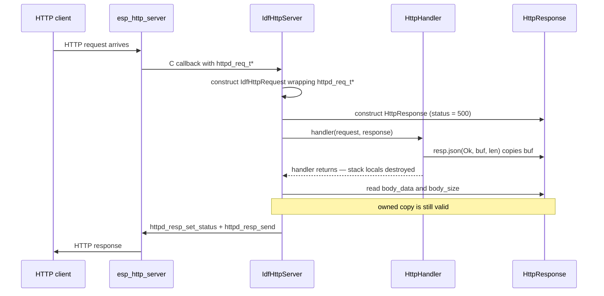

# airgradient-http-server

Generic HTTP server primitive for AirGradient firmware. Provides route
registration and a request/response abstraction backed by `esp_http_server`
so route handler logic can be host-tested without a running server.

## Status

`Experimental` — interface and ESP-IDF driver are implemented and host
tested; the driver has not yet been integrated into a product, so the
default `httpd_config_t` tuning may still change in response to real-world
use.

## Scope

This component owns:

- HTTP server lifecycle (start on a configurable port, stop)
- route registration (HTTP method + exact path + handler callback)
- request abstraction (method, URI, headers, query parameters, body)
- response abstraction (status, headers, body with owning and borrowing
  modes)
- static asset serving helper (registers GET handlers for flash-embedded
  files)
- Kconfig knobs for port, max connections, and request body size cap
- a `TestHttpRequest` helper for consumer host tests

This component does not own:

- endpoints, payload schemas, or product-specific routes
- TLS / HTTPS
- authentication or authorization
- WebSockets or long-lived connections
- CORS headers or preflight handling
- path parameters, wildcards, or pattern-based route matching
- cloud connectivity

## Directory Layout

```text
components/airgradient-http-server/
  hal/
    http_server.h
    http_request.h
    http_response.h
  types/
    http_types.h
  drivers/
    idf_http_server.h
    idf_http_server.cpp
    idf_http_request.h
  tests/
    CMakeLists.txt
    test_http_request.h
    http_handler.tests.cpp
  CMakeLists.txt
  Kconfig
  README.md
```

- `hal/` — public abstract interfaces (`HttpServer`, `HttpRequest`) and the
  concrete response value type (`HttpResponse`)
- `types/` — shared enums, type aliases, and constants (`HttpMethod`,
  `HttpStatus`, `HttpHandler`)
- `drivers/` — `esp_http_server`-backed concrete implementation
- `tests/` — host tests and the reusable `TestHttpRequest` helper

## Public Includes

```cpp
#include "hal/http_server.h"
#include "hal/http_request.h"
#include "hal/http_response.h"
#include "types/http_types.h"
#include "drivers/idf_http_server.h"
```

Guideline:

- include from `hal/` when depending on the server, request, or response
  abstractions
- include from `types/` when only the enums or handler type alias are needed
- include from `drivers/` only when instantiating the ESP-IDF-backed server

## Design

```text
caller -> HttpServer& -> IdfHttpServer -> esp_http_server -> TCP stack
```

Product code creates an `IdfHttpServer`, registers routes through the
abstract `HttpServer &` interface, and starts listening. Handlers receive a
`const HttpRequest &` (abstract, backed by `httpd_req_t*` at runtime) and
an `HttpResponse &` (concrete value type). After the handler returns the
driver reads the response and sends it over the connection.

ESP-IDF headers are confined to `drivers/`; the `hal/` and `types/` headers
use only standard C++ types.

### Types

```cpp
// types/http_types.h

#ifndef TYPES_HTTP_TYPES_H
#define TYPES_HTTP_TYPES_H

#include <cstdint>
#include <functional>

enum class HttpMethod : uint8_t {
  Get,
  Post,
  Put,
  Delete,
};

enum class HttpStatus : uint16_t {
  Ok                  = 200,
  Created             = 201,
  NoContent           = 204,
  BadRequest          = 400,
  NotFound            = 404,
  MethodNotAllowed    = 405,
  InternalServerError = 500,
};

class HttpRequest;
class HttpResponse;

using HttpHandler = std::function<void(const HttpRequest&, HttpResponse&)>;

#endif  // TYPES_HTTP_TYPES_H
```

`HttpHandler` is a `std::function` so it can capture lambdas, free
functions, or bound member functions. The handler receives a const request
reference and a mutable response reference.

### HttpRequest

Abstract class providing lazy access to request data. The ESP-IDF driver
wraps `httpd_req_t*`; host tests use the provided `TestHttpRequest` helper.

```cpp
// hal/http_request.h

#ifndef HAL_HTTP_REQUEST_H
#define HAL_HTTP_REQUEST_H

#include <cstddef>

#include "types/http_types.h"

class HttpRequest {
 public:
  virtual ~HttpRequest() = default;

  virtual HttpMethod method() const = 0;
  virtual const char* uri() const = 0;

  // Body access. Buffered by esp_http_server, size-capped by
  // CONFIG_AG_HTTP_MAX_BODY_SIZE. Returns nullptr for bodyless requests.
  virtual const char* body() const = 0;
  virtual size_t body_length() const = 0;

  // Key-by-key header lookup. Writes into buf and returns true on match.
  virtual bool get_header(const char* name,
                          char* buf,
                          size_t buf_len) const = 0;

  // Key-by-key query-parameter lookup. Writes into buf and returns true
  // on match.
  virtual bool get_query_param(const char* key,
                               char* buf,
                               size_t buf_len) const = 0;
};

#endif  // HAL_HTTP_REQUEST_H
```

Design notes:

- Methods return `const char*` rather than `std::string` to avoid heap
  allocation in the request path.
- `get_header` and `get_query_param` use caller-provided buffers so the
  interface stays allocation-free.
- The driver's concrete request class wraps `httpd_req_t*` and delegates to
  `httpd_req_get_hdr_value_str` and `httpd_query_key_value` respectively.

### HttpResponse

Concrete value type that the handler populates and the driver reads after
the handler returns. Two body modes are supported:

| Mode | Setter | Copy? | When To Use |
|---|---|---|---|
| Owning | `json`, `body` | Yes | Stack-local handler buffers (JSON, dynamic data) |
| Borrowing | `body_static` | No | Flash-embedded assets, string literals, `constexpr` arrays |

The owning mode copies data into an internal `std::string` so the body
survives after the handler's stack frame is destroyed. The borrowing mode
stores a raw pointer and skips the copy — only safe when the data has
static lifetime.

```cpp
// hal/http_response.h

#ifndef HAL_HTTP_RESPONSE_H
#define HAL_HTTP_RESPONSE_H

#include <cstddef>
#include <cstdint>
#include <cstring>
#include <string>

#include "types/http_types.h"

struct HttpHeader {
  const char* name  = nullptr;
  const char* value = nullptr;
};

struct HttpResponse {
  // --- Readable state (inspected by tests and the driver) ---

  HttpStatus status        = HttpStatus::InternalServerError;  // safe default
  const char* content_type = nullptr;

  static constexpr size_t MAX_HEADERS = 4;
  HttpHeader headers[MAX_HEADERS]     = {};
  size_t header_count                 = 0;

  // --- Owning setters (copy data — safe for stack-local buffers) ---

  void json(HttpStatus s, const char* data, size_t len) {
    status       = s;
    content_type = "application/json";
    _owned_body.assign(data, len);
    _static_body = nullptr;
    _body_len    = len;
    _is_static   = false;
  }

  void json(HttpStatus s, const char* data) { json(s, data, std::strlen(data)); }

  void body(HttpStatus s, const void* data, size_t len, const char* ct) {
    status       = s;
    content_type = ct;
    _owned_body.assign(static_cast<const char*>(data), len);
    _static_body = nullptr;
    _body_len    = len;
    _is_static   = false;
  }

  void no_content() {
    status       = HttpStatus::NoContent;
    content_type = nullptr;
    _owned_body.clear();
    _static_body = nullptr;
    _body_len    = 0;
    _is_static   = false;
  }

  // --- Borrowing setter (zero-copy — data must outlive the response) ---

  void body_static(HttpStatus s, const void* data, size_t len, const char* ct) {
    status       = s;
    content_type = ct;
    _static_body = data;
    _body_len    = len;
    _is_static   = true;
    _owned_body.clear();
  }

  // --- Accessors (used by the driver to read the body) ---

  const void* body_data() const {
    return _is_static ? _static_body : _owned_body.data();
  }

  size_t body_size() const { return _body_len; }

  // --- Header helper ---

  void set_header(const char* name, const char* value) {
    if (header_count < MAX_HEADERS) {
      headers[header_count] = {name, value};
      ++header_count;
    }
  }

 private:
  std::string _owned_body;
  const void* _static_body = nullptr;
  size_t _body_len         = 0;
  bool _is_static          = false;
};

#endif  // HAL_HTTP_RESPONSE_H
```

Design notes:

- `status` defaults to `500 Internal Server Error`. If a handler neglects
  to populate the response the result is an error, not an accidental
  `200 OK` with an empty body. This follows the repository convention of
  initialising to invalid/safe sentinels.
- `content_type`, header `name`, and header `value` are `const char*`
  pointing to string literals with static lifetime. No ownership transfer
  occurs.
- `_owned_body` uses `std::string` as a byte buffer. The typical owned
  payload is dynamically generated JSON (100–2 000 bytes) where the copy
  cost is negligible compared to the TCP send that follows.
- `body_static` is the zero-copy path used by `register_static` for
  flash-embedded assets that live in flash for the lifetime of the program.

### HttpServer

Abstract server interface. The non-virtual `register_static` convenience
method builds a GET handler on top of the virtual `register_route`.

```cpp
// hal/http_server.h

#ifndef HAL_HTTP_SERVER_H
#define HAL_HTTP_SERVER_H

#include <cstdint>

#include "hal/http_request.h"
#include "hal/http_response.h"
#include "types/http_types.h"

class HttpServer {
 public:
  virtual ~HttpServer() = default;

  // ISR-safe: no | Thread-safe: no | Blocking: yes (binds socket)
  virtual bool start(uint16_t port) = 0;

  // ISR-safe: no | Thread-safe: no | Blocking: yes
  virtual void stop() = 0;

  // Register a handler for an exact method + path combination.
  // Must be called before start(). Returns false if registration fails.
  // ISR-safe: no | Thread-safe: no | Blocking: no | Allocates: yes
  virtual bool register_route(HttpMethod method,
                              const char* path,
                              HttpHandler handler) = 0;

  // Non-virtual convenience — registers a GET handler that serves
  // flash-embedded data. data_start / data_end come from EMBED_FILES
  // linker symbols.
  bool register_static(const char* uri_path,
                       const uint8_t* data_start,
                       const uint8_t* data_end,
                       const char* content_type) {
    return register_route(
        HttpMethod::Get, uri_path,
        [data_start, data_end, content_type](const HttpRequest&,
                                             HttpResponse& resp) {
          resp.body_static(HttpStatus::Ok, data_start,
                           static_cast<size_t>(data_end - data_start),
                           content_type);
        });
  }
};

#endif  // HAL_HTTP_SERVER_H
```

### TestHttpRequest Helper

The component provides a concrete `TestHttpRequest` that stores canned
values for use in host tests. It lives in `tests/test_http_request.h` and
is linked through the test support library so consumer components and
products can reuse it.

```cpp
// tests/test_http_request.h

#ifndef TESTS_TEST_HTTP_REQUEST_H
#define TESTS_TEST_HTTP_REQUEST_H

#include <cstring>
#include <string>
#include <unordered_map>

#include "hal/http_request.h"

class TestHttpRequest : public HttpRequest {
 public:
  TestHttpRequest(HttpMethod method, const char* uri)
      : _method(method), _uri(uri) {}

  void set_body(const char* data, size_t len) { _body.assign(data, len); }
  void set_header(const char* name, const char* value) { _headers[name] = value; }
  void set_query_param(const char* key, const char* value) { _params[key] = value; }

  HttpMethod method() const override { return _method; }
  const char* uri() const override { return _uri.c_str(); }
  const char* body() const override { return _body.empty() ? nullptr : _body.c_str(); }
  size_t body_length() const override { return _body.size(); }

  bool get_header(const char* name, char* buf, size_t buf_len) const override {
    auto it = _headers.find(name);
    if (it == _headers.end()) return false;
    std::strncpy(buf, it->second.c_str(), buf_len);
    buf[buf_len - 1] = '\0';
    return true;
  }

  bool get_query_param(const char* key, char* buf, size_t buf_len) const override {
    auto it = _params.find(key);
    if (it == _params.end()) return false;
    std::strncpy(buf, it->second.c_str(), buf_len);
    buf[buf_len - 1] = '\0';
    return true;
  }

 private:
  HttpMethod _method;
  std::string _uri;
  std::string _body;
  std::unordered_map<std::string, std::string> _headers;
  std::unordered_map<std::string, std::string> _params;
};

#endif  // TESTS_TEST_HTTP_REQUEST_H
```

### Request–Response Flow



Key points:

- The handler's stack-local buffers are destroyed when the handler returns
  but the `HttpResponse` owns a copy (via `_owned_body`) so the data
  survives for the driver to send.
- For flash-embedded assets (`body_static`) no copy occurs — the pointer
  refers to flash data valid for the lifetime of the program.
- If the handler does not populate the response the default `500` is sent.
  The driver may attach a minimal error body in this case.

### Static Asset Embedding

Products embed static files using ESP-IDF's `EMBED_FILES` in their
`CMakeLists.txt`:

```cmake
idf_component_register(
    SRCS "main.cpp"
    INCLUDE_DIRS "."
    REQUIRES airgradient-http-server
    EMBED_FILES "web/index.html" "web/style.css" "web/app.js"
)
```

The build generates linker symbols for each embedded file. Product init
code registers them through the server:

```cpp
extern const uint8_t index_html_start[] asm("_binary_index_html_start");
extern const uint8_t index_html_end[]   asm("_binary_index_html_end");
extern const uint8_t style_css_start[]  asm("_binary_style_css_start");
extern const uint8_t style_css_end[]    asm("_binary_style_css_end");

server.register_static("/",           index_html_start, index_html_end, "text/html");
server.register_static("/index.html", index_html_start, index_html_end, "text/html");
server.register_static("/style.css",  style_css_start,  style_css_end,  "text/css");
```

`register_static` creates a GET handler that responds with the embedded
data and the given content type. Products that need additional response
headers (for example `Cache-Control`) can register a custom handler instead
of using the convenience method.

## Usage

Typical product wiring:

```cpp
IdfHttpServer server;

server.register_route(HttpMethod::Get, "/api/status", handle_status);
server.register_route(HttpMethod::Post, "/api/config", handle_config_post);
server.register_static("/", index_html_start, index_html_end, "text/html");

server.start(80);
```

Where `handle_status` is a plain function matching `HttpHandler`:

```cpp
void handle_status(const HttpRequest& req, HttpResponse& resp) {
  char buf[256];
  int len = snprintf(buf, sizeof(buf), R"({"uptime_ms":%u})", uptime);
  resp.json(HttpStatus::Ok, buf, static_cast<size_t>(len));
}
```

## Configuration

The component exposes Kconfig knobs under **AirGradient HTTP Server** in
`menuconfig` (see `components/airgradient-http-server/Kconfig`):

| Symbol | Default | Purpose |
|---|---|---|
| `CONFIG_AG_HTTP_PORT` | `80` | Default listen port |
| `CONFIG_AG_HTTP_MAX_CONNECTIONS` | `4` | Maximum concurrent connections |
| `CONFIG_AG_HTTP_MAX_BODY_SIZE` | `4096` | Maximum request body size in bytes |

## Dependencies

- `components/airgradient-common/` — shared types and RTOS abstraction
- `esp_http_server` (ESP-IDF managed component) — underlying HTTP server
  implementation

## Tests

Host tests live in `components/airgradient-http-server/tests/` and run
through the top-level [tests runner](../../tests/README.md). The driver
itself (`drivers/idf_http_server.cpp`) depends on `esp_http_server` and is
covered by the firmware build rather than host tests; the host tests
exercise `HttpResponse`, the `TestHttpRequest` helper, route registration,
and `register_static`.

The component provides a `TestHttpRequest` helper (see
[design](#testhttprequest-helper)) for use in both component-local and
consumer host tests. Since `HttpResponse` is a concrete value type it needs
no mock — tests construct one, call the handler, and inspect the fields
directly:

```cpp
TEST_CASE("status handler returns JSON", "[http]") {
  TestHttpRequest req(HttpMethod::Get, "/api/status");
  HttpResponse resp;

  handle_status(req, resp);

  REQUIRE(resp.status == HttpStatus::Ok);
  REQUIRE(std::string(resp.content_type) == "application/json");
  REQUIRE(resp.body_size() > 0);
}
```

## Notes

Current implementation choices and known follow-ups:

- Unhandled routes fall through to `esp_http_server`'s built-in 404
  response; the driver does not log a warning for them.
- There is no `HttpResponse::send_error(HttpStatus, const char*)`
  convenience yet — handlers build error bodies through `json()` /
  `body()` directly. Add the helper if a repeated pattern emerges.
- `httpd_config_t` is left at `HTTPD_DEFAULT_CONFIG()` apart from
  `server_port` and `max_open_sockets`. Backlog queue length, task stack
  size, and similar knobs can be promoted to Kconfig if a product needs
  to tune them.
- Routes must be registered before `start()`. Calling `register_route()`
  after `start()` is rejected with an error log.
- Request bodies larger than `CONFIG_AG_HTTP_MAX_BODY_SIZE` are
  truncated; the truncation is logged at warning level.
