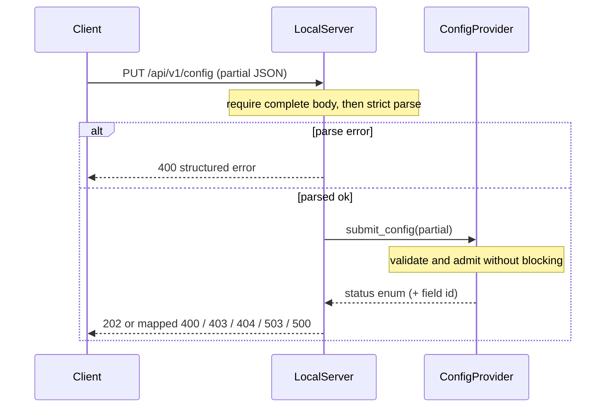

# airgradient-local-server

Generic, product-agnostic local HTTP API (`/api/v1/...`) for AirGradient
devices, layered on `airgradient-http-server`. It owns versioned routing, the
wire schema, JSON serialization, and the structured error model; products
supply live data and config semantics through small abstract providers.

## Status

`Experimental` — the component and its host tests are implemented, but the
API surface (`/api/v1`) has not yet shipped in a released product, and the
discovery (`api=1` mDNS TXT) and client (`python-airgradient`, Home Assistant)
sides of the contract are still being aligned.

## Scope

This component owns:

- versioned route registration under `/api/v1/` (`measures`, `config`,
  `actions/*`) on a shared `HttpServer`
- the wire schema and cJSON serialization for measures and config
- strict complete-body parsing (full-body and unknown-key rejection)
- the structured JSON error model (`code` / `field` / `message`)
- the provider seams (`MeasuresProvider`, `ConfigProvider`, `ActionHandler`)

This component does not own:

- the HTTP server lifecycle (`start` / `stop`) — the product owns it
- its own task — handlers run in the `esp_http_server` httpd task
- mDNS / discovery advertising — lives in `airgradient-wifi` or product wiring
- TLS, authentication, authorization, CORS
- runtime capability discovery — the model string drives the integration's map
- product-specific resources (for example saved recordings)

## Directory Layout

```text
components/airgradient-local-server/
  services/
  hal/
  types/
  internal/
  tests/
  CMakeLists.txt
  Kconfig
  README.md
```

- `services/` — the `LocalServer` facade (route registration + orchestration)
- `hal/` — the abstract provider interfaces products implement
- `types/` — flat config, system info, result enums, and the error-code enum
- `internal/` — cJSON serialization / parsing, isolated from `hal/`
- `tests/` — host tests plus the `fake_providers.h` helpers

## Public Includes

```cpp
#include "services/local_server.h" // facade: begin / end
#include "hal/measures_provider.h" // required provider
#include "hal/config_provider.h"   // optional provider
#include "hal/action_handler.h"    // optional provider
#include "types/local_config.h"    // LocalServerConfig
#include "types/system_info.h"     // SystemInfo
```

Guideline:

- include from `services/` when wiring the server (`LocalServer`)
- include from `hal/` when implementing a provider
- include from `types/` when only the value types or result enums are needed
- `internal/` is private to the component

## Design

```text
product providers -> LocalServer -> HttpServer (route registration) -> httpd
```

`LocalServer` holds references to a shared `HttpServer` and the product's
providers. `begin()` registers the versioned routes for the providers that are
present; `end()` (and the destructor) unregister only the routes this object
registered, leaving co-registered product / provisioning routes untouched.
Handlers run in the httpd task, serialize GET payloads into a per-instance
static scratch buffer, and borrow it zero-copy through
`HttpResponse::body_static`. The component owns every error string; providers
return only enums, so no borrowed provider string is ever serialized.



`202 Accepted` confirms validation and queue admission only. Persistence and
runtime application happen under product ownership after the handler returns.
Clients that need confirmation poll `GET /api/v1/config` for convergence. A
structured `503 busy` is retryable but has no `Retry-After` header.

Parsing always precedes provider policy. Incomplete, malformed, or structurally
invalid bodies return `400` without calling the provider. An empty object is a
valid no-op but still reaches `submit_config()` so the active write gate can
accept it with `202` or reject it with `403`.

Correction parsing preserves whether `intercept` and `scalingFactor` were
present. Products perform semantic validation after parsing. GET serialization
fails rather than emitting a non-null SLR with missing coefficients.

## Usage

```cpp
MyMeasures measures;        // implements MeasuresProvider
MyConfig config;            // implements ConfigProvider
MyActions actions;          // implements ActionHandler

LocalServer local(server, {measures, &config, ConfigAccess::ReadWrite, &actions});
if (!local.begin()) {
  // route registration failed; server left untouched
}
```

See [`services/local_server.h`](services/local_server.h) for the full facade
and the provider lifetime / thread-safety contract.

## Configuration

Configurable through Kconfig under **AirGradient Local Server**:

| Symbol | Default | Purpose |
|---|---|---|
| `CONFIG_AG_LOCAL_SERVER_JSON_BUF` | `3072` | Static scratch buffer for serialized GET payloads, in bytes |

## Dependencies

- `components/airgradient-common/` — shared `Measures` types and logging
- `components/airgradient-http-server/` — server, request / response, routing
- `json` (cJSON, ESP-IDF) — serialization, isolated to `internal/`

## Tests

Host tests live in `components/airgradient-local-server/tests/` and run through
the top-level [tests runner](../../tests/README.md). They cover serialization
(omit-when-invalid / optional `wifiRssi`, nested `corrections`), strict parsing
(unknown key incl. dotted `corrections.*`, bad type / enum, non-object root,
trailing garbage), handler status mapping, and route lifecycle (idempotent /
transactional `begin`, scoped `end`, RAII teardown) using `fake_providers.h`.
Handler coverage includes asynchronous `202`, retryable `503`, complete-body
precedence, empty submissions, and config/action busy results. Correction tests
cover each missing SLR coefficient independently.

## Notes

- Unknown keys on `PUT /config` are rejected with `400 unknown_field`; a
  within-version catalog addition must be coordinated so older firmware does
  not reject a newer client's field.
- Non-catalog paths (for example `/api/v1/actions/foo`) fall through to the
  http-server's default `404` and are not wrapped in the structured envelope.
- Successful actions return an empty `200` without a content type. Temporary
  action queue pressure returns structured `503 busy`.
- Extended measurement groups (battery / pressure / electrode / dual-channel)
  and product-specific config fields are deferred; add them as flat optional
  fields when a product exposes them.
