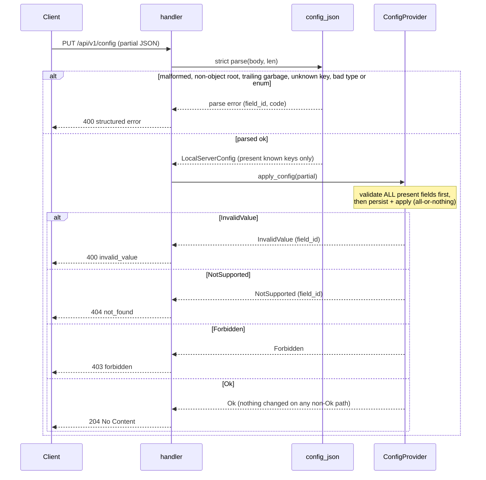

# airgradient-local-server Spec

> **This is a spec.** It describes how a feature **will be built**, not what
> currently exists. Once the feature ships, the component README becomes the
> source of truth and this file is typically deleted. See `docs/STYLE.md` →
> "Doc Lifecycle".

A generic, product-agnostic local HTTP API for AirGradient ESP-IDF devices,
layered on `airgradient-http-server`. It exposes a small **versioned** API
(`/api/v1/...`) for measurements, configuration, and commands, consumed
primarily by Home Assistant. This is a **light redesign** — not a port of the
legacy Arduino local server — driven by two new device models arriving on this
codebase. It keeps the surface small: separate configuration (durable settings)
from commands (actions), let the device model define what a unit supports
(no runtime capability discovery), and use a clean flat config schema. The
primary engineering win is the component itself: generic, host-testable, and
reusable across products, with the wire schema and JSON owned by the component
and live data plus config semantics supplied by the product through small
abstract providers.

## Problem

The local HTTP server only exists today inside the Arduino monolith
(`examples/OneOpenAir/LocalServer.{h,cpp}`), and its design has aged badly:

- **Arduino-bound transport** — it runs a dedicated `webserver` task looping on
  `server.handleClient()` because Arduino's `WebServer` is poll-based. This repo
  uses `esp_http_server` (via `airgradient-http-server`), which runs its own
  internal task, so a separate task is unnecessary.
- **No product seam** — payload building and config parsing are wired to global
  `Measurements` and `Configuration` objects, so the logic cannot be shared by
  products with different settings structs (`GoSettings`, etc.).
- **Commands disguised as settings** — actions such as CO2 calibration and LED
  test are modeled as boolean config fields (`co2CalibrationRequested`), mixing
  fire-and-forget commands into durable configuration.
- **No versioning** — the API evolves in place, so any change risks breaking
  consumers.
- **Untestable on host** — handler logic is welded to globals and the Arduino
  server.

Two of AirGradient's four device models are new and arrive on this codebase, so
nothing in the field expects a legacy schema from them. That makes a small,
versioned redesign low-risk and a sensible moment to fix the command/settings
mix and the lack of versioning — without overbuilding.

## Goals

- A generic component reusable by every product, owning versioned routing, the
  wire schema, JSON, and the structured error model.
- A small **versioned** API under `/api/v1/`: `measures`, `config`, `actions/*`.
- Small abstract provider seams (`MeasuresProvider`, `ConfigProvider`,
  `ActionHandler`) so products supply live data and config semantics without the
  component seeing product types.
- A clean **settings-vs-command split**: durable settings under `config`
  (GET / partial PUT), commands under `actions/*` (POST).
- A **flat configuration schema**: one object, every field optional, named by
  function; each device emits and accepts only the subset its model supports.
- Host-testable: providers are faked under `TEST_HOST`; ESP-IDF and
  `esp_http_server` stay confined to `airgradient-http-server`.
- Discovery alignment: devices are found by Home Assistant over mDNS and
  distinguished by an `api` TXT record (advertised outside this component).

## Non-Goals

- **No runtime capability discovery** — there is no `capabilities` endpoint. With
  four models and AirGradient owning the Home Assistant integration, the model
  string maps to supported fields, actions, and value ranges on the integration
  side. Device identity (`model`, `serial`, `firmware`) rides in the measures
  payload so the integration can do that mapping.
- **No server lifecycle ownership** — the product owns `HttpServer::start()` and
  `stop()`. `LocalServer` only registers / unregisters its routes (lazily).
- **No own task** — handlers run in the `esp_http_server` httpd task.
- **No mDNS ownership** — the component documents the discovery contract; mDNS
  registration lives in `airgradient-wifi` or product wiring.
- **No TLS/HTTPS, authentication, authorization, or CORS** — those belong to
  `airgradient-http-server` or a future component.
- **No product-specific config fields yet** — the config catalog ships with the
  common fields only. Product-specific HTTP fields (for example Go's GPS or
  buzzer settings) are added later as flat optional fields when a product
  actually exposes them; Go remains BLE-centric for its niche settings for now.
- **No extended measurement groups yet** — only the common monitor fields ship
  in v1; battery / pressure / electrode / dual-channel groups are deferred (see
  Measures Schema).

## Dependencies

- `airgradient-http-server` — the underlying server, request/response, and route
  registration. **This feature requires two changes there** (see Implementation
  Plan): adding `Forbidden = 403` to the `HttpStatus` enum and its
  `status_phrase()` map, and (optional) a borrowed-body `json_static()` helper on
  `HttpResponse`.
- `airgradient-common` — the shared `Measures` types in `measures_types.h`.
- `cJSON` (ESP-IDF) — serialization, isolated to `internal/`.

## Design

### Resource Model

```text
GET   /api/v1/measures              sensor readings + identity + wifi_rssi
GET   /api/v1/config                current settings (flat, supported fields only)
PUT   /api/v1/config                partial settings update -> 204 No Content
POST  /api/v1/actions/calibrate_co2 trigger CO2 calibration (fire-and-forget) -> 200
POST  /api/v1/actions/test_leds     trigger LED test (fire-and-forget) -> 200
```

Durable settings and fire-and-forget commands are separated by nature. The API
version lives in the path (`/api/v1`): it is the in-band version signal and
yields a clean `404` if a client targets the wrong version. Device identity is
carried in the measures payload because the Home Assistant integration reads the
model from there to drive its model-based mapping.

Because `airgradient-http-server` matches URIs **exactly** (no wildcards), each
action is a **concrete** route (`/api/v1/actions/calibrate_co2`,
`/api/v1/actions/test_leds`), not one dynamic `/actions/<id>` route. When an
`ActionHandler` is present, the component registers a route for every catalog
action, so every known action path is handled and returns a structured response.
A request to a **non-catalog** path (for example `/api/v1/actions/foo`) falls
through to the http-server's default `404` and is therefore **not** wrapped in
the structured error envelope; the structured-error guarantee applies to requests
routed to a local-server handler.

Product-specific resources (for example Go's saved recordings) are registered by
the product directly on the shared `HttpServer`; the component neither owns nor
knows about them.

### Component Layout

```text
components/airgradient-local-server/
  services/
    local_server.h              # facade: begin / end (route registration)
  hal/
    measures_provider.h         # required provider
    config_provider.h           # optional provider
    action_handler.h            # optional provider
  types/
    local_config.h              # LocalServerConfig (flat, std::optional fields)
    system_info.h               # SystemInfo (serial, model, firmware, wifi_rssi)
    local_server_result.h       # ConfigApplyResult, ActionResult, ConfigAccess, ActionId
    api_error.h                 # structured error code enum
  internal/
    measures_json.{h,cpp}       # serialize measures (cJSON)
    config_json.{h,cpp}         # serialize / parse config (cJSON)
  tests/
    fake_providers.h
    measures_json.tests.cpp
    config_json.tests.cpp
    handler.tests.cpp
  CMakeLists.txt
  Kconfig
  README.md
```

### Provider Seams

The dependency arrow always points product → component; the component never
includes product types. Providers are injected by reference and must outlive the
`LocalServer`.

```cpp
// hal/measures_provider.h
//
// Ownership : product owns the implementation.
// Lifetime  : must outlive the LocalServer.
// Thread-safe: yes — called from the httpd task; return cached snapshots.
// Blocking  : should not block.
class MeasuresProvider {
 public:
  virtual ~MeasuresProvider() = default;

  // Snapshot of current readings for GET /api/v1/measures.
  virtual Measures get_measures() = 0;

  // Identity + link info embedded in the measures payload.
  virtual SystemInfo get_system_info() = 0;
};
```

```cpp
// types/system_info.h
//
// wifi_rssi is optional: std::nullopt when the link quality is unavailable, in
// which case the key is omitted from the measures payload.
struct SystemInfo {
  char serial_number[24] = {};
  char model[32] = {};
  char firmware[16] = {};
  std::optional<int> wifi_rssi;  // dBm; omitted when unavailable
};
```

```cpp
// hal/config_provider.h
class ConfigProvider {
 public:
  virtual ~ConfigProvider() = default;

  // Current settings mapped into the flat schema for GET /api/v1/config.
  // Unsupported fields are std::nullopt and omitted from the JSON.
  virtual LocalServerConfig get_config() = 0;

  // Validate and apply a partial config (only present fields set). MUST be
  // all-or-nothing: validate every present field first (range, enum, model
  // support, configuration_control gate); if any field fails, persist and apply
  // NOTHING and return the failing field. Only after full validation passes may
  // it persist and apply. A rejected PUT therefore never leaves some fields
  // changed.
  //
  // Products MUST funnel local config writers (HTTP, BLE, UI) into one internal
  // apply path so the channels cannot drift.
  virtual ConfigApplyResult apply_config(const LocalServerConfig &partial) = 0;
};
```

```cpp
// hal/action_handler.h
//
// Actions are fire-and-forget commands. trigger() must not block: it dispatches
// the work (for example queues a CO2 calibration on the product's worker) and
// returns immediately. No progress is reported; a consumer observes the effect
// indirectly (for example the CO2 reading settling after calibration).
class ActionHandler {
 public:
  virtual ~ActionHandler() = default;

  // Dispatch a named action. The component maps the result to a status:
  // Dispatched -> 200, Rejected -> 403, NotSupported -> 404.
  virtual ActionResult trigger(ActionId action) = 0;
};
```

```cpp
// types/local_server_result.h
//
// Results are pointer-free: providers return only enums. The component owns
// and serializes all error strings (canonical field name + a standardized
// message per status). This removes any borrowed-string lifetime hazard — a
// provider can never accidentally return a stack/local pointer that dangles
// during error serialization.
enum class ConfigAccess : uint8_t { Disabled, ReadOnly, ReadWrite };

// Mirrors the config catalog; the component maps each id to its canonical wire
// key (e.g. CountryCode -> "country") when building an error body. None is used
// when no specific field applies.
enum class ConfigFieldId : uint8_t {
  None,
  CountryCode,
  PmStandard,
  TempUnit,
  CloudEnabled,
  ConfigurationControl,
  Co2CalibDays,
  TvocOffset,
  NoxOffset,
  LedBarMode,
  LedBarBrightness,
  DisplayBrightness,
};

enum class ConfigApplyStatus : uint8_t {
  Ok,           // accepted, persisted, applied        -> 204
  InvalidValue, // out of range / bad enum (semantic)  -> 400
  Forbidden,    // configuration_control gate / policy -> 403
  NotSupported, // field not supported on this model   -> 404
  Internal,     // persistence / apply failure         -> 500
};

struct ConfigApplyResult {
  ConfigApplyStatus status = ConfigApplyStatus::Internal;
  // The offending field for InvalidValue / NotSupported; None otherwise. The
  // component maps it to the canonical wire key in the error body.
  ConfigFieldId field = ConfigFieldId::None;
};

enum class ActionId : uint8_t { CalibrateCo2, TestLeds };
enum class ActionStatus : uint8_t {
  Dispatched,   // accepted and queued (fire-and-forget) -> 200
  Rejected,     // policy / state gate                   -> 403
  NotSupported, // action not available on this model    -> 404
};

struct ActionResult {
  ActionStatus status = ActionStatus::NotSupported;
};
```

```cpp
// services/local_server.h
//
// Ownership : holds references only; the HttpServer and all providers MUST
//             outlive this object.
// Copy/move : non-copyable, non-movable (handlers capture `this`).
// Thread-safe: no (begin / end are setup-time calls from one task).
// Blocking  : no.
class LocalServer {
 public:
  struct Providers {
    MeasuresProvider &measures;                          // required
    ConfigProvider *config = nullptr;                    // optional
    ConfigAccess config_access = ConfigAccess::Disabled; // GET and/or PUT
    ActionHandler *actions = nullptr;                    // optional
  };

  LocalServer(HttpServer &server, const Providers &providers);

  // RAII: unregisters any routes still registered, so no captured-`this`
  // handler can outlive the object on the server.
  ~LocalServer();

  LocalServer(const LocalServer &) = delete;
  LocalServer &operator=(const LocalServer &) = delete;
  LocalServer(LocalServer &&) = delete;
  LocalServer &operator=(LocalServer &&) = delete;

  // Register the versioned routes for the providers that are present:
  //   measures            -> GET  /api/v1/measures
  //   config ReadOnly     -> GET  /api/v1/config
  //   config ReadWrite    -> GET + PUT /api/v1/config
  //   actions present     -> POST /api/v1/actions/<id> for EVERY ActionId in
  //                          the catalog, regardless of model support
  //                          (unsupported -> structured 404 at request time)
  //
  // Idempotent: a no-op returning true if already begun. Transactional: if any
  // route fails to register, the routes registered so far in this call are
  // rolled back (unregistered) and begin() returns false. May be called lazily
  // (for example when the device joins a network).
  bool begin();

  // Unregister ONLY the routes this LocalServer registered (tracked in
  // _routes). Never calls HttpServer::unregister_all(), so product- or
  // provisioning-owned routes on the same server are untouched. Safe to call
  // when not begun.
  void end();

 private:
  struct OwnedRoute {
    HttpMethod method;
    const char *path;  // static-lifetime literal
  };

  void _handle_get_measures(const HttpRequest &, HttpResponse &);
  void _handle_get_config(const HttpRequest &, HttpResponse &);
  void _handle_put_config(const HttpRequest &, HttpResponse &);
  void _handle_action(ActionId action, const HttpRequest &, HttpResponse &);

  HttpServer &_server;
  MeasuresProvider &_measures;
  ConfigProvider *_config;
  ConfigAccess _config_access;
  ActionHandler *_actions;

  static constexpr size_t MAX_OWNED_ROUTES = 5;  // measures + config x2 + 2 actions
  OwnedRoute _routes[MAX_OWNED_ROUTES] = {};
  size_t _route_count = 0;
  bool _begun = false;
};
```

### Lifecycle and Route Ownership

`LocalServer` shares the `HttpServer` with other route owners (the provisioning
captive portal, product-specific routes). It must therefore never touch routes
it did not register.

- **Owns only its routes.** Every successful `register_route` is recorded in
  `_routes` with its method and static-lifetime path. `end()` unregisters
  exactly those (via `HttpServer::unregister_route`) and clears the list. It
  **never** calls `HttpServer::unregister_all()`.
- **Transactional `begin()`.** Routes are registered in order; if any fails, the
  ones already registered in that call are rolled back and `begin()` returns
  `false`, leaving the server as it was. `begin()` is idempotent — a no-op
  returning `true` when `_begun` is already set.
- **RAII teardown.** `~LocalServer()` calls `end()`, so a destroyed
  `LocalServer` can never leave a captured-`this` handler registered on the
  server. Because the destructor touches `_server`, the `HttpServer` must
  outlive the `LocalServer`; the providers must too.
- **Non-copyable, non-movable.** Handlers capture `this`; copying or moving would
  invalidate those captures. Both are `= delete`d.

### Measures Schema

Single corrected value per field. A field is **omitted** whenever it is
unsupported by the model **or** currently invalid (per the `Measures`
`is_*_valid()` methods) — there is no `null` form. The distinction is
unnecessary: the Home Assistant integration already treats a missing key and a
`null` identically (it defers creating the entity until a real value appears),
and which sensors a device has is known from the model. Identity (`serial`,
`model`, `firmware`) and `wifi_rssi` (when available) are included so the
integration can map by model.

| v1 wire | Source (`measures_types.h` / `SystemInfo`) | Legacy wire |
|---|---|---|
| `serial` | `SystemInfo::serial_number` | `serialno` |
| `model` | `SystemInfo::model` | `model` |
| `firmware` | `SystemInfo::firmware` | `firmware` |
| `wifi_rssi` | `SystemInfo::wifi_rssi` (optional) | `wifi` |
| `co2` | `CO2Data::co2` | `rco2` |
| `pm01` | `PMData::pm_01` | `pm01` |
| `pm25` | `PMData::pm_25` | `pm02` |
| `pm10` | `PMData::pm_10` | `pm10` |
| `pm003_count` | `PMData::pm_03_pc` | `pm003Count` |
| `temp` | `TempHumData::temperature` | `atmp` |
| `humidity` | `TempHumData::humidity` | `rhum` |
| `tvoc_index` | `TVOCNOxData::tvoc_index` | `tvocIndex` |
| `tvoc_raw` | `TVOCNOxData::tvoc_raw` | `tvocRaw` |
| `nox_index` | `TVOCNOxData::nox_index` | `noxIndex` |
| `nox_raw` | `TVOCNOxData::nox_raw` | `noxRaw` |

```json
{ "serial": "aabbccddeeff", "model": "O-1PST", "firmware": "2.0.0",
  "wifi_rssi": -57, "co2": 612, "pm01": 5, "pm25": 8, "pm10": 9,
  "temp": 24.3, "humidity": 47.1, "tvoc_index": 101, "nox_index": 1 }
```

**Deferred groups** (present in `Measures` but not exposed in v1; add as flat
optional fields when a product needs them): `power` (battery / charging
voltage), `pressure` / `altitude`, `electrode` (O3 / NO2), and the dual-channel
`temp_hum_b` / `pm_b`. Go is battery-powered and has pressure, so `battery` and
`pressure` are the most likely first additions.

### Config Schema

One **flat** object; every field optional in the wire and in `LocalServerConfig`
(`std::optional<T>`). Fields are named by function, not by product. The
component owns the catalog as a **union** of known fields; a device emits only
the fields its model supports (GET) and applies only the present supported
fields (PUT). Enum string values are kept identical to the existing Home
Assistant integration to minimize its churn. Adding a future field (including a
product-specific one) is a non-breaking addition of one optional field.

The catalog ships with the **common** fields only:

| v1 wire | Type | Values / range | Legacy | Notes |
|---|---|---|---|---|
| `country` | string(2) | ISO-3166 alpha-2 | `country` | locale for AQI |
| `pm_standard` | enum | `ugm3` / `us-aqi` | `pmStandard` | |
| `temp_unit` | enum | `c` / `f` | `temperatureUnit` | |
| `cloud_enabled` | bool | — | `postDataToAirGradient` | Go `disable_cloud` is the inverse |
| `configuration_control` | enum | `cloud` / `local` / `both` | `configurationControl` | product enforces the gate |
| `co2_calib_days` | int | 0–30 (0 = ABC off) | `abcDays` | days |
| `tvoc_offset` | int | 0–720 | `tvocLearningOffset` | days |
| `nox_offset` | int | 0–720 | `noxLearningOffset` | days |
| `led_bar_mode` | enum | `off` / `co2` / `pm` | `ledBarMode` | LED-bar models |
| `led_bar_brightness` | int | 0–100 | `ledBarBrightness` | LED-bar models |
| `display_brightness` | int | 0–100 | `displayBrightness` | display models |

```cpp
// types/local_config.h (excerpt)
struct LocalServerConfig {
  std::optional<std::string> country;                // "country"
  std::optional<std::string> pm_standard;            // "pm_standard"
  std::optional<std::string> temp_unit;              // "temp_unit"
  std::optional<bool> cloud_enabled;                 // "cloud_enabled"
  std::optional<std::string> configuration_control;  // "configuration_control"
  std::optional<int> co2_calib_days;                 // "co2_calib_days"
  std::optional<int> tvoc_offset;                    // "tvoc_offset"
  std::optional<int> nox_offset;                     // "nox_offset"
  std::optional<std::string> led_bar_mode;           // "led_bar_mode"
  std::optional<int> led_bar_brightness;             // "led_bar_brightness"
  std::optional<int> display_brightness;             // "display_brightness"
  // Product-specific fields (for example buzzer_enabled, gps_interval_s) are
  // added here as flat optional fields when a product exposes them over HTTP.
};
```

`configuration_control` stays a normal catalog field: the component serializes
and parses it like any other, and the product's apply path enforces the
cloud-vs-local gate. The component holds no config policy.

### Actions

Commands, not settings — the legacy modeled these as boolean config fields. Each
is a concrete `POST /api/v1/actions/<id>` route with an empty request body and an
empty success body. Actions are **fire-and-forget**: the handler dispatches the
work and returns `200 OK` immediately. No progress is tracked or reported — a
consumer observes the effect indirectly (for example the CO2 reading settling
after calibration). A status or progress resource can be added later if a
consumer ever needs it; it would live on the action, never in the measures
payload.

| Action id | Route | Legacy field | Supported by |
|---|---|---|---|
| `calibrate_co2` | `/api/v1/actions/calibrate_co2` | `co2CalibrationRequested` | devices with a CO2 sensor |
| `test_leds` | `/api/v1/actions/test_leds` | `ledBarTestRequested` | devices with controllable LEDs |

When an `ActionHandler` is registered, the component registers a route for
**every** catalog action (every `ActionId`), not just the supported ones.
Support is decided at request time: `trigger()` returns `NotSupported` (mapped to
a structured `404 not_found`) for an action the model lacks. Consequently every
catalog action path returns a structured body (`200` or structured `404`); a
**bare** `404` occurs only for non-catalog paths (for example
`/api/v1/actions/foo`), which a model-aware client never requests. The
integration's model map decides whether to surface a button at all, so it never
needs to disambiguate a bare `404` from a structured one.

### Validation Split

- **Component** — JSON well-formedness (strict full-body parse), **unknown-key
  rejection**, per-known-field type checks, and known-enum membership. On failure
  it returns a structured error (`invalid_body`, `unknown_field`, or
  `invalid_value`).
- **Product (`apply_config` / `trigger`)** — semantic range validation
  (`InvalidValue`), the `configuration_control` gate (`Forbidden`), persistence,
  runtime apply, and action effects. `apply_config` is **all-or-nothing**: it
  validates every present field before persisting/applying anything, so a
  rejected partial PUT changes no fields (see `ConfigProvider`).

The component owns every error string. Providers return only enums
(`ConfigApplyResult` / `ActionResult`); the component maps `ConfigFieldId` to its
canonical wire key and the status to a standardized message when building the
error body. No provider-borrowed strings are serialized, so there is no
dangling-pointer hazard.

Unknown keys on `PUT /config` are **rejected** with `400 unknown_field` (not
silently ignored), so typos such as `temp_units` fail loudly. Consequence:
because clients are model- and version-aware through the integration, this is
safe; but a within-version catalog addition must be coordinated so an older
firmware does not reject a newer client's field. New fields should therefore be
introduced alongside a client that only sends them to firmware known to accept
them.

### Request Body Parsing

`config_json::parse` performs **strict full-body** parsing — no "first valid
object wins":

- Parse with the explicit body length via `cJSON_ParseWithLengthOpts(body, len,
  &end, ...)` (the body buffer is not assumed null-terminated).
- **Reject malformed JSON** (null parse result) → `400 invalid_body`.
- **Reject a non-object root** (array, string, number, etc.) → `400 invalid_body`.
- **Reject trailing non-whitespace** after the root object — verify `end`
  reached the end of the buffer modulo trailing whitespace → `400 invalid_body`.

This is stricter than `airgradient-provisioning`'s lenient `cJSON_Parse`; the
length/opts variant is required so trailing garbage and truncated bodies are
caught rather than silently accepted.

### Error Model

Structured JSON for every request routed to a local-server handler. The
component composes the body entirely from its own strings: `code` from the error
case, `field` (when applicable) from the canonical wire key mapped from
`ConfigFieldId`, and `message` a standardized phrase for the status.

```json
{ "error": { "code": "invalid_value", "field": "temp_unit",
             "message": "invalid value" } }
```

| Case | Status | `error.code` |
|---|---|---|
| GET success | 200 | — |
| PUT config accepted | 204 | — |
| Action dispatched (fire-and-forget) | 200 | — |
| Malformed body | 400 | `invalid_body` |
| Unknown config key | 400 | `unknown_field` |
| Bad type / enum / out of range | 400 | `invalid_value` |
| Config rejected by policy / lock | 403 | `forbidden` |
| Catalog action not supported on model / config field not supported | 404 | `not_found` |
| Provider / serialize failure | 500 | `internal` |

Unregistered paths (including unknown `/api/v1/actions/*`) are answered by the
http-server's default `404` and are not wrapped in this envelope.

### PUT /api/v1/config Flow



### Memory and Threading

- **No dedicated task** — handlers run in the `esp_http_server` httpd task, which
  serializes requests.
- **Zero-copy GET responses** — handlers serialize into a single static scratch
  buffer of `CONFIG_AG_LOCAL_SERVER_JSON_BUF` bytes with `cJSON_PrintPreallocated`,
  then respond with `HttpResponse::body_static(HttpStatus::Ok, buf, len,
  "application/json")`. `body_static` borrows (no copy); `json()` would copy into
  an owned `std::string` and defeat the buffer's purpose, so it is **not** used
  for these payloads. Borrowing is safe because requests are serialized and the
  driver sends the body synchronously in `_trampoline` before the next request
  can reuse the buffer. An optional `HttpResponse::json_static()` convenience may
  be added upstream to set `application/json` and borrow in one call.
- **Transient cJSON heap** of roughly 4–6 KB at peak per request (the cJSON tree),
  freed before the handler returns.
- **Request body** is read and capped by `airgradient-http-server`.
- **Provider thread-safety** is the product's responsibility: provider methods
  run on the httpd task and should return cached snapshots without blocking.

### Configuration

| Symbol | Default | Purpose |
|---|---|---|
| `CONFIG_AG_LOCAL_SERVER_JSON_BUF` | `3072` | Static scratch buffer for serialized GET payloads, in bytes |

The httpd task stack size is owned by `airgradient-http-server`
(`HTTPD_DEFAULT_CONFIG()` default of 4096 bytes); promote it to Kconfig there if
the firmware build shows cJSON stack pressure.

## Integration

This API is one side of a contract spanning three repositories. The firmware
component owns only the HTTP surface; the other two pieces must be updated in
lockstep for end-to-end discovery and control. Each is out of scope for this
component but in scope for the feature.

### airgradient-wifi (and product wiring)

The discovery contract lives outside this component. `airgradient-wifi` (or the
product) must advertise the device over mDNS so Home Assistant finds it and can
route to the correct API version.

- **Service:** `_airgradient._tcp` on the HTTP port (default 80).
- **Hostname:** `airgradient-<serial>.local` (the legacy used the
  `airgradient_<serial>` underscore form; standardize on the hyphen).
- **TXT records:** `vendor=AirGradient`, `model`, `serialno`, `fw_ver`, and the
  new **`api=1`** key. `api` is the routing signal: its presence marks a v1-API
  device; its absence marks a legacy device.
- **Stability:** `serialno` must stay stable across a legacy → new firmware
  upgrade so the device keeps its Home Assistant identity; the integration
  re-reads `api` on reconnect and switches paths.

Work item: add an mDNS responder hook in `airgradient-wifi` (or product wiring)
that registers the service and TXT records after the device gets an IP, sourcing
`model` / `serialno` / `fw_ver` from the same identity used by `SystemInfo`.

### python-airgradient (client library)

`airgradienthq/python-airgradient` must become **version-aware** while keeping
the legacy path working:

- Add a client path targeting `/api/v1/measures`, `/api/v1/config`, and
  `POST /api/v1/actions/<id>`.
- Add a model with the new `snake_case` keys and **optional** fields (unlike the
  current all-required `Config` model that raises `MissingField`).
- Map the short wire keys to the existing descriptive dataclass attributes via
  `mashumaro` aliases (for example wire `temp` → `ambient_temperature`,
  `co2` → `rco2`), so downstream attribute names need not change.
- Reuse the existing `StrEnum` value strings (`ugm3`, `us-aqi`, `c`, `f`, `off`,
  `co2`, `pm`, `cloud`/`local`/`both`) — only keys and transport change.
- Send `PUT /api/v1/config` partial bodies and expect `204`; replace the
  action-via-config-PUT calls (`request_co2_calibration`, `request_led_bar_test`)
  with `POST /api/v1/actions/<id>` expecting `200`.

### Home Assistant core (`homeassistant/components/airgradient`)

The HA integration must learn the v1 API while continuing to serve legacy
devices in the same install:

- **Discovery branch:** the zeroconf matcher already matches
  `_airgradient._tcp.local.`; add handling that reads the `api` TXT property and
  selects the new client path when present (falling back to a
  `GET /api/v1/measures` probe if needed).
- **Model-based mapping:** keep deciding which config / LED / display entities,
  actions, and value ranges apply from the device model string (read from the
  measures payload). With four models this stays a small, integration-owned map
  — no device capability endpoint needed.
- **Per-device coordinators:** each device keeps its own config entry and
  coordinator keyed by `serial`, so a legacy device and a v1-API device coexist
  with distinct unique IDs (`{serial}-{key}`) and no collisions.
- **Actions:** map the `button` / command entities to
  `POST /api/v1/actions/<id>`.

```text
firmware (this component)   --advertises api=1-->  HA discovery
python-airgradient client   <--polls /api/v1-->    HA coordinator
legacy device (no api TXT)  --legacy /measures/current-->  HA legacy path
```

## Implementation Plan

Each step is sized to land as a focused commit.

1. **airgradient-http-server prerequisites:** add `Forbidden = 403` to the
   `HttpStatus` enum and `status_phrase()`; optionally add
   `HttpResponse::json_static()` (borrowed `application/json`). Update that
   component's tests and README.
2. Add value types: `types/local_config.h` (flat, optional), `types/system_info.h`
   (optional `wifi_rssi`), `types/local_server_result.h`, `types/api_error.h`.
3. Add `internal/measures_json.{h,cpp}` (serialize `Measures` + `SystemInfo`)
   with host tests for omit-when-invalid-or-unsupported and optional `wifi_rssi`.
4. Add `internal/config_json.{h,cpp}` (serialize + **strict full-body** parse via
   `cJSON_ParseWithLengthOpts`, non-object-root / trailing-garbage / unknown-key
   rejection, `ConfigFieldId`-based errors) with host tests for partial bodies,
   unknown-key `400`, type / enum errors, non-object root, and trailing garbage.
5. Add `hal/` provider interfaces and `services/local_server.{h,cpp}` (facade + four
   handlers; non-copyable/non-movable; RAII `~LocalServer` calls `end()`;
   idempotent + transactional `begin()`; tracked-route `end()` using
   `unregister_route` only; `ConfigAccess` route selection; concrete action
   routes; result → status mapping), plus `tests/fake_providers.h` and handler
   tests.
6. Add `CMakeLists.txt` and `Kconfig` (`CONFIG_AG_LOCAL_SERVER_JSON_BUF`); wire
   into the build and host-test runner.
7. Add the component `README.md` per `docs/templates/component_readme.md`.
8. Add a concrete provider set and wiring to the reference product, then build
   the reference firmware.
9. Integration follow-ups (separate repos / components): mDNS TXT in
   `airgradient-wifi`; `/api/v1` path in `python-airgradient`; discovery + model
   mapping in HA core.

## Testing Strategy

- **Serialize tests** — partially populated `Measures` emits only valid+supported
  keys (no nulls), with identity and `wifi_rssi` only when present; a
  `LocalServerConfig` subset emits only present keys.
- **Parse tests** — valid partial body applies; unknown key → `400 unknown_field`;
  wrong type / bad enum → `400 invalid_value`; malformed JSON, **non-object root**,
  and **trailing garbage after the root** → `400 invalid_body`.
- **Handler tests** — drive every handler with fakes and assert status / body for:
  GET success; `PUT` → `204`; `ConfigApplyStatus` mapped to `400` / `403` / `404`
  / `500` with the component-composed `field` (from `ConfigFieldId`) and message;
  action → `200`; `NotSupported` action → `404`. Verify `ConfigAccess` controls
  route presence (`Disabled` → no `/config`; `ReadOnly` → no `PUT`) and that
  absent `actions` leaves action routes unregistered.
- **Lifecycle tests** — `begin()` is idempotent (second call is a no-op `true`);
  a forced mid-registration failure rolls back so no partial routes remain;
  `end()` unregisters only this server's routes and leaves a co-registered
  foreign route intact; destruction unregisters remaining routes.
- **Host build and run** — `cmake --build tests/build` and
  `ctest --test-dir tests/build --output-on-failure`.
- **Firmware build** — the reference product builds with real providers after
  exporting ESP-IDF; confirms the `body_static` zero-copy path against the real
  driver.
- **Manual / integration** — discover a v1-API device in Home Assistant alongside
  a legacy device; confirm model-mapped entities and action buttons.

## Open Questions

- Final ranges for `co2_calib_days` (0–30 proposed), `tvoc_offset` / `nox_offset`
  (0–720 days proposed) — confirm against sensor guidance.
- Does `country` belong in the common config, or is it monitor-only?
- Does Go expose `test_leds` (its LEDs differ in kind from the monitor LED bar)?
- When to surface the deferred measurement groups (battery / pressure first for
  Go) and their flat field names.
- Which product-specific config fields (if any) Go will eventually expose over
  HTTP, and their flat names.
- The `api` mDNS TXT value form: integer (`api=1`) vs semantic (`api=v1`) — pick
  what the HA zeroconf matcher will key on.
