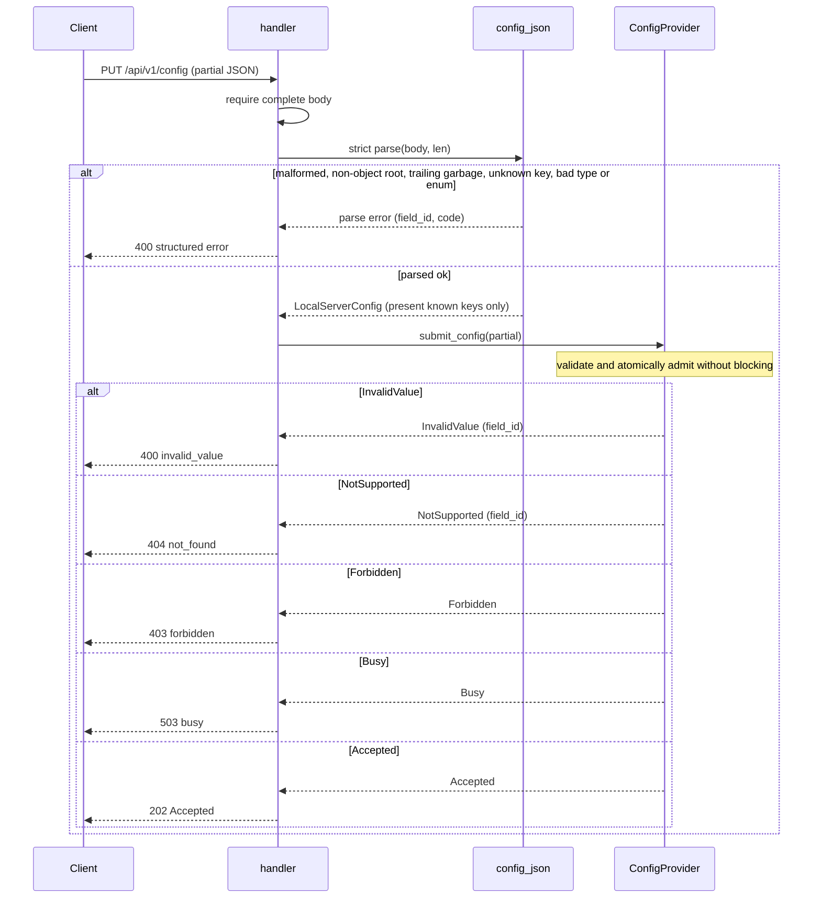

# airgradient-local-server Spec

> **This is a spec.** It describes how a feature **will be built**, not what
> currently exists. Once the feature ships, the component README becomes the
> source of truth and this file is typically deleted. See `docs/STYLE.md` →
> "Doc Lifecycle".

A generic, product-agnostic local HTTP API for AirGradient ESP-IDF devices,
layered on `airgradient-http-server`. It exposes a small **versioned** API
(`/api/v1/...`) for measurements, configuration, and commands, consumed
primarily by Home Assistant. This is a **light redesign** — not a port of the
legacy Arduino local server — driven by two new device models arriving on this
codebase. It keeps the surface small: separate configuration (durable settings)
from commands (actions), let the device model define what a unit supports
(no runtime capability discovery), and use a mostly-flat config schema (one
nested exception, `corrections`). The
primary engineering win is the component itself: generic, host-testable, and
reusable across products, with the wire schema and JSON owned by the component
and live data plus config semantics supplied by the product through small
abstract providers.

## Problem

The local HTTP server only exists today inside the Arduino monolith
(`examples/OneOpenAir/LocalServer.{h,cpp}`), and its design has aged badly:

- **Arduino-bound transport** — it runs a dedicated `webserver` task looping on
  `server.handleClient()` because Arduino's `WebServer` is poll-based. This repo
  uses `esp_http_server` (via `airgradient-http-server`), which runs its own
  internal task, so a separate task is unnecessary.
- **No product seam** — payload building and config parsing are wired to global
  `Measurements` and `Configuration` objects, so the logic cannot be shared by
  products with different settings structs (`GoSettings`, etc.).
- **Commands disguised as settings** — actions such as CO2 calibration and LED
  test are modeled as boolean config fields (`co2CalibrationRequested`), mixing
  fire-and-forget commands into durable configuration.
- **No versioning** — the API evolves in place, so any change risks breaking
  consumers.
- **Untestable on host** — handler logic is welded to globals and the Arduino
  server.

Two of AirGradient's four device models are new and arrive on this codebase, so
nothing in the field expects a legacy schema from them. That makes a small,
versioned redesign low-risk and a sensible moment to fix the command/settings
mix and the lack of versioning — without overbuilding.

## Goals

- A generic component reusable by every product, owning versioned routing, the
  wire schema, JSON, and the structured error model.
- A small **versioned** API under `/api/v1/`: `measures`, `config`, `actions/*`.
- Small abstract provider seams (`MeasuresProvider`, `ConfigProvider`,
  `ActionHandler`) so products supply live data and config semantics without the
  component seeing product types.
- A clean **settings-vs-command split**: durable settings under `config`
  (GET / partial PUT), commands under `actions/*` (POST).
- A **mostly-flat configuration schema**: one object, every field optional, named
  by function, with a single nested exception (`corrections`); each device emits
  and accepts only the subset its model supports.
- Consistent wire conventions: **camelCase** JSON fields, **kebab-case** URL path
  segments, keeping the legacy vocabulary where it was already clear and renaming
  only misleading or opaque names (see `api-v1-naming-decision.md`).
- Host-testable: providers are faked under `TEST_HOST`; ESP-IDF and
  `esp_http_server` stay confined to `airgradient-http-server`.
- Discovery alignment: devices are found by Home Assistant over mDNS and
  distinguished by an `api` TXT record (advertised outside this component).

## Non-Goals

- **No runtime capability discovery** — there is no `capabilities` endpoint. With
  four models and AirGradient owning the Home Assistant integration, the model
  string maps to supported fields, actions, and value ranges on the integration
  side. Device identity (`model`, `serialNumber`, `firmware`) rides in the
  measures payload so the integration can do that mapping.
- **No server lifecycle ownership** — the product owns `HttpServer::start()` and
  `stop()`. `LocalServer` only registers / unregisters its routes (lazily).
- **No own task** — handlers run in the `esp_http_server` httpd task.
- **No mDNS ownership** — the component documents the discovery contract; mDNS
  registration lives in `airgradient-wifi` or product wiring.
- **No TLS/HTTPS, authentication, authorization, or CORS** — those belong to
  `airgradient-http-server` or a future component.
- **No product-specific config fields yet** — the catalog ships with the common
  fields (including `mqttBrokerUrl`, `httpDomain`, and `corrections`), but no
  product-niche fields. Product-specific HTTP fields (for example Go's GPS or
  buzzer settings) are added later as flat optional fields when a product
  actually exposes them; Go remains BLE-centric for its niche settings for now.
- **No extended measurement groups yet** — only the common monitor fields ship
  in v1; battery / pressure / electrode / dual-channel groups are deferred (see
  Measures Schema).

## Dependencies

- `airgradient-http-server` — the underlying server, request/response, and route
  registration. It provides `202 Accepted`, `503 Service Unavailable`,
  status-only responses, and complete-body reporting.
- `airgradient-common` — the shared `Measures` types in `measures_types.h`.
- `cJSON` (ESP-IDF) — serialization, isolated to `internal/`.

## Design

### Resource Model

```text
GET   /api/v1/measures              sensor readings + identity + wifiRssi
GET   /api/v1/config                current settings (supported fields only)
PUT   /api/v1/config                partial settings submission -> 202 Accepted
POST  /api/v1/actions/calibrate-co2 trigger CO2 calibration (fire-and-forget) -> 200
POST  /api/v1/actions/test-leds     trigger LED test (fire-and-forget) -> 200
```

Wire conventions: JSON field names are **camelCase**; URL path segments are
**kebab-case** (so action ids appear as `calibrate-co2`, `test-leds`).

Durable settings and fire-and-forget commands are separated by nature. The API
version lives in the path (`/api/v1`): it is the in-band version signal and
yields a clean `404` if a client targets the wrong version. Device identity is
carried in the measures payload because the Home Assistant integration reads the
model from there to drive its model-based mapping.

`202 Accepted` confirms validation and admission, not persistence or runtime
application. There is no completion resource in v1. A client that needs
confirmation polls `GET /api/v1/config` until the desired values appear or its
own deadline expires. `503 busy` is temporary and carries no `Retry-After`.

Because `airgradient-http-server` matches URIs **exactly** (no wildcards), each
action is a **concrete** route (`/api/v1/actions/calibrate-co2`,
`/api/v1/actions/test-leds`), not one dynamic `/actions/<id>` route. When an
`ActionHandler` is present, the component registers a route for every catalog
action, so every known action path is handled and returns a structured response.
A request to a **non-catalog** path (for example `/api/v1/actions/foo`) falls
through to the http-server's default `404` and is therefore **not** wrapped in
the structured error envelope; the structured-error guarantee applies to requests
routed to a local-server handler.

Product-specific resources (for example Go's saved recordings) are registered by
the product directly on the shared `HttpServer`; the component neither owns nor
knows about them.

### Component Layout

```text
components/airgradient-local-server/
  services/
    local_server.h              # facade: begin / end (route registration)
  hal/
    measures_provider.h         # required provider
    config_provider.h           # optional provider
    action_handler.h            # optional provider
  types/
    local_config.h              # LocalServerConfig (mostly-flat optional fields + nested Corrections)
    system_info.h               # SystemInfo (serial_number, model, firmware, wifi_rssi, boot)
    local_server_result.h       # ConfigSubmitResult, ActionResult, ConfigAccess, ActionId
    api_error.h                 # structured error code enum
  internal/
    measures_json.{h,cpp}       # serialize measures (cJSON)
    config_json.{h,cpp}         # serialize / parse config (cJSON)
  tests/
    fake_providers.h
    measures_json.tests.cpp
    config_json.tests.cpp
    handler.tests.cpp
  CMakeLists.txt
  Kconfig
  README.md
```

### Provider Seams

The dependency arrow always points product → component; the component never
includes product types. Providers are injected by reference and must outlive the
`LocalServer`.

```cpp
// hal/measures_provider.h
//
// Ownership : product owns the implementation.
// Lifetime  : must outlive the LocalServer.
// Thread-safe: yes — called from the httpd task; return cached snapshots.
// Blocking  : should not block.
class MeasuresProvider {
 public:
  virtual ~MeasuresProvider() = default;

  // Snapshot of current readings for GET /api/v1/measures.
  virtual Measures get_measures() = 0;

  // Identity + link info embedded in the measures payload.
  virtual SystemInfo get_system_info() = 0;
};
```

```cpp
// types/system_info.h
//
// wifi_rssi is optional: std::nullopt when the link quality is unavailable, in
// which case the "wifiRssi" key is omitted from the measures payload. (C++
// members are snake_case; the camelCase wire key is noted per field.)
struct SystemInfo {
  char serial_number[24] = {};   // "serialNumber"
  char model[32] = {};           // "model"
  char firmware[16] = {};        // "firmware"
  std::optional<int> wifi_rssi;  // "wifiRssi" (dBm; omitted when unavailable)
  uint32_t boot = 0;             // "boot": measurement-cycle counter; resets on restart
};
```

```cpp
// hal/config_provider.h
class ConfigProvider {
 public:
  virtual ~ConfigProvider() = default;

  // Current settings mapped into the flat schema for GET /api/v1/config.
  // Unsupported fields are std::nullopt and omitted from the JSON.
  virtual LocalServerConfig get_config() = 0;

  // Validate and atomically admit a partial config without blocking. Accepted
  // means the product assumed responsibility for later processing; it does not
  // guarantee persistence or runtime application.
  virtual ConfigSubmitResult submit_config(const LocalServerConfig &partial) = 0;
};
```

```cpp
// hal/action_handler.h
//
// Actions are fire-and-forget commands. trigger() must not block: it dispatches
// the work (for example queues a CO2 calibration on the product's worker) and
// returns immediately. No progress is reported; a consumer observes the effect
// indirectly (for example the CO2 reading settling after calibration).
class ActionHandler {
 public:
  virtual ~ActionHandler() = default;

  // Dispatch a named action. The component maps the result to a status:
  // Dispatched -> 200, Rejected -> 403, NotSupported -> 404, Busy -> 503.
  virtual ActionResult trigger(ActionId action) = 0;
};
```

```cpp
// types/local_server_result.h
//
// Results are pointer-free: providers return only enums. The component owns
// and serializes all error strings (canonical field name + a standardized
// message per status). This removes any borrowed-string lifetime hazard — a
// provider can never accidentally return a stack/local pointer that dangles
// during error serialization.
enum class ConfigAccess : uint8_t { Disabled, ReadOnly, ReadWrite };

// Mirrors the config catalog; the component maps each id to its canonical
// camelCase wire key (e.g. CountryCode -> "country", TemperatureUnit ->
// "temperatureUnit") when building an error body. The nested corrections entries
// map to dotted keys (e.g. CorrectionsPm25 -> "corrections.pm25"). None is used
// when no specific field applies.
enum class ConfigFieldId : uint8_t {
  None,
  CountryCode,           // "country"
  PmStandard,            // "pmStandard"
  TemperatureUnit,       // "temperatureUnit"
  PostDataToCloud,       // "postDataToCloud"
  CloudConnection,       // "cloudConnection"
  ConfigurationControl,  // "configurationControl"
  Co2AbcDays,            // "co2AbcDays"
  TvocLearningOffset,    // "tvocLearningOffset"
  NoxLearningOffset,     // "noxLearningOffset"
  LedMode,               // "ledMode"
  LedBarBrightness,      // "ledBarBrightness"
  DisplayBrightness,     // "displayBrightness"
  MqttBrokerUrl,         // "mqttBrokerUrl"
  HttpDomain,            // "httpDomain"
  Corrections,           // "corrections" (whole object)
  CorrectionsPm25,       // "corrections.pm25"
  CorrectionsTemp,       // "corrections.temp"
  CorrectionsHumidity,   // "corrections.humidity"
};

enum class ConfigSubmitStatus : uint8_t {
  Accepted,     // validated and admitted              -> 202
  InvalidValue, // semantic validation failure          -> 400
  Forbidden,    // source or endpoint policy            -> 403
  NotSupported, // field not supported on this model    -> 404
  Busy,         // temporary admission pressure         -> 503
  Internal,     // unexpected provider failure          -> 500
};

struct ConfigSubmitResult {
  ConfigSubmitStatus status = ConfigSubmitStatus::Internal;
  // The offending field for InvalidValue / NotSupported; None otherwise. The
  // component maps it to the canonical wire key in the error body.
  ConfigFieldId field = ConfigFieldId::None;
};

enum class ActionId : uint8_t { CalibrateCo2, TestLeds };
enum class ActionStatus : uint8_t {
  Dispatched,   // accepted and queued (fire-and-forget) -> 200
  Rejected,     // policy / state gate                   -> 403
  NotSupported, // action not available on this model    -> 404
  Busy,         // temporary admission pressure          -> 503
};

struct ActionResult {
  ActionStatus status = ActionStatus::NotSupported;
};
```

```cpp
// services/local_server.h
//
// Ownership : holds references only; the HttpServer and all providers MUST
//             outlive this object.
// Copy/move : non-copyable, non-movable (handlers capture `this`).
// Thread-safe: no (begin / end are setup-time calls from one task).
// Blocking  : no.
class LocalServer {
 public:
  struct Providers {
    MeasuresProvider &measures;                          // required
    ConfigProvider *config = nullptr;                    // optional
    ConfigAccess config_access = ConfigAccess::Disabled; // GET and/or PUT
    ActionHandler *actions = nullptr;                    // optional
  };

  LocalServer(HttpServer &server, const Providers &providers);

  // RAII: unregisters any routes still registered, so no captured-`this`
  // handler can outlive the object on the server.
  ~LocalServer();

  LocalServer(const LocalServer &) = delete;
  LocalServer &operator=(const LocalServer &) = delete;
  LocalServer(LocalServer &&) = delete;
  LocalServer &operator=(LocalServer &&) = delete;

  // Register the versioned routes for the providers that are present:
  //   measures            -> GET  /api/v1/measures
  //   config ReadOnly     -> GET  /api/v1/config
  //   config ReadWrite    -> GET + PUT /api/v1/config
  //   actions present     -> POST /api/v1/actions/<id> for EVERY ActionId in
  //                          the catalog, regardless of model support
  //                          (unsupported -> structured 404 at request time)
  //
  // Idempotent: a no-op returning true if already begun. Transactional: if any
  // route fails to register, the routes registered so far in this call are
  // rolled back (unregistered) and begin() returns false. May be called lazily
  // (for example when the device joins a network).
  bool begin();

  // Unregister ONLY the routes this LocalServer registered (tracked in
  // _routes). Never calls HttpServer::unregister_all(), so product- or
  // provisioning-owned routes on the same server are untouched. Safe to call
  // when not begun.
  void end();

 private:
  struct OwnedRoute {
    HttpMethod method;
    const char *path;  // static-lifetime literal
  };

  void _handle_get_measures(const HttpRequest &, HttpResponse &);
  void _handle_get_config(const HttpRequest &, HttpResponse &);
  void _handle_put_config(const HttpRequest &, HttpResponse &);
  void _handle_action(ActionId action, const HttpRequest &, HttpResponse &);

  HttpServer &_server;
  MeasuresProvider &_measures;
  ConfigProvider *_config;
  ConfigAccess _config_access;
  ActionHandler *_actions;

  static constexpr size_t MAX_OWNED_ROUTES = 5;  // measures + config x2 + 2 actions
  OwnedRoute _routes[MAX_OWNED_ROUTES] = {};
  size_t _route_count = 0;
  bool _begun = false;
};
```

### Lifecycle and Route Ownership

`LocalServer` shares the `HttpServer` with other route owners (the provisioning
captive portal, product-specific routes). It must therefore never touch routes
it did not register.

- **Owns only its routes.** Every successful `register_route` is recorded in
  `_routes` with its method and static-lifetime path. `end()` unregisters
  exactly those (via `HttpServer::unregister_route`) and clears the list. It
  **never** calls `HttpServer::unregister_all()`.
- **Transactional `begin()`.** Routes are registered in order; if any fails, the
  ones already registered in that call are rolled back and `begin()` returns
  `false`, leaving the server as it was. `begin()` is idempotent — a no-op
  returning `true` when `_begun` is already set.
- **RAII teardown.** `~LocalServer()` calls `end()`, so a destroyed
  `LocalServer` can never leave a captured-`this` handler registered on the
  server. Because the destructor touches `_server`, the `HttpServer` must
  outlive the `LocalServer`; the providers must too.
- **Non-copyable, non-movable.** Handlers capture `this`; copying or moving would
  invalidate those captures. Both are `= delete`d.

### Measures Schema

Single corrected value per field. A field is **omitted** whenever it is
unsupported by the model **or** currently invalid (per the `Measures`
`is_*_valid()` methods) — there is no `null` form. The distinction is
unnecessary: the Home Assistant integration already treats a missing key and a
`null` identically (it defers creating the entity until a real value appears),
and which sensors a device has is known from the model. Identity (`serialNumber`,
`model`, `firmware`) and `wifiRssi` (when available) are included so the
integration can map by model.

| v1 wire | Source (`measures_types.h` / `SystemInfo`) | Legacy wire |
|---|---|---|
| `serialNumber` | `SystemInfo::serial_number` | `serialno` |
| `model` | `SystemInfo::model` | `model` |
| `firmware` | `SystemInfo::firmware` | `firmware` |
| `wifiRssi` | `SystemInfo::wifi_rssi` (optional) | `wifi` |
| `boot` | `SystemInfo::boot` | `boot` |
| `co2` | `CO2Data::co2` | `rco2` |
| `pm01` | `PMData::pm_01` | `pm01` |
| `pm25` | `PMData::pm_25` | `pm02` |
| `pm10` | `PMData::pm_10` | `pm10` |
| `pm003Count` | `PMData::pm_03_pc` | `pm003Count` |
| `temp` | `TempHumData::temperature` | `atmp` |
| `humidity` | `TempHumData::humidity` | `rhum` |
| `tvocIndex` | `TVOCNOxData::tvoc_index` | `tvocIndex` |
| `tvocRaw` | `TVOCNOxData::tvoc_raw` | `tvocRaw` |
| `noxIndex` | `TVOCNOxData::nox_index` | `noxIndex` |
| `noxRaw` | `TVOCNOxData::nox_raw` | `noxRaw` |

Wire field names are camelCase; the legacy vocabulary is kept where it was
already clear and renamed only where it misled or was opaque (see
`api-v1-naming-decision.md`).

```json
{ "serialNumber": "aabbccddeeff", "model": "O-1PST", "firmware": "2.0.0",
  "wifiRssi": -57, "boot": 6, "co2": 612, "pm01": 5, "pm25": 8, "pm10": 9,
  "temp": 24.3, "humidity": 47.1, "tvocIndex": 101, "noxIndex": 1 }
```

`boot` is a measurement-cycle counter that resets on restart (a low value
indicates a recent reboot); it is **not** a timestamp. It mirrors the legacy
`boot` field. The deprecated legacy `bootCount` duplicate is intentionally not
emitted.

**Deferred groups** (present in `Measures` but not exposed in v1; add as flat
optional fields when a product needs them): `power` (battery / charging
voltage), `pressure` / `altitude`, `electrode` (O3 / NO2), and the dual-channel
`temp_hum_b` / `pm_b`. Go is battery-powered and has pressure, so `battery` and
`pressure` are the most likely first additions.

### Config Schema

One **flat** object; every field optional in the wire and in `LocalServerConfig`
(`std::optional<T>`). Fields are named by function, not by product. The
component owns the catalog as a **union** of known fields; a device emits only
the fields its model supports (GET) and applies only the present supported
fields (PUT). Enum string values are kept identical to the existing Home
Assistant integration to minimize its churn. Adding a future field (including a
product-specific one) is a non-breaking addition of one optional field.

The catalog ships with the **common** fields only:

| v1 wire | Type | Values / range | Legacy | Notes |
|---|---|---|---|---|
| `country` | string(2) | ISO-3166 alpha-2 | `country` | locale for AQI |
| `pmStandard` | enum | `ugm3` / `us-aqi` | `pmStandard` | |
| `temperatureUnit` | enum | `c` / `f` | `temperatureUnit` | |
| `postDataToCloud` | bool | — | `postDataToAirGradient` | post measurement data to the cloud |
| `cloudConnection` | bool | — | `disableCloudConnection` (inverted) | master cloud switch; writable here |
| `configurationControl` | enum | `cloud` / `local` / `both` | `configurationControl` | product enforces the gate |
| `co2AbcDays` | int | 0–200 (default 8) | `abcDays` | days |
| `tvocLearningOffset` | int | 0–720 (default 12) | `tvocLearningOffset` | days |
| `noxLearningOffset` | int | 0–720 (default 12) | `noxLearningOffset` | days |
| `ledMode` | enum | `co2` / `pm` / `iaqs` / `off` | `ledBarMode` | LED-bar models |
| `ledBarBrightness` | int | 0–100 | `ledBarBrightness` | LED-bar models |
| `displayBrightness` | int | 0–100 | `displayBrightness` | display models |
| `mqttBrokerUrl` | string | broker URL (empty to clear) | `mqttBrokerUrl` | MQTT-capable models |
| `httpDomain` | string | custom HTTP domain (empty to clear) | `httpDomain` | |
| `corrections` | object | nested; see Corrections Schema | `corrections` | inner keys use v1 measure names |

`corrections` is the **one nested exception** to the flat schema (see Corrections
Schema below). Wire field names are camelCase; URL path segments are kebab-case.

C++ members stay `snake_case` (firmware style); the wire key (camelCase) is the
trailing comment. The serialize / parse layer is the only place the two
vocabularies meet.

```cpp
// types/local_config.h (excerpt)

// Parsing preserves coefficient presence for product semantic validation. GET
// serialization requires both coefficients for every non-null SLR.
struct SlrParams {
  std::optional<double> intercept;       // "intercept"
  std::optional<double> scaling_factor;  // "scalingFactor"
  std::optional<bool> use_epa2021;       // "useEpa2021" (pm25 only)
};

struct CorrectionEntry {
  std::string algorithm;             // "correctionAlgorithm" ("none" disables)
  std::optional<SlrParams> slr;      // "slr" (null -> nullopt)
};

// Nested object; the single exception to the flat schema. Inner keys use v1
// measure vocabulary (pm25 / temp / humidity), not legacy (pm02 / atmp / rhum).
struct Corrections {
  std::optional<CorrectionEntry> pm25;      // "pm25"
  std::optional<CorrectionEntry> temp;      // "temp"
  std::optional<CorrectionEntry> humidity;  // "humidity"
};

struct LocalServerConfig {
  std::optional<std::string> country;                // "country"
  std::optional<std::string> pm_standard;            // "pmStandard"
  std::optional<std::string> temperature_unit;       // "temperatureUnit"
  std::optional<bool> post_data_to_cloud;            // "postDataToCloud"
  std::optional<bool> cloud_connection;              // "cloudConnection"
  std::optional<std::string> configuration_control;  // "configurationControl"
  std::optional<int> co2_abc_days;                   // "co2AbcDays"
  std::optional<int> tvoc_learning_offset;           // "tvocLearningOffset"
  std::optional<int> nox_learning_offset;            // "noxLearningOffset"
  std::optional<std::string> led_mode;               // "ledMode"
  std::optional<int> led_bar_brightness;             // "ledBarBrightness"
  std::optional<int> display_brightness;             // "displayBrightness"
  std::optional<std::string> mqtt_broker_url;        // "mqttBrokerUrl"
  std::optional<std::string> http_domain;            // "httpDomain"
  std::optional<Corrections> corrections;            // "corrections"
  // Product-specific fields (for example buzzer_enabled, gps_interval_s) are
  // added here as flat optional fields when a product exposes them over HTTP.
};
```

`configurationControl` stays a normal catalog field: the component serializes
and parses it like any other, and the product's apply path enforces the
cloud-vs-local gate. The component holds no config policy.

The two cloud fields are distinct:

- `postDataToCloud` — whether the device posts measurement **data** to the
  AirGradient cloud (the legacy `postDataToAirGradient`, same polarity).
- `cloudConnection` — the **master** switch for any cloud contact (data post,
  cloud config fetch, automatic OTA). It maps to the legacy
  `disableCloudConnection` with **inverted polarity**: `cloudConnection: true`
  means connected, whereas legacy `disableCloudConnection: true` meant disabled.
  Legacy exposed it read-only (Wi-Fi setup only); v1 makes it **writable**.

Precedence is product-enforced: when `cloudConnection` is `false`, all cloud
activity is off regardless of `postDataToCloud` or `configurationControl`. On Go
`cloudConnection` maps to the existing `disable_cloud` setting (inverted).

### Corrections Schema

`corrections` is the single **nested** config field — a deliberate exception to
the otherwise flat schema. Its structure **mirrors the legacy cloud `corrections`
object verbatim**; only the inner per-measure keys are remapped to v1 measure
vocabulary (`pm02` → `pm25`, `atmp` → `temp`, `rhum` → `humidity`). The algorithm
sub-keys (`correctionAlgorithm`, `slr`, `intercept`, `scalingFactor`,
`useEpa2021`) are unchanged from legacy.

Each present measure carries a `correctionAlgorithm` string (`"none"` disables
correction) and an `slr` object, or `slr: null` when no SLR parameters apply.
`useEpa2021` appears **only** in the `pm25` entry; `temp` and `humidity` carry
just `intercept` and `scalingFactor`.

```json
{
  "corrections": {
    "pm25":     { "correctionAlgorithm": "slr_PMS5003_20231030",
                  "slr": { "intercept": 0, "scalingFactor": 0.02838, "useEpa2021": true } },
    "temp":     { "correctionAlgorithm": "none", "slr": null },
    "humidity": { "correctionAlgorithm": "none", "slr": null }
  }
}
```

The component validates structure (object shape, known inner keys, sub-key
types, `slr` object-or-null) while preserving presence for `intercept` and
`scalingFactor`. The product validates algorithm support, required coefficient
presence, and ranges in `submit_config`. Structural errors inside the object
report a **dotted** `field` (for example `corrections.pm25`); an unknown inner
key is rejected like any other unknown field (`400 unknown_field`). GET
serialization fails with `500 internal` if a provider supplies a non-null SLR
without both coefficients.

### Actions

Commands, not settings — the legacy modeled these as boolean config fields. Each
is a concrete `POST /api/v1/actions/<kebab-id>` route with an empty request body
and an empty success body. Action path segments are **kebab-case** (the REST path
convention), distinct from the camelCase JSON fields. Actions are
**fire-and-forget**: the handler dispatches the work and returns `200 OK`
immediately. No progress is tracked or reported — a consumer observes the effect
indirectly (for example the CO2 reading settling after calibration). A status or
progress resource can be added later if a consumer ever needs it; it would live
on the action, never in the measures payload.

| Action id (`ActionId`) | Route | Legacy field | Supported by |
|---|---|---|---|
| `CalibrateCo2` | `/api/v1/actions/calibrate-co2` | `co2CalibrationRequested` | devices with a CO2 sensor |
| `TestLeds` | `/api/v1/actions/test-leds` | `ledBarTestRequested` | devices with controllable LEDs |

When an `ActionHandler` is registered, the component registers a route for
**every** catalog action (every `ActionId`), not just the supported ones.
Support is decided at request time: `trigger()` returns `NotSupported` (mapped to
a structured `404 not_found`) for an action the model lacks or `Busy` (mapped to
structured `503 busy`) for temporary admission pressure. Consequently every
catalog action path returns a component-owned response; a
**bare** `404` occurs only for non-catalog paths (for example
`/api/v1/actions/foo`), which a model-aware client never requests. The
integration's model map decides whether to surface a button at all, so it never
needs to disambiguate a bare `404` from a structured one.

### Validation Split

- **Component** — transport completeness, JSON well-formedness (strict full-body
  parse), **unknown-key rejection**, per-known-field type checks, and known-enum
  membership. On failure it returns a structured error (`invalid_body`,
  `unknown_field`, or `invalid_value`) before provider policy runs.
- **Product (`submit_config` / `trigger`)** — semantic validation and support,
  source policy, and non-blocking admission. `submit_config` validates the
  complete partial update before atomically admitting it. Persistence, runtime
  apply, and action effects run later under product ownership.

The component owns every error string. Providers return only enums
(`ConfigSubmitResult` / `ActionResult`); the component maps `ConfigFieldId` to its
canonical wire key and the status to a standardized message when building the
error body. No provider-borrowed strings are serialized, so there is no
dangling-pointer hazard.

Unknown keys on `PUT /config` are **rejected** with `400 unknown_field` (not
silently ignored), so typos such as `temperatureUnits` fail loudly (this applies
to inner `corrections.*` keys too). Consequence:
because clients are model- and version-aware through the integration, this is
safe; but a within-version catalog addition must be coordinated so an older
firmware does not reject a newer client's field. New fields should therefore be
introduced alongside a client that only sends them to firmware known to accept
them.

### Request Body Parsing

`config_json::parse` performs **strict full-body** parsing — no "first valid
object wins":

- Check `HttpRequest::body_complete()` before parsing. Oversized bodies, socket
  short reads, and receive failures return `400 invalid_body` without exposing
  a valid-looking prefix to the parser.
- Parse with the explicit body length via `cJSON_ParseWithLengthOpts(body, len,
  &end, ...)` (the body buffer is not assumed null-terminated).
- **Reject malformed JSON** (null parse result) → `400 invalid_body`.
- **Reject a non-object root** (array, string, number, etc.) → `400 invalid_body`.
- **Reject trailing non-whitespace** after the root object — verify `end`
  reached the end of the buffer modulo trailing whitespace → `400 invalid_body`.

This is stricter than `airgradient-provisioning`'s lenient `cJSON_Parse`; the
length/opts variant is required so trailing garbage and truncated bodies are
caught rather than silently accepted.

Parsing precedes provider policy. A malformed request therefore remains `400`
even when writes are disabled. An empty object is structurally valid and still
reaches `submit_config()` so the active write gate can return `202` or `403`.

### Error Model

Structured JSON for every request routed to a local-server handler. The
component composes the body entirely from its own strings: `code` from the error
case, `field` (when applicable) from the canonical wire key mapped from
`ConfigFieldId`, and `message` a standardized phrase for the status. For nested
`corrections` errors the `field` is **dotted** (for example `corrections.pm25`).

```json
{ "error": { "code": "invalid_value", "field": "temperatureUnit",
             "message": "invalid value" } }
```

| Case | Status | `error.code` |
|---|---|---|
| GET success | 200 | — |
| PUT config accepted | 202 | — |
| Action dispatched (fire-and-forget) | 200 | — |
| Malformed body | 400 | `invalid_body` |
| Unknown config key | 400 | `unknown_field` |
| Bad type / enum / out of range | 400 | `invalid_value` |
| Config rejected by policy / lock | 403 | `forbidden` |
| Catalog action not supported on model / config field not supported | 404 | `not_found` |
| Config or action admission temporarily busy | 503 | `busy` |
| Provider / serialize failure | 500 | `internal` |

Successful `202` and action `200` responses have empty bodies and no content
type. A `503 busy` body uses message `busy` and does not include `Retry-After`.

Unregistered paths (including unknown `/api/v1/actions/*`) are answered by the
http-server's default `404` and are not wrapped in this envelope.

### PUT /api/v1/config Flow



### Memory and Threading

- **No dedicated task** — handlers run in the `esp_http_server` httpd task, which
  serializes requests.
- **Zero-copy GET responses** — handlers serialize into a single static scratch
  buffer of `CONFIG_AG_LOCAL_SERVER_JSON_BUF` bytes with `cJSON_PrintPreallocated`,
  then respond with `HttpResponse::body_static(HttpStatus::Ok, buf, len,
  "application/json")`. `body_static` borrows (no copy); `json()` would copy into
  an owned `std::string` and defeat the buffer's purpose, so it is **not** used
  for these payloads. Borrowing is safe because requests are serialized and the
  driver sends the body synchronously in `_trampoline` before the next request
  can reuse the buffer. An optional `HttpResponse::json_static()` convenience may
  be added upstream to set `application/json` and borrow in one call.
- **Transient cJSON heap** of roughly 4–6 KB at peak per request (the cJSON tree),
  freed before the handler returns.
- **`GET /config` payload size** now includes the nested `corrections` object and
  the two URL string fields (`mqttBrokerUrl`, `httpDomain`); the 3 KB scratch
  buffer still has headroom, but confirm against the firmware build and bump
  `CONFIG_AG_LOCAL_SERVER_JSON_BUF` if a fully-populated config approaches the cap.
- **Request body** is read and capped by `airgradient-http-server`; incomplete
  bodies never reach JSON or provider policy.
- **Provider thread-safety** is the product's responsibility: provider methods
  run on the httpd task and return cached snapshots or admission results without
  blocking. Config persistence and runtime effects must not run in
  `submit_config()`.

### Configuration

| Symbol | Default | Purpose |
|---|---|---|
| `CONFIG_AG_LOCAL_SERVER_JSON_BUF` | `3072` | Static scratch buffer for serialized GET payloads (measures and config, incl. `corrections`), in bytes |

The httpd task stack size is owned by `airgradient-http-server`
(`HTTPD_DEFAULT_CONFIG()` default of 4096 bytes); promote it to Kconfig there if
the firmware build shows cJSON stack pressure.

## Integration

This API is one side of a contract spanning three repositories. The firmware
component owns only the HTTP surface; the other two pieces must be updated in
lockstep for end-to-end discovery and control. Each is out of scope for this
component but in scope for the feature.

### airgradient-wifi (and product wiring)

The discovery contract lives outside this component. `airgradient-wifi` (or the
product) must advertise the device over mDNS so Home Assistant finds it and can
route to the correct API version.

- **Service:** `_airgradient._tcp` on the HTTP port (default 80).
- **Hostname:** `airgradient_<serial>.local`.
- **TXT records:** `vendor=AirGradient`, `model`, `serialno`, `fw_ver`, and the
  new **`api=1`** key. `api` is the routing signal: its presence marks a v1-API
  device; its absence marks a legacy device.
- **Stability:** `serialno` must stay stable across a legacy → new firmware
  upgrade so the device keeps its Home Assistant identity; the integration
  re-reads `api` on reconnect and switches paths.

Work item: add an mDNS responder hook in `airgradient-wifi` (or product wiring)
that registers the service and TXT records after the device gets an IP, sourcing
`model` / `serialno` / `fw_ver` from the same identity used by `SystemInfo`.

### python-airgradient (client library)

`airgradienthq/python-airgradient` must become **version-aware** while keeping
the legacy path working. The realized design uses a backend abstraction —
`LegacyBackend` and `V1Backend` selected per device — plus internal v1 parser
models (`_V1Measures` / `_V1Config`) that normalize into the existing public
`Measures` / `Config` dataclasses via `to_public()`. Because this adapter layer
absorbs naming entirely (each field is one `mashumaro` alias plus a
`_SETTING_WIRE_KEYS` row), the v1 camelCase schema costs the integration no more
than legacy names would — and since v1 **keeps the legacy vocabulary wherever it
was already clear**, many v1 keys are byte-identical to legacy, so only the
handful of renamed fields need a distinct alias.

- `V1Backend` targets `/api/v1/measures`, `/api/v1/config` (partial `PUT` →
  `202`), and `POST /api/v1/actions/<kebab-id>` (→ `200`, for example
  `actions/calibrate-co2`) replacing the legacy action-via-config-PUT calls.
  It treats `503 busy` as retryable and polls GET when config convergence must
  be confirmed.
- The public `Config` model is made **all-optional** (the legacy model was
  all-required and raised `MissingField`).
- `_SETTING_WIRE_KEYS` maps each normalized setting to its `(legacy_key, v1_key)`
  pair, including the two cloud fields:
  - `postDataToCloud` (v1) ↔ `postDataToAirGradient` (legacy) — same polarity.
  - `cloudConnection` (v1) ↔ `disableCloudConnection` (legacy) — **inverted**
    polarity; the backend negates when translating.
- Other renamed keys to map: `co2` ↔ `rco2`, `pm25` ↔ `pm02`, `temp` ↔ `atmp`,
  `humidity` ↔ `rhum`, `serialNumber` ↔ `serialno`, `wifiRssi` ↔ `wifi`
  (measures); `ledMode` ↔ `ledBarMode`, `co2AbcDays` ↔ `abcDays` (config). The
  newly included `mqttBrokerUrl`, `httpDomain`, and `corrections` keep their
  legacy keys; `corrections` inner keys are remapped (`pm02`→`pm25`,
  `atmp`→`temp`, `rhum`→`humidity`).
- Enum value strings are unchanged (`ugm3`, `us-aqi`, `c`, `f`, `co2`, `pm`,
  `iaqs`, `off`, `cloud`/`local`/`both`).

### Home Assistant core (`homeassistant/components/airgradient`)

The HA integration must learn the v1 API while continuing to serve legacy
devices in the same install:

- **Discovery branch:** the zeroconf matcher already matches
  `_airgradient._tcp.local.`; add handling that reads the `api` TXT property and
  selects the new client path when present (falling back to a
  `GET /api/v1/measures` probe if needed).
- **Model-based mapping:** keep deciding which config / LED / display entities,
  actions, and value ranges apply from the device model string (read from the
  measures payload). With four models this stays a small, integration-owned map
  — no device capability endpoint needed.
- **Per-device coordinators:** each device keeps its own config entry and
  coordinator keyed by `serial`, so a legacy device and a v1-API device coexist
  with distinct unique IDs (`{serial}-{key}`) and no collisions.
- **Actions:** map the `button` / command entities to
  `POST /api/v1/actions/<kebab-id>` (`calibrate-co2`, `test-leds`).

```text
firmware (this component)   --advertises api=1-->  HA discovery
python-airgradient client   <--polls /api/v1-->    HA coordinator
legacy device (no api TXT)  --legacy /measures/current-->  HA legacy path
```

## Implementation Plan

Each step is sized to land as a focused commit.

1. **airgradient-http-server prerequisites:** provide required status codes,
   status-only responses, and complete request-body reporting. Update that
   component's tests and README.
2. Add value types: `types/local_config.h` (mostly-flat optional fields plus the
   nested `Corrections` / `CorrectionEntry` / `SlrParams` types),
   `types/system_info.h` (optional `wifi_rssi`, `boot`),
   `types/local_server_result.h`, `types/api_error.h`. Wire keys are camelCase;
   C++ members stay snake_case.
3. Add `internal/measures_json.{h,cpp}` (serialize `Measures` + `SystemInfo` to
   the camelCase schema) with host tests for omit-when-invalid-or-unsupported and
   optional `wifiRssi`.
4. Add `internal/config_json.{h,cpp}` (serialize + **strict full-body** parse via
   `cJSON_ParseWithLengthOpts`, non-object-root / trailing-garbage / unknown-key
   rejection incl. inner `corrections.*`, `ConfigFieldId`-based errors with dotted
   `corrections.<key>` fields) with host tests for partial bodies, unknown-key
   `400`, type / enum errors, non-object root, trailing garbage, and `corrections`
   (`slr: null` and a populated `pm25` entry).
5. Add `hal/` provider interfaces and `services/local_server.{h,cpp}` (facade + four
   handlers; non-copyable/non-movable; RAII `~LocalServer` calls `end()`;
   idempotent + transactional `begin()`; tracked-route `end()` using
   `unregister_route` only; `ConfigAccess` route selection; concrete action
   routes; result → status mapping), plus `tests/fake_providers.h` and handler
   tests.
6. Add `CMakeLists.txt` and `Kconfig` (`CONFIG_AG_LOCAL_SERVER_JSON_BUF`); wire
   into the build and host-test runner.
7. Add the component `README.md` per `docs/templates/component_readme.md`.
8. Add a concrete provider set and wiring to the reference product, then build
   the reference firmware.
9. Integration follow-ups (separate repos / components): mDNS TXT in
   `airgradient-wifi`; `/api/v1` path in `python-airgradient`; discovery + model
   mapping in HA core.

### Pending alignment with the committed component

The initial component was committed against the earlier **snake_case** draft of
this spec. Adopting the agreed camelCase contract (see
`api-v1-naming-decision.md`) makes this a **full re-key**, not a few deltas:

- **Wire keys → camelCase.** Re-key every measures and config wire string in
  `measures_json` and `config_json` (serialize + parse) to the camelCase catalog
  (`serialNumber`, `wifiRssi`, `tvocIndex`, `pmStandard`, `temperatureUnit`,
  `co2AbcDays`, `tvocLearningOffset`, `noxLearningOffset`, `ledMode`, …). C++
  members stay snake_case.
- **Cloud fields.** Rename `cloud_enabled` → member `post_data_to_cloud` (wire
  `postDataToCloud`); add the `cloudConnection` master switch (member
  `cloud_connection`) to `LocalServerConfig`, `config_json`, and `ConfigFieldId`.
- **`boot`.** Add to `SystemInfo` and emit it (wire `boot`) in `measures_json`.
- **New config fields.** Add `mqttBrokerUrl`, `httpDomain`, and the nested
  `corrections` object (with `SlrParams` / `CorrectionEntry` / `Corrections`
  types, dotted-`field` errors, and `useEpa2021` on `pm25` only).
- **`ConfigFieldId`.** Replace the enum with the camelCase-mapped set above,
  including the `Corrections*` dotted entries.
- **Action routes → kebab-case.** Change the registered paths to
  `/api/v1/actions/calibrate-co2` and `/api/v1/actions/test-leds` (and the test
  constants).
- **Validation.** Widen `co2AbcDays` to `0–200`; accept `iaqs` in `ledMode`;
  extend strict parse + unknown-key rejection into the nested `corrections`
  object.
- **Tests.** Update `config_json.tests.cpp`, `measures_json.tests.cpp`,
  `handler.tests.cpp`, and `fake_providers.h` to the new wire keys, kebab routes,
  and `corrections` cases.
- **python-airgradient.** Add the renamed-key aliases, the cloud mappings
  (`postDataToCloud` same-polarity, `cloudConnection` inverted), the `boot`
  mapping, and the `corrections` inner-key remap.

## Testing Strategy

- **Serialize tests** — partially populated `Measures` emits only valid+supported
  keys (no nulls) under the camelCase wire names, with identity and `wifiRssi`
  only when present; a `LocalServerConfig` subset emits only present keys,
  including a `corrections` object with `slr: null` and a populated `pm25` entry
  (with `useEpa2021`). Incomplete non-null SLR values fail serialization.
- **Parse tests** — valid partial body applies; unknown key (top-level **and**
  inner `corrections.*`) → `400 unknown_field`; wrong type / bad enum →
  `400 invalid_value`; malformed JSON, **non-object root**, and **trailing garbage
  after the root** → `400 invalid_body`; a nested `corrections` error reports a
  dotted `field`; missing SLR coefficients remain distinguishable for product
  semantic validation.
- **Handler tests** — drive every handler with fakes and assert status / body for:
  GET success; accepted `PUT` → `202`; `ConfigSubmitStatus` mapped to `400` /
  `403` / `404` / `503` / `500` with the component-composed `field` (from
  `ConfigFieldId`) and message; action → `200`; unsupported action → `404`; busy
  action → `503`. Verify complete-body and parse-before-policy precedence, empty
  object policy, `ConfigAccess` route presence, and absent action providers.
- **Lifecycle tests** — `begin()` is idempotent (second call is a no-op `true`);
  a forced mid-registration failure rolls back so no partial routes remain;
  `end()` unregisters only this server's routes and leaves a co-registered
  foreign route intact; destruction unregisters remaining routes.
- **Host build and run** — `cmake --build tests/build` and
  `ctest --test-dir tests/build --output-on-failure`.
- **Firmware build** — the reference product builds with real providers after
  exporting ESP-IDF; confirms the `body_static` zero-copy path against the real
  driver.
- **Manual / integration** — discover a v1-API device in Home Assistant alongside
  a legacy device; confirm model-mapped entities and action buttons.

## Open Questions

- Does Go expose `test-leds` (its LEDs differ in kind from the monitor LED bar)?
- Which `correctionAlgorithm` string values each model accepts, and the per-field
  SLR parameter ranges the product validates in `submit_config`.
- When to surface the deferred measurement groups (battery / pressure first for
  Go) and their flat field names.
- Which product-specific config fields (if any) Go will eventually expose over
  HTTP, and their flat names.
- The `api` mDNS TXT value form: integer (`api=1`) vs semantic (`api=v1`) — pick
  what the HA zeroconf matcher will key on.
