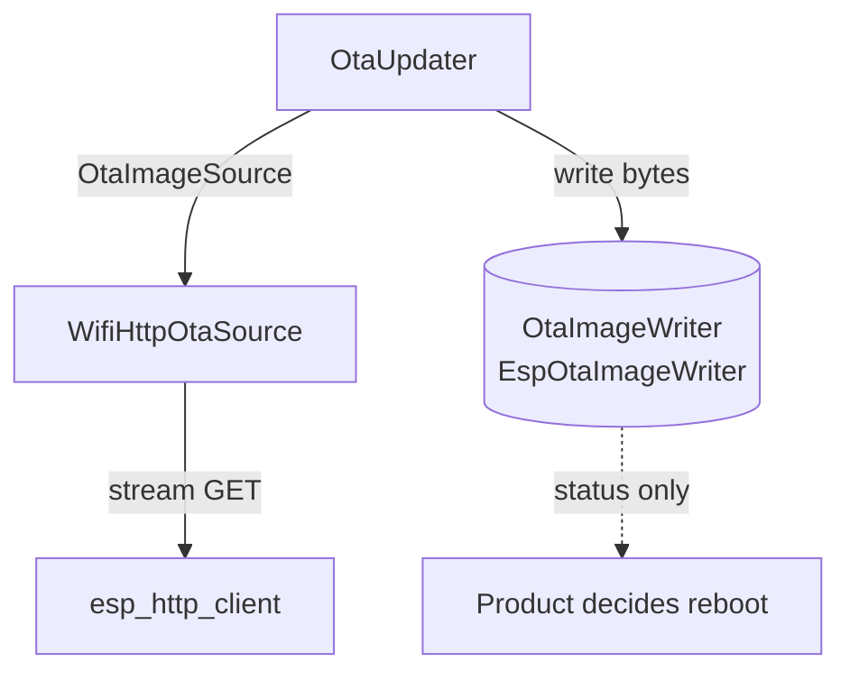

# airgradient-ota

Transport-agnostic Over-The-Air firmware update component. It separates the
universal flash-write core (`OtaImageWriter`) from the transport that delivers
the image bytes, and ships the WiFi pull path.

## Status

`Experimental` — the universal core, the pull orchestrator, the URL builder,
and the WiFi pull source are implemented and host-tested. The cellular pull
source and the BLE push service are defined as seams but not implemented;
real-hardware OTA is HIL-verified, not covered by host tests.

## Scope

This component owns:

- the universal flash-write core (`OtaImageWriter` + `EspOtaImageWriter`)
- the pull transport seam (`OtaImageSource`) shared by all HTTP transports
- the blocking pull orchestrator (`OtaUpdater`) that owns the read/write loop,
  progress throttling, and abort-on-error
- the AirGradient firmware URL builder (`ota_url`)
- the WiFi pull source (`WifiHttpOtaSource`) over `esp_http_client`
- typed results (`OtaStatus`) and struct-based progress reporting

This component does not own:

- rebooting after an update (the product decides from the returned `OtaStatus`)
- marking the new image valid / rollback / anti-rollback policy
- transport security (downloads are plain HTTP; HTTPS and signed images are
  future work)
- background task creation (`run()` is blocking on a product-provided task)
- the cellular and BLE transports (seams only; future work)

## Directory Layout

```text
components/airgradient-ota/
  hal/
    ota_image_writer.h       # universal flash-write interface
    ota_image_source.h       # pull transport seam
  types/
    ota_types.h              # OtaStatus, OtaState, OtaProgress, OtaRequest
  backends/
    esp/                     # EspOtaImageWriter (esp_ota_ops)
    wifi/                    # WifiHttpOtaSource (esp_http_client streaming)
  services/
    ota_updater.{h,cpp}      # pull orchestrator (host-testable)
    ota_url.{h,cpp}          # AG-server URL builder (host-testable)
  tests/
  CMakeLists.txt
  Kconfig
  README.md
```

- `hal/` — public interfaces every transport depends on
- `types/` — result/progress/request value types
- `backends/` — concrete drivers grouped by transport family (firmware only)
- `services/` — host-testable orchestration and URL logic
- `tests/` — host-side tests owned by this component

## Public Includes

```cpp
#include "hal/ota_image_writer.h"
#include "hal/ota_image_source.h"
#include "services/ota_updater.h"
#include "backends/esp/esp_ota_image_writer.h"
#include "backends/wifi/wifi_http_ota_source.h"
```

Guideline:

- include from `hal/` when depending on an interface
- include from `services/` when driving an update
- include from `backends/` only when instantiating a concrete driver

## Design

The `OtaImageWriter` is the single universal piece every transport terminates
at. Pull transports share the `OtaImageSource` seam and are driven by
`OtaUpdater`; a future BLE push transport owns its own GATT flow and feeds the
writer directly. "Is an update available?" semantics live only in the pull
path. Reboot is never performed here.



`OtaUpdater::run()` is a single blocking call: `open -> begin -> loop(read ->
write, throttled progress) -> finish`. It aborts the writer on any read/write
error and always closes the source. The URL builder centralises the AirGradient
URL conventions, mapping `OtaDeviceModel` to the path segment and serial format.

## Usage

```cpp
OtaRequest req{serial, current_fw, "hw.airgradient.com", OtaDeviceModel::OneOpenAir};
WifiHttpOtaSource source(req);
EspOtaImageWriter writer;
OtaUpdater updater(source, writer);
updater.set_on_progress([](const OtaProgress &p) {
  AG_LOGI("App", "ota %u%% (%u bytes)", p.percent, (unsigned)p.bytes_written);
});

OtaStatus st = updater.run(); // single blocking call
if (st == OtaStatus::Ok) {
  reboot(); // product decides
}
```

## Configuration

The component exposes Kconfig knobs under **AirGradient OTA** in `menuconfig`
(see `components/airgradient-ota/Kconfig`):

| Symbol | Default | Purpose |
|---|---|---|
| `CONFIG_AG_OTA_HTTP_TIMEOUT_MS` | `15000` | HTTP connect/read timeout |
| `CONFIG_AG_OTA_READ_BUFFER_SIZE` | `1024` | Per-read download/flash buffer |
| `CONFIG_AG_OTA_PROGRESS_INTERVAL_MS` | `250` | Minimum gap between progress callbacks |
| `CONFIG_AG_OTA_URL_BUFFER_SIZE` | `256` | Max built firmware URL length |

## Dependencies

- `components/airgradient-common/` — `RTOS` timing and `AG_LOG` macros
- `app_update` — `esp_ota_ops` flash API
- `esp_http_client` — WiFi streaming download

## Tests

Host tests live in `components/airgradient-ota/tests/` and run through the
top-level [tests runner](../../tests/README.md). They cover the `ota_url`
mapping and the `OtaUpdater` flow (ordering, skip/abort/truncation paths,
byte accounting, progress state sequence, and callback throttling) against a
Trompeloeil mock source and a host fake writer. `EspOtaImageWriter` and
`WifiHttpOtaSource` wrap ESP-IDF APIs behind `#ifndef TEST_HOST` and are
verified by HIL.

## Notes

- Downloads use plain HTTP and provide no transport authentication; HTTPS and
  signed images are explicit future improvements.
- The cellular pull source and BLE push service are defined as seams in
  `spec.md` but not implemented here.
