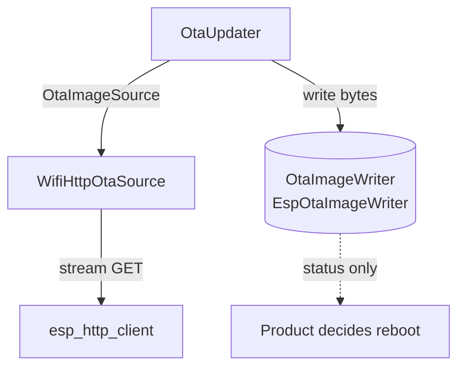

# airgradient-ota

Transport-agnostic Over-The-Air firmware update component. It separates the
universal flash-write core (`OtaImageWriter`) from the transport that delivers
the image bytes, and ships the WiFi pull path and the BLE push path.

## Status

`Stable`.

## Scope

This component owns:

- the universal flash-write core (`OtaImageWriter` + `EspOtaImageWriter`)
- the pull transport seam (`OtaImageSource`) shared by all HTTP transports
- the blocking pull orchestrator (`OtaUpdater`) that owns the read/write loop,
  progress throttling, and abort-on-error
- the AirGradient firmware URL builder (`ota_url`)
- the WiFi pull source (`WifiHttpOtaSource`) over `esp_http_client`
- the BLE push service (`OtaBleService`) that owns the OTA GATT flow
  (Control / Data / Status) on a borrowed `AgBleServer`, flashing each
  phone-pushed Data write directly in the write callback and driving
  begin/finish/abort from a single product-called `run()` that returns
  immediately when idle and blocks through the transfer once started
- the BLE connection-interval window: `OtaBleService` requests the fast OTA
  window when a transfer begins and restores the relaxed window on a
  non-success terminal (success reboots, so no restore is needed)
- typed results (`OtaStatus`) and struct-based progress reporting

This component does not own:

- rebooting after an update (the product decides from the returned `OtaStatus`,
  including the terminal `OtaStatus` that `OtaBleService::run()` returns)
- marking the new image valid / rollback / anti-rollback policy
- transport security (WiFi downloads are plain HTTP; the BLE link relies on the
  product-configured authenticated pairing; HTTPS and signed images are future
  work)
- background task creation on the pull path (`run()` is blocking on a
  product-provided task)
- BLE server lifecycle (`OtaBleService` borrows an init'd/secured server and
  never `init()`/`deinit()`s it or drives advertising)
- the cellular transport (seam only; future work)

## Directory Layout

```text
components/airgradient-ota/
  hal/
    ota_image_writer.h       # universal flash-write interface
    ota_image_source.h       # pull transport seam
  types/
    ota_types.h              # OtaStatus, OtaState, OtaProgress, OtaRequest
  backends/
    esp/                     # EspOtaImageWriter (esp_ota_ops)
    wifi/                    # WifiHttpOtaSource (esp_http_client streaming)
  services/
    ota_updater.{h,cpp}      # pull orchestrator (host-testable)
    ota_url.{h,cpp}          # AG-server URL builder (host-testable)
    ota_ble_service.{h,cpp}  # BLE push service: GATT flow + run (host-testable core)
    ota_ble_protocol.h       # BLE CBOR key/op constants + frozen wire constants
  tests/
  idf_component.yml          # espressif/cbor managed dependency
  CMakeLists.txt
  Kconfig
  README.md
```

- `hal/` — public interfaces every transport depends on
- `types/` — result/progress/request value types
- `backends/` — concrete drivers grouped by transport family (firmware only)
- `services/` — host-testable orchestration and URL logic
- `tests/` — host-side tests owned by this component

## Public Includes

```cpp
#include "hal/ota_image_writer.h"
#include "hal/ota_image_source.h"
#include "services/ota_updater.h"
#include "services/ota_ble_service.h"
#include "backends/esp/esp_ota_image_writer.h"
#include "backends/wifi/wifi_http_ota_source.h"
```

Guideline:

- include from `hal/` when depending on an interface
- include from `services/` when driving an update
- include from `backends/` only when instantiating a concrete driver

## Design

The `OtaImageWriter` is the single universal piece every transport terminates
at. Pull transports share the `OtaImageSource` seam and are driven by
`OtaUpdater`; a future BLE push transport owns its own GATT flow and feeds the
writer directly. "Is an update available?" semantics live only in the pull
path. Reboot is never performed here.



`OtaUpdater::run()` is a single blocking call: `open -> begin -> loop(read ->
write, throttled progress) -> finish`. It aborts the writer on any read/write
error and always closes the source. The URL builder centralises the AirGradient
URL conventions, mapping `OtaDeviceModel` to the path segment and serial format.

### BLE push (`OtaBleService`)

BLE inverts the control flow: the phone drives and the device receives, so there
is no `OtaUpdater` and no `OtaImageSource`. `OtaBleService` owns an OTA GATT
service with three characteristics:

```text
 OTA Service
   ├─ Control  char  [WRITE | WRITE_AUTHEN]       CBOR: START{total, fw} | END | ABORT
   ├─ Data     char  [WRITE_NR | WRITE_AUTHEN]    raw image bytes (no response)
   └─ Status   char  [NOTIFY | READ_AUTHEN]       CBOR: {state, result, bytes}
```

It borrows an already-`init()`'d and `set_security()`'d `AgBleServer` that is
**not yet advertising**; `setup()` must run **before** `start_advertising()`,
and the service never `init()`/`deinit()`s the server. There is **no worker
task and no chunk buffer**: each Data write (`WRITE_NR`) is flashed straight
from the NimBLE host-task write callback (`esp_ota_write`, ~1.5 ms), while the
stack-hungry `begin`/`finish`/`abort` run on the **product's task** inside a
product-called `run()`. The product contract is a single method: `run(timeout_ms)`
returns immediately (or parks up to `timeout_ms` waiting for a `START`) when
idle, and once a `START` is latched it emits `Starting`, drives one transfer to
its terminal, and returns the final `OtaStatus`. An optional
`set_on_progress(OtaProgressCallback)` (mirroring `OtaUpdater`) reports the
`Starting` edge, the `Downloading`/`Applying` ticks, and the terminal
`Done`/`Failed` on the `run()` task.
Status (`{state, result, bytes}`) is pushed as NOTIFY-only CBOR on each state
transition and on a periodic progress tick (~5 s,
`CONFIG_AG_OTA_BLE_PROGRESS_INTERVAL_MS`) carrying the device's real byte count
— the phone's own Write-Without-Response send count runs ahead of the link, so
the device reports true progress. The product forwards the
server's disconnect via `handle_disconnect()`, uses the `run()` start/terminal
edges (the progress callback and the returned `OtaStatus`) and `is_active()` to
inhibit sleep / gate other BLE services, and decides reboot — the service never
reboots. The connection-interval window is bracketed by the service itself: it
requests the fast OTA window (15–30 ms) on `begin()` and restores the relaxed
window (30–50 ms) on a non-success terminal, so the product does not touch
`request_conn_params()`.

## Usage

```cpp
OtaRequest req{serial, current_fw, "hw.airgradient.com", OtaDeviceModel::OneOpenAir};
WifiHttpOtaSource source(req);
EspOtaImageWriter writer;
OtaUpdater updater(source, writer);
updater.set_on_progress([](const OtaProgress &p) {
  AG_LOGI("App", "ota %u%% (%u bytes)", p.percent, (unsigned)p.bytes_written);
});

OtaStatus st = updater.run(); // single blocking call
if (st == OtaStatus::Ok) {
  reboot(); // product decides
}
```

BLE push (product owns the BLE server lifecycle):

```cpp
NimbleBleServer ble;
ble.init("AirGradient OTA");
ble.set_security(AgBleIoCapability::DISPLAY_ONLY,
                 AgBleAuth::BOND | AgBleAuth::MITM | AgBleAuth::SC);

EspOtaImageWriter writer;
OtaBleService ota(ble, writer);
ota.setup();                     // registers GATT BEFORE advertising

// Start edge fires on the run() task before begin(): prep here. The service
// brackets the BLE conn-param window itself; the product only inhibits sleep.
bool transfer_ran = false;
ota.set_on_progress([&](const OtaProgress &p) {
  if (p.state == OtaState::Starting) {
    transfer_ran = true;
    power.inhibit_sleep(true);                 // don't sleep/shut down mid-flash
  }
});

ble.set_disconnect_callback([&ota](uint16_t, int) { ota.handle_disconnect(); });
ble.start_advertising();

// Dedicated product loop (nothing else heavy runs during OTA).
for (;;) {
  transfer_ran = false;
  OtaStatus result = ota.run(IDLE_POLL_MS);    // parks idle, blocks through transfer
  if (!transfer_ran) {
    continue;                                  // idle wakeup
  }
  power.inhibit_sleep(false);
  if (result == OtaStatus::Ok) {
    reboot();                                  // product decides
  }
}
```

## Configuration

The component exposes Kconfig knobs under **AirGradient OTA** in `menuconfig`
(see `components/airgradient-ota/Kconfig`):

| Symbol | Default | Purpose |
|---|---|---|
| `CONFIG_AG_OTA_HTTP_TIMEOUT_MS` | `15000` | HTTP connect/read timeout |
| `CONFIG_AG_OTA_READ_BUFFER_SIZE` | `1024` | Per-read download/flash buffer |
| `CONFIG_AG_OTA_PROGRESS_INTERVAL_MS` | `250` | Minimum gap between progress callbacks |
| `CONFIG_AG_OTA_URL_BUFFER_SIZE` | `256` | Max built firmware URL length |
| `CONFIG_AG_OTA_BLE_DATA_MAX_BYTES` | `512` | Max accepted single BLE Data write; larger writes are rejected |
| `CONFIG_AG_OTA_BLE_CONTROL_MAX_BYTES` | `64` | Max accepted BLE Control write size |
| `CONFIG_AG_OTA_BLE_FW_MAX_LEN` | `32` | Max BLE `fw` string length |
| `CONFIG_AG_OTA_BLE_STALL_TIMEOUT_MS` | `10000` | BLE silent-phone byte-progress watchdog window |
| `CONFIG_AG_OTA_BLE_PROGRESS_INTERVAL_MS` | `5000` | BLE `run()` tick: progress log + progress NOTIFY cadence, stall granularity |

The OTA connection-interval window is owned by `OtaBleService`: it requests the
fast window (15–30 ms, latency 0, 2 s supervision) on `begin()` and restores the
relaxed window (30–50 ms) on a non-success terminal. These are fixed constants
in `ota_ble_service.cpp`, not Kconfig. The preferred MTU (512) remains a
product / BLE-stack concern (`CONFIG_BT_NIMBLE_ATT_PREFERRED_MTU`).

## Dependencies

- `components/airgradient-common/` — `RTOS` timing and `AG_LOG` macros
- `app_update` — `esp_ota_ops` flash API
- `esp_http_client` — WiFi streaming download
- `components/airgradient-ble/` — `AgBleServer` / characteristic HAL (BLE push)
- `espressif/cbor` (TinyCBOR) — BLE Control/Status CBOR encode/decode
  (managed component via `idf_component.yml`)

## Tests

Host tests live in `components/airgradient-ota/tests/` and run through the
top-level [tests runner](../../tests/README.md). They cover the `ota_url`
mapping and the `OtaUpdater` flow (ordering, skip/abort/truncation paths,
byte accounting, progress state sequence, and callback throttling) against a
Trompeloeil mock source and a host fake writer, plus the `OtaBleService`
protocol/state core (CBOR Control decode + bounds, wire constants, the
state machine, begin/write/finish sequencing, byte-count/framing rules,
NOTIFY-only Status emission, rejection rules, the progress callback, the
connection-interval bracketing (fast request on `begin()`, relaxed restore only
on a non-success terminal), and the `run()` / `is_active` lifecycle) against a
mock `AgBleServer` and the host fake writer.
`EspOtaImageWriter` and `WifiHttpOtaSource` wrap ESP-IDF APIs behind
`#ifndef TEST_HOST` and are verified by HIL; so are the blocking `run()` loop
and the live silent-phone stall watchdog.

## Notes

- WiFi downloads use plain HTTP and provide no transport authentication; the
  BLE push path relies on the product-configured authenticated pairing
  (`WRITE_AUTHEN` + `BOND | MITM | SC`). HTTPS and signed images are explicit
  future improvements.
- The cellular pull source is defined as a seam in `spec.md` but not
  implemented here.
