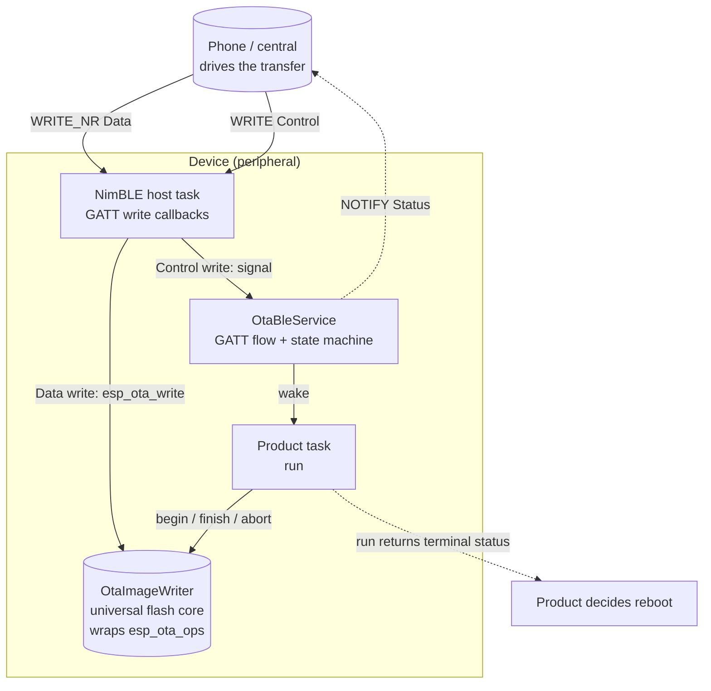
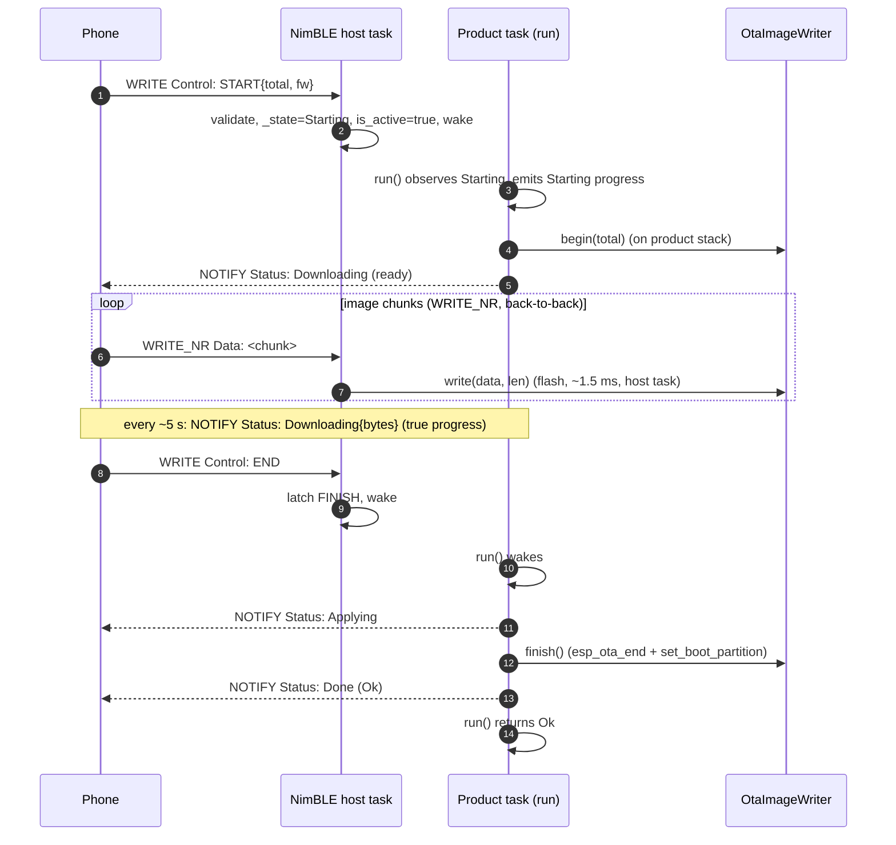
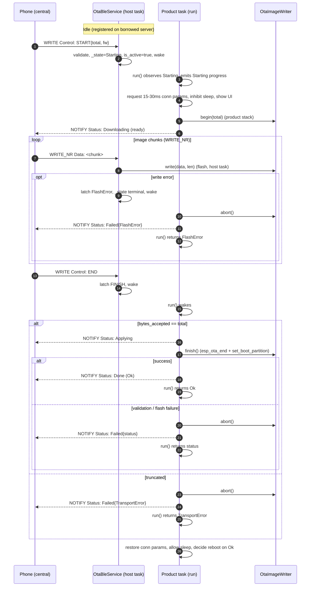

# airgradient-ota BLE Push Spec

> **This is a spec.** It describes how a feature **will be built**, not what
> currently exists. Once the feature ships, the component README becomes the
> source of truth and this file is typically deleted. See `docs/STYLE.md` →
> "Doc Lifecycle".

This spec implements the **BLE push** OTA path that the original
[`spec.md`](spec.md) defined as a future seam. It is derived from that spec and
reuses its universal flash-write core (`OtaImageWriter`) **unchanged**. Where
the WiFi/cellular paths are device-initiated **pull** (driven by `OtaUpdater`
over an `OtaImageSource`), BLE inverts the control flow: the phone drives and
the device receives. There is therefore **no `OtaUpdater` and no
`OtaImageSource`** here. A new service — `OtaBleService` — owns the complete
GATT flow and feeds the writer directly from each data-write callback.

> **Design revision (v2 — throughput-driven).** An earlier revision of this spec
> moved flash writes onto a dedicated worker task and paced the phone with a
> Write-With-Response + one-slot-semaphore handshake. Bench measurement showed
> the transfer is **link-paced, not device-paced**: a single `esp_ota_write`
> takes ~1.5 ms while the device sits ~97% idle, so the handshake's "pace the
> phone to flash speed" backpressure solved a non-problem and the
> Write-With-Response round-trip itself roughly halved throughput. v2 therefore
> deletes the worker task, the chunk buffer, and the semaphore handshake; it
> uses **Write-Without-Response** with flash done **directly in the data
> callback**, drives `begin`/`finish`/`abort` from a **product-called
> `run()`** on the product's own task, and leans on **connection-parameter
> tuning** (the lever that actually owns BLE throughput) to hit the target. The
> historical worker design is preserved in git history, not here.

## Problem

`spec.md` shipped the WiFi pull path and the universal core, and sketched the
BLE push service as "future reference" (interface + flow diagram only). The
sketch left the hard parts undefined; v2 answers them as follows:

- **Where flash writes run** — `esp_ota_write` programs/erases flash. v2 runs it
  **in the Data write callback on the NimBLE host task**; the call is fast
  (~1.5 ms to pre-erased flash) and the heavy, stack-hungry `esp_ota_begin`/
  `esp_ota_end` run on the **product's task** via `run()`, not on the host task.
- **Throughput** — the bottleneck is the BLE link delivering roughly one ATT
  packet per connection event. The levers are MTU and, decisively, the
  **connection interval** (owned by the central). v2 uses MTU 512, requests a
  fast OTA-windowed interval, and removes the per-chunk ATT round-trip by using
  Write-Without-Response.
- **Backpressure and buffering** — none is needed. The link is ~30× slower than
  flash, so the phone cannot overrun the device on-air; excess bytes pile in the
  **central's** TX buffers, and the controller's ACL RX buffers + link-layer
  flow control pace the central. v2 keeps **no chunk buffer** — each Data write
  is flashed straight from the callback's buffer.
- **Wire protocol** — Control/Status are CBOR; Data is raw image bytes.
- **Failure containment** — a silent phone is caught by a byte-progress
  watchdog inside `run()`; disconnect/ABORT short-circuit to the same terminal.
- **Host testability** — the protocol/state core runs under `TEST_HOST` against
  a mock `AgBleServer` and a fake writer, driven through directly-invokable
  steps.

## Goals

- Reuse the universal `OtaImageWriter` core from `spec.md` with no changes.
- A reusable `OtaBleService` that owns the OTA GATT service
  (Control / Data / Status) on a **borrowed**, already-initialised
  `AgBleServer`, mirroring how provisioning's `BleTransport::setup_on_server()`
  attaches to an existing server.
- **No dedicated worker task and no chunk buffer.** `esp_ota_write` runs in the
  Data write callback; `esp_ota_begin`/`esp_ota_end`/`esp_ota_abort` run on the
  **product's task** inside a product-called `run()`.
- A **single-method product contract**: `run(timeout_ms)` returns immediately
  (or parks up to `timeout_ms` waiting for a `START`) when idle, and once a
  `START` is latched it drives one transfer to its terminal and returns the
  final `OtaStatus`. An optional `set_on_progress(OtaProgressCallback)`
  (mirroring `OtaUpdater`) reports the `Starting` edge, `Downloading`/`Applying`
  ticks, and the terminal `Done`/`Failed` on the `run()` task.
- **Write-Without-Response** on the Data characteristic to remove the per-chunk
  ATT round-trip and exploit multi-packet connection events.
- **Throughput tuning**: MTU 512 and an OTA-windowed **connection-interval
  request (15–30 ms)** via a new `AgBleServer::request_conn_params()`.
- CBOR-encoded Control and Status payloads, matching the AirGradient Go BLE
  service conventions (`espressif/cbor` / TinyCBOR); raw image bytes on the
  Data characteristic.
- Authenticated-link protection (`WRITE_AUTHEN`) on the OTA characteristics.
- Bounded failure containment: silent-phone stall → `abort()` + `Failed`;
  disconnect/ABORT → `abort()` + terminal.
- Host-testable: the protocol/state core (CBOR decode, sequencing, framing,
  status emission) runs under `TEST_HOST` against a mock `AgBleServer` and a
  fake writer; the blocking `run()` loop is a thin shell that calls the same
  directly-invokable steps the tests call.

## Non-Goals

- **No reboot** — the product decides whether and when to reboot from the
  terminal `OtaStatus` that `run()` returns (same contract as `spec.md`).
- **No resume across reconnect** — a mid-stream disconnect aborts the writer and
  discards progress; the phone restarts from `START`. No offset/resume protocol.
- **No server ownership** — `OtaBleService` never calls `init()`,
  `set_security()`, advertising, or connection-parameter changes on the
  `AgBleServer`. The product owns the stack lifecycle, forwards disconnect
  events, and brackets the connection-parameter window. Only the **attached**
  model is implemented.
- **No image signing / Secure Boot (known limitation)** — as in `spec.md`,
  `esp_ota` checks image _integrity_ (SHA-256 against the image header), not
  _authenticity_. The BLE link's authenticated pairing (`WRITE_AUTHEN` +
  product-configured bonding/MITM) is the practical defense against a rogue
  central. Signed images remain explicit future work.
- **No rollback / health-check policy** — marking the new image valid and
  anti-rollback stay product responsibilities, out of scope here.
- **No pull semantics** — "is an update available?" is decided by the phone, not
  the device. No `OtaImageSource`, no `OtaUpdater`.
- **No device-side veto** — the BLE-authenticated, phone-initiated OTA always
  proceeds. The product observes and reacts (inhibit sleep, gate other services,
  update UI) but never blocks the transfer.

## Design

### Layering

The phone is the orchestrator. `OtaBleService` translates GATT writes into
`OtaImageWriter` calls and reports state back over a NOTIFY characteristic. The
writer is the same universal core every transport terminates at; reboot is never
performed here.



How the BLE push path compares to the pull paths from `spec.md`:

| Concern | WiFi/Cellular (pull, `spec.md`) | BLE (push, this spec) |
|---|---|---|
| Drive model | Pull (device-initiated) | Push (phone-initiated) |
| Orchestrator | `OtaUpdater` | `OtaBleService` + product `run()` |
| Transport seam | `OtaImageSource` | GATT characteristics |
| Availability check | HTTP 304 / 200 | Phone decides |
| Read loop | `OtaUpdater::run()` blocking | NimBLE write callbacks + product `run()` |
| Flash core | `OtaImageWriter` | `OtaImageWriter` (unchanged) |
| Reboot | Product | Product |

### Server ownership (attached only)

`OtaBleService` borrows a partially brought-up `AgBleServer`: the product has
already called `init()` and `set_security()`, but **has not yet started GATT /
advertising**. `setup()` must run **before** `start_advertising()`, because
`AgBleServer::add_service()` registers the service into the GATT database that is
finalised at `start_advertising()`. The service only **registers its GATT
service and characteristics** and **clears them at teardown** — it never
`init()`s or `deinit()`s the stack. This mirrors provisioning's
`BleTransport::setup_on_server()` / `detach()` attached-mode contract and the Go
"init + register all services, then advertise" sequence.

The correct product order is therefore: `ble.init()` → `ble.set_security()` →
`ota.setup()` (and any other services' `setup()`) → `ble.start_advertising()`.

Because connect/disconnect are server-level (single-owner) callbacks, the product
forwards disconnect into the service via `handle_disconnect()` so an in-flight
transfer is aborted when the central drops.

### Throughput rationale

The transfer is **link-paced**. Measured on an ESP32-C5 peripheral with a
BlueZ central:

- One `esp_ota_write` of a ~509-byte chunk to pre-erased flash takes ~1.5 ms;
  the device is **idle ~97%** of the streaming time.
- The link delivers ~1 ATT packet per connection event at a ~45 ms interval, so
  throughput follows
  `packets_per_event × (MTU − 3) / connection_interval`.

The practical levers, in order of impact:

| Lever | Effect | Owner |
|---|---|---|
| Connection interval (45 ms → 15–30 ms) | **largest**; more events/second | Central (device requests) |
| Write-Without-Response | removes the per-chunk ATT round-trip; lets a multi-packet event carry image bytes back-to-back | Device + phone |
| MTU 256 → 512 | ~1.8×; more bytes per packet | Device pref + central |

v2 takes all three. Target: ~1.8 MB applied in roughly **1 minute** (~30 KB/s),
which requires the connection-interval lever — MTU and Write-Without-Response
alone do not reach it.

### Execution model

Two execution contexts, **no dedicated worker task**:

1. **NimBLE host task** — runs the Control and Data write callbacks.
   - **Data (`WRITE_NR`)**: the callback validates the write, then calls
     `writer.write(data, len)` **directly** (flash, ~1.5 ms) and updates the
     byte counter. No copy, no buffer, no signal to another task on the hot
     path.
   - **Control (`WRITE`)**: the callback decodes the CBOR and, for `START`/
     `END`/`ABORT`, latches a pending command + transitions `_state`, then wakes
     the product task. It never calls `begin`/`finish`/`abort` itself.
2. **Product task** — calls `run()`.
   - `begin()`, `finish()`, and `abort()` (the stack-hungry `esp_ota_begin`/
     `esp_ota_end`/`esp_ota_abort`) run **here**, on the product's stack.
   - All Status NOTIFYs for `Downloading`/`Applying`/`Done`/`Failed` are emitted
     here. (The only exception is a pre-validation `START` rejection, emitted on
     the host task before any transfer is live.)



#### Why flash-in-callback on the host task is acceptable

- `esp_ota_write` to a pre-erased partition is fast (~1.5 ms) and light on
  stack. The heavy, stack-hungry calls (`esp_ota_begin` erases the partition;
  `esp_ota_end` runs SHA-256 + boot-partition selection) run on the **product
  task** in `run()`, not the host task.
- BLE connection supervision is maintained by the **controller**, below the host
  task; a bounded host-task stall does not drop the link.
- **Documented risk (product-managed):** flashing in the callback consumes
  NimBLE host-task stack. Bench measurement left ~1.1 KB free — survivable but
  thin. The product **must not run other heavy BLE work while OTA is active**
  and should verify the host-task stack high-water mark by HIL (raising
  `CONFIG_BT_NIMBLE_HOST_TASK_STACK_SIZE` if needed). The product confirmed it
  pauses other server activity during OTA; coexistence is gated off
  `is_active()`.
- **Stuck-flash containment:** if a single `esp_ota_write` ever wedges, it
  wedges the host task (a hardware-level flash fault — the device is already
  broken). There is no in-band timeout for this case; recovery is a **reboot**.
  The byte-progress watchdog in `run()` only catches a _silent phone_, not a
  wedged flash.

#### Writer-ownership safety (no lock)

The writer is touched by two contexts — `write()` on the host task, and
`begin`/`finish`/`abort` on the product task — but they **never overlap**,
because the protocol serialises them:

- `begin()` completes in `run()` **before** the `Downloading` ("ready") NOTIFY,
  and the phone waits for that NOTIFY before sending Data. So no `write()` runs
  until `begin()` has returned.
- `END` arrives on the host task **after** the last Data write callback has
  returned (a single host task processes the ATT bearer in order), so no
  `write()` is in flight when `run()` runs `finish()`.
- Every terminal/abort transition (END-truncated, framing violation, write
  error, disconnect, ABORT) **sets `_state` to a non-`Downloading` value on the
  signalling context before waking `run()`**, so any later Data callback sees
  the changed state and becomes a no-op before touching the writer.
- `_bytes_accepted` is written by the Data callback (host task) and read by the
  `run()` watchdog (product task); it is a `std::atomic<size_t>`, and the
  control-signal give/take provides the ordering barrier for the surrounding
  fields.

### State machine

`Idle → Starting → Downloading → Applying → (terminal) → Idle`.

- **`START` while `Idle`** → validate payload; on success set `_total`,
  `_state = Starting`, `is_active = true`, wake. Malformed/oversized/invalid
  `START` → `Failed{InvalidArgument}` NOTIFY on the host task, stay `Idle`.
  `START` while a transfer is active → rejected (no second transfer).
- **`run()` observes `Starting`** once a valid `START` is latched (returning
  immediately when none is, or parking up to `timeout_ms`), and emits the
  `Starting` progress callback before driving the transfer.
- **`run()` `Starting → Downloading`**: `writer.begin(total)`; on success emit
  the `Downloading` ready NOTIFY; on failure terminal `Failed{FlashError}`.
- **`Downloading`**: each Data write is flashed in the callback. `run()` blocks
  on the control signal with the stall timeout, servicing `END`/`ABORT`/
  disconnect and the byte-progress watchdog.
- **`Downloading → Applying`** on `END` with `bytes_accepted == total`:
  `writer.finish()` → `Done{Ok}` or `Failed{status}`. `END` while truncated
  (`bytes_accepted != total`) → `abort()` + `Failed{TransportError}`; `finish()`
  is **not** called.
- **Terminal** (`Done`, or `Failed{...}` from any abort cause): emit NOTIFY (if
  the link is up), clear `is_active`, return to `Idle`; `run()` returns the
  terminal `OtaStatus`.

Rejection rules (no state change, no writer touch):

- `Data` while `Idle` (before `START`) → ignored.
- `Data` while `Starting` (phone did not wait for the ready NOTIFY) → protocol
  violation → `abort()` + `Failed{TransportError}`.
- `Data`/`END` after the terminal edge (e.g. a stray write after a `Failed`
  write-error NOTIFY) → ignored.
- Second `START` while active, `END`/`ABORT` while `Idle` → ignored.

### GATT layout

Owned entirely by `OtaBleService`, reusable across products:

```text
 OTA Service (UUID: TBD — to be allocated)
   ├─ Control  char  [WRITE | WRITE_AUTHEN]       CBOR: START{total, fw} | END | ABORT
   ├─ Data     char  [WRITE_NR | WRITE_AUTHEN]    raw image bytes (no response)
   └─ Status   char  [NOTIFY | READ_AUTHEN]       CBOR: {state, result, bytes}
```

- **Control** is Write-With-Response: the response just acknowledges _receipt_
  (`begin`/`finish` run later in `run()`); the phone keys off the Status NOTIFY,
  not the control response.
- **Data** is `WRITE_NR` (Write-Without-Response): no per-chunk ATT round-trip.
  The phone streams bytes back-to-back. There is no per-chunk ACK; true progress
  and errors reach the phone only via the Status NOTIFY (the phone's own send
  count runs ahead of the link and is not a reliable progress source).
- **Status** carries **no readable value** (no `READ` property): the phone
  subscribes at connect time (before `START`) and receives every transition.
  Status is pushed with `notify(data, len)`; there is no stored value.
  `READ_AUTHEN` is set **without** `READ` so the authenticated-link requirement
  applies to the auto-created CCCD — a peer must be on an authenticated link to
  **subscribe**.

> **HAL-verification item:** this assumes the NimBLE driver propagates the
> characteristic's authenticated-read permission to the CCCD (subscription)
> access check. The implementation must confirm this; if NimBLE does **not** gate
> subscription on `READ_AUTHEN`, the fallback is to document OTA-state leakage on
> an unauthenticated subscription as acceptable (the state is low-sensitivity).
> See the Implementation Plan.

Security note: Control/Data require `WRITE_AUTHEN` (an authenticated,
MITM-protected link) — the requirement applies equally to `WRITE_NR`. Status
requires an authenticated subscription (`READ_AUTHEN`). The product configures
the actual pairing model (`set_security(io_cap, BOND | MITM | SC)`) on the
borrowed server; the characteristics merely demand the authenticated link.

> **UUIDs are not yet allocated.** The service and three characteristic UUIDs are
> placeholders pending assignment, alongside the existing AirGradient
> provisioning (`acbcfea8-…`) and Go data-service UUIDs.

### Connection parameters and MTU

Throughput is dominated by link timing, which the **central owns**. Two
cooperating mechanisms:

- **Phone app (reliable path):** requests a fast connection while OTA is active
  — Android `requestConnectionPriority(CONNECTION_PRIORITY_HIGH)`, iOS at its
  ~15 ms floor — and restores normal priority afterwards. Because we control
  both apps, this is the primary lever.
- **Device (hint / fallback):** a new
  `AgBleServer::request_conn_params(min_interval_ms, max_interval_ms, latency,
  supervision_timeout_ms)` (→ NimBLE `ble_gap_update_params`). The central
  accepts, clamps, or rejects; it is a request, not a command. The connection
  interval is re-negotiable mid-connection (unlike MTU), so the switch is
  glitch-free.

The product brackets the request around the transfer, using the `run()` edges it
already observes:

- **Start edge** (the `Starting` progress callback, on the `run()` task before
  `begin()`): request a fast window — **min 15 ms / max 30 ms**, latency 0,
  supervision ~2 s.
- **Terminal edge** (`run()` returned): restore the product's relaxed
  parameters.

`OtaBleService` itself stays connection-parameter-agnostic (it does not own the
server); the product owns the policy. Recommended OTA window: **15–30 ms**,
latency 0.

**MTU:** the product sets a preferred MTU of **512**
(`CONFIG_BT_NIMBLE_ATT_PREFERRED_MTU`); the central picks `min(client, server)`.
A large MTU costs **RAM** (per-connection reassembly/ATT buffers + a larger
mbuf/MSYS pool), not airtime — the mbuf pool must be provisioned for 512 or
notifications can be dropped under load.

### CBOR protocol

Control and Status reuse the Go BLE service conventions: string-keyed CBOR maps
encoded/decoded with TinyCBOR into stack buffers (no heap on the encode path).
The Data characteristic is **not** CBOR — it carries raw image bytes so the hot
path has zero per-chunk encoding overhead.

Control characteristic (phone → device, single CBOR map keyed by `op`):

```text
START : {"op":"start", "total":<u32>, "fw":"<version string>"}
END   : {"op":"end"}
ABORT : {"op":"abort"}
```

- `total` is the full image size in bytes; passed straight to
  `writer.begin(total)`. `0` is rejected (push always knows the size).
- `fw` is **informational** — the phone has already decided to push this image.
  The device logs it; it does **not** compare against current firmware or reject
  on match.
- **Payload bounds (mandatory):** a `START` write is rejected if it exceeds
  `CONFIG_AG_OTA_BLE_CONTROL_MAX_BYTES`, if the CBOR is malformed, or if `fw`
  exceeds `CONFIG_AG_OTA_BLE_FW_MAX_LEN` (copied into a fixed buffer; truncation
  is a reject). Rejections emit `Failed{InvalidArgument}`.

Status characteristic (device → phone, **NOTIFY only**, single CBOR map):

```text
NOTIFY : {"state":<u8>, "result":<u8>, "bytes":<u32>}
```

- `state` ← `OtaState` wire value (see "Wire constants").
- `result` ← `OtaStatus` wire value; meaningful on the terminal states
  (`Done`/`Failed`), `Ok` otherwise.
- `bytes` ← the device's real accepted/flashed byte count (`_bytes_accepted`).

`bytes` is carried because the phone **cannot** derive true progress from its own
send count: with Write-Without-Response the phone's writes pile into the
central's TX buffers and its send count races far ahead of what the link has
actually delivered and the device has flashed. Only the device knows the real
figure, so it reports it. Status is pushed with `notify(data, len)` — there is no
stored characteristic value.

**NOTIFY fires on state transitions and on a periodic progress tick.** The
device emits a NOTIFY at:

- `Downloading` — once after `begin()` (the "ready" signal, `bytes` ≈ 0), then
  again every `CONFIG_AG_OTA_BLE_PROGRESS_INTERVAL_MS` (~5 s) while streaming,
  each carrying the current `bytes` — this is the phone's progress source
- `Applying` — once on `END`, before `finish()`
- `Done{Ok}` — terminal success
- `Failed{status}` — terminal failure, carrying the specific `OtaStatus`

The progress NOTIFY shares the `run()` tick with the progress **log**, so both
fire every `CONFIG_AG_OTA_BLE_PROGRESS_INTERVAL_MS`, independent of the longer
`CONFIG_AG_OTA_BLE_STALL_TIMEOUT_MS` abort window. At ~5 s the reverse-channel
airtime cost is negligible (≈ one extra peripheral packet per ~150 data
packets). A mid-stream **chunk-write error is a `Failed` transition**: a
`writer.write()` failure in the Data callback latches `FlashError` and wakes
`run()`, which emits exactly one `Failed{FlashError}` NOTIFY. The pull path's
`CONFIG_AG_OTA_PROGRESS_INTERVAL_MS` is **not** used on the BLE path.

#### Wire constants

State and result are serialised as **stable `uint8_t` wire values defined in
`ota_ble_protocol.h`, not by `OtaState`/`OtaStatus` enum ordering** — reordering
the enums must not change the protocol. The mapping is explicit and
one-directional (enum → wire), via a small `to_wire()` helper:

| `OtaState` | wire | `OtaStatus` | wire |
|---|---|---|---|
| `Downloading` | `0x01` | `Ok` | `0x00` |
| `Applying` | `0x02` | `FlashError` | `0x01` |
| `Done` | `0x03` | `InvalidImage` | `0x02` |
| `Failed` | `0x04` | `TransportError` | `0x03` |
| | | `Aborted` | `0x04` |
| | | `InvalidArgument` | `0x05` |

Only the states/results reachable on the BLE path need wire values; others may be
added as the protocol evolves. The numeric assignments are frozen once the phone
app ships. (Unchanged from v1 — `ota_ble_protocol.h` does not change.)

#### Byte-count and framing rules

Strict accounting; any violation aborts the transfer and emits exactly one
`Failed` (mirrors the pull path's truncated-download guard). The Data callback
performs these checks **before** touching the writer:

| Condition | Outcome |
|---|---|
| Data write `len > CONFIG_AG_OTA_BLE_DATA_MAX_BYTES` | `abort()` → `Failed{TransportError}` |
| Empty/zero-length Data while `Downloading` | `abort()` → `Failed{TransportError}` |
| Data while `Starting` (before the ready NOTIFY) | `abort()` → `Failed{TransportError}` |
| `bytes_accepted + len > total` (overflow past declared size) | `abort()` → `Failed{TransportError}` |
| `writer.write()` flash failure | `abort()` → `Failed{FlashError}` |
| `END` while `bytes_accepted != total` (truncated) | `abort()` → `Failed{TransportError}` — `finish()` is **not** called |
| `END` while `bytes_accepted == total` | `Applying` → `finish()` → `Done`/`Failed` |
| Malformed/oversized `START` (pre-transfer) | `Failed{InvalidArgument}`, stay `Idle` |
| `Data` before `START`, second `START`, `END`/`ABORT` while `Idle` | ignored |

Abort from the Data callback is "set terminal status + change `_state` + wake
`run()`"; the actual `writer.abort()` runs in `run()` on the product task.

#### Failure status mapping

BLE-specific terminal causes map to `OtaStatus` as follows (this spec adds
`OtaStatus::Aborted`; see Implementation Plan):

| Cause | `OtaStatus` |
|---|---|
| Phone `ABORT` control write | `Aborted` |
| Product `teardown()` mid-transfer | `Aborted` |
| Central disconnect mid-transfer (`handle_disconnect()`) | `TransportError` |
| Silent-phone stall (`run()` byte-progress watchdog) | `TransportError` |
| Byte-count / framing violation (table above) | `TransportError` |
| `begin()`/`write()`/`finish()` flash failure | `FlashError` |
| Image validation failure at `finish()` | `InvalidImage` |
| Malformed/oversized `START` payload | `InvalidArgument` |

A stuck flash (`esp_ota_write` never returns) wedges the host task and is **not**
mapped to a status — the device is broken and recovery is a reboot.

### Stall / disconnect / abort

| Event | Detected by | Outcome |
|---|---|---|
| Phone silent mid-stream | `run()` ticks every `CONFIG_AG_OTA_BLE_PROGRESS_INTERVAL_MS`; aborts once `bytes_accepted` has not advanced for `CONFIG_AG_OTA_BLE_STALL_TIMEOUT_MS` | `abort()` → NOTIFY `Failed{TransportError}` (best effort) |
| Central disconnect | `handle_disconnect()` (host task) sets terminal + wakes `run()` | `abort()` → `Failed{TransportError}`; the terminal NOTIFY is attempted but no-ops on the dropped link |
| Phone `ABORT` write | Control callback sets terminal + wakes `run()` | `abort()` → NOTIFY `Failed{Aborted}` |
| Product `teardown()` | sets terminal + wakes `run()` | `abort()`, NOTIFY `Failed{Aborted}` (best effort) |
| Stuck flash | — | host task wedged; reboot-only |

### Service interface

```cpp
// services/ota_ble_service.h
class OtaBleService {
public:
  // Borrows an init'd + secured AgBleServer that is NOT yet advertising, and
  // the universal writer. Neither is owned; the writer must outlive the service.
  // setup() must be called before the product calls start_advertising().
  OtaBleService(AgBleServer &server, OtaImageWriter &writer);
  ~OtaBleService();

  OtaBleService(const OtaBleService &) = delete;
  OtaBleService &operator=(const OtaBleService &) = delete;

  // Register the OTA GATT service + Control/Data/Status characteristics and
  // their write callbacks on the borrowed server. The server must already be
  // init()'d/secured but NOT yet advertising — call this before
  // start_advertising(). Returns false on registration failure.
  bool setup();

  // Set the product progress callback (optional). Mirrors OtaUpdater: fires on
  // the run() task at the Starting edge, on each Downloading/Applying tick, and
  // at the terminal (Done/Failed). Set once before run().
  void set_on_progress(OtaProgressCallback cb);

  // Drive the BLE OTA on the product task. Returns immediately (Ok) while no
  // transfer is pending; pass a timeout to park the task up to timeout_ms
  // waiting for a START. Once a valid START has been accepted, emits Starting,
  // runs writer.begin() (emitting the ready NOTIFY), then BLOCKS servicing
  // END/ABORT/disconnect and the stall watchdog while the Data callbacks flash
  // chunks, then runs finish()/abort() and emits the terminal NOTIFY. Returns
  // the final OtaStatus (Ok on success). The stack-hungry esp_ota_begin/
  // esp_ota_end run on the CALLER's stack here.
  OtaStatus run(uint32_t timeout_ms = 0);

  // Clear characteristic write callbacks and abort any in-flight transfer.
  // Never deinit()s the server. Idempotent. Intended for the product's
  // shutdown/owner context; if a transfer is active it requests abort so the
  // in-flight run() returns.
  void teardown();

  // Product forwards the borrowed server's disconnect here so an in-flight
  // transfer is aborted when the central drops. Safe when idle. Runs on the
  // server's (NimBLE host) callback context.
  void handle_disconnect();

  // True between the start edge (START accepted) and the terminal edge of a
  // transfer. Backed by a std::atomic<bool>, safe to read from any task
  // (power manager, UI, BLE-coexistence gating). Set true before begin() so
  // sleep can be inhibited during the partition erase; cleared before run()
  // returns its terminal status.
  bool is_active() const;
};
```

The product observes the start edge from the `Starting` progress callback and
the terminal outcome from both the terminal `Done`/`Failed` callback and
`run()`'s returned `OtaStatus`, and uses `is_active()` for arbitrary-moment
level checks from other tasks. (OTA UI can stay coarse — "Updating…" for the
whole `run()` duration.)

### Product lifecycle signal

A BLE OTA runs in the background and touches state only the product controls, so
the product needs both the **leading edge** (a transfer is starting) and a
**level check** (is one active right now):

- **Power management** — inhibit deep/light sleep and any inactivity-driven
  shutdown while flashing.
- **Shared-server coexistence** — gate provisioning / Go data streaming so only
  one transfer driver runs at a time on the shared `AgBleServer`. The product
  must also avoid heavy BLE work during OTA (flash runs on the host task).
- **Connection-parameter window** — request the fast 15–30 ms interval at the
  start edge, restore at the terminal edge.
- **UI** — show "Updating firmware…" and the final result.

The edges are delivered by `run()`: the `Starting` progress callback (on the
`run()` task, before `begin()`) is the start edge; `run()`'s returned
`OtaStatus` (and the terminal `Done`/`Failed` callback) is the terminal.
`is_active()` is the arbitrary-moment level check for code on other tasks (e.g. a
power manager).

### Flow



### Host testability

The service is split so the logic is verifiable without a BLE stack or FreeRTOS:

- **Protocol/state core** — CBOR control decode + bounds checks, the wire
  constant mapping, the state machine, the begin/write/finish sequencing, the
  byte-count/framing rules, status encoding, and the rejection rules. The `run()`
  body is factored into directly-invokable steps (`_begin_step()`,
  `_finish_step()`, `_terminate(status)`); the Data path is the real
  `_on_data_write()` calling `writer.write()` synchronously. Host tests feed a
  `START` through the Control handler, call `_begin_step()`, feed chunks through
  `_on_data_write()`, then call `_finish_step()` / `_terminate()` explicitly
  instead of running the blocking `run()` loop. Under `TEST_HOST` the `RTOS`
  semaphore primitives are no-ops, so no real concurrency is exercised — the
  test drives the steps in order.
- **Thin hardware shell** — the blocking `run()` loop (the timed take on the
  control signal + the watchdog wake). Excluded from meaningful host execution;
  verified by HIL.

Tests use the provisioning `mock_ble.h` pattern (a Trompeloeil/mocked
`AgBleServer` + `AgBleGattService` + `AgBleCharacteristic` capturing registered
write callbacks and NOTIFY payloads) and the existing `fake_ota_image_writer.h`.
TinyCBOR is linked into the host test the same way `products/go/tests` does (a
static `tinycbor` library built from the `espressif/cbor` sources).

### Product usage

```cpp
// Product owns the BLE server lifecycle.
NimbleBleServer ble;
ble.init("AirGradient OTA");
ble.set_security(AgBleIoCapability::DISPLAY_ONLY,
                 AgBleAuth::BOND | AgBleAuth::MITM | AgBleAuth::SC);

EspOtaImageWriter writer;
OtaBleService ota(ble, writer);
ota.setup();                         // registers GATT on the borrowed server

// Start edge fires on the run() task before begin(): prep here.
bool transfer_ran = false;
ota.set_on_progress([&](const OtaProgress &p) {
  if (p.state == OtaState::Starting) {
    transfer_ran = true;
    power.inhibit_sleep(true);                 // don't sleep/shut down mid-flash
    ble.request_conn_params(15, 30, 0, 2000);  // fast OTA window (hint)
    ui.show_updating();
  }
});

ble.set_disconnect_callback([&ota](uint16_t, int) { ota.handle_disconnect(); });
ble.add_advertised_service_uuid(/* OTA service UUID */);
ble.start_advertising();

// Dedicated product loop (the product runs nothing else heavy during OTA).
for (;;) {
  transfer_ran = false;
  OtaStatus result = ota.run(IDLE_POLL_MS);    // parks idle, blocks through transfer
  if (!transfer_ran) {
    continue;                                  // idle wakeup: free to do other idle work
  }

  // Terminal edge.
  ble.request_conn_params(/* product's relaxed params */);
  power.inhibit_sleep(false);
  if (result == OtaStatus::Ok) {
    reboot();                                  // product decides
  } else {
    ui.show_update_failed(result);
  }
}

// Elsewhere, e.g. a power manager on another task:
if (!ota.is_active()) {
  power.enter_light_sleep();
}
```

### Component structure

```text
components/airgradient-ota/
  services/
    ota_ble_service.h
    ota_ble_service.cpp        # push service: GATT flow + run (host-testable core)
    ota_ble_protocol.h         # CBOR key/op/state constants (unchanged)
  tests/
    ota_ble_service.tests.cpp
    mock_ble.h                 # mocked AgBleServer/service/characteristic
  idf_component.yml            # adds espressif/cbor managed dependency
  ... (existing pull-path files unchanged)
```

### CMake and dependencies

```cmake
idf_component_register(
    SRCS ...                                   # existing pull-path sources
         "services/ota_ble_service.cpp"
    INCLUDE_DIRS "."
    REQUIRES airgradient-common app_update esp_http_client airgradient-ble
    # espressif/cbor pulled via idf_component.yml
)
```

- `airgradient-ble` — `AgBleServer` / `AgBleGattService` / `AgBleCharacteristic`
  HAL, `AgBleProperty` (`WRITE_NR`, `WRITE_AUTHEN`, `NOTIFY`, `READ_AUTHEN`) /
  `AgBleAuth` flags, and the new `request_conn_params()` API.
- `espressif/cbor` (TinyCBOR) — Control/Status CBOR encode/decode. Added as a
  managed component via `idf_component.yml`.
- Existing pull-path deps (`airgradient-common`, `app_update`,
  `esp_http_client`) are unchanged.

### Kconfig (menu "AirGradient OTA")

BLE-specific symbols (reusing the existing `AG_` prefix). v2 **removes** the
worker/handshake symbols (`CONFIG_AG_OTA_BLE_CHUNK_SIZE`,
`CONFIG_AG_OTA_BLE_WRITE_TIMEOUT_MS`, `CONFIG_AG_OTA_BLE_WORKER_STACK_SIZE`,
`CONFIG_AG_OTA_BLE_WORKER_PRIORITY`) — there is no worker task, no chunk buffer,
and no consume-handshake timeout.

| Symbol | Default | Purpose |
|---|---|---|
| `CONFIG_AG_OTA_BLE_DATA_MAX_BYTES` | `512` | Max accepted single Data write (≈ max ATT payload); larger Data writes are rejected |
| `CONFIG_AG_OTA_BLE_CONTROL_MAX_BYTES` | `64` | Max accepted Control (`START`/`END`/`ABORT`) write size |
| `CONFIG_AG_OTA_BLE_FW_MAX_LEN` | `32` | Max `fw` string length copied from `START` |
| `CONFIG_AG_OTA_BLE_STALL_TIMEOUT_MS` | `10000` | Silent-phone byte-progress watchdog window; `run()` aborts after this span with no accepted Data |
| `CONFIG_AG_OTA_BLE_PROGRESS_INTERVAL_MS` | `1000` | `run()` tick: progress-log cadence and stall-watchdog granularity |

The connection-interval window (15–30 ms) and the preferred MTU (512) are
product/BLE-stack concerns (`CONFIG_BT_NIMBLE_ATT_PREFERRED_MTU`,
`ble.request_conn_params(...)`), not OTA-component Kconfig.

## Implementation Plan

This work touches three components. The two outside `airgradient-ota` are
prerequisites that resolve the review's API-contract blockers.

**Prerequisite changes (other components):**

1. **`airgradient-common`** — add a timed acquire to the binary-semaphore
   wrapper: `bool RtosBinarySemaphore::take(uint32_t timeout_ms)` (mirrors
   `task_notify_take`/`queue_receive`: `pdMS_TO_TICKS`, `UINT32_MAX` →
   `portMAX_DELAY`; `true` no-op under `TEST_HOST`). Used by `run()`'s
   control-signal wait with the stall timeout.
2. **`airgradient-ble`** — three items:
   - Add `AgBleServer::request_conn_params(uint16_t min_interval_ms, uint16_t
     max_interval_ms, uint16_t latency, uint16_t supervision_timeout_ms)` →
     NimBLE `ble_gap_update_params` on the active connection. A hint; the central
     accepts/clamps/rejects. No-op / `false` under `TEST_HOST`.
   - Codify the BLE HAL thread-safety contract: document that
     `AgBleCharacteristic::set_value()` / `notify()` may be called from
     application tasks (the product task in `run()`), and verify the NimBLE
     driver holds the host lock for these. This matches existing usage —
     provisioning already notifies from the `esp_timer` task. Also document that
     `esp_ota_write` runs inside the Data write callback on the NimBLE host task
     (product-managed stack/coexistence risk).
   - Verify that a characteristic declared `NOTIFY | READ_AUTHEN` (no `READ`)
     actually gates **subscription** (the CCCD write) on an authenticated link;
     if not, extend the HAL or document OTA-state leakage as acceptable.
3. **`airgradient-ota/types/ota_types.h`** — add `OtaStatus::Aborted`
   (intentional cancel: phone `ABORT`, product `teardown`). Additive only; the
   pull path never returns it.

**This component:**

1. `services/ota_ble_protocol.h` — **unchanged** (frozen CBOR keys/ops and wire
   constants already exist).
2. Rewrite `services/ota_ble_service.{h,cpp}` to the v2 model:
   - GATT registration on a borrowed server (Data as `WRITE_NR | WRITE_AUTHEN`,
     Control as `WRITE | WRITE_AUTHEN`, Status as `NOTIFY | READ_AUTHEN`).
   - Control handler: CBOR decode + bounds, latch pending cmd + state, wake.
   - Data handler: framing checks, then `writer.write()` directly (flash) on the
     host task; on violation/error latch terminal + wake.
   - `run(timeout_ms)` on the product task (idle gate + transfer drive);
     `set_on_progress()`; `_begin_step()`, `_finish_step()`, `_terminate()` as
     the directly-invokable steps.
   - `is_active` (`std::atomic<bool>`) set before `begin()`, cleared before the
     terminal return; `_bytes_accepted` as `std::atomic<size_t>`.
   - **Remove** the worker task, chunk buffer, `consumed_sem`/`_worker_exited`
     handshake, `set_on_event`, and the no-force-delete teardown join.
3. Update `idf_component.yml` (`espressif/cbor`) and wire `airgradient-ble` +
   cbor into `CMakeLists.txt`; add/trim the BLE Kconfig symbols (drop the worker
   symbols, add `CONFIG_AG_OTA_BLE_DATA_MAX_BYTES`).
4. Rewrite `tests/mock_ble.h` + `tests/ota_ble_service.tests.cpp` for the v2
   steps (no worker/handshake); link TinyCBOR for host the way
   `products/go/tests` does; register in the top-level tests runner.
5. Update `README.md`: BLE push is implemented (v2 push model).
6. Wire an example into a product that already owns a BLE server (with the
   conn-param window) and HIL-verify a real BLE update.

## Testing Strategy

- **Host tests** (`TEST_HOST`) against `mock_ble.h` + `fake_ota_image_writer.h`:
  - Control decode + bounds: valid `START`/`END`/`ABORT`; malformed CBOR;
    missing/`0` `total`; oversized Control (`> CONTROL_MAX_BYTES`); `fw` longer
    than `FW_MAX_LEN` → `Failed{InvalidArgument}`; `fw` accepted and ignored.
  - Wire constants: `to_wire()` maps each `OtaState`/`OtaStatus` to its frozen
    value; a test pins the exact bytes so an enum reorder cannot silently change
    the protocol.
  - Sequencing: `START` latches `Starting` → `_begin_step()` →
    `begin(total)` + ready NOTIFY; each Data write → `_on_data_write()` →
    `writer.write()` in order; `END` (complete) → `_finish_step()` → `Applying` →
    `finish()` → `Done(Ok)`.
  - Byte-count/framing: oversized Data (`len > DATA_MAX_BYTES`); empty Data;
    overflow (`bytes_accepted + len > total`); early `END`
    (`bytes_accepted != total`); `writer.write()` failure — each → terminal
    `Failed{status}` and **no** `finish()`.
  - `Starting`-state guard: `Data` arriving before the ready NOTIFY (while
    `Starting`) → `Failed{TransportError}`; a valid `START` leaves the service in
    `Starting` until `_begin_step()` runs.
  - NOTIFY is **NOTIFY-only** with payload `{state, result, bytes}`; assert the
    ready/`Applying`/`Done` NOTIFYs carry the expected `bytes`, and that no
    READ/stored value is set. (The ~5 s progress NOTIFY itself lives in the
    `run()` loop and is HIL-verified, not host-run.)
  - Rejections: `Data` before `START`; second `START` while active; `END`/`Data`
    while `Idle` (including a stray `Data`/`END` after a `Failed` write error).
  - Chunk-write error: a `writer.write()` failure latches `FlashError`, terminal
    emits exactly one `Failed{FlashError}` NOTIFY + `writer.abort()`, returns to
    `Idle`.
  - Failure mapping: `ABORT` → `Aborted`; `handle_disconnect()` →
    `TransportError` (terminal NOTIFY attempted; no-ops on a real dropped link);
    `finish()` validation failure → `InvalidImage`.
  - Lifecycle: `run()` returns `Ok` immediately while `Idle`; `START` latches
    `Starting`; `is_active()` is `false` before `START`, `true` between the start
    and terminal edges, `false` again afterwards — including that it reads
    `false` at the terminal return.
  - Progress callback: `set_on_progress()` fires the `Starting` edge,
    `Downloading`/`Applying` ticks, and the terminal `Done`/`Failed` with the
    expected `bytes`/`percent`; a pre-validation `START` reject fires nothing.
- **Not host-tested:** the blocking `run()` loop, the live control-signal timed
  take, the byte-progress watchdog as wall-clock behaviour, and
  `request_conn_params()` (no-op under `TEST_HOST`). Verified by HIL.
- **HIL:** real BLE update from a phone — fresh image applies and boots;
  mid-stream disconnect aborts cleanly without bricking (old partition still
  bootable); silent-phone stall ends in `Failed` with the partition handle
  released; `WRITE_AUTHEN` rejects writes and `READ_AUTHEN` rejects Status
  **subscription** on an unauthenticated link; **NimBLE host-task stack
  high-water mark** confirms flash-in-callback has headroom; **throughput** with
  the 15–30 ms window + MTU 512 + `WRITE_NR` reaches the ~1-minute / 1.8 MB
  target (validated on the real phone app, not just BlueZ).

## Open Questions

- **UUIDs** — allocate the OTA service and the three characteristic UUIDs
  (Control / Data / Status), consistent with the existing AirGradient BLE UUID
  scheme.
- **Connection-parameter values** — confirm the OTA window (proposed 15 ms min /
  30 ms max, latency 0, ~2 s supervision) and the relaxed restore values per
  platform (iOS ~15 ms floor; Android `CONNECTION_PRIORITY_HIGH`).
- **Host-task stack headroom** — confirm `CONFIG_BT_NIMBLE_HOST_TASK_STACK_SIZE`
  has margin with `esp_ota_write` running in the Data callback (bench left
  ~1.1 KB free); raise if HIL shows it is too thin.
- **MTU / mbuf provisioning** — confirm `CONFIG_BT_NIMBLE_ATT_PREFERRED_MTU`
  512 and that the mbuf/MSYS pool is sized so notifications are not dropped
  under load.
- **TinyCBOR host sourcing** — settle the repo-level path used to build the
  `tinycbor` static library for the component-level host test (Go currently
  builds it from `products/go/managed_components`).
- **Coexistence with other BLE services** — confirm the product-side policy that
  pauses provisioning / Go streaming while OTA `is_active()` (the signal is in
  place; the policy is the open part).
