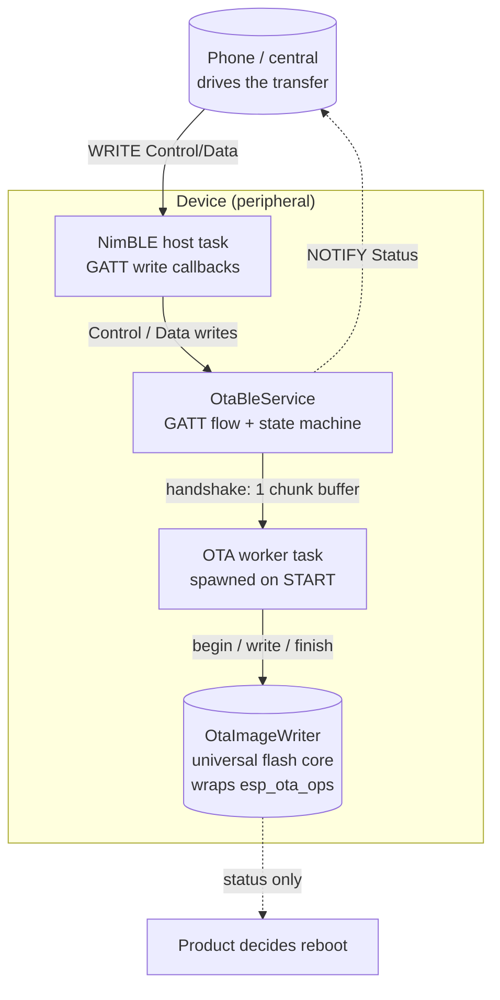
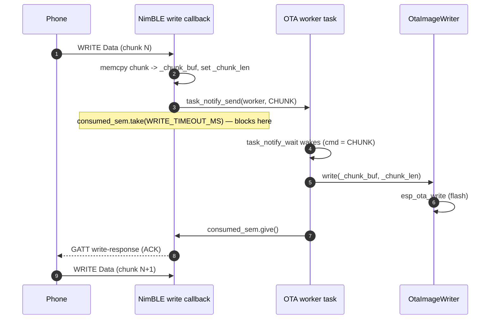
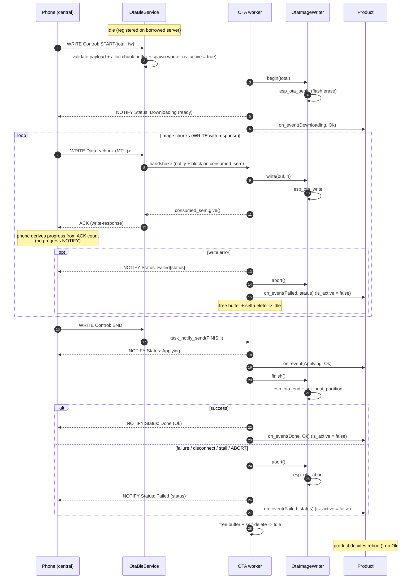

# airgradient-ota BLE Push Spec

> **This is a spec.** It describes how a feature **will be built**, not what
> currently exists. Once the feature ships, the component README becomes the
> source of truth and this file is typically deleted. See `docs/STYLE.md` →
> "Doc Lifecycle".

This spec implements the **BLE push** OTA path that the original
[`spec.md`](spec.md) defined as a future seam. It is derived from that spec and
reuses its universal flash-write core (`OtaImageWriter`) **unchanged**. Where
the WiFi/cellular paths are device-initiated **pull** (driven by `OtaUpdater`
over an `OtaImageSource`), BLE inverts the control flow: the phone drives and
the device receives. There is therefore **no `OtaUpdater` and no
`OtaImageSource`** here. A new service — `OtaBleService` — owns the complete
GATT flow and feeds the writer directly from each data-write callback.

## Problem

`spec.md` shipped the WiFi pull path and the universal core, and sketched the
BLE push service as "future reference" (interface + flow diagram only). The
sketch left the hard parts undefined:

- **Where flash writes run** — `esp_ota_write` triggers flash erase/program
  (tens of ms at each 4 KB boundary). Doing that synchronously on the NimBLE
  host task is the obvious-but-risky default.
- **Backpressure and buffering** — the phone pushes image bytes; the device
  must not overrun flash or corrupt the image, without wasting RAM on a deep
  queue.
- **Wire protocol** — the sketch named Control/Data/Status characteristics but
  did not specify their encoding.
- **Failure containment** — a phone that connects, sends `START`, then goes
  silent must not leave the OTA partition handle open forever.
- **Host testability** — the push flow must be verifiable under `TEST_HOST`
  the same way `OtaUpdater` is.

## Goals

- Reuse the universal `OtaImageWriter` core from `spec.md` with no changes.
- A reusable `OtaBleService` that owns the OTA GATT service
  (Control / Data / Status) on a **borrowed**, already-initialised
  `AgBleServer`, mirroring how provisioning's `BleTransport::setup_on_server()`
  attaches to an existing server.
- Move flash writes off the NimBLE host task onto a **worker task spawned on
  `START`** and torn down on any terminal outcome.
- A **single chunk buffer**, heap-allocated when the worker spawns and freed at
  teardown, kept race-free by a one-slot semaphore handshake — no deep queue,
  no permanent allocation.
- Natural backpressure via `WRITE` (with response) on the Data characteristic:
  the phone is paced to flash speed by deferred ACKs.
- CBOR-encoded Control and Status payloads, matching the AirGradient Go BLE
  service conventions (`espressif/cbor` / TinyCBOR); raw image bytes on the
  Data characteristic.
- Authenticated-link protection (`WRITE_AUTHEN`) on the OTA characteristics.
- Bounded failure containment on both stall directions (silent phone, stuck
  flash) → `abort()` + `Failed` + teardown.
- Host-testable: the protocol/state core (CBOR decode, sequencing, status
  emission) runs under `TEST_HOST` against a mock `AgBleServer` and a fake
  writer; the task/sync wrapper is a thin hardware-only shell behind the `RTOS`
  abstraction.

## Non-Goals

- **No reboot** — the service reports the final `OtaStatus` via the terminal
  `on_event(Done/Failed, status)`; the product decides whether and when to
  reboot (same contract as `spec.md`).
- **No resume across reconnect** — a mid-stream disconnect aborts the writer
  and discards progress; the phone restarts the transfer from `START`. No
  offset/resume protocol in this work.
- **No server ownership** — `OtaBleService` never calls `init()`,
  `set_security()`, or advertising on the `AgBleServer`. The product owns the
  stack lifecycle and forwards disconnect events. Only the **attached** model
  is implemented (no owned/`setup()` variant).
- **No image signing / Secure Boot (known limitation)** — as in `spec.md`,
  `esp_ota` checks image _integrity_ (SHA-256 against the image header), not
  _authenticity_. The BLE link's authenticated pairing (`WRITE_AUTHEN` +
  product-configured bonding/MITM) is the practical defense against a rogue
  central. Signed images remain explicit future work.
- **No rollback / health-check policy** — marking the new image valid and
  anti-rollback stay product responsibilities, out of scope here.
- **No pull semantics** — "is an update available?" is decided by the phone,
  not the device. No `OtaImageSource`, no `OtaUpdater`.

## Design

### Layering

The phone is the orchestrator. `OtaBleService` translates GATT writes into
`OtaImageWriter` calls and reports state back over a NOTIFY characteristic. The
writer is the same universal core every transport terminates at; reboot is
never performed here.



How the BLE push path compares to the pull paths from `spec.md`:

| Concern | WiFi/Cellular (pull, `spec.md`) | BLE (push, this spec) |
|---|---|---|
| Drive model | Pull (device-initiated) | Push (phone-initiated) |
| Orchestrator | `OtaUpdater` | `OtaBleService` |
| Transport seam | `OtaImageSource` | GATT characteristics |
| Availability check | HTTP 304 / 200 | Phone decides |
| Read loop | `OtaUpdater::run()` blocking | NimBLE write callbacks + worker |
| Flash core | `OtaImageWriter` | `OtaImageWriter` (unchanged) |
| Reboot | Product | Product |

### Server ownership (attached only)

`OtaBleService` borrows a partially brought-up `AgBleServer`: the product has
already called `init()` and `set_security()`, but **has not yet started GATT /
advertising**. `setup()` must run **before** `start_advertising()`, because
`AgBleServer::add_service()` registers the service into the GATT database that
is finalised at `start_advertising()`. The service only **registers its GATT
service and characteristics** and **clears them at teardown** — it never
`init()`s or `deinit()`s the stack. This mirrors provisioning's
`BleTransport::setup_on_server()` / `detach()` attached-mode contract and the
Go "init + register all services, then advertise" sequence.

The correct product order is therefore: `ble.init()` → `ble.set_security()` →
`ota.setup()` (and any other services' `setup()`) → `ble.start_advertising()`.

Because connect/disconnect are server-level (single-owner) callbacks, the
product forwards disconnect into the service via `handle_disconnect()` so an
in-flight transfer is aborted when the central drops.

### Threading model

The core decision: **every `OtaImageWriter` call — `begin`, `write`, `finish`,
`abort` — runs on a worker task, never on the NimBLE host task**, and the device
holds exactly **one** chunk buffer. `esp_ota_begin()` erases the target
partition and `esp_ota_write()` programs/erases flash; both block, so neither
may run on the NimBLE callback. The worker is the single owner of the writer, so
the writer is never touched by two tasks at once.

A single buffer is only race-free if the BLE write callback does not return (and
thus does not release the GATT write-response / ACK) until the worker has
consumed the buffer. That deferred ACK is the backpressure: with `WRITE` (with
response) the phone cannot send the next chunk until the previous one is
flashed.



Why blocking the NimBLE host task here is safe and bounded:

- The block lasts at most one chunk's flash time (a sector erase at each 4 KB
  boundary, otherwise a fast program). The phone is waiting for its ACK anyway
  under `WRITE`-with-response, so this is pacing, not lost work.
- BLE **connection supervision is maintained by the controller**, a layer
  below the host task. A bounded host-task stall does not drop the link.
- The heavy `esp_ota_begin`/`esp_ota_write` stack usage runs on a dedicated
  worker stack (`CONFIG_AG_OTA_BLE_WORKER_STACK_SIZE`), off the NimBLE host
  stack, and the worker is the single owner of `begin`/`write`/`finish`/`abort`
  and the stall timeout.

> **Timed handshake dependency.** `consumed_sem.take(WRITE_TIMEOUT_MS)` requires
> a timed acquire. The current `RtosBinarySemaphore::take()` blocks
> indefinitely, so this spec adds `RtosBinarySemaphore::take(uint32_t
> timeout_ms)` to `airgradient-common` (see Implementation Plan).

#### Worker lifecycle (on demand)

The worker exists only for the duration of one transfer and **owns every writer
call** (`begin`/`write`/`finish`/`abort`). The service tracks an internal state
`Idle → Starting → Downloading → Applying → (terminal) → Idle`:

- **Spawn on `START`** (state `Idle → Starting`): the Control handler validates
  the payload, allocates the chunk buffer with
  `new (std::nothrow) uint8_t[CONFIG_AG_OTA_BLE_CHUNK_SIZE]`, resets
  `consumed_sem`, then creates the worker via `RTOS::task_create()`. On
  **successful spawn** it sets `is_active = true` (before `begin()`, so power
  management can inhibit sleep during the partition erase). If the **allocation**
  returns `nullptr` or `task_create()` fails, `START` is rejected pre-spawn
  (`Failed{TransportError}`, `is_active` stays false, state returns to `Idle`).
  The Control handler does **not** call `begin()` itself.
- **Worker startup** (state `Starting → Downloading`): the worker's first act is
  `writer.begin(total)`. On success it emits `on_event(Downloading, Ok)` and
  NOTIFYs `Status: Downloading` (the "ready" signal); the phone waits for that
  NOTIFY before sending Data. If `begin()` fails, the worker runs the terminal
  step with `FlashError` (clearing `is_active`).
- **Run**: loop on `RTOS::task_notify_wait(&cmd, CONFIG_AG_OTA_BLE_STALL_TIMEOUT_MS)`.
  On a `CHUNK` command, call `writer.write()`; **always** `consumed_sem.give()`
  afterwards (success or failure) so the blocked Data callback is released. On a
  `FINISH` (`END`) or `ABORT` command, break and run the terminal step. On
  timeout, treat as a stall. **Data arriving while `Starting`** (a buggy/hostile
  phone that does not wait for the ready NOTIFY) is a protocol violation →
  `abort()` + `Failed{TransportError}` (the Data handler rejects it without
  copying/blocking).
- **Terminal step** (any of: `END`, `ABORT`, disconnect, stall, write/finish
  error): `consumed_sem.give()` (release any blocked Data callback), run
  `finish()`/`abort()`, NOTIFY + terminal `on_event`, clear `is_active`, free the
  chunk buffer, signal `_worker_exited`, and self-delete. State returns to
  `Idle`.

##### Where the task is spawned and deleted

The worker is **not** started by a product call — the phone's `START` write is
the trigger, so the entire spawn/delete lifecycle is internal to
`OtaBleService`:

- **Spawn site — the Control `START` write handler, on the NimBLE host task.**
  The write callback registered in `setup()` (`_on_control_write`) decodes and
  bounds-checks the CBOR, allocates `_chunk_buf` with `new (std::nothrow)`,
  resets `consumed_sem`, then (behind `#ifndef TEST_HOST`) calls
  `RTOS::task_create(&worker_entry, "ota_ble", CONFIG_AG_OTA_BLE_WORKER_STACK_SIZE,
  this, CONFIG_AG_OTA_BLE_WORKER_PRIORITY, &_worker)` and sets `is_active = true`.
  `this` is the task parameter; a free `worker_entry(void *arg)` trampolines into
  `static_cast<OtaBleService *>(arg)->_worker_loop()`. `writer.begin()` runs
  inside `_worker_loop()`, not here — the NimBLE callback never touches the
  writer.

- **Command channel — one notification, three intents.** The Data write handler,
  the `END`/`ABORT` Control handler, and `handle_disconnect()` signal the worker
  with `RTOS::task_notify_send(_worker, cmd)` where `cmd` ∈ {`CHUNK`, `FINISH`,
  `ABORT`}. All `writer.begin()/write()/finish()/abort()` calls therefore
  execute on the worker task — the writer is never touched by two tasks at once.

  > **No abort latch is needed.** Control writes, Data writes, and the disconnect
  > callback **all run on the single NimBLE host task**, which is _blocked inside
  > the Data callback_ during the handshake — so an in-band `ABORT`/disconnect
  > cannot clobber a pending `CHUNK` (same task, serialized). The only async
  > sender is `teardown()` on the product task; its `ABORT` may overwrite a
  > not-yet-consumed `CHUNK`, which simply **drops that one in-flight chunk**
  > (acceptable — we are aborting). Because every terminal/abort path calls
  > `consumed_sem.give()`, a Data callback blocked on the handshake is released
  > immediately rather than waiting out `WRITE_TIMEOUT_MS`. `consumed_sem` is
  > reset at the next `START` so a leftover `give()` cannot let the following
  > transfer's first `take()` return early (which would reopen the single-buffer
  > race).

- **Status emission runs on the worker.** All NOTIFYs and `on_event` callbacks
  for `Downloading`/`Applying`/`Done`/`Failed` are emitted from the worker task.
  This relies on the BLE HAL being safe to call (`set_value`/`notify`) from an
  application task — see the HAL-contract note in the Implementation Plan. The
  **only** status emitted from the NimBLE callback is a _pre-spawn_ rejection
  (malformed/oversized `START`, allocation failure, or `task_create()` failure),
  where no worker exists yet.

- **Delete site — the worker deletes itself.** When the loop breaks (FINISH /
  ABORT / stall / write error) the worker runs the terminal step
  (`finish()`/`abort()` + NOTIFY + terminal `on_event`), clears `is_active`,
  frees `_chunk_buf`, and — as its **last act, touching no `OtaBleService`
  member afterwards** — signals the `_worker_exited` `RtosBinarySemaphore` and
  calls `RTOS::task_delete(nullptr)`. **No other context ever calls
  `task_delete` on the worker** — it is the only safe owner of its own deletion,
  which is the whole reason teardown waits rather than deleting.

- **`teardown()` / destructor wait (bounded, no force-delete).** If teardown is
  requested while a transfer is active, it sends `ABORT` and **blocks on
  `_worker_exited.take(CONFIG_AG_OTA_BLE_WRITE_TIMEOUT_MS + margin)`** before
  clearing state, so the buffer is freed and the task has self-deleted before
  `setup()` could run again. If the wait **expires** — only possible if
  `esp_ota_write` itself wedges, i.e. a hardware-level flash fault where the
  device is already broken — the service **logs critical and does NOT
  force-delete the task, does NOT free `_chunk_buf`, and does NOT return to
  `Idle`**. Deleting a task stuck inside `esp_ota_write()` could leave the flash
  driver / OTA internals locked or corrupted, so the design refuses to pretend
  cleanup succeeded; the only real recovery is a device **reboot**. In that
  wedged state the destructor must likewise not run (the live worker still
  references the service). `teardown()`/the destructor also **must not** be
  called from `on_event` or the worker task (it would self-join); they run on the
  product/owner context only.

- **Pre-spawn failure (allocation / `task_create`).** `START` fails cleanly on
  the NimBLE callback: free `_chunk_buf` (if allocated), NOTIFY
  `Failed{TransportError}`, emit `on_event(Failed, TransportError)`, stay `Idle`.
  (No `begin()` was issued, so there is nothing to `abort()`.)

- **`TEST_HOST`.** The real `task_create()` is compiled out (`#ifndef
  TEST_HOST`); a valid `START` still advances the state to `Starting` so tests
  can pump the worker steps. `task_create()` returning `false` is therefore
  **not** treated as a failure on the host path (only the real, hardware path
  maps it to `Failed`). Host tests drive `_begin_step()/_drain_one()/
  _finish_step()/_terminate()` directly (see "Host testability"); the actual
  spawn/delete is HIL-only.

#### Chunk-write error

When `writer.write()` fails mid-stream the worker must both unblock the waiting
callback and tell the phone (the phone's ACKs only ever signal success, so a
NOTIFY is its only error signal):

1. Record the terminal `OtaStatus` (`FlashError`).
2. `consumed_sem.give()` — release the callback so it returns (the GATT
   write-response for that chunk is still sent; see below).
3. NOTIFY `Status: Failed{FlashError}` + `on_event(Failed, FlashError)`.
4. `writer.abort()`, clear `is_active`, free the chunk buffer, signal
   `_worker_exited`, and `task_delete(nullptr)` (worker self-deletes) → `Idle`.

> **HAL limitation:** `AgBleWriteCallback` returns `void`, so the failed Data
> write still receives a **success** GATT response — there is no error-response
> API. The phone may therefore send one more `Data`/`END` before it processes
> the `Failed` NOTIFY; those land while the service is `Idle` and are ignored
> (see the state-machine rejection rules). The `Failed` NOTIFY is the phone's
> authoritative stop signal.

#### Stall containment (both directions)

| Stall | Detected by | Bound (Kconfig) | Outcome |
|---|---|---|---|
| Phone silent mid-stream | worker `task_notify_wait()` timeout | `CONFIG_AG_OTA_BLE_STALL_TIMEOUT_MS` | worker runs terminal step: `writer.abort()` → NOTIFY `Failed{TransportError}` (best effort) → self-delete |
| Flash genuinely wedged in `esp_ota_write` | Data callback `consumed_sem.take()` timeout | `CONFIG_AG_OTA_BLE_WRITE_TIMEOUT_MS` | callback returns (releases the NimBLE host task); the worker cannot make progress — see the no-force-delete rule. Recovery is a **reboot** |

The two timeouts cover different things. The **worker** `task_notify_wait`
timeout catches a phone that stopped sending while the worker is idle and able
to clean up — a normal abort. The **callback** `consumed_sem.take` timeout only
fires if a single chunk's `esp_ota_write` never returns, i.e. a hardware-level
flash fault; that is the wedged case where cleanup is impossible and a reboot is
the only recovery (the worker is never force-deleted).

A disconnect (`handle_disconnect()`) and an explicit `ABORT` control write both
short-circuit to the same terminal step. On disconnect the link is already
gone, so **no NOTIFY is sent** — the service only `writer.abort()`s and fires
`on_event(Failed, TransportError)`. The silent-phone stall _attempts_ a `Failed`
NOTIFY but the phone may never receive it. `ABORT` and `teardown` map to
`Aborted`.

### GATT layout

Owned entirely by `OtaBleService`, reusable across products:

```text
 OTA Service (UUID: TBD — to be allocated)
   ├─ Control  char  [WRITE | WRITE_AUTHEN]    CBOR: START{total, fw} | END | ABORT
   ├─ Data     char  [WRITE | WRITE_AUTHEN]    raw image bytes (MTU-sized, with response)
   └─ Status   char  [NOTIFY | READ_AUTHEN]    CBOR: {state, result}
```

The Status characteristic carries **no readable value** (no `READ` property):
the phone subscribes at connect time (before `START`) and receives every
transition; it drives the transfer and tracks progress from its own ACKs, so
there is nothing to poll. Status is pushed with `notify(data, len)` and there is
no stored characteristic value. `READ_AUTHEN` is set **without** `READ` so that
the authenticated-link requirement applies to the auto-created CCCD — a peer
must be on an authenticated link to **subscribe**, gating who can observe OTA
state without exposing a readable value.

> **HAL-verification item:** this assumes the NimBLE driver propagates the
> characteristic's authenticated-read permission to the CCCD (subscription)
> access check. The implementation must confirm this; if NimBLE does **not**
> gate subscription on `READ_AUTHEN`, the fallback is to document OTA-state
> leakage on an unauthenticated subscription as acceptable (the state is
> low-sensitivity). See the Implementation Plan.

Security note: the Control/Data characteristics require `WRITE_AUTHEN` (an
authenticated, MITM-protected link) and Status requires an authenticated
subscription (`READ_AUTHEN`). The product configures the actual pairing model
(`set_security(io_cap, BOND | MITM | SC)`) on the borrowed server; the
characteristics merely demand the authenticated link. There is no separate
plain-encryption-only mode.

> **UUIDs are not yet allocated.** The service and three characteristic UUIDs
> are placeholders pending assignment, alongside the existing AirGradient
> provisioning (`acbcfea8-…`) and Go data-service UUIDs.

### CBOR protocol

Control and Status reuse the Go BLE service conventions: string-keyed CBOR maps
encoded/decoded with TinyCBOR into stack buffers (no heap on the encode path).
The Data characteristic is **not** CBOR — it carries raw image bytes so the
hot path has zero per-chunk encoding overhead.

Control characteristic (phone → device, single CBOR map keyed by `op`):

```text
START : {"op":"start", "total":<u32>, "fw":"<version string>"}
END   : {"op":"end"}
ABORT : {"op":"abort"}
```

- `total` is the full image size in bytes; passed straight to
  `writer.begin(total)`. `0` is rejected (push always knows the size).
- `fw` is **informational** — the phone has already decided to push this image.
  The device logs it; it does **not** compare against current firmware or
  reject on match.
- **Payload bounds (mandatory):** a `START` write is rejected if it exceeds
  `CONFIG_AG_OTA_BLE_CONTROL_MAX_BYTES`, if the CBOR is malformed, or if `fw`
  exceeds `CONFIG_AG_OTA_BLE_FW_MAX_LEN` (it is copied into a fixed buffer and
  truncation is treated as a reject). Rejections emit `Failed{InvalidArgument}`.

Status characteristic (device → phone, **NOTIFY only**, single CBOR map):

```text
NOTIFY : {"state":<u8>, "result":<u8>}
```

- `state` ← `OtaState` wire value (see "Wire constants").
- `result` ← `OtaStatus` wire value; meaningful on the terminal states
  (`Done`/`Failed`), `Ok` otherwise.

`bytes`/`pct` are intentionally **not** carried: the phone derives exact live
progress from its own per-chunk ACKs (see below), and the HAL has no read
callback so a live READ is impossible anyway. Status is pushed with
`notify(data, len)` — there is no stored characteristic value.

State mapping reuses the existing `OtaState` enum from `types/ota_types.h`
unchanged: a successful `START` (after the worker's `begin()`) emits a
`Downloading` state transition to signal "ready", so no new state value is
introduced.

**NOTIFY fires only on state transitions, never on progress.** Because the
Data characteristic is `WRITE`-with-response and the write callback releases
its ACK only after the worker has flashed the chunk, every ACK the phone
receives already means "this chunk is in flash". The phone therefore derives
exact live progress from its own ACK count — a device→phone progress NOTIFY
would be redundant and would only steal airtime from the data writes,
slowing the transfer. The device emits a NOTIFY only at:

- `Downloading` — once after the worker's `begin()` (the "ready" signal)
- `Applying` — once on `END`, before `finish()`
- `Done{Ok}` — terminal success
- `Failed{status}` — terminal failure, carrying the specific `OtaStatus`
  (e.g. `FlashError`, `InvalidImage`, `Aborted`, `TransportError`)

A mid-stream **chunk-write error is a `Failed` transition**, so it is covered
by the set above: the worker's `writer.write()` failure emits exactly one
`Failed{status}` NOTIFY (see "Threading model"). Failure NOTIFYs are the only
way the phone learns of an error, since its ACKs only ever signal success.
There is no per-chunk or periodic progress NOTIFY, so the pull path's
`CONFIG_AG_OTA_PROGRESS_INTERVAL_MS` does **not** apply to the BLE path.

#### Wire constants

State and result are serialised as **stable `uint8_t` wire values defined in
`ota_ble_protocol.h`, not by `OtaState`/`OtaStatus` enum ordering** — reordering
the enums must not change the protocol. The mapping is explicit and
one-directional (enum → wire), via a small `to_wire()` helper:

| `OtaState` | wire | `OtaStatus` | wire |
|---|---|---|---|
| `Downloading` | `0x01` | `Ok` | `0x00` |
| `Applying` | `0x02` | `FlashError` | `0x01` |
| `Done` | `0x03` | `InvalidImage` | `0x02` |
| `Failed` | `0x04` | `TransportError` | `0x03` |
| | | `Aborted` | `0x04` |
| | | `InvalidArgument` | `0x05` |

Only the states/results reachable on the BLE path need wire values; others may
be added as the protocol evolves. The numeric assignments are frozen once the
phone app ships.

#### Byte-count and framing rules

The worker enforces strict accounting; any violation aborts the transfer and
emits exactly one `Failed` (mirrors the pull path's truncated-download guard):

| Condition | Outcome |
|---|---|
| Data chunk `len > CONFIG_AG_OTA_BLE_CHUNK_SIZE` (cannot fit the buffer) | `abort()` → `Failed{TransportError}` |
| Empty/zero-length Data while `Downloading` | `abort()` → `Failed{TransportError}` |
| Data while `Starting` (before the ready NOTIFY) | `abort()` → `Failed{TransportError}` |
| `bytes_written + len > total` (overflow past declared size) | `abort()` → `Failed{TransportError}` |
| `END` while `bytes_written != total` (truncated) | `abort()` → `Failed{TransportError}` — `finish()` is **not** called |
| `END` while `bytes_written == total` | `Applying` → `finish()` → `Done`/`Failed` |
| Malformed/oversized `START`, alloc / `task_create` failure (pre-spawn) | `Failed{InvalidArgument}` / `Failed{TransportError}`, stay `Idle` |
| `Data` before `START`, second `START`, `END` while `Idle` | ignored (state-machine rejection rules) |

#### Failure status mapping

BLE-specific terminal causes map to `OtaStatus` as follows (this spec adds
`OtaStatus::Aborted`; see Implementation Plan):

| Cause | `OtaStatus` |
|---|---|
| Phone `ABORT` control write | `Aborted` |
| Product `teardown()` / destructor mid-transfer | `Aborted` |
| Central disconnect mid-transfer (`handle_disconnect()`) | `TransportError` |
| Silent-phone stall (`task_notify_wait` timeout) | `TransportError` |
| Stuck-flash / write-timeout (`consumed_sem.take` timeout) | `TransportError` |
| Byte-count / framing violation (table above) | `TransportError` |
| `begin()`/`write()`/`finish()` flash failure | `FlashError` |
| Image validation failure at `finish()` | `InvalidImage` |
| Malformed/oversized `START` payload | `InvalidArgument` |

### Service interface

```cpp
// services/ota_ble_service.h
class OtaBleService {
public:
  // Borrows an init'd + secured AgBleServer that is NOT yet advertising, and
  // the universal writer. Neither is owned; the writer must outlive the service.
  // setup() must be called before the product calls start_advertising().
  OtaBleService(AgBleServer &server, OtaImageWriter &writer);
  ~OtaBleService();

  OtaBleService(const OtaBleService &) = delete;
  OtaBleService &operator=(const OtaBleService &) = delete;

  // Register the OTA GATT service + Control/Data/Status characteristics and
  // their write callbacks on the borrowed server. The server must already be
  // init()'d/secured but NOT yet advertising — call this before
  // start_advertising(). Returns false on registration failure.
  bool setup();

  // Clear characteristic write callbacks, abort any in-flight transfer, free
  // the chunk buffer, and delete the worker (bounded wait on _worker_exited).
  // Never deinit()s the server. Idempotent. MUST NOT be called from on_event
  // or the worker task (it would self-join) — call from the product/owner
  // context only.
  void teardown();

  // Product forwards the borrowed server's disconnect here so an in-flight
  // transfer is aborted when the central drops. Safe when idle.
  void handle_disconnect();

  // Fired on each lifecycle transition: Downloading (start/ready), Applying,
  // Done (Ok), Failed (status). `result` is meaningful on the terminal states
  // (Done/Failed) and is Ok during progress. Set before setup().
  //
  // Context: all lifecycle events fire on the worker task. The only exception
  // is a pre-spawn rejection (malformed/oversized START or task_create
  // failure), which fires Failed on the NimBLE host task. Callbacks must not
  // block or re-enter OtaBleService (in particular, must not call teardown()).
  void set_on_event(std::function<void(OtaState, OtaStatus)> cb);

  // True between the start edge (START accepted + worker spawned) and the
  // terminal edge of a transfer. Backed by a std::atomic<bool>, so it is safe
  // to read from any task (power manager, UI, BLE-coexistence gating). The only
  // cross-task field OtaBleService exposes; cleared before the terminal
  // on_event fires, so a callback that re-checks is_active() already sees false.
  bool is_active() const;
};
```

The product wires it like provisioning's attached BLE transport: it owns the
`AgBleServer`, registers `OtaBleService` (and possibly other services) on it,
and forwards connect/disconnect from its single server-level handler.

### Product lifecycle signal

A BLE OTA runs in the background and touches state only the product controls,
so the product needs both the **leading edge** (a transfer is starting) and a
**level check** (is one active right now), not just the terminal outcome:

- **Power management** — inhibit deep/light sleep and any inactivity-driven
  shutdown while flashing.
- **Shared-server coexistence** — gate provisioning / Go data streaming so only
  one transfer driver runs at a time on the shared `AgBleServer` (see Open
  Questions).
- **UI** — show "Updating firmware…" and the final result.
- **Hold disruptive work** — defer mode transitions, reboots, and heavy
  sensor/CPU tasks.

`set_on_event()` delivers the same `OtaState` transitions the BLE Status NOTIFY
carries, so the product and the phone observe the transfer in lockstep.
`is_active()` is an `std::atomic<bool>` set true at the start edge — immediately
after a **successful worker spawn, before `begin()`**, so sleep is inhibited
during the partition erase — and false at the terminal edge (including a
`begin()` failure). It is for code (e.g. a power manager on another task) that
must check the level at an arbitrary moment rather than catch an edge.

This is **notification only** by design: the BLE-authenticated, phone-initiated
OTA always proceeds. The product observes and reacts (inhibit sleep, gate other
services, update UI) but never vetoes or blocks the transfer.

### Flow



State machine (`Idle → Starting → Downloading → Applying → terminal → Idle`),
with the rejection rules:

- `START` while `Idle` → validate + spawn (`Idle → Starting`); the worker
  `begin()`s and emits ready (`Starting → Downloading`). `START` while a transfer
  is active (`Starting`/`Downloading`/`Applying`) → rejected (no second worker/
  `begin`). Malformed/oversized `START` → `Failed{InvalidArgument}`; allocation
  or `task_create()` failure → `Failed{TransportError}` — both pre-spawn, on the
  NimBLE callback, state stays `Idle`.
- `Data` while `Idle` (before `START`) → rejected/ignored. `Data` while
  `Starting` (phone did not wait for the ready NOTIFY) → protocol violation →
  `abort()` + `Failed{TransportError}`.
- `END` while `Downloading` and `bytes_written == total` → `Applying` →
  `finish()` terminal; `END` while truncated → `abort()` +
  `Failed{TransportError}`; `END` while `Idle` → ignored.
- `ABORT` / disconnect / stall while active → `abort()` terminal.
- Any byte-count/framing violation, or any `begin()`/`write()`/`finish()` error
  → `abort()` (if a `begin()` succeeded) + `Failed` terminal (see "Byte-count
  and framing rules" and "Failure status mapping").

### Host testability

The service is split so the logic is verifiable without a BLE stack or
FreeRTOS:

- **Protocol/state core** — CBOR control decode + bounds checks, the wire
  constant mapping, the state machine, the begin/write/finish sequencing, the
  byte-count/framing rules, status encoding, and the rejection rules. The worker
  body is factored into directly-invokable steps (`_begin_step()`,
  `_drain_one()`, `_finish_step()`, `_terminate(status)`), so host tests feed a
  chunk through the Data write handler and call the matching step explicitly
  instead of relying on a real worker task. Under `TEST_HOST` the `RTOS`
  task-notify / semaphore primitives are no-ops, so no real concurrency is
  exercised — the test drives the steps in order.
- **Thin hardware shell** — `RTOS::task_create()` + the notify/semaphore
  handshake + the bounded teardown wait. Excluded from meaningful host execution
  (no-op under `TEST_HOST`); verified by HIL.

Tests use the provisioning `mock_ble.h` pattern (a Trompeloeil/mocked
`AgBleServer` + `AgBleGattService` + `AgBleCharacteristic` capturing registered
write callbacks and NOTIFY payloads) and the existing
`fake_ota_image_writer.h`. TinyCBOR is linked into the host test the same way
`products/go/tests` does (a static `tinycbor` library built from the
`espressif/cbor` sources).

### Product usage

```cpp
// Product owns the BLE server lifecycle.
NimbleBleServer ble;
ble.init("AirGradient OTA");
ble.set_security(AgBleIoCapability::DISPLAY_ONLY,
                 AgBleAuth::BOND | AgBleAuth::MITM | AgBleAuth::SC);

EspOtaImageWriter writer;
OtaBleService ota(ble, writer);
ota.set_on_event([&](OtaState st, OtaStatus res) {
  switch (st) {
  case OtaState::Downloading:        // start / ready
    power.inhibit_sleep(true);       // don't sleep or shut down mid-flash
    ui.show_updating();
    break;
  case OtaState::Done:               // res == Ok
    power.inhibit_sleep(false);
    reboot();                        // product decides
    break;
  case OtaState::Failed:
    power.inhibit_sleep(false);
    ui.show_update_failed(res);
    break;
  default:                           // Applying: optional UI
    break;
  }
});
ota.setup();                         // registers GATT on the borrowed server

ble.set_disconnect_callback([&ota](uint16_t, int) { ota.handle_disconnect(); });
ble.add_advertised_service_uuid(/* OTA service UUID */);
ble.start_advertising();
// ... phone connects and drives the transfer ...

// Elsewhere, e.g. a power manager on another task before sleeping:
if (!ota.is_active()) {
  power.enter_light_sleep();
}
```

### Component structure

```text
components/airgradient-ota/
  services/
    ota_ble_service.h
    ota_ble_service.cpp        # push service: GATT flow + worker (host-testable core)
    ota_ble_protocol.h         # CBOR key/op/state constants (like go_ble_protocol.h)
  tests/
    ota_ble_service.tests.cpp
    mock_ble.h                 # mocked AgBleServer/service/characteristic
  idf_component.yml            # adds espressif/cbor managed dependency
  ... (existing pull-path files unchanged)
```

### CMake and dependencies

```cmake
idf_component_register(
    SRCS ...                                   # existing pull-path sources
         "services/ota_ble_service.cpp"
    INCLUDE_DIRS "."
    REQUIRES airgradient-common app_update esp_http_client airgradient-ble
    # espressif/cbor pulled via idf_component.yml
)
```

- `airgradient-ble` — `AgBleServer` / `AgBleGattService` / `AgBleCharacteristic`
  HAL, `AgBleProperty` / `AgBleAuth` flags.
- `espressif/cbor` (TinyCBOR) — Control/Status CBOR encode/decode. Added as a
  managed component via `idf_component.yml`.
- Existing pull-path deps (`airgradient-common`, `app_update`,
  `esp_http_client`) are unchanged.

### Kconfig (menu "AirGradient OTA")

New BLE-specific symbols (reusing the existing `AG_` prefix). The BLE path
emits NOTIFYs only on state transitions, so the pull path's
`CONFIG_AG_OTA_PROGRESS_INTERVAL_MS` is **not** used here.

| Symbol | Default | Purpose |
|---|---|---|
| `CONFIG_AG_OTA_BLE_CHUNK_SIZE` | `512` | Single chunk buffer size (≈ max ATT MTU); Data chunks larger than this are rejected |
| `CONFIG_AG_OTA_BLE_CONTROL_MAX_BYTES` | `64` | Max accepted Control (`START`/`END`/`ABORT`) write size |
| `CONFIG_AG_OTA_BLE_FW_MAX_LEN` | `32` | Max `fw` string length copied from `START` |
| `CONFIG_AG_OTA_BLE_STALL_TIMEOUT_MS` | `10000` | Worker `task_notify_wait` timeout (silent phone) |
| `CONFIG_AG_OTA_BLE_WRITE_TIMEOUT_MS` | `5000` | Callback `consumed_sem.take` timeout (stuck flash); also bounds the teardown wait |
| `CONFIG_AG_OTA_BLE_WORKER_STACK_SIZE` | `8192` | Worker task stack depth, in **bytes** (see note); headroom for the `esp_ota` call chain |
| `CONFIG_AG_OTA_BLE_WORKER_PRIORITY` | `5` | Worker task priority |

> **Stack unit.** On ESP-IDF, `xTaskCreate()` (and therefore
> `RTOS::task_create()`) takes the stack depth in **bytes**, not words —
> unlike vanilla FreeRTOS. The `rtos.h` / some product comments say "words";
> that wording is misleading and is corrected as part of this work. Treat this
> symbol as bytes and confirm the actual high-water mark by HIL.

## Implementation Plan

This work touches three components. The two outside `airgradient-ota` are
prerequisites that resolve the review's API-contract blockers.

**Prerequisite changes (other components):**

1. **`airgradient-common`** — add a timed acquire to the binary-semaphore
   wrapper: `bool RtosBinarySemaphore::take(uint32_t timeout_ms)` (mirrors
   `task_notify_take`/`queue_receive`: `pdMS_TO_TICKS`, `UINT32_MAX` →
   `portMAX_DELAY`; `true` no-op under `TEST_HOST`). Required by the handshake
   `consumed_sem.take(WRITE_TIMEOUT_MS)` and the bounded teardown wait. Also fix
   the misleading `task_create()` stack-depth doc comment in `rtos.h`
   ("words" → **bytes** on ESP-IDF).
2. **`airgradient-ble`** — two items:
   - Codify the BLE HAL thread-safety contract: document that
     `AgBleCharacteristic::set_value()` / `notify()` may be called from
     application tasks (the worker), and verify the NimBLE driver holds the host
     lock for these. This matches existing usage — provisioning already notifies
     from the `esp_timer` task (`ProvisioningTimer`, `ESP_TIMER_TASK`). If the
     driver turns out **not** to be task-safe, fall back to marshalling status
     emission onto an owner/`esp_timer` context.
   - Verify that a characteristic declared `NOTIFY | READ_AUTHEN` (no `READ`)
     actually gates **subscription** (the CCCD write) on an authenticated link.
     If it does not, either extend the HAL (a `NOTIFY_AUTHEN`/CCCD-permission
     option) or document OTA-state leakage as acceptable.
3. **`airgradient-ota/types/ota_types.h`** — add `OtaStatus::Aborted` (intentional
   cancel: phone `ABORT`, product `teardown`). Additive only; the pull path
   never returns it.

**This component:**

1. Add `services/ota_ble_protocol.h` (CBOR key/op constants + the frozen
   state/result **wire constants** and the `to_wire()` mapping).
2. Add `services/ota_ble_service.{h,cpp}`: GATT registration on a borrowed
   server (before advertising), Control/Data write handlers with payload bounds,
   the `Idle → Starting → Downloading → Applying → terminal` state machine, the
   byte-count/framing rules (incl. Data-while-`Starting` rejection), status
   encode, and the directly-invokable worker steps (`_begin_step`/`_drain_one`/
   `_finish_step`/`_terminate`) for the host-testable core.
3. Add the worker/sync shell (real `RTOS::task_create` behind `#ifndef
   TEST_HOST`; `new (std::nothrow)` chunk buffer; `is_active` set at spawn;
   notify/semaphore handshake with `consumed_sem` reset at `START` and a
   `give()` on every terminal path; worker-owned `begin`/`write`/`finish`/
   `abort`; self-delete + bounded teardown wait with **no force-delete**). The
   host path advances to `Starting` without a real task so tests pump the steps.
4. Add `idf_component.yml` (`espressif/cbor`) and wire `airgradient-ble` +
   cbor into `CMakeLists.txt`; add the BLE Kconfig symbols.
5. Add `tests/mock_ble.h` and `tests/ota_ble_service.tests.cpp`; link TinyCBOR
   for host the way `products/go/tests` does; register in the top-level tests
   runner.
6. Update `README.md`: BLE push is now implemented (not just a seam).
7. Wire an example into a product that already owns a BLE server; HIL-verify a
   real BLE update.

## Testing Strategy

- **Host tests** (`TEST_HOST`) against `mock_ble.h` + `fake_ota_image_writer.h`:
  - Control decode + bounds: valid `START`/`END`/`ABORT`; malformed CBOR;
    missing/`0` `total`; oversized Control (`> CONTROL_MAX_BYTES`); `fw` longer
    than `FW_MAX_LEN` → `Failed{InvalidArgument}`; `fw` accepted and ignored for
    the availability decision.
  - Wire constants: `to_wire()` maps each `OtaState`/`OtaStatus` to its frozen
    value; a test pins the exact bytes so an enum reorder cannot silently change
    the protocol.
  - Sequencing: `START` → worker `begin(total)` → ready; each Data chunk →
    `_drain_one()` → `writer.write()` in order; `END` (complete) → `Applying` →
    `finish()` → `Done(Ok)`.
  - Byte-count/framing: oversized chunk (`len > CHUNK_SIZE`); empty Data;
    overflow (`bytes_written + len > total`); early `END`
    (`bytes_written != total`) — each → `abort()` + one `Failed{TransportError}`
    and **no** `finish()`.
  - `Starting`-state guard: `Data` arriving before the ready NOTIFY (while
    `Starting`) → `abort()` + `Failed{TransportError}`; a valid `START` leaves
    the service in `Starting` until `_begin_step()` runs (host seam:
    `task_create()==false` is not a failure).
  - Allocation failure: a forced `nullptr` chunk-buffer allocation rejects
    `START` pre-spawn with `Failed{TransportError}`, no `begin()`, stays `Idle`.
  - Abort releases the handshake: with a Data callback blocked on `consumed_sem`,
    an `ABORT`/teardown gives the semaphore so the callback returns without
    waiting `WRITE_TIMEOUT`; and `consumed_sem` is reset at the next `START` so a
    leftover give does not let the following transfer's first `take()` skip the
    handshake.
  - NOTIFY is **NOTIFY-only** with payload `{state, result}`; assert streaming
    many chunks produces **no** per-chunk or periodic progress NOTIFY between
    `ready` and `Applying`, and that no READ/stored value is set.
  - Rejections: `Data` before `START`; second `START` while active; `END`/`Data`
    while `Idle` (including the stray `Data`/`END` that can arrive after a
    `Failed` write error).
  - Chunk-write error: a `writer.write()` failure emits exactly one
    `Failed{FlashError}` NOTIFY, releases the callback handshake, calls
    `writer.abort()` + `on_event(Failed, FlashError)`, and returns to `Idle`.
  - Failure mapping: `ABORT` → `Aborted`; `handle_disconnect()` →
    `TransportError` (no NOTIFY); `finish()` validation failure → `InvalidImage`
    — each via `on_event` with the mapped `OtaStatus`.
  - Lifecycle signal: `on_event` fires the correct `(state, status)` sequence
    (`Downloading`→`Applying`→`Done` happy path; `Downloading`→`Failed` on
    write error / abort); `is_active()` is `false` before `START`, `true`
    between the start and terminal edges, and `false` again afterwards —
    including that it already reads `false` inside the terminal `on_event`
    callback.
- **Not host-tested:** the FreeRTOS worker task, the live notify/semaphore
  handshake, and the bounded teardown wait (no-ops under `TEST_HOST`); the stall
  timeouts as wall-clock behavior. Verified by HIL.
- **HIL:** real BLE update from a phone — fresh image applies and boots;
  mid-stream disconnect aborts cleanly without bricking (old partition still
  bootable); silent-phone and stuck-flash stalls both end in `Failed` with the
  partition handle released; `WRITE_AUTHEN` rejects writes, and `READ_AUTHEN`
  rejects Status **subscription**, on an unauthenticated link; worker-task
  stack high-water mark confirms the `CONFIG_AG_OTA_BLE_WORKER_STACK_SIZE`
  (bytes) default has headroom.

## Open Questions

- **UUIDs** — allocate the OTA service and the three characteristic UUIDs
  (Control / Data / Status), consistent with the existing AirGradient BLE UUID
  scheme.
- **Chunk size vs negotiated MTU** — `CONFIG_AG_OTA_BLE_CHUNK_SIZE` defaults to
  `512`; confirm against the actual negotiated ATT MTU on target hardware and
  whether the Data characteristic should advertise a preferred MTU.
- **Kconfig defaults** — confirm the stall/write timeouts and worker
  stack/priority against measured flash-write timing and the product's BLE task
  layout.
- **TinyCBOR host sourcing** — settle the repo-level path used to build the
  `tinycbor` static library for the component-level host test (Go currently
  builds it from `products/go/managed_components`).
- **Coexistence with other BLE services** — when the product shares one server
  across OTA and provisioning/Go data services, confirm advertising and
  connection-arbitration policy. The mechanism is the product gating other
  drivers off the OTA lifecycle signal: `on_event` (start edge) plus
  `is_active()` enforce "only one transfer driver active at a time" (e.g. pause
  provisioning / Go streaming while OTA is active). The remaining question is
  the product-side policy, not the signal.
