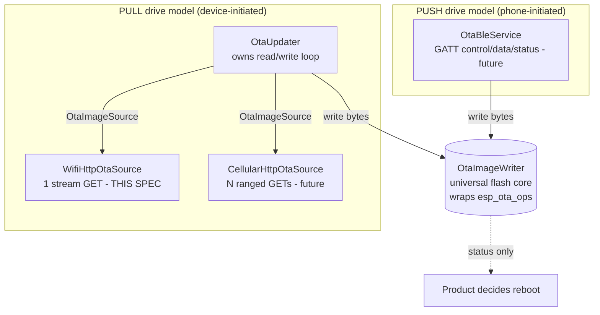
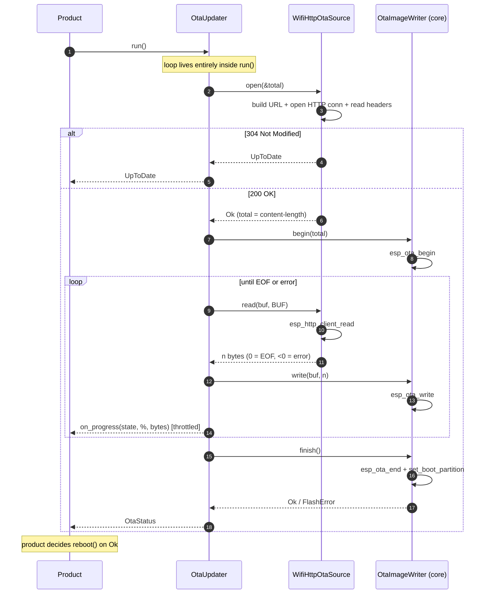
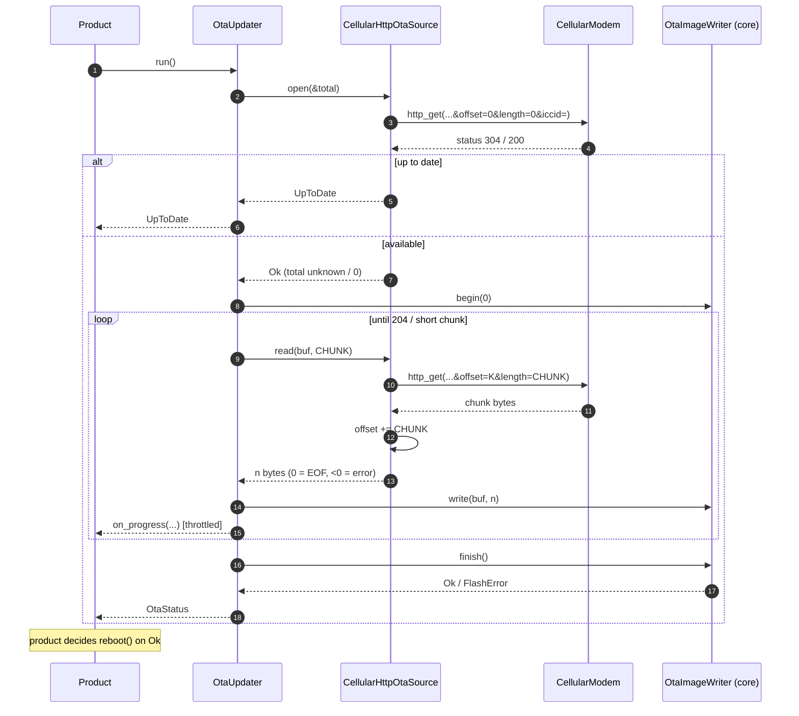
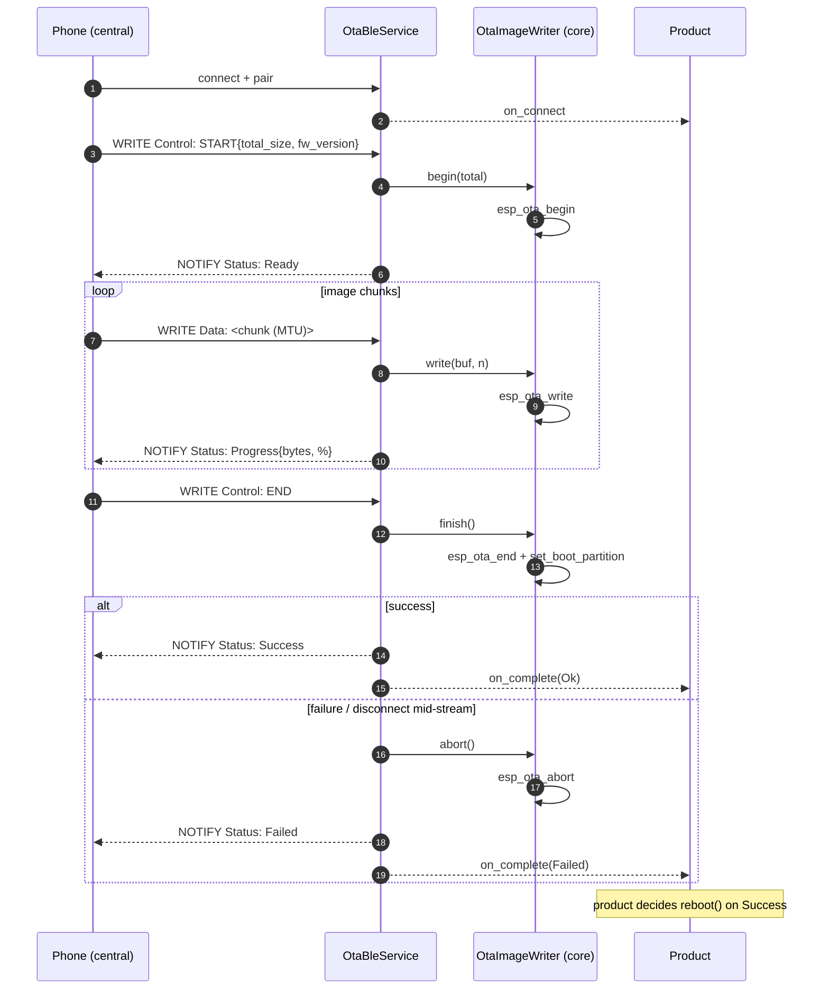

# airgradient-ota Spec

> **This is a spec.** It describes how a feature **will be built**, not what
> currently exists. Once the feature ships, the component README becomes the
> source of truth and this file is typically deleted. See `docs/STYLE.md` →
> "Doc Lifecycle".

A transport-agnostic Over-The-Air (OTA) firmware update component for
AirGradient ESP-IDF devices. It separates the universal flash-write core
(`OtaImageWriter`, wrapping `esp_ota_ops`) from the transport that delivers
the image bytes. Two delivery models are designed up front: a **pull** model
for HTTP-style transports (WiFi now, cellular later) and a **push** model for
BLE (later). This spec implements the **WiFi pull** path and the universal
core, and defines — but does not implement — the cellular and BLE seams so the
architecture does not have to change when they land.

## Problem

The legacy library in `tmp/airgradient-ota/` works but does not fit this
repository's conventions and is hard to extend:

- **God-class inheritance** — a base `AirgradientOTA` holds the flash logic and
  every transport (`AirgradientOTAWifi`, `AirgradientOTACellular`) subclasses
  it, fusing transport, URL building, and flash writing into one hierarchy.
  This is the same anti-pattern `airgradient-client` was built to remove.
- **Dead Arduino cruft** — `#ifdef ARDUINO` / `#ifndef ESP8266` guards and
  `Arduino.h` includes that this ESP-IDF-only codebase does not need.
- **Stringy callbacks** — progress is reported through a raw function pointer
  with the percentage passed as a stringified integer (`"100"`).
- **Magic numbers** — hard-coded URL buffer sizes (`200`), chunk sizes
  (`64000`), and an assumed image size (`1400000`).
- **Untestable on host** — direct `esp_http_client` / `esp_ota_ops` /
  `MILLIS()` calls with no abstraction or mock seam.
- **Mixed drive models** — the single `updateIfAvailable()` API only fits
  device-initiated pull. BLE is phone-initiated push and does not fit it,
  so bolting BLE onto the same hierarchy later would distort the design.

## Goals

- A universal, transport-agnostic flash-write core (`OtaImageWriter`) that
  every transport — pull or push — terminates at.
- A pull transport seam (`OtaImageSource`) shared by all device-initiated
  HTTP transports (WiFi, cellular).
- A blocking pull orchestrator (`OtaUpdater`) that owns the read→write loop,
  progress throttling, and abort-on-error; it touches only the two HAL
  interfaces and knows nothing about the transport.
- Implement the **WiFi pull** path: stream one HTTP GET through
  `esp_http_client` directly into the writer.
- Typed results (`OtaStatus`) and a struct-based progress callback — no
  stringly-typed messages.
- Host-testable: the orchestrator and URL builder run under `TEST_HOST`
  against a mock source and fake writer; ESP-IDF headers are isolated behind
  `#ifndef TEST_HOST` in the driver `.cpp` files.
- Caller supplies all request inputs explicitly (`OtaRequest`); no globals.
- Define the cellular pull source and the BLE push service seams (interfaces +
  flow diagrams) for future reference, without implementing them.

## Non-Goals

- **No cellular implementation** — the `OtaImageSource` seam is defined; the
  `CellularHttpOtaSource` driver is future work.
- **No BLE implementation** — the `OtaBleService` GATT flow is designed; the
  service is future work.
- **No reboot** — the component reports a final `OtaStatus`; the product
  decides whether and when to call `reboot()`.
- **No transport security (known limitation)** — downloads use plain HTTP,
  matching the legacy behavior. This gives **no transport authentication**:
  `esp_ota` checks image _integrity_ (SHA-256 against the image's own header),
  which is not the same as _authenticity_. With no Secure Boot v2 / signed app
  configured on these products, a man-in-the-middle could serve a malicious but
  internally-consistent image. Accepted for now; **HTTPS and signed images are
  explicit future improvements**, not part of this work.
- **No rollback / health-check policy** — marking the new image valid
  (`esp_ota_mark_app_valid_cancel_rollback`) and anti-rollback are product
  responsibilities, out of scope here.
- **No background task ownership** — `OtaUpdater::run()` is blocking and runs
  on a task the product provides; the component creates no tasks of its own.

## Design

### Layering

The `OtaImageWriter` is the single universal piece every transport terminates
at. Pull transports share the `OtaImageSource` seam and are driven by
`OtaUpdater`; the push transport (BLE) owns its own GATT flow and feeds the
writer directly. "Is an update available?" semantics live only in the pull
path. Reboot is never performed here.



| Concern | WiFi (this spec) | Cellular (future) | BLE (future) |
|---|---|---|---|
| Drive model | Pull | Pull | Push |
| Orchestrator | `OtaUpdater` | `OtaUpdater` | `OtaBleService` |
| Transport seam | `OtaImageSource` | `OtaImageSource` | GATT characteristics |
| Fetch | 1 stream GET | N ranged GETs | Phone writes |
| Availability check | HTTP 304/200 | HTTP 304/200 | Phone decides |
| Flash core | `OtaImageWriter` | `OtaImageWriter` | `OtaImageWriter` |
| Reboot | Product | Product | Product |

### Types

```cpp
// types/ota_types.h
#include <cstddef>
#include <cstdint>
#include <functional>

enum class OtaStatus : uint8_t {
  Ok,               // image downloaded, written, and boot partition set
  UpToDate,         // server returned 304 — current firmware is newest
  Declined,         // server declined to serve an image (e.g. 400/404)
  TransportError,   // connection / DNS / read failure, or truncated download
  ServerError,      // unexpected HTTP status or empty body
  FlashError,       // esp_ota_begin/write/end/set_boot_partition failure
  InvalidImage,     // image failed validation at finish()
  InvalidArgument,  // null/empty request field or null dependency
};

enum class OtaState : uint8_t { Idle, Checking, Downloading, Applying, Done, Skipped, Failed };

// Progress state emission points (see OtaUpdater::run()). A terminal state
// (Done / Skipped / Failed) is ALWAYS emitted:
//   Checking    - emitted once before source.open()
//   Downloading - emitted once immediately after writer.begin(), then again
//                 during the read/write loop (throttled to
//                 CONFIG_AG_OTA_PROGRESS_INTERVAL_MS)
//   Applying    - emitted once immediately before writer.finish()
//   Done        - terminal: image written and boot partition set (Ok)
//   Skipped     - terminal: no update applied (UpToDate / Declined)
//   Failed      - terminal: any error outcome
// percent = total_size > 0 ? min(100, bytes_written * 100 / total_size) : 0

// AirGradient device model. The caller selects a model; the OTA component
// translates it to the server URL shape (path segment + serial format).
// Extend this enum as new models are supported.
enum class OtaDeviceModel : uint8_t { OneOpenAir, Max, Go };

struct OtaProgress {
  OtaState state;
  size_t bytes_written;
  size_t total_size;  // 0 when unknown (e.g. cellular chunked)
  uint8_t percent;    // 0..100; 0 when total unknown
};

// std::function may heap-allocate; this is intentional and consistent with
// provisioning's ProvisioningEventCallback. Set once before run(); the
// callback fires synchronously on the run() task.
using OtaProgressCallback = std::function<void(const OtaProgress &)>;

// Caller-supplied, per-update inputs. The string fields need only be valid
// during construction of the source — the source copies the bounded fields it
// needs into internal fixed buffers (see WifiHttpOtaSource).
struct OtaRequest {
  const char *serial_number;   // e.g. "aabbccddeeff"
  const char *current_firmware;// e.g. "3.1.21"
  const char *http_domain;     // e.g. "hw.airgradient.com"
  OtaDeviceModel model;        // device model; OTA maps it to the URL shape
};
```

### Installer core (universal)

```cpp
// hal/ota_image_writer.h
class OtaImageWriter {
public:
  virtual ~OtaImageWriter() = default;

  // Select the next OTA partition and open it for writing.
  // total_size == 0 means unknown (OTA_SIZE_UNKNOWN).
  virtual OtaStatus begin(size_t total_size) = 0;

  // Append a chunk to the open partition. Must be called between begin()
  // and finish(). len == 0 returns InvalidArgument.
  virtual OtaStatus write(const uint8_t *data, size_t len) = 0;

  // Validate the image and set it as the next boot partition.
  // Does NOT reboot.
  virtual OtaStatus finish() = 0;

  // Free the open handle without activating the image. Idempotent.
  virtual void abort() = 0;

  // Total bytes accepted by write() since begin().
  virtual size_t bytes_written() const = 0;
};
```

The concrete `EspOtaImageWriter` (`backends/esp/`) wraps `esp_ota_ops`
(`esp_ota_get_next_update_partition` → `esp_ota_begin` → `esp_ota_write` →
`esp_ota_end` → `esp_ota_set_boot_partition`), with all ESP-IDF includes
behind `#ifndef TEST_HOST`. This is the legacy base-class flash logic,
cleaned up and freed of transport knowledge.

ESP-IDF error → `OtaStatus` mapping:

| Call / result | `OtaStatus` |
|---|---|
| `esp_ota_get_next_update_partition` returns null | `FlashError` |
| `esp_ota_begin` fails | `FlashError` |
| `esp_ota_write` fails | `FlashError` |
| `esp_ota_end` → `ESP_ERR_OTA_VALIDATE_FAILED` | `InvalidImage` |
| `esp_ota_end` → other error | `FlashError` |
| `esp_ota_set_boot_partition` fails | `FlashError` |
| rollback / pending-verify state | out of scope (product decides) |

### Pull transport seam

```cpp
// hal/ota_image_source.h
class OtaImageSource {
public:
  virtual ~OtaImageSource() = default;

  // Resolve availability and open the byte stream.
  //  Ok                -> an update is available; read() will yield bytes
  //  UpToDate          -> server returned 304
  //  Declined          -> server declined to serve an image (e.g. 400/404)
  //  errors            -> TransportError / ServerError
  // out_total_size must be non-null; set to the image size when known, 0
  // otherwise. Passing nullptr returns InvalidArgument.
  virtual OtaStatus open(size_t *out_total_size) = 0;

  // Read the next chunk into buf.
  //  > 0 -> bytes read
  //    0 -> end of image (EOF)
  //  < 0 -> error (including invalid args: buf == nullptr || buf_size == 0)
  virtual int read(uint8_t *buf, size_t buf_size) = 0;

  // Release transport resources. Idempotent. The orchestrator calls this
  // after EVERY open() — including UpToDate and error returns — so the
  // implementation must tolerate close() whether or not a stream was opened.
  virtual void close() = 0;
};
```

### Pull orchestrator

`OtaUpdater::run()` is a single blocking call. The product wires the pieces,
calls `run()` once, and decides reboot from the returned status. **The loop
lives inside `run()`, never on the product side.**

```cpp
// services/ota_updater.h
class OtaUpdater {
public:
  OtaUpdater(OtaImageSource &source, OtaImageWriter &writer);

  void set_on_progress(OtaProgressCallback cb);

  // open -> begin -> loop(read -> write, throttled progress) -> finish.
  // Aborts the writer on any read/write error. Always closes the source.
  //
  // Blocking, non-reentrant, not thread-safe: run one update per instance at
  // a time. Concurrent or reentrant calls are undefined.
  OtaStatus run();

private:
  OtaImageSource &_source;
  OtaImageWriter &_writer;
  OtaProgressCallback _on_progress;
};
```

Reference loop body:

```cpp
OtaStatus OtaUpdater::run() {
  emit_progress(OtaState::Checking, 0);

  size_t total = 0;
  OtaStatus st = _source.open(&total);
  if (st != OtaStatus::Ok) {                       // UpToDate / Declined / error
    _source.close();                               // always close after open()
    // UpToDate and Declined are non-update outcomes, not failures.
    bool skipped = (st == OtaStatus::UpToDate || st == OtaStatus::Declined);
    emit_progress(skipped ? OtaState::Skipped : OtaState::Failed, total);
    return st;
  }

  st = _writer.begin(total);
  if (st != OtaStatus::Ok) { _source.close(); emit_progress(OtaState::Failed, total); return st; }

  // Emit one immediate Downloading so small images still report progress.
  emit_progress(OtaState::Downloading, total);

  uint8_t buf[CONFIG_AG_OTA_READ_BUFFER_SIZE];
  uint64_t last_cb = RTOS::get_time_ms();
  while (true) {
    int n = _source.read(buf, sizeof(buf));
    if (n == 0) break;                             // EOF
    if (n < 0) { _writer.abort(); _source.close();
                 emit_progress(OtaState::Failed, total); return OtaStatus::TransportError; }

    st = _writer.write(buf, static_cast<size_t>(n));
    if (st != OtaStatus::Ok) { _writer.abort(); _source.close();
                               emit_progress(OtaState::Failed, total); return st; }

    const uint64_t now = RTOS::get_time_ms();
    if (now - last_cb >= CONFIG_AG_OTA_PROGRESS_INTERVAL_MS) {
      emit_progress(OtaState::Downloading, total); // percent derived from bytes_written/total
      last_cb = now;
    }
  }

  _source.close();

  // Guard against a truncated download when the total size is known.
  if (total > 0 && _writer.bytes_written() != total) {
    _writer.abort();
    emit_progress(OtaState::Failed, total);
    return OtaStatus::TransportError;
  }

  emit_progress(OtaState::Applying, total);
  st = _writer.finish();
  emit_progress(st == OtaStatus::Ok ? OtaState::Done : OtaState::Failed, total);
  return st;
}
```

### AG-server URL builder (shared)

Pulled out of the legacy `buildUrl()` so WiFi and cellular share it. The
builder is the single place that knows the AirGradient URL conventions; it
translates `OtaDeviceModel` into the path segment and serial format so callers never
deal with URL strings.

```cpp
// services/ota_url.h
namespace ota_url {
// Builds the base firmware URL from req. Maps req.model to the path/serial
// shape (see table below) and appends ?current_firmware={fw}. Callers may
// append transport-specific params (e.g. cellular &offset=&length=&iccid=).
// Returns false on truncation, missing required fields, or unknown model.
bool build(const OtaRequest &req, char *out, size_t out_size);
}
```

`OtaDeviceModel` → URL translation (mirrors the legacy library):

| `OtaDeviceModel` | URL shape |
|---|---|
| `OneOpenAir` | `http://{domain}/sensors/airgradient:{sn}/generic/os/firmware.bin?current_firmware={fw}` |
| `Max` | `http://{domain}/sensors/{sn}/max/firmware.bin?current_firmware={fw}` |
| `Go` | `http://{domain}/sensors/airgradient:{sn}/go/firmware.bin?current_firmware={fw}` |

> Note the two models differ in **both** the path segment (`generic/os` vs
> `max`) **and** the serial format (`airgradient:` prefix vs bare serial).
> Centralizing this mapping in `ota_url` — keyed off the `OtaDeviceModel` enum — is
> exactly why the caller passes a model rather than a raw path.

### WiFi pull source (this spec)

`WifiHttpOtaSource` implements `OtaImageSource` over `esp_http_client`,
streaming a single GET — no whole-image buffer, no assumption that the server
honors ranged requests on the WiFi endpoint.

```cpp
// backends/wifi/wifi_http_ota_source.h
class WifiHttpOtaSource : public OtaImageSource {
public:
  // Copies the bounded request fields into internal buffers and builds the URL
  // at construction; the OtaRequest (and its strings) need not outlive this
  // call. If the URL build fails (missing field / truncation / unknown model),
  // construction stores the failure and open() reports it.
  explicit WifiHttpOtaSource(const OtaRequest &request);
  OtaStatus open(size_t *out_total_size) override;  // returns _init_status on failure
  int read(uint8_t *buf, size_t buf_size) override; // esp_http_client_read
  void close() override;                             // close + cleanup (idempotent)

private:
  char _url[CONFIG_AG_OTA_URL_BUFFER_SIZE];          // built once at construction
  OtaStatus _init_status;                            // Ok, or InvalidArgument if build failed
  void *_client = nullptr;                           // opaque esp_http_client_handle_t (cast in .cpp)
};
```

> **Header isolation:** backend headers must not expose ESP-IDF types and must
> compile under `TEST_HOST`. The `esp_http_client` handle is held as an opaque
> `void *` and cast inside the `.cpp`; all `esp_http_client` includes sit behind
> `#ifndef TEST_HOST` in the `.cpp` only.

`open()` first returns `_init_status` if construction failed (`InvalidArgument`).
Otherwise it opens the connection, reads the response headers, and maps the
status code. Availability is determined by the response itself: WiFi reads the
status from the header; cellular uses an empty-body probe request
(`offset=0&length=0`). Mapping:

| HTTP status | `OtaStatus` | Notes |
|---|---|---|
| `200`, `content_length > 0` | `Ok` | `content_length` → `*out_total_size` |
| `200`, unknown / chunked length | `Ok` | `*out_total_size = 0` (size known only at EOF) |
| `200`, `content_length == 0` | `ServerError` | nothing to download |
| `304` | `UpToDate` | current firmware is newest |
| `400` / `404` | `Declined` | server declined to serve an image |
| any other | `ServerError` | unexpected |

#### WiFi flow



### Future reference — cellular pull source

`CellularHttpOtaSource` would implement the same `OtaImageSource` over
`CellularModem::http_get`, issuing one ranged GET per chunk
(`...&offset=K&length=CHUNK&iccid=...`) into a fixed chunk buffer because the
I²C↔serial bridge cannot hold a whole image. It reads until a `204` or a
short final chunk. It drops straight into `OtaUpdater` — the orchestrator and
writer are unchanged. `total_size` is reported as `0` (unknown), so progress
percent stays `0` and completion is detected by EOF.

> **Classification is per-transport — do not share a classifier.** The
> response-status / body-length → `OtaStatus` mapping lives inside each
> source's `open()`, because the same response means different things per
> transport. Most notably, a `200` with body length `0`:
>
> - **WiFi** treats it as `ServerError` (an empty body = nothing to download).
> - **Cellular** treats it as the **update-available** indicator: the probe
>   request asks for `offset=0&length=0`, so a `200` with an empty body is the
>   expected "an image exists" signal, after which the ranged GETs begin.
>
> Because `(200, 0)` must map to opposite `OtaStatus` values, a shared
> `classify(status, length)` helper is impossible by construction. Keep WiFi's
> mapping in `WifiHttpOtaSource` and give `CellularHttpOtaSource` its own.



### Future reference — BLE push service

BLE inverts the control flow: the phone drives, the device receives. There is
**no `OtaUpdater` and no `OtaImageSource`**. `OtaBleService` owns the complete,
reusable GATT flow built on the `AgBleServer` HAL and feeds `OtaImageWriter`
directly from each data-write callback. The product only supplies the
`AgBleServer` and wires connect/disconnect and the completion callback —
mirroring how `ProvisioningManager` borrows transports.

GATT layout (owned entirely by `OtaBleService`, reusable across products):

```text
 OTA Service (UUID)
   ├─ Control  char  [WRITE]            START{total, fw_version} | END | ABORT
   ├─ Data     char  [WRITE / WNR]      raw image bytes, MTU-sized
   └─ Status   char  [READ | NOTIFY]    state + bytes + percent + result
```

```cpp
// services/ota_ble_service.h  (future)
class OtaBleService {
public:
  OtaBleService(AgBleServer &server, OtaImageWriter &writer);
  bool setup();   // add_service + characteristics + write callbacks
  void teardown();
  void set_on_complete(std::function<void(OtaStatus)> cb);
};
```



### Product usage (WiFi)

```cpp
OtaRequest req{ serial, current_fw, "hw.airgradient.com", OtaDeviceModel::OneOpenAir };
WifiHttpOtaSource source(req);
EspOtaImageWriter writer;
OtaUpdater updater(source, writer);
updater.set_on_progress([](const OtaProgress &p) {
  AG_LOGI("App", "ota %u%% (%u bytes)", p.percent, (unsigned)p.bytes_written);
});

OtaStatus st = updater.run();        // single blocking call
if (st == OtaStatus::Ok) reboot();   // product decides
```

### Component structure

```text
components/airgradient-ota/
  hal/
    ota_image_writer.h       # universal flash-write interface
    ota_image_source.h       # pull transport seam
  types/
    ota_types.h              # OtaStatus, OtaState, OtaProgress, OtaRequest
  backends/
    esp/
      esp_ota_image_writer.h
      esp_ota_image_writer.cpp   # esp_ota_ops, #ifndef TEST_HOST
    wifi/
      wifi_http_ota_source.h
      wifi_http_ota_source.cpp   # esp_http_client streaming, #ifndef TEST_HOST
  services/
    ota_updater.h
    ota_updater.cpp          # pull orchestrator (host-testable)
    ota_url.h
    ota_url.cpp              # AG-server URL builder (host-testable)
  tests/
    CMakeLists.txt
    ota_updater.tests.cpp
    ota_url.tests.cpp
    mock_ota_image_source.h
    fake_ota_image_writer.h
  CMakeLists.txt
  Kconfig
  README.md
  spec.md                    # this file (deleted once shipped)
```

### CMake and dependencies

```cmake
idf_component_register(
    SRCS "services/ota_updater.cpp"
         "services/ota_url.cpp"
         "backends/esp/esp_ota_image_writer.cpp"
         "backends/wifi/wifi_http_ota_source.cpp"
    INCLUDE_DIRS "."
    REQUIRES airgradient-common app_update esp_http_client
)
```

- `airgradient-common` — `RTOS` timing, `AG_LOG` macros.
- `app_update` — `esp_ota_ops` flash API.
- `esp_http_client` — WiFi streaming download.
- Future: `airgradient-cellular` (cellular source), `airgradient-ble`
  (BLE service).

### Kconfig (menu "AirGradient OTA")

Symbols use the repo-wide `AG_` prefix (matching `AG_CLIENT_*`, `AG_WIFI_*`,
`AG_HTTP_*`) to avoid collisions with ESP-IDF and other components.

| Symbol | Default | Purpose |
|---|---|---|
| `CONFIG_AG_OTA_HTTP_TIMEOUT_MS` | `15000` | HTTP connect/read timeout |
| `CONFIG_AG_OTA_READ_BUFFER_SIZE` | `1024` | Per-read download/flash buffer |
| `CONFIG_AG_OTA_PROGRESS_INTERVAL_MS` | `250` | Minimum gap between progress callbacks |
| `CONFIG_AG_OTA_URL_BUFFER_SIZE` | `256` | Max built firmware URL length |

## Implementation Plan

1. Scaffold the component: directories, `CMakeLists.txt`, `Kconfig`,
   `README.md`; register `tests/` in the top-level `tests/CMakeLists.txt`.
2. Add `types/ota_types.h` (enums, `OtaProgress`, `OtaRequest`, callback).
3. Add `hal/ota_image_writer.h` and `hal/ota_image_source.h`.
4. Add `services/ota_url.{h,cpp}` with host tests.
5. Add `services/ota_updater.{h,cpp}` with host tests (mock source, fake
   writer): happy path, up-to-date, transport error, write/flash failure →
   abort, progress throttling.
6. Add `backends/esp/esp_ota_image_writer.{h,cpp}` (`esp_ota_ops`,
   `#ifndef TEST_HOST`).
7. Add `backends/wifi/wifi_http_ota_source.{h,cpp}` (`esp_http_client`
   streaming, `#ifndef TEST_HOST`).
8. Write `README.md` from the component template; wire a WiFi example in the
   reference product; HIL-verify a real update.
9. (Future) Add `backends/cellular/cellular_http_ota_source` and
   `services/ota_ble_service` against the seams defined here.

## Testing Strategy

- **Host tests** (`TEST_HOST`):
  - `ota_url` — per-`OtaDeviceModel` path/serial mapping, query formatting,
    truncation, missing fields, unknown model.
  - `OtaUpdater` — against `mock_ota_image_source.h` (Trompeloeil) and
    `fake_ota_image_writer.h`: verifies open→begin→read/write→finish ordering,
    `UpToDate`/`Declined` short-circuit emit terminal `Skipped` (and
    `close()` is still called), abort on read error, abort on write/flash error,
    truncated-download guard (`bytes_written != total` → `TransportError`),
    `bytes_written` accounting, progress state sequence
    (`Checking`→`Downloading`→`Applying`→`Done`), an immediate `Downloading`
    even for a single-chunk (small) image, and progress-callback throttling.
    Throttling is driven by `RTOS::get_time_ms()`, mocked on host with
    `trompeloeil::mock_interface<RTOS>` + `RTOS::set_instance()` (same pattern as
    `airgradient-cellular/tests/simcom_a7672x.tests.cpp`).
- **Not host-tested:** `EspOtaImageWriter` and `WifiHttpOtaSource` wrap
  ESP-IDF APIs and are excluded from host builds via `#ifndef TEST_HOST`;
  kept thin and verified by HIL.
- **HIL:** real WiFi update against `hw.airgradient.com` — fresh image
  applies and boots; `304` path reports `UpToDate`; mid-download disconnect
  aborts cleanly without bricking (old partition still bootable).

## Open Questions

- **Model coverage** — `OtaDeviceModel` currently supports `OneOpenAir`, `Max`,
  and `Go`; confirm the full set of models that need OTA and their exact URL
  shapes as they are added to the `ota_url` translation table.
- **`current_firmware` query param** — confirm the WiFi endpoint still keys
  "is an update available?" off `?current_firmware=` returning `304`, matching
  the legacy behavior.
- **Progress when total is unknown** — for cellular (no content length),
  `OtaUpdater` emits byte-count-only progress with `percent = 0`; confirm this
  is acceptable for product UX or whether the source should estimate a total.
- **Read buffer size** — is `1024` (legacy WiFi value) the right default, or
  should it be larger to reduce `esp_ota_write` calls?
