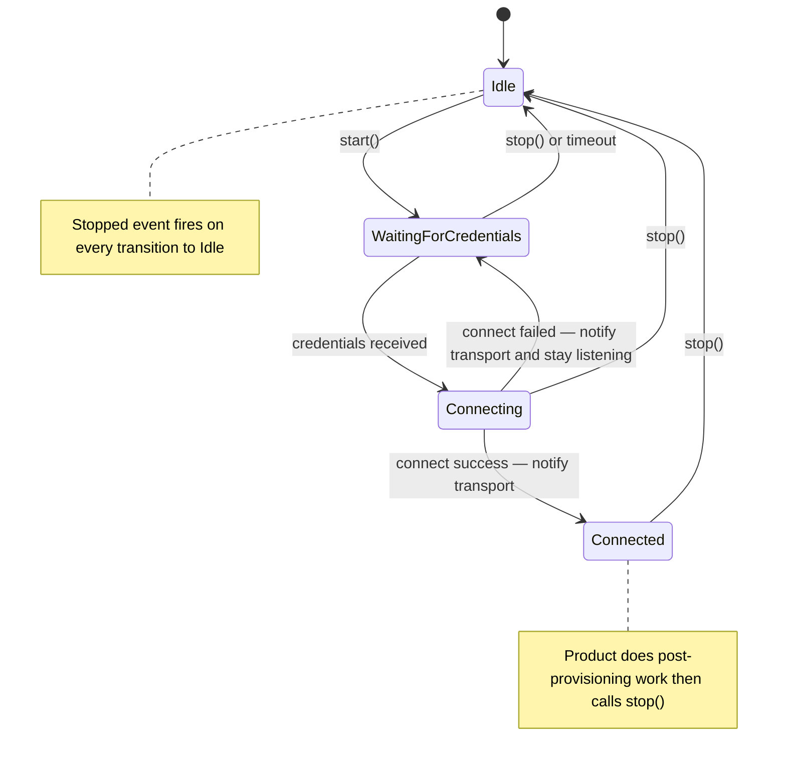

# Provisioning Interface — Component Spec

> **This is a spec.** It describes how a feature **will be built**, not what
> currently exists. Once the feature ships, the corresponding component README
> becomes the source of truth and this file is typically deleted. See
> `docs/STYLE.md` → "Doc Lifecycle".

The `airgradient-provisioning` component provides a standardized Wi-Fi
provisioning flow for every AirGradient product. It owns the provisioning
state machine and two transports — a Wi-Fi captive portal and a BLE GATT
interface — so product code never implements provisioning logic directly.
Product code creates the radio, BLE, and HTTP server objects, then hands
them to the provisioning manager and receives lifecycle events via a single
callback.

## Problem

Wi-Fi provisioning does not yet exist in the new firmware architecture.
When a device starts with no stored Wi-Fi credentials, there is no shared
component to collect credentials from the user. Without a common
provisioning component:

- Each product would reimplement captive portal, BLE GATT profile, DNS
  redirect, and credential handling
- The BLE provisioning protocol would diverge across products, breaking
  the AirGradient mobile app
- None of the provisioning state machine logic would be host-testable
- Credential gathering, scan filtering, and connection-attempt retry would
  be duplicated and inconsistent

## Goals

- Provide a non-blocking provisioning manager with a single event callback
  for the full provisioning lifecycle
- Support two transports simultaneously: Wi-Fi captive portal and BLE GATT
- Keep the BLE GATT protocol backward compatible with the existing
  AirGradient mobile app
- Define a new JSON-based captive portal API (no backward compatibility
  constraint for the portal)
- Filter and deduplicate Wi-Fi scan results consistently across both
  transports
- Make the provisioning state machine and all data codec logic
  host-testable
- Borrow `WifiManager`, `AgBleServer`, and `HttpServer` by reference —
  product code retains ownership of these objects
- Land at **Scaffold** status

## Non-Goals

- Application-level provisioning status (server reachable, monitor
  configured, etc.) — the component exposes `send_ble_status()` for the
  product to push those codes, but does not own the logic
- Product-specific policies: when to enter provisioning, how to trigger it
  from the UI, what to show on a display
- Wi-Fi reconnection after provisioning (product owns `WifiManager`)
- Credential storage beyond what `esp_wifi_set_config()` does internally
  via NVS
- OTA, MQTT, cloud registration, or any application-level protocol
- Custom BLE pairing flows beyond the existing `NO_INPUT_NO_OUTPUT` +
  bonding model

## Design

### Architecture

```text
Product Code
      │
      │  set_on_event() / start() / stop() / send_ble_status()
      ▼
┌──────────────────────┐
│  ProvisioningManager │  ← Pure C++ state machine, mutex-protected
│     (service)        │  ← Host-testable with mocked dependencies
└──────┬───────────────┘
       │ owns (internal)
       ├─── WifiPortalTransport ── uses HttpServer& + WifiManager&
       │        └── CaptiveDnsResponder (lwIP raw UDP)
       │
       ├─── BleTransport ── uses AgBleServer&
       │
       └─── ScanFilter (pure C++ utility)
                │
                ▼
       WifiManager& (borrowed — AP, scan, STA connect)
```

- **Product code talks to `ProvisioningManager`**, not the transports
- **Transports are internal** implementation details — not public API
- **`WifiManager`**, **`AgBleServer`**, and **`HttpServer`** are borrowed
  by reference. Product retains ownership and resumes full control after
  `stop()`
- **`ScanFilter`** is a pure function: input `WifiScanEntry[]`, output
  filtered/sorted array. Shared by both transports.

### Directory Layout

```text
airgradient-provisioning/
├── CMakeLists.txt
├── Kconfig
├── README.md
├── provisioning_spec.md          ← this file (deleted after shipping)
├── types/
│   └── provisioning_types.h      ← all public types, enums, structs
├── services/
│   ├── provisioning_manager.h    ← public API (only public header)
│   └── provisioning_manager.cpp
├── internal/
│   ├── scan_filter.h             ← pure C++ scan dedup/filter/sort
│   ├── scan_filter.cpp
│   ├── wifi_portal_transport.h   ← HTTP JSON endpoints + DNS
│   ├── wifi_portal_transport.cpp
│   ├── captive_dns_responder.h   ← lwIP raw UDP DNS responder
│   ├── captive_dns_responder.cpp
│   ├── dns_packet.h              ← pure C++ DNS query parse + response build
│   ├── dns_packet.cpp
│   ├── ble_transport.h           ← GATT profile + JSON codec
│   └── ble_transport.cpp
├── assets/
│   └── portal.html               ← self-contained HTML/CSS/JS
└── tests/
    ├── CMakeLists.txt
    ├── scan_filter.tests.cpp
    ├── dns_packet.tests.cpp
    ├── provisioning_manager.tests.cpp
    ├── wifi_portal_transport.tests.cpp
    └── ble_transport.tests.cpp
```

### Provisioning State Machine



State descriptions:

- **Idle** — provisioning is not running. No transports active.
- **WaitingForCredentials** — AP up, BLE advertising, HTTP serving, DNS
  redirecting. Both transports active. Waiting for credential submission
  from either transport.
- **Connecting** — received credentials, STA connect attempt in progress.
  AP and BLE stay alive (APSTA mode). New credentials from either
  transport are rejected until the current attempt resolves.
- **Connected** — STA has an IP. The `Connected` event fires. Transports
  remain alive so the product can send application-level BLE status codes
  via `send_ble_status()`. Product calls `stop()` when done.

### Timeout Behavior

The provisioning manager supports a configurable inactivity timeout:

- Timeout timer starts when provisioning enters `WaitingForCredentials`
- Timer pauses when any client connects (AP STA join or BLE central
  connect)
- Timer resumes when all clients disconnect
- Timer fires only when client count is zero for the full duration
- On expiry: auto-`stop()`, `Stopped` event fires with `TimedOut` reason
- `overall_timeout_ms = 0` disables timeout entirely

### Event Callback

A single callback delivers all provisioning lifecycle events to the
product:

```cpp
enum class ProvisioningEvent : uint8_t {
    Started,              // transports active, waiting for credentials
    CredentialsReceived,  // credentials received from a transport
    Connecting,           // WiFi STA connect attempt in progress
    ConnectFailed,        // connect attempt failed, still listening
    Connected,            // WiFi STA connected with IP
    Stopped,              // provisioning torn down
};
```

The callback receives a `ProvisioningEventInfo` struct:

```cpp
struct ProvisioningEventInfo {
    ProvisioningEvent      event;
    ProvisioningData       data = {};         // populated for CredentialsReceived, Connected
    uint32_t               ip   = 0;         // populated for Connected
    ProvisioningStopReason stop_reason = {};  // populated for Stopped
};
```

**Threading contract:** callbacks fire from various task contexts (WiFi
event loop, HTTP server, NimBLE). Callers must not block inside callbacks
or call back into `ProvisioningManager`. Signal your own task and do heavy
work there.

### Common Provisioning Data

Both transports parse their input (HTTP JSON or BLE JSON) into a common
struct:

```cpp
struct ProvisioningData {
    char ssid[33]      = {0};
    char password[64]  = {0};
    bool disable_cloud = false;
    WifiStaticIpConfig static_ip = {};

    bool has_static_ip() const { return static_ip.ip != 0; }
};
```

`disable_cloud` defaults to `false` when absent from the payload. This
makes the BLE extension backward compatible — old apps that do not send
`disableCloud` get the default behavior.

Static IP fields use dotted-decimal strings in JSON, parsed to
`uint32_t` (network byte order) internally.

### Wi-Fi Portal Transport

The portal transport registers HTTP routes on the borrowed `HttpServer`
and runs a captive DNS responder on the borrowed `WifiManager`'s AP
interface.

#### Portal API

All data exchange uses JSON. No form-encoded endpoints.

| Endpoint | Method | Purpose |
| --- | --- | --- |
| `/` | GET | Serve the captive portal HTML page |
| `/api/scan` | POST | Trigger a Wi-Fi scan |
| `/api/scan` | GET | Poll for scan results |
| `/api/provision` | POST | Submit provisioning credentials |
| `/api/status` | GET | Poll provisioning state |

**POST `/api/scan`** triggers an async Wi-Fi scan and returns immediately:

```json
{ "status": "scanning" }
```

**GET `/api/scan`** returns the current scan state:

Scanning in progress:

```json
{ "status": "scanning" }
```

Scan complete:

```json
{
  "status": "done",
  "networks": [
    { "ssid": "HomeWiFi", "rssi": -45, "auth": "wpa2_psk", "channel": 6 },
    { "ssid": "Guest", "rssi": -62, "auth": "open", "channel": 1 }
  ]
}
```

No scan triggered yet:

```json
{ "status": "idle" }
```

**POST `/api/provision`** accepts credentials and returns acknowledgment:

Request body:

```json
{
  "ssid": "HomeWiFi",
  "password": "secret",
  "disableCloud": false,
  "staticIp": {
    "ip": "192.168.1.100",
    "netmask": "255.255.255.0",
    "gateway": "192.168.1.1",
    "dns": "8.8.8.8"
  }
}
```

Only `ssid` is required. `password` defaults to empty (open network).
`disableCloud` defaults to `false`. `staticIp` is entirely optional —
absent means DHCP.

Response:

```json
{ "status": "connecting" }
```

**GET `/api/status`** returns the current provisioning state:

```json
{ "state": "waiting" }
```

Possible `state` values: `"waiting"`, `"connecting"`, `"connected"`,
`"failed"`.

#### Captive DNS Responder

A lightweight DNS responder redirects all DNS queries to the AP's IP
address, triggering captive portal detection on phones and browsers.

Implementation uses the lwIP raw UDP API (`udp_new`, `udp_bind`,
`udp_recv`). The response echoes the query's transaction ID and question
section, appends a single A-record answer pointing to the AP IP. No
external dependencies beyond lwIP.

The DNS packet parser and response builder are pure C++ functions
(`dns_packet.h`) — host-testable independently of the UDP binding.

#### Portal HTML

A single self-contained HTML file with inline CSS and JavaScript. No
external dependencies, no CDN links. Embedded in flash via ESP-IDF
`EMBED_FILES`.

The JS uses `fetch()` to call the JSON API endpoints:

1. On load: `POST /api/scan`, then poll `GET /api/scan`
2. Display network list with signal strength and security indicators
3. User selects SSID, enters password, toggles cloud, optionally
   configures static IP
4. `POST /api/provision` with JSON body
5. Poll `GET /api/status` until `connected` or `failed`
6. Display result

Design and styling are minimal for v1 — functionality over aesthetics.

### BLE Transport

The BLE transport creates a GATT provisioning service on the borrowed
`AgBleServer` and a Device Information Service. The wire protocol is
backward compatible with the existing AirGradient mobile app.

#### BLE Advertising

| Field | Value |
| --- | --- |
| GAP device name | Configurable (default `"AirGradient"`) |
| Manufacturer data | `0xFF 0xFF` + `<model>#<deviceId>` |

Advertising stops on central connect and restarts on disconnect (handled
by `AgBleServer` internally).

#### BLE Security

```cpp
set_security(AgBleIoCapability::NO_INPUT_NO_OUTPUT,
             AgBleAuth::BOND | AgBleAuth::SC);
```

Matches the existing firmware's `NimBLEDevice::setSecurityAuth(false,
false, true)` + `BLE_HS_IO_NO_INPUT_NO_OUTPUT`.

#### GATT Services

**Device Information Service (UUID `180A`):**

| Characteristic | UUID | Properties | Value |
| --- | --- | --- | --- |
| Model Number String | `2A24` | READ, READ_ENC | `model_name` from config |
| Serial Number String | `2A25` | READ, READ_ENC | `serial_number` from config |
| Firmware Revision String | `2A26` | READ, READ_ENC | `firmware_version` from config |
| Manufacturer Name String | `2A29` | READ, READ_ENC | `"AirGradient"` |

**AirGradient Provisioning Service (UUID `acbcfea8-e541-4c40-9bfd-17820f16c95c`):**

| Characteristic | UUID | Properties | Direction |
| --- | --- | --- | --- |
| Credentials/Status | `703fa252-3d2a-4da9-a05c-83b0d9cacb8e` | READ_ENC, WRITE_ENC, NOTIFY | Client writes credentials, device notifies status |
| Wi-Fi Scan | `467a080f-e50f-42c9-b9b2-a2ab14d82725` | WRITE_ENC, NOTIFY | Client writes to trigger, device notifies pages |

#### BLE Credential Payload

Client writes JSON to the Credentials/Status characteristic:

```json
{
  "ssid": "HomeWiFi",
  "password": "secret",
  "disableCloud": true
}
```

`disableCloud` is optional — absent means `false`. Old apps that send
only `ssid` and `password` work unchanged.

#### BLE Scan Flow

1. Client writes any value to the Scan characteristic
2. Device triggers Wi-Fi scan via `WifiManager`
3. Scan results are filtered by `ScanFilter`
4. Results are sent as paginated notifications (3 networks per page,
   ~100 ms between pages)

No networks found:

```json
{ "found": 0 }
```

Paginated results (one notification per page):

```json
{
  "wifi": [
    { "s": "HomeWiFi", "r": -45, "o": 0 },
    { "s": "Guest", "r": -62, "o": 1 }
  ],
  "page": 1,
  "tpage": 4,
  "found": 10
}
```

| Field | Meaning |
| --- | --- |
| `wifi` | Array of networks in this page |
| `wifi[].s` | SSID |
| `wifi[].r` | RSSI in dBm |
| `wifi[].o` | Open network flag: `1` open, `0` secured |
| `page` | Current page number, starting at `1` |
| `tpage` | Total pages |
| `found` | Total filtered networks found |

#### BLE Status Notifications

Notified on the Credentials/Status characteristic:

```json
{ "status": <code> }
```

Provisioning-owned status codes:

| Code | Name | Meaning |
| --- | --- | --- |
| `0` | `WIFI_CONNECTED` | Wi-Fi connected |
| `10` | `WIFI_CONNECT_FAILED` | Failed to connect to Wi-Fi |

Application-level codes (sent by product via `send_ble_status()`):

| Code | Name | Meaning |
| --- | --- | --- |
| `1` | `CONNECTING_TO_SERVER` | Connecting to AirGradient server |
| `2` | `SERVER_REACHABLE` | AirGradient server is reachable |
| `3` | `MONITOR_CONFIGURED` | Monitor is configured on dashboard |
| `11` | `SERVER_UNREACHABLE` | AirGradient server is unreachable |
| `12` | `GET_CONFIG_FAILED` | Failed to get monitor config |
| `13` | `NOT_REGISTERED` | Monitor not registered on dashboard |

### Scan Filter

A pure C++ utility shared by both transports. Takes raw `WifiScanEntry`
array from `WifiManager::on_scan_complete`, produces a filtered array:

1. Remove entries with empty SSIDs
2. Remove entries weaker than −75 dBm
3. Deduplicate by SSID, keeping the strongest RSSI
4. Sort by RSSI descending
5. Cap at 30 entries

Input/output both use `WifiScanEntry` from `wifi_types.h`.

### Thread Safety

The provisioning manager's state, transport data, and scan results are
protected by a single mutex. All callback handlers (WiFi event loop, HTTP
server, NimBLE, lwIP) acquire the mutex before touching shared state. The
mutex is non-recursive — callbacks are short (state transition + kick
next action), so contention is negligible.

### Types (`types/provisioning_types.h`)

```cpp
#pragma once

#include "wifi_types.h"
#include <cstdint>
#include <functional>

// -- Provisioning data (common across transports) --

struct ProvisioningData {
    char ssid[33]      = {0};
    char password[64]  = {0};
    bool disable_cloud = false;
    WifiStaticIpConfig static_ip = {};

    bool has_static_ip() const { return static_ip.ip != 0; }
};

// -- Events --

enum class ProvisioningEvent : uint8_t {
    Started,              // transports active, waiting for credentials
    CredentialsReceived,  // credentials received from a transport
    Connecting,           // WiFi STA connect attempt in progress
    ConnectFailed,        // connect attempt failed, still listening
    Connected,            // WiFi STA connected with IP
    Stopped,              // provisioning torn down
};

enum class ProvisioningStopReason : uint8_t {
    ProductRequested,     // product called stop()
    TimedOut,             // inactivity timeout expired
};

struct ProvisioningEventInfo {
    ProvisioningEvent      event;
    ProvisioningData       data        = {};
    uint32_t               ip          = 0;
    ProvisioningStopReason stop_reason = {};
};

using ProvisioningEventCallback =
    std::function<void(const ProvisioningEventInfo &)>;

// -- State --

enum class ProvisioningState : uint8_t {
    Idle,
    WaitingForCredentials,
    Connecting,
    Connected,
};

// -- Configuration --

struct ProvisioningApConfig {
    char ssid[33]       = {0};
    char password[64]   = {0};
    uint8_t channel     = 1;
    uint8_t max_clients = 4;
};

struct ProvisioningBleConfig {
    const char *device_name       = "AirGradient";
    const char *manufacturer_data = nullptr;
    const char *model_name        = nullptr;
    const char *serial_number     = nullptr;
    const char *firmware_version  = nullptr;
};

struct ProvisioningConfig {
    ProvisioningApConfig  ap;
    ProvisioningBleConfig ble;
    uint32_t connect_timeout_ms  = 15000;
    uint32_t overall_timeout_ms  = 0;       // 0 = no timeout
};

// -- BLE status code constants --

namespace ProvisioningBleStatus {
    inline constexpr uint8_t WIFI_CONNECTED      = 0;
    inline constexpr uint8_t WIFI_CONNECT_FAILED  = 10;
}
```

### Service Interface (`services/provisioning_manager.h`)

```cpp
#pragma once

#include "../types/provisioning_types.h"

class WifiManager;
class AgBleServer;
class HttpServer;

/// Wi-Fi provisioning manager.
///
/// Owns the provisioning state machine and coordinates two transports
/// (Wi-Fi captive portal and BLE GATT) to collect Wi-Fi credentials
/// from the user.
///
/// Product code creates WifiManager, AgBleServer, and HttpServer, then
/// passes them to start(). The provisioning manager borrows these
/// objects for the duration of the provisioning session. Product code
/// resumes full ownership after stop() returns.
///
/// Lifecycle events are delivered via a single callback set with
/// set_on_event(). Callbacks fire from various task contexts (WiFi
/// event loop, HTTP server, NimBLE). Callers must not block inside
/// callbacks or call back into ProvisioningManager.
///
/// ISR-safe: no
/// Thread-safe: yes (internal mutex)
/// Blocking: no (all outcomes delivered via callbacks)
class ProvisioningManager {
public:
    ProvisioningManager();
    ~ProvisioningManager();

    ProvisioningManager(const ProvisioningManager &) = delete;
    ProvisioningManager &operator=(const ProvisioningManager &) = delete;

    /// Register the event callback. Must be called before start().
    void set_on_event(ProvisioningEventCallback cb);

    /// Start provisioning. Non-blocking.
    ///
    /// Switches wifi to ApSta mode, starts AP, registers HTTP routes,
    /// starts BLE advertising, starts DNS responder.
    ///
    /// @param wifi  Wi-Fi manager — borrowed for AP, scan, STA connect
    /// @param ble   BLE server — nullable during checkpoint 1 (portal-only),
    ///              required reference in final API
    /// @param http  HTTP server — required for captive portal
    /// @param config provisioning configuration
    /// @return false if already running or invalid arguments
    bool start(WifiManager &wifi,
               AgBleServer *ble,
               HttpServer &http,
               const ProvisioningConfig &config);

    /// Stop provisioning. Tears down AP, BLE service, HTTP routes,
    /// DNS responder. Fires Stopped event.
    void stop();

    /// Current provisioning state.
    ProvisioningState state() const;

    /// Send an application-level status code over BLE.
    /// Valid between Connected event and stop().
    /// No-op if BLE transport is not active.
    void send_ble_status(uint8_t status_code);
};
```

**Note on `ble` parameter:** during checkpoint 1 (WiFi portal only), the
`ble` parameter is a nullable pointer. In the final API (checkpoint 2),
it becomes `AgBleServer &ble` — a required reference, matching the
decision that both transports are required for production use.

### Typical Product Usage

```cpp
// Product task — boot sequence

EspWifiHal wifi_hal;
WifiManager wifi(wifi_hal);
NimbleBleServer ble;
IdfHttpServer http;

// 1. Try stored credentials
wifi.set_mode(WifiMode::Sta);
wifi.set_on_got_ip([&](uint32_t ip) {
    xEventGroupSetBits(events, WIFI_CONNECTED_BIT);
});
wifi.set_on_disconnected([&](WifiDisconnectReason r) {
    xEventGroupSetBits(events, WIFI_FAILED_BIT);
});
wifi.connect(sta_config);

auto bits = xEventGroupWaitBits(events,
    WIFI_CONNECTED_BIT | WIFI_FAILED_BIT,
    pdTRUE, pdFALSE, pdMS_TO_TICKS(15000));

if (bits & WIFI_CONNECTED_BIT) {
    // Already provisioned — skip to normal operation
} else {
    // 2. Enter provisioning
    ProvisioningManager prov;
    prov.set_on_event([&](const ProvisioningEventInfo &info) {
        // Fire-and-forget signal to product task
        stored_event = info;
        xEventGroupSetBits(events, PROV_EVENT_BIT);
    });

    ProvisioningConfig cfg = {
        .ap = { .ssid = "airgradient-ABCD", .password = "cleanair" },
        .ble = { .device_name = "AirGradient",
                 .model_name  = "I-9PSL" },
        .overall_timeout_ms = 180000,
    };
    prov.start(wifi, &ble, http, cfg);

    // Product task loop — handle events
    while (true) {
        xEventGroupWaitBits(events, PROV_EVENT_BIT, pdTRUE, pdFALSE,
                            portMAX_DELAY);
        switch (stored_event.event) {
            case ProvisioningEvent::Connected:
                // Do post-provisioning work in product task context
                register_with_server();
                prov.send_ble_status(1);  // connecting to server
                // ...
                prov.send_ble_status(2);  // server reachable
                prov.stop();
                break;
            case ProvisioningEvent::Stopped:
                // Provisioning done — set up normal WiFi callbacks
                goto provisioning_done;
            default:
                break;
        }
    }
    provisioning_done:;
}

// 3. Normal operation — product owns wifi
```

## Implementation Plan

Implementation is split into two checkpoints.

### Checkpoint 1 — Wi-Fi Portal

1. **Scaffold component:** create `CMakeLists.txt`, `Kconfig`, directory
   structure, `README.md` (Scaffold status). `EMBED_FILES` for
   `portal.html`
2. **Define `provisioning_types.h`:** all public types, enums, structs,
   callback aliases. No ESP-IDF dependencies
3. **Implement `ScanFilter`:** pure C++ function — filter, deduplicate,
   sort scan results. Input/output: `WifiScanEntry[]`
4. **Implement `dns_packet.h/.cpp`:** pure C++ DNS query parser and
   A-record response builder. Operates on byte arrays
5. **Implement `CaptiveDnsResponder`:** lwIP raw UDP wrapper that uses
   `dns_packet` functions. Start/stop lifecycle tied to AP
6. **Implement `WifiPortalTransport`:** register HTTP routes on
   `HttpServer` (GET `/`, POST/GET `/api/scan`, POST `/api/provision`,
   GET `/api/status`). JSON responses via cJSON. Serve `portal.html` via
   `register_static()`
7. **Create `portal.html`:** single self-contained HTML file with inline
   CSS and JavaScript. Minimal design, full functionality
8. **Implement `ProvisioningManager`:** state machine (portal-only path),
   mutex protection, event callback dispatch, timeout with client-count
   tracking, WiFi AP/STA orchestration
9. **Host tests:** `ScanFilter`, `dns_packet` parse/build, state machine
   transitions via mocked `WifiHal` and mock `HttpServer`, portal
   transport JSON handler logic via `TestHttpRequest`
10. **Hardware integration test:** flash, connect phone to AP, use portal
    to provision, verify WiFi connects

### Checkpoint 2 — BLE

1. **Implement BLE JSON codec:** parse credential JSON, encode paginated
   scan result JSON, encode status JSON. Pure C++ with cJSON —
   host-testable
2. **Implement `BleTransport`:** create GATT provisioning service and DIS
   on `AgBleServer`. Register write callbacks, send notifications.
   Paginated scan results via timer-based delayed notifications
3. **Integrate BLE into `ProvisioningManager`:** second credential
   source, BLE client connect/disconnect tracking for timeout, scan
   request from BLE
4. **Implement `send_ble_status()`:** forward to Credentials/Status
   characteristic via `set_value()` + `notify()`
5. **Change `ble` parameter to required reference:** update `start()`
   signature from `AgBleServer *ble` to `AgBleServer &ble`
6. **Host tests:** BLE JSON codec, dual-transport state machine, BLE
   connect/disconnect timeout interaction
7. **Hardware integration test:** BLE scan, pair, provision via mobile
   app, verify backward compatibility with existing app

## Testing Strategy

### Host Tests (Pure C++)

Testable via mock `WifiHal`, mock `AgBleServer`, mock `HttpServer` +
Catch2 + Trompeloeil:

- **ScanFilter:** empty input, all filtered out, dedup same SSID, sort
  order, cap at 30, boundary RSSI (exactly −75)
- **DNS packet:** parse valid query, build valid response, malformed query
  handling, transaction ID echo
- **ProvisioningManager state machine:** all state transitions
  (Idle → WaitingForCredentials → Connecting → Connected → Idle),
  failure recovery (Connecting → WaitingForCredentials), stop from each
  state, timeout fires only when no clients connected, timeout pauses on
  client connect
- **Portal transport JSON handlers:** test each HTTP handler via
  `TestHttpRequest` — valid provision request, missing fields, invalid
  JSON, scan trigger and result polling, status polling in each state
- **BLE JSON codec:** parse credentials with/without `disableCloud`,
  encode paginated scan pages, encode status, malformed JSON
- **Dual-transport:** credentials from portal while BLE connected (and
  vice versa), scan request from both transports

### Hardware Verification (Manual)

- Portal: connect phone to AP, captive portal detection triggers, scan
  networks, submit credentials, verify WiFi connects
- Portal: submit wrong credentials, verify failure reported, retry with
  correct credentials
- Portal: static IP provisioning, verify device gets correct IP
- BLE: scan and connect from AirGradient mobile app, verify GATT service
  discovered, scan works, provision works
- BLE: verify backward compatibility — old app can provision without
  `disableCloud` field
- BLE: verify `send_ble_status()` codes appear as notifications
- Timeout: start provisioning with 30s timeout, verify auto-stop when no
  client connects
- Timeout: connect a client, disconnect, verify timer restarts
- Both: start both transports, provision via portal, verify BLE stays
  alive for `send_ble_status()`

## Open Questions

- **Portal HTML scope:** How much static IP UI complexity is acceptable
  for v1? A checkbox to toggle static IP fields, with 4 text inputs
  (IP, netmask, gateway, DNS), is functional but cluttered. Could defer
  static IP UI to v2 while keeping the JSON API ready for it.
- **BLE scan pagination timer:** `esp_timer` is not available in host
  tests. The BLE transport could take a timer abstraction, or host tests
  could verify the JSON encoding and leave pagination timing to hardware
  tests.
- **Scan during STA connect:** If a scan is requested while a STA
  connect attempt is in progress, should it be queued, rejected, or
  should the connect attempt be cancelled first? `WifiManager` may
  reject `start_scan()` during an active connection attempt.
- **Maximum concurrent HTTP connections:** The captive portal
  may receive multiple requests from the same phone (page load, scan
  poll, status poll). The default `CONFIG_AG_HTTP_MAX_CONNECTIONS = 4`
  should be sufficient, but worth verifying under real captive portal
  behavior.
