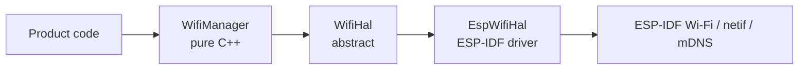

# airgradient-wifi

Shared Wi-Fi foundation for AirGradient products: a `WifiManager` service
that owns the radio, plus a thin `WifiHal` so product code never depends
directly on the ESP-IDF Wi-Fi stack.

## Status

`Scaffold` — the `WifiManager` service, `WifiHal` interface, and
`EspWifiHal` driver are present and host-testable through a mock HAL. No
product currently depends on this component yet; product wiring is the
next step (see `wifi_interface_spec.md`).

## Scope

This component owns:

- Wi-Fi mode control (Off / STA / AP / APSTA)
- STA connection lifecycle with hybrid auto-retry and exponential backoff
- Async Wi-Fi scan (only valid while STA is disconnected)
- Soft-AP control with caller-provided SSID / password
- mDNS lifecycle (auto-start on got-IP, auto-stop on disconnect / Off)
- Static IP configuration as an alternative to DHCP
- Disconnect-reason normalisation from raw ESP-IDF codes
- Credential pass-through to the ESP-IDF default Wi-Fi NVS, plus a
  `clear_saved_credentials()` escape hatch
- Power-save mode selection (`None` / `MinModem` / `MaxModem`)

This component does not own:

- Provisioning UX / transport (BLE provisioning, SmartConfig, …)
- Sockets, HTTP, MQTT, or any application-level protocol
- Channel-biased scanning, regulatory / country configuration
- Dynamic mDNS service add / remove after initial configuration
- AP SSID auto-generation from MAC

## Directory Layout

```text
components/airgradient-wifi/
  hal/
  types/
  services/
  drivers/
  tests/
  CMakeLists.txt
  Kconfig
  README.md
```

- `hal/` — abstract `WifiHal` interface (DI seam, mocked in host tests)
- `types/` — public enums, structs, callbacks, sentinels
- `services/` — `WifiManager` (pure C++, host-testable)
- `drivers/` — `EspWifiHal` (ESP-IDF backed implementation)
- `tests/` — host-side tests owned by this component

## Public Includes

```cpp
#include "hal/wifi_hal.h"
#include "types/wifi_types.h"
#include "services/wifi_manager.h"
#include "drivers/esp_wifi_hal.h"
```

Guideline:

- include from `types/` for shared enums, structs, callbacks
- include from `hal/` only when implementing or mocking the HAL
- include from `services/` for the product-facing API (`WifiManager`)
- include from `drivers/` only when instantiating `EspWifiHal`

## Design

```text
caller -> WifiManager -> WifiHal& -> EspWifiHal -> esp_wifi_* / esp_netif_* / mdns_*
```



`WifiManager` owns: mode state machine, connection retry with exponential
backoff, mDNS auto-start / auto-stop, disconnect-reason normalisation,
DHCP acquisition timeout. The HAL stays thin — translate ESP-IDF events
into typed callbacks, drive timers on behalf of the manager, and forward
mode / scan / connect calls. Driver-side code never makes scheduling
decisions.

## Usage

```cpp
EspWifiHal hw;
WifiManager wifi(hw);

wifi.set_on_connected([] { /* L2 link up */ });
wifi.set_on_got_ip([](uint32_t ip) { /* full connectivity */ });
wifi.set_on_disconnected([](WifiDisconnectReason r) {
    // long-term recovery: sleep, switch to AP, reprovisioning, ...
});

wifi.set_mode(WifiMode::Sta);
WifiStaConfig cfg;
std::strncpy(cfg.ssid, "MyNetwork", sizeof(cfg.ssid) - 1);
std::strncpy(cfg.password, "secret", sizeof(cfg.password) - 1);
wifi.connect(cfg);
```

## Configuration

The component exposes one Kconfig knob under **AirGradient Wi-Fi** in
`menuconfig` (see `components/airgradient-wifi/Kconfig`):

| Symbol | Default | Purpose |
|---|---|---|
| `CONFIG_AG_WIFI_DHCP_TIMEOUT_MS` | `15000` | DHCP / static-IP acquisition timeout after L2 association |

## Dependencies

- `components/airgradient-common/` — RTOS abstraction (timers in tests)
- `esp_wifi`, `esp_netif`, `esp_event`, `mdns`, `nvs_flash`, `lwip`
  (private, only consumed by the ESP-IDF driver)

## Tests

Host tests live in `components/airgradient-wifi/tests/` and run through
the top-level [tests runner](../../tests/README.md). They cover:

- mode state-machine transitions and idempotency
- connect / disconnect / retry backoff
- disconnect-reason mapping (raw ESP-IDF code → `WifiDisconnectReason`)
- mDNS auto-start on got-IP, auto-stop on disconnect / Off
- DHCP timeout policy (treated as `DhcpFailed`, non-retriable)
- mode enforcement on `connect` / `start_scan` / `start_ap`
- scan-only-while-disconnected enforcement

Hardware-only behaviour (real STA association, AP DHCP, mDNS resolution,
static IP application, power-save effects, NVS clear) is verified
manually on a real ESP32.

## Notes

ESP-IDF does not expose a direct DHCP-failure event — only
`IP_EVENT_STA_GOT_IP` and `IP_EVENT_STA_LOST_IP`. The HAL exposes a
small DHCP-watchdog timer (`arm_dhcp_timeout` / `cancel_dhcp_timeout`)
so the manager can keep timing decisions in pure C++. The driver backs
the timer with `esp_timer`.
