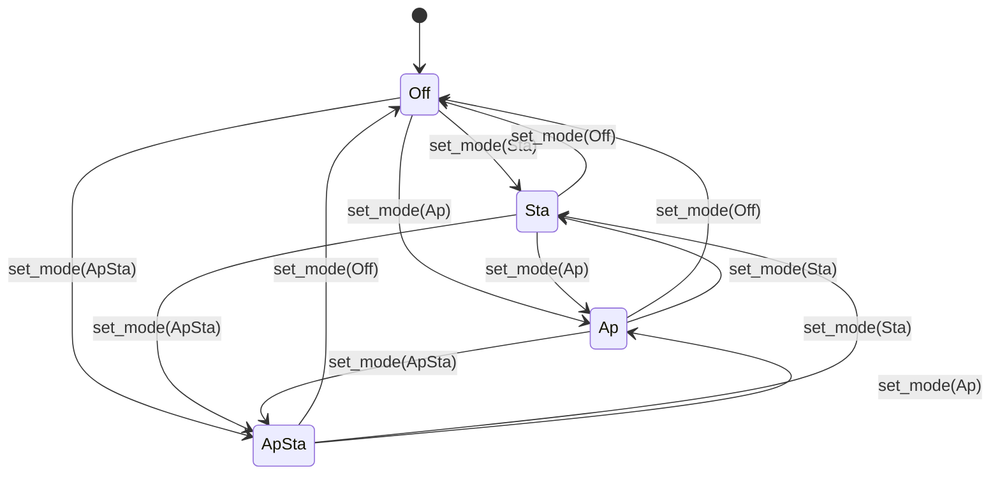
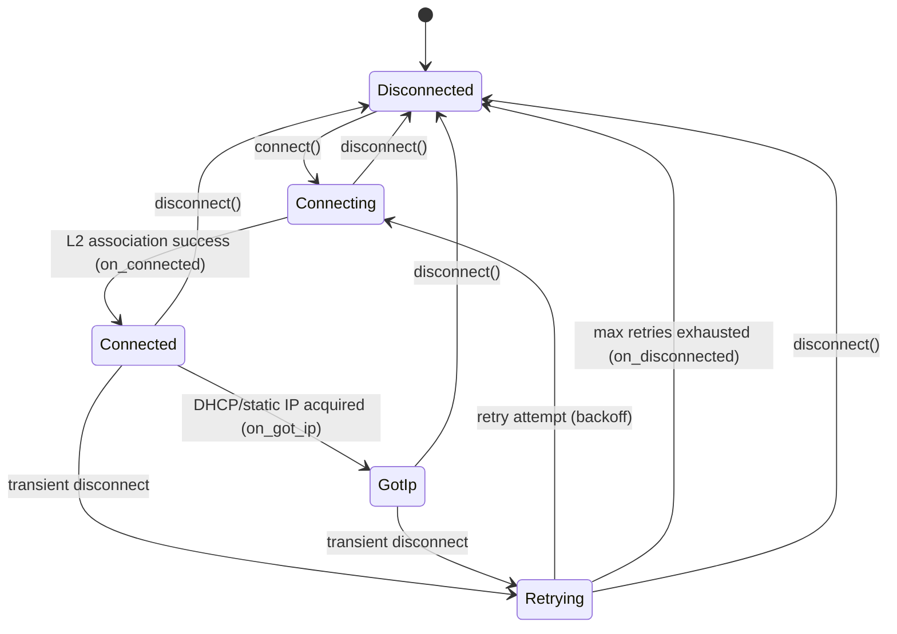

# Wi-Fi Interface — Component Spec

> **This is a spec.** It describes how a feature **will be built**, not what
> currently exists. Once the feature ships, the corresponding component README
> becomes the source of truth and this file is typically deleted. See
> `docs/STYLE.md` → "Doc Lifecycle".

The `airgradient-wifi` component provides a uniform Wi-Fi abstraction for
every AirGradient product. It owns the radio so product code never touches
ESP-IDF Wi-Fi APIs directly. The component manages Wi-Fi mode control
(Off / STA / AP / APSTA), scanning, STA connection lifecycle with
auto-retry, connection status snapshots, event delivery via callbacks, mDNS
announcement, and credential pass-through to the ESP-IDF default Wi-Fi NVS.

## Problem

Wi-Fi functionality does not yet exist in the firmware. When products need
network connectivity, there is no shared component to abstract the ESP-IDF
Wi-Fi stack. Without a common abstraction:

- Each product would directly call `esp_wifi_*`, `esp_netif_*`, and `mdns_*`,
  duplicating boilerplate and error handling
- Retry logic, disconnect handling, and mode management would be
  reimplemented per product
- None of the Wi-Fi logic would be host-testable
- Provisioning and connectivity patterns would diverge across products

## Goals

- Provide a single HAL + service architecture where the service layer
  (`WifiManager`) is pure C++ and fully host-testable
- Support all four Wi-Fi modes: Off, STA, AP, APSTA
- Deliver events via `std::function<>` callbacks, consistent with the
  existing BLE component pattern
- Implement hybrid auto-retry on STA connections: driver handles short-term
  transient failures with exponential backoff; caller owns long-term
  recovery
- Normalize ESP-IDF disconnect reasons into a small actionable enum
- Manage mDNS lifecycle automatically (start on got-IP, stop on
  disconnect/Off)
- Support static IP configuration as an alternative to DHCP
- Expose a `clear_saved_credentials()` method for factory-reset scenarios
- Land at **Scaffold** status

## Non-Goals

- Provisioning UX or transport (BLE provisioning, SmartConfig, etc.)
- Sockets, HTTP, MQTT, or any application-level protocol
- Product-specific Wi-Fi knobs (those live in product settings)
- Channel-biased scanning (deferred to post-v1)
- Country and regulatory configuration (deferred to post-v1; ESP-IDF
  defaults are sufficient)
- Dynamic mDNS service add/remove after initial configuration
- AP SSID auto-generation from MAC (caller always provides the SSID)

## Design

### Architecture

The component uses a two-layer architecture that separates testable logic
from hardware calls:

```text
  Product Code
       │
       ▼
  ┌─────────────┐
  │ WifiManager  │  ← Pure C++, host-testable
  │  (service)   │  ← Owns: state machine, retry, mDNS lifecycle,
  │              │     disconnect reason mapping
  └──────┬───────┘
         │ uses
         ▼
  ┌─────────────┐
  │   WifiHal   │  ← Abstract interface (virtual methods)
  │    (hal)     │  ← Thin: raw connect/disconnect/scan/mode/mdns
  └──────┬───────┘
         │ implemented by
         ▼
  ┌─────────────┐
  │ EspWifiHal  │  ← ESP-IDF calls: esp_wifi_*, esp_netif_*, mdns_*
  │  (driver)   │  ← Not host-testable, minimal logic
  └─────────────┘
```

- **Product code talks to `WifiManager`**, not the HAL directly
- **`WifiHal`** is the dependency-injection seam — mocked in host tests
- **`EspWifiHal`** is a thin translation layer with minimal branching logic

### Directory Layout

```text
airgradient-wifi/
├── CMakeLists.txt
├── README.md
├── hal/
│   └── wifi_hal.h
├── types/
│   └── wifi_types.h
├── services/
│   ├── wifi_manager.h
│   └── wifi_manager.cpp
├── drivers/
│   ├── esp_wifi_hal.h
│   └── esp_wifi_hal.cpp
└── tests/
    ├── CMakeLists.txt
    ├── wifi_manager.tests.cpp
    └── wifi_types.tests.cpp
```

### Mode State Machine

All four modes are supported. Every transition is legal via `set_mode()`.
The manager delegates to the HAL, which handles the internal ESP-IDF
teardown/reinit sequence. Calling `set_mode(X)` when already in mode X is
idempotent and returns `Ok`.



Mode enforcement: `connect()` requires `Sta` or `ApSta` mode. It returns
`InvalidState` otherwise. Callers must call `set_mode()` explicitly before
connecting — no implicit mode switches.

### STA Connection and Retry



The retry policy is hybrid:

- On transient disconnects (AP reboot, signal loss, beacon timeout), the
  manager auto-retries with exponential backoff
- Retry parameters are per-connection, passed in `WifiStaConfig`:
  `max_retry_count`, `initial_retry_interval_ms`, `max_retry_interval_ms`
- After exhausting retries, `on_disconnected` fires with the appropriate
  reason — the caller owns long-term recovery (sleep, mode switch,
  reprovisioning)
- An explicit `disconnect()` call cancels any pending retry immediately

### Disconnect Reason Mapping

The HAL delivers the raw ESP-IDF `wifi_err_reason_t` as an integer. The
manager maps it to a normalized enum. This keeps the mapping logic in pure
C++ (host-testable).

| `WifiDisconnectReason` | Mapped From (ESP-IDF) |
| --- | --- |
| `AuthFailed` | `AUTH_EXPIRE`, `AUTH_FAIL`, `NOT_AUTHED` |
| `NoApFound` | `NO_AP_FOUND`, `NO_AP_FOUND_W_COMPATIBLE_SECURITY` |
| `AssocFailed` | `ASSOC_EXPIRE`, `ASSOC_TOOMANY`, `ASSOC_NOT_AUTHED`, `NOT_ASSOCED` |
| `ApDisconnected` | `ASSOC_LEAVE`, `AP_TSF_RESET` |
| `ConnectionLost` | `BEACON_TIMEOUT`, `ASSOC_COMEBACK_TIME_TOO_LONG` |
| `HandshakeFailed` | `HANDSHAKE_TIMEOUT`, `4WAY_HANDSHAKE_TIMEOUT`, `GROUP_KEY_UPDATE_TIMEOUT`, `MIC_FAILURE`, `IE_IN_4WAY_DIFFERS` |
| `DhcpFailed` | (Internal — manager detects DHCP timeout after association) |
| `RequestedByUser` | (Internal — set when `disconnect()` is called) |
| `Unknown` | Everything else |

The manager decides which reasons are retriable:

- **Retriable:** `ApDisconnected`, `ConnectionLost`, `HandshakeFailed`
  (transient), `Unknown`
- **Non-retriable:** `AuthFailed`, `NoApFound`, `AssocFailed`,
  `DhcpFailed`, `RequestedByUser`

### Scan

Scanning is async. `start_scan()` returns immediately; results arrive via
`on_scan_complete` callback. Scan is only valid in `Sta` or `ApSta` mode.

Scan results are normalized into `WifiScanEntry` structs. The callback
receives a pointer to an array and a count. The buffer is only valid for
the duration of the callback — callers must copy what they need.

Configuration at v1 is intentionally minimal: max results (default 20) and
a show-hidden flag. No channel bias.

### AP Mode

AP configuration is fully caller-provided:

- SSID: required, caller always provides (no auto-generation)
- Password: optional — empty means open network; if a password is provided,
  WPA2-PSK is used automatically
- Channel: default 1
- Max connections: default 4

AP client join/leave events are delivered via callbacks.

### mDNS

mDNS configuration is set once via `set_mdns_config()` before connecting.
The manager owns the mDNS lifecycle:

- **Auto-start:** When the STA interface receives an IP (`on_got_ip`), the
  manager calls `WifiHal::start_mdns()`
- **Auto-stop:** When the STA disconnects or mode transitions to Off, the
  manager calls `WifiHal::stop_mdns()`
- **No manual start/stop:** Product code does not manage mDNS directly

Configuration includes a hostname and one or more service records. Each
service record has a type (e.g., `_http._tcp`), port, and optional TXT
key-value pairs.

### Static IP

Static IP is configured via a separate persistent method:

- `set_static_ip(config)` — sets static IP, netmask, gateway, and optional
  DNS servers; persists across connections until cleared
- `clear_static_ip()` — reverts to DHCP

When a static IP is configured, the driver skips DHCP after association and
applies the static config immediately.

### Credential Storage

Wi-Fi credentials persist in the ESP-IDF default Wi-Fi NVS partition,
opaque to callers. The component does not read, write, or manage
credentials beyond what `esp_wifi_set_config()` does internally.

One escape hatch is provided: `clear_saved_credentials()` erases stored
Wi-Fi credentials from NVS. This supports factory-reset and
reprovisioning scenarios.

### Power Save

A simple three-value enum: `None` (default), `MinModem`, `MaxModem`.
Set via `set_power_save()`. Only meaningful in STA mode.

Mains-powered products (like AGo Stationary) will use `None`. Battery
products may opt into `MinModem`.

### Callback Threading Contract

All callbacks fire in the **ESP-IDF system event loop task** context. This
matches the BLE component pattern. Callers must:

- Not block inside callbacks
- Not call back into `WifiManager` from a callback
- Marshal to their own task (via queue or flag) if they need to do
  substantial work

This is documented on the `WifiManager` class and each callback type alias.

### Types (`types/wifi_types.h`)

```cpp
#pragma once

#include <cstdint>
#include <functional>

// -- Sentinels --

inline constexpr int8_t WIFI_RSSI_INVALID = 0;
inline constexpr uint32_t WIFI_IP_INVALID = 0;

// -- Enums --

enum class WifiMode : uint8_t {
    Off,
    Sta,
    Ap,
    ApSta,
};

enum class WifiStaState : uint8_t {
    Disconnected,
    Connecting,
    Connected,     // L2 associated, no IP yet
    GotIp,         // L3 ready, full connectivity
};

enum class WifiAuthMode : uint8_t {
    Open,
    Wep,
    WpaPsk,
    Wpa2Psk,
    WpaWpa2Psk,
    Wpa3Psk,
    Wpa2Wpa3Psk,
    WapiPsk,
    Owe,
    Unknown,
};

enum class WifiDisconnectReason : uint8_t {
    Unknown,
    AuthFailed,
    NoApFound,
    AssocFailed,
    ApDisconnected,
    ConnectionLost,
    HandshakeFailed,
    DhcpFailed,
    RequestedByUser,
};

enum class WifiPowerSave : uint8_t {
    None,
    MinModem,
    MaxModem,
};

enum class WifiStatus : uint8_t {
    Ok,
    Failed,
    InvalidState,
    InvalidArgument,
    AlreadyInProgress,
};

// -- Data Structs --

struct WifiScanEntry {
    char ssid[33] = {};
    uint8_t bssid[6] = {};
    int8_t rssi = WIFI_RSSI_INVALID;
    WifiAuthMode auth_mode = WifiAuthMode::Unknown;
    uint8_t channel = 0;
};

struct WifiScanConfig {
    uint16_t max_results = 20;
    bool show_hidden = false;
};

struct WifiStaConfig {
    char ssid[33] = {};
    char password[64] = {};
    uint8_t max_retry_count = 5;              // 0 = no auto-retry
    uint32_t initial_retry_interval_ms = 1000;
    uint32_t max_retry_interval_ms = 30000;   // backoff cap
};

struct WifiApConfig {
    char ssid[33] = {};         // required, caller provides
    char password[64] = {};     // empty = open; non-empty = WPA2-PSK
    uint8_t channel = 1;
    uint8_t max_connections = 4;
};

struct WifiStaticIpConfig {
    uint32_t ip;                // network byte order
    uint32_t netmask;
    uint32_t gateway;
    uint32_t dns_primary = 0;   // 0 = no override
    uint32_t dns_secondary = 0;
};

struct WifiMdnsServiceRecord {
    const char *service_type;          // e.g., "_http._tcp"
    uint16_t port;
    const char *const *txt_keys;       // parallel arrays
    const char *const *txt_values;
    uint8_t txt_count;
};

struct WifiMdnsConfig {
    const char *hostname;              // e.g., "airgradient-ab12"
    const WifiMdnsServiceRecord *services;
    uint8_t service_count;
};

struct WifiStatusSnapshot {
    WifiMode mode = WifiMode::Off;
    WifiStaState sta_state = WifiStaState::Disconnected;
    uint32_t ip = WIFI_IP_INVALID;
    int8_t rssi = WIFI_RSSI_INVALID;
    uint8_t bssid[6] = {};
    uint8_t channel = 0;
    char ssid[33] = {};
    uint8_t ap_client_count = 0;
};

// -- Callbacks --

/// Invoked when the STA associates with an AP (L2 link up).
/// Query WifiManager::status_snapshot() for connection details.
using WifiConnectedCallback = std::function<void()>;

/// Invoked when the STA disconnects after retry exhaustion or explicit
/// disconnect(). reason indicates why the connection was lost.
using WifiDisconnectedCallback =
    std::function<void(WifiDisconnectReason reason)>;

/// Invoked when the STA acquires an IP address via DHCP or static config.
/// ip is in network byte order.
using WifiGotIpCallback = std::function<void(uint32_t ip)>;

/// Invoked when a scan completes. results points to an array of count
/// entries. The buffer is only valid for the duration of the callback —
/// callers must copy what they need.
using WifiScanCompleteCallback =
    std::function<void(const WifiScanEntry *results, uint16_t count)>;

/// Invoked when a client connects to the soft-AP. mac is the client's
/// 6-byte MAC address.
using WifiApClientJoinedCallback =
    std::function<void(const uint8_t mac[6])>;

/// Invoked when a client disconnects from the soft-AP.
using WifiApClientLeftCallback =
    std::function<void(const uint8_t mac[6])>;
```

### HAL Interface (`hal/wifi_hal.h`)

```cpp
#pragma once

#include "../types/wifi_types.h"

/// Thin hardware abstraction for Wi-Fi operations.
///
/// Implemented by the ESP-IDF driver (EspWifiHal). Used by WifiManager.
/// Product code should not use this interface directly.
///
/// The HAL translates raw ESP-IDF events into typed callbacks. It does NOT
/// own retry logic, state machine management, or mDNS lifecycle.
///
/// ISR-safe: no
/// Thread-safe: no
/// Blocking: implementation-defined per method
class WifiHal {
public:
    virtual ~WifiHal() = default;

    // -- Lifecycle --

    /// Initialize the Wi-Fi subsystem (netif, event loop, default config).
    /// Must be called before any other method.
    virtual WifiStatus init() = 0;

    /// Tear down the Wi-Fi subsystem. Safe to call multiple times.
    virtual void deinit() = 0;

    // -- Mode --

    /// Set the Wi-Fi operating mode. The driver handles internal
    /// teardown/reinit as needed.
    virtual WifiStatus set_mode(WifiMode mode) = 0;

    /// Return the current Wi-Fi operating mode.
    virtual WifiMode get_mode() const = 0;

    // -- STA --

    /// Start STA connection to the given SSID/password. Non-blocking.
    /// Outcome delivered via on_sta_connected / on_sta_disconnected
    /// callbacks.
    virtual WifiStatus connect_sta(const char *ssid,
                                   const char *password) = 0;

    /// Disconnect from the current AP. Non-blocking.
    virtual WifiStatus disconnect_sta() = 0;

    // -- Static IP --

    /// Configure a static IP for the STA interface. Takes effect on the
    /// next connection (or immediately if already connected). Persists
    /// until clear_static_ip() is called.
    virtual WifiStatus set_static_ip(const WifiStaticIpConfig &config) = 0;

    /// Clear the static IP configuration. Revert to DHCP.
    virtual WifiStatus clear_static_ip() = 0;

    // -- Scan --

    /// Trigger an async Wi-Fi scan. Results delivered via
    /// on_scan_complete callback.
    virtual WifiStatus start_scan(const WifiScanConfig &config) = 0;

    // -- AP --

    /// Start the soft-AP with the given configuration.
    virtual WifiStatus start_ap(const WifiApConfig &config) = 0;

    /// Stop the soft-AP.
    virtual WifiStatus stop_ap() = 0;

    // -- Status --

    /// Return a snapshot of the current Wi-Fi state.
    virtual WifiStatusSnapshot get_status() const = 0;

    // -- Power Save --

    /// Set the Wi-Fi power save mode. Only meaningful in STA mode.
    virtual WifiStatus set_power_save(WifiPowerSave mode) = 0;

    // -- mDNS --

    /// Start mDNS with the given hostname and service records.
    virtual WifiStatus start_mdns(const WifiMdnsConfig &config) = 0;

    /// Stop mDNS and remove all service records.
    virtual WifiStatus stop_mdns() = 0;

    // -- Credential Storage --

    /// Erase saved Wi-Fi credentials from NVS.
    virtual WifiStatus clear_saved_credentials() = 0;

    // -- Event Callbacks (set by WifiManager) --

    /// Invoked when STA associates with an AP (L2 link up).
    virtual void set_on_sta_connected(WifiConnectedCallback cb) = 0;

    /// Invoked when STA disconnects. reason is the raw ESP-IDF
    /// wifi_err_reason_t value (int). WifiManager maps this to
    /// WifiDisconnectReason.
    virtual void set_on_sta_disconnected(
        std::function<void(int reason)> cb) = 0;

    /// Invoked when STA acquires an IP address.
    virtual void set_on_got_ip(WifiGotIpCallback cb) = 0;

    /// Invoked when a scan completes with results.
    virtual void set_on_scan_complete(WifiScanCompleteCallback cb) = 0;

    /// Invoked when a client joins the soft-AP.
    virtual void set_on_ap_client_joined(WifiApClientJoinedCallback cb) = 0;

    /// Invoked when a client leaves the soft-AP.
    virtual void set_on_ap_client_left(WifiApClientLeftCallback cb) = 0;
};
```

### Service Interface (`services/wifi_manager.h`)

```cpp
#pragma once

#include "../types/wifi_types.h"

class WifiHal;

/// High-level Wi-Fi manager. This is the product-facing API.
///
/// Owns: mode state machine, connection retry with exponential backoff,
/// mDNS auto-start/stop lifecycle, disconnect reason normalization.
///
/// Pure C++ logic — host-testable when constructed with a mock WifiHal.
///
/// Callbacks fire in the ESP-IDF system event loop task context.
/// Callers must not block inside callbacks or call back into WifiManager.
///
/// ISR-safe: no
/// Thread-safe: no
/// Blocking: no (all outcomes delivered via callbacks)
class WifiManager {
public:
    explicit WifiManager(WifiHal &hal);
    ~WifiManager();

    // -- Configuration (call before connect) --

    /// Set the mDNS hostname and service records. Copied internally.
    /// mDNS starts automatically when STA gets an IP and stops on
    /// disconnect or mode Off.
    WifiStatus set_mdns_config(const WifiMdnsConfig &config);

    /// Configure a static IP for STA connections. Persists until
    /// clear_static_ip() is called.
    WifiStatus set_static_ip(const WifiStaticIpConfig &config);

    /// Clear the static IP configuration. Revert to DHCP for
    /// subsequent connections.
    WifiStatus clear_static_ip();

    /// Set the Wi-Fi power save mode. Only meaningful in STA mode.
    /// Default: WifiPowerSave::None.
    WifiStatus set_power_save(WifiPowerSave mode);

    // -- Mode Control --

    /// Set the Wi-Fi operating mode. All transitions are legal.
    /// Idempotent: setting the current mode returns Ok.
    /// Setting Off tears down STA, AP, and mDNS.
    WifiStatus set_mode(WifiMode mode);

    /// Return the current Wi-Fi operating mode.
    WifiMode get_mode() const;

    // -- STA Operations --

    /// Start a STA connection. Non-blocking. Requires Sta or ApSta mode
    /// (returns InvalidState otherwise).
    ///
    /// Retry parameters in config control auto-reconnect behavior:
    /// max_retry_count = 0 disables auto-retry.
    ///
    /// Outcome delivered via on_connected / on_got_ip / on_disconnected.
    WifiStatus connect(const WifiStaConfig &config);

    /// Disconnect from the current AP and cancel any pending retry.
    WifiStatus disconnect();

    // -- Scan --

    /// Trigger an async Wi-Fi scan. Results delivered via
    /// on_scan_complete callback. Requires Sta or ApSta mode.
    WifiStatus start_scan(const WifiScanConfig &config = {});

    // -- AP Operations --

    /// Start the soft-AP. Requires Ap or ApSta mode (returns
    /// InvalidState otherwise). SSID is required (must not be empty).
    WifiStatus start_ap(const WifiApConfig &config);

    // -- Credential Storage --

    /// Erase saved Wi-Fi credentials from NVS. For factory-reset
    /// and reprovisioning scenarios.
    WifiStatus clear_saved_credentials();

    // -- Status --

    /// Return a snapshot of the current Wi-Fi state (mode, STA state,
    /// IP, RSSI, BSSID, channel, AP client count).
    WifiStatusSnapshot status_snapshot() const;

    // -- Product-Facing Callbacks --

    /// Invoked when STA associates with an AP (L2 link up).
    void set_on_connected(WifiConnectedCallback cb);

    /// Invoked when STA disconnects after retry exhaustion or explicit
    /// disconnect(). Reason is normalized from raw ESP-IDF codes.
    void set_on_disconnected(WifiDisconnectedCallback cb);

    /// Invoked when STA acquires an IP address (DHCP or static).
    /// mDNS is started automatically before this callback fires.
    void set_on_got_ip(WifiGotIpCallback cb);

    /// Invoked when a scan completes. Buffer valid only during callback.
    void set_on_scan_complete(WifiScanCompleteCallback cb);

    /// Invoked when a client joins the soft-AP.
    void set_on_ap_client_joined(WifiApClientJoinedCallback cb);

    /// Invoked when a client leaves the soft-AP.
    void set_on_ap_client_left(WifiApClientLeftCallback cb);
};
```

### Typical Product Usage

```cpp
// Product init
EspWifiHal hw;
WifiManager wifi(hw);

wifi.set_on_connected([]() { AG_LOGI(TAG, "L2 connected"); });
wifi.set_on_got_ip([](uint32_t ip) { AG_LOGI(TAG, "Got IP"); });
wifi.set_on_disconnected([](WifiDisconnectReason r) {
    // Long-term recovery: sleep, switch to AP, etc.
});

WifiMdnsServiceRecord svc = {
    .service_type = "_http._tcp",
    .port = 80,
};
WifiMdnsConfig mdns = {
    .hostname = "airgradient-ab12",
    .services = &svc,
    .service_count = 1,
};
wifi.set_mdns_config(mdns);

wifi.set_mode(WifiMode::Sta);
wifi.connect({.ssid = "MyNetwork", .password = "secret"});
```

## Implementation Plan

1. **Create component skeleton:** directory layout, `CMakeLists.txt`,
   `README.md` (Scaffold status), empty source files
2. **Implement `types/wifi_types.h`:** all enums, structs, sentinel
   constants, and callback type aliases
3. **Implement `hal/wifi_hal.h`:** abstract class with all virtual methods
4. **Implement `services/wifi_manager.h/.cpp`:** mode state machine,
   connect/disconnect flow, retry backoff logic, disconnect reason mapping,
   mDNS lifecycle management. All pure C++ — no ESP-IDF includes.
5. **Implement `drivers/esp_wifi_hal.h/.cpp`:** ESP-IDF driver implementing
   `WifiHal`. Wraps `esp_wifi_*`, `esp_netif_*`, `mdns_*` calls. Registers
   ESP-IDF event handlers and translates them to typed callbacks.
6. **Add host tests:** mock `WifiHal`, test `WifiManager` state machine
   transitions, retry backoff calculation, disconnect reason mapping,
   mDNS lifecycle triggers, mode enforcement, and edge cases
7. **Integrate with test build:** add component to `tests/CMakeLists.txt`
8. **Integrate with product build:** add component dependency to a reference
   product's `CMakeLists.txt` and verify firmware build

## Testing Strategy

### Host Tests (Pure C++)

Testable via mock `WifiHal` + Catch2 + Trompeloeil:

- **Mode state machine:** all transitions, idempotency, mode enforcement on
  connect/scan/start_ap
- **Retry backoff:** verify exponential backoff timing, max retry count,
  backoff cap, cancellation on disconnect()
- **Disconnect reason mapping:** map each raw ESP-IDF reason code to the
  expected `WifiDisconnectReason`; verify retriable vs non-retriable
  classification
- **mDNS lifecycle:** verify start_mdns called on got_ip, stop_mdns called
  on disconnect and mode-Off
- **Callback delivery:** verify product callbacks fire with correct
  arguments for each event
- **Edge cases:** connect when already connecting, scan during connection,
  set_mode during retry, double-disconnect, disconnect during scan

### Hardware Verification (Manual)

These require a real ESP32 and cannot be automated in host tests:

- STA connect/disconnect to a real AP; verify IP acquisition
- AP mode: verify a client can connect and receives DHCP
- APSTA: verify simultaneous AP and STA operation
- mDNS: verify hostname resolves via `.local` lookup
- Scan: verify results match visible networks
- Static IP: verify IP assignment without DHCP
- Power save: verify mode changes take effect (RSSI/latency differences)
- Credential clear: verify NVS is erased and reconnect requires new creds

## Open Questions

- **DHCP timeout detection:** How long should the manager wait for DHCP
  after L2 association before declaring `DhcpFailed`? ESP-IDF does not
  expose a DHCP failure event directly — the manager may need an internal
  timer. A reasonable default might be 10–15 seconds, configurable.
- **AP + mDNS:** Should mDNS also announce on the AP interface (useful for
  captive portal discovery), or only on STA? Starting with STA-only is
  simpler; AP mDNS can be added later if provisioning needs it.
- **Scan while connected:** ESP-IDF supports scanning while connected (it
  briefly leaves the channel). Should `start_scan()` be allowed in
  `GotIp` state, or only when disconnected? Allowing it is more flexible
  but may cause brief connectivity glitches.
