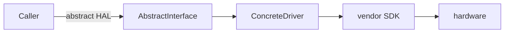

# airgradient-<name>

One-line summary of what this component owns and why it exists.

## Status

`Stable` | `Experimental` | `Scaffold`

(Use exactly one of the three. Briefly justify if `Experimental` or
`Scaffold`.)

## Scope

This component owns:

- bullet list of responsibilities

This component does not own:

- bullet list of explicit non-responsibilities to keep the boundary clear

## Directory Layout

```text
components/airgradient-<name>/
  hal/
  drivers/
  services/
  tests/
  CMakeLists.txt
  README.md
```

- `hal/` — public interfaces and types
- `drivers/` — concrete implementations grouped by hardware family
- `services/` — shared orchestration logic, if any
- `tests/` — host-side tests owned by this component

## Public Includes

Use includes by role:

```cpp
#include "hal/<interface>.h"
#include "services/<orchestrator>.h"
#include "drivers/<family>/<driver>.h"
```

Guideline:

- include from `hal/` when depending on an interface
- include from `services/` when using shared orchestration
- include from `drivers/` only when instantiating a concrete implementation

## Design

For a simple linear chain, ASCII is enough:

```text
caller -> AbstractInterface& -> ConcreteDriver -> vendor SDK -> hardware
```

For anything with branching, state, or multiple actors, use Mermaid (see
`docs/STYLE.md` for when to pick which):



Short prose explaining the layering and why callers depend on the HAL rather
than the driver.

## Usage

A minimal call site (≤ 15 lines, per `docs/STYLE.md`):

```cpp
ConcreteDriver driver(/* config */);
if (!driver.init()) {
    // handle failure
}
AbstractInterface &iface = driver;
iface.do_something();
```

For longer real-world wiring, link to the canonical example instead of
copying it:

> See [`<example_file>`](../path/to/example_file.cpp) for the full
> production wiring used by the `<product>` product.

## Configuration

The component exposes Kconfig knobs under **AirGradient \<Name\>** in
`menuconfig` (see `components/airgradient-<name>/Kconfig`):

| Symbol | Default | Purpose |
|---|---|---|
| `CONFIG_<NAME>_<KNOB>_MS` | `1000` | One-line intent |

(Omit this section if the component has no Kconfig knobs.)

## Dependencies

- `components/airgradient-common/` — shared types and RTOS abstraction
- `components/<other>/` — reason for the dependency
- `<managed-component>` — reason for the dependency

## Tests

Host tests live in `components/airgradient-<name>/tests/` and run through the
top-level [tests runner](../../tests/README.md).

## Notes

Optional caveats, known limitations, or follow-up work.
