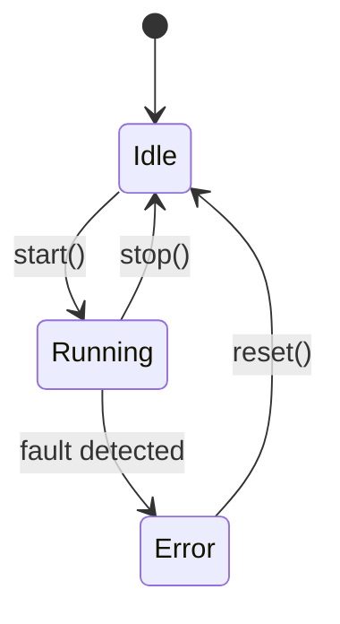

# \<Service Name\>

One-paragraph summary describing what the service does, how it is invoked
(synchronously by the orchestrator, by its own task, etc.), and which
operating modes activate it.

## Files

| File | Purpose |
|---|---|
| `products/<product>/main/<service>.h` | Class declaration |
| `products/<product>/main/<service>.cpp` | Implementation |
| `products/<product>/specs/<service>.md` | Feature spec, if any |

## Dependencies

| Dependency | Source | Usage |
|---|---|---|
| `<Type>` | `<component>` (`<header>`) | What this service uses it for |

## Public API

Document the methods exposed to other parts of the product as a table. Group
by lifecycle (`init`, `start`, `stop`) first, then by feature.

| Method | Returns | Purpose |
|---|---|---|
| `init()` | `bool` | One-line description of side effects |
| `start()` | `void` | One-line description |
| `stop()` | `void` | One-line description |
| `<feature_method>()` | `<type>` | One-line description |

See [`<service>.h`](../main/<service>.h) for full signatures and parameter
documentation.

## Behavior

Describe state machines, lifecycle transitions, timing requirements, and
ordering constraints. Use Mermaid for state machines and branched flows;
ASCII is acceptable only for trivial linear sequences.

State machine example:



Trivial linear sequences may stay ASCII:

```text
init -> start -> running -> stop
```

## Edge Cases / Errors

Document partial failures, retry policy, watchdog interactions, and how the
service degrades when a dependency is missing.
