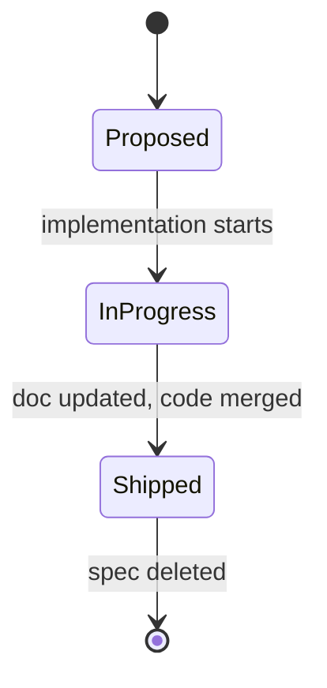

# \<Spec Title\>

> **This is a spec.** It describes how a feature **will be built**, not what
> currently exists. Once the feature ships, the corresponding doc under
> `docs/` (or the relevant component README) becomes the source of truth and
> this file is typically deleted. See `docs/STYLE.md` → "Doc Lifecycle".

One-paragraph summary of the change: what is being designed, why now, and
what the desired outcome is.

## Problem

Describe the current behavior, why it is unsatisfactory, and the concrete
pain points (bug reports, missing features, brittle tests, etc.).

## Goals

- Bullet list of measurable, verifiable goals

## Non-Goals

- Bullet list of things deliberately excluded from this change

## Design

Describe the proposed approach. Use Mermaid for state machines, sequences,
and branched flows; ASCII only for short linear flows. Interface sketches
(`cpp` fences) and tables are encouraged.

Specs are **exempt** from the 15-line code-block cap in `docs/STYLE.md` —
include as much pseudo-code, interface draft, or worked example as the
implementer needs to follow the design.

```cpp
// Interface sketch
class NewThing {
public:
    bool do_thing();
};
```



## Implementation Plan

Ordered steps the implementer will follow. Each step should be small enough
to land as a single focused commit.

1. Step one
2. Step two
3. Step three

## Testing Strategy

- Host tests to add or extend
- Hardware-in-the-loop checks
- Manual verification steps if any

## Open Questions

- Bullet list of things still to be decided
