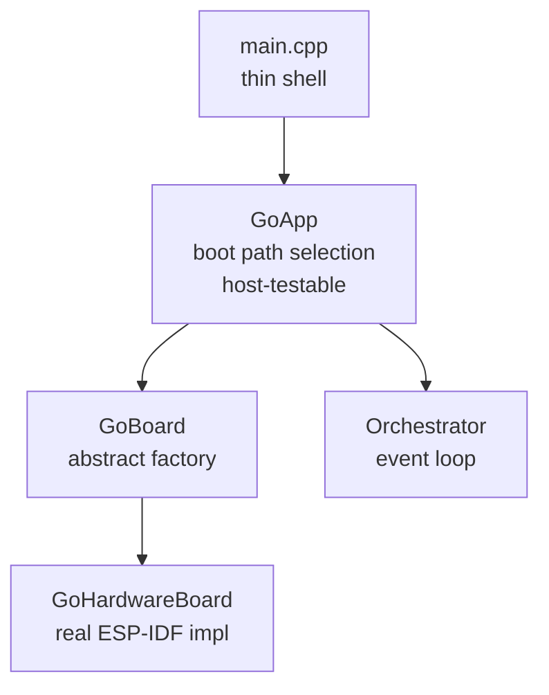
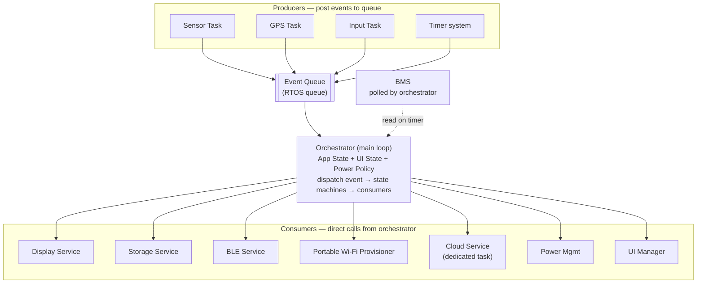
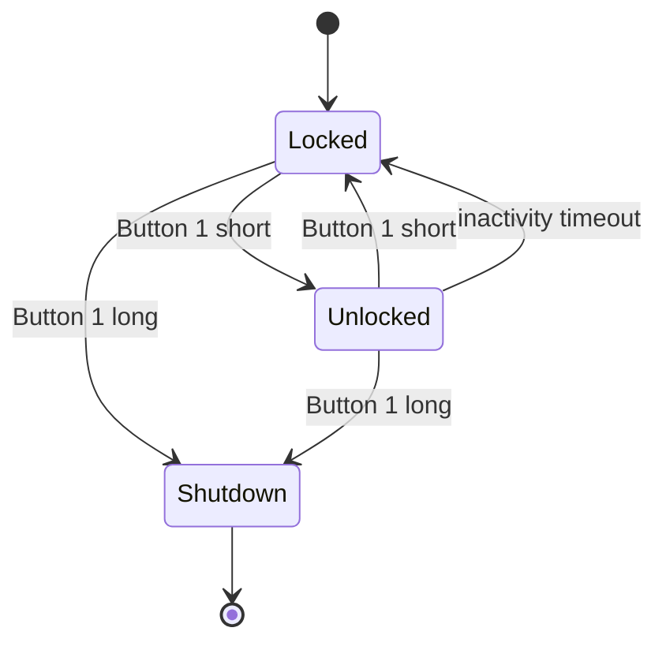
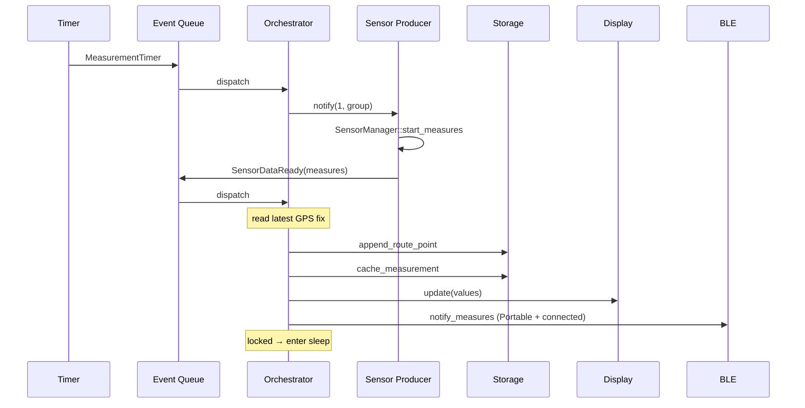
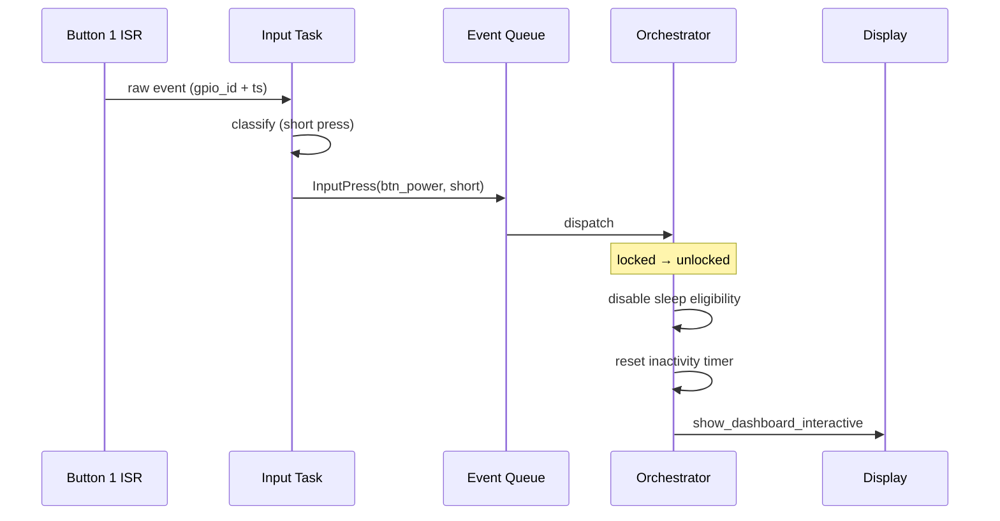

# AirGradient Go (AGo) — Architecture

This document describes the product architecture for the AirGradient Go
portable air quality monitor. It serves as the high-level reference;
per-service implementation details are in the `docs/` folder (linked from
the [Service Documentation](#service-documentation) section).

## Product Overview

AirGradient Go is a portable, battery-powered air quality monitor with GPS
tracking, e-paper display, touch / button navigation, and multiple
connectivity modes. The device measures environmental data (PM, CO2, TVOC,
NOx, temperature, humidity), logs routes with GPS coordinates, and streams
data over BLE or serves it over Wi-Fi.

A single firmware binary supports both the **Prototype** board and the
**v1** board. The board variant is detected at runtime by probing the
BQ27427 fuel gauge at I2C address `0x55` during `init_buses()`. All
variant-conditional behavior is gated on `board.variant()`. See
[Hardware Variants](#hardware-variants) for details.

## Hardware Variants

| Variant | Detection | PM Enable Polarity | Fuel Gauge | I2C Differences |
|---|---|---|---|---|
| **Prototype** | BQ27427 NACK at `0x55` (or fail-safe default) | Active-high (level 1) | None — SOC from BQ25629 voltage-curve | Baseline |
| **V1** | BQ27427 ACK at `0x55` | Active-low (level 0) | BQ27427 Impedance Track — SOC, capacity, temp | BQ27427 at `0x55` |

Detection runs once at boot inside `GoHardwareBoard::init_buses()`. The
result is cached in `_variant` and exposed via `GoBoard::variant()`. A
probe failure (NACK or transport error) falls back to `Prototype` — the
shipping default. See [Hardware Init](docs/hardware_init.md) for the full
`init_buses()` sequence.

## Modes and Behaviors

AGo has two orthogonal state dimensions.

### Operating Modes

Set rarely — typically only via UI menu.

| Mode | Radio | Power Source |
|---|---|---|
| Portable | BLE streams data to phone | Battery |
| Stationary | Wi-Fi (saved credentials, factory fallback, or BLE / captive-portal provisioning) | Battery or USB |
| Offline | No radio | Battery |

### Behaviors

Change frequently — driven by user interaction or shutdown.

| Behavior | Description |
|---|---|
| Tracking | GPS + sensor logging, persist route to NAND flash, temporary cache for chart |
| Idle | Sensor readings on display, temporary cache for chart only |
| Shutdown | BMS QoN — full power off |

The default operating mode on fresh boot is **Portable**.

All three modes can enter any behavior. Tracking in Offline mode means
GPS plus sensor logging with no radio transmission.

## High-Level Architecture

The system uses a **single centralized event queue** with an orchestrator
loop. Producers post typed events into a queue (via the RTOS abstraction
layer). The orchestrator consumes events, updates state machines, and
calls consumers directly.

### Boot Composition



| Layer | File(s) | Responsibility | Testable on host? |
|---|---|---|---|
| **main.cpp** | `main.cpp` | Construct `GoHardwareBoard`, construct `GoApp`, call `run()` | No (hardware entry point) |
| **GoApp** | `go_app.h/cpp` | Boot path selection, fast-path logic, service construction, orchestrator launch, pure data transforms | **Yes** (via MockBoard + link-time stubs) |
| **GoBoard** | `go_board.h` | Abstract interface for hardware object creation, platform operations, `variant()` accessor, inline `evaluate_fg_state` helper | N/A (interface) |
| **GoHardwareBoard** | `go_hardware_board.h/cpp` | All ESP-IDF init calls, driver creation, bus management, ISR setup, variant detection, FG bring-up | No (hardware-specific) |

### Runtime Layout



In Portable mode the **Portable Wi-Fi Provisioner** co-registers the
provisioning GATT service + DIS on the same BLE server `BleService`
advertises, so the companion app can (re)configure Wi-Fi over the bonded
link without a mode switch. The Wi-Fi radio is brought up on demand for a
scan/connect and dropped again. See
[`docs/portable_provisioner.md`](docs/portable_provisioner.md).

### Event Flow Direction

- **Events** flow from producers into the orchestrator via the event queue.
- **Commands** flow from the orchestrator to consumers via direct method
  calls.
- The orchestrator never blocks on a consumer. Slow operations (e-paper
  refresh) are handled asynchronously by the consumer's internal task.

## State Machines

### App State Machine

Controls what the device is doing. Two orthogonal dimensions:

```text
Operating Mode:     Portable | Stationary | Offline
Behavior:           Tracking | Idle | Shutdown
```

Mode affects which radios / features are enabled. Behavior affects the
measurement + logging pipeline. These are independent — the device can be
in any (mode, behavior) combination.

Transitions:

- Mode changes: user navigates UI menu
- Tracking start / stop: user navigates UI menu, or BLE `start_tracking` /
  `stop_tracking` command
- Shutdown: physical button long press (Button 1) → BMS QoN

### UI State Machine

Controls what is on the display. Independent from the app state machine,
though UI actions can trigger app state transitions (e.g., user selects
"Start Tracking" in a menu).

```text
User-navigable:   Home | MainMenu | Settings | SettingsChoice | About | TagList | Confirm | GettingStarted
Orchestrator-set: Shutdown | PairingPasskey | Info | Provisioning | ProvisioningConfirm | GettingStarted
```

`GettingStarted` appears in both rows: the orchestrator sets it at the
first-boot gate, and the user can re-open it from `Settings → Setup Guide`.

The UI state machine consumes input events (touch / button) and decides
what to render. The orchestrator forwards input events to the UI manager
when the device is unlocked. Shutdown, PairingPasskey, Info, Provisioning,
and ProvisioningConfirm screens are set directly by the orchestrator and
do not appear in normal menu navigation.

### Lock / Unlock

A lock / unlock gate separates interactive and passive display modes.



| State | Touch Pads | Display | Sleep | Button 1 Short |
|---|---|---|---|---|
| Locked | Ignored | Static dashboard (periodic refresh) | Eligible | Unlock, except during cold-boot splash |
| Unlocked | Active (Up / Down / Enter) | Interactive menus | Never | Lock |

Both states: Button 1 long press → Shutdown. Releasing after the long
press powers off; keeping the button held re-wakes the BQ25629 through
`/QON` and cold-boots the device — see [Shutdown](#shutdown).

Inactivity timeout while unlocked → auto-lock. The timeout value is
configurable via settings (minimum 5 seconds).

While locked, the display periodically updates sensor values and status on
the dashboard. The refresh interval is configurable and can be disabled
entirely.

## Event Types

### Producer Events

Posted into the queue by background tasks.

| Event | Source | Payload |
|---|---|---|
| `SensorDataReady` | Sensor Task | `MeasuresAGo` struct |
| `GpsFixUpdate` | GPS Task | `GpsData` from `airgradient-gps` — position, altitude, fix type, DOP, satellite count, timestamp |
| `InputPress` | Input Task | source (touch_up / down / enter, btn_power, btn_boot), type (short / long) |
| `BleConnected` | BLE Service | client connected |
| `BleDisconnected` | BLE Service | client disconnected |
| `BleConfigWrite` | BLE Service | pending Config characteristic write available |
| `BleHistoryWrite` | BLE Service | pending History characteristic write available |
| `BlePairingRequest` | BLE Service | 6-digit passkey for authenticated pairing |
| `BleAuthComplete` | BLE Service | encryption-change result; carries `ble_auth_ok` (link encrypted/authenticated) |
| `WifiConnected` | Wi-Fi Service | STA acquired IP; carries network-byte-order IPv4 |
| `WifiDisconnected` | Wi-Fi Service | STA disconnect (real or synthetic from window expiry); carries normalised `WifiDisconnectReason` |
| `ProvisioningStateChanged` | Wi-Fi Service | provisioning state transition; carries `ProvisioningEvent`, transport, stop reason, IP, `disable_cloud`, `static_ip` |
| `PostMeasuresResult` | Cloud Task | `AgClientResult` byte — POST outcome |
| `FetchConfigResult` | Cloud Task | `AgClientResult` byte — FETCH outcome |
| `Co2CalibrationDone` | Sensor Producer | calibration result code |

### System Events

Posted into the queue by timers or the boot path.

| Event | Source | Meaning |
|---|---|---|
| `InactivityTimeout` | Timer | No input for configured duration → auto-lock |
| `MeasurementTimer` | Timer | Time to start next measurement cycle |
| `WakeFromSleep` | Boot path | Wake cause: timer or button |

BMS is polled directly by the orchestrator on a 30-second timer. There is no
dedicated `BatteryStatus` queue event in the current implementation.

### UI Action Events

Posted into the queue by the UI manager when a user action requires
orchestrator-level state changes.

| Event | Meaning |
|---|---|
| `UserStartTracking` | User selected start tracking in menu |
| `UserStopTracking` | User selected stop tracking in menu |
| `UserChangeMode` | User selected Portable / Stationary / Offline |
| `SettingsChanged` | User changed a setting via UI (includes GPS mode changes) |
| `ClearData` | User confirmed data clear via UI |
| `SaveTag` | User selected a tag (with tag index) |

## Tasks

### Task Map

| Task | Role | Blocks? | Posts to Queue | Notes |
|---|---|---|---|---|
| Orchestrator | Main event loop | No | -- | Runs in `app_main` context or dedicated task |
| Sensor Producer | Wraps SensorManager | Yes | `SensorDataReady` | Waits for RTOS task notification from orchestrator |
| GPS Producer | UART NMEA read loop | Yes | `GpsFixUpdate` | Product-specific, uses `airgradient-gps` (`GpsSensor` / `NmeaGps`) |
| Input Producer | Classifies raw ISR events | Yes | `InputPress` | Debounce + long-press detection |
| Cloud Task | HTTP POST + FETCH via AgClient | Yes | `PostMeasuresResult`, `FetchConfigResult` | Stationary + online only; heap deferred to `start()` |
| Display Worker | Drives e-paper refresh | Yes | -- | Receives render commands from orchestrator |

BMS is polled directly by the orchestrator on a 30-second timer (I2C read,
fast and non-blocking). No dedicated task. On V1 boards, `poll_bms()` also
reads FG telemetry from the BQ27427.

### Sensor Producer

Wraps the shared `SensorManager` from `components/airgradient-sensors/`.
In Portable and Stationary modes (always-awake), the producer also drives
a gas-index sampler that feeds the Sensirion algorithm at a fixed cadence
(default 10 s) independent of the measurement interval.

```text
Sensor Task:
  warmup()
  configure gas-index sampler (if SGP41 is wired)

  loop:
    Wait for task notification (with sampler timeout when active)

    If notified:
      handle_calibration / handle_prepare / handle_measurement

    If sampler tick due:
      handle_sampler_tick → read SGP41, advance algorithm, cache result
```

The orchestrator controls when to measure by sending a task notification
that encodes both the iteration count (always 1) and which sensor groups
to poll (`SensorGroup::PM`, `SensorGroup::Other`, `SensorGroup::TvocNox`,
or `SensorGroup::All`). When the sampler is active, the producer strips
`TvocNox` from measurement masks and splices its cached TVOC/NOx into
the result. See [Sensor Producer](docs/sensor_producer.md) for details.

### Gas Index in Offline Mode

TVOC and NOx index values (Sensirion SGP41 gas-index algorithm) are only
available in Portable and Stationary modes. In Offline mode, the display
shows raw SRAW ticks instead of index values.

**Why the algorithm cannot run across deep-sleep cycles:**

The Sensirion gas-index algorithm requires continuous sampling at a fixed
cadence (1 s or 10 s). It builds a rolling baseline (mean and standard
deviation of the raw sensor signal) over hours and expresses each new
reading as a deviation from that baseline. This design assumes temporal
continuity — thousands of evenly-spaced samples, not isolated snapshots
separated by seconds or minutes of deep sleep.

Sensirion provides a state persistence API (`GasIndexAlgorithm_get_states`
/ `set_states`) that saves two floats (the mean-variance estimator's mean
and std) for restoration after short interruptions. This was evaluated and
rejected for Offline mode because of hard constraints:

| Constraint | Detail |
|---|---|
| VOC only | State persistence is only supported for the VOC algorithm. NOx has no equivalent API |
| 10-minute max interruption | Sensirion specifies that restored states should not be used after interruptions longer than 10 minutes. Measurement intervals above ~600 s exceed this |
| 3-hour training minimum | States are only meaningful after 3 hours of continuous operation. Offline deep-sleep cycling never accumulates continuous runtime |
| Low-cadence samples are meaningless | Even if state restoration worked perfectly, one sample every 10–300 seconds cannot track real air quality dynamics. The index value would be technically computed but environmentally unreliable |

The fundamental issue is that the gas-index algorithm is designed for
always-on monitoring. Offline mode exists to save battery via deep sleep,
and these goals are incompatible. Displaying raw SRAW ticks (or dashes)
is more honest than showing an unreliable index.

### GPS Producer

Product-specific `GpsService` task in `products/go/main/`. Uses the shared
`airgradient-gps` component for all NMEA parsing and serial I/O. The
service holds a `GpsSensor &` reference (concrete type: `NmeaGps`) and
calls its non-blocking `read()` method in a loop. NMEA sentence
accumulation, checksum validation, and field extraction are fully handled
by the component.

```text
GPS Task:
  loop:
    Call GpsSensor::read()            // drains serial buffer, parses sentences
    If read() returned true:
      Update _latest_fix from GpsSensor::get_data()
      If timestamp valid and clock not yet synced:
        Set ESP32 system clock via settimeofday()
    If posting interval elapsed and GpsSensor::has_valid_fix():
      Post Event::GpsFixUpdate to event queue
    Delay 10 ms                       // yield, avoid busy-wait
```

`GpsData` (from `airgradient-gps/types/gps_types.h`) carries position
(`GpsPosition`), altitude, fix metadata (`GpsFix` — type, satellite count,
DOP values), and a UTC timestamp (`GpsTimestamp`). The orchestrator can
also call `GpsService::get_latest_fix()` directly at any time
(mutex-protected).

GPS hardware is always powered (no power-enable GPIO), but the TAU1113
GNSS receiver engine can be stopped / started via CASIC binary commands
(`CFG-GNSS`). When `is_gps_active()` returns false (e.g., `AlwaysOff`, or
`OnWhenTracking` while idle), firmware sends GNSS stop and destroys the
GPS RTOS task to save power. When GPS becomes active again, firmware sends
GNSS start and recreates the task. `GpsService::start()` is idempotent.
See [GPS Power Mode Sync](specs/gps_power_mode_sync.md) for full details.

When entering deep sleep with GPS active, only the RTOS task is stopped —
the TAU1113 keeps tracking so timer-wake can acquire a fix immediately
(hot-start). When entering deep sleep with GPS inactive, GNSS stop is sent
before sleep. The driver waits for the TAU1113 ACK response before closing
the UART to ensure the module has fully processed the stop command;
without this the module may remain in tracking mode (~16–21 mA) during
deep sleep.

### Input Producer

Handles all 5 inputs: 3 capacitive touch pads (via `airgradient-touch`)
and 2 physical buttons (via `airgradient-gpio`).

```text
ISR (GPIO / Touch interrupt):
  Post raw event (gpio_id + timestamp) to raw_input_queue via xQueueSendFromISR

Input Task:
  loop:
    Receive raw event from raw_input_queue
    Debounce
    Classify: short press vs long press (physical buttons only)
    Post Event::InputPress to orchestrator event queue
```

Touch pads support short press only. Physical buttons support short and
long press.

Input mapping:

| Input | Type | Role |
|---|---|---|
| Touch Pad 1 | Capacitive | Navigate Up |
| Touch Pad 2 | Capacitive | Navigate Down |
| Touch Pad 3 | Capacitive | Enter / Select |
| Button 1 | Physical | Short: lock / unlock. Long + release: shutdown. Long + keep holding: power-cycle restart (battery-only, via `/QON`) |
| Button Boot | Physical | Short: unused. Long: factory reset |

### Display Worker

E-paper display with an independent task for the slow SPI refresh.

```text
Orchestrator:
  display_service.update(current_screen_data)   // prepares framebuffer
  // returns immediately

Display Task:
  loop:
    Wait for "frame ready" signal
    Drive e-paper refresh (slow, blocking SPI)
```

The orchestrator never blocks on e-paper refresh. The display service API
is synchronous (prepare what to render), but the hardware refresh is
async.

## Power Management

### Sleep Eligibility

Sleep is only eligible when:

- The operating mode is **Offline** (Portable and Stationary never sleep), and
- The device is **locked** (never sleep while user is interacting with menus).

### Sleep Type Selection

`PowerService::decide_sleep()` computes sleep type and duration in one
call:

```text
sleep_ms = (measure_interval_seconds * 1000) - awake_ms   (clamped to 0)
```

| sleep_ms | Sleep Type | Rationale |
|---|---|---|
| ≥ `deep_sleep_threshold_ms` (5 s) | Deep sleep | Benefit exceeds reboot cost |
| < `deep_sleep_threshold_ms` | None (stay awake) | Reboot overhead ≥ sleep duration; loop instead |

The threshold is a tunable constant (`Config::deep_sleep_threshold_ms`),
set to 5 s for AGo. Combined with the PM sensor warm-hold (see
[Sleep Entry](#sleep-entry)), the fast-path boot takes only ~4–7 s for
warm wakes (skipping the 10 s warmup), making a 5 s threshold viable. The
awake time is subtracted so the total cycle (awake + sleep) matches the
configured interval.

### Sleep Entry

```text
1. Final display update (wait=true — ensures the e-paper refresh completes)
2. Save RTC display snapshot (sensor values, battery, status flags,
   rendering settings) so the next button wake can render immediately
3. Stop all task-based services (BLE, sensor, GPS, input, display worker)
4. Put SSD1680 into deep sleep mode 1 (~100 µA → <1 µA during ESP deep sleep)
5. Backup chart cache to RTC memory
6. Persist app state to RTC memory:
   - Current mode, behavior, lock status
   - Tracking-in-progress flag, session ID
   - GPS enabled / disabled
   - sensors_warm flag (set when sleep < sensor_hold_max_sleep_ms)
7. Pulse external watchdog (gives it a full timeout window during sleep)
8. If sleep < sensor_hold_max_sleep_ms (20 s):
   - gpio_hold_en(PIN_PM_POWER) — hold PM sensor power HIGH
     (ESP32-C5 per-pin hold persists through deep sleep automatically)
9. Configure wake sources:
   - Timer: next wake time
   - GPIO: Button Power (unlock) — Button Boot is not RTC-capable on ESP32-C5
10. Enter deep sleep
```

For sleeps ≥ 20 s the PM sensor powers off normally (GPIO floats during
sleep) and the full 10 s warmup runs on wake.

### Wake and Boot Path

Deep sleep reboots the CPU. All tasks restart from `app_main`. Two
abbreviated paths exist to avoid the full event-loop overhead when it is
not needed.

```text
app_main:
  GoHardwareBoard board;
  GoApp app(board);
  app.run();

GoApp::run():
  cause = PowerService::get_wake_cause()
  path = select_boot_path(cause, load_rtc_app_state())

  FastPath    → run_fast_path(state)        // never returns
  ButtonWake  → run_button_wake_path(state) // never returns
  Interactive → run_interactive(cause, {})  // never returns
```

`select_boot_path()` is a pure function (host-testable):

| Wake Cause | Condition | Path |
|---|---|---|
| `Timer` + `Locked` | `is_fast_path_wake()` | `FastPath` — measure, display, sleep or promote |
| `Timer` + `Unlocked` | Not fast-path eligible | `Interactive` |
| `Button` + `Offline` | -- | `ButtonWake` — four-phase early paint |
| `Button` + non-Offline | -- | `Interactive` |
| `PowerOn` | -- | `Interactive` |

Hardware initialization is managed by **GoHardwareBoard** through
idempotent init methods (`init_nvs()`, `init_buses()`, `init_spi()`,
`init_bms()`) and lazy service accessors (`sensors()`, `storage()`,
`display()`, `power()`). Each boot path calls these in the order its
hardware sequencing requires. The convenience gate `init_core()` calls all
four init methods (skipping any already done).

All three boot paths follow a uniform pre-sensor sequence:

```text
init_core() → release_gpio_holds() → power().set_pm_power(true) → sensors()
```

`set_pm_power(true)` drives the PM enable GPIO (EN_PM load switch) to the
variant-appropriate level. PMID itself (`EN_OTG`) is armed once by
`init_bms()` inside `init_core()` and the chip handles buck↔boost
transitions autonomously thereafter. Both must run before `sensors()`
because the SPS30 needs the PMID +5 V rail and EN_PM = ON.

When transitioning from the fast path to the interactive event loop
(either because sleep is too short or the user pressed a button), the
fast path calls `run_interactive()` directly. Already-initialized services
are reused via the lazy accessors (idempotent — return the cached
instance). A `BootHandoff` struct describes what the fast path has already
done (display painted, measurement completed, lock state) so the
orchestrator can skip redundant work.

On a fresh interactive power-on with no RTC snapshot and no fast-path
measurement, `GoApp` paints `Screen::Info` with `Booting...` before
starting the orchestrator. The orchestrator keeps this splash until the
first `SensorDataReady` event, then runs the first-boot gate: when the
durable `onboarding_done` NVS flag is unset it shows the one-time
`Screen::GettingStarted` guide (setup QR + `Start using`), otherwise it
resets the UI to Home. A short press on Button 1 is ignored while the
splash is active so the first boot screen is not replaced by an
unlock / lock transition.

**First-boot onboarding.** The Getting Started guide is informational and
non-blocking — the device is already measuring and BLE-discoverable while
it shows. The boot-gate entry reuses the setup-session machinery
(`begin_session_if_needed()` silent-unlock so the cold-boot Locked device
can press the button). `onboarding_done` flips `true` via the idempotent
`mark_onboarding_done()` on the first real engagement (`Start using`, a
BLE pairing/bond, or any `change_mode()`), and the guide auto-shows only
once. Factory reset clears the flag so refurbished units re-show it.

**Fast path** avoids GPS task, input task, and the full orchestrator for a
"measure and sleep" cycle. The core logic lives in `execute_fast_path()`
which returns a `FastPathResult` (Sleep or Promote) instead of calling
`enter_sleep()` directly — this is the key testability seam. An ISR on
the power button detects button presses during blocking warmup,
measurement, and GPS operations. If the user presses the button, the fast
path aborts early and promotes to interactive mode with the device
unlocked.

**Button-wake path** eliminates the double display flash (empty frame →
unlock frame). The display worker holds the SPI bus during the ~3 s
refresh, which naturally prevents NAND access until the bus is free — no
explicit synchronization needed.

### Shutdown

Button 1 long press triggers BMS QoN (ship mode) via
`BmsDevice::enter_ship_mode()` on the BQ25629. The device fully powers
off. GPS module loses power. Next power-on is a fresh boot.

Button 1 (`PIN_BUTTON_POWER`, GPIO5) is wired to **both** the ESP32 GPIO
**and** the BQ25629 `/QON` pin. This makes the gesture matter:

- **Long press, then release** — normal power off. Ship mode opens the
  BATFET and the system stays off until the next QON press or adapter
  insert.
- **Long press and keep holding** — acts as a **hardware power-cycle
  restart** (battery-only). After the BATFET opens, the still-held `/QON`
  line qualifies a ship-mode wake (≥ ~17 ms) and the BQ25629 re-closes
  the BATFET, so the device powers back on. Because the BATFET cut drops
  the RTC domain too, this comes up as `WakeCause::PowerOn` — a full cold
  boot (RTC state wiped), not a deep-sleep wake. With USB present,
  `enter_ship_mode()` is refused and the path falls back to deep sleep, so
  the restart behavior only applies on battery.

Ship mode is also triggered automatically by the EDV and OT safety trips —
see [Power Management](docs/power_management.md) for details.

## Services

These are the product-specific service modules under `products/go/main/`.
Each service is a focused unit that the orchestrator wires together. For
detailed implementation notes, see [Service Documentation](#service-documentation).

### GPS Service

- Product-specific service (`gps/gps_service.h` / `gps/gps_service.cpp`)
- Delegates all NMEA parsing and serial I/O to `GpsDriver`
  (`gps/gps_driver.h`)
- `GpsData` type comes from `gps/gps_types.h`
- Independent task (GPS Producer); clean shutdown via `stop()` which
  blocks until the task self-signals before deleting itself
- API: `start()`, `stop()`, `stop_and_idle_gnss()`, `idle_gnss()`,
  `get_latest_fix()` (mutex-protected), `set_posting_interval_ms()`
- `start()` is idempotent — returns true if already running
- `stop()` stops the task and closes UART without sending GNSS stop
  (preserves TAU1113 tracking for deep-sleep hot-start)
- `stop_and_idle_gnss()` stops the task, sends GNSS stop, then closes
  UART (used when GPS mode becomes inactive)
- `idle_gnss()` opens UART, sends GNSS stop, closes UART (used at boot
  when GPS is inactive to halt the TAU1113's default tracking)
- Posts `GpsFixUpdate` events to the orchestrator queue at the configured
  interval
- Syncs ESP32 system clock (`settimeofday`) on the first valid GPS
  timestamp
- `gps_read_once()` free function provides a synchronous one-shot read
  for the fast-path timer-wake boot path, without starting the full task
  infrastructure. Sends a defensive `gnss_start()` after `begin()`.
  Accepts an optional `const volatile bool &abort` parameter for
  ISR-driven early exit during fast-path button detection

### Input Service (Button Service)

- Uses `airgradient-touch` (CAP1203) for 3 capacitive touch pads
- Uses `airgradient-gpio` for 2 physical buttons with interrupt
- Independent task (Input Producer)
- Handles ISR → raw queue → debounce → classify → typed event
- Posts `InputPress` events to the orchestrator queue
- Future-proof: additional input sources (IMU) can post the same event
  types

### Storage Service

Two tiers of storage:

**Temporary (chart data):**

- Uses `airgradient-payload-cache` with `RtcPayloadCacheStorage` backend
- Keeps last N measurements for display chart rendering
- Survives deep sleep (RTC memory), lost on power-off
- Ring buffer semantics (overwrites oldest when full)
- Supports `clear_cache()` for user-triggered data clearing / factory
  reset

**Persistent (route data):**

- Uses `airgradient-nand-storage` (SPI NAND with FATFS)
- Stores GPS + sensor data for tracking routes
- Survives power-off
- POSIX file I/O on mounted filesystem
- One file per tracking session: `route_XXXXX.bin` with a random 5-digit
  session ID
- Supports `clear_routes()` for user-triggered data clearing / factory
  reset
- Exposes total and used filesystem capacity for BLE status reporting

### Power Management

- BMS interaction via `BmsDevice` HAL and optional `FuelGaugeDevice` HAL
  from `airgradient-bms`
- Polled by orchestrator every 30 s (full BMS poll) and every 5 s (status
  poll); no dedicated task
- **Session-armed PMID:** `BQ25629Bms::init()` arms `EN_OTG=1` once
  during BMS bring-up and the chip handles VBUS pass-through ↔ boost
  transitions autonomously. `set_pm_power()` drives only the EN_PM load
  switch GPIO and never touches `EN_OTG`; this avoids the per-measurement
  boost cold-start inrush that can exceed 1S cell-protection OCP. See
  [`docs/power_management.md`](docs/power_management.md#why-pmid-is-session-armed)
- **Cell safety trips:** EDV (over-discharge at 2.9 V, 3-poll debounce)
  and OT (charge cutoff at 50 C / resume at 47 C, ship mode at 60 C)
  fire `enter_ship_mode()` to protect the battery
- **Fuel gauge (V1 only):** `PowerService::set_fuel_gauge()` attaches an
  already-initialised `FuelGaugeDevice` for runtime SOC reads. `poll_bms()`
  prefers FG-derived SOC and tags the log line with `src=FG|BMS`
- Sleep cycle management (deep sleep entry, wake source config)
- RTC memory state persistence before sleep
- Fast-path boot logic for timer wakes
- External watchdog (GPIO2): initialized at boot, pulsed every 60 s and
  before sleep
- `PowerSnapshot` aggregates battery voltage, percentage (with source
  marker), charging state, critical flag, charger status, telemetry, and
  FG telemetry fields (V1 only)

### Settings

- Uses `airgradient-config` (`ConfigStore` with NVS backend)
- Product-specific `GoSettings` struct with field validation and NVS
  load / save
- BLE link security is not a runtime setting. It is always enabled — the
  custom GATT service mandates pairing / bonding

Settings fields:

- PM interval, other sensor interval (independent timers; 0 = off)
- Display refresh interval (0 = display off while locked; unlocked always
  shows dashboard)
- Temperature units (C / F), PM display (µg/m³ / USAQI)
- GPS mode (AlwaysOff / OnWhenTracking / AlwaysOn)
- Operating mode (Portable / Stationary / Offline; default: Portable)
- Auto-lock timeout (0 = disabled, 10 s / 30 s / 60 s)
- Inactivity timeout, GPS interval, device name

### Display Service (E-Paper)

- SSD1680 128×250 e-paper driven over SPI
- Independent worker task for async hardware refresh (full + partial
  updates)
- u8g2 software renderer for framebuffer composition
- `init(values, defer_refresh=false)` — synchronous by default; pass
  `defer_refresh=true` in the button-wake path to return in ~10 ms and let
  the worker handle the initial full refresh in the background
- `deep_sleep()` — puts the SSD1680 into deep sleep mode 1 after the
  worker task is stopped; reduces quiescent current from ~100 µA to
  <1 µA
- `RtcDisplaySnapshot` struct + `save_rtc_display_snapshot()` /
  `load_rtc_display_snapshot()` free functions in `go_display.cpp`; saves
  the last displayed state before sleep so the button-wake paint can use
  cached values without reading NVS or sensors
- Status bar, hero blocks (PM2.5 / CO2), grid cells, chart, menu
  overlays, snackbar

### UI Manager

- Pure state machine — zero hardware or RTOS dependencies
- Manages screen navigation (Home → MainMenu → Settings / About / TagList
  / Confirm)
- Metric cycling, settings choice selection, snackbar lifecycle
- `handle_input()` returns `UIAction` for orchestrator-level state
  changes
- `build_values()` produces a `DisplayValues` snapshot from
  `BuildContext`
- `sync_settings()` synchronizes internal option indices from
  `GoSettings`

### BLE Streams

- BLE peripheral mode using `airgradient-ble` (NimBLE)
- Streams sensor + GPS data to connected phone
- Exposes live measures, device status, config read / write, command
  execution (including start / stop tracking), and route-history export
  over one custom GATT service
- Only active in Portable mode
- Always requires authenticated pairing / bonding (Passkey Entry, MITM);
  there is no unauthenticated access path

### Cloud Service

- Stationary cloud transport: periodic POST of `MeasuresAGo` and FETCH of
  device configuration every 60 s via `AgClient` on a dedicated task
  (priority 4, 8 KB stack)
- POST takes priority each cycle; deadlines are start-anchored
- Heap is claimed lazily by `start()` (called only when Stationary +
  online); Portable / Offline boots pay zero heap cost
- `stop()` drains in-flight HTTP before Wi-Fi teardown (bounded ~15 s)
- State changes (arm, disarm, disable) use atomics — no command queue
- RSSI sourced from `WifiService::rssi()` at post time; 0 sentinel
  translated to -127
- Fetched config body is logged only; parsing is a follow-up

**ESP32-C5 heap constraint:** the TLS handshake with the 4096-bit RSA
server certificate temporarily consumes most available heap. The Go
product's sdkconfig is tuned for this:

| Setting | Default | Go value | Purpose |
|---|---|---|---|
| `CONFIG_MBEDTLS_SSL_IN_CONTENT_LEN` | `16384` | `4096` | TLS input buffer — 12 KB heap saving per connection |
| `CONFIG_ESP_WIFI_DYNAMIC_RX_BUFFER_NUM` | `32` | `16` | Wi-Fi RX buffers — sufficient for the Go workload |
| `CONFIG_ESP_WIFI_DYNAMIC_TX_BUFFER_NUM` | `32` | `16` | Wi-Fi TX buffers — sufficient for the Go workload |

These values are safe for the Go product's small, infrequent HTTP
payloads (POST < 300 bytes, FETCH config < 1 KB). Products with higher
throughput requirements or more RAM (e.g. ESP32-C6) may keep the
defaults.

### Factory Reset

- Triggered by Button Boot long press or BLE `factory_rst` command
- Clears temporary chart cache and all persisted route files
- Restores `GoSettings` to defaults
- Deletes all stored BLE bonds
- Reboots the ESP on success

## Data Flow Examples

### Locked + Tracking + Measurement Timer Fires



### User Unlocks Device



### Deep Sleep Fast-Path (Timer Wake)

```text
1. ESP32 wakes from deep sleep (timer)
2. GoApp::run() reads wake cause: timer, selects FastPath
3. GoApp::run_fast_path(state):
   - Install button ISR via _board.install_button_isr()
   - _board.ulp_stop()
   - Load RTC display snapshot (on non-returning stack)
   - Call execute_fast_path() → returns FastPathResult
   - Remove button ISR
   - If Sleep: save state, stop display, ulp_start, enter_sleep (never returns)
   - If Promote: wire measures pointer, call run_interactive()

4. execute_fast_path() (testable core):
    - _board.init_core() (NVS, GPIO/I2C, SPI, BMS — idempotent;
      `init_bms()` arms PMID `EN_OTG=1` once for the session)
    - _board.release_gpio_holds() — pad transitions glitch-free
    - _board.power().set_pm_power(true) — drives EN_PM GPIO only;
      `EN_OTG` already armed by `init_bms()`
    - _board.load_settings()
    - _board.sensors(state.sensors_warm) — SPS30 warm: skip_reset
   - If sensors_warm: skip warmup (200 ms settle only)
     Else: interruptible warmup loop with button checks
   - One-shot measurement (skip if button pressed)
   - One-shot GPS via _board.new_gps_driver() if tracking + GPS active
   - Storage: _board.storage().cache_measurement() + route point
   - Display + sleep decision via _board.power().decide_sleep()
   - Returns FastPathResult{Outcome::Sleep, ...} or {Outcome::Promote, ...}
```

The fast path never returns to `app_main()`. It either sleeps (CPU
reboots) or promotes to `run_interactive()`. The `execute_fast_path()`
method returns a result struct instead of performing side effects
directly, making the entire fast-path control flow host-testable via
`GoAppTestAccess`.

The fast-path bypasses the UIManager entirely. `DisplayValues` is built
directly from sensor data and RTC state via the pure function
`build_fast_path_display()` — always `Screen::Home`, `locked=true`, no
chart data, no snackbar, no menu state. The display call uses `init()`
which sets up the u8g2 renderer, renders, and drives SPI inline without
starting the async worker task.

### Button-Wake Path (Button Wake, Offline Mode)

```text
1. ESP32 wakes from deep sleep (button press)
2. GoApp::run() reads wake cause: button, mode: Offline → selects ButtonWake
3. GoApp::run_button_wake_path(state):

   Phase 1 (~10 ms):
     4. _board.init_spi(), _board.display()
     5. Load RtcDisplaySnapshot from RTC memory
     6. Build DisplayValues via build_wake_values(): Home, unlocked,
        "Unlocked" snackbar, sensor values from snapshot (or dashes)
     7. display.init(values, defer_refresh=true)
        → renders frame, starts worker, worker begins SPI refresh
        → returns immediately

   Phase 2 (~300 ms, parallel with display refresh):
      8. _board.init_core() (NVS, GPIO/I2C, SPI, BMS — idempotent;
         `init_bms()` arms PMID `EN_OTG=1` once for the session)
      9. _board.release_gpio_holds()
      10. _board.power().set_pm_power(true) — drives EN_PM GPIO only
      11. _board.load_settings(), _board.sensors()
     12. _board.new_gps_driver(), _board.new_touch_sensor()
     13. Event queue, SensorProducer, GpsService, InputService
     14. Start producer tasks → sensors and touch input operational

   Phase 3 (~3 s, blocks on SPI):
     15. _board.storage() → SpiNandStorage spi_device_transmit() blocks
         until display worker releases bus (natural serialization)
     16. BLE service (requires StorageService from Phase 3)

   Phase 4 (~10 ms):
     17. Build BootHandoff: display_painted=true, suppress_wake_press=true,
         initial_lock_state=Unlocked, display_snapshot=&snapshot
     18. Orchestrator::init(Button, handoff)
         → sets lock=Unlocked, pre-arms snackbar + schedules refresh timer,
           seeds _cached_measures from snapshot, requests fresh measurement
         → skips update_display() (screen already correct)
     19. Orchestrator::run()
```

First meaningful paint: ~3 s. Single display flash (no empty-frame
flash). Touch input and sensors ready at ~310 ms.

## Service Documentation

Detailed implementation documentation for each service:

- [Settings Service](docs/settings.md)
- [Sensor Producer](docs/sensor_producer.md)
- [GPS Service](docs/gps_service.md)
- [Input Service](docs/input_service.md)
- [Storage Service](docs/storage_service.md)
- [Display Service](docs/display_service.md)
- [UI Manager](docs/ui_manager.md)
- [Power Management](docs/power_management.md)
- [BLE Service](docs/ble_service.md)
- [Wi-Fi Service](docs/wifi_service.md)
- [Cloud Service](docs/cloud_service.md)
- [Orchestrator](docs/orchestrator.md)
- [Hardware Init](docs/hardware_init.md)
