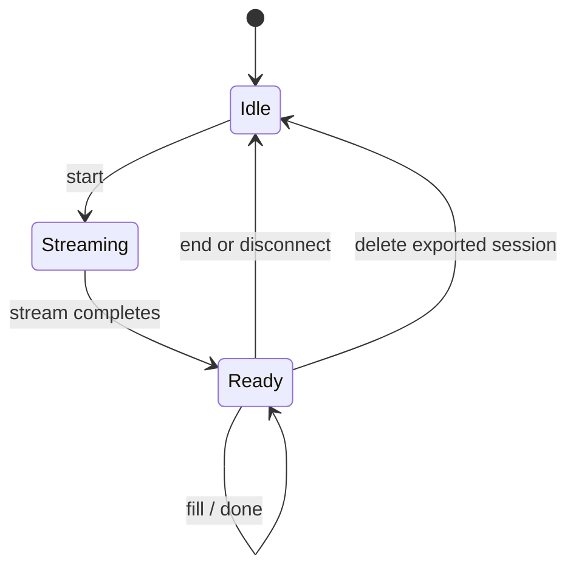
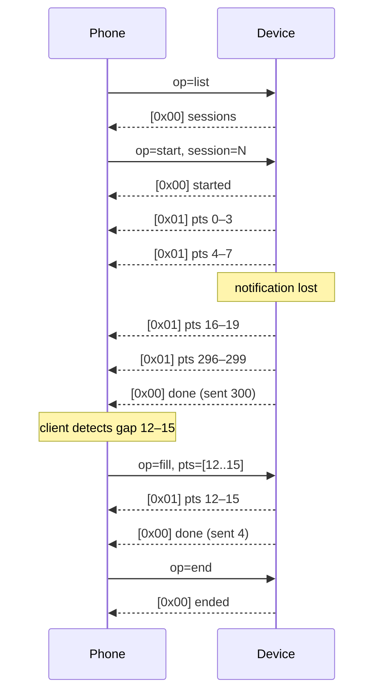
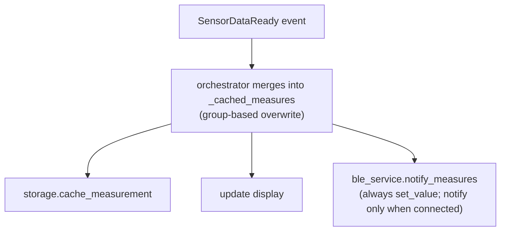
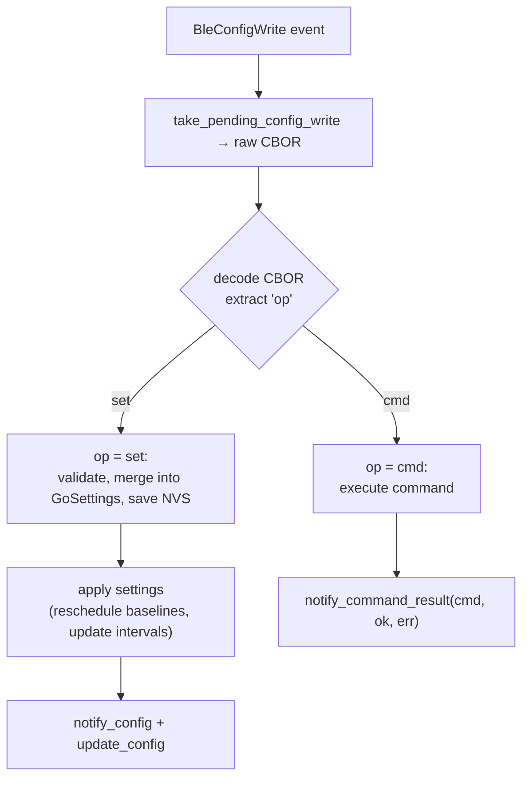
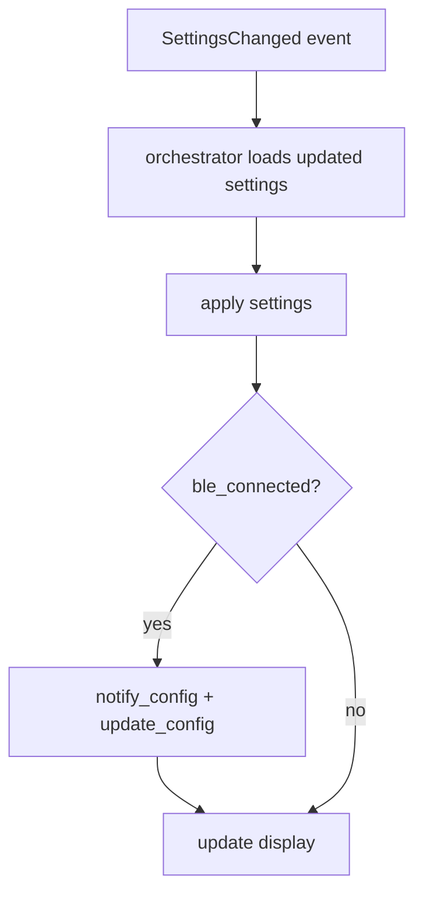

# BLE Service

BLE peripheral service for AirGradient Go. Exposes sensor measurements,
device status, configuration, and stored route data to a connected phone app
over a single custom GATT service. Active only in Portable operating mode.
Called synchronously by the orchestrator for data output; NimBLE callbacks run
in the NimBLE task and post lightweight events to the orchestrator queue.

## Files

| File | Purpose |
|---|---|
| `products/go/main/go_ble.h` | `BleService` class declaration |
| `products/go/main/go_ble.cpp` | GATT setup, CBOR encoding, NimBLE callbacks, binary history streaming |
| `products/go/main/go_ble_protocol.h` | BLE CBOR protocol string constants (`BLE_KEY_*`, `BLE_VAL_*`) shared across BLE and orchestrator |

## Dependencies

| Dependency | Source | Usage |
|---|---|---|
| `NimbleBleServer` | `airgradient-ble` (`drivers/nimble_ble_server.h`) | Concrete NimBLE-backed BLE server; constructed lazily by `GoBoard::ble_server()` and borrowed by `BleService` (and by `WifiService` for the Stationary provisioning transport) |
| `AgBleServer`, `AgBleGattService`, `AgBleCharacteristic` | `airgradient-ble` (`hal/ble_server.h`) | Abstract BLE HAL interfaces |
| `AgBleProperty`, `AgBleIoCapability`, `AgBleAuth` | `airgradient-ble` (`hal/ble_types.h`) | Property flags, security enums, callback typedefs |
| `espressif/cbor` | ESP-IDF managed dependency (`^0.6.0~1`) | TinyCBOR `CborEncoder` for all CBOR payloads |
| `MeasuresAGo` | `airgradient-common` (`measures_types.h`) | Sensor measurement data + field-level `is_*_valid()` methods |
| `GpsData` | `airgradient-gps` (`types/gps_types.h`) | GPS position/fix data + `is_fix_valid()`, `is_latitude_valid()`, etc. |
| `PowerSnapshot` | product (`go_power.h`) | Battery voltage, percentage, charging state |
| `GoSettings` | product (`go_settings.h`) | Device configuration struct (15 fields) |
| `StorageService` | product (`go_storage.h`) | Route data read for history export, flash usage reporting, and command side effects |
| `RTOS`, `RtosMutex` | `airgradient-common` (`rtos.h`) | `delay_ms()`, `queue_send()`, mutex for pending write buffers |

---

## GATT Profile

### Service

| Field | Value |
|---|---|
| UUID | `d1c0c0a0-6b48-4b2a-9b1d-59f9f2b0a1e1` |
| Type | Primary Service |

### Characteristics

| Name | UUID | Properties | Auth | Description |
|---|---|---|---|---|
| Measures | `d1c0c0a1-6b48-4b2a-9b1d-59f9f2b0a1e1` | Read, Notify | Required | Live sensor + GPS data (CBOR) |
| Status | `d1c0c0a2-6b48-4b2a-9b1d-59f9f2b0a1e1` | Read | Required | Device status snapshot (CBOR) |
| Config | `d1c0c0a3-6b48-4b2a-9b1d-59f9f2b0a1e1` | Read, Write, Notify | Required | Get/set config, execute commands (CBOR) |
| History | `d1c0c0a4-6b48-4b2a-9b1d-59f9f2b0a1e1` | Write, Notify | Required | Stored route data export (CBOR control + binary data) |

Authenticated access is always required. Measures adds `READ_AUTHEN` to gate
read access and subscription/notification delivery on an authenticated link,
Status adds `READ_AUTHEN`, Config adds `READ_AUTHEN | WRITE_AUTHEN`, and
History adds `WRITE_AUTHEN`. There is no unauthenticated access path; every
client must pair before reading, writing, or subscribing.

---

## Advertising

The device advertises as `AirGradient Go <suffix>`, where `<suffix>` is the
last four lowercase hex chars of the device serial (the bottom two bytes of
the Wi-Fi station MAC address).

Example: MAC `aa:bb:cc:dd:ef:0e` -> serial `aabbccddef0e` -> name
`AirGradient Go ef0e`.

The brand-first format makes the device easy to recognise in a phone's
Bluetooth list, and the 4-hex suffix disambiguates multiple devices in the
same household. The space separator is used instead of a hyphen, underscore,
or parentheses to keep the name readable in scanner UIs while still being
easy to parse (the suffix is the last whitespace-delimited token).

Implementation detail: the name is built by the shared
`compute_ble_adv_name(serial, ...)` helper (declared in `go_ble.h`), which
slices the last four characters of the full 12-char lowercase hex serial. The
caller builds the serial via `build_serial_number()` from `airgradient-common`.
If the serial is null or shorter than four characters, the suffix falls back
to `"0000"` so the name format stays stable.

The same helper is used by `WifiService` so that **Stationary** standalone
provisioning advertises the identical `AirGradient Go <last4>` name rather than
the component default `"AirGradient"`. (In Portable, the attached provisioner
borrows the server `BleService` already advertises, so it inherits this name.)

The 128-bit service UUID is placed in the advertising payload. The complete
local name goes in the scan response (the UUID plus AD flags consume 21 of the
31-byte advertising payload, leaving insufficient room for the full name).
The new 19-character name fits comfortably in the 29-byte scan response budget.

Advertising is single-connection: `on_connect()` calls `stop_advertising()`,
`on_disconnect()` calls `start_advertising()`.

---

## Security

### Pairing Model

Security is mandatory and always enabled: Passkey Entry with Display Only IO
capability, bonding, and MITM protection. There is no build-time option to
disable it; pairing is always required before any characteristic access.

The BLE SMP specification mandates a 6-digit numeric passkey (000000-999999).

Implementation (`go_ble.cpp`):

```cpp
_server->set_security(AgBleIoCapability::DISPLAY_ONLY,
                      AgBleAuth::BOND | AgBleAuth::MITM);
```

### Pairing Flow

1. Device advertises, phone discovers and connects.
2. Phone initiates pairing directly, or the BLE stack triggers pairing when
   the phone attempts an authenticated read/write or subscribes to Measures.
3. NimBLE generates a random 6-digit passkey.
4. NimBLE invokes the passkey display callback -> `on_passkey_request()`.
5. `on_passkey_request()` logs the passkey and posts a `BlePairingRequest`
   event (carrying the passkey) to the orchestrator queue.
6. Orchestrator renders the passkey on the e-paper display (pairing overlay).
7. User enters the passkey on the phone.
8. NimBLE completes the pairing handshake. The encryption-change callback
   (`set_auth_complete_callback`) fires with `success = isEncrypted()`, which
   `BleService` records in `_authenticated` and forwards as the
   `BleAuthComplete` event payload (`ble_auth_ok`). It fires for first-time
   pairing, pairing failure, and bonded reconnects (encryption restore).
9. On success, NimBLE stores the bond in NVS (`CONFIG_BT_NIMBLE_NVS_PERSIST`).
10. Deferred authenticated operations (including Measures subscription) are
    allowed to proceed on the secured link.

On failure (e.g. wrong/empty PIN — both fail the SMP confirm on a Display-Only
device), `_authenticated` stays false, so the link is connected but unusable;
the orchestrator does not mark onboarding done.

### Bonding

Bonded devices reconnect automatically without re-entering the passkey.
Bond data is persisted in NVS across power cycles.

### Implementation Note

`on_passkey_request()` posts `EventType::BlePairingRequest`, allowing the
orchestrator/UI layer to show the passkey on the display.

---

## Serialization

All characteristic payloads use CBOR (RFC 8949) encoded with TinyCBOR's
`CborEncoder`. All encoding uses a stack-allocated 256-byte buffer
(`CBOR_BUF_SIZE`). No heap allocation during encoding.

### Conventions

- **Map keys**: Short lowercase strings (`"t"`, `"pm25"`, `"co2"`)
- **Invalid fields**: Omit the key entirely (missing key = sensor not available)
- **Numeric types**: `cbor_encode_uint` for integers (CO2, TVOC, NOx),
  `cbor_encode_float` for float32 (temp, humidity, PM, pressure, altitude),
  `cbor_encode_double` for float64 (GPS lat/lon)

### Estimated Payload Sizes

| Characteristic | Typical size | Max size | Fits in 253B ATT? |
|---|---|---|---|
| Measures | ~120B | ~135B | Yes |
| Status | ~95B | ~115B | Yes |
| Config (read, 12 keys) | ~135B | ~170B | Yes |
| Config (notify, 13 keys + type) | ~150B | ~183B | Yes |
| History control (CBOR) | ~40B | ~180B | Yes |
| History data (binary, 4 pts) | 223B | 223B | Yes |

---

## Characteristic: Measures

### Trigger

The orchestrator calls `notify_measures()` on every `SensorDataReady` event
while in Portable mode. The method always updates the characteristic value
(for READ access) and additionally sends a notification when a BLE client is
connected.

When BLE security is enabled, the Measures characteristic is registered with
`READ | NOTIFY | READ_AUTHEN`. NimBLE defers subscription activation and
withholds notification delivery until the client has completed pairing /
authentication. Read access is similarly gated by `READ_AUTHEN`.

### CBOR Payload (Map)

| Key | CBOR Type | Source | Unit | Omit when |
|---|---|---|---|---|
| `"t"` | float32 | `TempHumData::temperature` | C | `is_temp_valid()` false |
| `"h"` | float32 | `TempHumData::humidity` | % | `is_hum_valid()` false |
| `"pm1"` | float32 | `PMData::pm_01` | ug/m3 | `is_pm_01_valid()` false |
| `"pm25"` | float32 | `PMData::pm_25` | ug/m3 | `is_pm_25_valid()` false |
| `"pm10"` | float32 | `PMData::pm_10` | ug/m3 | `is_pm_10_valid()` false |
| `"co2"` | uint | `CO2Data::co2` | ppm | `is_valid()` false |
| `"tvoc"` | uint | `TVOCNOxData::tvoc_index` | index | `is_tvoc_index_valid()` false |
| `"nox"` | uint | `TVOCNOxData::nox_index` | index | `is_nox_index_valid()` false |
| `"pres"` | float32 | `PressureData::pressure` | hPa | `is_pressure_valid()` false |
| `"lat"` | float64 | `GpsPosition::latitude` | degrees | `is_latitude_valid()` false |
| `"lon"` | float64 | `GpsPosition::longitude` | degrees | `is_longitude_valid()` false |
| `"alt"` | float32 | `GpsData::altitude_m` | meters MSL | `is_altitude_valid()` false |
| `"fix"` | uint | `GpsFixType` | 0=none, 2=2D, 3=3D | GPS not included |
| `"sat"` | uint | `GpsFix::satellite_count` | count | GPS not included |
| `"ts"` | uint | system time (`time_t`) | unix seconds | **Always present** |

**GPS field inclusion rule** (implemented in `encode_measures()`): GPS fields
(`"lat"`, `"lon"`, `"alt"`, `"fix"`, `"sat"`) are only included when
`is_fix_valid(gps.fix)` returns true. When the device is Idle (not tracking),
GPS may be off entirely, so these keys are omitted. The `"fix"` and `"sat"`
keys are always included as a group when GPS is included; `"lat"`, `"lon"`,
`"alt"` are individually omitted if their specific validity check fails.

### Examples

**Tracking, all sensors ready, GPS has fix:**

```cbor
{"t": 23.5, "h": 45.2, "pm1": 5.0, "pm25": 8.3, "pm10": 12.1,
 "co2": 450, "tvoc": 120, "nox": 5, "pres": 1013.2,
 "lat": 47.376887, "lon": 8.541694, "alt": 408.0,
 "fix": 3, "sat": 12, "ts": 1711234567}
```

**Idle (not tracking), CO2 warming up:**

```cbor
{"t": 23.5, "h": 45.2, "pm1": 5.0, "pm25": 8.3, "pm10": 12.1,
 "tvoc": 120, "nox": 5, "pres": 1013.2,
 "ts": 1711234567}
```

GPS keys absent (not tracking). CO2 key absent (`is_valid()` returned false).

---

## Characteristic: Status

### Properties

`READ` + `NOTIFY` (plus the build-time authentication flags). Existing
clients that only read the value continue to work unchanged. New clients
can subscribe to the CCCD to receive an immediate notification on every
urgent tracking-state or charging-state transition.

### Trigger

The BLE service exposes four calls. `update_status()` is the sole writer of the
stored snapshot; the two `notify_*_status()` calls refresh that snapshot
internally (via `update_status()`) and then push a small delta. `notify_disconnect()`
is NOTIFY-only and does **not** touch the snapshot:

| Method | Pushes notify? | NOTIFY delta | Used by |
|---|---|---|---|
| `update_status()` | No (set-value only) | — | Steady-state polls (BMS, GPS fix, history-delete, on-connect snapshot) |
| `notify_tracking_status()` | Yes, when subscribed | `{tracking, session}` | Urgent tracking transitions: start success, start failure, manual stop |
| `notify_charging_status()` | Yes, when subscribed | `{charging, bat_pct, bat_v}` | Charging transitions: plug in, unplug, charge complete |
| `notify_disconnect()` | Yes, when connected | `{disc}` | Imminent link drop: shutdown (overheat / low_batt / user) or leaving Portable (op_stationary / op_offline) |

The delta shapes have **disjoint keys** and carry **no** `"type"` discriminator,
so the client merges whichever keys arrive. The Read value stays the full 9-key
snapshot; the `disc` key is NOTIFY-only and never appears in the snapshot.

The Read characteristic remains **authoritative**: a client that just
connected should issue a Read on Status before relying on subsequent
notifies. NimBLE silently drops notifications to peers that have not yet
enabled the CCCD, so notification delivery is best-effort.

### Notification semantics

The Status characteristic notifies **only on urgent / immediate state
changes**, not on every periodic poll:

| Event | Notify? |
|---|---|
| `start_tracking` success | Yes (`tracking: true`, `session: N`) |
| `start_tracking` failed at storage open | Yes (`tracking: false`, `session: 0`) |
| `stop_tracking` (manual) | Yes (`tracking: false`, `session: 0`) |
| Charging transition (plug in / unplug / charge complete) | Yes (`charging`, `bat_pct`, `bat_v`) |
| Imminent link drop — shutdown or leaving Portable | Yes (`disc`) |
| Resume-after-sleep failed in `init()` | No — BLE not up yet; Read on connect is authoritative |
| BMS full-telemetry poll (no charging change) | No |
| GPS fix update | No |

The charging transition is detected in the orchestrator's
`on_bms_status_timer()` (the ~5 s fast charging-status poll) on a change in
`is_bms_charging(...)` or the BMS power source; the same handler also refreshes
the display. The four slow Read-only fields (`gps_fix`, `gps_sat`, `flash_kb`,
`used_kb`) are never pushed — clients poll them via Read at a ~30 s cadence
(aligned with the full BMS poll) while a relevant screen is visible.

The **disconnect notice** (`notify_disconnect()`) is a NOTIFY-only `{disc}` delta the
orchestrator sends right before it tears down the link, so the client can treat
the disconnect as expected. It covers two paths, both of which already block
briefly before teardown so the fire-and-forget notice can drain:

| Source | `disc` value | Drain window before teardown |
|---|---|---|
| `change_mode()` leaving Portable → Stationary | `op_stationary` | `BLE_MODE_CHANGE_NOTIFY_SETTLE_MS` (200 ms) |
| `change_mode()` leaving Portable → Offline | `op_offline` | `BLE_MODE_CHANGE_NOTIFY_SETTLE_MS` (200 ms) |
| `shutdown(OverTemperature)` | `overheat` | `SHUTDOWN_POWER_OFF_SETTLE_MS` (500 ms post-paint dwell) |
| `shutdown(OverDischarge)` | `low_batt` | `SHUTDOWN_POWER_OFF_SETTLE_MS` (500 ms) |
| `shutdown(None)` — user long-press | `user` | `SHUTDOWN_POWER_OFF_SETTLE_MS` (500 ms) |

Both call sites gate the notify on `is_connected()`, so non-Portable and
disconnected cases add no work. The `disc` key is never written to the snapshot
(`notify_disconnect()` uses `notify(data, len)` only), so a Status Read still returns
the 9-key snapshot.

The on-device snackbar (`"Storage error — can't track"` /
`"Tracking stopped — storage"`) carries the human-readable reason; the
tracking notify only carries the binary `tracking` flag and the `session` ID.
Clients treat any `tracking: true → false` notify that did not follow a
client-issued `stop_tracking` command as "session ended on device — refresh
and reconcile" without attempting to infer the cause.

`is_recording()` (rather than the raw `_tracking_active` intent flag) is the
source of truth for the `tracking` field, so the wire never reports tracking
when no file is actually open.

### CBOR Payload (Map) — All 9 Keys Always Present

| Key | CBOR Type | Source | Description |
|---|---|---|---|
| `"gps_fix"` | uint | `GpsFixType` | 0=none, 2=2D, 3=3D |
| `"gps_sat"` | uint | `satellite_count` | 0 if `is_satellite_count_valid()` false |
| `"bat_pct"` | uint | `PowerSnapshot::battery_percentage` | 0-100 (%), 0 if negative |
| `"bat_v"` | float32 | `PowerSnapshot::battery_voltage` | Volts, 0.0 if negative |
| `"charging"` | text | `BmsChargingState` | See mapping table below |
| `"tracking"` | bool | `tracking_active` parameter | Currently tracking? |
| `"session"` | uint | `session_id` parameter | 0 if not tracking |
| `"flash_kb"` | uint | `StorageService::total_capacity_kb()` | Total NAND FATFS capacity in KB |
| `"used_kb"` | uint | `StorageService::used_kb()` | Used NAND FATFS capacity in KB |

The running firmware version is intentionally **not** included here. In Portable
mode it is exposed once via the standard Device Information Service (DIS)
Firmware Revision characteristic (`0x2A26`), registered alongside the
provisioning service by `PortableWifiProvisioner::attach()`. Clients read
firmware version from DIS rather than from Status.

### Charging State Mapping

Implemented in `charging_state_to_str()`:

| `BmsChargingState` | CBOR text |
|---|---|
| `NotCharging` | `"none"` |
| `TrickleCharge` | `"trickle"` |
| `PreCharge` | `"pre"` |
| `FastCharge` | `"fast"` |
| `TaperCharge` | `"taper"` |
| `TopOffTimerActiveCharging` | `"topoff"` |
| `ChargeTerminationDone` | `"done"` |
| `Unknown` (and default) | `"unknown"` |

---

## Characteristic: Config

Supports three operations through a single characteristic: **read current
config**, **set config values**, and **execute commands**.

### Read (phone reads characteristic)

Returns the full device configuration as a 12-key CBOR map. The BLE service
keeps this value updated whenever the orchestrator calls `update_config()`.

#### CBOR Payload (Map) — 12 Keys

| Key | CBOR Type | `GoSettings` field | Encoded with |
|---|---|---|---|
| `"meas_int"` | uint | `measure_interval_seconds` | `cbor_encode_uint` |
| `"temp_f"` | bool | `use_fahrenheit` | `cbor_encode_boolean` |
| `"pm_aqi"` | bool | `pm_use_usaqi` | `cbor_encode_boolean` |
| `"gps_int"` | uint | `gps_interval_seconds` | `cbor_encode_uint` |
| `"gps_mode"` | text | `gps_mode` | See mapping below |
| `"inact_to"` | uint | `inactivity_timeout_seconds` | `cbor_encode_uint` |
| `"auto_lock"` | uint | `auto_lock_seconds` | `cbor_encode_uint` |
| `"dev_name"` | text | `device_name` | `cbor_encode_text_stringz` |
| `"op_mode"` | text | `operating_mode` | See mapping below |
| `"fled"` | uint | `front_led_brightness` | `cbor_encode_uint` (0–3) |
| `"bled"` | uint | `back_led_brightness` | `cbor_encode_uint` (0–3) |
| `"tled"` | uint | `touch_led_intensity` | `cbor_encode_uint` (0–2) |

#### GpsMode Mapping (`gps_mode_to_str()`)

| `GpsMode` | CBOR text |
|---|---|
| `AlwaysOff` | `"off"` |
| `OnWhenTracking` | `"tracking"` |
| `AlwaysOn` | `"always"` |

#### OperatingMode Mapping (`operating_mode_to_str()`)

| `OperatingMode` | CBOR text |
|---|---|
| `Portable` | `"portable"` |
| `Stationary` | `"stationary"` |
| `Offline` | `"offline"` |

### Write (phone writes to characteristic)

The phone sends a CBOR map with an `"op"` field. The BLE service does **not**
decode writes itself. It copies the raw bytes to `_config_write_buf` under
`_config_write_mutex` and posts a `BleConfigWrite` event. The orchestrator
decodes and acts on it.

#### Set Config (orchestrator decodes)

```cbor
{"op": "set", "meas_int": 30, "temp_f": true}
```

Only changed keys are included. Omitted keys retain current values.

Deprecated keys (`"pm_int"`, `"other_int"`, `"disp_int"`) are matched and
skipped without modifying settings — backward compatible with older apps.

If any unrecognized config key is present, the entire write is rejected.
No settings are modified and the device sends a command-result error
notification: `{"type": "cmd_result", "cmd": "set", "ok": false, "err": "unknown_config_key"}`.

#### Execute Command (orchestrator decodes)

```cbor
{"op": "cmd", "cmd": "co2_cal"}
```

Supported commands (handled by orchestrator, not BLE service):

| `"cmd"` value | Action |
|---|---|
| `"co2_cal"` | Trigger CO2 background calibration |
| `"clear_data"` | Clear the temporary chart cache and erase all stored route data |
| `"factory_rst"` | Clear data, restore default settings, delete BLE bonds, then reboot |
| `"start_tracking"` | Begin GPS + sensor route logging (reports `"already_tracking"` if active) |
| `"stop_tracking"` | End route logging (reports `"not_tracking"` if idle) |
| `"set_aiding"` | Inject A-GNSS aiding data (position and/or time) into the GPS module |

#### Set Aiding (orchestrator decodes)

```cbor
{"op": "cmd", "cmd": "set_aiding", "lat": 47.37, "lon": 8.54, "alt": 408.0, "pos_acc": 50.0, "epoch": 1711234567, "time_acc": 2000}
```

All aiding payload fields are optional. The device validates that at least one
useful piece of data is present (valid position or valid time). If neither is
present, the device returns `"no_aiding_data"` error.

| Key | CBOR Type | `GpsAidingData` field | Unit | Default (if omitted) |
|---|---|---|---|---|
| `"lat"` | float64 | `latitude` | decimal degrees | `GPS_LATITUDE_INVALID` (skip position) |
| `"lon"` | float64 | `longitude` | decimal degrees | `GPS_LONGITUDE_INVALID` (skip position) |
| `"alt"` | float32 | `altitude_m` | meters MSL | `GPS_ALTITUDE_INVALID` (set to 0 in AID-POS) |
| `"pos_acc"` | float32 | `pos_acc_m` | meters (1-sigma) | `0` (receiver uses default) |
| `"epoch"` | uint | `epoch_s` | POSIX epoch seconds | `0` (skip time injection) |
| `"time_acc"` | uint | `time_acc_ms` | milliseconds | `0` |

Both `"lat"` and `"lon"` must be valid for position injection. `"epoch"` must
be non-zero for time injection. The device forwards valid data to
`GpsService::set_aiding_data()`, which injects CASIC AID-POS and/or AID-TIME
binary messages to the GPS module on the next task loop iteration.

**System clock side-effect**: If the ESP32 system clock has not yet been
synced (no GPS timestamp received), and the aiding data includes a valid
`"epoch"`, the GPS service also sets the system clock from the aiding epoch.
This provides a reasonable wall clock for route-point timestamps before the
first GPS fix arrives. The aiding epoch is approximate, so the GPS service
does not mark the clock as synced — when a real GPS timestamp arrives (RMC
sentence), it overwrites with the authoritative time.

### Notify (server -> phone)

The Config characteristic sends three types of notifications, distinguished by
the `"type"` key (`config`, `cmd_progress`, `cmd_result`). All three go out via
`notify(data, len)` and never overwrite the stored value, so a Config **Read**
always returns the full config snapshot regardless of which notification kind
was last sent (single-writer invariant: `update_config()` is the sole writer).

#### Config Changed (`notify_config(prev, cur)`)

Sent after any configuration change is applied. Carries `"type": "config"` plus
**only the fields that changed** between `prev` and `cur` — a delta, not the
full snapshot:

```cbor
{"type": "config", "meas_int": 10}
```

A BLE notification is a single ATT PDU (`MTU − 3`) and cannot be fragmented, so
the NOTIFY payload is decoupled from the Read snapshot and kept small at the
source: a `set` is restricted to a single config key per write, so the largest
delta is one field. `notify_config()` first refreshes the stored snapshot via
`update_config(cur)` (closing the Read-vs-notify race), then sends the delta via
`encode_config_delta()`. A change that touches nothing yields `{"type":
"config"}` (a no-op for the client). The full snapshot is produced by
`encode_config()` (no `"type"`), served by Read / Read-Long.

#### Command Progress (`notify_command_progress()`)

Sent immediately when a long-running command is accepted, before the actual
work begins. The final outcome arrives via a separate `cmd_result`
notification. Commands that send a progress notification: `co2_cal`,
`clear_data`, `factory_rst`.

```cbor
{"type": "cmd_progress", "cmd": "co2_cal"}
```

Map size is always 2 keys (`type` + `cmd`). No `ok` or `err` keys. Clients
that do not recognize the `cmd_progress` type can safely ignore it — the
`cmd_result` notification that follows is unchanged.

#### Command Result (`notify_command_result()`)

```cbor
{"type": "cmd_result", "cmd": "co2_cal", "ok": true}
```

On failure:

```cbor
{"type": "cmd_result", "cmd": "co2_cal", "ok": false, "err": "calibration_failed"}
```

Map size is 3 keys on success, 4 keys on failure (the `"err"` key is only
present when `ok` is false and a non-null error string is provided).

##### Command Error Strings

Error strings are defined in `go_ble_protocol.h` and passed to
`notify_command_result()` by the orchestrator:

| Error string | Command | Cause |
|---|---|---|
| `"unsupported"` | `co2_cal` | CO2 sensor does not support calibration |
| `"calibration_failed"` | `co2_cal` | CO2 calibration procedure failed |
| `"clear_failed"` | `clear_data` | Route data erase did not complete fully |
| `"factory_reset_failed"` | `factory_rst` | Settings save, data clear, or bond delete failed |
| `"already_tracking"` | `start_tracking` | Tracking session was already active |
| `"not_tracking"` | `stop_tracking` | No tracking session was active |
| `"no_aiding_data"` | `set_aiding` | No valid position or time data in the payload |
| `"unknown_command"` | (any) | Unrecognised `"cmd"` string |

---

## Characteristic: History

Bulk export of stored route data from NAND flash. Uses a **stream with
selective retransmit** pattern: CBOR for control messages (tag `0x00`),
packed binary for bulk data (tag `0x01`).

### Notification Format

The first byte of every History notification is a type tag:

| Tag | Meaning | Remaining bytes |
|---|---|---|
| `0x00` | CBOR control response | CBOR-encoded map |
| `0x01` | Binary data chunk | `[uint16_le point_index][RoutePointWire...]` |

Implemented in `send_history_cbor()` and `send_history_binary()`.

### RoutePointWire Binary Format

56 bytes per point, packed little-endian. Converted from `RoutePoint` by
`route_point_to_wire()` using `memcpy` for type-punning safety.

| Offset | Size | Type | Field | Invalid sentinel |
|---|---|---|---|---|
| 0 | 4 | uint32_le | timestamp | — |
| 4 | 8 | float64_le | latitude | `GPS_LATITUDE_INVALID` |
| 12 | 8 | float64_le | longitude | `GPS_LONGITUDE_INVALID` |
| 20 | 4 | float32_le | altitude | `GPS_ALTITUDE_INVALID` |
| 24 | 1 | uint8 | gps_fix | raw enum value |
| 25 | 4 | float32_le | temperature | `MeasuresInvalid::TEMPERATURE` |
| 29 | 4 | float32_le | humidity | `MeasuresInvalid::HUMIDITY` |
| 33 | 4 | float32_le | pm1.0 | `MeasuresInvalid::PM` |
| 37 | 4 | float32_le | pm2.5 | `MeasuresInvalid::PM` |
| 41 | 4 | float32_le | pm10 | `MeasuresInvalid::PM` |
| 45 | 2 | int16_le | co2 | `-1` |
| 47 | 2 | int16_le | tvoc_index | `-1` |
| 49 | 2 | int16_le | nox_index | `-1` |
| 51 | 4 | float32_le | pressure | `MeasuresInvalid::PRESSURE` |
| 55 | 1 | uint8 | battery_percentage | `255` |

With 244-byte ATT payload: `(244 - 3) / 56 = 4` points per notification
(3 bytes for tag + point_index header).

### Write Commands (phone -> server)

All writes are CBOR maps with an `"op"` field. The BLE service copies raw
bytes to `_history_write_buf` under `_history_write_mutex` and posts a
`BleHistoryWrite` event. The orchestrator decodes and dispatches to the
appropriate `handle_history_*()` method.

#### List Sessions

```cbor
{"op": "list"}
```

#### Start Download

```cbor
{"op": "start", "session": 10042}
```

#### Fill Missing Points

```cbor
{"op": "fill", "pts": [12, 13, 14, 15, 78]}
```

The write buffer (256 bytes) fits approximately 50 point indices.

#### End Download

```cbor
{"op": "end"}
```

#### Delete Session

```cbor
{"op": "delete", "session": 10042}
```

Deletes a single route file from NAND storage. The orchestrator rejects the
request with `"session_active"` if the session is currently being tracked.
If the session is being exported, the export is silently ended before
deletion. On success, the orchestrator sends an updated Status characteristic
value to reflect the changed flash usage.

### Notify Responses (server -> phone)

#### Session List (`handle_history_list()`)

```cbor
{
  "type": "sessions",
  "sessions": [
    {"id": 10001, "pts": 150, "ts": 1737000000},
    {"id": 10002, "pts": 300, "ts": 1737100000}
  ],
  "pg": 1,
  "tpg": 3,
  "cnt": 13
}
```

The response is paginated — one notification per page, with up to
`SESSIONS_PER_PAGE` (6) sessions each. The session ID array is
heap-allocated via `std::vector` using `session_count()` to size it,
so there is no hard cap on the number of sessions. Each notification
includes `"pg"` (current page, 1-based), `"tpg"` (total pages), and
`"cnt"` (total session count). Each session entry includes `"id"`
(session ID), `"pts"` (point count from `get_session_point_count()`),
and `"ts"` (start time from `get_session_start_time()`). If there are
no sessions, a single page with an empty `"sessions"` array is sent.

#### Download Started (`handle_history_start()`)

```cbor
{"type": "started", "session": 10042, "total": 300, "pt_size": 56}
```

`"pt_size"` is always 56 (`ROUTE_POINT_WIRE_SIZE`), allowing the phone to
verify wire format compatibility.

#### Download Done (after `handle_history_start()` or `handle_history_fill()`)

```cbor
{"type": "done", "sent": 300}
```

#### Download Ended (`handle_history_end()`)

```cbor
{"type": "ended"}
```

#### Session Deleted (`handle_history_delete()`)

```cbor
{"type": "deleted", "session": 10042}
```

#### Error

```cbor
{"type": "error", "err": "session_not_found"}
```

| Error string | Cause | Sent by |
|---|---|---|
| `"session_not_found"` | Session ID does not exist (point count is 0) | `handle_history_start()`, `handle_history_delete()` |
| `"no_active_download"` | `fill` received but `_export_active` is false | `handle_history_fill()` |
| `"flash_error"` | `read_route_points()` returned 0 during stream | `handle_history_start()` |
| `"delete_failed"` | `delete_route()` returned false (unlink failed) | `handle_history_delete()` |
| `"session_active"` | Session is the active tracking session | Orchestrator (before `handle_history_delete()`) |

### Server-Side Pacing

The server streams notifications in a blocking loop. `notify()` returns
`false` when the TX buffer is full. The server retries with
`RTOS::delay_ms(1)` until space is available. This self-paces to the BLE
link speed.

During a stream, the orchestrator does not process other events. For typical
sessions (< 500 points, ~1-2 seconds at BLE 4.2 speeds), this is acceptable.

Implementation: `send_history_cbor()` and `send_history_binary()` both contain
the retry loop. They also check `_connected` on each retry and abort if the
client disconnected mid-stream.

### Storage Read Pattern

`handle_history_start()` reads points in batches of 4 (`ROUTE_READ_BATCH`),
converts each to wire format via `route_point_to_wire()`, and sends the
batch in a single binary notification. `handle_history_fill()` reads and
sends points one at a time.

### Download State Machine



- **Idle**: `_export_active = false`. Accepts `list`, `start`, and `delete`.
- **Streaming**: Server is in blocking loop. Transitions to Ready when done.
- **Ready**: `_export_active = true`. Accepts `fill`, `end`, `list`, `start`
  (new start implicitly ends current), and `delete` (ends export if deleting
  the exported session).
- **list** is accepted in any state.
- **Disconnect**: `on_disconnect()` sets `_export_active = false`.
- **Delete**: accepted in any state. If the deleted session is being
  exported, the export is silently ended first.

### Download Flow



---

## API Reference

### Lifecycle

| Method | Description |
|---|---|
| `BleService(event_queue, storage, ble_server)` | Constructor. `event_queue` is `RtosQueueHandle`, `storage` is `StorageService&`, `ble_server` is the borrowed `AgBleServer&` shared with the Stationary provisioning transport. The orchestrator enforces mutual exclusion across operating modes: Portable owns the server through `BleService`; Stationary provisioning owns it through `WifiService::ProvisioningManager`. |
| `init(serial)` | Convenience wrapper: `init_stack_and_register(serial)` then `start_advertising()`. Returns `false` on failure. |
| `init_stack_and_register(serial)` | Phase 1: init NimBLE, configure security (`DISPLAY_ONLY` + `BOND \| MITM`, always required), register the AGo data service + characteristics and connection callbacks, store the advertised name. Does **not** advertise, so extra GATT services can be slotted in before `start_advertising()`. |
| `start_advertising()` | Phase 3: set the advertised name + service UUID and begin advertising. Latches `_initialized = true` on success. |
| `deinit()` | Stop advertising, disconnect, tear down. Resets all char pointers to `nullptr`, `_connected` to false, `_export_active` to false, `_initialized` to false. Safe to call when not initialized. |
| `set_disconnect_observer(cb)` | Register an optional, nullable disconnect observer. Invoked **first** inside `on_disconnect()` on the NimBLE host task, before the existing handling (advertising restart / `BleDisconnected` post). The orchestrator uses it to forward the disconnect to `OtaService` so an in-flight BLE OTA transfer aborts synchronously. `BleService` keeps sole ownership of the server's single disconnect slot — the observer is a fan-out, not an override. |

In Portable mode the orchestrator drives the two-phase init so the
`PortableWifiProvisioner` can co-register the provisioning service + DIS on the
same server between phases (all GATT services must be registered before
advertising). See
[`portable_provisioner.md`](portable_provisioner.md).

The same two-phase window co-registers the **OTA GATT service**: the orchestrator
calls `OtaService::setup_ble()` between `portable_provisioner.attach()` and
`start_advertising()`. On success it installs a disconnect observer via
`set_disconnect_observer()` so a central disconnect aborts an in-flight transfer
synchronously, and clears the observer on leave-Portable before `deinit()`. A
failed `setup_ble()` is non-fatal (advertise without OTA). See
[`ota_service.md`](ota_service.md) and
[`orchestrator.md` → OTA](orchestrator.md#firmware-update-ota).

### Data Output (called by orchestrator)

| Method | Description |
|---|---|
| `notify_measures(measures, gps, timestamp)` | Encode via `encode_measures()`, always `set_value()` for READ access, additionally `notify()` when `_connected`. No-op if `_measures_char == nullptr`. |
| `update_status(power, gps, tracking, session_id)` | Encode via `encode_status()`, `set_value()` only. Sole writer of the Status snapshot. Used for steady-state polls (BMS, GPS fix, history-delete reconciliation). |
| `notify_tracking_status(power, gps, tracking, session_id)` | Refreshes the full 9-key snapshot via `update_status()` (Read stays full), then pushes a `{tracking, session}` transition delta via `notify(data, len)`. Used for urgent tracking transitions (start success, start failure, manual stop). Best-effort delivery — Read remains authoritative. |
| `notify_charging_status(power, gps, tracking, session_id)` | Refreshes the full 9-key snapshot via `update_status()` (Read stays full), then pushes a `{charging, bat_pct, bat_v}` power delta via `notify(data, len)`. Used for charging transitions (plug in, unplug, charge complete). Disjoint keys from the tracking delta, no `"type"` discriminator — client merges by key. |
| `notify_disconnect(reason)` | Pushes a NOTIFY-only `{disc}` delta via `notify(data, len)` (snapshot untouched) announcing an imminent link drop and why (`overheat`/`low_batt`/`user`/`op_stationary`/`op_offline`). Called from `change_mode()` (leaving Portable) and `shutdown()`; gated on `is_connected()`; the caller settles before teardown so it can drain. |
| `update_config(settings)` | Encode the full snapshot via `encode_config()` (12 keys, no `"type"`), `set_value()` only. Sole writer of the Config snapshot; buffer sized to the 512-byte ATT ceiling. |
| `notify_config(prev, cur)` | Refreshes the snapshot via `update_config(cur)`, then sends the changed-fields delta (`encode_config_delta()`: `"type":"config"` + changed keys) via `notify(data, len)`. |
| `notify_command_progress(cmd)` | Inline CBOR encoding (2 keys: type + cmd), `notify(data, len)` (stored value untouched). Sent before long-running commands. |
| `notify_command_result(cmd, success, error)` | Inline CBOR encoding (3-4 keys), `notify(data, len)` (stored value untouched). |

### Pending Write Retrieval

| Method | Thread safety | Description |
|---|---|---|
| `take_pending_config_write(buf, buf_size)` | Locks `_config_write_mutex` | Copies raw CBOR, clears pending flag, returns byte count (0 if none pending). |
| `take_pending_history_write(buf, buf_size)` | Locks `_history_write_mutex` | Same pattern for history writes. |

### History Download and Management

| Method | Blocking? | Description |
|---|---|---|
| `handle_history_list()` | No | Reads sessions from storage, sends paginated CBOR session list notifications (6 per page). |
| `handle_history_start(session_id)` | **Yes** | Sends `"started"`, streams all points as binary, sends `"done"`. Aborts with `"error"` on flash failure. |
| `handle_history_fill(point_indices, count)` | **Yes** | Sends binary notifications for requested points, then `"done"`. |
| `handle_history_end()` | No | Sets `_export_active = false`, sends `"ended"`. |
| `handle_history_delete(session_id)` | No | Ends export if active for this session, deletes route file, sends `"deleted"` or `"error"`. Caller must check active tracking conflict first. |
| `notify_history_error(err)` | No | Sends a history error notification. Used by orchestrator for errors detected before delegation (e.g., `"session_active"`). |

### State Queries

| Method | Implementation | Description |
|---|---|---|
| `is_initialized()` | `_initialized` | True after successful `init()`, false after `deinit()`. The `_server` pointer is always non-null (borrowed from the board for the lifetime of the service), so the previous `_server != nullptr` gate is no longer valid. |
| `is_connected()` | `_connected.load()` | `std::atomic<bool>`, thread-safe. True while a GAP link exists; does not imply the link is usable. |
| `is_authenticated()` | `_authenticated.load()` | `std::atomic<bool>`, thread-safe. True only while the link is encrypted/authenticated (pairing or bonded reconnect succeeded). Set on encryption-change success; cleared on connect, disconnect, and deinit. Drives the BLE "connected" icon. |

---

## Thread Safety

The BLE service straddles two task contexts:

| Context | Operations |
|---|---|
| **Orchestrator task** | `init()`, `deinit()`, `notify_*()`, `update_*()`, `take_pending_*()`, `handle_history_*()`, state queries |
| **NimBLE task** | `on_connect()`, `on_disconnect()`, `on_config_write()`, `on_history_write()`, `on_passkey_request()` |

### Synchronization Mechanisms

| Resource | Protection | Written by | Read by |
|---|---|---|---|
| `_config_write_buf` / `_config_write_len` / `_config_write_pending` | `_config_write_mutex` (`RtosMutex`) | NimBLE task (`on_config_write`) | Orchestrator (`take_pending_config_write`) |
| `_history_write_buf` / `_history_write_len` / `_history_write_pending` | `_history_write_mutex` (`RtosMutex`) | NimBLE task (`on_history_write`) | Orchestrator (`take_pending_history_write`) |
| `_connected` | `std::atomic<bool>` | NimBLE task (`on_connect`, `on_disconnect`) | Orchestrator (all `notify_*`, `handle_history_*`) |
| `_export_active`, `_export_session_id` | No mutex (single writer) | Orchestrator only | Orchestrator only |

NimBLE callbacks copy data to the pending buffer under the mutex, then post a
lightweight event (type only, no payload) to the orchestrator queue via
`RTOS::queue_send()`. The orchestrator retrieves data via `take_pending_*()`
under the same mutex.

---

## Power Management

When `operating_mode == Portable`, the device does not enter deep sleep.
The orchestrator skips sleep evaluation entirely in Portable mode.
This keeps the BLE radio active, allowing persistent phone connections.

Continuous operation with BLE + sensors + GPS is power-intensive. The Status
characteristic provides real-time battery percentage for the app to display.

---

## MTU Handling

The implementation defines `MIN_USEFUL_MTU = 128`. If the negotiated MTU
is below this, a warning is logged. Notifications still attempt to send —
the NimBLE stack handles fragmentation for reads, but notifications that
exceed the ATT payload will be truncated.

Modern phones (iOS 7+, Android 5+) negotiate at least 185 bytes. An MTU
below 128 is unlikely in practice.

---

## Error Handling

| Scenario | Behavior | Location |
|---|---|---|
| BLE stack init fails | `init()` returns `false`, `_initialized` stays `false` | `go_ble.cpp` |
| `set_security()` fails | `init()` returns `false` after `_server->deinit()` | `go_ble.cpp:119` |
| Any characteristic creation fails | `init()` returns `false` after cleanup | `go_ble.cpp:139-177` |
| Service `start()` fails | `init()` returns `false` after cleanup | `go_ble.cpp:186` |
| Advertising fails | `init()` returns `false` after cleanup | `go_ble.cpp:203-221` |
| Write callback with `len > WRITE_BUF_SIZE` | Logged, write silently dropped | `on_config_write`, `on_history_write` |
| Write callback with null data or zero length | Logged, write silently dropped | `on_config_write`, `on_history_write` |
| `notify_measures()` when not connected | Sets characteristic value for READ access, skips notification | `go_ble.cpp` |
| `encode_measures()` returns 0 | Warning logged, no notification sent | `go_ble.cpp:388` |
| History session not found (point count 0) | `"error": "session_not_found"` CBOR response | `handle_history_start()` |
| NAND read returns 0 points during stream | `"error": "flash_error"` CBOR response, `_export_active = false` | `handle_history_start()` |
| `fill` with no active download | `"error": "no_active_download"` CBOR response | `handle_history_fill()` |
| Delete session not found (point count 0) | `"error": "session_not_found"` CBOR response | `handle_history_delete()` |
| Delete active tracking session | `"error": "session_active"` CBOR response | Orchestrator (`on_ble_history_write`) |
| Delete storage failure | `"error": "delete_failed"` CBOR response | `handle_history_delete()` |
| `notify()` returns false during stream | Retry with `RTOS::delay_ms(1)`, check `_connected` | `send_history_cbor`, `send_history_binary` |
| Client disconnects during stream | Retry loop detects `!_connected`, returns false | `send_history_cbor`, `send_history_binary` |
| Client disconnects at any time | `_connected = false`, `_export_active = false`, advertising restarts | `on_disconnect()` |

---

## Constants

### Protocol String Constants (`go_ble_protocol.h`)

All CBOR key names, type discriminators, operation values, command strings,
error strings, and enum-to-wire mappings are defined as `inline constexpr`
in `go_ble_protocol.h`. This header is shared between `go_ble.cpp`
(encoding/decoding) and `go_orchestrator.cpp` (command result error strings).

Constants follow the `BLE_` prefix convention:

| Prefix | Category | Example |
|---|---|---|
| `BLE_KEY_*` | CBOR map keys | `BLE_KEY_TYPE`, `BLE_KEY_PM25`, `BLE_KEY_BAT_PCT` |
| `BLE_VAL_TYPE_*` | Type discriminator values | `BLE_VAL_TYPE_CONFIG`, `BLE_VAL_TYPE_CMD_RESULT`, `BLE_VAL_TYPE_CMD_PROGRESS` |
| `BLE_VAL_OP_*` | Operation values | `BLE_VAL_OP_SET`, `BLE_VAL_OP_CMD` |
| `BLE_VAL_ERR_*` | Error strings | `BLE_VAL_ERR_UNSUPPORTED`, `BLE_VAL_ERR_FLASH_ERROR` |
| `BLE_VAL_CMD_*` | Command strings | `BLE_VAL_CMD_CO2_CAL`, `BLE_VAL_CMD_CLEAR_DATA` |
| `BLE_VAL_GPS_*` | GPS mode values | `BLE_VAL_GPS_OFF`, `BLE_VAL_GPS_ALWAYS` |
| `BLE_VAL_MODE_*` | Operating mode values | `BLE_VAL_MODE_PORTABLE`, `BLE_VAL_MODE_OFFLINE` |
| `BLE_VAL_CHARGE_*` | Charging state values | `BLE_VAL_CHARGE_FAST`, `BLE_VAL_CHARGE_DONE` |

### Internal Constants (`go_ble.cpp`)

Defined as file-local `static constexpr` in `go_ble.cpp` (BLE-internal,
not part of the wire protocol):

| Constant | Value | Purpose |
|---|---|---|
| `CBOR_BUF_SIZE` | 256 | Stack buffer for all CBOR encoding |
| `WRITE_BUF_SIZE` | 256 | Pending write buffer size (class member) |
| `ROUTE_POINT_WIRE_SIZE` | 56 | Bytes per RoutePointWire |
| `BINARY_HEADER_SIZE` | 3 | Tag (1) + point_index (2) |
| `MAX_NOTIFY_PAYLOAD` | 244 | Conservative ATT payload limit |
| `POINTS_PER_NOTIFICATION` | 4 | `(244 - 3) / 56` |
| `ROUTE_READ_BATCH` | 4 | Points read from storage per iteration |
| `NOTIFY_RETRY_DELAY_MS` | 1 | Backpressure delay between retries |
| `SESSIONS_PER_PAGE` | 6 | Sessions per paginated list notification |
| `BLE_ADV_NAME_PREFIX` | `"AirGradient Go "` | Advertised name prefix (shared, `go_ble.h`) |
| `BLE_ADV_NAME_BUF_SIZE` | 24 | Advertised name buffer size (prefix + 4 hex + NUL + margin) |
| `BLE_ADV_NAME_SUFFIX_LEN` | 4 | Trailing serial hex chars used in the advertised name |

---

## StorageService Integration

The BLE service uses the following `StorageService` methods:

```cpp
uint16_t session_count() const;
uint16_t list_sessions(uint32_t *out, uint16_t max_count) const;
uint32_t get_session_point_count(uint32_t session_id) const;
uint16_t read_route_points(uint32_t session_id, uint32_t offset,
                           RoutePoint *out, uint16_t count) const;
time_t get_session_start_time(uint32_t session_id) const;
bool delete_route(uint32_t session_id);
uint32_t total_capacity_kb() const;
uint32_t used_kb() const;
```

History export uses `session_count()` to determine the total number of
sessions, then `list_sessions()` to read the IDs into a heap-allocated
vector. History delete uses `delete_route()`. Status reporting uses
`total_capacity_kb()` and `used_kb()`.

---

## Orchestrator Integration

### Event Dispatch

| Event | Orchestrator Action |
|---|---|
| `BleConnected` | Update display, push current measures/status/config, dismiss passkey overlay. |
| `BleDisconnected` | Update display, clear any active history export, dismiss passkey overlay. |
| `BleConfigWrite` | `take_pending_config_write()` -> decode CBOR -> re-assert the Config snapshot via `update_config()` (a GATT write stores the raw written bytes as the characteristic value, so READ would otherwise echo the write or an `op:cmd` payload) -> if `"set"`: reject before adoption when an unknown key is present (`unknown_config_key`) or more than one recognized config key is present (`single_field_only`), else merge, save NVS, `notify_config(prev, cur)`. If `"cmd"`: execute command, `notify_command_result()`. |
| `BleHistoryWrite` | `take_pending_history_write()` -> decode CBOR -> dispatch to `handle_history_list/start/fill/end/delete()`. For `delete`: check active tracking conflict first, then call `handle_history_delete()` and `update_status()`. |
| `BlePairingRequest` | Render passkey on display (pairing overlay). |
| `BleAuthComplete` | Carries `ble_auth_ok` (link encrypted). On success: mark onboarding done, leave setup session to Home (or dismiss overlay). On failure: leave onboarding untouched; in a setup session return to `Screen::GettingStarted` (session stays active so a retry shows a fresh PIN), otherwise dismiss overlay to Home. |

### Mode Transitions

- **Entering Portable** (from any other mode): `ble_service.init(serial)`.
- **Leaving Portable** (to any other mode): dismiss the pairing passkey
  overlay (`ui_manager.dismiss_pairing_passkey()`), clear the OTA disconnect
  observer (`set_disconnect_observer(nullptr)`) and `ota.teardown_ble()`, then
  `ble_service.deinit()`. Tearing down before bringing up the next
  mode's owner enforces the mutual-exclusion contract on the borrowed
  `AgBleServer`, and dropping the observer + OTA registration first keeps
  neither dangling on the released server.

The board's `AgBleServer` is shared across modes; the orchestrator
guarantees that at most one owner (`BleService` in Portable,
`WifiService::ProvisioningManager` in Stationary) drives it at a time.

#### Mode change settles BLE before teardown

Any mode change that leaves Portable pushes a `disc` Status notice
(`op_stationary` / `op_offline`) to a connected client and then settles before
the link is torn down. The logic lives in `change_mode()` (the single choke point
for all leave-Portable paths — `UIAction::ChangeMode`, the `UserChangeMode`
event, and the BLE config-set), so device-initiated and BLE-initiated changes
behave identically. Inside the Portable→non-Portable teardown branch, before
`ble_service.deinit()`:

- if `ble_service.is_connected()`, it sends `notify_disconnect(...)`, then
- waits `BLE_MODE_CHANGE_NOTIFY_SETTLE_MS` (200 ms).

The settle gives the queued notice a few connection intervals to drain, because
notifications are fire-and-forget (`ble_gatts_notify_custom`, no completion
signal). It is gated on `is_connected()`, so disconnected and non-Portable
transitions add no delay. An `op_mode` change therefore does **not** produce a
Config delta — the BLE config-set path skips its own `notify_config()` when the
write changes `op_mode` and lets `change_mode()` announce the drop via `disc`.
Delivery remains best-effort — the client treats the resulting disconnect as
confirmation of the mode switch. Safety/user shutdowns use the same `disc`
mechanism from `shutdown()` (see the disconnect-notice table under
[Notification semantics](#notification-semantics)).

### Sensor Data Flow



### Settings Changed Flow (from BLE)



### Settings Changed Flow (from Display UI)



---

## Build Configuration

### CMake

- `products/go/main/CMakeLists.txt`: `go_ble.cpp` in `SRCS`, `airgradient-ble` in `REQUIRES`
- `products/go/CMakeLists.txt`: `airgradient-ble` in `COMPONENTS`
- `products/go/tests/CMakeLists.txt`: builds the BLE host-test target

### sdkconfig.defaults

```text
CONFIG_BT_ENABLED=y
CONFIG_BT_NIMBLE_ENABLED=y
CONFIG_BT_NIMBLE_MAX_CONNECTIONS=1
CONFIG_BT_NIMBLE_ROLE_BROADCASTER=y
CONFIG_BT_NIMBLE_ROLE_PERIPHERAL=y
CONFIG_BT_NIMBLE_ROLE_CENTRAL=n
CONFIG_BT_NIMBLE_ROLE_OBSERVER=n
CONFIG_BT_NIMBLE_NVS_PERSIST=y
CONFIG_BT_NIMBLE_SM_LEGACY=y
CONFIG_BT_NIMBLE_SM_SC=y
```

### Additional Setup

- **TinyCBOR**: `idf.py -C products/go add-dependency "espressif/cbor^0.6.0~1"`
- **esp-nimble-cpp submodule**: `git submodule update --init`

---

## Integration Status

The BLE service is fully integrated with the current AGo product code:

- BLE events are defined in `go_events.h` and dispatched by the orchestrator
- Route history export uses implemented `StorageService` read/list methods
- Status reports real filesystem usage (firmware version is exposed via DIS)
- Clear Data, Factory Reset, Start/Stop Tracking BLE commands are implemented
- Passkey display requests are surfaced through `BlePairingRequest`

---

## Testability

Only `init()` is guarded with `#ifndef TEST_HOST` (it drives the
ESP-IDF / NimBLE stack via the borrowed server pointer). All other
methods use the abstract `AgBleServer*` interface and compile under
host tests. Host tests inject a mock server through the constructor —
the service no longer constructs a `static NimbleBleServer` itself.

### Host Tests

The BLE host tests are built as `go_ble_tests` from `go_ble.tests.cpp`. They
cover:

- **CBOR encoding**: `encode_measures()` (field omission, GPS inclusion),
  `encode_status()` (all 9 keys, battery clamping) and `encode_status_transition()`
  (2-key delta), `encode_config()` (full 12-key snapshot, no `"type"`) and
  `encode_config_delta()` (`"type":"config"` + changed keys only),
  `notify_config(prev, cur)` (delta via `notify(data, len)`, Read stays full,
  snapshot refreshed first), `notify_command_result()` /
  `notify_command_progress()` (via `notify(data, len)`, stored value untouched),
  encoder overflow guards and the within-budget invariant for all notifications,
  `decode_config_write()` (command round-trip, single-field `set` counting,
  aiding-key-under-`set` rejection)
- **Wire format**: `route_point_to_wire()` (56-byte layout, sentinel values)
- **String mapping**: `charging_state_to_str()`, `gps_mode_to_str()`,
  `operating_mode_to_str()` (all enum values)
- **Pending write buffers**: store/retrieve/reject/truncate for config and
  history writes
- **Notification flow**: no-op guards, `set_value()`/`notify()` behavior
- **Connection lifecycle**: connect/disconnect state transitions, advertising
- **History download**: list, start/error, stream, fill/error, end
- **History delete**: success, not-found, delete-failed, export cleanup,
  `decode_history_write()` round-trip, `notify_history_error()`

Test infrastructure uses `BleServiceTestAccess` (friend class) to set private
state, `MockBleCharacteristic`/`MockBleServer` for capturing calls, and
`StorageService` stubs controlled via `storage_spy` namespace.

TinyCBOR is built as a native static library from the managed component
sources (pure C, no ESP-IDF dependency).

### Hardware Integration Testing

- Use a BLE scanner app (nRF Connect, LightBlue) to verify advertising,
  pairing, characteristic reads, and notifications.
- CBOR payloads can be decoded with `cbor.me` or any CBOR diagnostic tool.
- Verify the RoutePointWire format by downloading a known session and checking
  field values against the route file on NAND.
