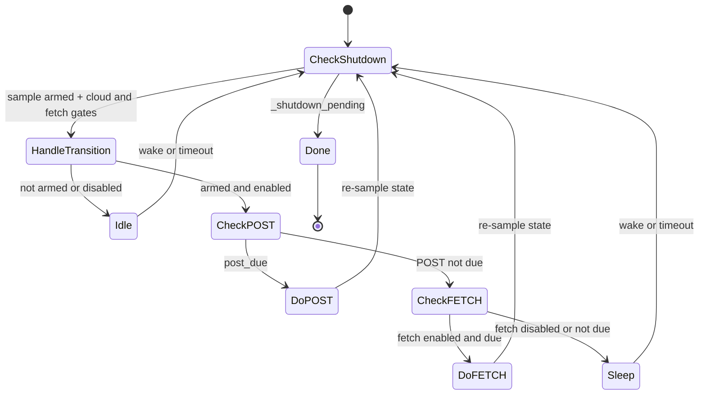

# Cloud Service

Product service that owns the Stationary cloud transport for AirGradient Go:
periodic POST of the latest `MeasuresAGo` snapshot and periodic FETCH of
device configuration via `AgClient` on a dedicated low-priority task. The
orchestrator owns mode policy and event dispatch; `CloudService` owns the
HTTP cadence, snapshot lifetime, and `AgClient` interactions. Active only in
`OperatingMode::Stationary` while Wi-Fi is online.

## Files

| File | Purpose |
|---|---|
| `products/go/main/go_cloud.h` | `CloudService` class declaration, `Deps` and `Config` structs |
| `products/go/main/go_cloud.cpp` | Task body, deadline math, snapshot mutex, `AgClient` calls, event posting |
| `products/go/main/go_cloud_types.h` | Fixed cloud result and correction-update payloads shared with `go_events.h` |

## Dependencies

| Dependency | Source | Usage |
|---|---|---|
| `AgClient` | `airgradient-client` (`services/ag_client.h`) | `http_post_measures()`, `http_fetch_config()` |
| `WifiService` | product (`go_wifi.h`) | `rssi()` at post time |
| `retained_uptime` | `airgradient-common` (`retained_uptime.h`) | Retained whole-minute uptime sampled at POST time |
| `Event`, `EventType` | product (`go_events.h`) | Posts `PostMeasuresResult`, `FetchConfigResult` to the orchestrator queue |
| `RTOS` | `airgradient-common` (`rtos.h`) | Task create/delete, mutex, semaphore, queue send, notify, time |
| `GoBoard::ag_client()` | product (`go_board.h`) | Lazy accessor; runs `AgClient::begin(serial, Wifi)` on first call |

## Public API

`CloudService` is constructed once by `GoApp` at boot and stays alive for
the process lifetime. All action methods are safe to call from the
orchestrator task at any time, including before `start()` or after `stop()`.

| Method | Purpose |
|---|---|
| `CloudService(queue, deps, cfg)` | Construct with event queue, borrowed `AgClient` and `WifiService`, and cadence config. No heap claimed. |
| `start()` | Allocate fetch buffer + semaphore, spawn task. Idempotent. Returns false on failure (self-cleans). |
| `stop()` | Drain in-flight HTTP, delete task, free heap. Bounded by ~15 s. Idempotent. |
| `arm(fire_now)` | Enable periodic ticks. `fire_now` makes the first cycle immediate (consumed on Disarmed→Armed transition only). |
| `disarm()` | Disable periodic ticks. In-flight HTTP still drains and posts its result event. |
| `set_disable_cloud(disable)` | Push the `disable_cloud` flag; sampled on the next iteration. |
| `set_config_fetch_enabled(enabled)` | Gate config FETCH independently of POST. Enabling while armed and cloud-enabled makes FETCH immediately due without changing POST cadence. |
| `update_measures_snapshot(m)` | Replace the cached `MeasuresAGo` under a mutex (~µs hold). |

See [`go_cloud.h`](../main/go_cloud.h) for full signatures.

## Config

| Field | Default | Notes |
|---|---|---|
| `post_interval_ms` | `60'000` | POST cadence (start-anchored) |
| `fetch_interval_ms` | `60'000` | FETCH cadence (start-anchored) |
| `disable_cloud` | `false` | Initial value; runtime changes via `set_disable_cloud()` |
| `config_fetch_enabled` | `true` | Initial independent FETCH gate; runtime follows `configuration_control != Local` |

File-local constants in `go_cloud.cpp`:

| Constant | Value | Notes |
|---|---|---|
| `CLOUD_TASK_STACK_SIZE` | `8192` | Task stack from heap (only while running) |
| `CLOUD_TASK_PRIORITY` | `4` | Below SensorProducer (5), above GpsService (3) |
| `FETCH_BUFFER_BYTES` | `2048` | Heap-allocated fetch response buffer, including the terminating NUL |

## Behavior

### Heap Lifecycle

The constructor claims only the small object footprint (atomics, snapshot
member, mutex). Real heap is deferred to `start()`:

- **`start()`** — allocates 8 KB task stack + 2 KB fetch buffer +
  semaphore. Called by the orchestrator only after Wi-Fi is online.
- **`stop()`** — frees all heap; returns to boot-time footprint.
- Portable / Offline modes never call `start()`.

### Task Loop

POST is checked before FETCH on every iteration. After each HTTP call,
the loop re-samples `_armed`, `_disable_cloud`, and
`_config_fetch_enabled` before considering the next leg. This guarantees a
disarm, cloud disable, or FETCH disable arriving during a POST gates the FETCH
out.

`disable_cloud` is the global transport gate and suppresses both POST and
FETCH. `config_fetch_enabled` affects only FETCH, so `ConfigurationControl::Local`
stops cloud configuration changes while measurement POST continues. Enabling
FETCH sets its deadline to the current time and wakes the task. While the task
is already armed and cloud transport is enabled, the next eligible iteration
fetches immediately without moving `_post_due`. While disarmed, the next
`arm()` establishes the normal schedule. While cloud transport remains
disabled, expired deadlines are moved forward and FETCH resumes on the normal
cadence rather than immediately.

Deadlines are start-anchored: `_post_due = post_started_at + interval`,
not completion time. A 15 s POST leaves 45 s before the next one.

### RSSI Translation

`WIFI_RSSI_INVALID` (0) is translated to `-127` before posting so the
dashboard never sees a misleading 0 dB.

### Uptime Metadata

Every measurement POST includes `boot`, sampled from
`retained_uptime::completed_minutes()` when the POST begins. It is not stored in
the `MeasuresAGo` snapshot, so it advances without new sensor data and remains
independent of measurement validity. The value has the same retained
whole-minute semantics as Local Server: deep-sleep time counts, non-deep-sleep
resets start at `0`, and the wire value saturates at `UINT32_MAX`.

### Shutdown

`stop()` sets the shutdown latch, wakes the task, and waits on the
done-semaphore. The task gives the semaphore and parks on an infinite
notify-wait (avoids a FreeRTOS double-delete race). `stop()` then
deletes the task and frees resources. Worst-case latency is one HTTP
timeout (~15 s).

## Orchestrator Wiring

| Orchestrator method | Cloud action |
|---|---|
| `enter_stationary()` | `set_disable_cloud()` + set first-post latch (no `start()`) |
| `on_wifi_connected()` | Set both runtime gates, then `start()` + `arm(first_post_pending)` |
| `on_wifi_disconnected()` | `disarm()` (except `requested_by_user`) |
| `on_provisioning_connected()` | Set both runtime gates, then `start()` + `arm(true)` after provisioning teardown |
| `change_mode(→ non-Stationary)` | `disarm()` + `stop()` (before `wifi.shutdown()`) |
| Any activated settings candidate | Update `disable_cloud` and/or `configuration_control` runtime gates when changed |
| `on_sensor_data()` | `update_measures_snapshot()` (unconditional, all modes) |
| Speculative WiFi OTA check (`check_timers()` tail) | `disarm()` up front; `arm(false)` on a no-op resume (still online) |
| Committed OTA (`enter_ota()` / `exit_ota()`) | `disarm()` on commit; `arm(false)` on resume when `wifi.is_online()` |

The cloud task is torn down **before** Wi-Fi so in-flight HTTP drains
while the socket is still alive.

### Fetch Configuration Mapping

After a successful complete fetch, the cloud task parses the response body once
and queues a value-only `FetchConfigEventPayload`. Supported fields map into
`GoConfigUpdate` independently. Device behavior fields are:

| Cloud Field | Accepted Values | Go Field |
|---|---|---|
| `pmStandard` | `"ugm3"`, `"us-aqi"` | `pm_use_usaqi` |
| `temperatureUnit` | `"c"`, `"f"` | `use_fahrenheit` |
| `measurementInterval` | Integer 1 .. 3600 | `measure_interval_seconds` |
| `gpsMode` | `"off"`, `"tracking"`, `"always"` | `gps_mode` |
| `gpsInterval` | Integer 1 .. 60 | `gps_interval_seconds` |
| `frontLedBrightness` | Integer 0 .. 3 | `front_led_brightness` |
| `backLedBrightness` | Integer 0 .. 3 | `back_led_brightness` |
| `touchLedIntensity` | Integer 0 .. 2 | `touch_led_intensity` |
| `buzzerEnabled` | Boolean | `buzzer_enabled` |
| `ledTestRequested` | Boolean | One-shot LED diagnostic request; not persisted |

Sensor and correction fields are:

| Cloud Field | Accepted Values | Go Field |
|---|---|---|
| `abcDays` | Integer `-1` or 1 .. 200 | `co2_abc_days`; `-1` disables automatic background calibration |
| `tvocLearningOffset` | Integer 1 .. 1000 | `tvoc_learning_offset` |
| `noxLearningOffset` | Integer 1 .. 1000 | `nox_learning_offset` |
| `corrections.pm02` | `none`, `epa_2021`, `custom_via_pm25_raw` | PM2.5 correction |
| `corrections.atmp` | `none`, `custom` | Temperature correction |
| `corrections.rhum` | `none`, `custom` | Humidity correction |

Each valid scalar or correction sets its own update-mask bit. A malformed field
does not prevent valid siblings from being delivered. Missing fields retain the
active setting, and custom coefficients must be finite JSON numbers with exact
property names.

Cloud FETCH does not own connectivity or writer authority. The parser ignores
`cloudConnection`/`disableCloudConnection` and `configurationControl`, and the
orchestrator's Cloud-Fetch merge also refuses those update bits. Local,
provisioning, and factory flows retain ownership of those settings.

The orchestrator merges selected fields into a candidate `GoSettings`, commits
and activates it, then asynchronously requests changed ABC periods or gas-index
learning offsets through the producer task. HTTP failures, truncated bodies,
malformed roots, and trailing non-whitespace data produce an empty update mask.

`ledTestRequested: true` runs the three-second LED diagnostic after valid config
fields from the same response are applied. `false`, a missing field, or a
non-boolean value does nothing. The parser stores the value directly in
`FetchConfigEventPayload`; it never enters `GoConfigUpdate`, settings, or NVS.
The firmware performs no edge detection because the backend returns `true` once
per request and then returns `false` until another request is made.

Cloud result delivery is best-effort. A full central queue drops the zero-wait
event, so no update is applied; the next periodic FETCH is the next retry
opportunity.

The orchestrator rechecks `configuration_control` when it consumes the result.
If control changes to `Local` while HTTP is in flight, the successful event is
discarded without persistence, runtime changes, or an LED diagnostic. Re-enabling
Cloud/Both calls `set_config_fetch_enabled(true)`, making the next FETCH
immediately due when the task is armed and cloud transport is enabled.

### OTA Interaction

A Stationary WiFi OTA check shares the radio with cloud transport, so the
orchestrator pauses cloud around it with `disarm()` only — never `stop()` (see
[`orchestrator.md` → OTA](orchestrator.md#firmware-update-ota)):

- `disarm()` parks the cloud task (no new POST/FETCH) while the task + heap stay
  alive. Because the OTA transfer blocks the orchestrator and `enter_ota()`
  stops the sensor producer, the cloud task is never re-woken — it stays dormant
  for the whole transfer with no new HTTPS.
- The same handling covers both the **speculative hourly check** (no image) and
  a **committed download**: pause with `disarm()`, resume with `arm(false)` when
  `wifi.is_online()`. If Wi-Fi dropped mid-OTA, cloud is left disarmed and the
  device stays Stationary-but-offline.
- `stop()` is intentionally avoided: a committed download reboots on success (so
  freed heap is moot), and a `stop()` + `start()` round-trip would only churn /
  fragment the heap on the failure path. The one residual case — a cloud request
  already in-flight when `disarm()` is called — drains naturally during the OTA
  `open()` + partition-erase window and, in the worst case, degrades gracefully
  (a failed cloud POST is logged and retried).

## Events

| EventType | Payload | Producer |
|---|---|---|
| `PostMeasuresResult` | `CloudResultByte` (`AgClientResult`) | Cloud task after each POST |
| `FetchConfigResult` | `FetchConfigEventPayload` | Cloud task after each FETCH |

`PostMeasuresResult` remains result-byte-only. `FetchConfigResult` carries the
result byte, the fixed `GoConfigUpdate`, and the transient LED-test request flag.
The trivially-copyable payload never holds a pointer into the reusable fetch
buffer.

## Heap Constraints (ESP32-C5)

The ESP32-C5 has ~183 KB of available heap. The TLS handshake with the
AirGradient backend's 4096-bit RSA certificate temporarily consumes most
of the largest free contiguous block. The Go product's sdkconfig is tuned
for this:

| Setting | Default | Go value | Saving |
|---|---|---|---|
| `CONFIG_MBEDTLS_SSL_IN_CONTENT_LEN` | `16384` | `4096` | 12 KB per TLS connection |
| `CONFIG_ESP_WIFI_DYNAMIC_RX_BUFFER_NUM` | `32` | `16` | Steady-state heap headroom |
| `CONFIG_ESP_WIFI_DYNAMIC_TX_BUFFER_NUM` | `32` | `16` | Steady-state heap headroom |

The 4 KB TLS input buffer is sufficient for the Go product's small
payloads (POST response < 256 bytes, FETCH config < 1 KB). The reduced
Wi-Fi buffers are adequate for the infrequent HTTP workload (two requests
per minute).

Lifecycle and HTTP paths emit `log_heap()` probes around `start()`,
`stop()`, POST, and FETCH. These probes track whether cloud task stack
allocation and TLS handshakes still leave enough contiguous heap for the
Stationary Wi-Fi / provisioning flows.

## Edge Cases / Errors

- **First POST before sensor data.** Default-constructed snapshot has
  every field at invalid sentinels; the serializer omits them while `wifi` and
  `boot` still reach the dashboard.
- **`start()` failure.** Self-cleans on partial allocation failure. The
  orchestrator logs the error; the next `on_wifi_connected()` retries.
- **Reconnect after AP outage.** `disarm()` on disconnect, `arm(false)`
  on reconnect — cadence resumes at the next interval, no fire-immediate.
- **Mode change during in-flight HTTP.** `stop()` drains the call
  (bounded ~15 s), then Wi-Fi shuts down.
- **`set_disable_cloud(true)` while armed.** Expired deadlines are slid
  forward so re-enabling doesn't catch up on missed intervals.
- **Config FETCH disabled while POST is armed.** POST keeps its cadence; the
  disabled FETCH deadline is excluded from wake calculations.
- **Config FETCH re-enabled.** While armed and cloud-enabled, FETCH becomes
  immediately due and POST's deadline is unchanged. A later `arm()` or an
  active cloud-disable gate establishes or preserves normal cadence instead.
- **FETCH result races an authority change.** The cloud task still posts its
  value event; the orchestrator discards it when active control is `Local`.
- **Atomic state before `start()`.** `arm()`, `disarm()`,
  `set_disable_cloud()`, and `set_config_fetch_enabled()` write atomics; the
  values persist and take effect when the task eventually starts.

## Testability

`CloudService` is host-testable via friend-class access
(`CloudServiceTestAccess`) and link-time stubs for `AgClient` (concrete
class, no virtuals) and `WifiService`. Tests drive the task body
deterministically via `_run_iteration(now)` with injected clock values.

Host tests live in `products/go/tests/go_cloud.tests.cpp` and cover:
transition handling, snapshot round-trip, POST/FETCH forwarding, POST
priority, scalar/correction FETCH mapping, independent FETCH gating,
start-time anchoring, overrun, disarm/disable mid-POST, RSSI translation,
shutdown latch, deadline clamp, and first-POST sentinels.

Orchestrator-level wiring is tested through the stubbed `CloudService` in
`products/go/tests/go_orchestrator.tests.cpp`.
