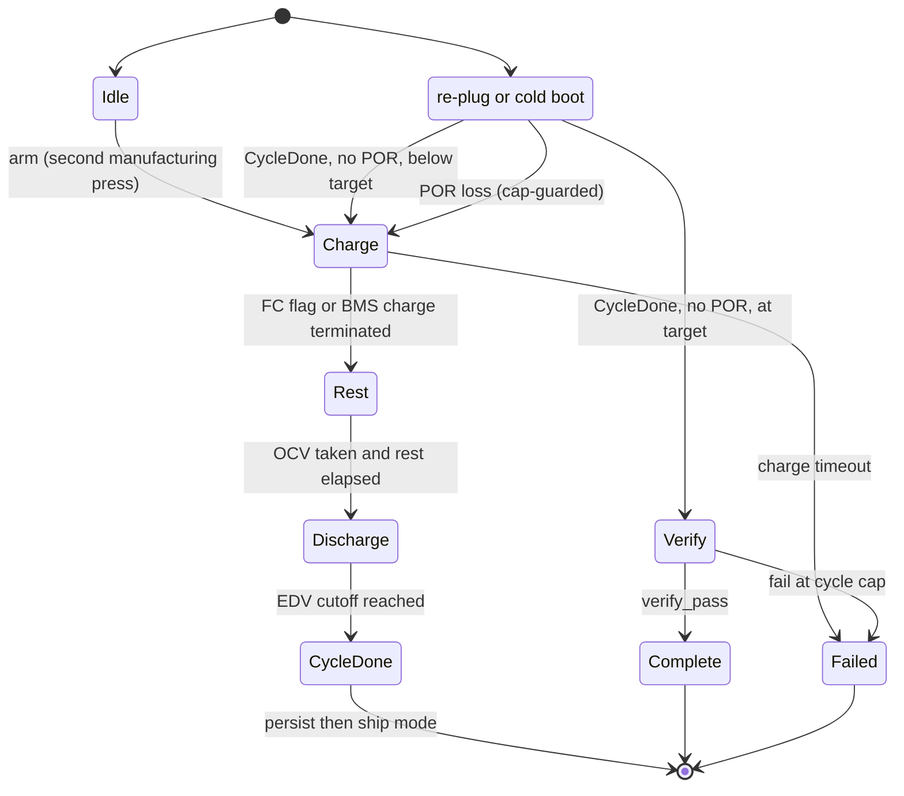
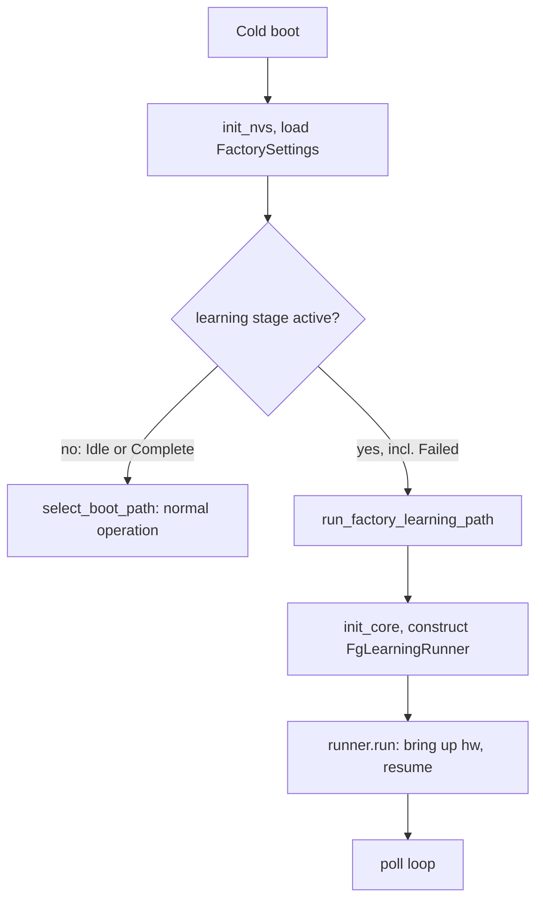
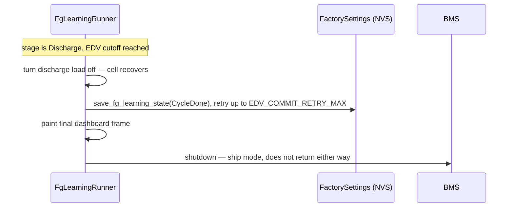

# Fuel-Gauge Learning

The AirGradient Go uses a BQ27427 Impedance-Track fuel gauge whose accuracy
depends on two learned values — `Qmax` (true cell capacity) and the `Ra` table
(per-SOC internal resistance). The gauge learns them only by observing clean
charge → rest → discharge → rest cycles. This is a **per-unit, end-of-line
operation**: a unit learns its own gauge once on the assembly line and never
again in the field. Learning runs in a **dedicated factory boot path** that
`GoApp::run()` routes into before normal boot-path selection. The path is
self-contained — it brings up only the display, LED, and buzzer, owns its own
poll loop, and never constructs the `Orchestrator` or any normal producer. The
run survives the end-of-discharge ship-mode power-off and resumes on re-plug
with no operator input, then verifies once after the final cycle and hands back
to normal operation.

## Files

| File | Purpose |
|---|---|
| [`fg_learning/fg_learning_controller.h`](../main/fg_learning/fg_learning_controller.h) | Pure FSM declaration (no hardware / ESP-IDF) |
| [`fg_learning/fg_learning_controller.cpp`](../main/fg_learning/fg_learning_controller.cpp) | FSM transitions, resume matrix, verify criteria |
| [`fg_learning/fg_learning_runner.h`](../main/fg_learning/fg_learning_runner.h) | Hardware-owning run declaration (target-only) |
| [`fg_learning/fg_learning_runner.cpp`](../main/fg_learning/fg_learning_runner.cpp) | Bring-up, poll loop, load stack, EDV ship, dashboard, abort |
| [`go_settings.h`](../main/go_settings.h) / [`go_settings.cpp`](../main/go_settings.cpp) | `FactorySettings` persistence + boot predicate |
| [`go_power.h`](../main/go_power.h) / [`go_power.cpp`](../main/go_power.cpp) | `poll_bms_fg_learning`, verify read-back, charge / gauge control |
| [`go_display.h`](../main/go_display.h) / [`go_display.cpp`](../main/go_display.cpp) | `FgLearningDashboardData` + dashboard renderer |
| [`go_app.cpp`](../main/go_app.cpp) | Boot routing into the factory path |
| [`go_orchestrator.cpp`](../main/go_orchestrator.cpp) | The single arming branch |
| [`components/airgradient-bms/drivers/bq27427`](../../../components/airgradient-bms/drivers/bq27427) | Gauge learning reads / chemistry / Update-Status writes |

## Dependencies

| Dependency | Source | Usage |
|---|---|---|
| `FgLearningController` | `fg_learning` | Pure decision core owned and ticked by the runner |
| `PowerService` | `go_power` | Poll, charge / load control, gauge prerequisites, verify read, external watchdog, ship-mode shutdown |
| `DisplayService` | `go_display` | Full-screen learning dashboard |
| `LedService` | `led/go_led` | Solid back-LED manual cue (amber / red / green) |
| `BuzzerService` | `buzzer/go_buzzer` | Unplug-alert melody |
| `ConfigStore` | `airgradient-config` (`config_store.h`) | `FactorySettings` load / save / clear |
| `GoBoard` | `go_board` | GPIO HAL for the abort-button read (`reboot()` is a free function) |
| `FuelGaugeDevice` / `BQ27427` | `airgradient-bms` | Learned-value reads and chemistry / Update-Status writes |

## Public API

### FgLearningController (Pure FSM)

| Method | Returns | Purpose |
|---|---|---|
| `load(stage, cycle, itpor_losses)` | `void` | Seed state from `FactorySettings` |
| `start()` | `void` | Arm a fresh run (`Charge`, cycle 1) |
| `reset()` | `void` | Clear to `Idle` |
| `resume_on_boot(snap)` | `bool` | Apply the boot resume matrix; true when a run continues |
| `tick(snap, now_ms)` | `FgLearningAction` | Advance one step and emit the action to apply |
| `on_verify_result(in)` | `bool` | Resolve verify → `Complete` / `Failed` / another cycle |
| `verify_pass(in)` | `bool` | Pure, static pass/fail check (host-tested) |

See [`fg_learning_controller.h`](../main/fg_learning/fg_learning_controller.h)
for `FgLearningAction`, `VerifyInputs`, and the accessors (`stage`, `cycle`,
`itpor_losses`).

### FgLearningRunner (Hardware Run)

| Method | Returns | Purpose |
|---|---|---|
| `FgLearningRunner(Deps)` | — | Inject services (power, display, led, buzzer, config, board) |
| `run()` | `[[noreturn]]` | Bring-up + resume + poll loop; never returns |

### PowerService (Learning-Facing)

| Method | Returns | Purpose |
|---|---|---|
| `poll_bms_fg_learning()` | `PowerSnapshot` | Normal poll plus the learning-only fields (one extra CONTROL_STATUS read) |
| `read_fg_learning_verify()` | `FgLearningVerifyReadout` | Aggregate Qmax / Ra grid / Design Capacity / ITPOR / QMAX_UP |
| `set_charge_current_ma(ma)` | `bool` | Program ICHG |
| `set_manual_charge_disabled(disabled)` | `void` | Enable / disable the charge path |
| `set_chemistry_4v2()` | `bool` | Idempotent switch to Chem ID `0x1202` |
| `set_update_status_learning(enable)` | `bool` | Lift / restore the gauge change limits |

### Factory Settings

| Method | Returns | Purpose |
|---|---|---|
| `is_factory_learning_stage_active(stage)` | `bool` | Boot predicate — true for every stage except `Idle` and `Complete` |
| `load_factory_settings(store, out)` | `bool` | Read `fs_*` keys from the `"go"` namespace |
| `save_fg_learning_state(store, stage, cycle, losses)` | `bool` | Atomic single-commit run-state write |
| `clear_factory_settings(store)` | `bool` | Explicit clear (not called by `factory_reset()`) |

## Behavior

### Stages

The controller is driven, not autonomous. Each `tick()` derives the next stage
from the snapshot flags and returns an `FgLearningAction` for the runner to
apply. The run executes a fixed `CYCLE_TARGET` (default 2) full cycles before
verifying once.



### Cycle Timeline

The run repeats one full charge → rest → discharge → ship → re-plug cycle
`CYCLE_TARGET` (default 2) times, then verifies **once**. Each `Discharge`
starts at the **full** top and ends **empty** at the EDV cutoff, so the battery
is full only at the _start_ of a discharge.

```text
Arm
 └─ Cycle 1: Charge(empty->full) -> Rest(OCV1) -> Discharge(full->EDV) -> CycleDone -> ship
 re-plug   (cycle 1 below target -> next Charge)
 └─ Cycle 2: Charge(empty->full) -> Rest(OCV1) -> Discharge(full->EDV) -> CycleDone -> ship
 re-plug   (cycle 2 at target -> Verify)
 └─ Verify (battery empty, read-only) -> Complete / Failed
```

The boot resume matrix sequences this: on re-plug from `CycleDone`, `cycle below
target` returns to `Charge` (cycle + 1), while `cycle at target` enters
`Verify`. So `Verify` lands **right after the final re-plug, on the empty side** —
it keeps charge off and only reads the learned values back
(`read_fg_learning_verify()`); it does **not** recharge first. `OCV2` and the
Qmax recompute happen during the powered-off rest before that re-plug, so a brief
rest before re-plugging matters. Across the two cycles the flags typically fill
in as: `OCV` first, `R` during cycle 1's discharge, `Q` once cycle 1 closes, with
cycle 2 refining both before `Verify`.

### Controlled Power Profile

The factory path runs no background producers, so the runner controls a
deliberate load stack per stage. Learning is gated by the gauge's battery-side
current thresholds (Quit Current 80 mA, Dsg Current Threshold 120 mA).

| Stage | Charge | Toggled loads (PM + CPU duty) | Resulting profile |
|---|---|---|---|
| `Charge` | on, ICHG 1500 mA | off | Charger-dominated |
| `Rest` | off | off | Quiet — under 80 mA for clean OCV1 |
| `Discharge` | off | PM + CPU duty on | Steady draw above the 120 mA threshold |
| `Verify` | off | off | Quiet |

GPS is **never managed** by the factory path (the TAU1113 has no power GPIO and
auto-acquires at power-on), so its steady ~16–21 mA is always present and stays
under the Quit Current during the quiet stages. The discharge stack adds the PM
fan plus a deliberate CPU-active duty so battery-side current clears the
discharge threshold; the margin grows as the cell drains.

The PM fan is the primary load: powering the EN_PM rail alone does not spin it —
the SPS30 must be told to measure. On `Discharge` the runner powers EN_PM and
then calls `GoBoard::start_pm_fan()` every poll until it reads back a valid
measurement (proof the fan is actually running), so a slow sensor boot or a
transient I²C error self-recovers instead of leaving the discharge load short.

Unplugging the charger flips PMID (the rail feeding the EN_PM load switch hands
off from input to OTG boost), which browns the SPS30 out of measuring mode even
though EN_PM stays asserted — the fan stops. The runner detects the unplug edge
(`external_input_present` true → false) during `Discharge` and forces a full PM
re-enable (`stop_pm_fan()` clears the inited flag), so the per-poll
`start_pm_fan()` retry re-inits the sensor and the fan resumes within one poll.

### Manual-Intervention Cues (LED + Buzzer)

The pure FSM emits a `ManualCue`; `FgLearningRunner::apply_action()` maps it to
one **solid** back-LED colour (`LedService::back_solid()`), and
`handback_terminal()` lights the terminal colour. So an operator servicing a
rack can see at a glance what each unit needs.

| Cue / stage | Back LED | Buzzer | Operator action |
|---|---|---|---|
| `Unplug` (`Discharge`) | Solid amber `Rgb{255, 140, 0}` | `PATTERN_UNPLUG` melody once on entry | Unplug the charger |
| `Complete` (terminal) | Solid green `Rgb{0, 255, 0}` | — | Pass — power-cycle to ship |
| `Failed` (terminal) | Solid red `Rgb{255, 0, 0}` | — | Reject — hold BOOT to clear |
| `None` (`Charge` / `Rest` / `Verify`) | Off (`back_off()`) | — | None — automatic |

The `Failed` screen text reads `Failed - hold BOOT to clear`, pairing the red
LED with the discoverable abort gesture.

**Re-plug has no LED.** By the time the operator must re-plug, the device has
reached EDV, persisted `CycleDone`, and entered ship mode (powered off) — an LED
is impossible. The re-plug cue is therefore the `Discharge complete` screen,
painted as the last frame before power-off. On re-plug the run auto-resumes with
no operator input (next cycle's `Charge`, or `Verify` after the final cycle). For
a clean OCV2, let the unit rest briefly while powered off before re-plugging.

### Boot Routing and Resume

`GoApp::run()` gains a single early branch before `select_boot_path()`. Only the
lightweight, idempotent `init_nvs()` is needed to read `FactorySettings`; the
heavy `init_core()` happens inside the factory path.



`resume_on_boot()` loads `FactorySettings` into the controller, applies the
idempotent gauge prerequisites (`set_chemistry_4v2()`; Update-Status learning
bits on cycle 1), takes one poll, and runs the controller's resume matrix. The
loss signal during resume is `fg_itpor` alone — `qmax_up` is legitimately `0`
for all of cycle 1, so gating on it would misclassify a benign mid-cycle reboot.

### EDV / Ship-Mode Integration

`handle_edv_ship()` owns the persist-then-ship sequence. **Battery safety beats
resumability**: continuing to drain a cell already at the 2.9 V cutoff is the
over-discharge the trip exists to prevent.



The shared EDV detection in `poll_bms()` is unchanged and still protects shipped
units. Because the EDV trip is sample-count based, the wall-clock debounce in the
factory path is `3 x` the runner poll cadence.

### Watchdogs

The device is awake for the whole multi-hour run, so the runner feeds the
external hardware watchdog itself: `feed_ext_watchdog()` calls
`PowerService::reset_ext_watchdog()` well inside the ~60 s window. The BQ25629
charger watchdog is disabled at BMS init and needs no servicing.

### Self-Sufficient Display

The runner builds a `DisplayValues` directly (no `UIManager`) — setting
`show_fg_dashboard`, the `FgLearningDashboardData`, and the matching
`Screen::FgLearn*` value — and calls the public `update_sync()`.
`DisplayService::_render_frame()` dispatches to the private
`_draw_fg_learning_dashboard()`. The policy is full refresh only, EPD deep-sleep
between paints, a `FG_LEARNING_DISPLAY_REFRESH_MS` (60 s) heartbeat plus a paint
on every stage transition and on any charging-state / plug change (so a
plug/unplug shows within a poll, not a heartbeat). FCC drift is shown against the
compile-time `FG_LEARNING_DESIGN_CAPACITY_MAH` (2000), so the dashboard adds zero
I²C reads.

The frame shows a bold phase banner (two-word stages wrap to two lines), the
`Cycle n/N` line, the SOC / voltage / signed-current block, the capacity /
temperature / flag rows, and a bottom **`HH:MM` per-stage elapsed clock**
(`stage_elapsed_ms`). That clock is wall-clock since the device entered the
current stage **this power session**, so it resets across the ship-off / re-plug
(it is a per-stage timer, not a cumulative run timer).

### Learning-Progress Flags (OCV / Q / R)

The dashboard's `Q R OCV` row is the gauge's own report of how far Impedance
Track has gotten. `poll_bms_fg_learning()` packs these three bits into
`fg_learning_flags` from two gauge registers (the CONTROL_STATUS bit positions
are bench-pending confirmation against TRM sluucd5):

| Display | Flag | Register | Constant |
|---|---|---|---|
| `OCV` | OCVTAKEN | `Flags()` bit 7 | `FG_LEARN_OCV_TAKEN` |
| `Q` | QMAX_UP | `CONTROL_STATUS` bit 4 | `FG_LEARN_QMAX_UP` |
| `R` | RES_UP | `CONTROL_STATUS` bit 5 | `FG_LEARN_RES_UP` |

- **`OCV` — OCV taken.** The cell's _rested_ open-circuit voltage, measured once
  current has stayed below the Quit Current (~80 mA) long enough to relax. It
  anchors the cycle: learning needs two points — **OCV1** at the rested top
  (after charge → rest) and **OCV2** at the rested bottom (after discharge →
  ship-off rest). This is why `Rest` waits for `OCVTAKEN` _and_ the 500 s gate,
  and why the quiet stages must stay under the Quit Current.
- **`Q` — Qmax updated.** `Qmax` is the cell's _true full capacity_, computed
  from the coulombs counted between two relaxed OCV points at known
  depth-of-discharge. `QMAX_UP` sets only after a qualified discharge bounded by
  two OCVs lets the gauge recompute it, so it is **legitimately 0 for all of
  cycle 1**. (That is exactly why resume keys off `fg_itpor`, not `qmax_up`.) It
  is verify criterion 2, and the learned `qmax_mah` must land within
  `[0.7×, 1.4×]` of design capacity.
- **`R` — Ra updated.** `Ra` is the per-SOC internal-resistance grid (15 points,
  `RA_TABLE_SIZE`) used to predict voltage under load. `RES_UP` sets after the
  **first** Ra entry moves during a qualified discharge — it is **not** a
  "fully learned" signal, so verify criterion 4 inspects the _whole_ grid rather
  than trusting `RES_UP`. Ra is learned in `Discharge`, at temperature (hence the
  ~25 °C target there).

Healthy progression: `OCV` flips to 1 first, then `R` turns on during the first
qualified discharge, and `Q` turns on once the full cycle (two OCVs) closes —
so `Q0 R0 OCV1` during cycle-1 `Charge` is exactly what you expect.

### Arming

Manufacturing mode is ephemeral (not persisted), so arming is a runtime gesture
on a fresh unit (`onboarding_done == false`):

```text
1st boot short-press -> enter_manufacturing_mode (existing)
2nd boot short-press -> save_factory_settings(Charge, cycle 1) + reboot
```

The reboot lands in `GoApp::run()`'s early branch, which routes into the factory
path. The orchestrator owns none of the run — no tick, resume, verify, ship
hook, or dashboard.

### Terminal Handback

The two terminal stages are asymmetric so a rejected unit cannot be silently
shipped:

- **`Complete`** is treated as inactive by the boot predicate; the next
  power-cycle boots the field firmware with the gauge learned.
- **`Failed`** is treated as _active_ (sticky): the unit re-enters the factory
  path and shows the failure screen on every boot until an operator clears it.
  `FactorySettings` survives `factory_reset()`, so a failed unit cannot
  accidentally look normal.

`handback_terminal()` performs idempotent cleanup (restore charge, PM off, clear
the Update-Status learning bits), persists the terminal stage, paints the result
frame, lights the result LED (green / red), and holds until power-cycle.

## Edge Cases / Errors

- **CycleDone commit fails before ship:** the runner retries up to
  `EDV_COMMIT_RETRY_MAX`, then ships regardless — ship mode is a safe power-off,
  and the lost cycle is recovered by the resume / POR-loss path on re-plug. The
  runner never lingers discharging at the cutoff.
- **POR during a run:** `fg_itpor` triggers a cap-guarded restart; after
  `ITPOR_LOSS_CAP` (3) losses the run trips `Failed` for investigation.
- **`FC` never latches** (chemistry / Taper-Voltage mismatch): `Charge` also
  advances when the BMS terminates charge after charging was actually observed,
  so OCV1 is still captured at the relaxed top.
- **Chemistry already correct:** `set_chemistry_4v2()` reads the Chem ID first
  and only writes when it differs — changing chemistry resets IT learning, so it
  must never run on an already-learned unit.
- **No fuel gauge attached (Prototype):** the gauge prerequisites and verify read
  return false; a Prototype board has no learning surface and never arms a run.
- **Invalid gauge data:** the dashboard renders `FG: NO DATA` when the SOC
  sentinel indicates no valid read.
- **Abort:** a boot long-press (during a run or in the `Failed` hold) calls
  `reset()` + `clear_factory_settings()` and reboots into normal operation.
- **Boot cost:** every normal fast / button-wake boot now pays one `init_nvs()`
  plus a single key read before path selection; confirm on hardware that this is
  not measurable.
