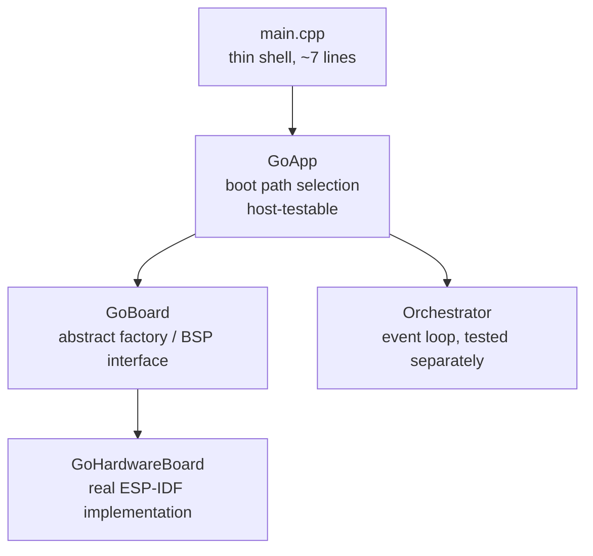

# Hardware Initialization

Boot path selection, hardware initialization, and fast-path boot for the
AirGradient Go product. Hardware initialization is encapsulated in
`GoHardwareBoard` (real ESP-IDF implementation of the `GoBoard` interface).
Boot path logic lives in `GoApp`. Pin assignments are in `board_config.h`.

## Files

| File | Purpose |
|---|---|
| `main/main.cpp` | Thin shell: constructs `GoHardwareBoard` + `GoApp`, calls `run()` |
| `main/go_board.h` | Abstract `GoBoard` interface (init methods, service accessors, factories) |
| `main/go_hardware_board.h` | `GoHardwareBoard` class declaration |
| `main/go_hardware_board.cpp` | Real ESP-IDF init calls, driver creation, bus management |
| `main/go_app.h` | `GoApp` class, `select_boot_path()`, pure utility functions |
| `main/go_app.cpp` | Boot path logic, `execute_fast_path()`, service wiring |
| `main/board_config.h` | Pin assignments and peripheral constants |
| `main/go_types.h` | `BootHandoff`, `RtcAppState`, `WakeCause`, `LockState` |

## Architecture



| Layer | Responsibility | Testable on host? |
|---|---|---|
| **main.cpp** | Construct board, construct app, call `run()` | No |
| **GoApp** | Boot path selection, fast-path logic, service construction, orchestrator launch | **Yes** |
| **GoBoard** | Abstract interface for hardware object creation | N/A (interface) |
| **GoHardwareBoard** | All ESP-IDF init, driver creation, bus management | No |

## Boot Path Selection

`GoApp::run()` determines the boot path using the pure function
`select_boot_path()`:

```text
GoApp::run():
    cause = PowerService::get_wake_cause()
    path = select_boot_path(cause, load_rtc_app_state())

    switch (path):
        FastPath    → run_fast_path(state)
        ButtonWake  → run_button_wake_path(state)
        Interactive → run_interactive(cause, {})
```

| Wake Cause | Condition | Path |
|---|---|---|
| `PowerOn` | -- | `Interactive` with empty BootHandoff |
| `Timer` + `Locked` | `is_fast_path_wake()` | `FastPath` — measure, display, sleep or promote |
| `Timer` + `Unlocked` | Not fast-path eligible | `Interactive` |
| `Button` + `Offline` | -- | `ButtonWake` — four-phase early paint |
| `Button` + non-Offline | -- | `Interactive` |

### load_rtc_app_state()

Free function declared in `go_power.h`, implemented in `go_power.cpp`. Reads
`RTC_DATA_ATTR` static variables that `PowerService::save_state()` /
`load_state()` use. Safe to call before any peripheral init because it has
no hardware dependencies.

## GoBoard Interface

The `GoBoard` abstract interface provides:

### Init methods (idempotent)

Each initialises one subsystem. Safe to call multiple times — subsequent
calls are no-ops. Boot paths call these in the order their hardware
sequencing requires.

| Method | What it initialises |
|---|---|
| `init_nvs()` | NVS flash |
| `init_buses()` | GPIO power enables + I2C bus + settling delays |
| `init_spi()` | SPI bus |
| `init_bms()` | BMS driver (requires buses) |
| `init_wifi_subsystem()` | ESP-IDF Wi-Fi stack: netif, event loop, `esp_wifi_init`, storage mode, event handlers, single-shot timers. **Not** called by `init_core()` — only `Orchestrator::enter_stationary()` invokes it, so Portable-only boots never pay the cost. Idempotent at both the board layer (`_wifi_inited` flag) and the HAL layer. |
| `init_core()` | Convenience gate: calls `init_nvs` + `init_buses` + `init_spi` + `init_bms` (skips what's done). Deliberately excludes `init_wifi_subsystem()`. |

### Lazy service accessors

Create-on-first-call. Objects are owned by the board and live for the
process lifetime (never freed — the app never returns).

| Accessor | What it creates | Prerequisites |
|---|---|---|
| `config_store()` | NvsConfigStore | NVS |
| `load_settings()` | Loads GoSettings from NVS | NVS (via config_store) |
| `bms()` | Returns BmsDevice ref | BMS init |
| `sensors(warm)` | All sensor drivers + SensorManager | Buses, BMS |
| `storage()` | PayloadCache + NAND + StorageService | SPI |
| `display()` | DisplayService | SPI |
| `power()` | PowerService + ext watchdog | BMS |
| `wifi_hal()` | `EspWifiHal` instance | — (lazy C++ construction only; ESP-IDF Wi-Fi init runs in `init_wifi_subsystem()`) |
| `wifi_manager()` | `WifiManager` constructed against the HAL | `wifi_hal()` — the manager's constructor only registers callbacks, so construction against an uninitialised HAL is safe; driver calls fire when `WifiService` actions run |
| `http_server()` | `IdfHttpServer` for the Wi-Fi captive-portal transport | — (lazy) |
| `ble_server()` | `NimbleBleServer` shared between Portable BLE and Stationary BLE provisioning | — (lazy) |
| `ag_client()` | `AgClient` with `begin(serial, Wifi)` on first call | — (lazy; sub-millisecond, no sockets) |

GoHardwareBoard enforces these prerequisites with `assert()` — calling an
accessor before its prerequisite init method triggers an assertion failure
with a descriptive message (e.g., `"sensors() requires init_buses()"`).
Assertions are stripped in release builds (`-DNDEBUG`) so there is zero
runtime overhead in production.

### Per-call factories

| Factory | Returns | Prerequisites | Notes |
|---|---|---|---|
| `new_gps_driver()` | `GpsDriver *` | — | Allocates serial + driver (process lifetime) |
| `new_touch_sensor()` | `CapTouchSensor *` | Buses | Allocates + calls `init()`, logs failure |

### Platform info and hardware operations

`serial_number()`, `firmware_version()`, `gpio_hal()`,
`release_gpio_holds()`, `ulp_stop()`, `ulp_start()`,
`install_button_isr()`, `remove_button_isr()`.

## GoHardwareBoard Init Method Ordering

| Boot path | Init sequence |
|---|---|
| **Fast path** | `init_core()` → `sensors(warm)` → `storage()` → `display()` → `power()` |
| **Button wake** | `init_spi()` → `display()` → early paint → `init_nvs()` + `init_buses()` + `init_bms()` → `sensors()` → ... |
| **Interactive** | `init_core()` → `sensors()` → `storage()` → `display()` → `power()` → orchestrator may call `init_wifi_subsystem()` on first `enter_stationary()` |

Hardware sequencing constraints:

- **NVS** must be ready before ConfigStore can read settings
- **Buses** (GPIO power enables + I2C) must be ready before I2C devices
- **SPI** must be ready before display and NAND flash
- **BMS** must be initialised before sensors (PMID 5V rail powers SPS30)
- **Wi-Fi subsystem** must be initialised before any STA / AP / scan
  call hits the driver. The lazy accessors only construct the C++
  objects; the orchestrator's first Stationary entry triggers
  `init_wifi_subsystem()`. Portable-only boots never call it.

## BootHandoff

Defined in `go_types.h`. Describes what boot has already done so the
orchestrator can skip redundant work. Default-initialized values represent
a fresh power-on boot.

| Field | Type | Default | Description |
|---|---|---|---|
| `display_painted` | `bool` | `false` | Display already shows valid content |
| `measurement_completed` | `bool` | `false` | A measurement was completed during boot |
| `suppress_wake_press` | `bool` | `false` | Suppress first ButtonPower short-press |
| `initial_lock_state` | `LockState` | `Locked` | Initial lock state for orchestrator |
| `display_snapshot` | `const RtcDisplaySnapshot *` | `nullptr` | Stale display values for seeding |
| `fast_path_measures` | `const MeasuresAGo *` | `nullptr` | Fresh measurement from fast path |

## Interactive Boot (GoApp::run_interactive)

Handles both fresh boot (empty BootHandoff) and fast-path promotion.
All init is idempotent via GoBoard lazy accessors:

| # | What | GoBoard call |
|---|---|---|
| 1 | Core init | `_board.init_core()` (no-op if already done) |
| 2 | Settings | `_board.load_settings()` |
| 3 | Sensors | `_board.sensors()` |
| 4 | GPS + touch | `_board.new_gps_driver()`, `_board.new_touch_sensor()` |
| 5 | Storage | `_board.storage()` |
| 6 | Event queue, BLE, Wi-Fi, Cloud | `BleService` borrows `_board.ble_server()`; `WifiService` borrows `_board.wifi_manager()`, `_board.ble_server()`, `_board.http_server()`; `CloudService` borrows `_board.ag_client()` + `WifiService` |
| 7 | Producer services | SensorProducer, GpsService, InputService |
| 8 | Display | `_board.display()` |
| 9 | Power | `_board.power()` |
| 10 | UIManager | Always constructed |
| 11 | Display init | If `!handoff.display_painted` |
| 12 | Start tasks + Orchestrator | `orchestrator->init()` + `run()` |

## Fast-Path Boot (GoApp::execute_fast_path)

Timer wake while locked. Minimal initialization — no event loop, no producer
tasks, no input handling. Returns a `FastPathResult` for testability.

| # | What | GoBoard call |
|---|---|---|
| 1 | Core init + GPIO holds | `_board.init_core()`, `_board.release_gpio_holds()` |
| 2 | Load settings | `_board.load_settings()` |
| 3 | Sensor init | `_board.sensors(state.sensors_warm)` |
| 4 | Interruptible warmup | `sm.warmup_step()` with button checks |
| 5 | One-shot measurement | `sm.start_measures()` (skip if button) |
| 6 | One-shot GPS | `_board.new_gps_driver()` (skip if button/inactive) |
| 7 | Storage + cache | `_board.storage()` (skip if button) |
| 8 | Display + sleep decision | `_board.display()`, `_board.power().decide_sleep()` |
| 9 | Return result | `FastPathResult{Outcome::Sleep, ...}` or `{Outcome::Promote, ...}` |

The caller (`run_fast_path`) handles ISR setup/teardown, sleep entry, and
promotion to `run_interactive()` based on the returned outcome.

### Button detection during fast path

GoBoard's `install_button_isr()` / `remove_button_isr()` manage a
falling-edge ISR that sets a volatile flag. The flag is checked between
warmup iterations, after measurement, after GPS read, and after the sleep
decision. The ISR is removed before `InputService` construction.

### Promotion handoff

On button press: unlocked, suppress wake press, display snapshot from RTC
(stale values + "Unlocked" snackbar), fresh measures if available.

On sleep too short: locked, display painted with locked dashboard,
measurement completed.

## Button-Wake Path (GoApp::run_button_wake_path)

Button wake in Offline mode. Four-phase boot with early paint. Uses
individual init methods for fine-grained ordering:

```text
Phase 1:  _board.init_spi() → _board.display() → early paint → _board.ulp_stop()
Phase 2:  _board.init_nvs() → _board.init_buses() → _board.init_bms()
          → _board.sensors() → _board.new_touch_sensor() → _board.new_gps_driver()
          → _board.power() → start producer tasks
Phase 3:  _board.storage() → BleService (borrows _board.ble_server())
          → WifiService (borrows wifi_manager / ble_server / http_server)
          → CloudService (borrows _board.ag_client() + WifiService)
Phase 4:  Orchestrator::init() → Orchestrator::run()
```

See [ARCHITECTURE.md → Button-Wake Path](../ARCHITECTURE.md#button-wake-path-button-wake-offline-mode)
for the full sequence.

## Error Handling

- **Bus init failures** (I2C, SPI, NVS): `ESP_ERROR_CHECK` — fatal, device
  cannot function without buses.
- **Sensor init failures**: Log and set `Sensors` pointer to `nullptr`.
  `SensorManager` handles `nullptr` sensors gracefully.
- **NAND mount failure**: `StorageService::init()` returns false. Temporary
  cache still works (RTC-backed).
- **BMS init failure**: Logged. PowerSnapshot returns invalid sentinels.

## Board Configuration

All pin assignments in `board_config.h`. Known I2C addresses:

| Device | Address |
|---|---|
| S12 CO2 | 0x68 |
| SCD4x CO2 | 0x62 |
| STCC4 CO2 | 0x64 |
| SGP41 | 0x59 |
| DPS368 | 0x77 |
| BQ25629 | 0x6A |
| CAP1203 | 0x28 |

## Serial Number

`GoHardwareBoard::serial_number()` calls `build_serial_number()` from
`airgradient-common`. Returns a 12-character hex string derived from the
ESP32 MAC address. In Portable mode, BLE advertises as `AGo-<serial>`.
In Stationary mode, the captive-portal AP advertises as
`airgradient-<serial>` and the provisioning BLE manufacturer-data
payload is `P-1PSG#<serial>` after the company-ID prefix.

## Pure Utility Functions (go_app.h)

Host-testable free functions co-located with GoApp:

| Function | Purpose |
|---|---|
| `select_boot_path()` | Determine FastPath / ButtonWake / Interactive |
| `is_gps_active_at_boot()` | GPS mode + tracking state → bool |
| `measures_to_ago()` | Convert shared `Measures` → product `MeasuresAGo` |
| `build_fast_path_display()` | Build `DisplayValues` for locked dashboard |
| `build_wake_values()` | Build `DisplayValues` from RTC snapshot |
