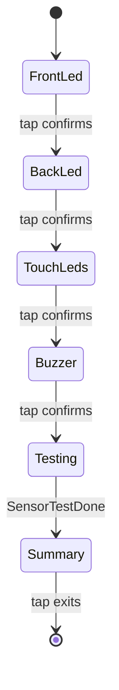

# Hardware Test

On-device diagnostics surface for AirGradient Go, reachable from
**Settings → Hardware Test**. It groups four operator-run flows behind one
submenu: a guided **Peripheral Test** (actuators then air-quality sensors), a
live **GPS Test**, a live **Accelerometer Test**, and an in-menu arm for the
existing **FG Learning** factory routine. `UIManager` stays hardware-free — it
renders the submenu and per-flow views from a pushed snapshot — while the
orchestrator owns every hardware side effect, the flow state machines, and the
buzzer / LED cues. All flows run in-app on already-initialised services; only
FG Learning leaves the app (writes factory state and reboots).

## Files

| File | Purpose |
|---|---|
| `products/go/main/go_ui.h` / `go_ui.cpp` | Submenu + per-flow screens, `UIAction` values, row population, dispatch, navigation (hardware-free) |
| `products/go/main/go_display.h` / `go_display.cpp` | `Screen` values + full-screen-list rendering for each test screen |
| `products/go/main/go_orchestrator.h` / `go_orchestrator.cpp` | Flow state machines, actuator drives, AQ trigger, GPS/accel polling, cues, FG-learning arm |
| `products/go/main/go_sensor_producer.h` / `go_sensor_producer.cpp` | `request_self_test()` — bulk AQ sweep in the producer task |
| `products/go/main/go_events.h` | `SensorTestResults`, `EventType::SensorTestDone` |
| `products/go/main/accel/` | LIS2DH12 accelerometer HAL + driver + pure sanity helpers |

## Dependencies

| Dependency | Source | Usage |
|---|---|---|
| `UIManager` | `go_ui.h` | Submenu navigation, per-flow view rendering, `UIAction` emission |
| `DisplayService` | `go_display.h` | Full-screen list renderer for every test screen |
| `LedService` | `led/go_led.h` | Actuator drives + PASS/FAIL colour cues; restored on exit |
| `BuzzerService` | `buzzer/go_buzzer.h` | Actuator tone + success/alert cues |
| `SensorProducer` | `go_sensor_producer.h` | `request_self_test()` runs the AQ sweep as the single I2C bus owner |
| `GpsService` | `gps/gps_service.h` | Ungates the receiver + fast posting for the live GPS screen |
| `AccelSensor` (LIS2DH12) | `accel/accel_sensor.h` | Live X/Y/Z + WHO_AM_I; created via `GoBoard::new_accel_sensor()` |
| `accel_sanity.h` | `accel/accel_sanity.h` | Pure identity + rest-magnitude classification |
| `ConfigStore` | `airgradient-config` | FG Learning writes `FactorySettings` before reboot |

## Public API

The surface is driven by `UIAction` values that `UIManager` emits and the
orchestrator consumes. Opening the submenu is internal navigation
(`open_hardware_test()`); it emits no action.

| `UIAction` | Emitted by | Orchestrator response |
|---|---|---|
| `RunPeripheralTest` | Peripheral Test row | `start_peripheral_test()` — drive first actuator |
| `PeripheralStepPass` / `PeripheralStepFail` | Actuator step Pass/Fail | `peripheral_step_result()` — record + advance |
| `PeripheralTestExit` | Summary tap | `finish_peripheral_test()` — restore hardware |
| `OpenGpsTest` | GPS Test row | `start_gps_test()` — ungate receiver, fast posting, TTFF timer |
| `OpenAccelTest` | Accel Test row | `start_accel_test()` — create driver, sample, classify, cue |
| `ArmFgLearning` | FG Learning confirm → Yes | Write `FactorySettings` + reboot into `FgLearningRunner` |

Cross-service hooks used by the flows:

| Method | Source | Purpose |
|---|---|---|
| `SensorProducer::request_self_test()` | `go_sensor_producer.h` | Kick the AQ sweep; posts one `SensorTestDone` |
| `GoBoard::new_accel_sensor()` | `go_board.h` | Create + init the LIS2DH12 on the shared I2C bus; `nullptr` when absent |

See [`go_ui.h`](../main/go_ui.h) and [`go_orchestrator.h`](../main/go_orchestrator.h)
for full signatures.

## Behavior

### Navigation

The **Hardware Test** row is the last Settings content row (mirrors
**Setup Guide**) and opens `Screen::HardwareTest`. The submenu rows, in order:

```text
Exit(0)  Back(1)  Peripheral Test(2)  GPS Test(3)  Accel Test(4)  FG Learning(5)
```

Exit returns Home; Back returns to Settings on the Hardware Test row. Each live
screen exits back to the submenu on **any tap**, a **double-press Back**, or a
**long-press Home** — the orchestrator snapshots `current_screen()` around
`UIManager::handle_input()` and runs the flow's `finish_*` when the screen
leaves, so no dedicated exit action is needed.

### Peripheral Test

Operator-guided actuator steps (tap **Pass**, or toggle + tap **Fail**) run
first, then the automatic AQ sweep, then a summary. Overall pass requires all
four actuators **and** all five sensors.



The AQ sweep runs **inside the sensor producer task** (the normal I2C bus owner)
via `request_self_test()`: a single `start_measures(1, All)` iteration classified
per Go sensor role by field validity, posted back as one `SensorTestDone` event
carrying `SensorTestResults`. The summary cue fires on the overall result —
**PASS**: green back LED + `PATTERN_CHARGE_DONE`; **FAIL**: red back LED +
`PATTERN_UNPLUG`. On exit the LED/buzzer are restored to persisted settings.

### GPS Test

`start_gps_test()` starts a TTFF timer from screen entry, ungates the receiver
if settings leave GPS inactive, and speeds posting to 1 Hz. Refresh is
event-driven: `on_gps_fix()` re-renders on each `GpsFixUpdate` while the screen
is open. TTFF latches on the first valid fix and freezes; a green breathing back
LED marks the fix. The screen shows TTFF (`mm:ss`), fix type, satellites, HDOP,
latitude/longitude, and UTC. On exit the posting cadence and back LED are
restored, and the receiver is stopped only if the test ungated it.

A cloud Fetch response can set `gpsTestRequested: true` to open this screen
without manual Settings navigation. The orchestrator handles it after the CO2
calibration and LED-test action flags from the same response. It ignores the
request while the Peripheral or Accelerometer test is active and treats it as a
no-op when the GPS Test screen is already open.

See [`gps_service.md`](gps_service.md) for the receiver lifecycle.

### Accelerometer Test

`start_accel_test()` lazily creates the LIS2DH12 (kept for the process lifetime),
takes one sample, classifies it, and fires a one-shot cue. A 500 ms poll from
`check_timers()` refreshes the live X/Y/Z while the screen is open (no re-cue).

```text
WHO_AM_I -> read X/Y/Z -> rest-magnitude (~1 g) -> classify
```

Overall **PASS** requires all three of: identity matches (`WHO_AM_I == 0x33`),
the read succeeded, and the vector magnitude is within the at-rest band
**850–1150 mg** (1 g ± 150 mg). Identity + magnitude classification live in the
pure, host-tested `accel_sanity.h`. The one-shot cue mirrors the peripheral
summary (PASS: green + `PATTERN_CHARGE_DONE`; FAIL: red + `PATTERN_UNPLUG`); the
back LED and buzzer are restored on exit.

The screen shows `WHO_AM_I` (OK/BAD), X/Y/Z (mg), `|a|` (mg), and Result.

### FG Learning Arm

The FG Learning row is a destructive action guarded by the shared `Confirm`
screen ("Start FG Learning?"). On **Yes** the orchestrator writes
`FactorySettings{ fg_learning_stage = Charge, cycle = 1, itpor_losses = 0 }` and
reboots; the next boot routes into the existing `FgLearningRunner` unchanged.
This supplements — does not replace — the manufacturing-mode BOOT gesture.

See [`fg_learning.md`](fg_learning.md) for the runner.

## Edge Cases / Errors

- **Absent accelerometer.** `new_accel_sensor()` returns `nullptr` on init
  failure (absent / wrong device / bus error). The screen then shows
  `WHO_AM_I: 0x00 (BAD)`, `X/Y/Z/|a|: --`, `Result: FAIL`, with the alert cue.
  Entry re-probes each time, so a late/intermittent part is picked up on a later
  entry.
- **Live accel re-classification.** The magnitude check assumes the device is at
  rest, so moving it during the test can flip Result PASS↔FAIL on the next poll.
  The buzzer/LED cue fires only once (on entry); later polls refresh the screen
  only.
- **AQ warm-up.** SGP41 (TVOC/NOx) and CO2 may read invalid until conditioned,
  so a still-warming unit can report those roles as FAIL in the summary.
- **GPS already active.** In `AlwaysOn` mode the receiver is left running on exit
  and TTFF reads ~0 (entry-relative, and the receiver was already fixed).
- **Mid-flow exit.** Any exit gesture that bypasses a flow's on-screen control
  (double-press Back, long-press Home) still restores hardware: the orchestrator
  detects the screen transition and runs the matching `finish_*`.
- **Inert actuators.** On board variants without an LED/buzzer driver the cues
  are silent by design; the display still reports the result.
- **Auto-lock suppressed.** The inactivity auto-lock is disabled on every
  Hardware Test screen (submenu and live flows), so an idle operator is never
  locked and returned Home mid-test. Auto-lock resumes once the surface is
  exited.
