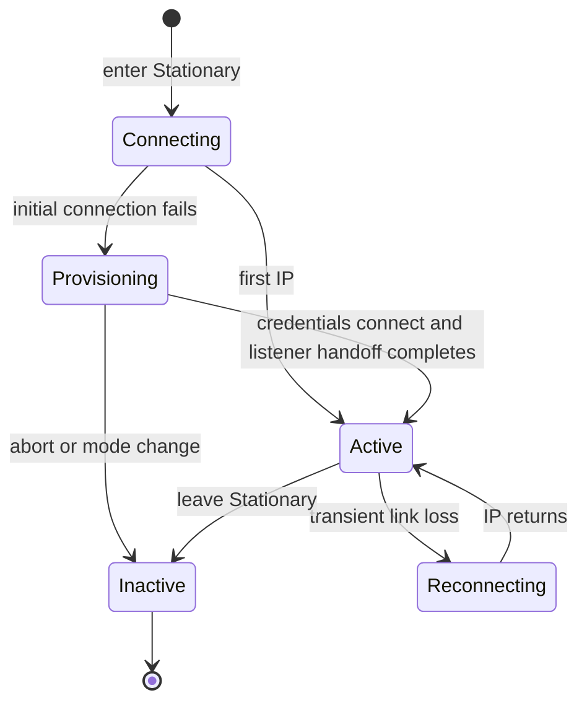

# Local Server

The AirGradient Go firmware source integrates the versioned Local Server API
for connected Stationary sessions. HTTP handlers run on the shared HTTP server
task, while the Go orchestrator owns snapshots, configuration persistence,
runtime activation, actions, Wi-Fi lifecycle, and discovery. The integration is
experimental; physical-device and external-client validation remains
incomplete.

## Files

| File | Purpose |
|---|---|
| `products/go/main/go_local_api.h` | Product providers, snapshots, access state, and fixed request FIFO |
| `products/go/main/go_local_api.cpp` | Go measures/config mapping, validation, admission, and queue signaling |
| `components/airgradient-common/include/retained_uptime.h`, `retained_uptime.cpp` | Shared RTC-retained monotonic uptime calculation |
| `products/go/main/go_orchestrator.h` | Local endpoint state, retry deadline, and orchestration declarations |
| `products/go/main/go_orchestrator.cpp` | Request processing, persistence, OTA policy, and Stationary lifecycle |
| `products/go/main/go_wifi.h` | Shared listener and local mDNS lifecycle API |
| `products/go/main/go_wifi.cpp` | Provisioning handoff, route/listener ownership, and mDNS profile wiring |
| `products/go/tests/go_local_api.tests.cpp` | Host tests for mappings, policy, snapshots, FIFO, and queue epochs |
| `products/go/tests/local-server-integration/` | Hardware integration test collection for the HTTP and mDNS contract |

## Dependencies

| Dependency | Source | Usage |
|---|---|---|
| `LocalServer` | [`airgradient-local-server`](../../../components/airgradient-local-server/README.md) | Versioned routes, JSON schema, parsing, serialization, and structured errors |
| `HttpServer` | `airgradient-http-server` (`hal/http_server.h`) | Shared port 80 listener used by provisioning and the local API |
| `WifiManager` | `airgradient-wifi` (`services/wifi_manager.h`) | Stationary connectivity and `_airgradient._tcp` mDNS lifecycle |
| `GoSettings`, `ConfigStore` | product (`go_settings.h`) | Authoritative configuration, validation, and persistence |
| `SensorProducer` | product (`go_sensor_producer.h`) | Asynchronous CO2 calibration execution |
| `retained_uptime` | `airgradient-common` (`retained_uptime.h`) | Completed-minute uptime for system information |
| `RTOS` | `airgradient-common` (`rtos.h`) | Snapshot mutex, event queue, lifecycle timers, and retained clock abstraction |

## Public API

`GoLocalApiService` implements the three provider interfaces consumed by
`LocalServer`. The orchestrator and `WifiService` drive the remaining methods.

| Method | Returns | Purpose |
|---|---|---|
| `GoLocalApiService(queue, config)` | Constructor | Capture the event queue and process-lifetime identity |
| `is_valid()` | `bool` | Report whether queue and synchronization dependencies are usable |
| `get_measures()`, `get_system_info()` | Value snapshots | Supply thread-safe GET measures data |
| `get_config()` | `LocalServerConfig` | Supply the active five-key Go config snapshot |
| `submit_config(partial)` | `ConfigSubmitResult` | Validate and admit a non-blocking config request |
| `trigger(action)` | `ActionResult` | Admit a fire-and-forget action request |
| `publish_measurement_snapshot(...)` | `void` | Publish corrected common measures |
| `publish_config_snapshot(settings)` | `void` | Publish active supported configuration |
| `publish_wifi_rssi(rssi)` | `void` | Publish or omit the online RSSI sample |
| `set_access(access)`, `access()` | `void`, `ConfigAccess` | Gate writes/actions or expose cached GET data during OTA |
| `pop_request(epoch, request)` | `bool` | Pop one request only for the current queue generation |
| `clear_requests()`, `queue_epoch()` | `size_t`, `uint32_t` | Discard queued work and inspect the generation |

See [`go_local_api.h`](../main/go_local_api.h) for full signatures.

## Behavior

### Availability and Discovery

The endpoint exists only while Go is in Stationary mode and has reached its
first successful IP connection. Portable and Offline modes do not expose it.
The Go configuration uses plain HTTP on `CONFIG_AG_HTTP_PORT`, currently port
80, and advertises this profile after the HTTP routes are reachable:

| Property | Value |
|---|---|
| Hostname | `airgradient_<serial>.local` |
| Service | `_airgradient._tcp` |
| Port | `80` |
| TXT `vendor` | `AirGradient` |
| TXT `model` | `P-1PSG` |
| TXT `serialno` | Same value as `serialNumber` in measures |
| TXT `fw_ver` | Same value as `firmware` in measures |
| TXT `api` | `1` |

### Routes and Statuses

The Go integration registers exactly these routes:

| Method | Route | Success | Other Handler Statuses |
|---|---|---:|---|
| `GET` | `/api/v1/measures` | `200` JSON | `500` if serialization fails |
| `GET` | `/api/v1/config` | `200` JSON | `500` if serialization fails |
| `PUT` | `/api/v1/config` | Empty `202` | `400`, `403`, `404`, `503`, `500` |
| `POST` | `/api/v1/actions/calibrate-co2` | Empty `200` | `403`, `503` |
| `POST` | `/api/v1/actions/test-leds` | None | `404` normally, `403` during read-only access, or `503` on lock failure |

Errors produced by these handlers use an `application/json` envelope with
`error.code`, optional `error.field`, and `error.message`:

| Status | Code | Meaning |
|---:|---|---|
| `400` | `invalid_body` | Empty, incomplete, malformed, non-object, or trailing request body |
| `400` | `unknown_field` | Unknown top-level or nested config key |
| `400` | `invalid_value` | Invalid type, enum, correction, or merged Go setting |
| `403` | `forbidden` | Endpoint access or configuration source policy rejects the request |
| `404` | `not_found` | A known catalog field or action is unsupported by Go |
| `503` | `busy` | The local FIFO or central event queue cannot admit work |
| `500` | `internal` | Provider or serialization failure |

Successful writes and actions have no body. A `503` response has no
`Retry-After` header. Routes outside the registered catalog use the underlying
HTTP server's default `404`, not the Local Server structured error envelope.

### Measures

`GET /api/v1/measures` reads a mutex-protected snapshot of the orchestrator's
latest corrected measures. The required fields are `serialNumber`, `model`,
`firmware`, and `boot`. `wifiRssi` is present only while Stationary Wi-Fi is
online.

`boot` is computed when system information is requested. It is retained
monotonic uptime floored to completed minutes: `0` throughout the first minute,
then `1` at 60,000 ms. Deep-sleep time counts because both the session start and
ESP32-C5 retained clock continue across deep sleep. Power-on, software, OTA,
panic, watchdog, brownout, and other non-deep-sleep resets start a new session.
The value advances without measurements and saturates at `UINT32_MAX`. Local
Server and cloud POSTs both consume the shared, transport-independent
`retained_uptime` utility; BLE can reuse it later.

The optional sensor fields are `co2`, `pm01`, `pm25`, `pm10`, `pm003Count`,
`pm005Count`, `pm01Count`, `pm02Count`, `pm50Count`, `pm10Count`, `temp`,
`humidity`, `tvocIndex`, `tvocRaw`, `noxIndex`, `noxRaw`, `battPercent`,
`battVolt`, and `chargeVolt`. Particle counts and `battPercent` are integers;
the two voltage fields use two decimal places. `battPercent` uses the fuel gauge
when available, with the charger voltage-curve estimate as fallback. `chargeVolt`
is measured input/VBUS voltage, not a charging-state indicator.

Each field passes its field-specific validator before serialization; invalid
fields are omitted rather than emitted as JSON `null`. `temp` remains Celsius
regardless of the configured display temperature unit. Corrections are applied
before the Go common-measures snapshot is published, so local clients receive
the corrected PM2.5, temperature, and humidity view rather than the raw cloud,
storage, and BLE view.

### Configuration

`GET` always emits Go's complete supported subset, and `PUT` accepts partial
objects from the same subset:

| Field | Values | Go Behavior |
|---|---|---|
| `pmStandard` | `ugm3`, `us-aqi` | Select mass concentration or US AQI presentation |
| `temperatureUnit` | `c`, `f` | Select product display temperature unit |
| `cloudConnection` | Boolean | Inverse of the product `disable_cloud` setting |
| `configurationControl` | `cloud`, `local`, `both` | Arbitrate Local Server PUT and Cloud Fetch sources |
| `co2AbcDays` | Integer `-1` or 1 .. 200 | Set the automatic background calibration period for the supported CO2 sensor. `-1` disables it; positive values are converted to hours. |
| `tvocLearningOffset` | Integer 1 .. 1000 | Set the SGP41 VOC gas-index learning-time offset in whole hours. |
| `noxLearningOffset` | Integer 1 .. 1000 | Set the SGP41 NOx gas-index learning-time offset in whole hours. |
| `corrections` | Object | Configure `pm25`, `temp`, and `humidity` correction entries |

Go accepts `none`, `epa_2021`, and `custom_via_pm25_raw` for PM2.5. Temperature
and humidity accept `none` and `custom`. Custom entries require finite
`intercept` and `scalingFactor` values; PM2.5 also requires `useEpa2021`.
Partial correction objects preserve omitted active siblings. Other known v1
catalog fields are omitted from GET and return `404 not_found` on PUT when
endpoint and source policy otherwise permit the request.

The active source policy is:

| `configurationControl` | Local Server PUT | Cloud Fetch |
|---|---|---|
| `cloud` | Rejected, except an exact control-only change to `local` or `both` | Enabled |
| `local` | Enabled | Disabled before issuing the fetch |
| `both` | Enabled | Enabled |

BLE, UI, provisioning, factory, and system writes bypass this source gate but
still use complete-candidate validation and the common persistence path. A
candidate combining `configurationControl: cloud` with
`cloudConnection: false` is invalid. Setting `cloudConnection` false suppresses
subsequent cloud POST and Fetch attempts and automatic Stationary Wi-Fi OTA
without disabling the local endpoint. It does not cancel an in-flight cloud
request; a Fetch result can still apply if source policy permits it when
consumed.

PUT parsing is strict and completes before product policy checks. After
translation, config and action requests share one fixed four-entry FIFO. Each
entry posts one `LocalApiRequestReady` event carrying the FIFO epoch. A failed
central event-queue send rolls back the append. Queue saturation, event-queue
saturation, or an epoch change during admission returns `503 busy`. An empty
object is an accepted no-op and consumes no FIFO entry after the current access
and source gates pass.

`202 Accepted` means only that the validated update was admitted. The
orchestrator rechecks source policy, merges against the last active settings,
validates the complete candidate, persists and commits it, then asynchronously
requests a changed `co2AbcDays` setting from the sensor task and publishes new
snapshots. A later source-policy change, persistence failure, queue clear, or
superseding writer can prevent GET from converging. Sensor-application failure
does not roll back the persisted setting; the normal boot path retries it.
There is no request identifier, completion resource, correlation token, or
automatic retry. Clients that need confirmation poll `GET
/api/v1/config` against their own deadline.

### Actions

`POST /api/v1/actions/calibrate-co2` admits an action into the same four-entry
FIFO and returns empty `200` once the request is queued. The orchestrator later
calls `SensorProducer::request_co2_calibration()`. The HTTP response does not
mean that calibration started or succeeded.

The implemented action path has no shared busy coordinator across HTTP, BLE,
and UI, no cached CO2 capability gate, and no request/completion correlation. It
does not reject a duplicate merely because another channel has queued or
started a calibration. Sensor completion is handled separately by the existing
UI and BLE result path; no completion is returned to the HTTP client.

`POST /api/v1/actions/test-leds` is registered because it is part of the common
v1 catalog, but Go does not implement it. It returns structured `404 not_found`
during normal read/write access.

### Endpoint Lifecycle

When the first-IP `WifiConnected` event reaches the orchestrator, it registers
local routes, starts or confirms the shared listener, publishes RSSI, enables
read/write admission, and then starts local mDNS. Route registration or listener
startup failure rolls back the local routes and leaves access disabled. mDNS
failure leaves the reachable HTTP endpoint active. Either failure schedules
another activation attempt after `LOCAL_API_ACTIVATION_RETRY_MS`, which is 5
seconds. Ordinary Wi-Fi events use non-blocking central-queue sends and are not
retained, so queue saturation can skip this transition.

Provisioning exclusively owns its transport routes and the shared listener
while active. On a successful Stationary provisioning connection, the product
preserves the provisioning success response hold, stops provisioning without
stopping the HTTP listener, removes provisioning ownership, then registers the
local routes and starts local mDNS. BLE-only provisioning may not have started
the listener, so the same idempotent local activation path starts it when
needed.

After a Stationary session has been online, a transient disconnect does not
return to provisioning. It omits `wifiRssi`, retains local routes and the HTTP
listener, leaves admitted FIFO work intact, and requests a saved-network
reconnect after the configured 5-second delay. The request is a no-op for a
factory-fallback-only session with no saved networks. The `StaIpAuto` mDNS
profile follows the STA address lifecycle; reconnect reuses the local server and
starts mDNS again instead of rebuilding the route set.

Entering provisioning, leaving Stationary, and entering committed OTA clear the
mixed FIFO and increment its epoch. Stale central events therefore cannot pop
requests admitted in a later endpoint generation. Leaving Stationary also
disables admission, clears mDNS, stops the listener, and unregisters local
routes.

### OTA Behavior

A committed foreground Stationary Wi-Fi OTA changes existing read/write local
access to read-only and clears queued requests. An already-active listener and
local mDNS remain active while STA stays connected; an endpoint that was already
disabled remains disabled. When the endpoint is reachable during that interval:

| Request | Behavior |
|---|---|
| `GET /api/v1/measures` | `200` with the last cached measures snapshot |
| `GET /api/v1/config` | `200` with the last active config snapshot |
| Structurally valid config PUT | `403 forbidden` |
| Malformed config PUT | `400` parse error before OTA policy |
| Either registered action | `403 forbidden` before model support policy |

A non-rebooting OTA outcome restores the previous access state with an empty
FIFO. A successful OTA reboots.

### Trust Boundary

The endpoint is plain HTTP with no TLS, authentication, authorization, or CORS
policy. Any host that can reach the Stationary device on the local network can
read snapshots, attempt configuration changes allowed by
`configurationControl`, and dispatch supported actions. Deployment therefore
relies on a trusted and appropriately isolated LAN; the endpoint must not be
treated as safe for direct exposure to untrusted networks.

### External Client Follow-Ups

`python-airgradient` and Home Assistant require separate client-integration
follow-up work. Clients need to accept asynchronous `202`, treat `503 busy` as
temporary, poll GET for configuration convergence, and preserve compatibility
with existing device behavior. No external pull request or issue URLs are
recorded here; links should be added only when concrete follow-ups exist.

## Edge Cases / Errors

- Parsing precedes access policy, so malformed PUT remains `400` during OTA or
  while local writes are source-gated.
- Endpoint and source policy precede Go field/action support, so a valid but
  unsupported request can return `403` instead of `404` while read-only or
  source-gated.
- `202` and action `200` are admission responses. Post-admission drops and
  failures are visible only through lack of config convergence or separate
  product feedback.
- FIFO capacity is shared by config and action requests. The fifth outstanding
  mixed request returns `503 busy`, as does a central event-queue send failure.
- An mDNS start failure does not remove a reachable HTTP endpoint; the 5-second
  activation timer retries discovery setup.
- Transient disconnect does not clear accepted work, while committed OTA,
  provisioning entry, and Stationary exit do.
- GET serialization uses transient cJSON allocation in addition to the static
  Local Server response buffer. Hardware heap headroom has not been measured.

## Verification

The available evidence is limited to automated work completed at revision
`c17f2d3` and static collection of the hardware suite:

| Check | Evidence |
|---|---|
| Native host suite | `1240/1240` tests passed at `c17f2d3` |
| Go firmware build | Passed at `c17f2d3`; `0x1cfe30` bytes with `0x201d0` bytes (6%) app-partition headroom |
| Hardware integration suite | Pytest collects 24 tests |

The 24 hardware tests have not been run against a physical AirGradient Go.
There is no physical evidence for concurrent PUT behavior, provisioning
listener handoff, transient reconnect, mDNS lifecycle, Home Assistant
interoperability, or heap headroom during listener, local GET, cloud TLS, or OTA
activity.
