# Orchestrator

Central event loop for AirGradient Go. Consumes events from the shared queue,
manages application state (operating mode, behavior, lock/unlock), coordinates
all product services, handles timer-based periodic tasks, and controls the
sleep cycle.

## Files

| File | Purpose |
|---|---|
| `products/go/main/go_orchestrator.h` | `Orchestrator` class declaration, `Services` struct |
| `products/go/main/go_orchestrator.cpp` | Event loop, dispatch, state transitions, timer logic, sleep |

## Dependencies

| Dependency | Source | Usage |
|---|---|---|
| `SensorProducer` | product (`go_sensor_producer.h`) | Request measurement cycles |
| `GpsService` | product (`go_gps.h`) | Read latest GPS fix |
| `InputService` | product (`go_input.h`) | Started/stopped by orchestrator; posts `InputPress` events |
| `DisplayService` | product (`go_display.h`) | Render display frames |
| `StorageService` | product (`go_storage.h`) | Cache measurements, persist route data |
| `PowerService` | product (`go_power.h`) | BMS polling, sleep entry, RTC state, shutdown |
| `UIManager` | product (`go_ui.h`) | Screen navigation, input dispatch, display value building |
| `LedService` | product (`led/go_led.h`) | Front/back/touch LED brightness, AQI color, touch flash, animations |
| `BleService` | product (`go_ble.h`) | Portable BLE peripheral; initialised on Portable entry, torn down on leave |
| `WifiService` | product (`go_wifi.h`) | Stationary Wi-Fi lifecycle: saved-credentials connect, factory fallback, provisioning, disconnect routing |
| `GoLocalApiService` | product (`go_local_api.h`) | Cached local HTTP snapshots, request admission, and FIFO config/action handoff |
| `OtaService` | product (`go_ota.h`) | Per-mode OTA: BLE push (Portable) / WiFi pull (Stationary), driven blocking from the OTA poll |
| `GoBoard` | product (`go_board.h`) | Borrowed for `init_wifi_subsystem()` on first Stationary entry |
| `ConfigStore` | `airgradient-config` | Load/save `GoSettings` to NVS |
| `GoSettings` | product (`go_settings.h`) | Product configuration |
| `Event`, `EventType` | product (`go_events.h`) | Event queue types |
| `RtcAppState` | product (`go_types.h`) | State persisted across deep sleep |
| RTOS | `airgradient-common` | Queue receive, time query, delay |
| `format_ipv4_be` | `airgradient-common` (`common.h`) | Format the network-byte-order IPv4 for the bring-up "Connected!" page text |

## Public API

| Method | Returns | Purpose |
|---|---|---|
| `Orchestrator(queue, services, settings, store, serial)` | — | Construct with the event queue, all service references, a copy of `GoSettings`, the `ConfigStore`, and the serial number string |
| `init(cause, handoff = {})` | `void` | Restore RTC state, seed cached values from `BootHandoff`, set timer baselines, request first measurement, kick the display |
| `run()` | `void` (never returns) | Enter the event loop |

See [`go_orchestrator.h`](../main/go_orchestrator.h) for the full `Services`
struct and supporting types.

## Construction

The orchestrator is constructed by `GoApp` after all services are
initialized. It takes ownership of a copy of `GoSettings` and holds
references to all services via the `Services` aggregate (sensor producer,
GPS, input, display, LED, storage, power, UI manager, BLE service, Wi-Fi
service, board):

```cpp
Orchestrator::Services services{ /* service refs + board ref */ };
Orchestrator orchestrator(event_queue, services, settings, config_store, serial);

// Fresh boot (default BootHandoff):
orchestrator.init(cause);

// Button-wake path with handoff:
BootHandoff handoff{};
handoff.display_painted    = true;
handoff.initial_lock_state = LockState::Unlocked;
orchestrator.init(WakeCause::Button, handoff);

orchestrator.run();  // never returns
```

For the production wiring (boot path selection and orchestrator
construction), see [`go_app.cpp`](../main/go_app.cpp).

## `init()` — Boot Initialization

```cpp
void init(WakeCause cause, const BootHandoff &handoff = {});
```

`init()` is called once before `run()`. It restores persisted state, sets
timer baselines, requests the first measurement, and kicks the display.
The `BootHandoff` struct replaces the old `(bool already_painted,
const RtcDisplaySnapshot *snapshot)` parameters with explicit fields for
each dimension of boot state.

### RTC State Restoration

RTC state (`_behavior`, `_gps_enabled`, `_tracking_active`,
`_tracking_session_id`) is restored for all non-PowerOn wake causes:

```cpp
if (cause != WakeCause::PowerOn) {
    // Restore from RTC — both Timer and Button wakes have valid state
}
```

Previously, RTC state was only restored for `WakeCause::Button`. The
generalization is needed because fast-path promotion sends `WakeCause::Timer`
to the orchestrator, and the device was in a sleep cycle with persisted state.

### Lock State and Display

The orchestrator's initial lock state and display behavior are driven by
`BootHandoff` fields, not by wake-cause-specific branches:

**`initial_lock_state == Unlocked` + `display_painted == true`:**

The display already shows the correct unlocked UI. `init()` sets
`_lock_state = Unlocked` directly (bypasses `unlock()` to avoid a redundant
`update_display()`), arms the "Unlocked" snackbar timer, and sets
`_last_input_ms`.

**`initial_lock_state == Unlocked` + `display_painted == false`:**

The display hasn't been painted yet or shows stale content. `init()` calls
`unlock()` which triggers `update_display()` to paint the unlocked frame.

**`initial_lock_state == Locked` (default):**

No lock state change. Device stays locked.

**Cold-boot splash:**

When `GoApp` already painted `Screen::Info` with `Booting...` and the boot
handoff does not contain a completed measurement, `init()` arms
`_boot_splash_active`. The splash remains visible until the first
`SensorDataReady` event. If Stationary setup takes ownership of
`Screen::Info` before that event, the flag is cleared without resetting the
session page.

### Raw and Corrected Measures

The orchestrator keeps two `MeasuresAGo` snapshots:

- `_raw_measures` is authoritative and feeds cloud POSTs, RTC cache, and route files.
- `_corrected_measures` is derived for the display, charts, and PM AQI LED. BLE
  Measures and History use the raw values so clients can choose their own policy.

`init()` seeds `_raw_measures` from `fast_path_measures` when available and
derives `_corrected_measures`. A `display_snapshot` contains corrected display
state, so it can seed only `_corrected_measures`; raw cloud and storage state
remains at invalid sentinels until a fresh measurement arrives.

Chart samples are read from raw cache storage into a scratch buffer and corrected
before the UI builds chart values. A successful cloud correction update is
persisted before activation and immediately recomputes the current corrected
snapshot without rewriting raw storage.

### Measurement Completed

When `handoff.measurement_completed == true`, the orchestrator sets
`_first_measurement_done = true` and skips the initial measurement request.
This allows the sleep-too-short promotion case to immediately attempt sleep
on the next event loop iteration.

### Route Resumption

If `_tracking_active` is true after RTC state restoration, the orchestrator
calls `storage.resume_route(_tracking_session_id)` to reopen the route file
in append mode. The helper truncates any torn trailing record from a prior
boot before opening so the next append lands on a clean record boundary.

On a persistent NAND fault the call returns `false`; `init()` then clears
`_tracking_active` / `_tracking_session_id` and shows the
`"Tracking stopped — storage"` snackbar inline. BLE is not yet up at that
point in init(); the on-connect `update_status()` carries the same value, so
a late-joining client reads the post-failure state via the Status
characteristic without missing the transition.

### Fast-path storage-failure promotion

The fast path (`go_app.cpp`) uses `storage.resume_route()` only — it never
starts a new session because `state.tracking_active` is set exclusively by
the orchestrator's `prepare_for_sleep`. On `resume_route()` or
`append_route_point()` failure the fast path forces a promotion to
interactive mode rather than handling the failure itself: there is no UI or
BLE service active in the fast path to surface the error, and the
orchestrator's `init()` resume retry already handles persistent faults
through the same inline snackbar / BLE notify path described above.

The promotion handoff records the storage-failure reason so the orchestrator
knows the display block was skipped (`handoff.display_painted = false`) and
will paint the frame itself rather than assume the fast path already
painted a stale one.

### Mode Entry (Portable / Stationary)

After the common tail (sensor / BMS poll baselines), `init()` invokes
`init_ble_if_portable()` and — when `_settings.operating_mode ==
Stationary` — calls `enter_stationary()`. The two-phase
`change_mode()` ordering does not apply to cold boot because there is
no outgoing mode to tear down. Cold-boot Portable never calls
`_board.init_wifi_subsystem()`, so the Wi-Fi ESP-IDF stack stays
uninitialised for the lifetime of that boot.

## Application State

The orchestrator owns the authoritative application state:

| Field | Type | Default | Meaning |
|---|---|---|---|
| `_mode` | `OperatingMode` | `Portable` | Portable / Stationary / Offline |
| `_behavior` | `Behavior` | `Idle` | Tracking / Idle / Shutdown |
| `_lock_state` | `LockState` | `Locked` | Locked / Unlocked |
| `_gps_enabled` | `bool` | `true` | Whether GPS data is used (derived from `GpsMode` setting) |
| `_tracking_active` | `bool` | `false` | True while a route is being logged |
| `_tracking_session_id` | `uint32_t` | `0` | 5-digit session ID; 0 = no active session |
| `_provisioning_sensitive_services_paused` | `bool` | `false` | True while sensor producer / GPS / PM rail are paused for the active provisioning transport; gates sensor / BMS / PM / snackbar-refresh deadlines |
| `_local_api_activation_retry_deadline_ms` | `uint32_t` | `0` | Absolute 5 s retry deadline for local HTTP or mDNS activation; 0 when inactive |
| `_setup_session_active` | `bool` | `false` | True between Stationary setup entry (`Screen::Info` or pre-online `Screen::Provisioning`) and the leave-to-Home / leave-to-Portable boundary; gates power-button short-press, auto-lock, and background-render suppression |
| `_bring_up_pending` | `bool` | `false` | True while `Screen::Info` is showing the STA-attempt narration; lets `on_wifi_connected()` distinguish the on-Info success path from the post-online reconnect path |
| `_boot_splash_active` | `bool` | `false` | True while cold boot is showing `Booting...` on `Screen::Info`; cleared by first sensor data and suppresses ButtonPower short-press lock toggles |
| `_last_ota_check_ms` | `uint32_t` | `0` | Unified OTA poll-timer baseline: 2 s BLE `is_ble_active()` poll (Portable), 1 h WiFi check (Stationary). See [Firmware Update (OTA)](#firmware-update-ota) |
| `_ota_committed` | `bool` | `false` | True once a transfer committed (full quiesce + "Updating firmware…" paint ran). Gates `exit_ota()`'s full-resume + queue-drain vs the lightweight cloud re-arm |

On fresh boot (`PowerOn`), defaults are used. On wake from deep sleep (`Timer`
or `Button`), state is restored from RTC memory via
`PowerService::load_state()`.

## Event Loop

The `run()` method is an infinite loop using queue-timeout polling for timers:

1. **Sleep check** — when locked and the first measurement is done, attempt
   to enter deep sleep. Returns only when sleep conditions are not met (mode
   not Offline, or `sleep_ms < deep_sleep_threshold_ms`).
2. **Queue receive** — wait for the next event with a timeout computed from
   the nearest timer deadline.
3. **Dispatch** — route the event to its handler.
4. **Check timers** — fire any timer callbacks whose deadlines have elapsed.

## Timer Management

No dedicated timer tasks or callbacks. The orchestrator tracks deadlines
using `RTOS::get_time_ms()` and computes the queue-receive timeout from
the nearest deadline.

| Timer | Interval | Active When |
|---|---|---|
| PM pre-wake | `measure_interval - CONFIG_SENSOR_WARMUP_DURATION_MS` | Not Offline, interval ≥ `pm_sleep_threshold_ms`, prepare not yet sent, sensitive services not paused |
| Sensor (all groups) | `measure_interval_seconds * 1000` | Sensitive services not paused |
| BMS full poll | `BMS_POLL_INTERVAL_MS` (30000 ms) | Sensitive services not paused |
| BMS status poll | `BMS_STATUS_POLL_INTERVAL_MS` (5000 ms) | Sensitive services not paused |
| External watchdog | `EXT_WDT_INTERVAL_MS` (60000 ms) | Always — never suppressed during a setup session |
| Inactivity | `auto_lock_seconds * 1000` | Unlocked, auto-lock > 0, and no setup session active |
| Snackbar refresh | `SNACKBAR_DURATION_MS + 200` (one-shot) | Snackbar active, sensitive services not paused |
| Wi-Fi initial-connect / fallback | `WifiService::next_deadline_ms()` | While the service has armed a deadline (Stationary bring-up) |
| Local endpoint activation retry | `LOCAL_API_ACTIVATION_RETRY_MS` (5000 ms) | Stationary + online after local HTTP or mDNS activation fails |
| OTA poll | `OTA_BLE_POLL_INTERVAL_MS` (2000 ms) / `OTA_WIFI_CHECK_INTERVAL_MS` (3600000 ms) | Portable + (authenticated client or latched `is_ble_active()`); or Stationary + online + no setup session + cloud enabled. See [Firmware Update (OTA)](#firmware-update-ota) |

The BMS status poll (`on_bms_status_timer()`) is the fast charging-state check
between full polls. On a charging-state transition (plug in, unplug, charge
complete — a change in `is_bms_charging()` or the BMS power source) it refreshes
the display and, when a BLE client is connected, pushes a `{charging, bat_pct,
bat_v}` Status delta via `notify_charging_status()` so the app reflects the
change without polling. The other slow Status fields stay Read-only. See
[`ble_service.md`](ble_service.md) for the delta shapes.

`compute_queue_timeout_ms()` returns the minimum remaining time across all
active timers, clamped to 0 when any deadline has already passed (unsigned
subtraction wraps to a large value). `check_timers()` finally calls
`_svc.wifi.tick(now)` to clear an expired-by-IP deadline latch or
synthesize a `WifiDisconnected{connection_lost}` when the bring-up
window expires without an IP. The external watchdog is intentionally
**not** suppressed during the session — without it, every other timer
being gated could leave `next == UINT32_MAX` and busy-spin the event
loop.

## Event Dispatch

Events are dispatched by type:

| EventType | Handler |
|---|---|
| `SensorDataReady` | `on_sensor_data()` — cache, update back AQI LEDs (`back_update_aqi` / `back_clear_aqi`), clear cold-boot splash if active, log full `MeasuresAGo` snapshot, store route point if tracking, update BLE measures, update display |
| `GpsFixUpdate` | `on_gps_fix()` — cache GPS if `is_gps_active()` |
| `InputPress` | `on_input()` — touch flash on touch events, shutdown, lock/unlock, forward to UIManager |
| `UserStartTracking` | `start_tracking()` |
| `UserStopTracking` | `stop_tracking()` |
| `UserChangeMode` | `change_mode()` |
| `UserToggleGps` | Set `_gps_enabled` |
| `SettingsChanged` | `apply_settings_change()` |
| `ClearData` | `clear_data()` |
| `SaveTag` | `save_tag()` |
| `InactivityTimeout` | `on_inactivity_timeout()` → `lock()` |
| `MeasurementTimer` | `check_timers()` (legacy event, re-checks all timers) |
| `WakeFromSleep` | No-op (handled in `init()`) |
| `BleConnected` | Push current measures/status/config, dismiss passkey overlay |
| `BleDisconnected` | Dismiss passkey overlay |
| `BleConfigWrite` | Decode config/command write and apply it |
| `BleHistoryWrite` | Decode history export request and delegate to BLE service |
| `BlePairingRequest` | Show passkey overlay |
| `BleAuthComplete` | On success (encrypted): mark onboarding done, dismiss overlay / leave setup session to Home. On failure: leave onboarding untouched; setup session returns to `Screen::GettingStarted` (stays active for retry), else dismiss to Home |
| `Co2CalibrationDone` | Show result snackbar, notify BLE command result, update display |
| `WifiConnected` | `on_wifi_connected()` — bring-up success (`Connected!\n<ip>` on Info then leave to Home), or post-online reconnect snackbar on Home; applies the persisted Stationary POST interval, then unconditionally `cloud.start()` + `cloud.arm()` |
| `WifiDisconnected` | `on_wifi_disconnected()` — `cloud.disarm()` then disconnect-policy router. Before first online, connectivity failures open provisioning; after first online, every reason except `requested_by_user` requests reconnect. |
| `ProvisioningStateChanged` | `on_provisioning_state_changed()` — update Provisioning page state, persist connectivity metadata (coercing `Cloud` control to `Local` when cloud is disabled), hand the listener to the local endpoint, apply the persisted Stationary POST interval, then start/arm cloud; fall back to Portable on `Stopped` without prior online |
| `PostMeasuresResult` | Log-only (result code) |
| `FetchConfigResult` | Recheck cloud authority, merge supported scalar/correction fields, commit and activate the candidate, then asynchronously request changed CO2 ABC periods or TVOC/NOx learning offsets through `SensorProducer` |
| `LocalApiRequestReady` | Pop one epoch-matched local FIFO entry; apply its config update or request CO2 calibration |

## Input Handling

`on_input()` processes input events with priority:

1. **Long press ButtonPower** — `shutdown()` with default reason (any lock
   state). Releasing after the long press powers off; holding the button
   through ship mode re-wakes the BQ25629 via `/QON` and cold-boots the
   device (battery-only hold-to-restart) — see
   [Power Management](power_management.md)
2. **Long press ButtonBoot** — `factory_reset()`, then reboot on success
3. **Short press ButtonBoot while `_manufacturing_mode`** (the _second_
   press) — arm a fuel-gauge learning run: `save_factory_settings(Charge,
   cycle 1)` then reboot. The next boot routes into the dedicated factory
   path. This is the orchestrator's **only** learning touch point — no tick,
   resume, verify, ship hook, or dashboard. See [`fg_learning.md`](fg_learning.md)
4. **Short press ButtonBoot while `!onboarding_done`** —
    `enter_manufacturing_mode()`: skip the Getting Started guide and enter
    Stationary ephemerally (`change_mode(Stationary, persist=false)`), so
    production can test a fresh unit without latching `onboarding_done`.
    Sets `_manufacturing_mode`, which preserves active measurement corrections
    but clears all other Go settings, routes, and Wi-Fi credentials at
    `shutdown()`. BLE bond deletion is a safe no-op after Stationary has torn
    down the BLE host. Nothing else is persisted, so a reboot also returns to
    fresh onboarding
5. **Short press ButtonPower while `_setup_session_active` or
   `_boot_splash_active`** — suppressed (no lock toggle); the setup
   instructions or cold-boot splash stay visible
6. **Short press ButtonPower** — toggle lock/unlock
7. **Locked** — touch shows "Unlock First" snackbar; other inputs ignored
8. **Unlocked** — forward to `UIManager::handle_input()`, then handle the
    returned `UIActionResult` (start/stop tracking, change mode,
    provisioning confirm-switch / confirm-cancel, etc.)

The catch-all render at the tail of `on_input()` uses
`update_display(/*wait=*/true)` for every input-driven render. Because
`handle_input()` already advanced the UI model, a dropped paint would
leave the model ahead of the screen with no repaint until the next
input (the user sees the touch register but the display stays put). This
became reachable once the display worker's `BUSY` poll started blocking
(`vTaskDelay >= 1` tick) instead of busy-spinning: the priority-1 main
task now runs during the worker's refresh and would otherwise hit the
`wait=false` drop in `DisplayService::update()` while the worker is
mid-paint. `wait=true` yields to the worker, then queues the latest
frame once it is free, so menu navigation and session transitions are
both drop-free.

The `UIAction::ConfirmSwitchProvisioningTransport` case is handled
inside the dispatch switch and returns early, bypassing the catch-all
render. The case body latches `ProvisioningUiState::SwitchingTransport`,
runs `update_display(wait=true) + DisplayService::flush()` so the
"Switching to ..." ack is painted before the transport flips, then
calls `_svc.wifi.switch_provisioning_transport()`.

## State Transitions

### lock()

Sets `LockState::Locked`, resets UI to home screen, updates display. Sleep
eligibility is evaluated on the next main loop iteration.

### unlock()

Sets `LockState::Unlocked`, resets the inactivity timer, requests a quick
single-iteration measurement, and updates the display.

### start_tracking() / stop_tracking()

Manages route lifecycle through `StorageService`. `start_tracking()`
returns `bool` so the BLE `StartTracking` command-result reports the real
outcome instead of the pre-spec "was-idle" heuristic.

`start_tracking()`:

1. Returns `false` immediately if `_tracking_active` is already true.
2. Generates a 5-digit session ID (10000–99999) via `generate_session_id()`,
   which probes each random candidate against
   `storage.route_file_exists()` and retries up to 5 times on collision.
   At ~1000 stored sessions the all-five-collide probability is on the
   order of `1.7×10⁻¹⁰`; on exhaustion the helper returns 0.
3. Calls `storage.create_route(session_id)`. On `session_id == 0` or
   open-failure, shows the `"Storage error — can't track"` snackbar
   inline, pushes a BLE Status notify with `tracking=false`, and returns
   `false` without touching `_tracking_active` or `_behavior`.
4. On success sets `_tracking_active = true`, `_behavior = Tracking`,
   brings up GPS if the `GpsMode` requires it, shows the
   `"Tracking start = NNNNN"` snackbar, and pushes a BLE Status notify
   with `tracking=true`.

`stop_tracking()` runs the symmetric teardown: `end_route()` on the
storage, clear tracking state, deactivate GPS if no longer needed,
`"Tracking stop = NNNNN"` snackbar, and a BLE Status notify with
`tracking=false`. It stays `void` — a best-effort `end_route()` cannot
fail in a way the phone needs to know about.

The "actually recording" state is derived, not stored:

```cpp
bool Orchestrator::is_recording() const {
    return _tracking_active && _svc.storage_service.is_route_active();
}
```

All BLE Status writes (set-value and notify) pass `is_recording()` so the
wire never reports tracking when no file is actually open.

`on_sensor_data()` calls `storage.append_route_point()` but discards the
return — the storage layer logs the underlying error, and the session
keeps running so subsequent appends can retry against a recovered NAND.
The session ends only on manual `stop_tracking()`, deep sleep, or a
fresh failure of `resume_route()` on the next wake.

### change_mode()

Updates `_mode`, persists it to NVS, and syncs `UIManager` so the
Settings menu reflects the new mode. Tears down the outgoing radio
(BLE for Portable, Wi-Fi via `WifiService::shutdown()` for Stationary)
and brings up the incoming radio (`init_ble_if_portable()` on entry to
Portable, `enter_stationary()` on entry to Stationary). The PM bus is
re-connected and the sensor woken (`set_pm_power(true)` + `request_prepare()`)
before any mode-specific entry so a previous session that slept the SPS30
does not leave it asleep across the transition.

The Stationary entry branch returns before the generic
`"Mode changed"` snackbar fires — `enter_stationary()` opens
`Screen::Info` with the attempt-specific text and runs its own
`update_display(wait=true)`. Mode changes to Portable / Offline keep
the snackbar + display update.

**BLE disconnect notice before teardown.** When leaving Portable with a BLE
client connected, `change_mode()` first pushes a `disc` Status notice
(`notify_disconnect()` — `op_stationary` or `op_offline`) and then waits
`BLE_MODE_CHANGE_NOTIFY_SETTLE_MS` (200 ms) before `ble_service.deinit()`.
Notifications are fire-and-forget (no completion signal), so the settle gives
the queued notice a few connection intervals to drain to the client before the
link drops. The wait is gated on `is_connected()`, so disconnected and
non-Portable transitions add no delay. Because `change_mode()` is the single
choke point for every leave-Portable path (`UserChangeMode` event, the Settings
menu `UIAction::ChangeMode`, and the BLE config-set), device- and BLE-initiated
mode changes behave identically. An `op_mode` change produces **no** Config
delta — the BLE config-set path skips its own `notify_config()` when the write
changes `op_mode` and lets `change_mode()` announce the drop via `disc`.
Delivery stays best-effort — the client treats the resulting disconnect as
confirmation of the switch. `shutdown()` uses the same `disc` mechanism (see
[shutdown(reason)](#shutdownreason)).

**OTA teardown on leave-Portable.** Before `ble_service.deinit()`, the
leave-Portable branch clears the OTA disconnect observer
(`set_disconnect_observer(nullptr)`) and calls `ota.teardown_ble()` so neither
the observer nor the OTA GATT registration outlives the released server.
`teardown_ble()` is idempotent and a no-op when no OTA service was registered.
A WiFi OTA check can never be in flight at the moment of leaving Stationary —
the leave handler only runs when the loop is not blocked. See
[Firmware Update (OTA)](#firmware-update-ota).

### apply_settings_change()

Called when the UI signals a setting was changed. Calls
`UIManager::apply_to_settings()` to convert internal option indices back to
`GoSettings` fields, persists to NVS via `save_go_settings()`, and
propagates runtime changes (GPS posting interval, GPS enabled flag, sensor
timer rescheduling).

### clear_data()

Stops tracking if active, clears the temporary RTC-backed chart cache,
deletes all persisted route files from NAND, refreshes BLE status when a
client is connected, shows a snackbar, and returns success/failure.

### factory_reset()

Calls `clear_data()`, writes default `GoSettings` to NVS (which zeros
`disable_cloud` and `static_ip`), calls `WifiService::clear_credentials()`
to erase all saved networks and reset online latches,
deletes all stored BLE bonds, resets runtime state back to Portable + Idle +
Locked, updates the display, and returns success/failure. Explicit factory reset
uses the full default settings, including no measurement corrections. When
manufacturing mode is active, factory reset instead retains the active
correction set. Bond deletion is a safe no-op after Stationary has torn down
the Go BLE service. The caller reboots the ESP on success.

### shutdown(reason)

Unified shutdown pipeline for all shutdown paths. Takes an optional
`ShipModeRequest` reason (default `None` for user-initiated shutdown):

1. If a BLE client is connected, push a `disc` Status notice
   (`notify_disconnect()` — `overheat` / `low_batt` / `user`) so the client knows
   the link is about to drop. Sent early so it drains before power is cut.
2. Show the reason-specific shutdown screen — all variants share the
   same unified template (brand header + icon + title/action/detail):
   `Screen::ShutdownDischarge` for `OverDischarge`,
   `Screen::ShutdownTemperature` for `OverTemperature`,
   `Screen::ShutdownUser` for user-initiated long-press
3. Queue the shutdown frame with `update_display(wait=true)` and
   `DisplayService::flush()` so the e-paper paint is complete before continuing
4. Persist state: stop tracking if active, backup chart cache
5. Disable peripherals: `set_pm_power(false)`, GPS stop (TODO)
6. Slow down before power cut (`SHUTDOWN_POWER_OFF_SETTLE_MS`, 500 ms) so the
   painted reason screen remains visible and the `disc` notice can drain
7. `PowerService::shutdown()` — BMS ship mode → deep sleep fallback

Safety trips (EDV/OT) are detected by `poll_bms()` and signalled via
`PowerSnapshot::ship_mode_request`. The orchestrator checks this field
in `on_bms_timer()` and routes to `shutdown(reason)`. The `disc` notice is
the safety/user-shutdown counterpart of the leave-Portable notice in
[`change_mode()`](#change_mode).

## Stationary Networking

Stationary mode brings up Wi-Fi via `WifiService` and runs the on-device
setup session (`Screen::Info` → `Screen::Provisioning` →
`Screen::ProvisioningConfirm`). The orchestrator owns the mode policy,
the session UI lifecycle, the disconnect-policy router, and the
service-pause / clock-rebase machinery. It also owns local API admission and
application-side request dispatch; `WifiService` owns the listener, routes,
mDNS, and radio mechanics. See [`wifi_service.md`](wifi_service.md) for the
network-side contract.

### Local API Integration

`GoApp` constructs `GoLocalApiService` as the `LocalServer` measures, config,
and action provider. The service returns mutex-protected orchestrator snapshots
and reads the shared `airgradient-common` retained uptime utility when system
information is requested:

- `init()` publishes the active settings, corrected measurement view, and an
  absent Wi-Fi RSSI.
- Every `SensorDataReady` publishes the new corrected measurement snapshot.
  Measurements do not affect uptime. Cloud, storage, and BLE continue to
  receive raw measurements.
- `get_system_info()` reads the retained uptime independently of snapshot
  publication, measurement validity, and correction reapplication.
- Every activated settings candidate republishes config and measurements, so a
  correction change immediately updates both local GET resources.
- Local endpoint activation and reconnect publish the current RSSI. Disconnect,
  factory reset, and Stationary teardown clear it.

Config PUTs containing an actual setting update and supported actions cross into
the orchestrator through a four-entry FIFO. Effect-free config partials are
accepted without queue admission. For queued work, the HTTP task validates and
appends one `LocalApiRequest`, then posts one non-blocking
`LocalApiRequestReady` event containing the queue epoch. A failed central queue
send rolls the append back and returns busy. The orchestrator pops one FIFO item
for each matching event. Clearing the FIFO increments its epoch, so stale events
already in the central queue become no-ops.

`configuration_control` is checked both when a local config request is admitted
and when the orchestrator consumes it. `Cloud` rejects local changes except an
exact control-only recovery to `Local` or `Both`; `Local` and `Both` accept
normal local updates. The second check prevents an already-queued request from
crossing a newer authority change. Accepted candidates are fully validated and
committed to NVS before runtime state and snapshots change. CO2 actions use the
same FIFO but have no calibration busy or duplicate gate; the final result is
determined asynchronously by `SensorProducer`.

| Lifecycle Point | Local Endpoint Behavior |
|---|---|
| Enter Stationary | Set API access to `Disabled`; no listener exists before an IP transition |
| Direct STA got-IP | Register local routes, start/retain the listener, publish RSSI, set `ReadWrite`, then start mDNS |
| Enter provisioning | Disable admission, clear queued local requests, and let `WifiService` release the local endpoint before provisioning takes the shared listener |
| Provisioning `Connected` | Stop provisioning without stopping the listener, install local routes, enable admission, and start local mDNS before leaving the setup session |
| Runtime disconnect | Cancel activation retry and clear RSSI, but retain routes, listener, admission, and request epoch for reconnect |
| Runtime reconnect | Idempotently ensure HTTP and mDNS, refresh RSSI, and keep existing routes/listener |
| Leave Stationary | Disable admission, clear queued requests, stop cloud, then let Wi-Fi teardown stop mDNS, listener, and routes |

HTTP activation failure keeps access `Disabled` and retries the complete
activation every 5 s while Stationary and online. An mDNS-only failure leaves
HTTP admitted as `ReadWrite` and retries only the missing discovery step on the
same cadence. Disconnect cancels the retry; the next got-IP starts activation
again.

### Setup Session Lifecycle

```mermaid
stateDiagram-v2
    [*] --> EnterStationary
    EnterStationary --> Info: show "Connecting to saved Wi-Fi..." or "Trying default Wi-Fi..."
    Info --> Home: STA success -- Connected! + 1 s hold + leave to Home unlocked
    Info --> Provisioning: STA failure (auth or window expiry) -- pause sensitive services
    Provisioning --> ProvisioningConfirm: TouchEnter on row 0 or 1
    ProvisioningConfirm --> Provisioning: No
    ProvisioningConfirm --> Provisioning: Yes on row 0 -- switch transport
    ProvisioningConfirm --> Portable: Yes on row 1 -- leave session to Portable
    Provisioning --> Home: Connected event -- persist + 1.5 s on-page hold + leave to Home
    Provisioning --> Portable: Stopped before online -- leave session to Portable
```



`enter_stationary()` is invoked by `change_mode(Stationary)` and by
`init()` when the persisted mode is Stationary. It calls
`_board.init_wifi_subsystem()` (idempotent), runs the silent session
preamble, sets `_bring_up_pending`, opens `Screen::Info` with the
attempt-specific narration text, and starts the STA attempt with
`update_display(wait=true)`. STA success goes through
`on_wifi_connected()`; STA failure routes through the disconnect policy.

### Session State Helpers

| Helper | Role |
|---|---|
| `begin_session_if_needed()` | Idempotent session preamble. Sets `_setup_session_active`, silently flips `_lock_state = Unlocked` (no `"Unlocked"` snackbar), and clears any pending snackbar so leftover `"Mode changed"` / `"Locked"` / stale `"Wi-Fi connected"` cannot leak onto session screens. Called by `enter_stationary()` and `enter_provisioning_page()`. |
| `enter_provisioning_page(transport)` | Entry into `Screen::Provisioning`. Calls `begin_session_if_needed()`, clears `_bring_up_pending` (defangs the on-Info success arm), runs `pause_provisioning_sensitive_services()`, opens the page via `UIManager::open_provisioning()`, kicks off the transport, and ends with `update_display(wait=true)`. Used by the pre-online STA-fail bring-up path. |
| `leave_session_to_home()` | Success-path leave. Clears the `Connected!` page state, calls `UIManager::reset_to_home()`, polls the BMS once for a fresh battery icon, resumes paused services, rebases periodic clocks, silently unlocks, clears the session gate, and ends with `update_display(wait=true) + DisplayService::flush()`. Used by both STA-only success (Info) and provisioning-success (Provisioning). |
| `leave_session_to_portable()` | Cancel / abort path. Mirrors the success leave but routes through `change_mode(Portable)` (which fires its own `"Mode changed"` snackbar). The session gate stays true through `change_mode()` so any background-render path that fires mid-teardown still no-ops. |
| `rebase_periodic_clocks()` | Roll `_last_measurement_ms` / `_last_bms_poll_ms` / `_last_bms_status_poll_ms` forward to `now` on resume so paused timers do not fire back-to-back catching up. The external watchdog clock is deliberately not rebased. |

### Service Pause and Resume

`pause_provisioning_sensitive_services()` is called inside
`enter_provisioning_page()` immediately before
`WifiService::start_provisioning()`. It stops the sensor producer,
idles the GNSS receiver if GPS is active, and drops the PM sensor power
rail so the Wi-Fi driver has enough DMA-capable contiguous heap while
the provisioning transport stack is active.
`resume_provisioning_sensitive_services()` re-enables PM, restarts the
sensor producer and GPS, and requests one immediate measurement so the
post-resume display refreshes promptly. The pause is idempotent — the
STA-only `Screen::Info` bring-up phase never triggers it.

Sensor-measurement, BMS full poll, BMS status poll, PM pre-wake, and
snackbar-refresh deadlines are all gated on
`_provisioning_sensitive_services_paused`. The auto-lock deadline is
gated on the broader `_setup_session_active` so users on
`Screen::Info` (where polls still run) are not auto-locked out.

### Disconnect Policy

`on_wifi_disconnected(reason)` runs only in Stationary mode and reads
`WifiService::has_been_online()` to split the policy:

| Reason | Before First Online (bring-up) | After First Online (runtime) |
|---|---|---|
| `auth_failed` | Open provisioning | Schedule reconnect |
| `no_ap_found` | Open provisioning | Schedule reconnect |
| `assoc_failed` | Open provisioning | Schedule reconnect |
| `dhcp_failed` | Open provisioning | Schedule reconnect |
| `connection_lost` (real or synthetic from deadline expiry) | Open provisioning | Schedule reconnect |
| `ap_disconnected` / `handshake_failed` / `unknown` | Stay (the bring-up timeout will eventually synthesize `connection_lost`) | Schedule reconnect |
| `requested_by_user` | Ignore | Ignore |

The policy splits on `has_been_online()`:

- **Bring-up** (before the first successful IP for the current Stationary
  entry — cold boot into Stationary or a mode change to Stationary):
  provisioning is the fallback. The connectivity-class reasons reach this
  table only after the `WifiManager` retry budget and the 30 s connect
  window are spent, so a transient missed-AP sweep no longer strands the
  user. `auth_failed` opens provisioning immediately (stored credentials
  are untrustworthy). Before handing off, a `"Wi-Fi failed\n<reason>"`
  Info frame is shown for `STA_RESULT_HOLD_MS` (reason text from
  `wifi_failure_text()`) so the user sees why the connect failed.
- **Runtime** (after the first online): the orchestrator never opens
  provisioning and never gives up. Any reason except `requested_by_user`
  schedules a reconnect via `WifiService::schedule_reconnect()`, which
  retries the saved networks indefinitely (see the Wi-Fi service doc).
  `requested_by_user` is the service's own teardown and is left alone.

A runtime reconnect preserves the `has_been_online()` latch, so repeated
runtime failures keep routing here (reconnect) rather than falling back
to the bring-up provisioning branch. A fallback-only session (factory-
default AP, never saved) has nothing to reconnect to, so it stays
disconnected at runtime.

Both transitions are logged at INFO: `on_wifi_disconnected()` logs the
decoded reason (`wifi_disconnect_reason_to_string`) plus the runtime
"scheduling reconnect" line; `on_wifi_connected()` logs `wifi reconnected`
on the post-online recovery path. The runtime branch also calls
`update_display()` so the status bar repaints to the disconnected Wi-Fi
glyph the moment `is_online()` flips (connect repaints via
`on_wifi_connected()`); see the display service doc.

### Provisioning Event Routing

`on_provisioning_state_changed(payload)` updates the Provisioning page
state and handles two terminal events:

- **`Connected`** — persist `disable_cloud` and `static_ip` from the
  payload, push `set_disable_cloud()` to `CloudService`, render
  `Connected! a.b.c.d` with `update_display(wait=true) + flush()` so
  the success frame is painted before any hold, call
  `WifiService::stop_provisioning(false)` (whose internal
  `POST_CONNECT_HOLD_MS` provides the ~1.5 s on-page dwell), then
  activate local HTTP and mDNS, call `leave_session_to_home()`, then
  `cloud.start()` + `cloud.arm(/*fire_now=*/true)` so the first POST fires
  immediately.
- **`Stopped`** (without `has_been_online()`) — user abort, inactivity
  timeout, or a transport-switch start failure. Falls back to Portable
  via `leave_session_to_portable()` so the device is never stranded on
  the Provisioning screen with no active transport.

Other events (`Started`, `Connecting`, `ConnectFailed`,
`SwitchingTransport`) update `UIManager::set_provisioning_ui_state()`
and run a non-blocking display update.

### STA-Only Success

`on_wifi_connected(ip)` branches on `_bring_up_pending`:

- True (initial Stationary bring-up): show `Connected!\n<a.b.c.d>` on
  `Screen::Info` formatted via `format_ipv4_be`, queue + flush the
  frame, hold `STA_RESULT_HOLD_MS` (1 s) post-paint, then
  `leave_session_to_home()`. No snackbar fires — the on-page text is
  the success ack.
- False, on `Screen::Home`, and no active session: post-online
  reconnect. Show the `"Wi-Fi connected"` snackbar.
- Otherwise (stray late event during the session, or the user is on a
  menu / session screen): UI is ignored, but cloud transport still
  resumes.

After the UI branch, `cloud.start()` (idempotent) and
`cloud.arm(_cloud_first_post_pending)` run unconditionally on every
Stationary IP transition. See [`cloud_service.md`](cloud_service.md).

## Firmware Update (OTA)

OTA is a foreground, exclusive activity wired through
[`OtaService`](ota_service.md). The orchestrator owns the trigger, quiesce,
paint, and reboot decision; the component owns the transfer. There is **no
dedicated OTA task**. The blocking `run_ble()` / `run_wifi_check()` run on the
orchestrator task; a speculative WiFi check pauses cloud only, while a committed
transfer quiesces the other services.

### Unified OTA Poll

The tail of `check_timers()` runs one mode-selected OTA poll off the shared
`_last_ota_check_ms` baseline; `compute_queue_timeout_ms()` adds the matching
deadline candidate **only while the gate holds** (an overdue baseline while
ineligible would otherwise clamp the timeout to 0 and busy-spin the loop):

| Mode + gate | Interval | Action when due |
|---|---|---|
| `Portable && (ble.is_authenticated() \|\| ota.is_ble_active())` | 2 s | If `is_ble_active()`: `enter_ota()` + `paint_updating_firmware()`, then `finish_ota(ota.run_ble())` |
| `Stationary && wifi.is_online() && !_setup_session_active && !disable_cloud` | 1 h | Pre-check (`cloud.disarm()` + `reset_ext_watchdog()`), then `finish_ota(ota.run_wifi_check(...))` |
| Offline, or gate false | — | No candidate, no poll |

The Stationary baseline is seeded a full interval in the past on
`enter_stationary()` so the first check is due as soon as the connection
settles, then re-armed 1 h after each check. The Portable gate's
`is_ble_active()` term is required for correctness: a disconnect clears
`is_authenticated()` immediately while the component's latch only clears inside
`run()`, so without it a `START`-then-disconnect would strand the transfer
active.

### Blocking, Exclusive Model

Between the OTA trigger and the transfer's terminal the orchestrator main loop
never iterates — `compute_queue_timeout_ms()`, `check_timers()`, `dispatch()`,
`change_mode()`, and `shutdown()` are all frozen. There is therefore **no
`_ota_active` gate**: exclusivity is enforced actively by `enter_ota()` stopping
services, not by a flag. Events that accumulate while blocked only buffer in the
depth-16 queue (every `queue_send` is non-blocking, drop-on-full); a committed
`exit_ota()` drains them as obsolete.

### Quiesce, Commit, and Resume

| Helper | Role |
|---|---|
| `enter_ota()` | Full quiesce (no display work): downgrade Stationary local API `ReadWrite` to `ReadOnly` while preserving other access states, discard its FIFO, pause sensitive services, disarm Stationary cloud (not `stop()`), and reset the watchdog. Up front for BLE; lazy for WiFi |
| `paint_updating_firmware()` | `Screen::Info` "Updating firmware…" + `update_display(wait=true)` + `flush()` |
| `on_ota_download_started()` | WiFi commit edge (first `Downloading` tick): `enter_ota()` + paint + set `_ota_committed`. Passed to `run_wifi_check()` via a thin forwarder |
| `finish_ota(status)` | Terminal dispatcher (see table below) |
| `exit_ota(snackbar)` | Non-rebooting resume; branches on `_ota_committed` |

The speculative WiFi check does **not** quiesce up front — most hourly checks
find nothing. The pre-check only `cloud.disarm()`s + feeds the watchdog; the full
`enter_ota()` + paint are deferred to the first `Downloading` tick (a real image
pull) via `on_ota_download_started()`. A BLE `START` is always committed, so it
quiesces + paints before `run_ble()`.

On a committed Stationary download, an already-active local HTTP listener and
mDNS remain active while STA stays connected, but mutating providers are gated
to `ReadOnly` and queued mutations are discarded. Cached measures/config GETs
remain available while the orchestrator is blocked. A previously disabled
endpoint remains disabled. A non-rebooting committed terminal restores the
exact prior access; the speculative no-image path never changes local access or
clears its FIFO.

`finish_ota()` is the only place reboot-vs-resume and the snackbar are chosen:

| `OtaStatus` | Action |
|---|---|
| `Ok` | Paint "Restarting…" (wait + flush), then `reboot()` — no `exit_ota()` |
| `UpToDate` / `Declined` | `exit_ota(nullptr)` — silent resume |
| `Aborted` | `exit_ota("Update cancelled")` — explicit phone ABORT only |
| `TransportError` / `FlashError` / `InvalidImage` / `ServerError` / `InvalidArgument` | `exit_ota("Update failed")` |

`exit_ota()` branches on `_ota_committed`:

- **Committed** (BLE, or WiFi after a download): drains the event queue first
  (obsolete buffered events), `resume_provisioning_sensitive_services()`,
  `rebase_periodic_clocks()`, restores pre-OTA local API access when Stationary,
  re-arms cloud with `arm(false)` when `wifi.is_online()` (cloud was only
  disarmed, so no `start()` is needed), then sets the snackbar, resets to
  `Screen::Home`, and renders once.
- **Lightweight** (a no-op WiFi check): does **not** drain (preserves buffered
  input as real user intent), guarded no-op resume, `cloud.arm()` only when
  online, and renders a snackbar over the current screen only if one was set.

The committed and lightweight paths now share the same cloud handling
(`disarm()` on entry, `arm(false)` on resume); `_ota_committed` governs the queue
drain, sensor resume, Stationary local-access restore, and `Screen::Home`
restore.

### BLE Co-Registration and Disconnect Forwarding

`init_ble_if_portable()` registers the OTA GATT service between
`portable_provisioner.attach()` and `start_advertising()` (the same window the
Wi-Fi provisioner uses). `setup_ble()` failure is non-fatal — log,
`teardown_ble()`, keep advertising without OTA. On success the orchestrator
installs a disconnect observer (`ble_service.set_disconnect_observer(...)`) that
forwards a central disconnect to `ota.handle_disconnect()` synchronously on the
NimBLE host task, so an in-flight transfer aborts before advertising restarts. A
`start_advertising()` failure rolls back the observer + OTA registration; the
observer is cleared on leave-Portable (see [change_mode()](#change_mode)).

No new event type is added — the BLE `START` is detected by polling
`is_ble_active()`, not by a queued event. See [`ota_service.md`](ota_service.md)
for the component-facing contract and edge cases.

## Display Update

### `update_display()`

Builds a `BuildContext` from cached state and asks the UIManager to produce
a `DisplayValues` snapshot:

1. Clear expired snackbar
2. `build_context()` — convert cached `MeasuresAGo` to `Measures`, read
   chart cache, extract battery info, status flags, and `is_plugged_in`
   (derived from `bms_power_source_has_external_input()`). The Wi-Fi icon
   is shown for the whole Stationary session (`wifi_enabled`); its glyph
   reflects link state via `wifi_connected = wifi.is_online()`
3. `UIManager::build_values(ctx)` — produce `DisplayValues`
4. `DisplayService::update(values)` — non-blocking render submission
5. If a snackbar is active and no refresh timer is pending, schedule a
   one-shot `_snackbar_refresh_deadline_ms` to guarantee the snackbar is
   visually cleared even if no other events trigger `update_display()`

The `BuildContext` requires a `const Measures &` reference. The orchestrator
maintains a `mutable Measures _display_measures` member that is populated
from the cached `MeasuresAGo` each time `build_context()` is called.

### Background Display Suppression

Display-update call sites are split into two categories:

**User-initiated** — call `update_display()` directly (always repaint):
`on_input()`, `lock()`, `unlock()`, `start_tracking()`, `stop_tracking()`,
`change_mode()`, `clear_data()`, `factory_reset()`, `save_tag()`,
`shutdown()`, `on_co2_calibration_done()`, `on_ble_pairing_request()`.

**Background** — call `request_background_display_update()`:
`on_sensor_data()`, `on_ble_connected()`, `on_ble_disconnected()`,
`on_ble_auth_complete()`, `on_ble_config_write()` (Set branch),
`on_bms_status_timer()`, snackbar refresh timer in `check_timers()`.

`request_background_display_update()` short-circuits when a setup
session is active and otherwise delegates to
`UIManager::is_on_menu_screen()`:

```cpp
void Orchestrator::request_background_display_update() {
  if (_setup_session_active) {
    return; // session screens only re-render on explicit transitions
  }
  if (!_svc.ui_manager.is_on_menu_screen()) {
    update_display();
  }
}
```

When the user is on any menu-navigation screen (MainMenu, Settings,
SettingsChoice, TagList, Confirm, About) or anywhere inside the setup
session (`Info`, `Provisioning`, `ProvisioningConfirm`), background
events still update data caches, send BLE notifications, etc. — only
the e-paper refresh is skipped. The display catches up on the next
user-initiated repaint (input, lock/unlock, returning to Home, or the
explicit `update_display(wait=true)` calls from the setup session
helpers).

### Drop-Free Renders for Critical Transitions

`update_display(bool wait)` forwards to
`DisplayService::update(values, wait)`. The session helpers and the
`Connected` event handler use `wait=true` so a new frame queues without
being dropped even when the worker is mid-paint on a prior frame. When
the next caller-observable action depends on the new frame having
finished painting (the 1 s `STA_RESULT_HOLD_MS` dwell on Info, the
component-side `POST_CONNECT_HOLD_MS` on Provisioning, the
`SwitchingTransport` ack before the transport flips, and both leave
helpers), the call is followed by `DisplayService::flush()` which spins
until `_worker_busy` clears.

The orchestrator does not choose refresh tiers (Full/Fast/Partial).
That decision belongs entirely to `DisplayService::update()`.

## Sleep Cycle

### Entry

`try_enter_sleep()` is called at the top of each loop iteration when the
device is locked and the first measurement is complete:

1. `PowerService::decide_sleep()` determines the sleep type (`None` or `Deep`)
   and the adjusted sleep duration in one call. It computes
   `min(enabled intervals) - awake_ms`. Non-Offline modes and short intervals
   (< `deep_sleep_threshold_ms`) return `{None, 0}`.
2. If `None`: return immediately — the main loop continues normally.
3. If `Deep`: call `prepare_for_sleep()`, then `enter_sleep()`.
   `enter_sleep()` does not return; CPU reboots on wake.

### `prepare_for_sleep()`

```text
1. Final display update with wait=true (blocks until e-paper refresh done)
2. save_rtc_display_snapshot(values) — persist sensor values, battery,
   status flags, rendering settings to RTC memory for next button wake
3. Stop services: BLE, sensor producer, GPS, input, display worker
4. display_service.deep_sleep() — put SSD1680 into sleep mode 1 (<1 µA)
5. storage.backup_cache() — persist chart data to RTC memory
6. power_service.save_state(snapshot_state()) — persist app state
7. power_service.reset_ext_watchdog() — maximize timeout window during sleep
```

The shared retained uptime utility needs no `prepare_for_sleep()` checkpoint.
Its RTC-retained start timestamp is compared with a retained monotonic clock
that continues while the CPU is in deep sleep.

`save_rtc_display_snapshot()` is called after `update(values, true)` so the
snapshot reflects exactly what was last rendered. It is intentionally before
`stop()` — the values are still valid at that point. `deep_sleep()` is called
after `stop()` to ensure the worker task is no longer using the SPI bus.

## GPS Active Logic

`is_gps_active()` determines whether GPS data should be used:

| GpsMode | Result |
|---|---|
| `AlwaysOff` | `false` |
| `AlwaysOn` | `true` |
| `OnWhenTracking` | `_tracking_active` |

GPS hardware is always powered on and the GPS task always runs. This method
only controls whether `GpsFixUpdate` events update the cached GPS data.

## Sensor Scheduling

The orchestrator maintains a single timer (`_last_measurement_ms`).
`check_timers()` fires when `measure_interval_seconds` elapses, always
requesting `SensorGroup::All` with a single
`request_measurement(1, SensorGroup::All)` call.

When the interval setting changes, `reschedule_sensor_timer()` resets the
baseline to `now` and reconciles PM sensor power with the new interval:
powers off if the new interval crosses above `pm_sleep_threshold_ms`,
powers on if it crosses below.  If the interval is unchanged, the
baseline and PM power are not touched.

Iterations are always 1 — AGo sensors perform internal averaging, and the
per-iteration 2 s delay is skipped for single iterations.

`on_sensor_data()` always overwrites all fields in `_raw_measures`, then derives
`_corrected_measures` with the active measurement corrections. Sensor readings come from the `SensorDataReady` payload; `MeasuresPower`
is refreshed from `_latest_power` (`PowerSnapshot`) because Go battery and
charger telemetry is owned by `PowerService`, not `SensorProducer`. In
non-Offline modes with a long enough interval, it requests PM sleep via
`request_pm_sleep()` to stop the fan until the next pre-wake timer fires
(the producer sleeps the SPS30, then the bus is isolated on `PmSensorAsleep`).
Sensor failures are immediately visible (display shows dashes) rather
than masked by stale cached data.

Every `SensorDataReady` event logs one multi-line raw `MeasuresAGo` snapshot
with the full AGo sensor set: temperature, humidity, PM mass, PM particle
counts, CO2, TVOC / NOx, BMS-derived power, pressure, and altitude. Invalid
sentinels pass through unchanged for sensor payload fields; power fields match
the latest BMS snapshot used by the cache and cloud snapshot.

### PM Sensor Sleep

When `mode != Offline` and `measure_interval_seconds * 1000 >=
pm_sleep_threshold_ms`, the orchestrator sleeps the SPS30 between
measurements.  A `_pm_prepare_sent` flag prevents duplicate pre-wake
signals within the same measurement cycle; it is reset when the
measurement timer fires.

See [Power Management — PM Sensor Sleep](power_management.md#pm-sensor-sleep-active-mode-power-cycling)
for the full cycle, edge cases, and method documentation.

## Session ID Generation

`generate_session_id()` uses the shared `generate_random_number(5)` helper
from `airgradient-common` and returns a 5-digit ID in the range 10000–99999.
`0` remains reserved as the "no active session" sentinel.

## Required Service Additions

This implementation required two additions to existing services:

### UIManager::apply_to_settings()

Added to `go_ui.h` / `go_ui.cpp`. Converts internal option indices back to
`GoSettings` field values — the reverse of `sync_settings()`. Covers:
units, PM display, display interval, PM interval, other sensor interval,
GPS mode, operating mode, and auto-lock timeout.

### StorageService::read_cache()

Added to `go_storage.h` / `go_storage.cpp`. Copies all cached `MeasuresAGo`
entries (oldest first) into a caller-provided buffer. Used by
`build_context()` to provide chart data to the UIManager.

### DisplayService TEST_HOST stub

Added to `go_display.h` in the `#else` branch of the `#ifndef TEST_HOST`
guard. Provides a no-op `DisplayService` class with matching method
signatures so the Orchestrator compiles without conditional compilation in
host test builds.

## Diagnostics

Heap-pressure paths log `free`, `min`, and largest default-capable heap via
the shared `log_heap()` helper. Probes cover boot path handoff, BLE init,
mode changes, BMS full-poll ticks, Stationary Wi-Fi entry, provisioning
pause / resume, cloud start / stop / POST / FETCH, Wi-Fi connected /
disconnected routing, and sleep preparation. The helper compiles to a
no-op under `TEST_HOST`.

## Design Decisions

### Queue Timeout Polling

Timer deadlines are tracked with `RTOS::get_time_ms()` timestamps rather
than dedicated `esp_timer` or FreeRTOS software timers. This eliminates
platform dependencies, avoids callback-to-queue indirection, and centralizes
all timer logic for host testability.

### UI Actions via Direct Return

The primary path for UI actions (start tracking, change mode, etc.) is
through `UIManager::handle_input()` returning `UIActionResult`. The
`EventType` enum values for these actions also serve as programmatic
triggers — for example, BLE `start_tracking` / `stop_tracking` commands
dispatch through the same `start_tracking()` / `stop_tracking()` methods.

### Invalid Sentinel Initialization

`_raw_measures` and `_corrected_measures` are initialized to invalid sentinel
values (not zero). This ensures cloud, storage, and display paths show
placeholder indicators rather than misleading zeros before the first
measurement completes.
