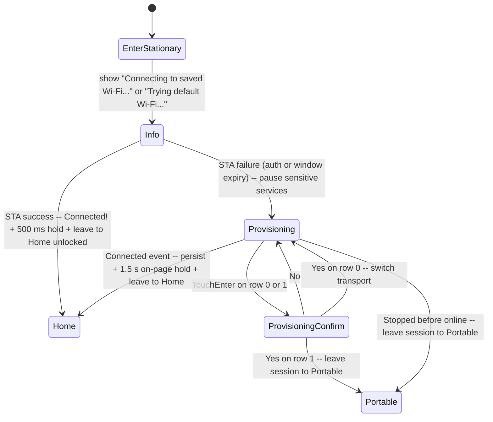

# Orchestrator

Central event loop for AirGradient Go. Consumes events from the shared queue,
manages application state (operating mode, behavior, lock/unlock), coordinates
all product services, handles timer-based periodic tasks, and controls the
sleep cycle.

## Files

| File | Purpose |
|---|---|
| `products/go/main/go_orchestrator.h` | `Orchestrator` class declaration, `Services` struct |
| `products/go/main/go_orchestrator.cpp` | Event loop, dispatch, state transitions, timer logic, sleep |

## Dependencies

| Dependency | Source | Usage |
|---|---|---|
| `SensorProducer` | product (`go_sensor_producer.h`) | Request measurement cycles |
| `GpsService` | product (`go_gps.h`) | Read latest GPS fix |
| `InputService` | product (`go_input.h`) | Started/stopped by orchestrator; posts `InputPress` events |
| `DisplayService` | product (`go_display.h`) | Render display frames |
| `StorageService` | product (`go_storage.h`) | Cache measurements, persist route data |
| `PowerService` | product (`go_power.h`) | BMS polling, sleep entry, RTC state, shutdown |
| `UIManager` | product (`go_ui.h`) | Screen navigation, input dispatch, display value building |
| `BleService` | product (`go_ble.h`) | Portable BLE peripheral; initialised on Portable entry, torn down on leave |
| `WifiService` | product (`go_wifi.h`) | Stationary Wi-Fi lifecycle: saved-credentials connect, factory fallback, provisioning, disconnect routing |
| `GoBoard` | product (`go_board.h`) | Borrowed for `init_wifi_subsystem()` on first Stationary entry |
| `ConfigStore` | `airgradient-config` | Load/save `GoSettings` to NVS |
| `GoSettings` | product (`go_settings.h`) | Product configuration |
| `Event`, `EventType` | product (`go_events.h`) | Event queue types |
| `RtcAppState` | product (`go_types.h`) | State persisted across deep sleep |
| RTOS | `airgradient-common` | Queue receive, time query, delay |
| `format_ipv4_be` | `airgradient-common` (`common.h`) | Format the network-byte-order IPv4 for the bring-up "Connected!" page text |

## Public API

| Method | Returns | Purpose |
|---|---|---|
| `Orchestrator(queue, services, settings, store, serial)` | — | Construct with the event queue, all service references, a copy of `GoSettings`, the `ConfigStore`, and the serial number string |
| `init(cause, handoff = {})` | `void` | Restore RTC state, seed cached values from `BootHandoff`, set timer baselines, request first measurement, kick the display |
| `run()` | `void` (never returns) | Enter the event loop |

See [`go_orchestrator.h`](../main/go_orchestrator.h) for the full `Services`
struct and supporting types.

## Construction

The orchestrator is constructed by `GoApp` after all services are
initialized. It takes ownership of a copy of `GoSettings` and holds
references to all services via the `Services` aggregate (sensor producer,
GPS, input, display, storage, power, UI manager, BLE service, Wi-Fi
service, board):

```cpp
Orchestrator::Services services{ /* service refs + board ref */ };
Orchestrator orchestrator(event_queue, services, settings, config_store, serial);

// Fresh boot (default BootHandoff):
orchestrator.init(cause);

// Button-wake path with handoff:
BootHandoff handoff{};
handoff.display_painted    = true;
handoff.initial_lock_state = LockState::Unlocked;
orchestrator.init(WakeCause::Button, handoff);

orchestrator.run();  // never returns
```

For the production wiring (boot path selection and orchestrator
construction), see [`go_app.cpp`](../main/go_app.cpp).

## `init()` — Boot Initialization

```cpp
void init(WakeCause cause, const BootHandoff &handoff = {});
```

`init()` is called once before `run()`. It restores persisted state, sets
timer baselines, requests the first measurement, and kicks the display.
The `BootHandoff` struct replaces the old `(bool already_painted,
const RtcDisplaySnapshot *snapshot)` parameters with explicit fields for
each dimension of boot state.

### RTC State Restoration

RTC state (`_behavior`, `_gps_enabled`, `_tracking_active`,
`_tracking_session_id`) is restored for all non-PowerOn wake causes:

```cpp
if (cause != WakeCause::PowerOn) {
    // Restore from RTC — both Timer and Button wakes have valid state
}
```

Previously, RTC state was only restored for `WakeCause::Button`. The
generalization is needed because fast-path promotion sends `WakeCause::Timer`
to the orchestrator, and the device was in a sleep cycle with persisted state.

### Lock State and Display

The orchestrator's initial lock state and display behavior are driven by
`BootHandoff` fields, not by wake-cause-specific branches:

**`initial_lock_state == Unlocked` + `display_painted == true`:**

The display already shows the correct unlocked UI. `init()` sets
`_lock_state = Unlocked` directly (bypasses `unlock()` to avoid a redundant
`update_display()`), arms the "Unlocked" snackbar timer, and sets
`_last_input_ms`.

**`initial_lock_state == Unlocked` + `display_painted == false`:**

The display hasn't been painted yet or shows stale content. `init()` calls
`unlock()` which triggers `update_display()` to paint the unlocked frame.

**`initial_lock_state == Locked` (default):**

No lock state change. Device stays locked.

**Cold-boot splash:**

When `GoApp` already painted `Screen::Info` with `Booting...` and the boot
handoff does not contain a completed measurement, `init()` arms
`_boot_splash_active`. The splash remains visible until the first
`SensorDataReady` event. If Stationary setup takes ownership of
`Screen::Info` before that event, the flag is cleared without resetting the
session page.

### Cached Measures Seeding

`init()` seeds `_cached_measures` from the handoff in priority order:

1. `fast_path_measures` (fresh data from fast-path measurement) — highest priority
2. `display_snapshot` (stale RTC snapshot from last sleep) — fallback
3. Neither set — `_cached_measures` stays at invalid sentinels

### Measurement Completed

When `handoff.measurement_completed == true`, the orchestrator sets
`_first_measurement_done = true` and skips the initial measurement request.
This allows the sleep-too-short promotion case to immediately attempt sleep
on the next event loop iteration.

### Route Resumption

If `_tracking_active` is true after RTC state restoration, the orchestrator
calls `storage.start_route(_tracking_session_id)` to reopen the route file
in append mode.

### Mode Entry (Portable / Stationary)

After the common tail (sensor / BMS poll baselines), `init()` invokes
`init_ble_if_portable()` and — when `_settings.operating_mode ==
Stationary` — calls `enter_stationary()`. The two-phase
`change_mode()` ordering does not apply to cold boot because there is
no outgoing mode to tear down. Cold-boot Portable never calls
`_board.init_wifi_subsystem()`, so the Wi-Fi ESP-IDF stack stays
uninitialised for the lifetime of that boot.

## Application State

The orchestrator owns the authoritative application state:

| Field | Type | Default | Meaning |
|---|---|---|---|
| `_mode` | `OperatingMode` | `Portable` | Portable / Stationary / Offline |
| `_behavior` | `Behavior` | `Idle` | Tracking / Idle / Shutdown |
| `_lock_state` | `LockState` | `Locked` | Locked / Unlocked |
| `_gps_enabled` | `bool` | `true` | Whether GPS data is used (derived from `GpsMode` setting) |
| `_tracking_active` | `bool` | `false` | True while a route is being logged |
| `_tracking_session_id` | `uint32_t` | `0` | 5-digit session ID; 0 = no active session |
| `_provisioning_sensitive_services_paused` | `bool` | `false` | True while sensor producer / GPS / PM rail are paused for the active provisioning transport; gates sensor / BMS / PM / snackbar-refresh deadlines |
| `_setup_session_active` | `bool` | `false` | True between Stationary session entry (`Screen::Info` or `Screen::Provisioning` after post-online `auth_failed`) and the leave-to-Home / leave-to-Portable boundary; gates power-button short-press, auto-lock, touch-driven drop-free render, and background-render suppression |
| `_bring_up_pending` | `bool` | `false` | True while `Screen::Info` is showing the STA-attempt narration; lets `on_wifi_connected()` distinguish the on-Info success path from the post-online reconnect path |
| `_boot_splash_active` | `bool` | `false` | True while cold boot is showing `Booting...` on `Screen::Info`; cleared by first sensor data and suppresses ButtonPower short-press lock toggles |

On fresh boot (`PowerOn`), defaults are used. On wake from deep sleep (`Timer`
or `Button`), state is restored from RTC memory via
`PowerService::load_state()`.

## Event Loop

The `run()` method is an infinite loop using queue-timeout polling for timers:

1. **Sleep check** — when locked and the first measurement is done, attempt
   to enter deep sleep. Returns only when sleep conditions are not met (mode
   not Offline, or `sleep_ms < deep_sleep_threshold_ms`).
2. **Queue receive** — wait for the next event with a timeout computed from
   the nearest timer deadline.
3. **Dispatch** — route the event to its handler.
4. **Check timers** — fire any timer callbacks whose deadlines have elapsed.

## Timer Management

No dedicated timer tasks or callbacks. The orchestrator tracks deadlines
using `RTOS::get_time_ms()` and computes the queue-receive timeout from
the nearest deadline.

| Timer | Interval | Active When |
|---|---|---|
| PM pre-wake | `measure_interval - CONFIG_SENSOR_WARMUP_DURATION_MS` | Not Offline, interval ≥ `pm_sleep_threshold_ms`, prepare not yet sent, sensitive services not paused |
| Sensor (all groups) | `measure_interval_seconds * 1000` | Sensitive services not paused |
| BMS full poll | `BMS_POLL_INTERVAL_MS` (30000 ms) | Sensitive services not paused |
| BMS status poll | `BMS_STATUS_POLL_INTERVAL_MS` (5000 ms) | Sensitive services not paused |
| External watchdog | `EXT_WDT_INTERVAL_MS` (60000 ms) | Always — never suppressed during a setup session |
| Inactivity | `auto_lock_seconds * 1000` | Unlocked, auto-lock > 0, and no setup session active |
| Snackbar refresh | `SNACKBAR_DURATION_MS + 200` (one-shot) | Snackbar active, sensitive services not paused |
| Wi-Fi initial-connect / fallback | `WifiService::next_deadline_ms()` | While the service has armed a deadline (Stationary bring-up) |

`compute_queue_timeout_ms()` returns the minimum remaining time across all
active timers, clamped to 0 when any deadline has already passed (unsigned
subtraction wraps to a large value). `check_timers()` finally calls
`_svc.wifi.tick(now)` to clear an expired-by-IP deadline latch or
synthesize a `WifiDisconnected{connection_lost}` when the bring-up
window expires without an IP. The external watchdog is intentionally
**not** suppressed during the session — without it, every other timer
being gated could leave `next == UINT32_MAX` and busy-spin the event
loop.

## Event Dispatch

Events are dispatched by type:

| EventType | Handler |
|---|---|
| `SensorDataReady` | `on_sensor_data()` — cache, clear cold-boot splash if active, log full `MeasuresAGo` snapshot, store route point if tracking, update BLE measures, update display |
| `GpsFixUpdate` | `on_gps_fix()` — cache GPS if `is_gps_active()` |
| `InputPress` | `on_input()` — shutdown, lock/unlock, forward to UIManager |
| `UserStartTracking` | `start_tracking()` |
| `UserStopTracking` | `stop_tracking()` |
| `UserChangeMode` | `change_mode()` |
| `UserToggleGps` | Set `_gps_enabled` |
| `SettingsChanged` | `apply_settings_change()` |
| `ClearData` | `clear_data()` |
| `SaveTag` | `save_tag()` |
| `InactivityTimeout` | `on_inactivity_timeout()` → `lock()` |
| `MeasurementTimer` | `check_timers()` (legacy event, re-checks all timers) |
| `WakeFromSleep` | No-op (handled in `init()`) |
| `BleConnected` | Push current measures/status/config, dismiss passkey overlay |
| `BleDisconnected` | Dismiss passkey overlay |
| `BleConfigWrite` | Decode config/command write and apply it |
| `BleHistoryWrite` | Decode history export request and delegate to BLE service |
| `BlePairingRequest` | Show passkey overlay |
| `BleAuthComplete` | Dismiss passkey overlay |
| `Co2CalibrationDone` | Show result snackbar, notify BLE command result, update display |
| `WifiConnected` | `on_wifi_connected()` — bring-up success (`Connected!\n<ip>` on Info then leave to Home), or post-online reconnect snackbar on Home; unconditionally `cloud.start()` + `cloud.arm()` |
| `WifiDisconnected` | `on_wifi_disconnected()` — `cloud.disarm()` then disconnect-policy router (auth_failed always opens provisioning; other credential-class reasons only before first online) |
| `ProvisioningStateChanged` | `on_provisioning_state_changed()` — update Provisioning page state, persist `disable_cloud` / `static_ip` on `Connected`, `cloud.start()` + `cloud.arm(true)` after provisioning teardown, fall back to Portable on `Stopped` without prior online |
| `PostMeasuresResult` | Log-only (result code) |
| `FetchConfigResult` | Log-only (result code) |

## Input Handling

`on_input()` processes input events with priority:

1. **Long press ButtonPower** — `shutdown()` with default reason (any lock state)
2. **Long press ButtonBoot** — `factory_reset()`, then reboot on success
3. **Short press ButtonPower while `_setup_session_active` or
   `_boot_splash_active`** — suppressed (no lock toggle); the setup
   instructions or cold-boot splash stay visible
4. **Short press ButtonPower** — toggle lock/unlock
5. **Locked** — touch shows "Unlock First" snackbar; other inputs ignored
6. **Unlocked** — forward to `UIManager::handle_input()`, then handle the
    returned `UIActionResult` (start/stop tracking, change mode,
    provisioning confirm-switch / confirm-cancel, etc.)

The catch-all render at the tail of `on_input()` uses
`update_display(/*wait=*/true)` when `_setup_session_active` is set so
touch-driven session transitions (row toggle, confirm open, No/Yes
toggle, No-back) cannot be dropped when the worker is mid-paint on a
prior frame. Non-session screens keep the existing non-blocking
default.

The `UIAction::ConfirmSwitchProvisioningTransport` case is handled
inside the dispatch switch and returns early, bypassing the catch-all
render. The case body latches `ProvisioningUiState::SwitchingTransport`,
runs `update_display(wait=true) + DisplayService::flush()` so the
"Switching to ..." ack is painted before the transport flips, then
calls `_svc.wifi.switch_provisioning_transport()`.

## State Transitions

### lock()

Sets `LockState::Locked`, resets UI to home screen, updates display. Sleep
eligibility is evaluated on the next main loop iteration.

### unlock()

Sets `LockState::Unlocked`, resets the inactivity timer, requests a quick
single-iteration measurement, and updates the display.

### start_tracking() / stop_tracking()

Manages route lifecycle through `StorageService`. Generates a 5-digit
session ID (random, range 10000–99999), opens/closes the route file, and
toggles `_behavior` between `Tracking` and `Idle`.

### change_mode()

Updates `_mode`, persists it to NVS, and syncs `UIManager` so the
Settings menu reflects the new mode. Tears down the outgoing radio
(BLE for Portable, Wi-Fi via `WifiService::shutdown()` for Stationary)
and brings up the incoming radio (`init_ble_if_portable()` on entry to
Portable, `enter_stationary()` on entry to Stationary). The PM sensor
power rail is re-enabled (idempotent) before any mode-specific entry so
a previous Portable session that power-cycled PM off does not leave the
rail dark across the transition.

The Stationary entry branch returns before the generic
`"Mode changed"` snackbar fires — `enter_stationary()` opens
`Screen::Info` with the attempt-specific text and runs its own
`update_display(wait=true)`. Mode changes to Portable / Offline keep
the snackbar + display update.

### apply_settings_change()

Called when the UI signals a setting was changed. Calls
`UIManager::apply_to_settings()` to convert internal option indices back to
`GoSettings` fields, persists to NVS via `save_go_settings()`, and
propagates runtime changes (GPS posting interval, GPS enabled flag, sensor
timer rescheduling).

### clear_data()

Stops tracking if active, clears the temporary RTC-backed chart cache,
deletes all persisted route files from NAND, refreshes BLE status when a
client is connected, shows a snackbar, and returns success/failure.

### factory_reset()

Calls `clear_data()`, writes default `GoSettings` to NVS (which zeros
`disable_cloud` and `static_ip`), calls `WifiService::clear_credentials()`
to erase the ESP-IDF Wi-Fi NVS entries and reset online latches,
deletes all stored BLE bonds, resets runtime state back to Portable +
Idle + Locked, updates the display, and returns success/failure. The
caller reboots the ESP on success.

### shutdown(reason)

Unified shutdown pipeline for all shutdown paths. Takes an optional
`ShipModeRequest` reason (default `None` for user-initiated shutdown):

1. Show screen: `Screen::Info` with warning text for safety trips
   (`OverDischarge` → "Battery critically low", `OverTemperature` →
   "Battery overheated"); `Screen::Shutdown` for user-initiated
2. Persist state: stop tracking if active, backup chart cache
3. Disable peripherals: `set_pm_power(false)`, GPS stop (TODO)
4. Wait for e-paper refresh (`SHUTDOWN_DISPLAY_DELAY_MS`, 500 ms)
5. `PowerService::shutdown()` — BMS ship mode → deep sleep fallback

Safety trips (EDV/OT) are detected by `poll_bms()` and signalled via
`PowerSnapshot::ship_mode_request`. The orchestrator checks this field
in `on_bms_timer()` and routes to `shutdown(reason)`.

## Stationary Networking

Stationary mode brings up Wi-Fi via `WifiService` and runs the on-device
setup session (`Screen::Info` → `Screen::Provisioning` →
`Screen::ProvisioningConfirm`). The orchestrator owns the mode policy,
the session UI lifecycle, the disconnect-policy router, and the
service-pause / clock-rebase machinery; `WifiService` owns the radio
mechanics. See [`wifi_service.md`](wifi_service.md) for the service-side
contract.

### Setup Session Lifecycle



`enter_stationary()` is invoked by `change_mode(Stationary)` and by
`init()` when the persisted mode is Stationary. It calls
`_board.init_wifi_subsystem()` (idempotent), runs the silent session
preamble, sets `_bring_up_pending`, opens `Screen::Info` with the
attempt-specific narration text, and starts the STA attempt with
`update_display(wait=true)`. STA success goes through
`on_wifi_connected()`; STA failure routes through the disconnect policy.

### Session State Helpers

| Helper | Role |
|---|---|
| `begin_session_if_needed()` | Idempotent session preamble. Sets `_setup_session_active`, silently flips `_lock_state = Unlocked` (no `"Unlocked"` snackbar), and clears any pending snackbar so leftover `"Mode changed"` / `"Locked"` / stale `"Wi-Fi connected"` cannot leak onto session screens. Called by `enter_stationary()` and `enter_provisioning_page()`. |
| `enter_provisioning_page(transport)` | Entry into `Screen::Provisioning`. Calls `begin_session_if_needed()`, clears `_bring_up_pending` (defangs the on-Info success arm), runs `pause_provisioning_sensitive_services()`, opens the page via `UIManager::open_provisioning()`, kicks off the transport, and ends with `update_display(wait=true)`. Used by the STA-fail bring-up path and by post-online `auth_failed`. |
| `leave_session_to_home()` | Success-path leave. Clears the `Connected!` page state, calls `UIManager::reset_to_home()`, polls the BMS once for a fresh battery icon, resumes paused services, rebases periodic clocks, silently unlocks, clears the session gate, and ends with `update_display(wait=true) + DisplayService::flush()`. Used by both STA-only success (Info) and provisioning-success (Provisioning). |
| `leave_session_to_portable()` | Cancel / abort path. Mirrors the success leave but routes through `change_mode(Portable)` (which fires its own `"Mode changed"` snackbar). The session gate stays true through `change_mode()` so any background-render path that fires mid-teardown still no-ops. |
| `rebase_periodic_clocks()` | Roll `_last_measurement_ms` / `_last_bms_poll_ms` / `_last_bms_status_poll_ms` forward to `now` on resume so paused timers do not fire back-to-back catching up. The external watchdog clock is deliberately not rebased. |

### Service Pause and Resume

`pause_provisioning_sensitive_services()` is called inside
`enter_provisioning_page()` immediately before
`WifiService::start_provisioning()`. It stops the sensor producer,
idles the GNSS receiver if GPS is active, and drops the PM sensor power
rail so the Wi-Fi driver has enough DMA-capable contiguous heap while
the provisioning transport stack is active.
`resume_provisioning_sensitive_services()` re-enables PM, restarts the
sensor producer and GPS, and requests one immediate measurement so the
post-resume display refreshes promptly. The pause is idempotent — the
STA-only `Screen::Info` bring-up phase never triggers it.

Sensor-measurement, BMS full poll, BMS status poll, PM pre-wake, and
snackbar-refresh deadlines are all gated on
`_provisioning_sensitive_services_paused`. The auto-lock deadline is
gated on the broader `_setup_session_active` so users on
`Screen::Info` (where polls still run) are not auto-locked out.

### Disconnect Policy

`on_wifi_disconnected(reason)` runs only in Stationary mode and reads
`WifiService::has_been_online()` to split the policy:

| Reason | Before First Online | After First Online |
|---|---|---|
| `auth_failed` | Open provisioning | Open provisioning |
| `no_ap_found` | Open provisioning | Stay disconnected |
| `assoc_failed` | Open provisioning | Stay disconnected |
| `dhcp_failed` | Open provisioning | Stay disconnected |
| `connection_lost` (real or synthetic from deadline expiry) | Open provisioning | Stay disconnected |
| `ap_disconnected` / `handshake_failed` / `unknown` | Stay (the bring-up timeout will eventually synthesize `connection_lost`) | Stay disconnected |
| `requested_by_user` | Ignore | Ignore |

`auth_failed` always opens provisioning because the stored credentials
are no longer trustworthy. Post-online retry exhaustion leaves the
device in Stationary with the status-bar Wi-Fi icon showing
disconnected; user recovery is mode switch, factory reset, or reboot.
There is no outer-loop reconnect scheduler.

### Provisioning Event Routing

`on_provisioning_state_changed(payload)` updates the Provisioning page
state and handles two terminal events:

- **`Connected`** — persist `disable_cloud` and `static_ip` from the
  payload, push `set_disable_cloud()` to `CloudService`, render
  `Connected! a.b.c.d` with `update_display(wait=true) + flush()` so
  the success frame is painted before any hold, call
  `WifiService::stop_provisioning()` (whose internal
  `POST_CONNECT_HOLD_MS` provides the ~1.5 s on-page dwell), then
  `leave_session_to_home()`, then `cloud.start()` +
  `cloud.arm(/*fire_now=*/true)` so the first POST fires immediately.
- **`Stopped`** (without `has_been_online()`) — user abort, inactivity
  timeout, or a transport-switch start failure. Falls back to Portable
  via `leave_session_to_portable()` so the device is never stranded on
  the Provisioning screen with no active transport.

Other events (`Started`, `Connecting`, `ConnectFailed`,
`SwitchingTransport`) update `UIManager::set_provisioning_ui_state()`
and run a non-blocking display update.

### STA-Only Success

`on_wifi_connected(ip)` branches on `_bring_up_pending`:

- True (initial Stationary bring-up): show `Connected!\n<a.b.c.d>` on
  `Screen::Info` formatted via `format_ipv4_be`, queue + flush the
  frame, hold `STA_SUCCESS_HOLD_MS` (500 ms) post-paint, then
  `leave_session_to_home()`. No snackbar fires — the on-page text is
  the success ack.
- False, on `Screen::Home`, and no active session: post-online
  reconnect. Show the `"Wi-Fi connected"` snackbar.
- Otherwise (stray late event during the session, or the user is on a
  menu / session screen): UI is ignored, but cloud transport still
  resumes.

After the UI branch, `cloud.start()` (idempotent) and
`cloud.arm(_cloud_first_post_pending)` run unconditionally on every
Stationary IP transition. See [`cloud_service.md`](cloud_service.md).

## Display Update

### `update_display()`

Builds a `BuildContext` from cached state and asks the UIManager to produce
a `DisplayValues` snapshot:

1. Clear expired snackbar
2. `build_context()` — convert cached `MeasuresAGo` to `Measures`, read
   chart cache, extract battery info, status flags, and `is_plugged_in`
   (derived from `bms_power_source_has_external_input()`)
3. `UIManager::build_values(ctx)` — produce `DisplayValues`
4. `DisplayService::update(values)` — non-blocking render submission
5. If a snackbar is active and no refresh timer is pending, schedule a
   one-shot `_snackbar_refresh_deadline_ms` to guarantee the snackbar is
   visually cleared even if no other events trigger `update_display()`

The `BuildContext` requires a `const Measures &` reference. The orchestrator
maintains a `mutable Measures _display_measures` member that is populated
from the cached `MeasuresAGo` each time `build_context()` is called.

### Background Display Suppression

Display-update call sites are split into two categories:

**User-initiated** — call `update_display()` directly (always repaint):
`on_input()`, `lock()`, `unlock()`, `start_tracking()`, `stop_tracking()`,
`change_mode()`, `clear_data()`, `factory_reset()`, `save_tag()`,
`shutdown()`, `on_co2_calibration_done()`, `on_ble_pairing_request()`.

**Background** — call `request_background_display_update()`:
`on_sensor_data()`, `on_ble_connected()`, `on_ble_disconnected()`,
`on_ble_auth_complete()`, `on_ble_config_write()` (Set branch),
`on_bms_status_timer()`, snackbar refresh timer in `check_timers()`.

`request_background_display_update()` short-circuits when a setup
session is active and otherwise delegates to
`UIManager::is_on_menu_screen()`:

```cpp
void Orchestrator::request_background_display_update() {
  if (_setup_session_active) {
    return; // session screens only re-render on explicit transitions
  }
  if (!_svc.ui_manager.is_on_menu_screen()) {
    update_display();
  }
}
```

When the user is on any menu-navigation screen (MainMenu, Settings,
SettingsChoice, TagList, Confirm, About) or anywhere inside the setup
session (`Info`, `Provisioning`, `ProvisioningConfirm`), background
events still update data caches, send BLE notifications, etc. — only
the e-paper refresh is skipped. The display catches up on the next
user-initiated repaint (input, lock/unlock, returning to Home, or the
explicit `update_display(wait=true)` calls from the setup session
helpers).

### Drop-Free Renders for Critical Transitions

`update_display(bool wait)` forwards to
`DisplayService::update(values, wait)`. The session helpers and the
`Connected` event handler use `wait=true` so a new frame queues without
being dropped even when the worker is mid-paint on a prior frame. When
the next caller-observable action depends on the new frame having
finished painting (the 500 ms `STA_SUCCESS_HOLD_MS` dwell on Info, the
component-side `POST_CONNECT_HOLD_MS` on Provisioning, the
`SwitchingTransport` ack before the transport flips, and both leave
helpers), the call is followed by `DisplayService::flush()` which spins
until `_worker_busy` clears.

The orchestrator does not choose refresh tiers (Full/Fast/Partial).
That decision belongs entirely to `DisplayService::update()`.

## Sleep Cycle

### Entry

`try_enter_sleep()` is called at the top of each loop iteration when the
device is locked and the first measurement is complete:

1. `PowerService::decide_sleep()` determines the sleep type (`None` or `Deep`)
   and the adjusted sleep duration in one call. It computes
   `min(enabled intervals) - awake_ms`. Non-Offline modes and short intervals
   (< `deep_sleep_threshold_ms`) return `{None, 0}`.
2. If `None`: return immediately — the main loop continues normally.
3. If `Deep`: call `prepare_for_sleep()`, then `enter_sleep()`.
   `enter_sleep()` does not return; CPU reboots on wake.

### `prepare_for_sleep()`

```text
1. Final display update with wait=true (blocks until e-paper refresh done)
2. save_rtc_display_snapshot(values) — persist sensor values, battery,
   status flags, rendering settings to RTC memory for next button wake
3. Stop services: BLE, sensor producer, GPS, input, display worker
4. display_service.deep_sleep() — put SSD1680 into sleep mode 1 (<1 µA)
5. storage.backup_cache() — persist chart data to RTC memory
6. power_service.save_state(snapshot_state()) — persist app state
7. power_service.reset_ext_watchdog() — maximize timeout window during sleep
```

`save_rtc_display_snapshot()` is called after `update(values, true)` so the
snapshot reflects exactly what was last rendered. It is intentionally before
`stop()` — the values are still valid at that point. `deep_sleep()` is called
after `stop()` to ensure the worker task is no longer using the SPI bus.

## GPS Active Logic

`is_gps_active()` determines whether GPS data should be used:

| GpsMode | Result |
|---|---|
| `AlwaysOff` | `false` |
| `AlwaysOn` | `true` |
| `OnWhenTracking` | `_tracking_active` |

GPS hardware is always powered on and the GPS task always runs. This method
only controls whether `GpsFixUpdate` events update the cached GPS data.

## Sensor Scheduling

The orchestrator maintains a single timer (`_last_measurement_ms`).
`check_timers()` fires when `measure_interval_seconds` elapses, always
requesting `SensorGroup::All` with a single
`request_measurement(1, SensorGroup::All)` call.

When the interval setting changes, `reschedule_sensor_timer()` resets the
baseline to `now` and reconciles PM sensor power with the new interval:
powers off if the new interval crosses above `pm_sleep_threshold_ms`,
powers on if it crosses below.  If the interval is unchanged, the
baseline and PM power are not touched.

Iterations are always 1 — AGo sensors perform internal averaging, and the
per-iteration 2 s delay is skipped for single iterations.

`on_sensor_data()` always overwrites all fields in `_cached_measures`
and, in non-Offline modes with a long enough interval, powers off the
PM sensor via `set_pm_power(false)` to save fan current until the next
pre-wake timer fires.  Sensor failures are immediately visible (display
shows dashes) rather than masked by stale cached data.

Every `SensorDataReady` event logs one multi-line `MeasuresAGo` snapshot
with the full AGo sensor set: temperature, humidity, PM mass, PM particle
counts, CO2, TVOC / NOx, power, pressure, and altitude. Invalid sentinels
pass through unchanged so logs match what the cache and cloud snapshot
received.

### PM Sensor Power-Cycling

When `mode != Offline` and `measure_interval_seconds * 1000 >=
pm_sleep_threshold_ms`, the orchestrator power-cycles the SPS30 between
measurements.  A `_pm_prepare_sent` flag prevents duplicate pre-wake
signals within the same measurement cycle; it is reset when the
measurement timer fires.

See [Power Management — PM Sensor Sleep](power_management.md#pm-sensor-sleep-active-mode-power-cycling)
for the full cycle, edge cases, and method documentation.

## Session ID Generation

`generate_session_id()` uses the shared `generate_random_number(5)` helper
from `airgradient-common` and returns a 5-digit ID in the range 10000–99999.
`0` remains reserved as the "no active session" sentinel.

## Required Service Additions

This implementation required two additions to existing services:

### UIManager::apply_to_settings()

Added to `go_ui.h` / `go_ui.cpp`. Converts internal option indices back to
`GoSettings` field values — the reverse of `sync_settings()`. Covers:
units, PM display, display interval, PM interval, other sensor interval,
GPS mode, operating mode, and auto-lock timeout.

### StorageService::read_cache()

Added to `go_storage.h` / `go_storage.cpp`. Copies all cached `MeasuresAGo`
entries (oldest first) into a caller-provided buffer. Used by
`build_context()` to provide chart data to the UIManager.

### DisplayService TEST_HOST stub

Added to `go_display.h` in the `#else` branch of the `#ifndef TEST_HOST`
guard. Provides a no-op `DisplayService` class with matching method
signatures so the Orchestrator compiles without conditional compilation in
host test builds.

## Diagnostics

Heap-pressure paths log `free`, `min`, and largest default-capable heap via
the shared `log_heap()` helper. Probes cover boot path handoff, BLE init,
mode changes, BMS full-poll ticks, Stationary Wi-Fi entry, provisioning
pause / resume, cloud start / stop / POST / FETCH, Wi-Fi connected /
disconnected routing, and sleep preparation. The helper compiles to a
no-op under `TEST_HOST`.

## Design Decisions

### Queue Timeout Polling

Timer deadlines are tracked with `RTOS::get_time_ms()` timestamps rather
than dedicated `esp_timer` or FreeRTOS software timers. This eliminates
platform dependencies, avoids callback-to-queue indirection, and centralizes
all timer logic for host testability.

### UI Actions via Direct Return

The primary path for UI actions (start tracking, change mode, etc.) is
through `UIManager::handle_input()` returning `UIActionResult`. The
`EventType` enum values for these actions also serve as programmatic
triggers — for example, BLE `start_tracking` / `stop_tracking` commands
dispatch through the same `start_tracking()` / `stop_tracking()` methods.

### auto_lock_seconds vs inactivity_timeout_seconds

The inactivity timer uses `GoSettings::auto_lock_seconds` because this is
the field controlled by the UI "Auto Lock" setting and persisted correctly
through `save_go_settings()`. The `inactivity_timeout_seconds` field exists
in `GoSettings` but is not connected to any UI control.

### Invalid Sentinel Initialization

`_cached_measures` is initialized to invalid sentinel values (not zero)
using a `make_invalid_measures()` helper. This ensures the display shows
placeholder indicators rather than misleading zeros before the first
measurement completes.
