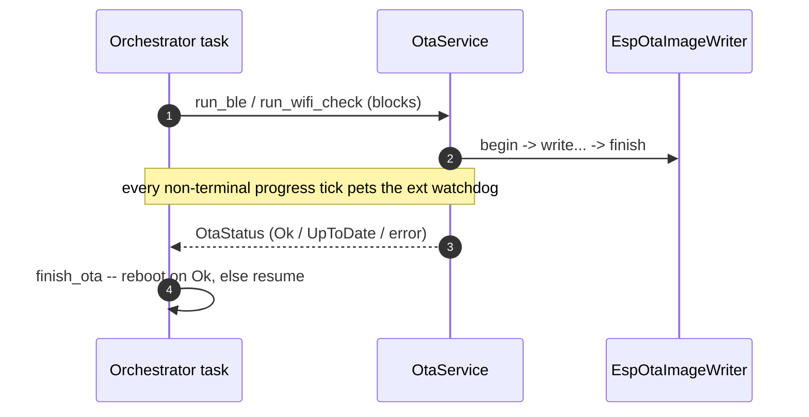

# OTA Service

`OtaService` is the product-side glue around the `airgradient-ota` component.
It owns the per-mode OTA wiring — **BLE push** while Portable, **WiFi pull**
while Stationary, nothing while Offline — and the borrowed-server BLE
registration. It never spawns a task and never reboots: the orchestrator drives
every entry point on its own task and decides reboot-vs-resume from the returned
`OtaStatus`. Both transports terminate at the same owned `EspOtaImageWriter`.

## Files

| File | Purpose |
|---|---|
| `products/go/main/go_ota.h` | `OtaService` declaration |
| `products/go/main/go_ota.cpp` | Implementation |
| `products/go/specs/ota.md` | Feature spec (temporary) |

## Dependencies

| Dependency | Source | Usage |
|---|---|---|
| `OtaBleService` | `airgradient-ota` (`services/ota_ble_service.h`) | BLE push transport over the borrowed server (owned by value) |
| `OtaUpdater` | `airgradient-ota` (`services/ota_updater.h`) | WiFi pull orchestrator (constructed per check) |
| `WifiHttpOtaSource` | `airgradient-ota` (`backends/wifi/wifi_http_ota_source.h`) | HTTP GET image source (constructed per check) |
| `EspOtaImageWriter` | `airgradient-ota` (`backends/esp/esp_ota_image_writer.h`) | Universal flash-write core (owned by value) |
| `OtaStatus`, `OtaProgress`, `OtaRequest` | `airgradient-ota` (`types/ota_types.h`) | Result, progress, and request types |
| `AgBleServer` | `airgradient-ble` (`hal/ble_server.h`) | Borrowed GATT server, shared with `BleService` |
| `PowerService` | product (`go_power.h`) | External GPIO2 watchdog feeder |

## Public API

| Method | Returns | Purpose |
|---|---|---|
| `setup_ble()` | `bool` | Register the OTA GATT service on the borrowed server. Must run between the server's register phase and `start_advertising()` (Portable only). |
| `teardown_ble()` | `void` | Abort any in-flight transfer and clear the OTA registration. Idempotent; never `deinit()`s the server. |
| `handle_disconnect()` | `void` | Forward a central disconnect so an in-flight `run_ble()` aborts. Runs synchronously in the NimBLE host-task callback. |
| `is_ble_active()` | `bool` | Start-edge probe: `true` from the moment a valid `START` latches (before `begin()`) until the terminal. |
| `run_ble()` | `OtaStatus` | Drive a phone-initiated BLE transfer to its terminal (wraps `run(0)`). Blocks on the caller (orchestrator) task. |
| `run_wifi_check(on_download_started)` | `OtaStatus` | Run one device-initiated WiFi availability check + download. Blocks; returns `UpToDate` when no update. `on_download_started` fires once, on the first `Downloading` tick. |

See [`go_ota.h`](../main/go_ota.h) for full signatures.

## Behavior

### Mode-to-Transport Mapping

| Operating Mode | OTA Path | Drive Model | Component Pieces |
|---|---|---|---|
| Portable | BLE push | Phone-initiated | `OtaBleService` on the borrowed `AgBleServer` + `EspOtaImageWriter` |
| Stationary | WiFi pull | Device-initiated | `WifiHttpOtaSource` + `OtaUpdater` + `EspOtaImageWriter` |
| Offline | None | — | — |

### Foreground, Exclusive Execution

There is **no dedicated OTA task**. `OtaBleService::run()` and `OtaUpdater::run()`
are single blocking calls that the orchestrator runs on its own task. BLE OTA
pauses sensitive services before the call. A Stationary check starts after cloud
is disarmed, while sensing, GPS, and PM are paused only on the first
`Downloading` tick; an already in-flight cloud request may drain concurrently.
Between `enter_ota()` and the transfer's terminal the orchestrator main loop
never iterates, so mode switches and shutdown are implicitly deferred. The
orchestrator owns the trigger, quiesce, paint, and reboot decision — see
[`orchestrator.md` → OTA](orchestrator.md#firmware-update-ota).

### Watchdog Feeding

The external GPIO2 watchdog is the only one to manage during a transfer (the BMS
watchdog is disabled at BMS init). `OtaService` feeds it from the component's
`set_on_progress()` callback on every **non-terminal** tick (`Starting` /
`Checking` / `Downloading` / `Applying`) via the borrowed `PowerService`. Logic
lives in the named handlers `_on_ble_progress()` / `_on_wifi_progress()`, wired
through thin forwarders. The pre-transfer start-gap feed is the orchestrator's
concern (`enter_ota()` for BLE; the WiFi pre-check for the periodic check).

### Lazy WiFi Commit

Most hourly Stationary checks find nothing, so `run_wifi_check()` does **not**
quiesce up front. `_on_wifi_progress()` invokes the stored `on_download_started`
exactly once, on the first `OtaState::Downloading` tick (one-shot guarded by
`_wifi_download_painted`) — i.e. only when an image is really being pulled. The
orchestrator uses that callback to commit the full quiesce + "Updating firmware…"
paint. `UpToDate` / `Declined` never reach `Downloading`, so a no-op check never
stops sensing or touches the e-paper.

### Local HTTP During Stationary OTA

The Stationary OTA source opens one outgoing streaming HTTP GET through
`esp_http_client`; it does not use the borrowed inbound `HttpServer`. The hourly
check runs only while cloud transport is enabled. During the speculative check,
the local API keeps its current access and queued requests because no transfer
has committed yet.

On the first `Downloading` tick, the orchestrator stores the current local API
access, changes `ReadWrite` to `ReadOnly`, and clears queued local mutations. An
already-active listener, local routes, and mDNS stay active while STA remains
connected; a disabled endpoint stays disabled. Measures and config GETs remain
safe because `GoLocalApiService` serves mutex-protected cached snapshots; config
PUTs and actions reach existing routes but are rejected by the runtime access
gate. This read-only carve-out preserves local observability while the
orchestrator is blocked and sensors are quiesced.

A non-rebooting committed terminal restores the exact pre-OTA access. A
speculative `UpToDate`, `Declined`, or failure never changes local access or
clears its FIFO. Successful OTA reboots instead of restoring services.

### Reboot and Image Validity

`OtaService` never reboots. On `OtaStatus::Ok` the orchestrator reboots via the
shared `reboot()` free function. `CONFIG_BOOTLOADER_APP_ROLLBACK_ENABLE` is off,
so a flashed image boots directly with no mark-valid step and no automatic revert
(captured as an Open Question in the spec).

## Edge Cases / Errors

| Case | Behavior |
|---|---|
| Central disconnect mid-BLE-transfer | `handle_disconnect()` latches `TransportError` synchronously on the host task; `run_ble()` unblocks and returns it → "Update failed". Not `Aborted`. |
| Explicit phone `ABORT` | `run_ble()` returns `Aborted` → "Update cancelled". |
| Disconnect within the `START → poll` window (before `begin()`) | Accepted stillborn-abort race: one wasted quiesce + partition erase, then a clean `TransportError`. |
| Stranded-active latch (auth cleared but `START` still latched) | The orchestrator gate keeps polling on `is_ble_active()`; the next `run_ble()` services the pending abort and clears the latch. |
| OTA `START` during an active Go BLE history export | Serialized, not concurrent — both run on the single orchestrator task; no image bytes flash until the export finishes. |
| `setup_ble()` failure | Non-fatal: the orchestrator logs, calls `teardown_ble()`, and keeps advertising Go data + provisioning without OTA. |
| WiFi drop mid-download | The source read fails and `run()` returns `TransportError`; the device stays Stationary-but-offline. The committed-exit queue drain can discard the queued disconnect event, so automatic reconnect is not guaranteed. |
| Local config/action during committed WiFi OTA | If the endpoint was active and remains reachable, existing routes return forbidden while cached GETs remain available; queued pre-commit mutations are discarded. |

## Configuration

The component's `CONFIG_AG_OTA_*` Kconfig knobs are reused as-is (timeouts,
buffer sizes, BLE Data/Control limits — see
[`airgradient-ota`](../../../components/airgradient-ota/README.md)). The product
sets `CONFIG_BT_NIMBLE_ATT_PREFERRED_MTU = 512` and provisions the NimBLE mbuf
pool in `sdkconfig.defaults` for the larger MTU (at MTU 512 the BLE Data
Write-Command payload is `MTU − 3 = 509` bytes). The OTA poll cadences live in
the orchestrator (`OTA_WIFI_CHECK_INTERVAL_MS`, `OTA_BLE_POLL_INTERVAL_MS`) — see
[`orchestrator.md`](orchestrator.md#firmware-update-ota).

## Testability

The host-testable surface is the **trigger, quiesce, and outcome handling in the
orchestrator**, exercised against a stubbed `OtaService` (the same boundary at
which `WifiService` / `BleService` are stubbed). `run_ble()` / `run_wifi_check()`
are thin shells over NimBLE / ESP-IDF (compiled out under `TEST_HOST`) and are
HIL-verified. The by-value `EspOtaImageWriter` + `OtaBleService` members
construct from their host shells, which the orchestrator/app test targets link.
The watchdog-feed cadence is HIL-verified, not host-asserted.
