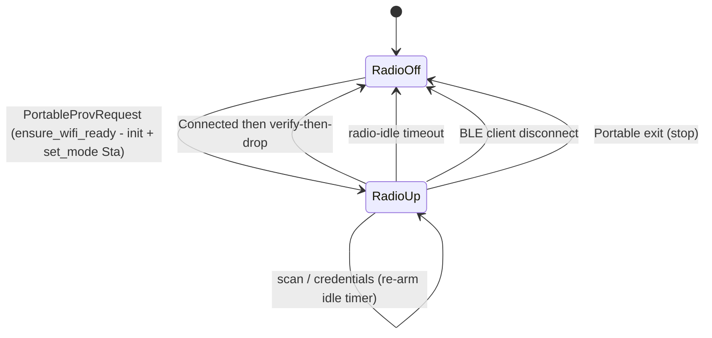

# Portable Wi-Fi Provisioner

Runs the existing Wi-Fi provisioning flow (scan, credential submit, live
connect status) over the already-bonded Portable BLE link, with no operating
mode switch and no re-pairing. `PortableWifiProvisioner` owns a Portable
`ProvisioningManager` configured for the attached transport
(`ProvisioningTransport::BleAttached`): the provisioning GATT service + DIS are
registered on the same `AgBleServer` that `BleService` already owns and
advertises, and the Wi-Fi radio is powered on demand for a single scan/connect
and dropped again (verify-then-drop) to preserve Portable's power profile.

The service owns the mechanics; the orchestrator owns the policy (mode gating,
persistence of `static_ip` / `disable_cloud`, verify-then-drop sequencing, and
teardown ordering) and routes events to the service.

## Files

| File | Purpose |
|---|---|
| `products/go/main/go_portable_provisioner.h` | `PortableWifiProvisioner` class declaration |
| `products/go/main/go_portable_provisioner.cpp` | Attach/stop, request marshaling, radio lifecycle, idle timer |
| `products/go/specs/portable_wifi_provisioning.md` | Feature spec (design rationale) |

## Dependencies

| Dependency | Source | Usage |
|---|---|---|
| `ProvisioningManager` | `airgradient-provisioning` (`services/provisioning_manager.h`) | Owned Portable instance; `start_attached()` / `request_scan()` / `submit_credentials()` / `reset_to_listening()` / `stop()` |
| `WifiManager` | `airgradient-wifi` (`services/wifi_manager.h`) | Borrowed; `set_mode(Sta/Off)` and scan/connect via the manager |
| `AgBleServer` | `airgradient-ble` (`hal/ble_server.h`) | Borrowed; the same server `BleService` init's/advertises |
| `GoBoard` | product (`go_board.h`) | Borrowed; lazy `init_wifi_subsystem()` |
| `RTOS`, `RtosMutex` | `airgradient-common` (`rtos.h`) | `queue_send()`, `get_time_ms()`, pending-request mutex |

## Public API

```cpp
bool attach();                  // register prov+DIS on the borrowed server, park idle
void stop();                    // abort, drop radio, detach (no server deinit)
void handle_pending_request();  // orchestrator task: ensure radio + drive manager
void on_connected();            // verify-then-drop: drop radio + reset_to_listening
void on_ble_disconnected();     // drop radio
bool is_radio_active() const;   // gate History export (notification contention)
uint32_t next_deadline_ms() const;
void tick(uint32_t now_ms);     // drop the radio on idle timeout
```

## Behavior

The manager state (`WaitingForCredentials` → `Connecting` → `Connected`) is
orthogonal to the radio state, which is product-driven and request-bounded.



Threading: BLE writes are parsed on the NimBLE task and forwarded to a single
pending buffer plus a `PortableProvRequest` event (no Wi-Fi work there). The
orchestrator drains that event on its own task and calls
`handle_pending_request()`, which runs the blocking Wi-Fi work. Wi-Fi result
callbacks are marshaled onto the central queue as `ProvisioningStateChanged`
tagged with `transport = BleAttached`, which the orchestrator routes to silent
Portable handling.

See [`go_portable_provisioner.cpp`](../main/go_portable_provisioner.cpp) for
the full request/marshal sequence.

## Edge Cases / Errors

| Situation | Behavior |
|---|---|
| No client ever connects | No request arrives; radio never powered; idle timer never armed |
| `ensure_wifi_ready()` fails | Request rejected; credentials get `WIFI_CONNECT_FAILED`; radio stays off |
| Disconnect mid-scan / mid-connect | Radio dropped; a late notify to a gone characteristic is harmless |
| Radio-idle timeout while app connected | Radio dropped after `CONFIG_GO_PORTABLE_PROV_RADIO_IDLE_MS` |
| History export while radio active | Rejected with `busy`; allowed when the radio is off (the common case) |
| Portable exit mid-provisioning | `stop()` aborts the session and drops the radio before `BleService::deinit()`; candidate creds already in NVS persist |

## Configuration

| Symbol | Default | Purpose |
|---|---|---|
| `CONFIG_GO_PORTABLE_PROV_RADIO_IDLE_MS` | `90000` | Drop the radio after this much inactivity even while the app stays connected |
