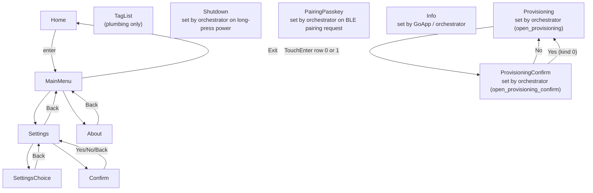

# UI Manager

Product-specific UI state machine for AirGradient Go. Manages screen
navigation, menu/list selection, metric browsing, snackbar notifications,
and chart data extraction.

## Files

| File | Purpose |
|---|---|
| `products/go/main/go_ui.h` | `UIManager` class, `UIAction`, `BuildContext` |
| `products/go/main/go_ui.cpp` | Screen state machine, input dispatch, row population, chart extraction |

## Dependencies

| Dependency | Source | Usage |
|---|---|---|
| `Screen`, `Metric`, `DisplayValues`, `ListRow`, `MAX_LIST_ROWS` | product (`go_display.h`) | Display data types and row structs returned by `build_values()` |
| `InputSource`, `InputType`, `OperatingMode` | product (`go_types.h`) | Input classification and mode enum |
| `MeasuresAGo`, `MeasuresInvalid` | `airgradient-common` (`measures_types.h`) | Measurement struct + sentinels read from `BuildContext` |
| `GoSettings` | product (`go_settings.h`) | Initial option-index sync via `sync_settings()` and reverse mapping via `apply_to_settings()` |
| `ProvisioningTransport` | `airgradient-provisioning` (`types/provisioning_types.h`) | Selected provisioning transport on `Screen::Provisioning` |
| `QrCode`, `encode_go_to_app_qr`, `encode_wifi_qr`, `WifiAuth` | `airgradient-provisioning` (`services/provisioning_qr.h`) | Per-transport QR encoding for the Provisioning page (~212 B `QrCode` member; encoded on session entry / transport switch) |
| `format_ipv4_be` | `airgradient-common` (`common.h`) | Format the network-byte-order IP for the Provisioning `Connected! a.b.c.d` status line |

No RTOS. No ESP-IDF. Fully testable on host.

## Architecture

The UI Manager is a **pure state machine** with zero hardware or RTOS
dependencies. It never touches the event queue or the Display Service
directly. The orchestrator drives it:

```text
Orchestrator:
  on InputPress (unlocked):
      action = ui_manager.handle_input(source, type)
      if action: post event

  on display update:
      ui_manager.clear_expired_snackbar(now_ms)
      values = ui_manager.build_values(ctx)
      display_service.update(values)
```

`BuildContext` passes all external state (sensors, battery, status flags,
settings-derived flags, measurement cache). The UI Manager reads from it
but never stores references to services.

`UIManager::Config` carries `firmware_version`, `serial_number`, and
`ap_password` (defaults to `"cleanair"`). `ap_password` must match
`WifiService::Config::ap_password` so the Wi-Fi QR descriptor and the
on-screen password line agree.

## Public API

| Method | Purpose |
|---|---|
| `handle_input(source, type)` | Process touch input. Returns `UIActionResult` if an app-level state change occurred. |
| `build_values(ctx)` | Build a `DisplayValues` snapshot for the Display Service. |
| `set_screen(screen)` | Force screen (Shutdown, deep-sleep restore). |
| `current_screen()` | Read current screen. |
| `is_on_menu_screen()` | True when the current screen is a menu-navigation screen (MainMenu, Settings, SettingsChoice, TagList, Confirm, About). Used by the orchestrator to suppress background display updates. |
| `show_snackbar(text)` | Show a 3-second snackbar message. Pass `nullptr` to clear (used by the session-entry preamble). Snackbars never render on `Info` / `Provisioning` / `ProvisioningConfirm`. |
| `clear_expired_snackbar(now_ms)` | Expire stale snackbar. Call before `build_values`. |
| `sync_settings(settings)` | Synchronise the internal option indices from a persisted `GoSettings`. Called by the orchestrator on boot and after any `change_mode()` so the Settings menu reflects the new mode. |
| `apply_to_settings(settings)` | Convert internal option indices back to `GoSettings` field values. Reverse of `sync_settings`. |
| `reset_to_home()` | Reset to Home with no metric. Used on auto-lock and by the session-leave helpers. |
| `show_pairing_passkey(passkey)` | Show 6-digit BLE passkey on dedicated screen. |
| `dismiss_pairing_passkey()` | Dismiss passkey screen, return to Home. |
| `show_info(text)` | Copy ASCII `text` into an internal buffer and switch to `Screen::Info`. Caller does not need to keep `text` alive. Null or empty renders a blank canvas. Used by cold boot for `Booting...`, by `Orchestrator::enter_stationary()` for the bring-up narration, and by `on_wifi_connected()` for the `Connected!\n<ip>` page. |
| `open_provisioning(active)` | Enter `Screen::Provisioning` with the given active transport. Idempotently resets the per-session UI sub-state (connected-IP, ui-state, confirm-kind, confirm-index, row-index) and re-encodes the Provisioning-page QR so the first frame of every session is clean regardless of how the prior session was torn down. |
| `open_provisioning_confirm(kind)` | Switch to `Screen::ProvisioningConfirm`, store `kind` (0 = switch transport, 1 = cancel setup), and reset the confirm cursor to `No`. |
| `set_provisioning_transport(t)` | Set the active provisioning transport, keep the row cursor on row 0 (the switch button), and re-encode the Provisioning-page QR for the new transport. Used after `Started` event updates. |
| `set_provisioning_ui_state(s)` | Update the page status enum (`WaitingForCredentials`, `SwitchingTransport`, `Connecting`, `ConnectFailed`, `Connected`). Status text is derived from this plus the active transport. |
| `set_provisioning_connected(ip)` | Latch the network-byte-order IP for the Provisioning success state. Non-zero flips the status to `Connected! a.b.c.d`; zero clears it (called from the session-leave helpers). |
| `provisioning_transport()` | Read the active provisioning transport. |

## UIAction Events

`handle_input()` returns a `UIActionResult`. The `action` field tells the
orchestrator what happened:

| UIAction | Trigger | Notes |
|---|---|---|
| `StartTracking` | Menu: "Start Tracking" | |
| `StopTracking` | Menu: "Stop Tracking" | |
| `ChangeMode` | Settings: Mode choice | `new_mode` field set |
| `SettingsChanged` | Settings: any other choice | |
| `ClearData` | Confirm: "Yes" (from "Data: Clear Data") | |
| `CalibrateCo2` | Confirm: "Yes" (from "CO2: Calibrate") | |
| `SaveTag` | TagList: tag selected | `tag_index` + `tag_label` fields set (plumbing preserved, menu entry removed) |
| `ConfirmSwitchProvisioningTransport` | ProvisioningConfirm: "Yes" on a switch-transport overlay | Orchestrator latches `SwitchingTransport`, renders + flushes, then calls `WifiService::switch_provisioning_transport()` |
| `ConfirmCancelProvisioning` | ProvisioningConfirm: "Yes" on a cancel-setup overlay | Orchestrator routes to `leave_session_to_portable()` |

Opening the main menu resets the active metric to `None`, clearing any
hero/grid selection highlight behind the overlay.

The UI Manager does **not** show snackbars for action-producing dispatches.
The orchestrator owns all user feedback because it executes the actual
operation and knows whether it succeeded (e.g., `clear_data()` may report
partial failure).

## Screen Navigation



MainMenu rows: Exit Menu (0), Start/Stop Tracking (1), Settings (2),
About Device (3). "Add Tag" has been removed from the menu; tag list
plumbing (`dispatch_tag_list`, `open_tag_list`, `SaveTag`) is preserved
but not reachable from the menu.

Every screen has Exit (index 0) -> Home. Screens with a parent have Back
(index 1) -> parent. Shutdown, PairingPasskey, Info, Provisioning, and
ProvisioningConfirm are all set directly by the orchestrator (via
`set_screen()`, `show_pairing_passkey()`, `show_info()`,
`open_provisioning()`, `open_provisioning_confirm()`) and do not appear
in the user-navigable graph above.

`Screen::Info` has no interactive elements — every input is dropped by
`handle_input()`. `Screen::Provisioning` accepts TouchUp / TouchDown to
toggle between row 0 (switch transport) and row 1 (cancel setup), and
TouchEnter opens `Screen::ProvisioningConfirm`.
`Screen::ProvisioningConfirm` accepts TouchUp / TouchDown to toggle
between `No` (index 0, default) and `Yes` (index 1); TouchEnter on `No`
returns to `Provisioning`, TouchEnter on `Yes` emits
`ConfirmSwitchProvisioningTransport` or `ConfirmCancelProvisioning`
depending on the stored kind.

The Confirm screen is a shared confirmation dialog used by multiple
settings actions ("CO2: Calibrate" and "Data: Clear Data"). The question
text and the resulting `UIAction` are determined by `_confirm_source_setting`,
which records which setting row opened the dialog. Back and No both return
to the Settings screen with the cursor on the source row.

## Navigation Patterns

| Screen | Style | Wrapping | Scroll |
|---|---|---|---|
| Home (metrics) | Circular cycle (5 entries: None, Pm25, Co2, Temp, Humidity) | Yes | N/A |
| MainMenu | Circular (4 rows, all always enabled) | Yes | N/A |
| Settings | Circular | Yes | Page-based (8 items) |
| SettingsChoice | Circular | Yes | Sliding window (8 items) |
| TagList | Circular | Yes | Page-based (8 items) |
| About | Circular | Yes | N/A (2 items) |
| Confirm | Circular | Yes | N/A (5 items, index 2 non-selectable) |
| Provisioning | Circular (2 rows) | Yes | N/A |
| ProvisioningConfirm | Circular (2 buttons, No default) | Yes | N/A |
| Shutdown | N/A (no input) | N/A | N/A |
| PairingPasskey | N/A (no input) | N/A | N/A |
| Info | N/A (no input — all touch events dropped) | N/A | N/A |

## Internal Settings State

The UI Manager stores settings as option indices internally. These drive
the settings row labels and pre-select the current value when opening a
SettingsChoice screen.

The orchestrator calls `sync_settings(const GoSettings &)` after loading
persisted settings from NVS to synchronize the internal option indices.

## Snackbar Lifecycle

1. `show_snackbar(text)` copies text, marks deadline as pending
2. `clear_expired_snackbar(now_ms)` arms the 3-second deadline on first
   call, then clears when expired
3. `build_values()` sets `v.snackbar_text` if the snackbar is active

## Stationary Networking Surface

The Stationary setup session uses three screens that the orchestrator
opens directly: `Info` (bring-up narration), `Provisioning` (transport
status + actions), and `ProvisioningConfirm` (Yes / No overlay). The
UIManager owns the per-session sub-state for these screens.

### ProvisioningUiState

Drives the Provisioning page status line. `UIManager` maps each state
to display text using the currently-active transport:

| State | BleOnly text | WifiOnly text |
|---|---|---|
| `Idle` | (no status line) | (no status line) |
| `WaitingForCredentials` | `Waiting for app...` | `Waiting for setup...` |
| `SwitchingTransport` | `Switching to Wi-Fi...` | `Switching to BLE...` |
| `Connecting` | `Connecting...` | `Connecting...` |
| `ConnectFailed` | `Connect failed - try again` | `Connect failed - try again` |
| `Connected` | `Connected! a.b.c.d` (`format_ipv4_be`) | `Connected! a.b.c.d` |

The orchestrator updates state via `set_provisioning_ui_state()` from
`ProvisioningStateChanged` events and via `set_provisioning_connected()`
on `ProvisioningEvent::Connected`.

### Per-Session Reset

`open_provisioning(active)` is idempotent and resets every per-session
sub-state field before showing the page:

- `_provisioning_transport = active`
- `_provisioning_row_index = 0` (switch-transport button)
- `_provisioning_ui_state = WaitingForCredentials`
- `_provisioning_confirm_kind = 0`
- `_provisioning_confirm_index = 0` (No default)
- `_provisioning_connected_ip = 0`

This guarantees the first frame of every session is clean regardless of
how the prior session was torn down (a stale `Connected! a.b.c.d` from
a previous run, a stuck Yes highlight from a previous Confirm overlay,
or a leftover `Connecting` status). Similarly,
`open_provisioning_confirm(kind)` resets the confirm cursor to `No`
before each overlay open.

### Provisioning Page Layout

The Provisioning page renders:

- Title (`Connect to Wi-Fi`, two lines, `logisoso16`)
- Transport-specific QR code with caption:
  - BleOnly: companion-app URL — `Scan to get the app`
  - WifiOnly: `WIFI:` join descriptor built from
    `airgradient-<MAC>` SSID + `_config.ap_password` —
    `Scan to auto-join`
- Transport-specific instruction lines (`Use AirGradient app` / `to
  continue` in BLE; `airgradient-<MAC>` SSID and the matching
  `Password: <ap_password>` in Wi-Fi)
- Status band between two horizontal separators with the
  auto-wrapped status text
- Helper text (`Setup without app?` / `Prefer the app?`)
- Two action rows: row 0 is the switch-transport button
  (`Use portal` / `Use app`), row 1 is `Cancel setup`

The QR matrix lives in a single `AirgradientProvisioning::QrCode`
member; UIManager re-encodes it on `open_provisioning()` and
`set_provisioning_transport()` and publishes a borrowed pointer via
`DisplayValues::provisioning_qr` only while `Screen::Provisioning`
is active.

`Screen::ProvisioningConfirm` reuses the same canvas with a centered
question line and two buttons. Question text is derived from
`_provisioning_confirm_kind` and the active transport:

| Kind | Active transport | Question |
|---|---|---|
| 0 (switch) | BleOnly | `Switch to Wi-Fi setup?` |
| 0 (switch) | WifiOnly | `Switch to app setup?` |
| 1 (cancel) | any | `Cancel setup?` |

The switch question describes the action the user is about to take
(switch to the _other_ transport), not the source.

### Snackbar Suppression on Session Screens

`build_values()` forces `v.snackbar_text = nullptr` whenever the
current screen is `Info`, `Provisioning`, or `ProvisioningConfirm` —
even when a snackbar string is currently armed in the manager buffer.
This is a belt-and-braces guard against a stale `Mode changed`,
`Locked`, `Unlocked`, or `Wi-Fi connected` snackbar leaking onto the
on-screen setup flow. The orchestrator clears the buffer on session
entry; the UIManager suppression catches anything that races the
clear.

## Chart Data

`build_values()` extracts per-metric float values from the `MeasuresAGo` cache
array (passed via `BuildContext`). Invalid sentinel values are skipped.
Integer fields (CO2, TVOC, NOx) are cast to float. The chart buffer is
sized to `UI_CHART_BUF_SIZE` (16, matching `PAYLOAD_CACHE_MAX_SIZE`).
