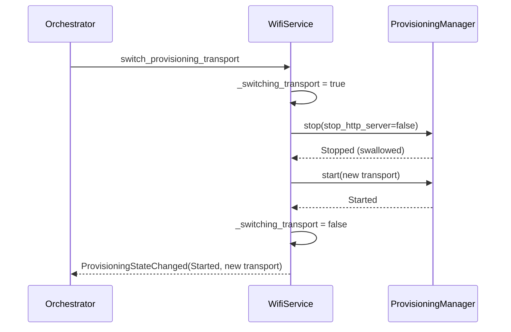

# Wi-Fi Service

Product service that owns the Stationary networking lifecycle for AirGradient
Go: saved-credential STA connect, factory-default fallback, interactive
provisioning (BLE / Wi-Fi captive portal), post-online disconnect state, and
credential clearing. The orchestrator owns mode policy and event routing;
`WifiService` owns the mechanics, deadlines, and callback adapters. Active
only in `OperatingMode::Stationary`.

## Files

| File | Purpose |
|---|---|
| `products/go/main/go_wifi.h` | `WifiService` class declaration, `Deps` and `Config` structs, public action and state APIs |
| `products/go/main/go_wifi.cpp` | Callback adapters, saved-credential / fallback connect, provisioning lifecycle, deadline tick, event posting |
| `products/go/main/go_wifi_types.h` | `ProvisioningEventPayload` struct shared with `go_events.h` |

## Dependencies

| Dependency | Source | Usage |
|---|---|---|
| `WifiManager` | `airgradient-wifi` (`services/wifi_manager.h`) | STA mode, connect / disconnect, saved-networks store, callbacks |
| `ProvisioningManager` | `airgradient-provisioning` (`services/provisioning_manager.h`) | BLE / Wi-Fi captive portal provisioning transports |
| `AgBleServer` | `airgradient-ble` (`hal/ble_server.h`) | Borrowed BLE server reused by the BLE provisioning transport |
| `HttpServer` | `airgradient-http-server` (`hal/http_server.h`) | Borrowed HTTP server used by the Wi-Fi captive portal transport |
| `WifiStaticIpConfig`, `WifiDisconnectReason`, `WifiStaConfig` | `airgradient-wifi` (`types/wifi_types.h`) | Static IP, disconnect reasons, STA config |
| `ProvisioningTransport`, `ProvisioningEventInfo`, `ProvisioningConfig` | `airgradient-provisioning` (`types/provisioning_types.h`) | Transport selector and event payloads |
| `Event`, `EventType` | product (`go_events.h`) | Posts `WifiConnected`, `WifiDisconnected`, `ProvisioningStateChanged` to the orchestrator queue |
| `RTOS` | `airgradient-common` (`rtos.h`) | Queue send, time query for deadlines |

## Public API

`WifiService` is constructed once by `GoApp` at boot, borrows three shared
radio objects via the `Deps` struct, and stays alive for the lifetime of the
process. All action methods are intended to be called from the orchestrator
task. State queries are lock-free (atomics) and safe from any task.

| Method | Returns | Purpose |
|---|---|---|
| `WifiService(event_queue, deps, cfg)` | — | Construct with the central event queue, the borrowed radio dependencies, and the per-product config (AP SSID / password, BLE identity, connection windows). Installs Wi-Fi callbacks initially and installs the provisioning event callback once for the service lifetime. |
| `has_saved_networks()` | `bool` | True when at least one network is saved. Delegates to `WifiManager`. |
| `connect_with_saved_credentials(static_ip)` | `void` | Restore Wi-Fi callbacks, arm the initial-connect deadline, and call `WifiManager::connect` with an empty SSID (auto-connect from saved networks: best-RSSI scan + single-attempt failover). Applies `static_ip` when non-null, clears it otherwise. Resets the online latches (fresh bring-up). Posts a synthetic `WifiDisconnected` when the manager returns `NotFound`. |
| `schedule_reconnect(static_ip)` | `void` | Arm the runtime reconnect timer `reconnect_delay_ms` from now. Unlike the bring-up connect it preserves the `has_been_online()` latch and does not arm the connect window; the reconnect is issued from `tick()`. No-op when no networks are saved. Used by the orchestrator for runtime disconnects. |
| `try_default_fallback_credentials()` | `void` | Restore Wi-Fi callbacks, then single-shot STA connect to the factory-default AP (`airgradient` / `cleanair`). The explicit SSID makes the connect transient, so nothing is written to the saved-networks store. Bounded by the fallback window. |
| `start_provisioning(transport)` | `void` | Cancel any in-flight STA connect, zero the deadline, and bring the requested provisioning transport up. Defaults to `BleOnly`. |
| `switch_provisioning_transport()` | `void` | Back-to-back stop / start that flips the active transport. The intermediate `Stopped` event is swallowed so the orchestrator does not see a transient teardown. The HTTP server stays bound across the switch. |
| `stop_provisioning()` | `void` | Tear down the active provisioning transport. Blocks for the component's internal `POST_CONNECT_HOLD_MS` (~1.5 s) when called after `Connected`. Reinstalls the Wi-Fi callbacks so post-online disconnects route back to this service. |
| `shutdown()` | `void` | Stop provisioning if active, drop STA, set Wi-Fi mode `Off`, detach Wi-Fi callbacks, and reset online latches. Called by the orchestrator when leaving Stationary mode. |
| `clear_credentials()` | `void` | Erase all saved networks (`WifiManager::clear_networks`) and reset the online latches. Used by factory reset. |
| `is_online()` | `bool` | True after the first IP for the current attempt; cleared on disconnect. |
| `is_connecting()` | `bool` | True while the initial-connect or fallback deadline is armed and no IP has been observed. |
| `is_provisioning()` | `bool` | True while a transport is active. |
| `current_transport()` | `ProvisioningTransport` | Active transport (only meaningful while `is_provisioning()`). |
| `ip()` | `uint32_t` | Last observed IP (network byte order). 0 when not online. |
| `rssi()` | `int` | Snapshot RSSI from `WifiManager`. |
| `last_disconnect_reason()` | `WifiDisconnectReason` | Last reported disconnect reason (defaults to `unknown` on construction). |
| `has_been_online()` | `bool` | Latches true on the first IP for the current Stationary entry. Reset by `shutdown()`, `clear_credentials()`, and fresh STA connect attempts. The orchestrator gates the disconnect policy on this flag. |
| `next_deadline_ms()` | `uint32_t` | Nearer of the initial-connect / fallback window and the runtime reconnect timer, or 0 when neither is armed. Drives `Orchestrator::compute_queue_timeout_ms()`. |
| `tick(now_ms)` | `void` | Consume the pending deadline-clear latch (set by `on_got_ip`), fire a synthetic `WifiDisconnected{connection_lost}` if the connect window expires, and issue the saved-network reconnect when the runtime reconnect timer expires. Called from `Orchestrator::check_timers()`. |

See [`go_wifi.h`](../main/go_wifi.h) for full signatures.

## Construction

`GoApp` constructs `WifiService` after the shared radio objects are
available from the board, alongside `BleService`:

```cpp
WifiService::Deps deps{
    _board.wifi_manager(),
    _board.ble_server(),
    _board.http_server(),
};
WifiService::Config cfg{};
cfg.ap_ssid              = "airgradient-<12-hex>";   // built from serial
cfg.ble_device_name      = "AirGradient Go <last4>"; // same name as Portable
cfg.ble_manufacturer_data = "P-1PSG#<12-hex>";       // built from serial
cfg.ble_model_name        = "P-1PSG";
// ble_serial_number, ble_firmware_version come from the board
auto *wifi = new WifiService(event_queue, deps, cfg);
```

See [`go_app.cpp`](../main/go_app.cpp) for the runtime wiring of both
interactive and button-wake boot paths.

`BleService` and `WifiService` borrow the same `AgBleServer`. The
orchestrator enforces mutual exclusion: Portable mode owns the server
through `BleService`; Stationary provisioning owns it through the
borrowed `ProvisioningManager`. Mode changes always tear down the
outgoing owner before bringing up the incoming one.

`WifiService` owns the **Stationary** `ProvisioningManager` instance.
Portable mode has its own separate manager instance inside
`PortableWifiProvisioner` (the attached transport — see
[`portable_provisioner.md`](portable_provisioner.md)). The two managers
never run concurrently (Portable and Stationary never overlap); the only
cross-mode seam is persisted state (the saved-networks store plus
`static_ip` / `disable_cloud`).

## Config

`WifiService::Config` carries everything that can vary per product.
Defaults are listed where they exist; the rest come from `GoApp`.

| Field | Default | Notes |
|---|---|---|
| `ap_ssid` | — (required) | Captive-portal AP SSID; `GoApp` builds `"airgradient-<MAC>"` from the device serial |
| `ap_password` | `"cleanair"` | Captive-portal AP password; also passed into `UIManager::Config::ap_password` so the Provisioning page's Wi-Fi QR (`WIFI:` descriptor) and instruction line use the same string |
| `ap_channel` | `1` | Captive-portal AP channel |
| `ble_device_name` | `"AirGradient"` | BLE advertised name during provisioning; `GoApp` overrides it to `"AirGradient Go <last4>"` (via `compute_ble_adv_name()`) so Stationary provisioning matches the Portable name |
| `ble_model_name` | — | DIS Model Number (set by `GoApp` to `"P-1PSG"`) |
| `ble_serial_number` | — | DIS Serial Number string (board MAC) |
| `ble_firmware_version` | — | DIS Firmware Revision string |
| `ble_manufacturer_data` | — | BLE manufacturer data after the company ID prefix |
| `ble_auth_flags` | `AgBleAuth::SC` | Just Works Secure Connections, no BOND, no MITM |
| `initial_connect_window_ms` | `30000` | Saved-credentials connect window |
| `fallback_ssid` | `"airgradient"` | Factory-default fallback AP |
| `fallback_password` | `"cleanair"` | Factory-default fallback AP password |
| `fallback_connect_window_ms` | `15000` | Factory-default fallback window upper bound |
| `reconnect_delay_ms` | `5000` | Delay between runtime reconnect cycles (after the first online) |

The provisioning BLE transport is configured for one-shot Wi-Fi
onboarding: `NO_INPUT_NO_OUTPUT` IO capability and `AgBleAuth::SC` only
(no BOND, no MITM). Portable BLE keeps its stronger `DISPLAY_ONLY` +
`BOND | MITM` configuration; the two transports do not share security
state, and Stationary provisioning never weakens or replaces an existing
Portable bond.

## Behavior

### Connection Lifecycle

```mermaid
stateDiagram-v2
    [*] --> Off
    Off --> ConnectingSaved: connect_with_saved_credentials
    Off --> TryingFallback: try_default_fallback_credentials
    ConnectingSaved --> Online: on_got_ip
    ConnectingSaved --> Off: shutdown
    ConnectingSaved --> Off: deadline expires (synthetic connection_lost)
    TryingFallback --> Online: on_got_ip
    TryingFallback --> Off: deadline expires
    Off --> Provisioning: start_provisioning
    Provisioning --> Online: ProvisioningEvent::Connected
    Provisioning --> Off: stop_provisioning
    Online --> Reconnecting: on_disconnected (runtime)
    Reconnecting --> Online: on_got_ip
    Reconnecting --> Reconnecting: reconnect cycle fails
    Online --> Off: shutdown
    Reconnecting --> Off: shutdown
```

The service does not store an explicit state enum. State is reconstructed
from three atomics (`_online`, `_has_been_online`, deadline) plus the
`_provisioning_active` flag. The diagram above is the intended lifecycle
the orchestrator's policy keys off.

### Saved-Credentials Connect

`connect_with_saved_credentials()` calls `WifiManager::connect()` with an
empty SSID. The manager interprets that as auto-connect from its saved
networks (scan, rank by RSSI, single-attempt failover) or returns
`WifiStatus::NotFound` when no networks are saved. `NotFound` is converted
to a synthetic `WifiDisconnected{no_ap_found}` event so the orchestrator's
normal disconnect routing applies. Other non-OK statuses post a synthetic
`WifiDisconnected{unknown}`.

The initial-connect deadline is armed only when the manager accepts the
request (returns `Ok`). The deadline is single-writer: only
`shutdown()`, `connect_with_saved_credentials()`,
`try_default_fallback_credentials()`, and `tick()` mutate it. The IP
callback signals a pending clear via the `_clear_deadline_pending`
atomic, which the next `tick()` consumes — keeping the deadline write
off the Wi-Fi event-task thread.

### Factory-Default Fallback

`try_default_fallback_credentials()` connects with an explicit SSID, which
the manager always treats as a transient connect — the saved-networks store
is never written. (The HAL forces `WIFI_STORAGE_RAM` once at init, so
ESP-IDF never persists STA credentials either.) The attempt is single-shot
(`max_retry_count = 0`); if it fails or the fallback window expires the
disconnect policy opens provisioning.

### Runtime Reconnect

After the first successful IP (`has_been_online()` latched), a disconnect
is a _runtime_ event: the orchestrator calls `schedule_reconnect()`
instead of opening provisioning. The service arms a `reconnect_delay_ms`
(5 s) timer; when `tick()` fires it, the service re-issues the saved-
network connect through the shared `_connect_saved_internal()` helper
with `reset_online_latches = false` and `arm_window = false`. Preserving
the `has_been_online()` latch keeps subsequent failures routing back to
the runtime branch (reconnect), never the bring-up provisioning branch.

Within each reconnect cycle the `WifiManager` applies its own retry /
backoff for retriable reasons (including `no_ap_found`); when it gives up
it emits a terminal disconnect, which schedules the next cycle. The fixed
inter-cycle delay also spaces out instant-fail reasons (`auth_failed`,
`assoc_failed`, `dhcp_failed`) so they cannot tight-loop the radio. The
loop continues indefinitely — runtime never gives up and never
provisions. `schedule_reconnect()` is a no-op when no networks are saved
(a fallback-only session has nothing to reconnect to).

**Tradeoff — delayed failover to a second saved network.** When the
connected AP dies, `WifiManager` first spends its full
`STATIONARY_MAX_RETRY_COUNT` (3) retry/backoff budget on the _latched
winning AP_ before emitting the terminal disconnect that triggers
`schedule_reconnect()`. Only the reconnect cycle re-scans and ranks all
saved networks, so a different saved SSID is not considered until that
budget is spent — roughly 45 s with the default backoff before failover
begins (the budget was lowered from 5 to 3 to shorten this). This still
favours recovering the _same_ AP (e.g. a router reboot) over fast
failover. During that window `WifiManager` reports itself online, so the
status-bar Wi-Fi icon shows connected and cloud posts keep failing
(`Host is unreachable`); both flip once the terminal disconnect fires —
`on_wifi_disconnected()` disarms cloud and repaints the disconnected
glyph. Surfacing the L2 drop sooner (so the icon and cloud track the
outage immediately) would need a `WifiManager` link-down notification —
intentionally deferred.

### Provisioning Start

`start_provisioning()` first calls `WifiManager::disconnect()`
unconditionally so any in-flight STA connect releases the Wi-Fi callback
slots cleanly. The call is idempotent — a `Disconnected` manager state
returns `Ok` without side effects, and an in-flight `Connecting` state
has its retry timer cancelled and its driver-echo disconnect swallowed
through `WifiManager`'s `_disconnect_requested` latch. The
`requested_by_user` event the manager emits on this path is ignored by
`WifiService::_on_disconnected()`.

`start_provisioning()` also zeros the initial-connect deadline before
handing the Wi-Fi callbacks to `ProvisioningManager::start()`. Without
this, a fast credential-class fail during the preceding STA attempt
could leave a stale armed deadline that fires mid-provisioning and
synthesizes an unwanted `WifiDisconnected{connection_lost}`.

When `_start_provisioning_internal()` succeeds the service marks
`_provisioning_active = true` and remembers the active transport.
`ProvisioningManager::set_on_event` is installed once at construction
and stays installed for the lifetime of the service.

### Transport Switching

`switch_provisioning_transport()` is implemented as back-to-back
`ProvisioningManager::stop(stop_http_server = false)` + `start()` with
the new transport. A `_switching_transport` latch swallows the
intermediate `Stopped` event so the orchestrator does not interpret the
switch-internal teardown as a user abort:



`stop_http_server = false` keeps the borrowed HTTP server bound across
the switch so the product does not pay a bind / unbind cycle. The new
transport's `_transport` value is set before `start()` so any `Started`
event fired during the inner start carries the destination transport
and not the stale source. If `_prov->start()` returns false the service
rolls `_transport` back, clears the latch, marks
`_provisioning_active = false`, and synthesizes a
`Stopped(ProductRequested)` so the orchestrator's existing
"Stopped before online -> change_mode(Portable)" rule rescues the user.

### Callback Ownership

`ProvisioningManager::start()` installs its own callbacks on the
borrowed `WifiManager` and `stop()` clears them. The service follows a
strict ownership rule:

- `WifiService` owns `on_got_ip` and `on_disconnected` at all times
  outside an active provisioning session.
- `ProvisioningManager` owns those slots while a session is active.
- `ProvisioningManager::set_on_event` is installed once by the
  constructor and never reassigned.

`stop_provisioning()` calls `_install_wifi_callbacks()` after the
component returns so post-online disconnects and `shutdown()` continue
to route through `WifiService`. `shutdown()` calls
`_detach_wifi_callbacks()` so the orchestrator never sees a callback
firing after the service has been told to tear down.

Fresh STA entry paths (`connect_with_saved_credentials()` and
`try_default_fallback_credentials()`) also call `_install_wifi_callbacks()`.
This restores callback ownership after a same-runtime
Stationary -> Portable -> Stationary cycle; without it ESP-IDF can acquire
an IP while the product service never sees `got_ip`, leaving the initial
connect deadline armed until it incorrectly opens provisioning.

While provisioning owns the Wi-Fi callback slot,
`ProvisioningEvent::Connected` is the online transition.
`_on_provisioning_event()` mirrors what `on_got_ip` would have latched
(`_ip`, `_online`, `_has_been_online`, `_rssi`) before forwarding the
event so the orchestrator's `has_been_online()` check reads true on the
subsequent `Stopped` teardown.

## Events

`WifiService` is the sole producer of three event types on the central
queue. All events are consumed by `Orchestrator::dispatch()`.

| EventType | Payload | Producer path |
|---|---|---|
| `WifiConnected` | `uint32_t wifi_ip` (network byte order) | `_on_got_ip()` after a successful STA association outside provisioning |
| `WifiDisconnected` | `uint8_t wifi_disconnect_reason` (`WifiDisconnectReason`) | `_on_disconnected()` for every reason except `requested_by_user`, plus synthetic `connection_lost` from `tick()` on deadline expiry and synthetic `no_ap_found` / `unknown` on connect rejection |
| `ProvisioningStateChanged` | `ProvisioningEventPayload prov` | `_on_provisioning_event()` for every `ProvisioningEvent`, minus the swallowed mid-switch `Stopped` |

`ProvisioningEventPayload` (`products/go/main/go_wifi_types.h`)
carries `disable_cloud` and `static_ip` inline so the orchestrator can
persist them without querying live service state after the event.
`static_ip` is zeroed when the user selected DHCP.

## Timer Integration

The service owns the initial-connect / fallback deadline. The
orchestrator drives the clock:

```cpp
// In Orchestrator::compute_queue_timeout_ms()
uint32_t wifi_deadline = _svc.wifi.next_deadline_ms();
if (wifi_deadline != 0) {
    next = std::min(next, wifi_deadline - now);
}

// In Orchestrator::check_timers()
_svc.wifi.tick(static_cast<uint32_t>(RTOS::get_time_ms()));
```

`tick(now_ms)` first consumes `_clear_deadline_pending` (set by the IP
callback) to clear the armed connect-window deadline, then checks whether
it has expired without an IP. On expiry it posts a synthetic
`WifiDisconnected{connection_lost}` and the orchestrator's disconnect
policy opens provisioning. `tick()` then checks the separate runtime
reconnect timer and, on expiry, issues the saved-network reconnect.

The service holds two independent timers — the connect window and the
runtime reconnect timer — and `next_deadline_ms()` returns the nearer of
the two (treating 0 as "not armed"). The bring-up connect window and the
runtime reconnect timer are never armed at the same time: the window
belongs to a pre-online attempt, the reconnect to a post-online one.

The shutdown / connect / fallback paths all zero the connect deadline
before re-arming it, and `shutdown()` / `start_provisioning()` also zero
the reconnect timer. The result is a single-writer invariant: each timer
is mutated only by the orchestrator task, and cleared by the same task
that armed it.

## Edge Cases / Errors

- **No saved networks at boot.** `connect_with_saved_credentials()`
  short-circuits through `NotFound` and synthesizes a `no_ap_found`
  disconnect; the orchestrator opens provisioning per its before-online
  disconnect policy.
- **STA connect rejected by HAL.** Any non-OK / non-NotFound `connect`
  status synthesizes a `WifiDisconnected{unknown}`. The deadline is not
  armed (no spurious tick-driven event).
- **Fallback AP missing.** The fallback attempt has no auto-retry
  (`max_retry_count = 0`). On disconnect the orchestrator routes per
  policy; on timeout `tick()` synthesizes `connection_lost`.
- **`requested_by_user` disconnect.** Emitted by the manager during the
  service's own `disconnect()` / `shutdown()` path. Ignored explicitly
  in `_on_disconnected()`.
- **Mid-switch `Stopped` event.** Swallowed via `_switching_transport`
  latch so the orchestrator's "Stopped before online" rule does not
  bounce out of provisioning.
- **`start()` failure during transport switch.** Synthesizes a
  `Stopped(ProductRequested)` event so the orchestrator's existing
  fall-back-to-Portable rule rescues the user.
- **Late events after `shutdown()`.** Callbacks are detached in
  `shutdown()`, so no event posts after the service is torn down. The
  orchestrator also gates `on_wifi_connected()` and
  `on_wifi_disconnected()` on `_mode == Stationary` to ignore strays.
- **Cold-boot Stationary with no saved networks.** The board's
  `init_wifi_subsystem()` runs lazily on first `enter_stationary()`
  call; constructing `WifiService` against an uninitialized HAL is safe
  because the constructor only installs `std::function` callbacks.

## Notes

- The deadline write is single-writer by construction; the IP callback
  only signals a pending clear via `_clear_deadline_pending` instead of
  touching the deadline directly. This keeps the deadline value off the
  Wi-Fi event-task thread.
- Atomic state mirrors (`_online`, `_has_been_online`, `_ip`, `_rssi`,
  `_last_disconnect_reason`) allow lock-free reads from the orchestrator
  task without coordination with the event-task thread.
- `STATIONARY_MAX_RETRY_COUNT = 3` (file-local in `go_wifi.cpp`)
  bounds the auto-retry budget per saved-credentials connect cycle (both
  the bring-up attempt and each runtime reconnect cycle). Kept low so a
  runtime dead-AP drop reaches the terminal disconnect promptly.
  Provisioning overall timeout is disabled (`0`).
- Transport selection is not persisted; every Stationary entry starts
  on `ProvisioningTransport::BleOnly`.
- Provisioning lifecycle paths emit `log_heap()` probes around transport
  start, stop, and BLE / Wi-Fi transport switching. These are target-only
  diagnostics for tracking contiguous heap pressure during Stationary setup.
- **WiFi pull OTA** rides this Stationary link but is owned by the orchestrator,
  not `WifiService`. The orchestrator gates its hourly OTA check on
  `is_online() && !_setup_session_active`, pauses cloud around it, and never runs
  it concurrently with provisioning or a download — `is_online()` is the single
  readiness signal it consults. A mid-download Wi-Fi drop surfaces as the OTA
  source read failing (`TransportError`); the service's normal disconnect
  routing still applies once the blocked transfer returns. See
  [`ota_service.md`](ota_service.md) and
  [`orchestrator.md` → OTA](orchestrator.md#firmware-update-ota).

## Testability

`WifiService` is host-testable via friend-class access
(`WifiServiceTestAccess`) and link-time stubs for `WifiManager`,
`ProvisioningManager`, `AgBleServer`, and `HttpServer`. Host tests live
in `products/go/tests/go_wifi.tests.cpp` and cover:

- Saved-credentials connect, including `NotFound` synthesizing a
  disconnect, deadline arming, and the IP callback latching the
  deferred clear.
- Factory-default fallback connect (transient, never saved), single-shot
  retry budget, and deadline expiry synthesizing `connection_lost`.
- Provisioning start (cancels in-flight STA, zeros deadlines, installs
  config), stop (reinstalls Wi-Fi callbacks), and switch (swallows the
  intermediate `Stopped`, synthesizes one on start failure).
- Online latches around `ProvisioningEvent::Connected` so
  `has_been_online()` reads true on the subsequent `Stopped`.
- Runtime reconnect: `schedule_reconnect()` arms the reconnect timer,
  `tick()` issues the saved connect without resetting `has_been_online()`,
  the no-op when no networks are saved, and `next_deadline_ms()` returning
  the nearer of the two timers.
- Shutdown path (detaches callbacks, zeroes latches, sets mode `Off`).

The orchestrator tests in `products/go/tests/go_orchestrator.tests.cpp`
drive the higher-level mode-policy interactions against a stubbed
`WifiService`.
