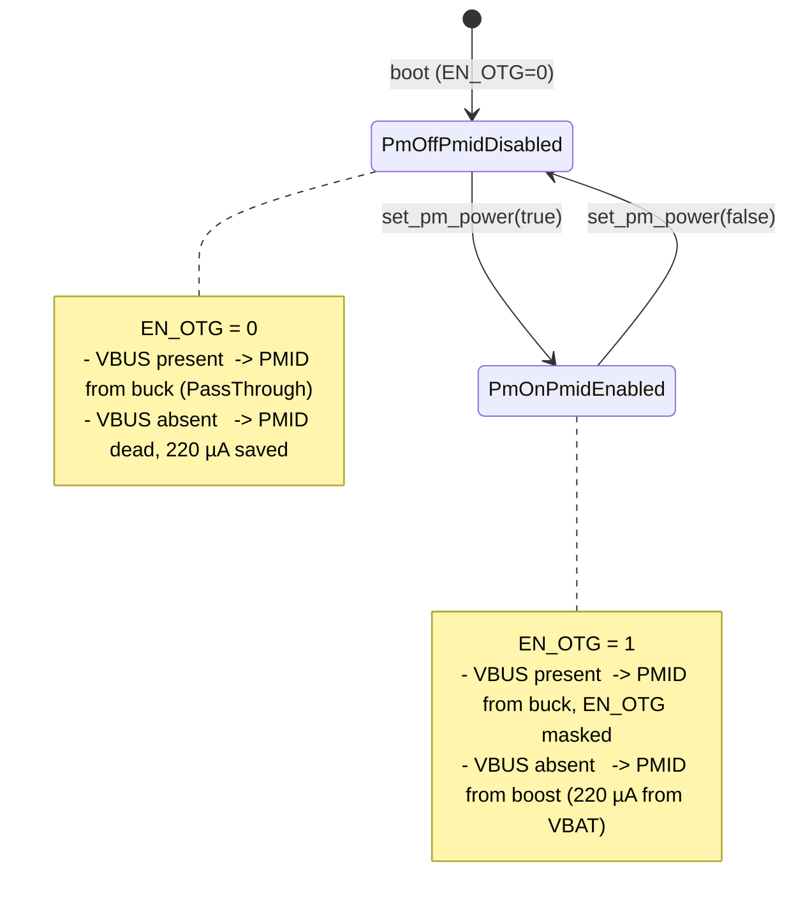

# BMS Cross-Board Improvements Spec

> **This is a spec.** It describes how a set of BMS behavior changes
> **will be built**, not what currently exists. Once shipped, the
> corresponding component and service docs become the source of truth and
> this spec is deleted.

Ship a set of BMS behavior changes that apply to **both** the existing
prototype board and the future v1 board, with no runtime variant
detection involved. Three families share one motivation — make the
existing BMS hardware more correct and more efficient — and one
constraint — work on both boards without conditional branches. The
changes are: cell safety trips (over-discharge, over-temperature),
PMID-rail power-efficiency rewrite (couple boost-converter enable to
actual PM-sensor demand rather than to USB plug state), and three new
`BmsDevice` HAL virtuals that later checkpoints will consume.

## Problem

Three independent issues on `go/feat/board_v1` HEAD today:

- **No cell-protection trip path.** On battery and unattended, AGo runs
  the cell down to ≈ 2.4 V where the in-pack DW01 protection opens
  `PACK+`. Repeated DW01 trips degrade the cell. Once v1 ships, the same
  trip also POR's the BQ27427 fuel gauge (BAT pin is upstream of the
  BATFET), wiping learned Qmax / Ra. There is no firmware-side guard
  that brings the system down gracefully before either failure mode.
- **PMID boost wastes battery whenever USB is unplugged.**
  `PowerService::sync_pmid_mode()` flips PMID to `Boost` (i.e. writes
  `EN_OTG = 1` on the BQ25629) any time the power source is not an
  external input — regardless of whether anything downstream is actually
  drawing from PMID. The BQ25629 datasheet (§7.5, `I_Q_BOOST` row)
  specifies **220 µA typ from VBAT** for boost-on with no PMID load.
  That overhead is fleet-wide on every prototype shipped today, and
  dominates baseline current when the device is in deep sleep
  (ESP32-C5 deep-sleep budget is sub-50 µA — adding 220 µA is a ~5×
  increase). At 2000 mAh that alone is ~378 days of continuous drain
  for zero downstream work.
- **`BmsDevice` HAL is missing primitives that later work needs.**
  No way to programmatically stop charging
  (`set_charge_enable`), no way to change the fast-charge current
  (`set_charge_current_ma`), no way to deliberately collapse PMID
  (`set_pmid_enabled`). Two of these are required by the Charge Cutoff
  / Charge Current admin UX work later; the third is the primitive the
  PMID rewrite is built on.

## Goals

- Trip BMS ship-mode when the cell over-discharges (debounced cell
  voltage below the EDV threshold while on battery) — protects the cell
  and, on v1, the fuel gauge's learned state
- Trip BMS ship-mode when the battery NTC reports an over-temperature
  condition (debounced) — protects the cell
- Drop boost-converter quiescent current to zero during PM-off windows
  by coupling PMID enable to PM-sensor demand, not USB plug state.
  Bench-measured drain reduction is the merge gate
- Extend `BmsDevice` with four new **pure** virtuals
  (`set_charge_enable`, `set_charge_current_ma`, `set_pmid_enabled`,
  `set_watchdog_timeout_ms`). Real implementations live in `BQ25629Bms`;
  existing test mocks gain overrides as needed. `PowerService` gains a
  matching public wrapper for `set_watchdog_timeout_ms` so future
  callers can re-configure the BMS watchdog without reaching through
  the HAL directly
- Work identically on prototype and v1 hardware without any runtime
  variant check
- No regression on the today-known-good behaviors: charging while
  plugged-in still works, PM sensor still powers correctly, telemetry
  cadence unchanged

## Non-Goals

- This spec does **not** add runtime board-variant detection or any
  variant-conditional code paths — that is spec 2's job
- It does **not** add the BQ27427 fuel gauge driver, integration, or
  any FG-derived behavior — that is spec 3's job
- It does **not** wire the `set_charge_enable` / `set_charge_current_ma`
  virtuals to any UX — Charge Cutoff toggle, Charge Current admin row,
  and Battery Learning Mode are later checkpoints
- It does **not** add admin mode, the touch feedback layer, the buzzer
  service, or any other UX work that the partner branch carries
- It does **not** change the BMS telemetry poll cadence
  (`BMS_POLL_INTERVAL_MS` stays at 60 000) or the status poll cadence
  (`BMS_STATUS_POLL_INTERVAL_MS` stays at 5 000). The partner's cadence
  changes existed to support FG log visibility and PMID-recovery
  latency; neither rationale applies under this spec's PMID model
- It does **not** add `BmsTelemetry` fields beyond `battery_temperature_c`

## Design

### Family A — Cell safety trips

Both trips share a structure: an over-threshold condition, a debounce
counter, and a one-shot ship-mode call that uses the existing
`BmsDevice::enter_ship_mode()` primitive. The trip is wired in
`PowerService::poll_bms()`, so it runs once per `BMS_POLL_INTERVAL_MS`
(60 s). Neither trip is admin-gated, neither is variant-gated; both
protect every shipped unit.

```cpp
// products/go/main/go_power.h — additions in PowerService private section
static constexpr uint16_t EDV_SHIP_THRESHOLD_MV = 2900;
static constexpr int      EDV_SHIP_DEBOUNCE_SAMPLES = 3;

static constexpr int16_t  OT_SHIP_THRESHOLD_C = 60;       ///< See open Q
static constexpr int      OT_SHIP_DEBOUNCE_SAMPLES = 3;

int   _edv_low_count = 0;
bool  _edv_ship_mode_triggered = false;
int   _ot_high_count = 0;
bool  _ot_ship_mode_triggered = false;
```

**EDV (over-discharge) rule (pseudo-code, runs inside `poll_bms()`
after `read_telemetry()` succeeds):**

```text
if (charger.power_source has no external input)
  and (telemetry.battery_voltage_mv < EDV_SHIP_THRESHOLD_MV)
  and (telemetry.is_battery_voltage_valid)
    _edv_low_count += 1
else
    _edv_low_count = 0

if (_edv_low_count >= EDV_SHIP_DEBOUNCE_SAMPLES
    and not _edv_ship_mode_triggered)
    log "EDV trip: cell <2.9V for 3 polls -> ship mode"
    _ship_mode_triggered = true
    _bms.enter_ship_mode()   // does not return on success
```

**OT (over-temperature) rule (same structure):**

```text
if (telemetry.is_battery_temperature_valid)
  and (telemetry.battery_temperature_c > OT_SHIP_THRESHOLD_C)
    _ot_high_count += 1
else
    _ot_high_count = 0

if (_ot_high_count >= OT_SHIP_DEBOUNCE_SAMPLES
    and not _ot_ship_mode_triggered)
    log "OT trip: cell >NN°C for 3 polls -> ship mode"
    _ot_ship_mode_triggered = true
    _bms.enter_ship_mode()
```

Why ship mode (not just shutdown):

- BQ25629 ignores ship-mode requests while VBUS is present, which is
  the desired behavior — we only want the EDV trip on battery
- BATFET opens, system power drops, load is removed, the cell relaxes —
  loaded 2.9 V recovers to ~3.0 V (safely above DW01 trip)
- On v1, the BQ27427's BAT pin is upstream of the BATFET, so the fuel
  gauge keeps its supply and its learned state when ship mode fires
- Identical primitive to the power-off button path (`shutdown()` →
  `enter_ship_mode()`) — well-understood code path

Debounce rides out transient load dips (Wi-Fi TX bursts, e-paper
refresh, buzzer). At 60 s × 3 samples that's a 3-minute window — more
than enough to ride out anything legitimate, fast enough to act before
DW01 trips at typical idle discharge rates.

A new field on `BmsTelemetry` carries the NTC reading:

```cpp
// components/airgradient-bms/types/bms_types.h — addition
struct BmsTelemetry {
  // ... existing fields ...
  int16_t battery_temperature_c = BmsInvalid::TEMPERATURE_C;

  bool is_battery_temperature_valid() const {
    return battery_temperature_c != BmsInvalid::TEMPERATURE_C;
  }
};
```

`BQ25629Bms::read_telemetry()` populates the new field via a new vendor
driver method:

```cpp
// components/bq25629/include/bq25629.h — addition
struct BQ25629_NTC_Data {
  float temperature_c;   ///< Steinhart-Hart, or -999.0f when out of range
};

esp_err_t read_ntc_temperature(BQ25629_NTC_Data &out);
```

When the NTC reading is out of the linear range (loose battery,
disconnected pack), the vendor driver returns `ESP_OK` with
`temperature_c = -999.0f`; the adapter leaves `battery_temperature_c`
at `BmsInvalid::TEMPERATURE_C` so `is_battery_temperature_valid()`
returns false and the OT trip cannot fire on garbage data.

### Family B — PMID-rail power-efficiency rewrite

Today's model: `PowerService::sync_pmid_mode(power_source)` watches the
charger's `power_source` and writes `EN_OTG` to track USB plug state:
plugged → `PassThrough` (EN_OTG=0), unplugged → `Boost` (EN_OTG=1).
The boost stays armed forever once unplugged, costing 220 µA from VBAT
regardless of whether PMID has any load.

New model: PMID enable is a function of **PM-sensor demand**, not
charger state.

```text
PM ON  -> EN_OTG = 1   (chip masks while VBUS present; boost engages on unplug)
PM OFF -> EN_OTG = 0   (boost dead -> 220 µA saved; PMID still alive via buck when VBUS present)
```

When VBUS is present, PMID comes from the buck (PassThrough) regardless
of `EN_OTG` — the chip masks `EN_OTG` internally while VBUS is detected.
So `EN_OTG = 0` while plugged-in produces identical PMID behavior to
today. The only behavioral change is on battery with PM off: PMID
collapses and the 220 µA goes away.



**The `BmsDevice` HAL gains a thin primitive:**

```cpp
// components/airgradient-bms/hal/bms_device.h — addition
class BmsDevice {
public:
  // ... existing virtuals ...

  /// Enable or disable the PMID boost converter.
  ///   true  -> arms boost (writes EN_OTG=1).  PMID comes from boost
  ///           when VBUS is absent; chip masks internally when VBUS is
  ///           present.
  ///   false -> disables boost (writes EN_OTG=0).  PMID stays alive
  ///           via buck while VBUS is present; collapses on unplug.
  /// Single I²C write, no settling delay, no policy.
  /// @return true on success.
  virtual bool set_pmid_enabled(bool) = 0;
};
```

**`BQ25629Bms` implementation:**

```cpp
bool BQ25629Bms::set_pmid_enabled(bool enable) {
  esp_err_t err = _charger.enable_otg(enable);
  if (err != ESP_OK) {
    ESP_LOGW(TAG, "set_pmid_enabled(%s) failed: %s",
             enable ? "true" : "false", esp_err_to_name(err));
    return false;
  }
  _pmid_enabled = enable;
  return true;
}
```

**Init sequence** keeps the existing preparatory writes (HIZ off, TS
check on, VOTG = 5100, EN_BYPASS_OTG = 0) so the boost is _ready_ but
disarmed. The current `configure_pmid_mode()` call inside `init()` is
replaced by an explicit `set_pmid_enabled(false)` so boot state is
unambiguous: PMID off until `PowerService` asks for it. The watchdog
configuration stays at `Disable` (which is what the code actually does
today — the source comment claiming `Extend to 200s` is stale and is
fixed as a drive-by in step 7). Under the demand-coupled PMID model
this remains a safe default: were a future operator to re-enable the
watchdog via the new `set_watchdog_timeout_ms` API, an auto-clear of
`EN_OTG` on watchdog expiry would still be harmless because the next
`set_pmid_enabled(true)` call re-arms.

**`PowerService` coupling:**

```cpp
void PowerService::set_pm_power(bool on) {
  if (_config.pin_pm_power < 0) {
    return;
  }
  if (on) {
    if (!_bms.set_pmid_enabled(true)) {
      AG_LOGW(TAG, "set_pm_power: set_pmid_enabled(true) failed");
      // Continue: EN_PM write below still happens.  An I²C-level
      // failure here is rare; logging it is the right action.  The
      // PM sensor will then simply not see +5 V and its own init will
      // fail downstream, which is recoverable.
    }
    RTOS::delay_ms(PM_PMID_SETTLE_MS); // see open Q on value
    _gpio.set_level(_config.pin_pm_power, _config.pm_power_on_level);
    AG_LOGI(TAG, "set_pm_power: ON (PMID armed)");
  } else {
    _gpio.set_level(_config.pin_pm_power,
                    _config.pm_power_on_level ? 0 : 1);
    if (!_bms.set_pmid_enabled(false)) {
      AG_LOGW(TAG, "set_pm_power: set_pmid_enabled(false) failed");
    }
    AG_LOGI(TAG, "set_pm_power: OFF (PMID disarmed)");
  }
}
```

`_config.pm_power_on_level` is the existing/spec-2 field — its default
of `1` keeps prototype behavior; spec 2 sets it to `0` for v1. This
spec only consumes the field; it does not introduce the variant
detection that selects the value.

**`sync_pmid_mode()` removal.** The current method writes
`configure_pmid_mode()` based on `power_source`. Under the demand-coupled
model, plug state no longer drives PMID enable. The method is deleted
along with its call sites in `poll_bms()` and `poll_status()`. The
existing `BmsDevice::configure_pmid_mode()` virtual is also removed:
no caller remains, the BQ25629 adapter implementation goes away with
it, and the `BmsPmidMode` enum is no longer referenced (deletable, but
the enum's removal is optional cleanup outside this spec's must-do
list).

**Brick-risk argument.** The partner documented an `EN_OTG`-toggle-near-
USB-unplug latch path on v0.3 silicon. Under the demand-coupled model,
`EN_OTG` writes happen on `set_pm_power()` calls, which are user-driven
(entering Offline mode, starting / ending a measurement, sleep cycles)
and are uncorrelated with USB plug events. The probability of a
`set_pm_power()` call coinciding with a plug edge is vanishingly small.
We accept the residual risk.

### Family C — `BmsDevice` HAL virtuals

Three more thin pure virtuals join `set_pmid_enabled`:

```cpp
class BmsDevice {
public:
  // ... existing virtuals + set_pmid_enabled from above ...

  /// Enable or disable the battery charging current path.  When
  /// disabled the charger IC holds the cell at its current SOC but
  /// continues to power the system rail from VBUS.
  /// @return true on success.
  virtual bool set_charge_enable(bool) = 0;

  /// Set the fast-charge current limit (CC mode), mA.  Driver clamps
  /// to chip-supported range and granularity.
  /// @return true on success.
  virtual bool set_charge_current_ma(uint16_t) = 0;

  /// Configure the chip-level watchdog timeout.
  ///   timeout_ms == 0 -> watchdog disabled (chip never auto-clears
  ///                      EN_OTG on lost host).
  ///   timeout_ms  > 0 -> driver selects the closest chip-supported
  ///                      timeout value at or above the requested
  ///                      period.  Caller must then invoke
  ///                      update_watchdog() periodically inside that
  ///                      window or the chip will auto-clear EN_OTG
  ///                      and re-enter a safe state.
  /// @return true on success.
  virtual bool set_watchdog_timeout_ms(uint32_t timeout_ms) = 0;
};
```

These are pure virtuals because every BMS implementation we ship today
or expect to ship in the foreseeable future (BQ25629 family) supports
them natively. The existing `configure_pmid_mode()` default-false
precedent is being removed in step 7 of the implementation plan; this
spec settles on pure virtuals as the consistent HAL convention.

`BQ25629Bms` implementations are one-line wrappers around the existing
vendor driver's `enable_charging()`, `set_charge_current()`, and
`set_watchdog_timeout()` methods. `set_watchdog_timeout_ms` maps the
millisecond argument to the closest supported
`drivers::WatchdogTimeout` enum value (`Disable` for 0; otherwise the
smallest supported timeout >= requested).

**No in-spec caller for the charge virtuals** — Charge Cutoff toggle,
admin Charge Current row, and Battery Learning Mode wire these in
later checkpoints. The HAL surface settles here so later UX work
touches UX code only.

**`PowerService::set_watchdog_timeout_ms`.** Because the BMS watchdog
is a power-management concern (it gates the chip-level "lost host"
fail-safe), `PowerService` exposes a public wrapper so future
operators (Battery Learning Mode hardening, deep-sleep policy, factory
test fixtures) can change the timeout without reaching through the
HAL directly. The wrapper is a one-line forward to
`_bms.set_watchdog_timeout_ms(...)` and does not change the in-init
`Disable` default — `init()` still configures `Disable` at startup,
matching today's behavior.

```cpp
class PowerService {
public:
  // ... existing public API ...

  /// Re-configure the BMS watchdog timeout.  See
  /// BmsDevice::set_watchdog_timeout_ms for semantics.  Forwards
  /// directly; no policy or kick-cadence change is applied here.
  bool set_watchdog_timeout_ms(uint32_t timeout_ms);
};
```

### What this spec does not change

- `BMS_POLL_INTERVAL_MS` (60 000) and `BMS_STATUS_POLL_INTERVAL_MS`
  (5 000) — unchanged. Partner cadence changes existed to serve FG log
  visibility (out of scope) and PMID-recovery latency (irrelevant
  under the demand-coupled PMID model)
- BQ25629 `BQ25629_Config` defaults (`charge_current_ma = 500`,
  `charge_voltage_mv = 4200`, etc.) — unchanged
- BMS watchdog runtime state — stays at `Disable` (which is what the
  code actually does today; the misleading source comment claiming
  `Extend to 200s` is corrected as a drive-by in step 7). The new
  `set_watchdog_timeout_ms` HAL virtual + `PowerService` wrapper
  introduce the **ability** to change it later but do not change the
  in-init value
- `BmsTelemetry` fields other than the new `battery_temperature_c`
- `PowerService::Config` fields. The PM polarity field
  (`pm_power_on_level`) is added by spec 2; this spec only consumes
  the existing default-1 behavior on prototype

## Implementation Plan

Each step is a focused commit.

1. **Add `battery_temperature_c` to `BmsTelemetry`** plus
   `is_battery_temperature_valid()` helper. Adapter implementations
   leave it at `BmsInvalid::TEMPERATURE_C`. No behavior change yet.
2. **Add `read_ntc_temperature()` to the BQ25629 vendor driver** in
   `components/bq25629/`. Implement Steinhart-Hart on the TS ADC
   reading, return `temperature_c = -999.0f` outside the linear range,
   `ESP_OK` regardless so callers can distinguish "no NTC wired" from
   "read failed".
3. **Wire NTC into `BQ25629Bms::read_telemetry()`** — populate
   `battery_temperature_c` from `read_ntc_temperature()`; leave at
   invalid sentinel when the vendor driver returns the sentinel.
4. **Add four pure-virtual `BmsDevice` methods** (`set_pmid_enabled`,
   `set_charge_enable`, `set_charge_current_ma`,
   `set_watchdog_timeout_ms`). Implement all four in `BQ25629Bms` as
   one-line wrappers around the existing vendor driver, with
   `set_watchdog_timeout_ms` mapping its millisecond argument to the
   closest supported `drivers::WatchdogTimeout` enum value (`Disable`
   for 0). Add `PowerService::set_watchdog_timeout_ms(uint32_t)` as a
   thin forward to `_bms.set_watchdog_timeout_ms(...)`. Extend every
   existing `BmsDevice` mock with overrides — for Trompeloeil mocks
   this is a `MAKE_MOCK1(...)` line per method; simple test stubs gain
   a `return true;` body.
5. **Add EDV ship-mode trip** in `PowerService::poll_bms()` —
   threshold, debounce, log line, one-shot flag, gating on no-external-
   input. Add the trip-state members to `go_power.h`.
6. **Add OT ship-mode trip** in `PowerService::poll_bms()` — mirror of
   step 5 against `battery_temperature_c`.
7. **PMID rewrite — driver side.** In `BQ25629Bms::init()`, replace
   the `configure_pmid_mode()` call with the preparatory sequence
   (HIZ off, TS on, VOTG, BYPASS off) followed by an explicit
   `set_pmid_enabled(false)`. Delete the `configure_pmid_mode()`
   override; remove `BmsDevice::configure_pmid_mode()`; remove the
   `BmsPmidMode` enum if no other consumer remains. **Drive-by fix:**
   correct the stale `// Extend watchdog to 200s ...` comment above
   the `set_watchdog_timeout(Disable)` call to accurately describe
   the actual behavior ("Disable the chip-level watchdog; callers can
   re-configure via PowerService::set_watchdog_timeout_ms").
8. **PMID rewrite — PowerService side.** Replace `set_pm_power()` body
   with the demand-coupled sequence. Delete `sync_pmid_mode()` and its
   two call sites in `poll_bms()` and `poll_status()`. Delete the
   `_pmid_mode` member from `PowerService`.
9. **Update host tests** for the new `set_pm_power()` behavior — assert
   `set_pmid_enabled(true)` is called before the GPIO write on `true`
   and `set_pmid_enabled(false)` is called after the GPIO write on
   `false`. Add EDV and OT trip tests using `MockBmsDevice` and
   crafted telemetry sequences.
10. **Documentation.** Update
    `components/airgradient-bms/README.md` to describe the four new
    virtuals and the demand-coupled PMID contract. Update the
    `PowerService` service doc to describe the EDV / OT trips, the
    new `set_pm_power()` sequence, and the
    `set_watchdog_timeout_ms` wrapper. Remove any leftover references
    to `configure_pmid_mode` / `BmsPmidMode`.

Step ordering keeps the firmware buildable at every commit. Steps 1–4
are additive and ship invisible to the running system. Step 5 is the
first behavioral change (EDV trip). Steps 7–8 swap the PMID model in
one logical change and so should land as a single PR even if split
across two commits.

## Testing Strategy

### Host tests (must pass before merge)

- `go_power.tests.cpp::set_pm_power`
  - `set_pm_power(true)`: `set_pmid_enabled(true)` called exactly once
    before the GPIO write
  - `set_pm_power(false)`: GPIO drives off-level, then
    `set_pmid_enabled(false)` called exactly once
  - `set_pmid_enabled(true)` returning `false`: log the warning, still
    drive GPIO (degraded behavior, not a hard fail)
  - `pin_pm_power == -1`: neither `set_pmid_enabled` nor GPIO write
    occurs
- `go_power.tests.cpp::poll_bms_edv_trip`
  - 1 sample below 2.9 V: no trip
  - 2 samples below 2.9 V: no trip
  - 3 samples below 2.9 V: `enter_ship_mode()` called exactly once
  - 3 samples below 2.9 V followed by 1 above: counter resets;
    subsequent 3 below re-trip only if trigger flag is cleared (it
    isn't; one-shot is intentional)
  - VBUS present (external input): no trip even at 2.5 V
  - Invalid voltage sentinel: counter does not increment
- `go_power.tests.cpp::poll_bms_ot_trip`
  - Mirror of EDV trip tests against `battery_temperature_c`
  - Invalid temperature sentinel: counter does not increment
- `go_power.tests.cpp::set_watchdog_timeout_ms`
  - `PowerService::set_watchdog_timeout_ms(0)`: `_bms.set_watchdog_timeout_ms(0)`
    called exactly once with `0`
  - `PowerService::set_watchdog_timeout_ms(40000)`: forwards `40000`
    verbatim — no policy in the wrapper
  - Return value propagates: mock returns `false` -> wrapper returns
    `false`
- Every existing `BmsDevice` mock and stub gains overrides for the
  four new pure virtuals. Trompeloeil mocks add `MAKE_MOCK1(...)`
  lines; hand-written stubs return `true` from a minimal body. Tests
  that don't exercise the new methods don't need to set expectations

### ESP-IDF build

- `idf.py -C products/go build` must succeed
- No new Kconfig symbols
- No new managed components

### Hardware-in-the-loop (user-driven, gates merge)

- **Bench-measure boost Iq reduction.** On a prototype board:
  - Connect a current meter in series with VBAT
  - Set device to Offline mode, lock, force a sleep cycle, observe
    baseline current
  - Compare current branch HEAD (`EN_OTG=1` permanently on battery) vs
    this branch (`EN_OTG=0` while PM off)
  - Expected reduction: ~220 µA (datasheet typ)
  - Acceptance: measured reduction within ±50 µA of datasheet typ; no
    new disturbance on plug/unplug cycle
- **EDV trip end-to-end.** Run the device on battery to ≤ 2.9 V and
  confirm: ship mode fires within 3 × 60 s = 180 s of crossing the
  threshold; the device powers off cleanly; the cell relaxes to
  ~3.0 V loaded-off; the BATFET re-closes on USB plug-in
- **OT trip end-to-end.** Lab heat-soak the cell to above the threshold
  (or short the NTC to simulate); confirm same trip behavior. Skip if
  hardware fixture not available — datasheet threshold gives high
  confidence the code path is symmetric to EDV
- **PM sensor still warms up correctly** when `set_pm_power(true)` is
  called from a cold start: SPS30 produces a valid PM2.5 within 10 s
  of the call. Confirms the `PM_PMID_SETTLE_MS` delay is enough

## Open Questions

- **`PM_PMID_SETTLE_MS` value.** How long between `EN_OTG = 1` and the
  EN_PM GPIO write should `PowerService` wait? The BQ25629 boost soft-
  start is sub-millisecond in datasheet figures, but PMID rail
  capacitance + load-switch turn-on add up. Conservative starting
  value: 10 ms. Bench-verify the first SPS30 frame still arrives within
  the existing 10 s warmup budget. If 10 ms is insufficient, step up
  to 50 ms.
- **`OT_SHIP_THRESHOLD_C` value.** The cell datasheet's max operating
  temperature is the source of truth. The partner did not commit a
  specific number to the v0.3 branch (the over-temp trip is one of the
  post-analysis additions and uses a placeholder). Needs partner /
  cell-datasheet input before merge. Sensible bench default: 60 °C.
  Until the cell-spec answer is in, ship a `TODO`-marked default and
  let the safety reviewer override.
- **Bench-measurement scope.** Is measuring boost Iq on prototype
  alone enough, or do we want to repeat on v1 silicon before declaring
  the savings real? My take: measure on prototype now (datasheet is
  shared across the BQ25629 family); re-confirm on v1 when bring-up
  boards arrive but don't gate this merge on v1 availability.
- **`BmsPmidMode` enum fate.** With `configure_pmid_mode()` removed
  and `sync_pmid_mode()` deleted, the enum has no remaining caller.
  Removing it is pure cleanup. Spec includes the removal in step 7;
  flag if you'd rather keep it as harmless dead code for now.
- **EDV trip during USB-plugged → battery-only transition.** If the
  user unplugs while the cell is already at 2.85 V (worst case after a
  partial charge that never finished CV), the EDV trip will fire
  within 180 s. Acceptable? Alternative: extend the debounce to 5
  samples (5 minutes) at the cost of slower protection. Spec defaults
  to 3 samples matching the partner branch.
