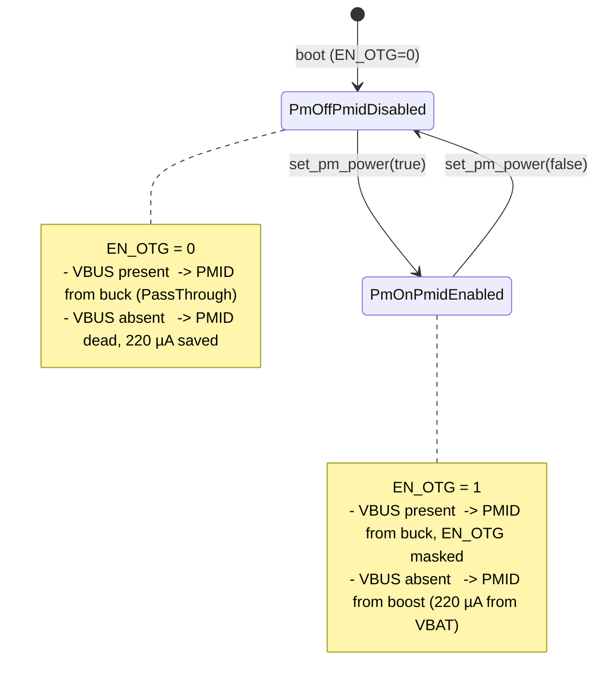

# BMS Cross-Board Improvements Spec

> **This is a spec.** It describes how a set of BMS behavior changes
> **will be built**, not what currently exists. Once shipped, the
> corresponding component and service docs become the source of truth and
> this spec is deleted.

Ship a set of BMS behavior changes that apply to **both** the existing
prototype board and the future v1 board, with no runtime variant
detection involved. Three families share one motivation — make the
existing BMS hardware more correct and more efficient — and one
constraint — work on both boards without conditional branches. The
changes are: cell safety trips (over-discharge, over-temperature),
PMID-rail power-efficiency rewrite (couple boost-converter enable to
actual PM-sensor demand rather than to USB plug state), and three new
`BmsDevice` HAL virtuals that later checkpoints will consume.

## Problem

Three independent issues on `go/feat/board_v1` HEAD today:

- **No cell-protection trip path.** On battery and unattended, AGo runs
  the cell down to ≈ 2.4 V where the in-pack DW01 protection opens
  `PACK+`. Repeated DW01 trips degrade the cell. Once v1 ships, the same
  trip also POR's the BQ27427 fuel gauge (BAT pin is upstream of the
  BATFET), wiping learned Qmax / Ra. There is no firmware-side guard
  that brings the system down gracefully before either failure mode.
- **PMID boost wastes battery whenever USB is unplugged.**
  `PowerService::sync_pmid_mode()` flips PMID to `Boost` (i.e. writes
  `EN_OTG = 1` on the BQ25629) any time the power source is not an
  external input — regardless of whether anything downstream is actually
  drawing from PMID. The BQ25629 datasheet (§7.5, `I_Q_BOOST` row)
  specifies **220 µA typ from VBAT** for boost-on with no PMID load.
  That overhead is fleet-wide on every prototype shipped today, and
  dominates baseline current when the device is in deep sleep
  (ESP32-C5 deep-sleep budget is sub-50 µA — adding 220 µA is a ~5×
  increase). At 2000 mAh that alone is ~378 days of continuous drain
  for zero downstream work.
- **`BmsDevice` HAL is missing primitives that later work needs.**
  No way to programmatically stop charging
  (`set_charge_enable`), no way to change the fast-charge current
  (`set_charge_current_ma`), no way to deliberately collapse PMID
  (`set_pmid_enabled`). Two of these are required by the Charge Cutoff
  / Charge Current admin UX work later; the third is the primitive the
  PMID rewrite is built on.

## Goals

- Trip BMS ship-mode when the cell over-discharges (debounced cell
  voltage below the EDV threshold while on battery) — protects the cell
  and, on v1, the fuel gauge's learned state
- Trip BMS ship-mode when the battery NTC reports an over-temperature
  condition (debounced) — protects the cell
- Drop boost-converter quiescent current to zero during PM-off windows
  by coupling PMID enable to PM-sensor demand, not USB plug state.
  Bench-measured drain reduction is the merge gate
- Extend `BmsDevice` with four new **pure** virtuals
  (`set_charge_enable`, `set_charge_current_ma`, `set_pmid_enabled`,
  `set_watchdog_timeout_ms`). Real implementations live in `BQ25629Bms`;
  existing test mocks gain overrides as needed. `PowerService` gains a
  matching public wrapper for `set_watchdog_timeout_ms` so future
  callers can re-configure the BMS watchdog without reaching through
  the HAL directly
- Work identically on prototype and v1 hardware without any runtime
  variant check
- No regression on the today-known-good behaviors: charging while
  plugged-in still works, PM sensor still powers correctly, telemetry
  cadence unchanged

## Non-Goals

- This spec does **not** add runtime board-variant detection or any
  variant-conditional code paths — that is spec 2's job
- It does **not** add the BQ27427 fuel gauge driver, integration, or
  any FG-derived behavior — that is spec 3's job
- It does **not** wire the `set_charge_enable` / `set_charge_current_ma`
  virtuals to any UX — Charge Cutoff toggle, Charge Current admin row,
  and Battery Learning Mode are later checkpoints
- It does **not** add admin mode, the touch feedback layer, the buzzer
  service, or any other UX work that the partner branch carries
- It does **not** change the BMS telemetry poll cadence
  (`BMS_POLL_INTERVAL_MS` stays at 60 000) or the status poll cadence
  (`BMS_STATUS_POLL_INTERVAL_MS` stays at 5 000). The partner's cadence
  changes existed to support FG log visibility and PMID-recovery
  latency; neither rationale applies under this spec's PMID model
- It does **not** add `BmsTelemetry` fields beyond `battery_temperature_c`

## Dependencies

**Depends on:** `board_v1_pm_polarity.md` (spec 2) for the
`PowerService::Config::pm_power_on_level` field that this spec's
`set_pm_power()` sketch reads. Spec 1 alone cannot compile against a
codebase that hasn't merged spec 2 — the field doesn't exist yet.
Spec 1 does **not** depend on runtime board-variant detection at run
time; it consumes the configured polarity at construction time.

**Recommended merge order:** spec 2 → spec 1 → spec 3. Spec 2 lands
first to introduce `BoardVariant`, the polarity constants, and the
`pm_power_on_level` field; spec 1 then layers in the demand-coupled
PMID model and safety trips on top.

Both specs touch `PowerService::set_pm_power()`, but in non-overlapping
ways:

- This spec changes the **behavior** of `set_pm_power()` by adding
  `_bms.set_pmid_enabled()` calls around the GPIO write
- Spec 2 changes the **GPIO level convention** by making `on` map to
  `_config.pm_power_on_level` instead of always `1`

See spec 2's "Interaction with spec 1" subsection for the integrated
body of `set_pm_power()` after both specs land.

**Relationship to `board_v1_bms_support.md` (spec 3, future).** Spec
3 is **not** a hard dependent of this spec — its FG additions are
orthogonal to the HAL surface this spec extends (spec 3 does not call
`set_pmid_enabled`, `set_charge_enable`, `set_charge_current_ma`, or
`set_watchdog_timeout_ms`). However, spec 3 touches the same
`PowerService` source files, so landing this spec first reduces rebase
surface. Recommended merge order: spec 1 before spec 3, but spec 3
could technically land first.

The HAL virtuals added here will eventually be consumed by **later
UX checkpoints** (Charge Cutoff toggle, admin Charge Current, Battery
Learning Mode) that are out of scope for all three current specs.

## Design

**Source-code attribution rule.** All code sketches in this spec are
deliberately free of references to the v0.3 hardware partner's branch
(`tmp/airgradient-firmware/`) and to this spec document itself. Any
provenance, validation history, or cross-spec coordination context
belongs in the surrounding prose and the References section at the
bottom of this spec — **never** in source-file comments. Implementers
must not paste partner-branch paths, spec filenames, or section
references into `.h` / `.cpp` comments while implementing this spec.

### Family A — Cell safety trips

Both trips fire `BmsDevice::enter_ship_mode()` to protect the cell,
but use different gating shapes:

- **EDV (over-discharge)** uses **on-battery gating + debounce
  counter + one-shot ship-mode latch**. A counter increments each
  poll the cell voltage stays below the threshold while
  `read_status()` confirms on-battery; ship-mode fires on the third
  consecutive sample and latches.
- **OT (over-temperature)** uses **NTC-validity gating + two-tier
  hysteresis**. No debounce counter — the cell's thermal mass already
  filters short transients. A non-latching charge-cutoff /
  charge-resume pair gates the charger (50 °C cutoff, 47 °C resume).
  A one-shot ship-mode latch fires above the higher threshold
  (60 °C).

Both trips are wired in `PowerService::poll_bms()`, run once per
`BMS_POLL_INTERVAL_MS` (60 s), are not admin-gated, and are not
variant-gated — they protect every shipped unit on both prototype
and v1.

**Threshold provenance** (spec context, deliberately kept out of the
source comments): the OT thresholds
(`OT_CHARGE_HOT_CUTOFF_C = 50`, `OT_CHARGE_HOT_RESUME_C = 47`,
`OT_SHIP_THRESHOLD_C = 60`) are inherited from the v0.3 hardware
partner's branch
(`tmp/airgradient-firmware/products/go/main/go_power.h:331-333`,
`CHARGE_HOT_CUTOFF_C` / `CHARGE_HOT_RESUME_C` / `SHIP_MODE_HOT_C`),
where they have been validated on hardware against AGo's
single-cell Li-ion pack. The EDV threshold (`EDV_SHIP_THRESHOLD_V =
2.9 V`) and its 3-sample debounce come from the same source. Code
comments below intentionally describe the **behaviour** of each
constant without naming external code locations — see the
References section at the bottom of this spec for partner-branch
cross-references.

```cpp
// products/go/main/go_power.h — additions in PowerService private section

// --- EDV (over-discharge) thresholds ---
static constexpr float    EDV_SHIP_THRESHOLD_V = 2.9f;
static constexpr int      EDV_SHIP_DEBOUNCE_SAMPLES = 3;

// --- OT (over-temperature) thresholds ---
//
// Two-tier policy: CUTOFF disables charging while still allowing the
// system to run; SHIP trips ship mode at the higher threshold.
// Hysteresis between CUTOFF (50 °C) and RESUME (47 °C) prevents
// chattering near the cutoff boundary.  Ship-mode latch prevents
// re-triggering ship-mode I²C writes during the BQ25629 BATFET_DLY
// (~12.5 s) shutdown window.  Values validated on hardware against
// AGo's single-cell Li-ion pack.
static constexpr int16_t  OT_CHARGE_HOT_CUTOFF_C = 50;
static constexpr int16_t  OT_CHARGE_HOT_RESUME_C = 47;
static constexpr int16_t  OT_SHIP_THRESHOLD_C    = 60;

// --- Trip-state members ---
int   _edv_low_count = 0;
bool  _edv_ship_mode_triggered = false;

/// True while charging is held off by the over-temperature guard
/// (cell crossed OT_CHARGE_HOT_CUTOFF_C going up).  Cleared when the
/// cell cools below OT_CHARGE_HOT_RESUME_C.  Edge-triggered: we only
/// issue `set_charge_enable(false / true)` on the transitions, not
/// every poll.
bool  _thermal_charge_disabled = false;

/// Latched true once over-temperature ship-mode has fired.  Prevents
/// re-issuing `enter_ship_mode()` during the BATFET_DLY (25 ms)
/// shutdown window.  Never cleared — after the BATFET opens, the
/// system goes dark and any subsequent boot starts fresh.
bool  _thermal_ship_mode_triggered = false;
```

**EDV (over-discharge) rule (pseudo-code, runs inside `poll_bms()`
after `read_telemetry()` AND `read_status()` both succeed).**
The trip is **gated on explicit "on-battery" status** — relying on
`!bms_power_source_has_external_input()` is unsafe because that
function returns `false` for `BmsPowerSource::Unknown` (see
`components/airgradient-bms/types/bms_types.h`), which would let a
flaky status read look like battery-only:

```text
status_ok = read_status() succeeded
on_battery = status_ok
             AND (status.power_source == BmsPowerSource::None
                  OR  status.power_source == BmsPowerSource::OtgMode)

if (on_battery
    AND telemetry.is_battery_voltage_valid()
    AND telemetry.battery_voltage < EDV_SHIP_THRESHOLD_V)
    _edv_low_count += 1
else
    _edv_low_count = 0

if (_edv_low_count >= EDV_SHIP_DEBOUNCE_SAMPLES
    AND not _edv_ship_mode_triggered)
    log "EDV trip: cell <2.9V for 3 polls -> ship mode"
    if (_bms.enter_ship_mode())  // does not return on success
        _edv_ship_mode_triggered = true
    // If enter_ship_mode() returned (rare — `on_battery` is true so
    // the chip will not refuse for VBUS-present reasons; the only
    // realistic cause is an I²C-level failure), do NOT latch.  Next
    // poll re-attempts; `_edv_low_count` is still >= debounce because
    // the gate is still true (cell still below threshold).
```

`battery_voltage` is the `float` (volts) field on `BmsTelemetry`;
no `_mv` field exists. `OtgMode` is included in the on-battery set
because in that state the device is sourcing power on PMID from the
cell — externally indistinguishable from "battery only" from the
trip's perspective.

**OT (over-temperature) rule — two-tier policy.** Unlike EDV, OT
does not use a debounce counter. The NTC reading is itself slow-moving
(thermal mass of the cell), so each individual sample is already a
debounced signal. Hysteresis between the cutoff (50 °C) and resume
(47 °C) thresholds avoids chattering near the cutoff boundary.

```text
// Runs inside poll_bms() after read_telemetry() succeeds.
// Guard against acting on garbage if NTC is unreadable.
if (not telemetry.is_battery_temperature_valid())
    skip OT logic this poll

t = telemetry.battery_temperature_c

// Tier 2: ship mode at SHIP_THRESHOLD.  One-shot latch.
if (t >= OT_SHIP_THRESHOLD_C
    AND not _thermal_ship_mode_triggered)
    log "OT trip: cell hot ${t}°C >= 60°C -> ship mode"
    // Cut charge first so the cell isn't pushed during shutdown.
    // Latch _thermal_charge_disabled on the charge-disable success
    // (independent of ship-mode outcome) so subsequent polls don't
    // re-issue the same I²C write while we wait for ship-mode to
    // succeed (which it won't until VBUS disappears or cell cools).
    if (not _thermal_charge_disabled)
        if (_bms.set_charge_enable(false))
            _thermal_charge_disabled = true
    if (_bms.enter_ship_mode())  // does not return on success
        _thermal_ship_mode_triggered = true
    // If enter_ship_mode() returned (USB present -> chip ignored
    // request, or other failure), do NOT latch the ship-mode flag.
    // Retry on next poll; charge-disable stays latched.

// Tier 1: charge cutoff at HOT_CUTOFF (edge-triggered going up).
elif (t >= OT_CHARGE_HOT_CUTOFF_C
      AND not _thermal_charge_disabled)
    log "OT warn: cell warm ${t}°C >= 50°C -> disable charging"
    if (_bms.set_charge_enable(false))
        _thermal_charge_disabled = true

// Tier 1: charge resume at HOT_RESUME (edge-triggered going down).
elif (t <= OT_CHARGE_HOT_RESUME_C
      AND _thermal_charge_disabled
      AND not _thermal_ship_mode_triggered)
    log "OT clear: cell cooled ${t}°C <= 47°C -> re-enable charging"
    if (_bms.set_charge_enable(true))
        _thermal_charge_disabled = false
```

Note that on USB the ship-mode call returns false (BQ25629 ignores
ship-mode while VBUS is present). The OT rule does **not** latch in
that case — the trip retries on every subsequent poll. Once the user
unplugs (or the cell cools below 60 °C), the latch resolves naturally.

For the EDV trip, this on-USB behavior doesn't matter (EDV is gated
on `on_battery` so it never fires with VBUS present). For OT it does
matter, and the non-latching-on-failure pattern handles it.

Why ship mode (not just shutdown):

- BQ25629 ignores ship-mode requests while VBUS is present, which is
  the desired behavior — we only want the EDV trip on battery
- BATFET opens, system power drops, load is removed, the cell relaxes —
  loaded 2.9 V recovers to ~3.0 V (safely above DW01 trip)
- On v1, the BQ27427's BAT pin is upstream of the BATFET, so the fuel
  gauge keeps its supply and its learned state when ship mode fires
- Identical primitive to the power-off button path (`shutdown()` →
  `enter_ship_mode()`) — well-understood code path

Debounce rides out transient load dips (Wi-Fi TX bursts, e-paper
refresh, buzzer). At 60 s × 3 samples that's a 3-minute window — more
than enough to ride out anything legitimate, fast enough to act before
DW01 trips at typical idle discharge rates.

A new field on `BmsTelemetry` carries the NTC reading:

```cpp
// components/airgradient-bms/types/bms_types.h — addition
struct BmsTelemetry {
  // ... existing fields ...
  int16_t battery_temperature_c = BmsInvalid::TEMPERATURE_C;

  bool is_battery_temperature_valid() const {
    return battery_temperature_c != BmsInvalid::TEMPERATURE_C;
  }
};
```

`BQ25629Bms::read_telemetry()` populates the new field via a new vendor
driver method:

```cpp
// components/bq25629/include/bq25629.h — addition
struct BQ25629_NTC_Data {
  float temperature_c;   ///< Steinhart-Hart, or -999.0f when out of range
};

esp_err_t read_ntc_temperature(BQ25629_NTC_Data &out);
```

When the NTC reading is out of the linear range (loose battery,
disconnected pack), the vendor driver returns `ESP_OK` with
`temperature_c = -999.0f`; the adapter leaves `battery_temperature_c`
at `BmsInvalid::TEMPERATURE_C` so `is_battery_temperature_valid()`
returns false and the OT trip cannot fire on garbage data.

**`float` → `int16_t` conversion rule** in
`BQ25629Bms::read_telemetry()`. The vendor driver returns `float`; the
telemetry field is `int16_t` for consistency with `die_temperature_c`
and because the OT-trip threshold is an integer °C value (no sub-degree
precision needed). The conversion has explicit valid-range bounds so
no garbage value can sneak past `is_battery_temperature_valid()`:

```cpp
// BQ25629Bms::read_telemetry() — populate battery_temperature_c
BQ25629_NTC_Data ntc{};
out.battery_temperature_c = BmsInvalid::TEMPERATURE_C; // default invalid
if (_charger.read_ntc_temperature(ntc) == ESP_OK) {
  const float t = ntc.temperature_c;
  if (!std::isnan(t)
      && t > BATTERY_TEMP_VALID_MIN_C
      && t < BATTERY_TEMP_VALID_MAX_C) {
    out.battery_temperature_c =
        static_cast<int16_t>(std::lroundf(t));
  }
}
```

Where:

- `BATTERY_TEMP_VALID_MIN_C = -40` and `BATTERY_TEMP_VALID_MAX_C = 100`
  — file-scope constants in `bq25629_bms.cpp` covering the typical
  Li-ion operating range with headroom on both sides. Anything outside
  this band (including the vendor's `-999.0f` sentinel, NaN, or
  obviously-bogus values) collapses to `BmsInvalid::TEMPERATURE_C`
- Rounding is **round-half-away-from-zero** (the semantics of
  `lroundf`; e.g. 49.5 → 50, −49.5 → −50). The integer field carries
  °C with 1-degree resolution, matching the threshold's precision.
  No fractional storage

### Family B — PMID-rail power-efficiency rewrite

Today's model: `PowerService::sync_pmid_mode(power_source)` watches the
charger's `power_source` and writes `EN_OTG` to track USB plug state:
plugged → `PassThrough` (EN_OTG=0), unplugged → `Boost` (EN_OTG=1).
The boost stays armed forever once unplugged, costing 220 µA from VBAT
regardless of whether PMID has any load.

New model: PMID enable is a function of **PM-sensor demand**, not
charger state.

```text
PM ON  -> EN_OTG = 1   (chip masks while VBUS present; boost engages on unplug)
PM OFF -> EN_OTG = 0   (boost dead -> 220 µA saved; PMID still alive via buck when VBUS present)
```

When VBUS is present, PMID comes from the buck (PassThrough) regardless
of `EN_OTG` — the chip masks `EN_OTG` internally while VBUS is detected.
So `EN_OTG = 0` while plugged-in produces identical PMID behavior to
today. The only behavioral change is on battery with PM off: PMID
collapses and the 220 µA goes away.



**The `BmsDevice` HAL gains a thin primitive:**

```cpp
// components/airgradient-bms/hal/bms_device.h — addition
class BmsDevice {
public:
  // ... existing virtuals ...

  /// Enable or disable the PMID boost converter.
  ///   true  -> arms boost (writes EN_OTG=1).  PMID comes from boost
  ///           when VBUS is absent; chip masks internally when VBUS is
  ///           present.
  ///   false -> disables boost (writes EN_OTG=0).  PMID stays alive
  ///           via buck while VBUS is present; collapses on unplug.
  /// Single I²C write, no settling delay, no policy.
  /// @return true on success.
  virtual bool set_pmid_enabled(bool) = 0;
};
```

**`BQ25629Bms` implementation:**

```cpp
bool BQ25629Bms::set_pmid_enabled(bool enable) {
  esp_err_t err = _charger.enable_otg(enable);
  if (err != ESP_OK) {
    ESP_LOGW(TAG, "set_pmid_enabled(%s) failed: %s",
             enable ? "true" : "false", esp_err_to_name(err));
    return false;
  }
  _pmid_enabled = enable;
  return true;
}
```

**Init sequence** keeps the existing preparatory writes (HIZ off, TS
check on, VOTG = 5100, EN_BYPASS_OTG = 0) so the boost is _ready_ but
disarmed. The current `configure_pmid_mode()` call inside `init()` is
**removed** — `BQ25629Bms::init()` does **not** write `EN_OTG` at all.
The chip ships with `EN_OTG = 0` from POR, so boot state is naturally
unambiguous without an explicit write. The watchdog configuration
stays at `Disable` (which is what the code actually does today — the
source comment claiming `Extend to 200s` is stale and is fixed as a
drive-by in step 7). Under the demand-coupled PMID model this remains
a safe default: were a future operator to re-enable the watchdog via
the new `set_watchdog_timeout_ms` API, an auto-clear of `EN_OTG` on
watchdog expiry would still be harmless because the next
`set_pmid_enabled(true)` call re-arms.

**Boot-time PMID arming via `PowerService::set_pm_power(true)`.**
Today's boot path constructs the BMS, then proceeds to construct
sensors — which on AGo includes SPS30, which needs the PMID +5 V
rail alive. Under the demand-coupled model the **first** explicit
`EN_OTG = 1` write must happen before `sensors()` is called. We
deliberately do **not** put this write inside `BQ25629Bms::init()`
or `GoHardwareBoard::init_bms()` — `PowerService::set_pm_power(true)`
is the single source of truth for PMID-on across the entire codebase.

Boot paths in `products/go/main/go_app.cpp` (three sites:
`execute_fast_path`, `run_button_wake_path`, `run_interactive`) are
normalized to a single uniform sequence between hardware bring-up
and sensor construction:

```cpp
// Sketch — applies to every boot path that constructs sensors
_board.init_core();                   // → init_nvs + init_buses + init_spi + init_bms
_board.release_gpio_holds();          // <-- see "release_gpio_holds in all paths" below
_board.power().set_pm_power(true);    // <-- arms PMID + drives EN_PM
SensorManager &sm = _board.sensors(state.sensors_warm);
```

**`release_gpio_holds()` in all three paths.** Today only
`execute_fast_path` calls `_board.release_gpio_holds()` (line ~176 of
`go_app.cpp`). `run_button_wake_path` (line ~373, uses the older
`init_nvs / init_buses / init_bms` triple instead of `init_core()`)
and `run_interactive` (line ~497) do not. On cold-boot paths the
GPIO hold register is naturally clear (nothing was ever set), so
`gpio_hold_dis` would be a no-op. But mixing per-path orderings is
a known source of "did the warm-wake handling get this right?" bugs.
This spec normalizes:

- Step 8 (Implementation Plan) adds `_board.release_gpio_holds()`
  to **all three** boot paths, immediately after `init_core()` (or
  the older init triple in `run_button_wake_path` — which spec 1
  also collapses to `init_core()` for consistency).
- `gpio_hold_dis` is idempotent — adding the call to cold-boot paths
  is harmless.
- The uniform sequence is what the host call-ordering test
  (`go_app.tests.cpp::execute_fast_path_pm_power_ordering`) asserts
  across all three boot paths.

This single explicit step:

1. **Establishes a clean invariant.** `EN_OTG` is written in
   `set_pm_power()` only. Grep finds every transition.
2. **Pairs symmetrically.** `set_pm_power(true)` ↔ `set_pm_power(false)`.
   No hidden "init also flips PMID on" carve-out.
3. **Serves the warm-sensor wake path correctly.** The chip kept
   `EN_OTG = 1` across deep sleep (the chip is not reset, only the
   ESP32 is). On wake, `set_pm_power(true)` re-writes `EN_OTG = 1`
   against an already-armed chip — idempotent silicon write, no rail
   glitch.

**Ordering contract on `GoBoard`.** Because `set_pm_power(true)` must
precede `sensors()`, `GoHardwareBoard::sensors()` gains an `assert`
that `_power_ready` is true (parallel to the existing `_buses_ready`
and `_bms_ready` flags). `_power_ready` is set when
`GoHardwareBoard::power()` constructs the `PowerService` instance.

**Scope of this assertion.** `_power_ready == true` only proves
`PowerService` has been constructed — it does **not** prove
`set_pm_power(true)` has actually been called against it. A caller
that invokes `_board.power()` (to get the reference) and then jumps
straight to `_board.sensors(...)` without calling
`set_pm_power(true)` would slip past this assertion with PMID still
off.

The actual call-ordering guarantee comes from the host test
`go_app.tests.cpp::execute_fast_path_pm_power_ordering` (see Testing
Strategy below), which uses Trompeloeil sequence expectations on a
`MockBoard` to assert `set_pm_power(true)` is called between
`release_gpio_holds()` and the first `sensors(...)`. The runtime
`_power_ready` assertion is **defense-in-depth**, not the primary
guarantee — its job is catching the easy mistake of forgetting to
construct `PowerService` at all. The host test catches the harder
mistake of constructing it but skipping the arm call.

**`PowerService` coupling:**

```cpp
void PowerService::set_pm_power(bool on) {
  if (_config.pin_pm_power < 0) {
    return;
  }
  if (on) {
    if (!_bms.set_pmid_enabled(true)) {
      AG_LOGW(TAG, "set_pm_power: set_pmid_enabled(true) failed");
      // Continue: EN_PM write below still happens.  An I²C-level
      // failure here is rare; logging it is the right action.  The
      // PM sensor will then simply not see +5 V and its own init will
      // fail downstream, which is recoverable.
    }
    RTOS::delay_ms(PM_PMID_SETTLE_MS); // see open Q on value
    _gpio.set_level(_config.pin_pm_power, _config.pm_power_on_level);
    AG_LOGI(TAG, "set_pm_power: ON (PMID armed)");
  } else {
    _gpio.set_level(_config.pin_pm_power,
                    _config.pm_power_on_level ? 0 : 1);
    if (!_bms.set_pmid_enabled(false)) {
      AG_LOGW(TAG, "set_pm_power: set_pmid_enabled(false) failed");
    }
    AG_LOGI(TAG, "set_pm_power: OFF (PMID disarmed)");
  }
}
```

`_config.pm_power_on_level` is the existing/spec-2 field — its default
of `1` keeps prototype behavior; spec 2 sets it to `0` for v1. This
spec only consumes the field; it does not introduce the variant
detection that selects the value.

**`sync_pmid_mode()` removal.** The current method writes
`configure_pmid_mode()` based on `power_source`. Under the demand-coupled
model, plug state no longer drives PMID enable. The method is deleted
along with its call sites in `poll_bms()` and `poll_status()`. The
existing `BmsDevice::configure_pmid_mode()` virtual is also removed:
no caller remains, the BQ25629 adapter implementation goes away with
it, and the `BmsPmidMode` enum is no longer referenced (deletable, but
the enum's removal is optional cleanup outside this spec's must-do
list).

**Brick-risk argument.** The partner documented an `EN_OTG`-toggle-near-
USB-unplug latch path on v0.3 silicon. Under the demand-coupled model,
`EN_OTG` writes happen on `set_pm_power()` calls, which are user-driven
(entering Offline mode, starting / ending a measurement, sleep cycles)
and are uncorrelated with USB plug events. The probability of a
`set_pm_power()` call coinciding with a plug edge is vanishingly small.
We accept the residual risk.

### Family C — `BmsDevice` HAL virtuals

Three more thin pure virtuals join `set_pmid_enabled`:

```cpp
class BmsDevice {
public:
  // ... existing virtuals + set_pmid_enabled from above ...

  /// Enable or disable the battery charging current path.  When
  /// disabled the charger IC holds the cell at its current SOC but
  /// continues to power the system rail from VBUS.
  /// @return true on success.
  virtual bool set_charge_enable(bool) = 0;

  /// Set the fast-charge current limit (CC mode), mA.  Driver clamps
  /// to chip-supported range and granularity.
  /// @return true on success.
  virtual bool set_charge_current_ma(uint16_t) = 0;

  /// Configure the chip-level watchdog timeout.
  ///   timeout_ms == 0 -> watchdog disabled (chip never auto-clears
  ///                      EN_OTG on lost host).
  ///   timeout_ms  > 0 -> driver selects the closest chip-supported
  ///                      timeout value at or above the requested
  ///                      period.  Caller must then invoke
  ///                      update_watchdog() periodically inside that
  ///                      window or the chip will auto-clear EN_OTG
  ///                      and re-enter a safe state.
  /// @return true on success.
  virtual bool set_watchdog_timeout_ms(uint32_t timeout_ms) = 0;
};
```

These are pure virtuals because every BMS implementation we ship today
or expect to ship in the foreseeable future (BQ25629 family) supports
them natively. The existing `configure_pmid_mode()` default-false
precedent is being removed in step 7 of the implementation plan; this
spec settles on pure virtuals as the consistent HAL convention.

`BQ25629Bms` implementations are one-line wrappers around the existing
vendor driver's `enable_charging()`, `set_charge_current()`, and
`set_watchdog_timeout()` methods. `set_watchdog_timeout_ms` maps the
millisecond argument to the closest supported
`drivers::WatchdogTimeout` enum value (`Disable` for 0; otherwise the
smallest supported timeout >= requested).

**No in-spec caller for the charge virtuals** — Charge Cutoff toggle,
admin Charge Current row, and Battery Learning Mode wire these in
later checkpoints. The HAL surface settles here so later UX work
touches UX code only.

**`PowerService::set_watchdog_timeout_ms`.** Because the BMS watchdog
is a power-management concern (it gates the chip-level "lost host"
fail-safe), `PowerService` exposes a public wrapper so future
operators (Battery Learning Mode hardening, deep-sleep policy, factory
test fixtures) can change the timeout without reaching through the
HAL directly. The wrapper is a one-line forward to
`_bms.set_watchdog_timeout_ms(...)` and does not change the in-init
`Disable` default — `init()` still configures `Disable` at startup,
matching today's behavior.

```cpp
class PowerService {
public:
  // ... existing public API ...

  /// Re-configure the BMS watchdog timeout.  See
  /// BmsDevice::set_watchdog_timeout_ms for semantics.  Forwards
  /// directly; no policy or kick-cadence change is applied here.
  bool set_watchdog_timeout_ms(uint32_t timeout_ms);
};
```

### What this spec does not change

- `BMS_POLL_INTERVAL_MS` (60 000) and `BMS_STATUS_POLL_INTERVAL_MS`
  (5 000) — unchanged. Partner cadence changes existed to serve FG log
  visibility (out of scope) and PMID-recovery latency (irrelevant
  under the demand-coupled PMID model)
- BQ25629 `BQ25629_Config` defaults (`charge_current_ma = 500`,
  `charge_voltage_mv = 4200`, etc.) — unchanged
- BMS watchdog runtime state — stays at `Disable` (which is what the
  code actually does today; the misleading source comment claiming
  `Extend to 200s` is corrected as a drive-by in step 7). The new
  `set_watchdog_timeout_ms` HAL virtual + `PowerService` wrapper
  introduce the **ability** to change it later but do not change the
  in-init value
- `BmsTelemetry` fields other than the new `battery_temperature_c`
- `PowerService::Config` fields. The PM polarity field
  (`pm_power_on_level`) is added by spec 2; this spec only consumes
  the existing default-1 behavior on prototype

## Implementation Plan

Each step is a focused commit.

1. **Add `battery_temperature_c` to `BmsTelemetry`** plus
   `is_battery_temperature_valid()` helper. Adapter implementations
   leave it at `BmsInvalid::TEMPERATURE_C`. No behavior change yet.
2. **Verify and fix the existing `read_ntc_temperature()`** in
   `components/bq25629/`. The method already exists at
   `bq25629.h:437` / `bq25629.cpp:999`; no new API is needed. **Drive-
   by fix:** the existing implementation reads `ts_adc_raw` without
   masking, but the BQ25629's TS_ADC register holds the 12-bit value
   in the low bits and `read_adc()` (line 487) already applies
   `0x0FFF`. Apply the same `& 0x0FFF` mask to `ts_adc_raw` so the
   two callers behave consistently. Confirm the existing
   Steinhart-Hart math returns `temperature_c = -999.0f` outside the
   linear range; if not, add that sentinel so `BQ25629Bms` can
   distinguish "no NTC wired" from "read failed".
3. **Wire NTC into `BQ25629Bms::read_telemetry()`** — populate
   `battery_temperature_c` from `read_ntc_temperature()`; leave at
   invalid sentinel when the vendor driver returns the `-999.0f`
   sentinel.
4. **Add four pure-virtual `BmsDevice` methods** (`set_pmid_enabled`,
   `set_charge_enable`, `set_charge_current_ma`,
   `set_watchdog_timeout_ms`). Implement all four in `BQ25629Bms` as
   one-line wrappers around the existing vendor driver, with
   `set_watchdog_timeout_ms` mapping its millisecond argument to the
   closest supported `drivers::WatchdogTimeout` enum value (`Disable`
   for 0). Add `PowerService::set_watchdog_timeout_ms(uint32_t)` as a
   thin forward to `_bms.set_watchdog_timeout_ms(...)`. Extend every
   existing `BmsDevice` mock with overrides — for Trompeloeil mocks
   this is a `MAKE_MOCK1(...)` line per method; simple test stubs gain
   a `return true;` body.
5. **Add EDV ship-mode trip** in `PowerService::poll_bms()` —
   threshold, debounce, log line, one-shot flag, gating on no-external-
   input. Add the trip-state members to `go_power.h`.
6. **Add OT ship-mode trip** in `PowerService::poll_bms()` — mirror of
   step 5 against `battery_temperature_c`.
7. **PMID rewrite — driver side.** In `BQ25629Bms::init()`, replace
   the `configure_pmid_mode()` call with the preparatory sequence
   (HIZ off, TS on, VOTG, BYPASS off). **Do not write `EN_OTG` from
   `init()` at all** — chip POR is `EN_OTG = 0`, which is the
   correct boot-time disarmed state. Delete the
   `configure_pmid_mode()` override; remove
   `BmsDevice::configure_pmid_mode()`; remove the `BmsPmidMode` enum
   if no other consumer remains. **Drive-by fix:** correct the stale
   `// Extend watchdog to 200s ...` comment above the
   `set_watchdog_timeout(Disable)` call to accurately describe the
   actual behavior ("Disable the chip-level watchdog; callers can
   re-configure via PowerService::set_watchdog_timeout_ms").
8. **Arm PMID from boot paths via `PowerService`.** PMID-on lives
   entirely in `PowerService::set_pm_power(true)`. Add a
   `_power_ready` flag to `GoHardwareBoard` (set inside `power()`
   after `PowerService` construction) and an
   `assert(_power_ready && "sensors() requires power()")` at the top
   of `GoHardwareBoard::sensors()`. Update **all three** boot-path
   call sites in `products/go/main/go_app.cpp` to the uniform
   sequence:

   ```text
   _board.init_core();
   _board.release_gpio_holds();
   _board.power().set_pm_power(true);
   _board.sensors(...);
   ```

   Specifically:
   - `execute_fast_path` — already has `init_core` and
     `release_gpio_holds`; insert `power().set_pm_power(true)` before
     the existing `sensors(state.sensors_warm)` call
   - `run_button_wake_path` — today uses
     `init_nvs / init_buses / init_bms` triple; collapse to
     `init_core()`; add `release_gpio_holds()` (idempotent on a cold
     boot since nothing was held); add
     `power().set_pm_power(true)` before `sensors()`
   - `run_interactive` — already uses `init_core()`; add
     `release_gpio_holds()` and `power().set_pm_power(true)` before
     `sensors()`

   `gpio_hold_dis` is safe to call against a pin that was never held,
   so adding `release_gpio_holds()` to the cold-boot paths is a no-op
   in practice. The uniform sequence eliminates per-path divergence.

   Do **not** add any `set_pmid_enabled` call inside
   `GoHardwareBoard::init_bms()` — `init_bms` stays a pure
   BMS-construction step.
9. **PMID rewrite — PowerService side.** Replace `set_pm_power()` body
   with the demand-coupled sequence. Delete `sync_pmid_mode()` and its
   two call sites in `poll_bms()` and `poll_status()`. Delete the
   `_pmid_mode` member from `PowerService`.
10. **Update host tests** for the new `set_pm_power()` behavior — assert
    `set_pmid_enabled(true)` is called before the GPIO write on `true`
    and `set_pmid_enabled(false)` is called after the GPIO write on
    `false`. Add EDV and OT trip tests using `MockBmsDevice` and
    crafted telemetry sequences.
11. **Documentation.** Update
    `components/airgradient-bms/README.md` to describe the four new
    virtuals and the demand-coupled PMID contract. Update the
    `PowerService` service doc to describe the EDV / OT trips, the
    new `set_pm_power()` sequence, and the
    `set_watchdog_timeout_ms` wrapper. Remove any leftover references
    to `configure_pmid_mode` / `BmsPmidMode`.

Step ordering keeps the firmware buildable at every commit. Steps 1–4
are additive and ship invisible to the running system. Step 5 is the
first behavioral change (EDV trip). Steps 7–9 swap the PMID model in
one logical change and **must land together as a single PR** — step 7
removes the existing PMID-on-during-init behavior, step 8 reinstates
it via the boot-path `set_pm_power(true)` call (and adds the
`_power_ready` assertion that catches mis-ordered callers), and step 9
rewires `PowerService::set_pm_power` to call `set_pmid_enabled`. Any
two of these without the third would either leave PMID off when
sensors need it (skip step 8) or leave `set_pm_power(true)` not
arming PMID (skip step 9).

## Testing Strategy

### Host tests (must pass before merge)

- `go_power.tests.cpp::set_pm_power`
  - `set_pm_power(true)`: `set_pmid_enabled(true)` called exactly once
    before the GPIO write
  - `set_pm_power(false)`: GPIO drives off-level, then
    `set_pmid_enabled(false)` called exactly once
  - `set_pmid_enabled(true)` returning `false`: log the warning, still
    drive GPIO (degraded behavior, not a hard fail)
  - `pin_pm_power == -1`: neither `set_pmid_enabled` nor GPIO write
    occurs
- `go_app.tests.cpp::execute_fast_path_pm_power_ordering` — new test
  case (parallel to the existing fast-path coverage) that asserts the
  boot-path call order: `_board.power().set_pm_power(true)` is invoked
  **before** `_board.sensors(...)` inside `execute_fast_path`.
  Trompeloeil expectations on the existing `MockBoard` enforce
  ordering via sequence guards. Same coverage added for
  `run_button_wake_path` and `run_interactive` (one section per boot
  path). This pre-merge gate catches the failure mode the
  `_power_ready` runtime assertion catches at execution time — both
  are kept (test for static guarantee, assertion for defensive runtime)
- `go_power.tests.cpp::poll_bms_edv_trip`
  - 1 sample below 2.9 V (on battery, status_ok): no trip
  - 2 samples below 2.9 V: no trip
  - 3 samples below 2.9 V, `enter_ship_mode()` returns true:
    `enter_ship_mode()` called exactly once; `_edv_ship_mode_triggered`
    latches; subsequent polls do not re-fire
  - 3 samples below 2.9 V, `enter_ship_mode()` returns false (I²C
    failure simulated via mock): `_edv_ship_mode_triggered` stays
    false; next poll with the gate still true calls
    `enter_ship_mode()` again. Retries until success
  - 3 samples below 2.9 V followed by 1 above: counter resets;
    subsequent 3 below trigger again only if `_edv_ship_mode_triggered`
    was never latched (which it would have been on the first success
    — intentional one-shot)
  - VBUS present (`power_source == UsbSdp` etc.): no trip even at 2.5 V
  - `power_source == OtgMode`: trip still fires (chip is sourcing from
    cell — treated as on-battery for the EDV rule)
  - `read_status()` failed (`power_source == Unknown`): counter does
    not increment, even with voltage below threshold (the `status_ok`
    gate prevents a false trip on flaky status reads)
  - Invalid voltage sentinel: counter does not increment
- `go_power.tests.cpp::poll_bms_ot_trip` — two-tier policy
  - Invalid temperature sentinel: no action (charge stays in current
    state, ship mode does not fire)
  - Temperature below cutoff (e.g. 30 °C), `_thermal_charge_disabled
    == false`: no action; `set_charge_enable` not called
  - Temperature crosses cutoff (50 °C) going up: `set_charge_enable(false)`
    called exactly once; `_thermal_charge_disabled` becomes true;
    `enter_ship_mode` not called
  - Temperature stays above cutoff for multiple polls: no further
    `set_charge_enable` calls (edge-triggered, not per-poll)
  - Temperature crosses resume (47 °C) going down while
    `_thermal_charge_disabled` was true: `set_charge_enable(true)`
    called exactly once; `_thermal_charge_disabled` clears
  - Temperature in hysteresis band (48–49 °C) with
    `_thermal_charge_disabled` true: no transition; no I²C writes
  - Temperature crosses ship threshold (60 °C) on battery:
    `set_charge_enable(false)` (if not already disabled) then
    `enter_ship_mode()` called; on success
    `_thermal_ship_mode_triggered` latches
  - Temperature above ship threshold, `enter_ship_mode()` returns
    false (USB present): no latch; trip retries on next poll
  - Temperature above ship threshold, `_thermal_ship_mode_triggered`
    already true: no further `enter_ship_mode()` calls (BATFET_DLY
    guard)
  - Temperature drops from ship-mode trip range back below resume
    while `_thermal_ship_mode_triggered` is true:
    `_thermal_charge_disabled` is not cleared (ship-mode latch wins
    over hysteresis — system is shutting down, leaving charging off
    is correct)
- `go_power.tests.cpp::set_watchdog_timeout_ms`
  - `PowerService::set_watchdog_timeout_ms(0)`: `_bms.set_watchdog_timeout_ms(0)`
    called exactly once with `0`
  - `PowerService::set_watchdog_timeout_ms(40000)`: forwards `40000`
    verbatim — no policy in the wrapper
  - Return value propagates: mock returns `false` -> wrapper returns
    `false`
- Every existing `BmsDevice` mock and stub gains overrides for the
  four new pure virtuals. Trompeloeil mocks add `MAKE_MOCK1(...)`
  lines; hand-written stubs return `true` from a minimal body. Tests
  that don't exercise the new methods don't need to set expectations

### ESP-IDF build

- `idf.py -C products/go build` must succeed
- No new Kconfig symbols
- No new managed components

### Hardware-in-the-loop (user-driven, gates merge)

- **Bench-measure boost Iq reduction.** On a prototype board:
  - Connect a current meter in series with VBAT
  - Set device to Offline mode, lock, force a sleep cycle, observe
    baseline current
  - Compare current branch HEAD (`EN_OTG=1` permanently on battery) vs
    this branch (`EN_OTG=0` while PM off)
  - Expected reduction: ~220 µA (datasheet typ)
  - Acceptance: measured reduction within ±50 µA of datasheet typ; no
    new disturbance on plug/unplug cycle
- **Warm-sensor wake on battery.** Run the same protocol on both
  board variants — once on prototype (active-high PM polarity), and
  again on v1 (active-low PM polarity) when bring-up hardware is
  available. On battery power (USB unplugged), with measurement
  interval short enough that `should_hold_pm_sensor()` returns true
  (default threshold 20 s):
  - Trigger a measurement cycle, confirm SPS30 produces valid PM2.5
  - Let the device enter deep sleep with sensors warm
  - Wait for timer wake (PM GPIO held by `gpio_hold_en` across sleep
    at the variant-appropriate ON level; chip's `EN_OTG=1` keeps PMID
    alive — the chip is not reset during ESP32 deep sleep)
  - On wake, confirm the boot path's `set_pm_power(true)` call
    re-asserts `EN_OTG = 1` idempotently against the already-armed
    chip, and SPS30 continues to produce valid readings without the
    10 s warmup
  - Acceptance: `state.sensors_warm == true` is honored end-to-end on
    both variants; no PM rail collapse visible on a scope between
    sleep entry and wake; the GPIO hold latches the correct level
    (1 on prototype, 0 on v1)
- **EDV trip end-to-end.** Run the device on battery to ≤ 2.9 V and
  confirm: ship mode fires within 3 × 60 s = 180 s of crossing the
  threshold; the device powers off cleanly; the cell relaxes to
  ~3.0 V loaded-off; the BATFET re-closes on USB plug-in
- **OT trip end-to-end.** Lab heat-soak the cell to above the threshold
  (or short the NTC to simulate); confirm same trip behavior. Skip if
  hardware fixture not available — datasheet threshold gives high
  confidence the code path is symmetric to EDV
- **PM sensor still warms up correctly** when `set_pm_power(true)` is
  called from a cold start: SPS30 produces a valid PM2.5 within 10 s
  of the call. Confirms the `PM_PMID_SETTLE_MS` delay is enough

## Open Questions

- **`PM_PMID_SETTLE_MS` value.** How long between `EN_OTG = 1` and the
  EN_PM GPIO write should `PowerService` wait? The BQ25629 boost soft-
  start is sub-millisecond in datasheet figures, but PMID rail
  capacitance + load-switch turn-on add up. Conservative starting
  value: 10 ms. Bench-verify the first SPS30 frame still arrives within
  the existing 10 s warmup budget. If 10 ms is insufficient, step up
  to 50 ms.
- **Bench-measurement scope.** Is measuring boost Iq on prototype
  alone enough, or do we want to repeat on v1 silicon before declaring
  the savings real? My take: measure on prototype now (datasheet is
  shared across the BQ25629 family); re-confirm on v1 when bring-up
  boards arrive but don't gate this merge on v1 availability.
- **`BmsPmidMode` enum fate.** With `configure_pmid_mode()` removed
  and `sync_pmid_mode()` deleted, the enum has no remaining caller.
  Removing it is pure cleanup. Spec includes the removal in step 7;
  flag if you'd rather keep it as harmless dead code for now.
- **EDV trip during USB-plugged → battery-only transition.** If the
  user unplugs while the cell is already at 2.85 V (worst case after a
  partial charge that never finished CV), the EDV trip will fire
  within 180 s. Acceptable? Alternative: extend the debounce to 5
  samples (5 minutes) at the cost of slower protection. Spec defaults
  to 3 samples matching the partner branch.

## References

The "partner" branch referenced throughout this spec is the
read-only audit fork at `tmp/airgradient-firmware/` (branch
`go/test/v0.3`, upstream
[`Gingerman1996/airgradient-firmware`](https://github.com/Gingerman1996/airgradient-firmware)).
That branch is the closest reference for the v0.3 hardware partner's
firmware-side work; the file paths below point at the partner's
implementation, not ours.

| Topic | Partner file | Notes |
|---|---|---|
| PMID rewrite (arm-once model) | `tmp/airgradient-firmware/components/airgradient-bms/drivers/bq25629/bq25629_bms.cpp` | Our demand-coupled model in Family B diverges from the partner's arm-once. We share the preparatory init sequence (HIZ off → TS on → VOTG=5100 → EN_BYPASS_OTG=0). |
| `set_charge_enable` / `set_charge_current_ma` virtuals | `tmp/airgradient-firmware/components/airgradient-bms/hal/bms_device.h` and `drivers/bq25629/bq25629_bms.cpp` | Pure virtuals here vs the partner's default-false; semantics identical. |
| `read_ntc_temperature()` on BQ25629 vendor driver | `tmp/airgradient-firmware/components/bq25629/include/bq25629.h` and `src/bq25629.cpp` | Steinhart-Hart math + `-999.0f` out-of-range sentinel. Adopt as-is. |
| `BmsTelemetry::battery_temperature_c` field | `tmp/airgradient-firmware/components/airgradient-bms/types/bms_types.h` and the populate site in `bq25629_bms.cpp::read_telemetry` | Adopt as-is. |
| EDV ship-mode cutoff pattern | `tmp/airgradient-firmware/products/go/main/go_power.cpp::poll_bms` and `go_power.h` (`_edv_low_count`, `_edv_ship_mode_triggered`, `EDV_SHIP_MV`, `EDV_SHIP_DEBOUNCE_SAMPLES`) | Adopt structure verbatim; constants identical. |
| Stale `Extend watchdog to 200s` comment | `tmp/airgradient-firmware/components/airgradient-bms/drivers/bq25629/bq25629_bms.cpp:36` | Same stale comment exists on our branch and is the drive-by fix in step 7. |
| `Flags()` CHG decode (FG-side, not in this spec) | `tmp/airgradient-firmware/components/airgradient-bms/drivers/bq27427/bq27427.cpp` | Out of scope here; landing in spec 3. |

Behavioural-source-of-truth references (not partner-specific):

- BQ25629 boost converter quiescent current `I_Q_BOOST = 220 µA typ`:
  TI BQ25629 / BQ25628 datasheet §7.5, "Quiescent battery current
  (BAT, SYS, SW) in boost mode" row
- BQ25629 V_SLEEP comparator behavior: BQ25628 datasheet §8.3.6.1
  condition #2 (referenced for context only; not exercised in this
  spec)
- AirGradient read-only audit of the partner branch:
  `go_v0_3_changes_analysis.md` at repo root
