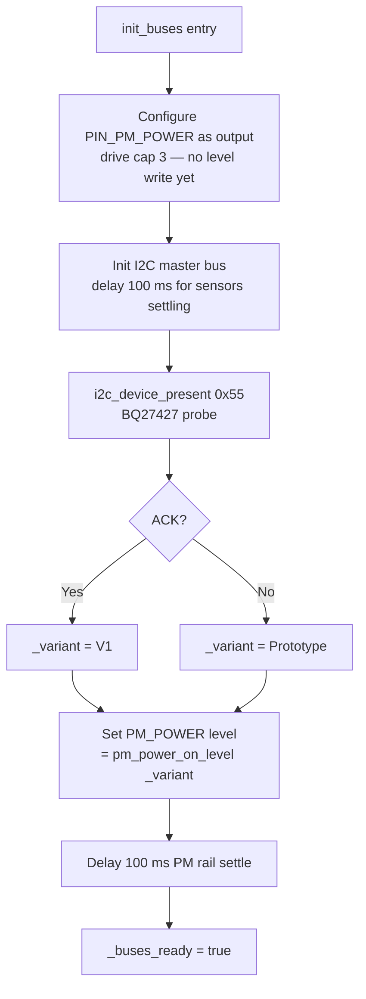

# Board v1 Runtime Variant Detection + PM Polarity Spec

> **This is a spec.** It describes how runtime board-variant detection
> and the PM-enable polarity gating **will be built**, not what
> currently exists. Once shipped, the corresponding service / hardware
> docs become the source of truth and this spec is deleted.

Enable a single firmware binary to run unmodified on both the existing
prototype board and the future v1 board. Introduce a `BoardVariant`
enum and a runtime detection mechanism (probe the BQ27427 fuel gauge
at I²C address `0x55`) that gates the **first** variant-conditional
behavior — the PM enable GPIO polarity, which is active-high on
prototype and active-low on v1. The detection mechanism is the
architectural foundation that every later v1-only behavior (spec 3 and
beyond) will reuse.

## Problem

- v1 silicon flips the PM enable line polarity from active-high (today)
  to active-low. A v1 board running today's firmware would either
  leave the SPS30 unpowered or drive the rail in a poorly-defined
  state.
- Shipping two firmware binaries is not acceptable — OTA risk,
  provisioning support, and release overhead all double.
- `GoHardwareBoard::init_buses()` today writes the PM_POWER GPIO level
  **before** the I²C bus is brought up, leaving no opportunity to
  detect the board variant first.
- There is no existing generic I²C-presence helper in the repository;
  drivers call `i2c_master_probe()` directly with per-driver timeouts.
  Adding a board-detection probe inline in `init_buses()` without a
  shared helper would either duplicate the pattern again or pull the
  ESP-IDF I²C driver headers further into product code.

## Goals

- One firmware binary supports both prototype and v1 hardware
- Runtime board detection happens exactly once at boot, is logged at
  INFO, and is exposed via `GoBoard::variant()` so downstream code can
  branch cleanly
- PM enable polarity is gated by the detected variant — no magic
  numbers in product code, no `#ifdef` per board, just
  `_config.pm_power_on_level`
- Existing prototype hardware boots and behaves identically to today
  (no regressions, no extra cost beyond a single I²C probe at init)
- A small generic I²C probe helper lands in `airgradient-common` so the
  board-detection call site reads cleanly and future detection logic
  (sensor presence, optional peripherals) reuses the same primitive
- The spec is independent of `bms_cross_board_improvements.md` (spec 1)
  and `board_v1_bms_support.md` (spec 3, future)

## Non-Goals

- This spec does **not** add the BQ27427 driver, FG-derived SOC, FG
  telemetry, or any FG-attached behavior — that is spec 3. The probe at
  `0x55` is **detection only**; the chip is not addressed beyond ACK /
  NACK
- It does **not** migrate existing drivers from direct
  `i2c_master_probe()` calls to the new helper — that is a future
  cleanup. Only the new board-detection call site uses the helper
- It does **not** add SHT40 wiring, the SHT40 fallback reorder, the
  LIS2DH12 accelerometer, the TCA9536 GPS-wake expander, the LP5036
  RGB LED driver, or the BuzzerService. Each of those becomes a
  separate v1-only spec that consumes `GoBoard::variant()`
- It does **not** persist the detected variant to NVS or RTC memory.
  Detection re-runs on every boot — the cost is a single I²C
  transaction
- It does **not** add a build-time `Kconfig` for variant selection.
  The variant is a runtime fact only
- It does **not** change any behavior on prototype boards beyond the
  GPIO-level convention of `set_pm_power()` (whose default keeps
  bit-identical behavior for prototype)

## Dependencies

**Depends on:** nothing. This spec is self-contained and can be merged
without any prerequisite.

**Independent of:** `bms_cross_board_improvements.md` (spec 1). Both
this spec and spec 1 touch `PowerService::set_pm_power()`, but in
non-overlapping ways — see the "Independence from spec 1" subsection
in this spec's Design section for the textual rebase required when both
land.

**Will be consumed by:** `board_v1_bms_support.md` (spec 3, future).
Spec 3 gates every v1-only behavior (BQ27427 attach, FG-derived SOC,
FG-attached telemetry cadence, FG self-healing) on
`board.variant() == BoardVariant::V1`. Without the variant accessor
introduced here, spec 3 cannot ship. Spec 3 must merge after this
spec.

## Design

### Board variant concept

The variant enum, helpers, and accessor all live in the existing
`go_board.h` — no new files in `products/go/main/`:

```cpp
// products/go/main/go_board.h — additions
#include "board_config.h" // for PM_POWER_ON_LEVEL_* constants

enum class BoardVariant : uint8_t {
  Prototype, ///< Legacy board: no BQ27427, PM enable active-high
  V1,        ///< New board: BQ27427 at 0x55, PM enable active-low
};

inline const char *board_variant_str(BoardVariant v) {
  return v == BoardVariant::V1 ? "V1" : "Prototype";
}

inline constexpr uint8_t pm_power_on_level(BoardVariant v) {
  return (v == BoardVariant::V1) ? PM_POWER_ON_LEVEL_V1
                                 : PM_POWER_ON_LEVEL_PROTOTYPE;
}

struct GoBoard {
  // ... existing virtuals ...

  /// Return the board variant detected during init_buses().
  /// Must not be called before init_buses() has completed.
  virtual BoardVariant variant() const = 0;
};
```

### Generic I²C probe helper

A thin wrapper lands in `components/airgradient-common/` so the board
detection site doesn't reach for `i2c_master_probe()` directly and so
later detection logic (sensor presence, optional peripherals) has a
single primitive to call.

```cpp
// components/airgradient-common/include/ag_i2c.h
#ifndef AG_I2C_H
#define AG_I2C_H

#include <cstdint>

#ifndef TEST_HOST
#include <driver/i2c_master.h>
#endif

/// Probe an I²C device by 7-bit address. Returns true when the device
/// ACKs within `timeout_ms`. Thin wrapper around `i2c_master_probe`.
///
/// Recommended timeout for fast presence checks is 100 ms.
///
/// Under TEST_HOST the function is declared with a void* bus handle;
/// tests provide their own definition (e.g. a per-test-case truth
/// table).
#ifndef TEST_HOST
bool i2c_device_present(i2c_master_bus_handle_t bus, uint8_t address,
                        int timeout_ms);
#else
bool i2c_device_present(void *bus, uint8_t address, int timeout_ms);
#endif

#endif // AG_I2C_H
```

Implementation (target only):

```cpp
// components/airgradient-common/ag_i2c.cpp
#ifndef TEST_HOST
#include "ag_i2c.h"

bool i2c_device_present(i2c_master_bus_handle_t bus, uint8_t address,
                        int timeout_ms) {
  return i2c_master_probe(bus, address, timeout_ms) == ESP_OK;
}
#endif
```

`airgradient-common`'s `CMakeLists.txt` gains `driver` in its `REQUIRES`
list (small dependency-weight increase; the component is already a
utility hub). `SRCS` adds `ag_i2c.cpp`. Existing drivers continue
calling `i2c_master_probe()` directly — out of scope to migrate them
here.

### Detection

Inline in `GoHardwareBoard::init_buses()`, after the I²C bus is up.
Three lines, no dedicated helper function:

```cpp
constexpr uint8_t BQ27427_PROBE_ADDR = 0x55;
constexpr int     BQ27427_PROBE_TIMEOUT_MS = 100;

const bool fg_present = i2c_device_present(
    _i2c_bus, BQ27427_PROBE_ADDR, BQ27427_PROBE_TIMEOUT_MS);
_variant = fg_present ? BoardVariant::V1 : BoardVariant::Prototype;
AG_LOGI(TAG, "board variant: %s (BQ27427 @ 0x55 %s)",
        board_variant_str(_variant), fg_present ? "ACK" : "NACK");
```

Decision rule (deliberately conservative):

| Probe outcome | Variant | Reasoning |
|---|---|---|
| ACK (device responded) | `V1` | BQ27427 only exists on v1 silicon |
| NACK | `Prototype` | No fuel gauge wired |
| Transport error (timeout, bus glitch) | `Prototype` | Fail safe — prototype is today's shipping path; unknown == legacy |

`i2c_device_present()` collapses NACK and transport error into a single
`false` return. The boot log distinguishes them only as "NACK" in the
common case — if richer diagnostics are needed later, the helper can
gain an `esp_err_t*` output parameter. Out of scope.

### Init ordering

`GoHardwareBoard::init_buses()` is re-ordered so detection runs before
the PM_POWER GPIO level is written:



The PM rail is **deliberately not driven** between GPIO configuration
and variant detection. `gpio::Mode::Output` without a `set_level()` call
leaves the pin at its reset state (low). For both variants this is
safe: prototype reads low as "PM off" and v1 reads low as "PM on but
the +5 V rail behind it isn't up yet anyway" — no risk to downstream
silicon during the brief window before detection completes.

After the variant is known, `set_level(PIN_PM_POWER, pm_power_on_level(_variant))`
drives the rail to "ON" for that variant. SPS30 warmup (~10 s) starts
from that point.

### PM polarity wiring

`board_config.h` gains two named constants. The existing `PIN_PM_POWER`
constant is unchanged.

```cpp
// products/go/main/board_config.h — additions
inline constexpr uint8_t PM_POWER_ON_LEVEL_PROTOTYPE = 1; ///< Active-high
inline constexpr uint8_t PM_POWER_ON_LEVEL_V1 = 0;        ///< Active-low
```

`PowerService::Config` gains one field, defaulting to `1` so existing
construction sites and tests work unchanged:

```cpp
struct Config {
  // ... existing fields ...
  uint8_t pm_power_on_level = 1; ///< GPIO level meaning "PM on"
                                 ///<   Prototype: 1 (active-high)
                                 ///<   v1:        0 (active-low)
};
```

`set_pm_power(bool on)` consumes the configured level:

```cpp
void PowerService::set_pm_power(bool on) {
  if (_config.pin_pm_power < 0) {
    return;
  }
  const int on_level = _config.pm_power_on_level;
  const int level = on ? on_level : (on_level ? 0 : 1);
  _gpio.set_level(_config.pin_pm_power, level);
  AG_LOGI(TAG, "set_pm_power: %s (level=%d)", on ? "ON" : "OFF", level);
}
```

GPIO-hold semantics across deep sleep are unaffected. `gpio_hold_en()`
latches whatever level was written, so once `set_pm_power(true)` has
been called with the correct polarity, the rail stays at the "ON"
level (variant-appropriate) through the sleep window.

`GoHardwareBoard::power()` reads the cached variant and selects the
polarity at `PowerService` construction:

```cpp
_power = new PowerService(
    *_bms_driver, gpio::native::hal,
    {
        // ... existing config ...
        .pin_pm_power = PIN_PM_POWER,
        .pm_power_on_level = pm_power_on_level(_variant),
        // ...
    });
```

### `GoHardwareBoard` state

```cpp
class GoHardwareBoard : public GoBoard {
public:
  BoardVariant variant() const override {
    assert(_buses_ready && "variant() requires init_buses()");
    return _variant;
  }
  // ... existing methods ...

private:
  BoardVariant _variant = BoardVariant::Prototype; // fail-safe default
  // ... existing members ...
};
```

### Logging contract

Detection emits exactly one INFO log line, at exactly one call site, in
exactly one of these three forms:

```text
GoHardwareBoard: board variant: V1 (BQ27427 @ 0x55 ACK)
GoHardwareBoard: board variant: Prototype (BQ27427 @ 0x55 NACK)
```

This is the single source of truth for "which board am I running on"
during bring-up and field diagnostics. No other call site should log
the variant; downstream consumers read `board.variant()` and act on it
without re-logging.

### Independence from spec 1

Spec 1 (`bms_cross_board_improvements.md`) and this spec both touch
`PowerService::set_pm_power()`, but in non-overlapping ways:

- **Spec 1** changes the **behavior** of `set_pm_power()`: it adds a
  `_bms.set_pmid_enabled()` call before/after the GPIO write to
  couple PMID-enable to PM-needed.
- **This spec** changes the **GPIO level convention**: `on` no longer
  always maps to `1` — it maps to `_config.pm_power_on_level`.

Either merge order works. Whichever lands second performs a small
textual rebase inside `set_pm_power()` to keep both changes
compatible. The integrated body (both specs landed) looks like:

```cpp
void PowerService::set_pm_power(bool on) {
  if (_config.pin_pm_power < 0) {
    return;
  }
  const int on_level = _config.pm_power_on_level;
  const int off_level = on_level ? 0 : 1;
  if (on) {
    if (!_bms.set_pmid_enabled(true)) {
      AG_LOGW(TAG, "set_pm_power: set_pmid_enabled(true) failed");
    }
    RTOS::delay_ms(PM_PMID_SETTLE_MS);
    _gpio.set_level(_config.pin_pm_power, on_level);
    AG_LOGI(TAG, "set_pm_power: ON (PMID armed, level=%d)", on_level);
  } else {
    _gpio.set_level(_config.pin_pm_power, off_level);
    if (!_bms.set_pmid_enabled(false)) {
      AG_LOGW(TAG, "set_pm_power: set_pmid_enabled(false) failed");
    }
    AG_LOGI(TAG, "set_pm_power: OFF (PMID disarmed, level=%d)", off_level);
  }
}
```

No spec-level coordination is required — whichever PR lands second
just resolves a textual conflict in this single function body.

### What this spec does not change (beyond the Non-Goals list)

- Touch sensitivity (`TOUCH_DELTA_SENSE` in `board_config.h`) is not
  varied by variant. Keep the current value. The v0.3 partner tuned
  this for PM-boost-EMI on the v0.3 PCB; we revisit only when bench
  evidence on v1 silicon demands it
- The existing `init_buses()` 100 ms post-config and 100 ms post-I²C
  delays are preserved
- `BMS_POLL_INTERVAL_MS`, `BMS_STATUS_POLL_INTERVAL_MS`, and any other
  cadence constant. PM-polarity gating costs nothing per tick

## Implementation Plan

Each step is a focused commit.

1. **Add `i2c_device_present` to `airgradient-common`**
   - Create `components/airgradient-common/include/ag_i2c.h`
   - Create `components/airgradient-common/ag_i2c.cpp`
   - Add `ag_i2c.cpp` to `SRCS` and `driver` to `REQUIRES` in
     `components/airgradient-common/CMakeLists.txt`
   - Update `components/airgradient-common/README.md` (if present) or
     leave the existing component description; this addition is small
     enough to fit under the component's existing "misc utilities"
     character
2. **Add polarity constants to `board_config.h`**
   - Add `PM_POWER_ON_LEVEL_PROTOTYPE = 1` and
     `PM_POWER_ON_LEVEL_V1 = 0` to `products/go/main/board_config.h`
3. **Add `BoardVariant` + `variant()` to `GoBoard`**
   - Add the enum, `board_variant_str()`, `pm_power_on_level()`, and
     the pure virtual `variant()` to `products/go/main/go_board.h`
   - Add `_variant` member + `variant()` override to
     `products/go/main/go_hardware_board.{h,cpp}`. Default
     `_variant = BoardVariant::Prototype` so an early call before
     `init_buses()` returns a safe value (the `assert` catches the
     misuse in debug builds)
4. **Re-order `init_buses()` and run detection**
   - In `products/go/main/go_hardware_board.cpp::init_buses()`, move
     the `set_level(PIN_PM_POWER, ...)` call below the I²C bus init
   - Call `i2c_device_present(_i2c_bus, 0x55, 100)`, set `_variant`,
     log the result
   - Write the variant-appropriate ON level
   - Preserve both 100 ms settling delays
5. **Plumb polarity into `PowerService`**
   - Add `pm_power_on_level` to `PowerService::Config` in
     `products/go/main/go_power.h` (default `1`)
   - Update `set_pm_power()` body in
     `products/go/main/go_power.cpp` to honour the configured level
   - Pass `pm_power_on_level(_variant)` from
     `GoHardwareBoard::power()` when constructing `PowerService`
6. **Update mocks and stubs**
   - Add `variant()` override returning `BoardVariant::Prototype` to
     every test `GoBoard` implementation:
     `products/go/tests/go_app_stubs.cpp` and any other test
     fixtures that derive from `GoBoard`
   - No behavior change in existing tests — they continue to default
     to `pm_power_on_level = 1`
7. **Tests**
   - Extend
     `products/go/tests/go_power.tests.cpp::set_pm_power` with two
     additional sections covering `pm_power_on_level = 0`
     (v1): `set_pm_power(true)` writes level `0`; `set_pm_power(false)`
     writes level `1`. Existing sections (default `pm_power_on_level = 1`)
     remain unchanged
   - No test for the detection logic itself — three-line inline
     decision in `init_buses()` does not warrant a dedicated unit
     test. Coverage comes from HIL verification below
8. **Documentation**
   - Update `products/go/README.md` "Hardware Notes" section to note
     runtime variant detection
   - Update `components/airgradient-common/README.md` if it lists
     public headers; add `ag_i2c.h` and one-line purpose
   - One-paragraph note in `products/go/main/board_config.h` header
     comment about the two polarity constants and which one applies
     to which board

Step ordering keeps the firmware buildable and tests green after every
step. Steps 1–3 are pure additions. Step 4 changes `init_buses()`
behavior on v1 silicon only (prototype still gets level `1`, which is
its existing "on" semantic). Steps 5–6 add a config field with a
backward-compatible default.

## Testing Strategy

### Host tests (must pass before merge)

- `go_power.tests.cpp::set_pm_power` — extended with two new sections
  for `pm_power_on_level = 0`:
  - `set_pm_power(true)` -> GPIO level `0`
  - `set_pm_power(false)` -> GPIO level `1`
- All existing `go_power.tests.cpp` and `go_orchestrator.tests.cpp`
  sections pass unchanged — they construct `PowerService` with the
  default `pm_power_on_level = 1`, which matches the prototype
  polarity they already test

### ESP-IDF build

- `idf.py -C products/go build` must succeed
- No new Kconfig symbols
- `airgradient-common` gains `driver` in `REQUIRES`; verify the
  component still builds for any other consumer that links against it

### Hardware-in-the-loop (user-driven)

- **Prototype board:** boot log shows
  `board variant: Prototype (BQ27427 @ 0x55 NACK)`; PM sensor powers
  on as today; SPS30 produces valid PM2.5 within 10 s warmup
- **v1 board (when silicon is available):** boot log shows
  `board variant: V1 (BQ27427 @ 0x55 ACK)`; PM sensor powers on;
  SPS30 produces valid PM2.5 within 10 s warmup
- **Forced fault (v1 with FG SDA held low):** boot log shows
  `board variant: Prototype (BQ27427 @ 0x55 NACK)` and PM rail is
  driven to prototype-polarity ON — which on v1 silicon means PM is
  effectively off. This is a degraded but defined state, not a
  crash. Documented as the expected fail-safe outcome

## Open Questions

- **Q1 (carried from analysis doc).** Is the v1 EN_PM line actually
  active-low? Spec assumes yes, matching the v0.3 partner branch.
  Confirmation expected via partner schematic / bring-up board. If v1
  turns out to be active-high, the only change required is
  `PM_POWER_ON_LEVEL_V1 = 1` — a one-line edit, no structural change
- **Q2.** Address `0x55` collision risk: cross-checked against
  `board_config.h`; `0x55` is unused on prototype. If a future board
  populates a different chip at `0x55`, the detection contract breaks
  and we'd need to escalate to a `Control(DEVICE_TYPE) == 0x0427`
  verification (which requires a real BQ27427 driver — out of scope
  here, lands in spec 3). Defer until concrete need arises
- **Q3.** Log level for the transport-error fail-safe path: this spec
  uses INFO uniformly. Argument for promoting transport-error to WARN
  or ERROR: it's the difference between a working v1 unit and a
  silently-mis-polarized PM rail. Argument against: still recoverable
  on prototype (the default). Defer to first field deployment feedback
- **Q4.** Should `i2c_device_present()`'s default timeout be encoded
  as a constant in the header (e.g. `AG_I2C_PROBE_DEFAULT_MS = 100`)
  for callers that don't want to pick one? Spec currently leaves it
  caller-required. If field experience shows callers all converge on
  the same value, add the constant in a follow-up

## References

The "partner" branch referenced in the analysis doc and across these
specs is the read-only audit fork at `tmp/airgradient-firmware/`
(branch `go/test/v0.3`, upstream
[`Gingerman1996/airgradient-firmware`](https://github.com/Gingerman1996/airgradient-firmware)).
Paths below point at the partner's implementation.

| Topic | Partner file | Notes |
|---|---|---|
| PM enable polarity flip on v0.3 board | `tmp/airgradient-firmware/products/go/main/board_config.h:92` | Partner annotates `PIN_PM_POWER` with `// v0.3: active-low`. We adopt the same polarity for v1. |
| PM polarity in `set_pm_power` | `tmp/airgradient-firmware/products/go/main/go_power.cpp::set_pm_power` | Partner inverts the level inline (`on ? 0 : 1`). Our approach extracts the polarity into `PowerService::Config::pm_power_on_level` so the same code serves both boards. |
| PM polarity in `init_buses` | `tmp/airgradient-firmware/products/go/main/go_hardware_board.cpp::init_buses` line ~117 | Partner writes `set_level(PIN_PM_POWER, 0)` directly. Our re-ordering and variant-resolved level write replaces this. |
| BQ27427 presence at `0x55` | `tmp/airgradient-firmware/products/go/main/board_config.h:80` and the FG init site in `go_hardware_board.cpp::init_bms` | Partner addresses the BQ27427 by its fixed I²C address; we reuse the same address as our detection signal without addressing the chip beyond a presence probe. |
| Read-only audit | `go_v0_3_changes_analysis.md` at repo root (Items 1 and 3 cover PM polarity and SHT40 respectively; only Item 1 is in scope for this spec) | Items 2, 4, 5 are split across spec 1 (cross-board BMS) and spec 3 (v1 BMS support). |
