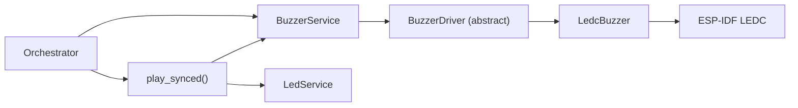
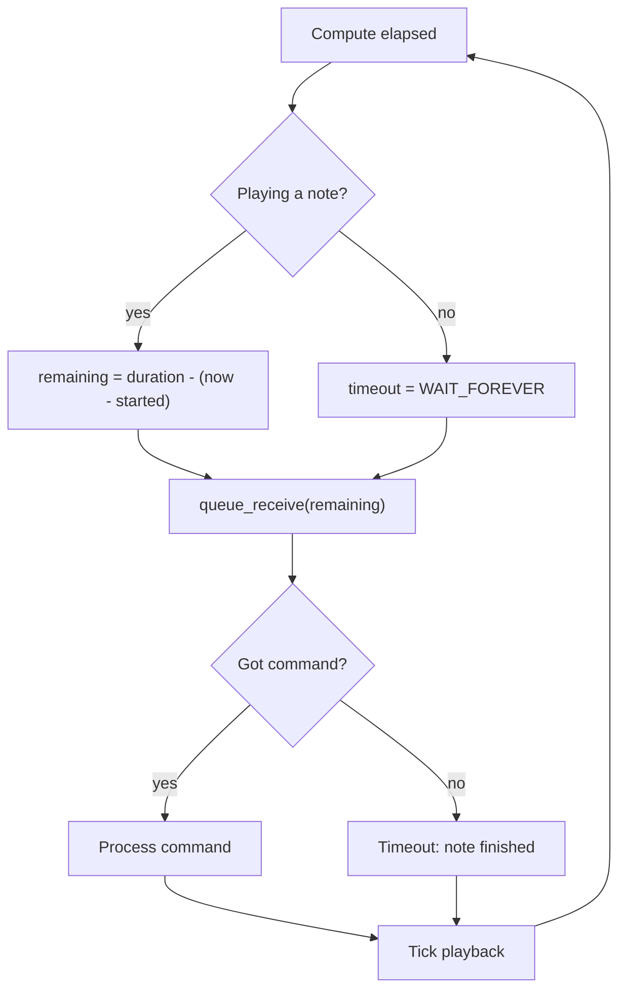

# Buzzer Service Spec

> **This is a spec.** It describes how a feature **will be built**, not what
> currently exists. Once the feature ships, the corresponding doc under
> `docs/` becomes the source of truth and this file is typically deleted.
> See `docs/STYLE.md` → "Doc Lifecycle".

AirGradient Go will drive the HYG-8503A magnetic buzzer through a
product-local buzzer service. The service uses a tick-based adaptive
worker loop (matching the LED service pattern) that sleeps when idle and
ticks at note boundaries when playing. A separate melody library provides
a 12-TET musical note system, predefined melodies, and a blocking
synced-play function that coordinates audio and back-LED visuals. The
implementation rolls out in two scopes: buzzer service core, then melody
library with full event wiring.

## Problem

AirGradient Go has no buzzer abstraction in the current product tree.
The v0.3 board carries a HYG-8503A magnetic buzzer driven through an NPN
low-side switch (Q3 on `EN_BUZZ` / GPIO8) via LEDC PWM. The reference
implementation works but has several architectural issues:

- The worker task uses a blocking `delay_ms()` loop per note, preventing
  a `pump_for_test()` approach and making host-test timing verification
  impossible.
- The command queue holds raw `Note` structs (frequency + duration),
  requiring callers to build note arrays externally. Melody resolution
  lives outside the service.
- LEDC hardware calls are guarded by `#ifndef TEST_HOST` with no
  abstract HAL, so tests cannot verify output frequencies or timing.
- The melody-LED sync spawns a raw RTOS task with a `volatile bool`
  guard, bypasses the LED service command queue, and is untestable on
  the host.

The new implementation needs:

- A layered split (HAL, driver, service) matching the LED service pattern.
- A tick-based worker that processes high-level commands, not raw notes.
- An abstract driver HAL so tests can mock LEDC output.
- A clean synced-play mechanism for melody-LED coordination.
- Proper host testability for all timing-dependent behavior.

## Goals

- Add product-local buzzer support under `products/go/main/buzzer/`.
- Add a melody library at `products/go/main/go_melody.h` (header-only)
  and `products/go/main/go_melody_sync.{h,cpp}`.
- Split into a HAL surface, an LEDC driver, and a buzzer service.
- Make the buzzer service host-testable by consuming an abstract driver
  surface and exposing `pump_for_test()`.
- Keep ESP-IDF LEDC details inside the driver implementation.
- Use a tick-based adaptive worker loop that sleeps when idle and ticks
  at note boundaries when playing.
- Support high-level commands: play a short note pattern, beep, and stop.
- Provide a blocking `play_synced()` free function that coordinates
  buzzer audio and back-LED visuals per note.
- Gate buzzer wiring on board variant V1. Prototype boards must boot
  normally with the service in inert mode.
- Use the shared RTOS abstraction for all task, queue, and timing
  operations.
- Add a service doc at `products/go/docs/buzzer_service.md` once shipped.

## Non-Goals

- Do not add a shared `components/` component. This buzzer layout is
  product-specific.
- Do not persist `MelodySelect` to NVS or expose it over BLE. It is a
  transient UI action, not a long-lived setting.
- Do not add `MelodySelect` to `GoSettings`. The UI fires
  `UIAction::PlayMelody` directly, bypassing the settings save path.
- Do not implement volume control. The duty cycle is fixed at 50% for
  maximum loudness on the magnetic buzzer.
- Do not unit-test the LEDC bus protocol. It will be validated by
  firmware build and hardware checks.
- Do not introduce a project-wide status/result framework, allocator,
  or RTOS primitive.

## Design

### Hardware

**Transducer:** HYG-8503A magnetic buzzer (resonant frequency 2700 Hz).

**Drive circuit:** NPN low-side switch (Q3). GPIO drives the base of Q3
via net `EN_BUZZ`; Q3 switches the buzzer to ground. Active-high.

**PWM driver:** ESP-IDF LEDC (LED Controller used as PWM generator):

| Parameter | Value |
|---|---|
| Speed mode | `LEDC_LOW_SPEED_MODE` |
| Duty resolution | 10-bit (1024 steps) |
| Duty cycle | 50% (loudest for square wave) |
| LEDC channel | Configurable (default 0) |
| LEDC timer | Configurable (default 0) |
| Clock source | `LEDC_AUTO_CLK` (80 MHz base) |

Muting sets duty to 0. Playing a note sets the LEDC timer frequency to
the desired Hz and applies the configured duty. A minimum duty of 1 is
enforced to guarantee an audible edge if `duty_percent` rounds to 0.

### Board Variant

The buzzer is only present on board variant V1. The Go hardware board
detects the variant during I2C bring-up by probing the BQ27427 fuel
gauge at `0x55`.

Buzzer wiring reuses this existing detection. `BuzzerService` is always
constructed so the orchestrator can call it unconditionally:

- On `BoardVariant::V1`: the hardware board constructs `LedcBuzzer` and
  then `BuzzerService` with `Config::driver` set to the `LedcBuzzer`
  instance.
- On `BoardVariant::Prototype`: the hardware board constructs
  `BuzzerService` with `Config::driver = nullptr` (inert mode).

### Layering



The melody library sits at the product level alongside the orchestrator.
It is split into two parts to avoid coupling the pure data/helpers with
service dependencies:

- `go_melody.h` — header-only. Musical types, 12-TET frequency table,
  inline helpers, `MelodySelect` enum, all predefined melodies and note
  patterns. No service dependencies — only includes `go_buzzer_types.h`
  for `Note`.
- `go_melody_sync.h/cpp` — `play_synced()` blocking free function.
  Depends on `BuzzerService`, `LedService`, `go_melody.h`, and RTOS.

```text
products/go/main/
  buzzer/
    go_buzzer_types.h        Note
    go_buzzer_hal.h          BuzzerDriver (abstract)
    go_buzzer_driver.h/cpp   LedcBuzzer (LEDC)
    go_buzzer.h/cpp          BuzzerService
  go_melody.h                MusicalNote, Melody, MelodySelect, 12-TET,
                             predefined data (header-only, no .cpp)
  go_melody_sync.h/cpp       play_synced()
```

Tests mock `BuzzerDriver` and exercise `BuzzerService`; the
`go_buzzer_driver.cpp` file is not linked into host tests. Melody
library pure-function tests include only `go_melody.h` — no service
stubs needed.

### Files

| File | Scope | Change |
|---|---|---|
| `products/go/main/board_config.h` | 1 | Add `PIN_BUZZER`, `BUZZER_FREQ_HZ` |
| `products/go/main/buzzer/go_buzzer_types.h` | 1 | New: `Note` |
| `products/go/main/buzzer/go_buzzer_hal.h` | 1 | New abstract `BuzzerDriver` surface |
| `products/go/main/buzzer/go_buzzer_driver.h` | 1 | New `LedcBuzzer` declaration |
| `products/go/main/buzzer/go_buzzer_driver.cpp` | 1 | New `LedcBuzzer` LEDC implementation |
| `products/go/main/buzzer/go_buzzer.h` | 1 | New `BuzzerService` declaration |
| `products/go/main/buzzer/go_buzzer.cpp` | 1 | New `BuzzerService` implementation |
| `products/go/main/CMakeLists.txt` | 1 | Add buzzer sources, `buzzer` include path, `esp_driver_ledc` in `PRIV_REQUIRES` |
| `products/go/tests/go_buzzer.tests.cpp` | 1 | New service tests with mocked driver |
| `products/go/tests/CMakeLists.txt` | 1 | Add `go_buzzer_tests` target |
| `products/go/main/go_melody.h` | 2 | New: header-only melody types, helpers, data |
| `products/go/main/go_melody_sync.h` | 2 | New: `play_synced()` declaration |
| `products/go/main/go_melody_sync.cpp` | 2 | New: `play_synced()` implementation |
| `products/go/main/go_board.h` | 2 | Add `buzzer_service()` accessor |
| `products/go/main/go_hardware_board.{h,cpp}` | 2 | Construct and expose the buzzer service |
| `products/go/main/go_app.{h,cpp}` | 2 | Init/start buzzer, boot melody |
| `products/go/tests/go_app_stubs.cpp` | 2 | Extend board mock |
| `products/go/main/go_orchestrator.{h,cpp}` | 2 | Add `BuzzerService&` to Services, handle `UIAction::PlayMelody` |
| `products/go/main/go_ui.h` | 2 | Add `UIAction::PlayMelody`, `MelodySelect` field in `UIActionResult` |
| `products/go/main/go_ui.cpp` | 2 | Add "Play Melody" settings row, fire action |
| `products/go/tests/go_melody.tests.cpp` | 2 | New melody library tests |
| `products/go/tests/CMakeLists.txt` | 2 | Add `go_melody_tests` target |
| `products/go/docs/buzzer_service.md` | 2 | New service doc |

### HAL Surface

`go_buzzer_hal.h` contains the abstract `BuzzerDriver` surface. It does
not include ESP-IDF headers.

```cpp
#pragma once

#include <cstdint>

// ISR-safe:    no
// Thread-safe: no. BuzzerService serializes access via the worker task.
// Blocking:    yes. LEDC register writes may have side effects.
// Allocates:   no after construction.
class BuzzerDriver {
public:
  virtual ~BuzzerDriver() = default;

  virtual bool init() = 0;

  /// Set the output frequency in Hz. 0 mutes (duty = 0).
  /// Returns false on hardware error.
  virtual bool set_freq(uint32_t freq_hz) = 0;
};
```

### LedcBuzzer Driver Declaration

`go_buzzer_driver.h` contains the concrete LEDC declaration. Production
wiring includes this header; `BuzzerService` does not.

```cpp
#pragma once

#include "go_buzzer_hal.h"

#include <cstdint>

#ifndef TEST_HOST
#include "driver/ledc.h"
#endif

class LedcBuzzer final : public BuzzerDriver {
public:
  struct Config {
    int pin = -1;
    uint32_t default_freq_hz = 2700;
    uint8_t duty_percent = 50;
    uint8_t ledc_channel = 0;
    uint8_t ledc_timer = 0;
  };

  explicit LedcBuzzer(const Config &config);
  ~LedcBuzzer() override = default;

  LedcBuzzer(const LedcBuzzer &) = delete;
  LedcBuzzer &operator=(const LedcBuzzer &) = delete;

  bool init() override;
  bool set_freq(uint32_t freq_hz) override;

private:
  Config _config;
  bool _ledc_ready = false;
};
```

### LEDC Register Behavior

`init()` sequence:

1. Configure LEDC timer with the default frequency, 10-bit resolution,
   and `LEDC_AUTO_CLK`.
2. Configure LEDC channel on the specified GPIO with duty 0 (muted).
3. Set `_ledc_ready = true`.
4. Return `true` on success, `false` if any LEDC API call fails.

`set_freq(freq_hz)`:

- `freq_hz == 0`: set duty to 0, update duty (mute). Return success.
- `freq_hz > 0`: set timer frequency, compute duty from `duty_percent`,
  enforce minimum duty of 1, set duty, update duty. Return `false` if
  any LEDC API call fails.

### Public Types

`go_buzzer_types.h` has no dependencies beyond `<cstdint>`.

```cpp
#pragma once

#include <cstdint>

struct Note {
  uint32_t freq_hz;    ///< 0 = silence for the duration
  uint32_t duration_ms;
};
```

### BuzzerService API

```cpp
#pragma once

#include "go_buzzer_hal.h"
#include "go_buzzer_types.h"
#include "rtos.h"

#include <atomic>
#include <cstdint>

class BuzzerService {
public:
  static constexpr uint8_t MAX_PATTERN_NOTES = 8;

  struct Config {
    BuzzerDriver *driver = nullptr;  ///< nullptr = inert mode
    uint16_t task_stack_size = 2048;
    uint8_t task_priority = 3;
    uint8_t queue_depth = 8;
  };

  explicit BuzzerService(const Config &config);
  ~BuzzerService();

  BuzzerService(const BuzzerService &) = delete;
  BuzzerService &operator=(const BuzzerService &) = delete;

  bool init();
  bool start();

  /// Play a short note sequence (max MAX_PATTERN_NOTES). Fire-and-forget.
  /// Notes are copied into the command. Excess notes are clamped.
  void play(const Note *notes, uint8_t count);

  /// Single tone at given frequency for given duration.
  void beep(uint32_t freq_hz, uint32_t duration_ms);

  /// Signal the worker to mute and clear pending notes. Does not
  /// directly access the driver — takes effect on the next worker
  /// wake, which is immediate because the enqueued Stop command
  /// interrupts queue_receive().
  void stop();

  /// True when the worker is actively playing notes. Thread-safe:
  /// backed by std::atomic<bool>, written by the worker, readable
  /// from any task.
  bool is_playing() const;

  bool enabled() const;

private:
#ifdef TEST_HOST
  friend class BuzzerServiceTestAccess;
  void pump_for_test(uint32_t now_ms);
#endif
  // ... internal state, worker, command queue ...
};
```

The `BuzzerService` does not own melody resolution. It plays raw `Note`
sequences only. The melody library (Scope 2) converts melodies to
`Note` arrays and calls `play()`.

### Command Queue

```cpp
struct Cmd {
  enum class Kind : uint8_t { Play, Stop };
  Kind kind;

  Note notes[MAX_PATTERN_NOTES]{};
  uint8_t note_count = 0;
};
```

The struct is ~68 bytes. With `queue_depth = 8`, total queue storage is
under 550 bytes.

Public APIs are best-effort fire-and-forget. On target,
`RTOS::queue_send()` returns `void` — the caller cannot observe whether
the enqueue succeeded or was dropped due to a full queue. Behavior after
a drop is benign: the next enqueue naturally re-syncs.

### Worker: Tick-Based Adaptive Loop

The worker task owns all playback state. Public methods enqueue
fire-and-forget commands; the worker processes them and drives the HAL.

#### Timing Requirement

All timing comparisons must use unsigned elapsed arithmetic for
wraparound safety (matching the LedService pattern):

- Elapsed: `elapsed = now_ms - _note_started_at_ms`
- Note done: `elapsed >= current_note.duration_ms`
- Queue timeout: `remaining = duration_ms - elapsed` (clamped to 0 if
  already past)

Never compute `note_end = started + duration` and compare against `now`
directly — this is not wrap-safe.

#### Adaptive Timeout



Power profile:

| State | CPU Impact |
|---|---|
| Idle (no playback) | Zero — worker blocked on queue |
| Playing notes | Wakes at each note boundary |

#### Worker-Owned State

| Field | Updated By | Default |
|---|---|---|
| `_is_playing` | Play/Stop commands, note completion (`std::atomic<bool>`) | `false` |
| `_notes` | Play command (copy into internal buffer) | empty |
| `_note_count` | Play command | 0 |
| `_current_note` | Note boundary advancement | 0 |
| `_note_started_at_ms` | Note start | 0 |
| `_stop_requested` | `stop()` (`std::atomic<bool>`) | `false` |
| `_driver_error_logged` | Driver error edge detection | `false` |

`_is_playing` is `std::atomic<bool>` because it is written by the
worker task and read by the orchestrator via `is_playing()`. All other
fields are worker-private and not accessed from other tasks.

#### Command Processing

**Play:** Copy the note array into `_notes`, set `_note_count`, reset
`_current_note` to 0, call `_start_note()` for the first note. Any
in-progress playback is replaced.

**Stop:** Mute the driver (`set_freq(0)` unconditionally, even if
idle — fail-safe), clear playback state, drain any remaining commands
from the queue.

#### Note Advancement

When the current note's duration elapses (timeout fires, confirmed by
`now_ms - _note_started_at_ms >= duration_ms`):

1. Increment `_current_note`.
2. If `_current_note >= _note_count`: mute driver, set
   `_is_playing = false`.
3. Else: call `_start_note()` for the next note.

`_start_note()` calls `driver->set_freq(freq_hz)` (0 for silence) and
records `_note_started_at_ms = now`.

#### Stop Handling

`stop()` sets the `_stop_requested` atomic flag and enqueues a `Stop`
command. The worker checks the flag at the start of each tick:

1. Mute the driver.
2. Clear playback state (`_is_playing = false`).
3. Drain remaining queue items.
4. Clear the flag.

The atomic flag ensures the worker skips any commands queued ahead of
the `Stop`. The enqueued `Stop` command wakes the worker immediately
(interrupts `queue_receive()` timeout), so muting happens on the next
worker wake — effectively immediate in practice.

For `pump_for_test()`: stop takes effect on the next pump call.

#### Driver Errors

`set_freq()` returns `bool`. The worker uses edge-triggered logging:

- First failure: log WARN, set `_driver_error_logged = true`.
- First recovery: log INFO, clear `_driver_error_logged`.
- Playback continues regardless of driver errors.

### Melody Library

`go_melody.h` is a header-only file at the product level
(`products/go/main/`). It contains all musical types, helpers,
predefined data, and the `MelodySelect` enum. Its only dependency is
`go_buzzer_types.h` for the `Note` struct.

Because everything is `inline constexpr` or `constexpr`, there is no
`.cpp` file. Melody tests include only `go_melody.h` — no service stubs
needed.

#### Musical Types

```cpp
// 12-TET equal-temperament pitches, C0..B8 (108 semitones).
// Indices 0..107 map to C0..B8 for direct frequency table lookup.
// REST (255) maps to silence (freq_hz = 0).
enum class MusicalNote : uint8_t {
  C0 = 0,  Cs0, D0, Ds0, E0, F0, Fs0, G0, Gs0, A0, As0, B0,
  C1 = 12, Cs1, D1, Ds1, E1, F1, Fs1, G1, Gs1, A1, As1, B1,
  C2 = 24, Cs2, D2, Ds2, E2, F2, Fs2, G2, Gs2, A2, As2, B2,
  C3 = 36, Cs3, D3, Ds3, E3, F3, Fs3, G3, Gs3, A3, As3, B3,
  C4 = 48, Cs4, D4, Ds4, E4, F4, Fs4, G4, Gs4, A4, As4, B4,
  C5 = 60, Cs5, D5, Ds5, E5, F5, Fs5, G5, Gs5, A5, As5, B5,
  C6 = 72, Cs6, D6, Ds6, E6, F6, Fs6, G6, Gs6, A6, As6, B6,
  C7 = 84, Cs7, D7, Ds7, E7, F7, Fs7, G7, Gs7, A7, As7, B7,
  C8 = 96, Cs8, D8, Ds8, E8, F8, Fs8, G8, Gs8, A8, As8, B8,
  REST = 255,
};

// Note value in sixteenth-note units.
enum class NoteValue : uint8_t {
  SIXTEENTH = 1,
  EIGHTH = 2,
  DOTTED_EIGHTH = 3,
  QUARTER = 4,
  DOTTED_QUARTER = 6,
  HALF = 8,
  DOTTED_HALF = 12,
  WHOLE = 16,
};

struct MelodyNote {
  MusicalNote pitch;
  NoteValue value;
};

struct Melody {
  uint16_t bpm;             ///< Beats per minute (quarter note = 1 beat)
  const MelodyNote *notes;
  size_t count;
};

enum class MelodySelect : uint8_t {
  Off = 0,
  Chime = 1,
  Tetris = 2,
};

inline constexpr uint8_t MELODY_SELECT_COUNT = 3;
```

#### Helper Functions

All helpers are `inline` or `constexpr` in the header. No `.cpp` file.

```cpp
/// 12-TET frequency table: 108 entries (C0..B8), A4 = 440 Hz,
/// rounded to nearest integer hertz.
inline constexpr uint16_t NOTE_FREQ_HZ[108] = { /* ... */ };

/// Frequency in Hz for a MusicalNote. Returns 0 for REST or out-of-range.
inline constexpr uint32_t note_freq_hz(MusicalNote note) {
  const auto idx = static_cast<uint8_t>(note);
  return (idx < 108) ? NOTE_FREQ_HZ[idx] : 0;
}

/// Duration of one sixteenth note at the given BPM.
inline constexpr uint32_t sixteenth_ms(uint16_t bpm) {
  return (bpm == 0) ? 0u : (15000u / bpm);
}

/// Duration of a NoteValue at the given BPM.
inline constexpr uint32_t note_duration_ms(NoteValue value, uint16_t bpm) {
  return sixteenth_ms(bpm) * static_cast<uint32_t>(value);
}

/// Total wall-clock duration of a melody in milliseconds.
inline constexpr uint32_t melody_total_duration_ms(const Melody &melody) {
  uint32_t total = 0;
  for (size_t i = 0; i < melody.count; ++i) {
    total += note_duration_ms(melody.notes[i].value, melody.bpm);
  }
  return total;
}

/// Maximum melody length. Sized for Tetris (~38 notes) with headroom.
inline constexpr size_t MELODY_MAX_NOTES = 48;
```

#### 12-TET Frequency Table

108-entry `uint16_t` lookup table (C0..B8), A4 = 440 Hz, rounded to
nearest integer hertz. Lives as `inline constexpr` in the header.
Out-of-range indices (including REST = 255) return 0.

#### Predefined Melodies

**`MELODY_CHIME`** — short rising arpeggio, ~0.6 s at 200 BPM. Pitched
near the HYG-8503A resonance (C6–E6–G6).

```cpp
inline constexpr MelodyNote CHIME_NOTES[] = {
    {MusicalNote::C6, NoteValue::EIGHTH},
    {MusicalNote::E6, NoteValue::EIGHTH},
    {MusicalNote::G6, NoteValue::QUARTER},
};

inline constexpr Melody MELODY_CHIME = {200, CHIME_NOTES, 3};
```

**`MELODY_TETRIS`** — first verse of Korobeiniki, 38 notes at 144 BPM,
~6 s. Transposed one octave up (E6..A6) to sit closer to the buzzer
resonance.

#### Predefined Note Patterns

Raw `Note` arrays for system events that use specific frequencies
rather than the 12-TET system:

```cpp
/// Boot: three ascending tones (~340 ms total)
inline constexpr Note PATTERN_BOOT[] = {
    {2400, 80}, {0, 30}, {2700, 80}, {0, 30}, {3200, 120},
};

/// Charge complete: three ascending tones (~450 ms total)
inline constexpr Note PATTERN_CHARGE_DONE[] = {
    {1500, 100}, {0, 50}, {2000, 100}, {0, 50}, {2500, 150},
};

/// Unplug alert: 3x short beeps + 1x higher long beep (~690 ms total)
inline constexpr Note PATTERN_UNPLUG[] = {
    {2700, 100}, {0, 80}, {2700, 100}, {0, 80},
    {2700, 100}, {0, 80}, {3500, 250},
};
```

#### Semitone Color Palette

12-entry RGB palette indexed by `semitone % 12`. Walks the color wheel
so adjacent semitones are visually distinct on the back LEDs. Lives in
`go_melody_sync.cpp` (only needed by `play_synced()`):

| Semitone | Note | RGB |
|---:|---|---|
| 0 | C | `255, 0, 0` (red) |
| 1 | C# | `255, 80, 0` (red-orange) |
| 2 | D | `255, 160, 0` (orange) |
| 3 | D# | `255, 220, 0` (amber) |
| 4 | E | `255, 255, 0` (yellow) |
| 5 | F | `160, 255, 0` (yellow-green) |
| 6 | F# | `0, 255, 0` (green) |
| 7 | G | `0, 255, 160` (cyan-green) |
| 8 | G# | `0, 255, 255` (cyan) |
| 9 | A | `0, 80, 255` (blue) |
| 10 | A# | `120, 0, 255` (purple) |
| 11 | B | `255, 0, 200` (magenta) |

### Synced Play

`go_melody_sync.h` declares and `go_melody_sync.cpp` implements the
blocking synced-play function. This is the only file that depends on
both `BuzzerService` and `LedService`.

```cpp
/// Blocks the caller for the melody duration. Forces back LED
/// brightness to Bright, then drives back LEDs per-note using the
/// semitone color palette. Fires notes one-at-a-time through
/// buzzer.play(). On completion, calls back_off(). Returns total
/// duration in ms (0 if Off or buzzer disabled).
///
/// The caller (orchestrator) is responsible for restoring both
/// back_set_brightness() and back-LED state (e.g., back_update_aqi())
/// after this function returns.
uint32_t play_synced(BuzzerService &buzzer, LedService &led,
                     MelodySelect melody);
```

Per-note loop:

1. Resolve `MelodySelect` to `const Melody*`. Return 0 if `Off` or
   buzzer not enabled.
2. Call `buzzer.stop()` — cancel any in-progress non-synced pattern so
   the synced melody starts cleanly.
3. Force `led.back_set_brightness(LedBrightness::Bright)` — the melody
   visualization always plays at full brightness regardless of the
   user's configured back LED brightness.
4. For each note:
   - Convert `MelodyNote` to `Note{freq_hz, duration_ms}` using
     `note_freq_hz()` and `note_duration_ms()`.
   - Map pitch to semitone color: `led.back_solid(color)`. For `REST`:
     `led.back_off()`.
   - `buzzer.play(&note, 1)` — enqueues one note.
   - `RTOS::delay_ms(duration_ms)` — blocks the caller.
5. On completion: `led.back_off()`.
6. Return `melody_total_duration_ms()`.

Audio plays asynchronously in the buzzer worker; LED updates go through
the LED service command queue; the caller's delay keeps both in rough
sync. Timing drift from queue pickup latency is imperceptible for short
melodies and acceptable for longer ones.

#### Post-Melody Restore

`play_synced()` forces `Bright` brightness and ends with `back_off()`.
After return, the orchestrator must restore both:

1. `led.back_set_brightness(_settings.back_led_brightness)` — restore
   the user's configured brightness.
2. `led.back_update_aqi(last_pm25)` or the appropriate back-LED state.

This matches the "orchestrator is responsible for restore" pattern used
elsewhere.

#### Touch Suppression During Synced Play

Since `play_synced()` blocks the orchestrator, events accumulate in the
event queue but are not processed until the function returns. Touch
events are naturally suppressed. After return, accumulated events process
normally. For the Chime (~0.6 s) this is negligible. For Tetris (~6 s)
accumulated touches may fire after return — acceptable because the user
intentionally triggered the melody from the settings menu.

### Inert Mode

When `Config::driver == nullptr` the service enters inert mode:

- `init()` and `start()` return `true` without creating queue or task.
- Every public method returns immediately without enqueuing.
- `is_playing()` returns `false`.
- `pump_for_test()` is a no-op.

The orchestrator holds `BuzzerService&` and calls methods
unconditionally.

### Lifecycle Contract

- `init()` runs driver setup once. Result is cached; subsequent calls
  return the cached value.
- If `init()` fails, mutators do not enqueue and `start()` returns
  `false`.
- `start()` is idempotent — spawns the worker once.

#### Boot Integration

`GoApp` must call `buzzer_service().init()` and
`buzzer_service().start()` in both the button-wake path
(`run_button_wake_path`) and the interactive path (`run_interactive`)
before the orchestrator begins its event loop. The buzzer service
follows the same pattern as the LED service: construct in the board,
init and start in the app, pass into orchestrator services.

#### Mutators Before Init / Start

- **Before `init()`:** All public mutators are no-ops. Same behavior as
  inert mode.
- **After `init()` but before `start()`:** All public mutators are
  no-ops. The queue exists but mutators check the `_started` flag and
  do not enqueue.
- **After `start()`:** Normal operation.

### RTOS Model

A single worker task serializes all driver access. `BuzzerService` is
single-producer: the orchestrator task is the sole caller. No internal
mutex needed.

### Host vs Target Backends

| Concern | Target Build | TEST_HOST Build |
|---|---|---|
| Command storage | FreeRTOS queue via `RTOS::queue_create()` | Fixed-capacity in-class ring buffer |
| Worker | RTOS task spawned in `start()` | No task; tests call `pump_for_test()` via friend |
| Time source | `RTOS::get_time_ms()` | `now_ms` parameter of `pump_for_test()` |
| Note timing | Queue timeout: `duration - (now - started)` | `pump_for_test(now_ms)` fires when `now_ms - started >= duration` |

### Orchestrator Wiring

#### Event Triggers

This spec wires only the UI melody action. System-event triggers (boot
melody, BMS charge-done, BMS unplug alert) are out of scope and will be
wired in a future spec when the orchestrator's notification model is
defined.

| Trigger | Method | Blocking? |
|---|---|---|
| UI: PlayMelody action | `play_synced(buzzer, led, melody)` | Yes |

For future non-synced triggers, the orchestrator should check
`is_playing()` before calling `play()` to enforce one-at-a-time
playback. For synced plays, gating is implicit: the orchestrator is
blocked and cannot issue another play.

#### UIAction::PlayMelody

`MelodySelect` is **not** a field in `GoSettings`. The "Play Melody"
settings row fires `UIAction::PlayMelody` directly:

1. `UIAction::PlayMelody` is added to the `UIAction` enum alongside
   `SettingsChanged`, `ChangeMode`, etc.
2. `UIActionResult` gains a `MelodySelect melody{}` field.
3. The orchestrator handles it in its own `case` — calls
   `play_synced()`, then restores brightness and back-LED state.
4. This bypasses `apply_settings_change()`, `save_go_settings()`, and
   BLE config notify entirely.

The UI "Play Melody" row is an action row (like "Calibrate CO2" or
"Clear Data"), not a persistent setting row.

### Implementation Note: Named Constants

This spec uses literal values in tables for readability. The
implementation must use named `constexpr` constants for all frequencies,
durations, LEDC configuration values, and note pattern arrays per the
project no-magic-numbers rule.

## Implementation Plan

### Scope 1: BuzzerService Core (buzzer/ Subfolder)

Everything under `products/go/main/buzzer/` plus board config and tests.
No melody library, no board wiring, no orchestrator impact. The service
is self-contained and exercised purely through host tests.

1. Add `PIN_BUZZER` and `BUZZER_FREQ_HZ` to `board_config.h`.
2. Add `go_buzzer_types.h` with `Note`.
3. Add `go_buzzer_hal.h` with `BuzzerDriver` (`bool set_freq()`).
4. Add `go_buzzer_driver.h` and `go_buzzer_driver.cpp` with `LedcBuzzer`.
5. Add `go_buzzer.h` and `go_buzzer.cpp` with `BuzzerService`:
   - Tick-based adaptive worker loop with wraparound-safe timing.
   - Command queue (`Play`, `Stop`).
   - Note sequencing and boundary-driven timing.
   - `std::atomic<bool>` for `_is_playing` and `_stop_requested`.
   - Inert mode when `driver == nullptr`.
   - `pump_for_test()` as private, accessible via
     `BuzzerServiceTestAccess`.
   - Edge-triggered driver error logging via `bool set_freq()` return.
6. Update `products/go/main/CMakeLists.txt` with buzzer sources,
   `buzzer` include path, and `esp_driver_ledc` in `PRIV_REQUIRES`.
7. Add `products/go/tests/go_buzzer.tests.cpp` with a mocked
   `BuzzerDriver`.
8. Update `products/go/tests/CMakeLists.txt` with `go_buzzer_tests`
   target.

### Scope 2: Melody Library, Wiring, and UI

Melody types and data, synced play, full board/app/orchestrator
integration, UI action, and service doc.

1. Add `go_melody.h` (header-only):
   - `MusicalNote`, `NoteValue`, `MelodyNote`, `Melody`, `MelodySelect`.
   - 12-TET frequency table and inline helper functions.
   - Predefined melodies (`MELODY_CHIME`, `MELODY_TETRIS`).
   - Predefined note patterns (`PATTERN_BOOT`, `PATTERN_CHARGE_DONE`,
     `PATTERN_UNPLUG`).
2. Add `go_melody_sync.h` and `go_melody_sync.cpp`:
   - `play_synced()` blocking free function.
   - Semitone color palette.
3. Add `BuzzerService& buzzer_service()` to `GoBoard` and implement in
   `GoHardwareBoard`. Update test board mocks.
4. Construct `BuzzerService` for all variants; pass `LedcBuzzer` on V1,
   `nullptr` on Prototype.
5. Init and start buzzer in `GoApp` boot paths.
6. Add `BuzzerService&` to `Orchestrator::Services`.
7. Add `UIAction::PlayMelody` and `MelodySelect melody` to
   `UIActionResult`. Handle in orchestrator — calls `play_synced()`,
   restores brightness and back-LED state after return.
8. Add "Play Melody" settings row in UI with Off / Chime / Tetris
   options. Fire `UIAction::PlayMelody` on non-Off confirmation.
   Do **not** add `MelodySelect` to `GoSettings`.
9. Verify Prototype boots normally with inert buzzer service.
10. Add `products/go/tests/go_melody.tests.cpp` with pure-function
    tests.
11. Update `products/go/tests/CMakeLists.txt` with `go_melody_tests`
    target.
12. Add `products/go/docs/buzzer_service.md`.

## Testing Strategy

### Scope 1 Host Tests

**Lifecycle and inert mode:**

- `init()` returns driver `init()` result; second call returns cached
  value.
- After failed `init()`, no driver calls occur via pump.
- Inert mode (null driver): all public methods callable, no driver
  calls, `is_playing()` returns false.

**Play (short pattern):**

- `play([{2700, 100}], 1)`: mock verifies `set_freq(2700)` called and
  returns true at t=0, `set_freq(0)` after 100 ms.
- `play([{2700, 100}, {0, 50}, {3200, 120}], 3)`: correct sequence of
  freq changes at correct times.
- `play()` with `count > MAX_PATTERN_NOTES`: clamped to
  `MAX_PATTERN_NOTES`.
- `play()` with `notes == nullptr` or `count == 0`: no-op.

**Beep:**

- `beep(2700, 200)`: equivalent to `play([{2700, 200}], 1)`.

**Stop:**

- `stop()` during playback: `set_freq(0)` on next pump, clears pending
  notes.
- `stop()` when idle: `set_freq(0)` on next pump (fail-safe mute).
- `stop()` with queued commands: commands are drained, not played.

**is_playing():**

- Returns `true` after `play()` and pump processes the command (worker
  starts the first note). Between enqueue and pump, returns `false` —
  `_is_playing` reflects worker state, not enqueue state.
- Returns `false` after all notes complete.
- Returns `false` after `stop()` and subsequent pump.
- Returns `false` in inert mode.

**Note boundary timing (wraparound-safe):**

- Two-note pattern `[{2700, 100}, {3200, 200}]`:
  - t=0: `set_freq(2700)`
  - t=100: `set_freq(3200)` (elapsed 100 >= duration 100)
  - t=300: `set_freq(0)`, `is_playing() == false`
- Silence note `[{2700, 100}, {0, 50}, {3200, 100}]`:
  - t=0: `set_freq(2700)`
  - t=100: `set_freq(0)` (silence note)
  - t=150: `set_freq(3200)`
  - t=250: `set_freq(0)`

**Command replacement:**

- `play(A)` then `play(B)` before A finishes: B replaces A, plays from
  B's first note.

**Driver error logging:**

- `set_freq()` returns false: WARN logged once. Returns true again:
  INFO logged once. No repeated logs.

**Render loop efficiency:**

- After all notes complete, subsequent `pump_for_test()` calls produce
  no driver writes.

### Scope 2 Host Tests

**Melody library (pure function tests — include only go_melody.h):**

- `note_freq_hz()`: A4 = 440, C4 = 262, C0 = 16, B8 = 7902, REST = 0.
- Octave doubling within rounding tolerance.
- `sixteenth_ms()`: 60 BPM → 250 ms, 120 BPM → 125 ms, 144 BPM →
  104 ms, 0 BPM → 0 ms.
- `note_duration_ms()`: linear scaling for all NoteValue variants.
- `melody_total_duration_ms()`: sum matches manual calculation for Chime
  and Tetris.
- Predefined melodies: non-empty, fit in `MELODY_MAX_NOTES`, all
  pitches within 100–6000 Hz (audible on the magnetic buzzer).
- Tetris total duration is 4–15 seconds, Chime under 1 second.
- Predefined note patterns: non-empty, fit in `MAX_PATTERN_NOTES`.

**Orchestrator wiring:**

- `UIAction::PlayMelody` reaches `play_synced()`.
- `play_synced()` restores back-LED brightness and state after return.

**UI:**

- "Play Melody" row: Off / Chime / Tetris option cycle.
- Confirming non-Off fires `UIAction::PlayMelody`.
- Confirming Off is a no-op.
- `MelodySelect` is not in `GoSettings` and not saved to NVS.

**Hardware checks:**

- V1 audio validation.
- Prototype inert-mode boot.

### Verification Commands

```sh
. "$HOME/Tools/esp/esp-idf/export.sh"
idf.py -C products/go build
```

```sh
cmake -S tests -B tests/build -DCMAKE_EXPORT_COMPILE_COMMANDS=ON
cmake --build tests/build
ctest --test-dir tests/build --output-on-failure
```

## Open Questions

None — all questions resolved during design:

- **Worker loop model:** Tick-based adaptive loop (LedService pattern),
  not blocking `delay_ms()` per note. Enables `pump_for_test()` for
  host testing.
- **HAL:** Abstract `BuzzerDriver` with `bool set_freq()`. Tests verify
  output frequencies and timing. Edge-triggered error logging.
- **Melody-LED sync:** Blocking `play_synced()` free function. Forces
  `Bright` brightness. Orchestrator restores brightness and back-LED
  state after return.
- **Queue depth:** 8 high-level commands with `MAX_PATTERN_NOTES = 8`
  inline notes per Cmd. Worker does not resolve melodies — the melody
  library converts and calls `play()` directly.
- **Thread safety:** `_is_playing` and `_stop_requested` are
  `std::atomic<bool>`. `stop()` does not directly access the driver.
- **Timing:** Unsigned elapsed arithmetic
  (`now_ms - _note_started_at_ms >= duration_ms`) for wraparound safety.
- **Persistence:** None. `MelodySelect` is a transient UI action, not
  in `GoSettings`. `UIAction::PlayMelody` bypasses settings save and
  BLE.
- **Preemption:** Non-reentrant for synced play (orchestrator is
  blocked). `play_synced()` calls `buzzer.stop()` first to cancel any
  in-progress pattern. Future non-synced plays should gate on
  `is_playing()`.
- **Stop semantics:** `stop()` does not directly touch the driver.
  Worker processes Stop on next wake (immediate via queue interrupt).
  Always calls `set_freq(0)` even if idle (fail-safe).
- **Queue drops:** `RTOS::queue_send()` returns void — callers cannot
  observe drops. Best-effort fire-and-forget.
- **is_playing() timing:** Reflects worker state, not enqueue state.
  True only after the worker/pump processes the Play command.
- **BMS triggers:** Boot melody, charge-done, and unplug alert wiring
  are out of scope. Will be wired in a future spec.
- **Scoping:** Scope 1 is self-contained under `buzzer/` with no
  external impact. Scope 2 adds melody, wiring, and UI.
