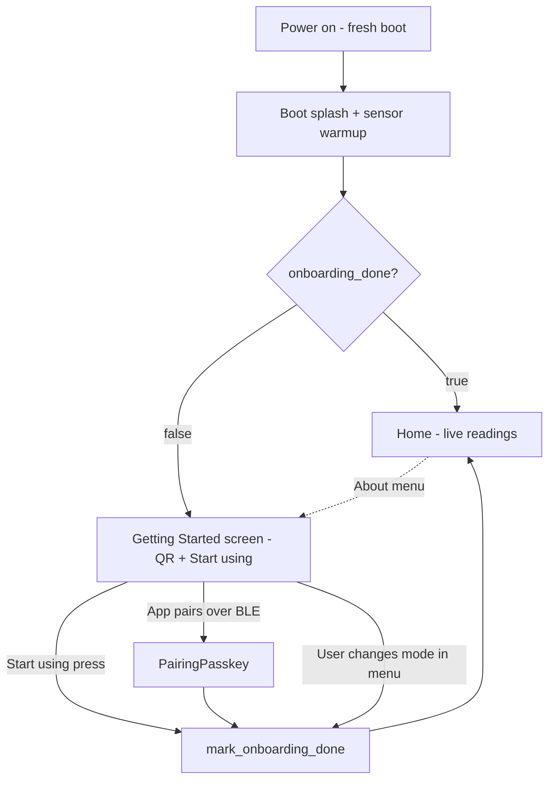

# First Boot Onboarding

The AirGradient Go ships with no notion of "has this device been set up
before". A fresh unbox and a normal power-on after a ship-mode shutdown are
indistinguishable, so the firmware cannot show a one-time getting-started
guide and cannot stop showing it once the user is up and running. This spec
adds a minimal, non-blocking first-boot guide and a persistent flag that
suppresses it after the user has engaged once.

## Problem

- There is **no persistent first-boot / provisioned / onboarding flag**
  anywhere in `GoSettings`, `RtcAppState`, or elsewhere. `WifiService::has_been_online()`
  and the orchestrator's `_setup_session_active` are runtime-only latches.
- A new user has no on-device pointer to setup instructions. The companion
  app exists, but the Go is open source and fully usable standalone, so the
  device must not assume the app is present or required.
- The companion-app onboarding (see
  [`AGo_BLE_Client_Spec.md`](AGo_BLE_Client_Spec.md) and the iOS nearby
  onboarding spec) drives pairing, dashboard registration, and Wi-Fi from
  the phone. Capability 1 (Bluetooth pairing) already works on first boot
  because the default mode is Portable + BLE-advertising. The device-side
  job is therefore small: point the user at instructions and get out of the
  way.

## Goals

- Show a one-time **Getting Started** screen on the first interactive boot:
  a QR code to the setup landing page plus a single `Start using` action.
- The guide is **informational and non-blocking**. The device is already
  measuring and BLE-discoverable while it is shown; `Start using` is an
  acknowledgement, not a setup action.
- Persist an `onboarding_done` flag in NVS so the guide auto-shows only once.
  The flag flips `true` on **any real engagement**: a `Start using` press, a
  successful BLE pairing/bond, or an operating-mode change.
- Keep the default operating mode **Portable**. No forced Portable/Stationary
  choice at first boot.
- Make the guide retrievable later via `About → Setup Guide`.
- Clear the flag on factory reset so refurbished / returned units re-show the
  guide.

## Non-Goals

- **No on-device setup wizard or proceed/skip branching.** Real setup
  (pairing, dashboard registration, Wi-Fi) happens via the app over BLE or
  via the on-device menu. The device cannot perform dashboard registration
  and should not pretend to.
- **No `set_wifi` command on the Portable Config characteristic.** Letting
  the app provision Wi-Fi over the already-paired Portable link (iOS nearby
  onboarding spec, step 8) is a **separate, later, app-coordinated
  deliverable** with its own BLE protocol bump. Until then, Wi-Fi remains
  reachable by switching the device to Stationary mode, which keeps its
  existing QR provisioning.
- **No account / registration / claim concept in firmware.** Dashboard
  registration stays app- and cloud-side, keyed by device serial.
- **No new mode-selection UX.** Mode changes stay in the existing settings
  menu and BLE protocol.

## Design

### State and storage

Add one field to `GoSettings`:

```cpp
// go_settings.h
struct GoSettings {
  // ... existing fields ...
  bool onboarding_done = false;  // NVS key "obd"
};
```

- `load_go_settings()` reads key `"obd"`, defaulting to `false` when absent
  or invalid (matches the existing never-fails load contract).
- `save_go_settings()` writes `"obd"` alongside the other fields.
- Factory reset must clear it. Confirm the `factory_rst` path resets
  `GoSettings` to defaults (or explicitly clears `"obd"`); if it only deletes
  BLE bonds today, extend it to reset settings.

The flag is **durable NVS only**; it does not need to survive deep sleep via
`RtcAppState`, because deep sleep is Offline-mode only and the guide gate is
evaluated on the `Interactive` (`PowerOn`) boot path, which always reloads
`GoSettings` from NVS.

### First-boot gate

The `Interactive` boot already paints a `Booting...` splash and holds it
until the first `SensorDataReady`, then resets to `Home`. The gate hooks that
same transition:

```text
boot splash  ->  first SensorDataReady  ->  onboarding_done ? Home : GettingStarted
```

The decision is a pure predicate so it is host-testable in isolation, e.g.
`first_screen_after_splash(bool onboarding_done) -> Screen`.

### Getting Started screen

Add `Screen::GettingStarted` to the display layer. It is the **simplified
sibling of `Screen::Provisioning`**: it reuses the same 128x250 canvas, the
same QR pipeline (`qrcodegen` + `draw_provisioning_qr()`), and the same
title / QR / caption / instruction y-band structure from
`DisplayService::_draw_provisioning()`, but drops the connection-status band,
the helper text, and the second action row (no live connection state, no
transport switch).

The QR is encoded once on screen entry from a new generic URL encoder added
alongside the existing `encode_go_to_app_qr()` / `encode_wifi_qr()` encoders
(those two are purpose-built — an app deep-link and a `WIFI:` join descriptor
respectively — and neither encodes an arbitrary setup URL).

### Screen layout

Modeled on the live `Screen::Provisioning` layout, reusing its font and
y-band conventions. First-boot (gate) entry:

```text
+----------------------+  y=0
|      Getting         |  y=21   logisoso16   (title L1)
|      Started         |  y=40   logisoso16   (title L2)
|                      |
|   ##  ####  ## ##     |
|   #  ##  # ## ##      |
|   ## ##  ## #  #      |  QR -> https://l.airgradient.net/GO
|   #  #### # ## #      |  (short link -> low QR version, fat modules)
|   #### #  ##  ##      |
|                      |
|    Scan to set up     |  y=118  helvR08      (caption: QR = setup)
|                      |
|  Or use it right now  |  y=136  helvR08      (instruction: explains button)
|                      |
|                      |   (status band + helper row omitted)
|    [ Start using ]    |  y=232  action row 0 (single)
+----------------------+  y=250
```

The screen presents two parallel, honest choices: the **QR** is the optional
setup path (app or standalone docs via `https://l.airgradient.net/GO`), and
the **button** is the just-use-it-now path. The single instruction line names
the button's action so the label is guessable without visiting the website.
A single instruction line (vs two) also reads better on the 128px-wide panel.

`About → Setup Guide` entry is the same canvas; only the action row label
changes to `Back`, and it returns to the menu instead of `Home`.

The screen has two entry sources with different back-out semantics:

| Entry source | Action | Result |
|---|---|---|
| First boot (gate) | `Start using` | `mark_onboarding_done()` then go to `Home` |
| `About → Setup Guide` | `Back` | return to the menu (flag unchanged) |

### Engagement → `onboarding_done`

A single idempotent helper centralizes the write and guards redundant NVS
commits:

```cpp
void GoOrchestrator::mark_onboarding_done() {
  if (_settings.onboarding_done) return;
  _settings.onboarding_done = true;
  save_go_settings(_store, _settings);
}
```

Call sites:

- `Start using` press on `Screen::GettingStarted` (boot-path entry).
- Successful BLE pairing / bond established (the existing pairing-success
  event path). If pairing starts while the guide is showing, the
  `PairingPasskey` screen takes over; after the bond it lands on `Home`, not
  back on the guide.
- `change_mode()` — any operating-mode change implies the user knows what
  they are doing.

### Flow



### QR target

Point the QR at the short setup link `https://l.airgradient.net/GO`. It is a
neutral redirect to the setup landing page that branches to "use the app" or
"use it standalone", so it respects the open-source promise instead of
hard-linking the app binary.

At ~28 bytes (byte mode) it encodes to a low QR version with comfortably
scannable modules on the 128x250 e-paper — much better than a full
documentation URL, which would render dense at ~3 px per module.

## Implementation Plan

1. **`main/go_settings.{h,cpp}`** — add `bool onboarding_done` with NVS key
   `"obd"`; wire into `load_go_settings` / `save_go_settings` plus a
   validation predicate. Verify / extend the `factory_rst` path so the flag
   resets.
2. **`components/airgradient-provisioning/services/provisioning_qr.h`** — add
   a generic URL encoder (e.g. `encode_url_qr(url)`) alongside
   `encode_go_to_app_qr()` / `encode_wifi_qr()` for the
   `https://l.airgradient.net/GO` setup link.
3. **`main/go_display.{h,cpp}`** — add `Screen::GettingStarted`; render the
   title / QR / caption / instruction / single `Start using` action row on the
   provisioning canvas via the existing `draw_provisioning_qr()` path (status
   band, helper text, and second action row omitted).
4. **`main/go_ui.{h,cpp}`** — handle `GettingStarted` in the state machine
   (build values, action row), with `Back → menu` vs `Start using → Home`
   depending on entry source; add the `About → Setup Guide` menu entry.
5. **`main/go_orchestrator.cpp`** — evaluate the first-boot gate at the
   splash → Home transition; add `mark_onboarding_done()` and call it from the
   `Start using` action, the BLE pairing-success event, and `change_mode()`.
6. **Docs** — update [`docs/settings.md`](../docs/settings.md) (new field),
   [`docs/ui_manager.md`](../docs/ui_manager.md) (new screen + nav), and
   [`ARCHITECTURE.md`](../ARCHITECTURE.md) (first-run note); follow
   [`docs/STYLE.md`](../../../docs/STYLE.md).

## Testing Strategy

Host tests under `tests/` (`go_*.tests.cpp`):

- **Gate predicate** — `onboarding_done == false` selects `GettingStarted`;
  `true` selects `Home`.
- **`mark_onboarding_done()` idempotency** — first call sets + persists; a
  second call is a no-op (no redundant write).
- **Settings round-trip** — `save` then `load` preserves `onboarding_done`;
  absent key loads as `false`.
- **Engagement paths** — `Start using`, BLE-pair success, and `change_mode()`
  each set the flag; factory reset clears it.

Verification commands (run after exporting ESP-IDF in the same shell):

```sh
idf.py -C products/go build
cmake --build tests/build
ctest --test-dir tests/build --output-on-failure
```

## Open Questions

- **`Start using` vs auto-advance.** This spec uses an explicit `Start using`
  press. If field feedback shows users get stuck on the guide, revisit a
  timeout-based auto-advance.
- **Wi-Fi-over-Portable `set_wifi`.** Tracked as a separate deliverable; this
  spec only guarantees the guide does not block it later.
