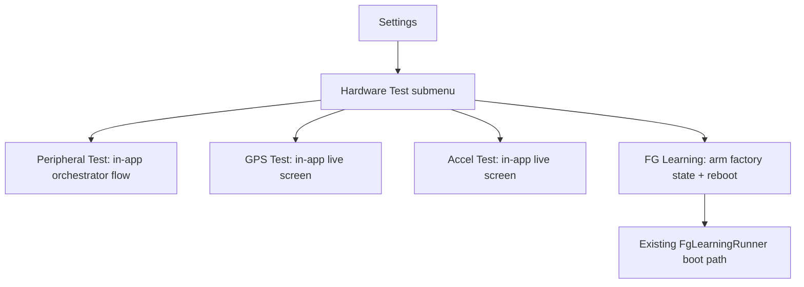
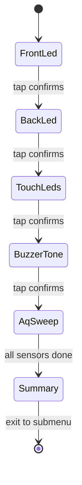

# Hardware Test Spec

> **This is a spec.** It describes how a feature **will be built**, not what
> currently exists. Once the feature ships, the corresponding doc under
> `products/go/docs/` becomes the source of truth and this file is typically
> deleted. See [`docs/STYLE.md`](../../../docs/STYLE.md) → "Doc Lifecycle".

AirGradient Go will gain a single **Hardware Test** area, reachable from device
**Settings**, that lets an operator verify every Go peripheral on-device without
special tools or a hidden factory boot gesture. It groups five flows behind one
new sub-screen: a sequential peripheral test (actuators then air-quality
sensors), a GPS test, an accelerometer test, and an in-menu arm for the existing
fuel-gauge (FG) learning routine. The desired outcome is fast, repeatable
pass/fail hardware validation with clear display feedback and buzzer cues.

## Problem

Today the Go firmware has **no user-reachable hardware test surface**:

- The only factory-adjacent flow is fuel-gauge learning, which is a fully
  separate boot path armed by an undiscoverable GPIO gesture (two BOOT
  short-presses while in pre-onboarding manufacturing mode). It is invisible
  from the normal UI and cannot be triggered from Settings.
- There is **no way to confirm a peripheral works** from the device itself. AQ
  sensors are only validated implicitly by whether readings appear on the Home
  screen; a present-but-failing sensor is hard to distinguish from a warming-up
  one, and actuators (LEDs, buzzer) have no verification step at all.
- GPS has no on-device diagnostics: there is no time-to-first-fix (TTFF)
  readout and no fix/satellite summary screen for a technician to watch during
  bring-up.
- The board carries an accelerometer (STMicroelectronics LIS2DH12) that has
  **no driver, no reserved I2C address, and no test** anywhere in the tree.

An operator on a production line or a support technician in the field needs a
guided, on-device way to exercise each peripheral and read a clear pass/fail
result.

## Goals

- Add one **Hardware Test** sub-screen reachable from Settings, visible to all
  users, that lists every test flow.
- **Peripheral test:** run one item at a time, actuators first (front LED, back
  LED, touch LEDs, buzzer) then AQ sensors (SHT40, SGP41, SPS30, DPS368, CO2),
  showing on the display what is currently under test.
- Actuator steps are **operator-guided** (show the effect, operator taps to
  confirm Pass or marks Fail) since there is no electrical readback.
- AQ sensor steps are **automatic** and report `PASS` / `ABSENT` /
  `FAIL (bad reading)`, with a buzzer success cue on pass and an alert cue on
  fail.
- AQ pass criterion: **I2C presence probe (ACK) → one `read()` → field
  validation**.
- Keep a **single I2C bus owner** during the AQ sweep by running it inside the
  existing sensor producer task (test mode), not a second concurrent accessor.
- **GPS test:** show a periodically-refreshed screen with TTFF, fix type,
  satellite count, HDOP, latitude/longitude, and UTC time.
- **Accelerometer test:** add a LIS2DH12 driver and a live X/Y/Z readout with an
  automatic identity + sanity pass/fail.
- **FG learning:** expose it as a Settings action that arms the run and reboots
  into the **existing `FgLearningRunner` boot path unchanged**, behind a strong
  confirmation dialog.
- Keep `UIManager` hardware-free; all side effects live in the orchestrator.
- Host-test the pure logic (navigation, flow state machine, sensor result
  mapping, TTFF measurement, accelerometer sanity helpers).

## Non-Goals

- Do **not** rebuild or restructure the fuel-gauge learning routine. The menu
  only arms it; the multi-hour, ship-mode run stays on its separate boot path.
- Do **not** expose raw NMEA sentences. The GPS test shows parsed fields only.
- Do **not** electrically verify actuators. LED/buzzer results are
  operator-judged by design.
- Do **not** add a project-wide status/result framework, allocator, or new RTOS
  primitive.
- Do **not** gate the Hardware Test menu behind manufacturing mode in this
  iteration (it is visible to everyone; see Open Questions).
- Do **not** run the peripheral tests as a separate reboot path — they run
  in-app using already-initialized services.

## Design

### Navigation And Placement

A new navigation-style Settings row, **"Hardware Test"** (mirroring the existing
"Setup Guide" row), opens a new `Screen::HardwareTest` submenu. Each row either
enters a live test screen or fires an action.

| Row | Target | Style |
|---|---|---|
| Peripheral Test | actuator + AQ sweep flow | guided then auto |
| GPS Test | live GPS status screen | live view |
| Accelerometer Test | live accelerometer readout | live view + auto pass/fail |
| FG Learning | confirm → arm → reboot | destructive action |
| Back | parent (Settings) | navigation |

The submenu follows the established `UIManager` menu pattern: a
`populate_*_rows`, a `dispatch_*`, a `move_*`, and a `navigate_back()` case.
`UIManager` emits new `UIAction` values; the orchestrator performs all hardware
side effects.

```text
Settings -> Hardware Test -> { Peripheral Test, GPS Test, Accel Test, FG Learning }
```

### Ownership Model

The peripheral, GPS, and accelerometer tests run **inside the normal app**,
driven by the orchestrator, reusing already-initialized services (display, LED,
buzzer, sensor producer, GPS). Only the FG learning row leaves the app: it
writes factory state and reboots into the existing separate runner.



### Peripheral Test Flow

The orchestrator owns a small flow state machine. Actuators run first as
operator-guided steps; AQ sensors run second as automatic steps. The display
always shows the current item; the buzzer beeps pass/fail on the sensor steps.



**Actuator steps (operator-guided).** Each step drives the effect and shows a
prompt such as _"Front LED — do you see it?"_ with a Pass/Fail choice. The
operator taps to confirm Pass or marks Fail, then the flow advances. Steps:
front LED brightness on, back LED colour cycle, touch LED flash, buzzer tone.

**AQ sweep (automatic).** Runs one sensor at a time. For each attached sensor
the sequence is:

```text
i2c_master_probe (ACK) -> read() -> field validation -> classify result
```

Results are classified per sensor:

| Result | Meaning | Buzzer cue |
|---|---|---|
| `PASS` | Probe ACK and one field-valid reading | success pattern |
| `ABSENT` | No I2C ACK on the sensor address | alert pattern |
| `FAIL (bad reading)` | Present but read failed or values invalid | alert pattern |

The sweep runs **inside the sensor producer task** so the producer remains the
single bus owner. The orchestrator asks the producer to enter a **test mode**;
the producer calls a new `SensorManager::run_self_test()` that iterates each
attached sensor (probe + read + validate) and streams per-sensor results back
via the event queue. When the sweep completes, the producer resumes normal
posting. Because the same task that normally reads the bus performs the probe,
there is no cross-task bus contention and no pause/handshake race.

The Go AQ sensors and their fixed I2C addresses (from `board_config.h`):

| Sensor | Address | Field validated |
|---|---|---|
| SHT40 | `0x44` | temperature / humidity |
| SGP41 | `0x59` | TVOC / NOx index |
| SPS30 | `0x69` | PM2.5 |
| DPS368 | `0x77` | pressure |
| CO2 (S12 / SCD4x / STCC4) | `0x68` / `0x62` / `0x64` | CO2 ppm |

The CO2 row reflects whichever CO2 device the existing auto-detect chain
selected at boot.

### GPS Test

On entry the orchestrator starts a TTFF timer, ungates the GNSS receiver, and
refreshes a status screen every one to two seconds until the user exits. The
screen shows parsed fields only (no raw NMEA):

| Field | Source |
|---|---|
| `TTFF mm:ss` | elapsed time from entry to first valid fix (frozen once fixed) |
| Fix type | `NoFix` / `2D` / `3D` |
| Satellites | satellite count |
| HDOP | horizontal dilution of precision |
| Latitude / Longitude | parsed position |
| UTC time | parsed timestamp |

This requires adding a **TTFF measurement** (time from receiver start to first
valid fix) and a small accessor to surface the already-parsed `GpsData` fields
for the test screen. No new NMEA parsing is needed.

### Accelerometer Test

The board carries a LIS2DH12 that has no driver yet, so a **new I2C driver** is
required under `components/`. On entry the test performs:

```text
WHO_AM_I check -> read X/Y/Z -> rest-magnitude sanity (~1 g) -> classify
```

The screen shows a live X/Y/Z readout. The test passes when the `WHO_AM_I`
identity matches and the readings are sane (at rest, the acceleration vector
magnitude is near 1 g); the buzzer beeps pass or fail. The driver attaches to
the shared I2C master bus through a board factory (`new_accel_sensor()`), with
its address added to `board_config.h`. If the accelerometer is only populated on
some board variants, the driver is variant-gated the same way the LED and buzzer
services already are.

### FG Learning Arm

The FG Learning row is a **destructive action** guarded by a strong confirmation
dialog that warns it is a multi-hour, ship-mode routine. On confirm, the
orchestrator writes `FactorySettings{ fg_learning_stage = Charge, cycle = 1,
itpor_losses = 0 }` and reboots. On the next boot, `GoApp::run()` sees a non-Idle
stage and routes into the **existing `FgLearningRunner` unchanged**. This reuses
the entire learning implementation; the menu is only an in-app arming trigger
that supplements the current manufacturing-mode BOOT gesture.

### Interface Sketches

```cpp
// go_ui.h — new screen + actions (UIManager stays hardware-free)
enum class Screen : uint8_t { /* ...existing... */ HardwareTest /* + per-test */ };

enum class UIAction : uint8_t {
  /* ...existing... */
  OpenHardwareTest,   ///< enter the Hardware Test submenu
  RunPeripheralTest,  ///< begin the actuator + AQ sweep flow
  PeripheralStepPass, ///< operator confirmed the current actuator step
  PeripheralStepFail, ///< operator marked the current actuator step failed
  OpenGpsTest,        ///< enter the live GPS test screen
  OpenAccelTest,      ///< enter the live accelerometer test screen
  ArmFgLearning,      ///< confirmed: write factory state and reboot
};
```

```cpp
// sensor_manager.h — per-sensor diagnostic sweep (runs in the producer task)
enum class SensorTestResult : uint8_t { Pass, Absent, BadReading };

struct SensorTestReport {
  const char *name;          ///< static label, e.g. "SHT40"
  SensorTestResult result;
};

// Probe + one read + field validation for each attached sensor.
// Returns the number of reports written.
size_t run_self_test(SensorTestReport *out, size_t capacity);
```

```cpp
// New LIS2DH12 driver (components/airgradient-sensors/drivers/lis2dh12/)
class Lis2dh12 {
public:
  explicit Lis2dh12(i2c_master_bus_handle_t bus, uint8_t address /* 0x18 or 0x19 */);
  bool init();                 ///< probe + WHO_AM_I identity check
  bool read(AccelData &out);   ///< raw or g-scaled X/Y/Z
};
```

## Implementation Plan

Each step is small enough to land as a focused commit.

1. **UI submenu.** Add `Screen::HardwareTest` (and per-test screens), a
   `SETTING_HARDWARE_TEST` navigation row, the new `UIAction` values, and the
   `populate_*` / `dispatch_*` / `move_*` / `navigate_back` handlers. Host-test
   navigation.
2. **Sensor diagnostic sweep.** Add `SensorManager::run_self_test()` (probe +
   read + validate per attached sensor) and a producer test mode that runs the
   sweep and streams `SensorTestReport`s back via the event queue, then resumes
   normal posting.
3. **Peripheral test flow.** Add the orchestrator flow state machine: guided
   actuator steps (front LED, back LED, touch LEDs, buzzer) with tap-to-confirm,
   then the AQ sweep, then the summary screen, with buzzer pass/fail cues.
4. **Display renderers.** Add renderers for the peripheral step, per-sensor
   result, and summary screens.
5. **GPS test.** Add TTFF measurement to the GPS service and a parsed-field
   accessor; add the live GPS test screen and its periodic refresh in the
   orchestrator.
6. **Accelerometer driver.** Add the LIS2DH12 driver under `components/`, a
   `board_config.h` address constant, and a `new_accel_sensor()` board factory
   attaching to the shared I2C bus (variant-gated if needed).
7. **Accelerometer test.** Add the live X/Y/Z screen with identity + sanity
   pass/fail and buzzer cue.
8. **FG learning arm.** Add the FG Learning row, a strong confirm dialog, and
   the orchestrator handler that writes factory state and reboots into the
   existing runner.
9. **Docs.** Add a service doc under `products/go/docs/` describing the shipped
   Hardware Test surface, then delete this spec.

## Testing Strategy

Host tests (pure logic):

- UIManager: Hardware Test submenu navigation, row dispatch, back-navigation,
  and each new `UIAction` emission.
- Peripheral flow state machine: actuator step ordering, tap-to-confirm
  Pass/Fail transitions, transition into the AQ sweep, and the summary.
- `SensorManager::run_self_test()`: result classification (`Pass` / `Absent` /
  `BadReading`) against mocked sensor probe/read outcomes.
- GPS TTFF measurement: elapsed time from start to first valid fix, and that it
  freezes on the first fix.
- Accelerometer sanity helpers: `WHO_AM_I` identity check and rest-magnitude
  classification against synthetic X/Y/Z inputs.

Hardware-in-the-loop / manual verification:

- Actuators: confirm each LED group and the buzzer respond during the guided
  steps.
- AQ sweep: confirm each present sensor reports `PASS`, and an unplugged/covered
  sensor reports `ABSENT` or `FAIL`.
- GPS: confirm TTFF counts up and freezes on fix, with a plausible position.
- Accelerometer: confirm live X/Y/Z tracks orientation and the test passes at
  rest.
- FG learning: confirm the Settings action arms factory state and reboots into
  the existing learning runner.

Verification commands:

```sh
. "$HOME/Tools/esp/esp-idf/export.sh"
idf.py -C products/go build
```

```sh
cmake -S tests -B tests/build -DCMAKE_EXPORT_COMPILE_COMMANDS=ON
cmake --build tests/build
ctest --test-dir tests/build --output-on-failure
```

## Open Questions

- **Accelerometer hardware facts are unconfirmed.** The I2C address (`0x18` vs
  `0x19`), whether the part is populated on all board variants or V1-only, and
  whether an INT line is routed to a GPIO are all TBD. These must be confirmed
  before the driver lands.
- **FG learning visibility.** It is currently visible to all users, mitigated by
  a strong confirm dialog. Revisit if it should instead be gated behind
  manufacturing mode.
- **e-paper refresh cadence.** The live GPS and accelerometer screens assume
  periodic refresh is acceptable on the e-paper; confirm partial-refresh support
  for smooth TTFF and X/Y/Z updates.
- **Accelerometer pass thresholds.** The exact rest-magnitude tolerance band
  around 1 g for a `PASS` needs to be pinned down against real device noise.
- **AQ warm-up sensitivity.** Field validation for CO2 and SGP41 may need a
  short settle allowance so a still-warming sensor is not misreported as
  `FAIL (bad reading)`.
