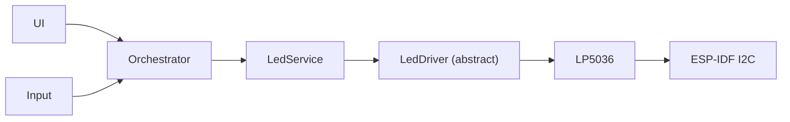
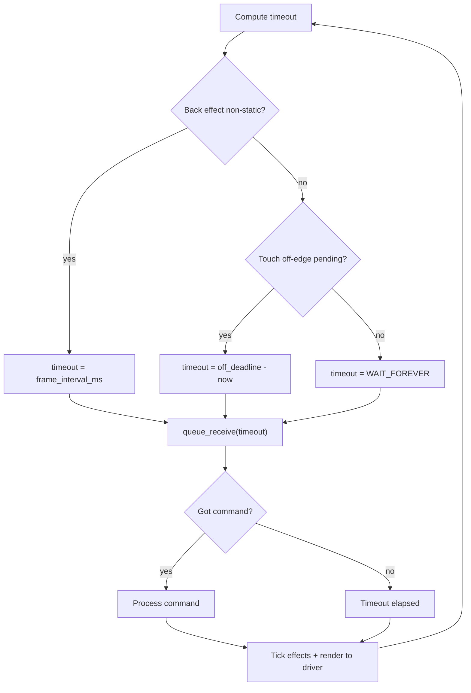

# LED Service Spec

> **This spec is implemented.** The service doc at
> [`products/go/docs/led_service.md`](../docs/led_service.md) is now the
> source of truth. This file is retained for design rationale reference.
> Where details differ (animation timings, BLE key names, boot defaults),
> the service doc and the code are authoritative.

AirGradient Go will drive the LP5036 36-channel LED controller on the
mobile-display sub-PCB through a product-local LED service. The service
will use an adaptive render loop that sleeps when all LEDs are static and
ticks at frame rate only when an animation is active, keeping CPU and
power usage minimal on battery. The implementation rolls out in four
scopes: driver and service, event wiring, UI synchronization, and
persistence.

## Problem

AirGradient Go has no LED abstraction in the current product tree. The
mobile-display sub-PCB carries an LP5036 that drives three LED categories:

- front display indicator LEDs
- back AQI indicator RGB LEDs
- touch-feedback RGB LEDs

The reference implementation mixes the LP5036 chip driver, product LED
policy, and asynchronous touch effects into one file. It uses a blocking
command-queue drain model that cannot support time-evolving effects like
blinking, breathing, color fading, or chase patterns. Adding any animation
requires special-case timer hacks outside the queue — the reference already
does this for LED8 charge-done blink using raw FreeRTOS timers wrapped in
`#ifndef TEST_HOST` guards, making the behavior untestable on the host.

The new implementation needs:

- A cleaner layered split (HAL, driver, service)
- An animation-capable architecture for the back LEDs
- Proper host testability for all time-dependent behavior
- Minimal power impact by sleeping when no animation is active

## Goals

- Add product-local LP5036 support under `products/go/main/led/`.
- Split into a HAL surface, an LP5036 driver, and a LED service.
- Make the LED service host-testable by consuming an abstract driver surface.
- Keep ESP-IDF I2C details inside the driver implementation.
- Support three LED groups: front (static), back (animated), and touch
  (flash manager).
- Use an adaptive render loop that ticks at frame rate only when a back
  animation is active, and sleeps on the command queue otherwise.
- Support back LED effects: Solid, Blink, Breathe, Fade, Chase, and
  Sequence (ordered chain of sub-effects).
- Support predefined Go-specific animations via a `BackAnimation` enum
  so the orchestrator can trigger multi-step sequences with one call.
- Use `Off / Dim / Mid / Bright` brightness for front and back LEDs.
- Use `Off / Dim / Bright` touch-feedback intensity.
- Use the shared `aqi::pm25_to_us_aqi` and `aqi::us_aqi_to_category`
  helpers from `airgradient-common` so the convenience AQI method resolves
  PM2.5 to category color without duplicating the breakpoint table.
- Allow new touch flash events to preempt the current flash off-edge.
- Gate LED wiring on board variant V1. Prototype boards must boot normally
  with the service in inert mode.
- Roll out in four focused scopes.
- Add a service doc at `products/go/docs/led_service.md` once shipped.

## Non-Goals

- Do not add a shared `components/airgradient-led/` component. This LED
  layout is product-specific.
- Do not implement LED8 charge-done or green-confirm flash behavior. That
  is a follow-up.
- Do not implement cross-group animation choreography. The orchestrator
  drives multi-group sequences by issuing calls in the order it needs.
- Do not implement effect layering within a group. Each group has one active
  effect; a new effect replaces the old one.
- Do not redesign BLE settings transport. LED settings will use the existing
  payload format.
- Do not introduce a project-wide status/result framework, allocator, or
  RTOS primitive.
- Do not unit-test the LP5036 bus protocol. It will be validated by firmware
  build and hardware checks.

## Design

### Board Variant

The LP5036 is only present on board variant V1. The Go hardware board
detects the variant during I2C bring-up by probing the BQ27427 fuel gauge
at `0x55`.

LED wiring reuses this existing detection. `LedService` is always
constructed so the orchestrator can call it unconditionally:

- On `BoardVariant::V1`: the hardware board constructs `LP5036` and then
  `LedService` with `Config::driver` set to the LP5036 instance.
- On `BoardVariant::Prototype`: the hardware board constructs `LedService`
  with `Config::driver = nullptr` (inert mode).

### Layering



Inside `LedService`, three independent groups:

```text
┌─────────────────────────────────────────────┐
│  LedService                                 │
│  ┌──────────┐  ┌──────────┐  ┌───────────┐ │
│  │  Front   │  │   Back   │  │   Touch   │ │
│  │  direct  │  │  effect  │  │   flash   │ │
│  │  write   │  │  engine  │  │  manager  │ │
│  └──────────┘  └──────────┘  └───────────┘ │
│              command queue                   │
│           adaptive render loop              │
└─────────────────────────────────────────────┘
```

Tests mock `LedDriver` and exercise `LedService`; the LP5036 `.cpp` file
is not linked into host tests.

### Files

| File | Scope | Change |
|---|---|---|
| `products/go/main/led/go_led_types.h` | 1 | New: `Rgb`, `LedBrightness`, `TouchLedIntensity`, `TouchPad`, `BackStep`, `BackAnimation` |
| `products/go/main/led/go_led_hal.h` | 1 | New abstract `LedDriver` surface |
| `products/go/main/led/go_led_driver.h` | 1 | New LP5036 declaration |
| `products/go/main/led/go_led_driver.cpp` | 1 | New LP5036 implementation |
| `products/go/main/led/go_led.h` | 1 | New `LedService` declaration |
| `products/go/main/led/go_led.cpp` | 1 | New `LedService` implementation |
| `products/go/main/CMakeLists.txt` | 1 | Add LED sources and `led` include path |
| `products/go/tests/go_led.tests.cpp` | 1 | New service tests with mocked driver |
| `products/go/tests/CMakeLists.txt` | 1 | Add `go_led_tests` target |
| `products/go/main/go_board.h` | 2 | Add `led_service()` accessor |
| `products/go/main/go_hardware_board.{h,cpp}` | 2 | Construct and expose the LED service |
| `products/go/main/go_app.{h,cpp}` | 2 | Pass LED service into wiring |
| `products/go/tests/go_app_stubs.cpp` | 2 | Extend board mock |
| `products/go/main/go_orchestrator.{h,cpp}` | 2, 3 | Route events and apply settings |
| `products/go/main/go_settings.h` | 3 | Add in-memory LED settings |
| `products/go/main/go_ui.{h,cpp}` | 3 | Add settings menu rows |
| `products/go/main/go_settings.cpp` | 4 | Persist LED settings |
| `products/go/main/go_ble_protocol.h` | 4 | BLE setting keys |
| `products/go/main/go_ble.cpp` | 4 | Encode and decode LED settings |
| `products/go/docs/led_service.md` | 4 | New service doc |

### HAL Surface

`go_led_hal.h` contains the abstract `LedDriver` surface. It does not
include ESP-IDF headers.

```cpp
#pragma once

#include <cstdint>

// ISR-safe:    no
// Thread-safe: no. LedService serializes access via the worker task.
// Blocking:    yes. I2C transactions may wait up to timeout.
// Allocates:   no after construction.
class LedDriver {
public:
  virtual ~LedDriver() = default;

  virtual bool init() = 0;
  virtual bool set_channel(uint8_t channel, uint8_t pwm) = 0;
  virtual bool set_rgb(uint8_t b_channel, uint8_t r, uint8_t g, uint8_t b) = 0;

  static constexpr uint8_t NUM_CHANNELS = 36;
};
```

### LP5036 Driver Declaration

`go_led_driver.h` contains the concrete LP5036 declaration. Production
wiring includes this header; `LedService` does not.

```cpp
#pragma once

#include "go_led_hal.h"

#include <cstddef>
#include <cstdint>

#ifndef TEST_HOST
#include <driver/i2c_master.h>
using LedI2cBusHandle = i2c_master_bus_handle_t;
using LedI2cDevHandle = i2c_master_dev_handle_t;
#else
using LedI2cBusHandle = void *;
using LedI2cDevHandle = void *;
#endif

class LP5036 final : public LedDriver {
public:
  struct Config {
    uint8_t address = 0x33;
    uint32_t scl_speed_hz = 400000;
    int timeout_ms = 100;
  };

  LP5036(LedI2cBusHandle bus, const Config &config);
  ~LP5036() override;

  LP5036(const LP5036 &) = delete;
  LP5036 &operator=(const LP5036 &) = delete;

  bool init() override;
  bool set_channel(uint8_t channel, uint8_t pwm) override;
  bool set_rgb(uint8_t b_channel, uint8_t r, uint8_t g, uint8_t b) override;

private:
  Config _config;
  LedI2cBusHandle _bus = nullptr;
  LedI2cDevHandle _dev = nullptr;

  bool _write_reg(uint8_t reg, uint8_t value);
  bool _write_block(uint8_t reg, const uint8_t *data, size_t len);
};
```

### LP5036 Register Behavior

| Register | Address | Use |
|---|---|---|
| `DEVICE_CONFIG0` | `0x00` | Set `CHIP_EN` (bit 6, mask `0x40`) during `init()` |
| `DEVICE_CONFIG1` | `0x01` | Write `0b00111000` for auto-increment and PWM dithering |
| `OUT0_COLOR` | `0x14` | Base of per-channel PWM registers; channel `n` is `0x14 + n` |

`init()` sequence:

1. Register the device on the I2C bus.
2. Write `CHIP_EN` to `DEVICE_CONFIG0`.
3. Write the default config byte to `DEVICE_CONFIG1`.
4. Write zero to all 36 PWM channels so the chip boots dark.

`set_channel(channel, pwm)` writes `pwm` to `OUT0_COLOR + channel`.
Returns `false` when `channel >= NUM_CHANNELS`.

`set_rgb(b_channel, r, g, b)` treats `b_channel` as the lowest channel
of an RGB group. Returns `false` when `b_channel + 2 >= NUM_CHANNELS`.
Writes: `b_channel + 0 = b`, `+1 = g`, `+2 = r`.

### Public Types

`go_led_types.h` has no dependencies beyond `<cstdint>`.

```cpp
#pragma once

#include <cstdint>

struct Rgb {
  uint8_t r = 0;
  uint8_t g = 0;
  uint8_t b = 0;
};

enum class LedBrightness : uint8_t {
  Off = 0,
  Dim = 1,
  Mid = 2,
  Bright = 3,
};

enum class TouchLedIntensity : uint8_t {
  Off = 0,
  Dim = 1,
  Bright = 2,
};

enum class TouchPad : uint8_t {
  Select = 0,
  Left = 1,
  Right = 2,
};

/// A single step in a back-LED sequence. Used by back_play() and
/// internally by back_animate().
struct BackStep {
  enum class Effect : uint8_t { Solid, Blink, Breathe, Fade, Chase };
  Effect effect;
  Rgb color;
  uint32_t param_ms; // Hold (Solid), period (Blink/Breathe), duration (Fade), step time (Chase)
};

/// Predefined Go-specific back-LED sequences. Each value maps to an
/// internal constexpr BackStep array resolved at enqueue time.
/// These are convenience wrappers so the orchestrator does not need
/// to know the step details.
enum class BackAnimation : uint8_t {
  Boot = 0,
};
```

The old spec's `BackLedMode` enum is removed. The orchestrator sets effects
directly instead of selecting a mode.

### LedService API

```cpp
#pragma once

#include "go_led_hal.h"
#include "go_led_types.h"
#include "rtos.h"

#include <cstdint>

class LedService {
public:
  struct Config {
    LedDriver *driver = nullptr;
    uint16_t task_stack_size = 2048;
    uint8_t task_priority = 3;
    uint8_t queue_depth = 8;
    uint32_t touch_flash_ms = 120;
    uint32_t frame_interval_ms = 30; // ~33 fps when animating
  };

  explicit LedService(const Config &config);
  ~LedService();

  bool init();
  bool start();

  // --- Front (static) ---
  void front_set_brightness(LedBrightness brightness);

  // --- Back (animated) ---
  void back_solid(Rgb color);
  void back_blink(Rgb color, uint32_t period_ms);
  void back_breathe(Rgb color, uint32_t period_ms);
  void back_fade_to(Rgb color, uint32_t duration_ms);
  void back_chase(Rgb color, uint32_t step_ms);
  void back_off();
  void back_set_brightness(LedBrightness brightness);

  // --- Back (sequences) ---

  /// Play a transient sequence of up to MAX_SEQUENCE_STEPS sub-effects.
  /// Each step runs to completion, then the next starts. When the
  /// sequence finishes, the service auto-restores the previous back
  /// effect if it was static. See "Auto-Restore" in the design section.
  static constexpr uint8_t MAX_SEQUENCE_STEPS = 6;
  void back_play(const BackStep *steps, uint8_t count);

  /// Play a predefined Go-specific animation. Resolves the enum to a
  /// constexpr BackStep array on the caller side, then enqueues via
  /// back_play().
  void back_animate(BackAnimation animation);

  /// Convenience: resolves PM2.5 -> AQI -> category -> Rgb, then
  /// enqueues back_solid() with the resolved color.
  void back_update_aqi(float pm25_ugm3);

  /// Convenience: enqueues back_off(). Use when a PM2.5 reading fails
  /// validation so the back LEDs do not show a stale color.
  void back_clear_aqi();

  // --- Touch (flash only) ---
  void touch_flash(TouchPad pad);
  void touch_set_intensity(TouchLedIntensity intensity);

private:
#ifdef TEST_HOST
  friend class LedServiceTestAccess;
  void pump_for_test(uint32_t now_ms);
#endif
  // ... internal state, worker, command queue ...
};
```

### Back Effect Engine

The back LED group supports time-evolving effects through a tagged-union
state machine. No virtual dispatch, no heap allocation.

#### Effect State

```cpp
struct BackEffectState {
  enum class Type : uint8_t { Off, Solid, Blink, Breathe, Fade, Chase, Sequence };
  Type type = Type::Off;

  Rgb color;              // Primary color for the active primitive effect
  uint32_t param_ms = 0;  // Period (Blink/Breathe), duration (Fade), step time (Chase)
  Rgb fade_from;          // Fade only: captured start color

  uint32_t started_at_ms = 0;

  // Sequence fields (only used when type == Sequence)
  BackStep steps[6];      // MAX_SEQUENCE_STEPS
  uint8_t step_count = 0;
  uint8_t current_step = 0;
};
```

#### Effect Behaviors

**Off:** All 5 back LEDs output `{0, 0, 0}`. Static.

**Solid:** All 5 back LEDs output `color`. Static.

**Blink:** Toggles all 5 LEDs between `color` and off at `period_ms`.
First half on, second half off. Looping.

**Breathe:** Smoothly ramps brightness between 100% and 0% of `color`
over `period_ms` using a cosine waveform:
`factor = (1 + cos(2 * pi * elapsed / period)) / 2`. Starts at full
brightness (t=0 is 100%), eases down to 0% at the half-period, eases back
up to 100% at the full period. Looping. The cosine curve gives natural
ease-in-ease-out dwell at the extremes — the industry standard for
breathing LEDs. ESP32 hardware FPU makes `cosf()` negligible.

Starting at 100% means transitioning from `back_solid(color)` to
`back_breathe(color, period)` produces no visual discontinuity on the
first frame.

**Fade:** Linearly interpolates each RGB channel from `fade_from` to
`color` over `duration_ms`. One-shot: holds `color` when elapsed is at
or past `duration_ms`. When the worker receives a Fade command, it
captures `fade_from` from `_last_rendered_back` — the last computed
**effect-space** color (before brightness scaling). The worker updates
`_last_rendered_back` each tick with the current effect output.

Capturing in effect-space avoids double-scaling: brightness is always
applied as the final step before writing to the driver, so the fade
interpolates clean colors regardless of the current brightness setting.
For example, fading from a Breathe that is currently at 40% of its cycle
starts the fade from the 40%-of-peak color, and brightness scaling is
applied once on the output.

**Limitation:** `_last_rendered_back` stores a single `Rgb` representing
the uniform back color. During an active Chase, some LEDs are lit and
others are dark — the frame is non-uniform. Fading from an active Chase
captures the chase's base color as `fade_from`, which may produce a
visible jump for partially-lit LEDs. In practice this is acceptable
because Chase typically completes before a Fade is issued (e.g., in a
sequence, the Chase step finishes before the Fade step begins).

**Chase:** Fills the 5 back LEDs sequentially. LED at index `n` (in
physical order: LED3, LED5, LED6, LED7, LED9) lights up when elapsed is at
or past `n * step_ms`. LEDs stay lit once activated. One-shot: holds the
all-lit frame when elapsed is at or past `5 * step_ms`.

**Sequence:** Plays an ordered list of sub-effects (up to
`MAX_SEQUENCE_STEPS`). The worker maintains a `current_step` index. Each
step runs as if it were a standalone primitive effect. `param_ms` always
means the effect's native timing parameter — it is **not** overloaded as
a separate hold duration:

| Step Effect | `param_ms` meaning | Step advances after |
|---|---|---|
| Solid | Hold duration | `param_ms` elapses |
| Blink | Period (one on/off cycle) | One full cycle (`param_ms`) |
| Breathe | Period (one breathe cycle) | One full cycle (`param_ms`) |
| Fade | Fade duration | Fade completes (`param_ms`) |
| Chase | Per-LED step time | All 5 lit (`5 * param_ms`) |

Additional rules:

- When a step is a Fade, `fade_from` is auto-captured from
  `_last_rendered_back` — the actual color on the LEDs when the step
  begins.
- When all steps complete, the service auto-restores the previous back
  effect (see "Auto-Restore" below).
- To run multiple Breathe cycles, repeat the step or use a longer period.

#### Auto-Restore

Sequences are **transient overlays** — they play to completion and then
the service returns to what was showing before. This lets the
orchestrator fire notification or alert animations without manually
tracking and re-setting the steady-state display.

When the worker receives a `BackPlay` command it saves the current back
effect into `_saved_back_effect` before starting the sequence:

| Previous Back Effect | Saved? | After Sequence Completes |
|---|---|---|
| Static (Off, Solid, completed Fade/Chase) | Yes | Restore saved effect |
| Non-static (Blink, Breathe, active Sequence) | No | Hold final sequence frame |

Restore rules:

- Any direct primitive call (`back_solid`, `back_breathe`, `back_blink`,
  `back_fade_to`, `back_chase`, `back_off`, `back_update_aqi`,
  `back_clear_aqi`) **clears** `_saved_back_effect`. These are explicit
  state changes, not temporary overlays.
- A new `back_play()` during an active sequence replaces the sequence
  but **keeps** the original saved effect — the new sequence inherits
  the restore target.
- `back_set_brightness()` does **not** clear the saved effect. Brightness
  is orthogonal.

Example — notification overlay while showing AQI:

```text
State: back_solid(aqi_green)  — static, steady state
  → back_play(alert_steps)
    Worker saves "solid aqi_green"
    Alert sequence plays...
    Sequence completes
    Worker restores "solid aqi_green"
State: back_solid(aqi_green)  — back to steady state
```

For steady-state changes (mode transitions, AQI updates), the
orchestrator uses standalone primitives. These replace the current
effect outright and clear any saved state. Transient boot or
notification animations may use `back_animate()` or `back_play()`.

`back_animate(BackAnimation)` resolves the enum to a `constexpr` step
array on the caller side and enqueues the same command as `back_play()`.
Since it delegates to `back_play()`, it has the same auto-restore
behavior. Adding a new predefined animation requires only a new enum
value and a corresponding step array — no new methods or command kinds.

#### Predefined Animations

**`BackAnimation::Boot`** — played by the orchestrator at startup. The
previous state at boot is Off, so auto-restore returns to Off after
completion. The orchestrator sets the next state (`back_breathe()` or
`back_update_aqi()`) when ready.

```cpp
// Preliminary — tune timings on hardware in Scope 2.
constexpr BackStep BOOT_STEPS[] = {
    {BackStep::Effect::Chase, {255, 255, 255}, 80},  // white fill ~400 ms
    {BackStep::Effect::Solid, {255, 255, 255}, 200},  // hold white 200 ms
};
```

#### Zero Timing Parameters

All public methods and sequence steps define explicit behavior when
`param_ms` is zero:

| Call / Step | `param_ms = 0` Behavior |
|---|---|
| `back_blink(color, 0)` | Treated as `back_solid(color)` |
| `back_breathe(color, 0)` | Treated as `back_solid(color)` |
| `back_fade_to(color, 0)` | Immediate snap to target color |
| `back_chase(color, 0)` | All 5 LEDs immediately lit |
| Sequence step with `param_ms = 0` | Immediate completion — advance to next step |

The principle: zero means "instant," never undefined.

`back_play()` also guards its pointer and count arguments:

- `steps == nullptr` → no-op, do not enqueue.
- `count == 0` → no-op, do not enqueue.

#### Static Detection

An effect is **static** when it will produce the same output frame
indefinitely without further ticking:

| Effect | Static When |
|---|---|
| Off | Always |
| Solid | Always |
| Blink | Never (loops) |
| Breathe | Never (loops) |
| Fade | Elapsed at or past `duration_ms` |
| Chase | Elapsed at or past `5 * step_ms` |
| Sequence | All steps complete and auto-restore has been applied |

When a sequence completes, the worker applies auto-restore (or holds the
final frame if no saved state). The restored effect determines whether
the worker remains static or needs to keep ticking.

The worker uses static detection to decide whether the render loop needs
to keep ticking at frame rate.

### Worker: Adaptive Render Loop

The worker task owns all LED state. Public methods enqueue fire-and-forget
commands; the worker processes them and writes to the driver.

#### Adaptive Timeout



Power profile:

| State | CPU Impact |
|---|---|
| All static (normal AQI display) | Zero — worker blocked on queue |
| Touch flash only | One wake-up at the off-deadline |
| Back animation running | Ticks at ~33 fps (`frame_interval_ms`) |

#### Command Queue

```cpp
struct Cmd {
  enum class Kind : uint8_t {
    FrontSetBrightness,
    BackSolid, BackBlink, BackBreathe, BackFadeTo, BackChase, BackOff,
    BackSetBrightness, BackPlay,
    TouchFlash, TouchSetIntensity,
  };

  Kind kind;

  // Flat layout — no union.  Rgb and BackStep have default member
  // initializers which delete the default constructor of anonymous
  // unions (same issue as Event / GpsData in go_events.h).  A flat
  // struct avoids that footgun; the size cost is negligible.
  Rgb color;                     // Back* effects
  uint32_t param_ms = 0;         // Period / duration / step time
  LedBrightness brightness{};    // FrontSetBrightness, BackSetBrightness
  BackStep steps[6]{};           // BackPlay
  uint8_t step_count = 0;        // BackPlay
  TouchPad pad{};                // TouchFlash
  TouchLedIntensity intensity{}; // TouchSetIntensity
};
```

The struct is ~60 bytes. With `queue_depth = 8`, total queue storage is
under 500 bytes — acceptable for ESP32.

If the queue is full the enqueue is dropped. The next call naturally
re-syncs.

#### Worker-Owned State

| Field | Updated By | Default |
|---|---|---|
| `_front_brightness` | `FrontSetBrightness` | `LedBrightness::Off` |
| `_back_effect` | `Back*` commands | `Type::Off` |
| `_back_brightness` | `BackSetBrightness` | `LedBrightness::Off` |
| `_touch_intensity` | `TouchSetIntensity` | `TouchLedIntensity::Off` |
| `_touch_active_pad` | `TouchFlash` / off-edge | none |
| `_touch_off_deadline_ms` | `TouchFlash` | 0 (inactive) |
| `_last_rendered_back` | Effect tick (pre-brightness-scale) | `{0, 0, 0}` |
| `_saved_back_effect` | `BackPlay` / direct primitives | none |
| `_front_dirty` | `FrontSetBrightness` | `false` |
| `_back_dirty` | `Back*` commands / animation tick | `false` |
| `_touch_dirty` | `TouchFlash` / off-edge / `TouchSetIntensity` | `false` |

All brightness and intensity fields default to `Off`. The worker never
assumes any brightness level. Scope 1 tests must explicitly call
`back_set_brightness(Bright)` (or the desired level) before asserting on
back LED output. Scope 2 boot code sets `Bright` as the initial level for
hardware validation. Scope 4 replaces the hardcoded boot level with the
persisted setting (defaulting to `Off` on first boot).

#### Render Deduplication

Each group has an independent dirty flag. The flag is **set** when:

- A command changes that group's state.
- An animation tick produces a frame different from the last rendered
  frame (non-static effect advancing).

The flag is **cleared after each write attempt**, regardless of success
or failure. Failed writes are not retried — the I2C bus is shared with
sensors, touch, and BMS, so retrying at frame rate would degrade the
whole system. The next command for that group naturally re-syncs the
hardware by setting the dirty flag again.

This means a static effect with a failed write may leave the LED
hardware out of sync until the next command arrives. On a healthy bus
this never happens; on a faulty bus, retrying would only make things
worse.

This guarantees that subsequent `pump_for_test()` calls produce no
driver writes for idle groups — a requirement verified by the
render-loop-efficiency tests.

Front, back, and touch dirty flags are independent: a touch flash does
not trigger a back re-render, and vice versa.

#### Driver Errors

- Worker attempts writes, checks the return, and continues on failure.
- Failed writes are not retried. The dirty flag is cleared
  unconditionally so the worker does not busy-loop on a faulty bus.
  The next command for that group re-syncs naturally.
- Edge-triggered logging: first failure logs WARN, first recovery logs
  INFO.

### Front LED Behavior

Front LEDs are static. `front_set_brightness(b)` enqueues a command; the
worker writes the PWM value to OUT30 and OUT31 once.

| `LedBrightness` | Front PWM |
|---|---:|
| `Off` | 0 |
| `Dim` | 5 |
| `Mid` | 13 |
| `Bright` | 26 |

### Touch Flash Manager

Touch is one group that tracks 3 pads, with at most one pad flashing at
a time.

#### Input Source to Touch Pad Mapping

The orchestrator maps product `InputSource` values to `TouchPad` when
routing accepted touch events to `touch_flash()`:

| `InputSource` | `TouchPad` | Physical LED |
|---|---|---|
| `TouchEnter` | `Select` | LED1 (OUT0/1/2) |
| `TouchUp` | `Left` | LED2 (OUT3/4/5) |
| `TouchDown` | `Right` | LED10 (OUT27/28/29) |

This mapping matches the reference hardware layout. `ButtonPower` and
`ButtonBoot` events do not trigger touch flashes.

#### Flash Behavior

- `TouchLedIntensity::Off` suppresses all flashes and immediately turns
  off any active pad.
- `touch_flash(pad)` turns off the previous pad (if any), writes white
  to the new pad, and schedules the off-edge at `now + touch_flash_ms`.
- On the off-deadline: write off to the active pad, clear active state.
- A new `touch_flash()` before the off-edge preempts: old pad off first,
  new pad on. Old off-edge cancelled.

| `TouchLedIntensity` | Touch PWM |
|---|---:|
| `Off` | 0 |
| `Dim` | 64 |
| `Bright` | 255 |

### Back Brightness Scale

| `LedBrightness` | Scale Factor |
|---|---:|
| `Off` | 0 |
| `Dim` | 64 |
| `Mid` | 128 |
| `Bright` | 255 |

All back effect output is scaled per channel before writing to the driver:
`output = (effect_value * scale) / 255`.

### Implementation Note: Named Constants

This spec uses literal values in tables for readability. The
implementation must use named `constexpr` constants for all PWM levels,
scale factors, frame intervals, touch flash durations, LP5036 register
addresses, and channel numbers per the project no-magic-numbers rule.
These constants will live in the LED implementation files (not in the
public types header).

### AQI Color Map

`back_update_aqi(pm25)` resolves the color on the caller thread using the
shared helpers from `components/airgradient-common/include/aqi.h`:

1. `aqi::pm25_to_us_aqi(pm25)` converts PM2.5 to an AQI integer.
2. `aqi::us_aqi_to_category(aqi)` maps AQI to a category band.
3. Category maps to RGB from the table below.

The resolved color is sent as a `BackSolid` command. The worker does not
know about AQI.

| AQI Range | Category | RGB |
|---:|---|---|
| `0..50` | Good | `0, 255, 0` |
| `51..100` | Moderate | `255, 255, 0` |
| `101..150` | Unhealthy for Sensitive Groups | `255, 128, 0` |
| `151..200` | Unhealthy | `255, 0, 0` |
| `201..300` | Very Unhealthy | `128, 0, 128` |
| `301..500` | Hazardous | `139, 69, 19` |
| Invalid | n/a | `back_clear_aqi()` sends `BackOff` |

### Channel Map

| Logical LED | LP5036 Channel(s) | Group Use |
|---|---|---|
| LED1 | OUT0/1/2, B/G/R | Touch Select |
| LED2 | OUT3/4/5, B/G/R | Touch Left |
| LED3 | OUT6/7/8, B/G/R | Back (index 0) |
| LED5 | OUT12/13/14, B/G/R | Back (index 1) |
| LED6 | OUT15/16/17, B/G/R | Back (index 2) |
| LED7 | OUT18/19/20, B/G/R | Back (index 3) |
| LED9 | OUT24/25/26, B/G/R | Back (index 4) |
| LED10 | OUT27/28/29, B/G/R | Touch Right |
| LED25 | OUT30 | Front indicator |
| LED26 | OUT31 | Front indicator |

LED8 (OUT21/22/23) is reserved for a future follow-up.

### Inert Mode

When `Config::driver == nullptr` the service enters inert mode:

- `init()` and `start()` return `true` without creating queue or task.
- Every public method returns immediately without enqueuing.
- `pump_for_test()` is a no-op.

The orchestrator holds `LedService&` and calls methods unconditionally.

### Lifecycle Contract

- `init()` runs driver setup once. Result is cached; subsequent calls
  return the cached value.
- If `init()` fails, mutators do not enqueue and `start()` returns
  `false`.
- `start()` is idempotent — spawns the worker once.

#### Boot Integration

`GoApp` must call `led_service().init()` and `led_service().start()` in
both the button-wake path (`run_button_wake_path`) and the interactive
path (`run_interactive`) before the orchestrator begins its event loop.
The LED service follows the same pattern as other Go services: construct
in the board, init and start in the app, pass into orchestrator services.

#### Mutators Before Init / Start

- **Before `init()`:** All public mutators are no-ops. No driver access,
  no queue access, no crash. Same behavior as inert mode.
- **After `init()` but before `start()`:** All public mutators are
  no-ops. The queue exists but mutators check the `_started` flag and
  do not enqueue when it is false. This prevents stale commands from
  draining unexpectedly when the worker starts later.
- **After `start()`:** Normal operation — `_started` is true, commands
  are enqueued and the worker processes them.

### RTOS Model

A single worker task serializes all driver writes. `LedService` is
single-producer: the orchestrator task is the sole caller. No internal
mutex needed.

### Host vs Target Backends

| Concern | Target Build | TEST_HOST Build |
|---|---|---|
| Command storage | FreeRTOS queue via `RTOS::queue_create()` | Fixed-capacity in-class ring buffer |
| Worker | RTOS task spawned in `start()` | No task; tests call `pump_for_test()` via friend |
| Time source | `RTOS::get_time_ms()` | `now_ms` parameter of `pump_for_test()` |
| Frame ticking | Queue receive timeout drives frame rate | `pump_for_test()` ticks at given virtual time |
| Touch off-edge | Adaptive queue timeout | `pump_for_test(now_ms)` fires when `now_ms >= deadline` |

### Persistence Encoding

| Setting | Key | Enum | Valid Range |
|---|---|---|---:|
| Front brightness | `lb` | `LedBrightness` | `0..3` |
| Back brightness | `blb` | `LedBrightness` | `0..3` |
| Touch intensity | `tlb` | `TouchLedIntensity` | `0..2` |

The keys above are NVS storage keys. BLE config encoding may use
different key strings if the existing BLE payload format requires more
descriptive names; the Scope 4 implementation will finalize both NVS and
BLE key choices.

Default policy:

- Scopes 2–3: in-memory defaults to `Bright` for hardware bring-up.
- Scope 4: default to `Off`. Missing key and invalid values load as `Off`.
  BLE writes with out-of-range values are rejected.

## Implementation Plan

### Scope 1: Driver, Effect Engine, Service, and Tests

1. Add `go_led_types.h` with `Rgb`, `LedBrightness`, `TouchLedIntensity`,
   `TouchPad`, `BackStep`, and `BackAnimation`.
2. Add `go_led_hal.h` with `LedDriver`.
3. Add `go_led_driver.h` and `go_led_driver.cpp` with `LP5036`.
4. Add `go_led.h` and `go_led.cpp` with `LedService`:
   - Adaptive render loop with frame-rate ticking when animating and
     queue-blocked sleeping otherwise.
   - Back effect engine: Off, Solid, Blink, Breathe, Fade, Chase,
     Sequence.
   - `back_play()` for custom sequences and `back_animate()` for
     predefined `BackAnimation` values. `back_animate()` resolves the
     enum to a `constexpr` step array and delegates to `back_play()`.
   - Touch flash manager with preemption.
   - Front direct write.
   - Inert mode when `driver == nullptr`.
   - `pump_for_test()` as private, accessible via `LedServiceTestAccess`.
5. Update `products/go/main/CMakeLists.txt` with LED sources and includes.
6. Add `products/go/tests/go_led.tests.cpp` with a mocked `LedDriver`.
7. Update `products/go/tests/CMakeLists.txt` with the test target.

### Scope 2: Event Wiring With Defaults Enabled

1. Add `LedService& led_service()` to `GoBoard` and implement in
   `GoHardwareBoard`. Update test board mocks.
2. Construct `LedService` for all variants; pass `LP5036` on V1,
   `nullptr` on Prototype.
3. Pass LED service into orchestrator `Services`.
4. Set all LED levels to `Bright` at boot for hardware validation:
   `front_set_brightness(Bright)`, `back_set_brightness(Bright)`,
   `touch_set_intensity(Bright)`.
5. Route touch input events to `touch_flash()`.
6. Route valid PM2.5 to `back_update_aqi()`; failed readings to
   `back_clear_aqi()`.
7. Verify Prototype boots normally with inert LED service.

### Scope 3: UI and Orchestrator Synchronization

1. Add LED setting fields to `GoSettings`.
2. Add UI rows: Display LED, AQI LED, Touch LED.
3. Replace hardcoded defaults with settings-driven calls.
4. Apply changes immediately on UI commit.

### Scope 4: Persistence and BLE

1. Load/save LED fields using `lb`, `blb`, `tlb`.
2. Validate persisted values per the encoding table.
3. Include LED settings in `print_settings()`.
4. Encode/decode LED settings in BLE payloads.
5. Apply loaded settings during orchestrator startup.
6. Add `products/go/docs/led_service.md`.

## Testing Strategy

### Scope 1 Host Tests

**Lifecycle and inert mode:**

- `init()` returns driver `init()` result; second call returns cached
  value.
- After failed `init()`, no driver calls occur via pump.
- Inert mode (null driver): all public methods callable, no driver calls.

**Front:**

- `front_set_brightness(Off)` writes `0` to OUT30 and OUT31.
- `front_set_brightness(Bright)` writes `26` to OUT30 and OUT31.

**Back — Solid:**

All back tests call `back_set_brightness(Bright)` first (worker defaults
to `Off`).

- `back_solid({0, 255, 0})` after `back_set_brightness(Bright)` sets all
  5 back groups.
- `back_solid()` then `back_set_brightness(Dim)` re-renders at scaled
  values without a new solid call.
- `back_off()` clears all 5 back groups.

**Back — Blink:**

- `back_blink(color, 200)`: at t=0 LEDs show color, at t=100 LEDs are
  off, at t=200 LEDs show color again.

**Back — Breathe:**

- `back_breathe(color, 1000)`: at t=0 LEDs at 100%, t=250 at ~50%,
  t=500 at 0%, t=750 at ~50%, t=1000 back to 100%.

**Back — Fade:**

- `back_solid({255, 0, 0})` then `back_fade_to({0, 255, 0}, 500)`:
  - t=0: `{255, 0, 0}` (captured from solid)
  - t=250: `{128, 128, 0}` (midpoint)
  - t=500: `{0, 255, 0}` (holds)
  - t=1000: still `{0, 255, 0}` (one-shot done, no ticking)

**Back — Chase:**

- `back_chase({255, 255, 255}, 100)`:
  - t=0: LED3 on, rest off
  - t=100: LED3 + LED5 on
  - t=400: all 5 on
  - t=500+: still all on (one-shot done, static)

**Back — Sequence (frame output during playback):**

- `back_solid(green)` then `back_play([Chase white 100, Fade red 300])`:
  - t=0..499: chase fills LEDs sequentially with white
  - t=500..799: fade interpolates from white to red
  - t=800: sequence complete → auto-restores to solid green
- `back_solid(blue)` then `back_play([Breathe yellow 1000])`:
  - t=0..999: breathe runs one full cycle with yellow
  - t=1000: sequence complete → auto-restores to solid blue
- `back_play()` with `count > MAX_SEQUENCE_STEPS` is clamped to
  `MAX_SEQUENCE_STEPS`.
- `back_animate(BackAnimation::Boot)` produces the same driver writes as
  manually calling `back_play()` with the Boot step array.
- A new `back_solid()` or `back_off()` call during an active sequence
  replaces the sequence immediately and clears the saved state.

**Back — Auto-restore:**

- `back_solid(green)` then `back_play([Blink red 200])`: blink plays
  one cycle, then service auto-restores to solid green.
- `back_off()` then `back_play([Chase white 100])`: chase plays,
  then service auto-restores to Off.
- `back_breathe(blue, 2000)` (non-static) then `back_play([Blink red
  200])`: blink plays one cycle, then holds final frame (red). No
  auto-restore because the previous effect was non-static.
- `back_solid(green)` then `back_play([Blink red 200])`, then
  `back_off()` during the blink: sequence replaced immediately, saved
  state cleared. No restore occurs.
- `back_solid(green)` then `back_play(seq_A)`, then `back_play(seq_B)`
  during seq_A: seq_A replaced by seq_B, but the saved state (solid
  green) is kept. When seq_B completes, restores to solid green.

**Back — AQI convenience:**

- `back_update_aqi(9.0)` with `Bright` results in Good color.
- `back_update_aqi(35.4)` results in Moderate color.
- AQI boundary tests at each EPA breakpoint.
- `back_clear_aqi()` sends off.
- Negative and NaN PM2.5 turn back off.

**Touch:**

- `touch_flash(Left)` with `Bright`: LED2 gets white, after
  `touch_flash_ms` LED2 off.
- Preemption: `touch_flash(Left)` then `touch_flash(Right)` before
  off-edge: LED2 off, LED10 on.
- `touch_set_intensity(Off)` during active flash: immediate off,
  off-edge cancelled.

**Render loop efficiency:**

- After `back_solid()`, subsequent `pump_for_test()` calls produce no
  additional driver writes (static, no ticking).
- After `back_breathe()`, driver writes occur each pump tick.
- After `back_fade_to()` completes, no further driver writes on
  subsequent pumps.

### Scope 2–4 Tests

- Orchestrator wiring: touch events reach `touch_flash()`, PM2.5 reaches
  `back_update_aqi()`.
- UI: settings rows and option wraparound.
- Settings: load/save round trips; first-boot defaults to `Off`.
- BLE: encode/decode LED settings; invalid values rejected.
- Hardware checks: V1 visual validation, Prototype inert-mode boot.

### Verification Commands

```sh
. "$HOME/Tools/esp/esp-idf/export.sh"
idf.py -C products/go build
```

```sh
cmake -S tests -B tests/build -DCMAKE_EXPORT_COMPILE_COMMANDS=ON
cmake --build tests/build
ctest --test-dir tests/build --output-on-failure
```

## Open Questions

None — all questions resolved during design:

- **Breathe waveform:** Cosine-based
  `(1 + cos(2 * pi * t / period)) / 2`. Industry standard for breathing
  LEDs; ESP32 hardware FPU makes `cosf()` negligible.
- **Chase looping:** One-shot fill. The orchestrator can loop it via
  `back_play()` sequences or re-trigger manually.
- **Front LED brightness:** Scope 2 hardware validation will confirm the
  compressed `Bright = 26` PWM is acceptable; not a design blocker.
