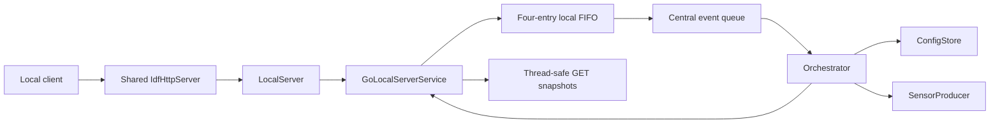
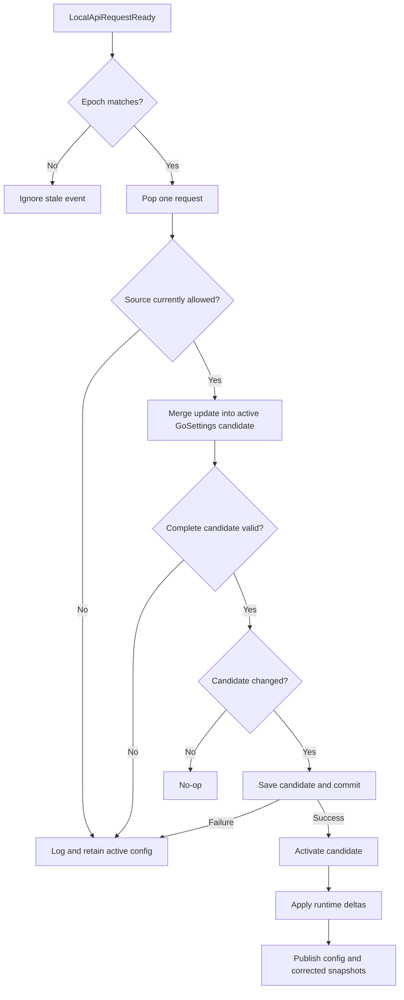
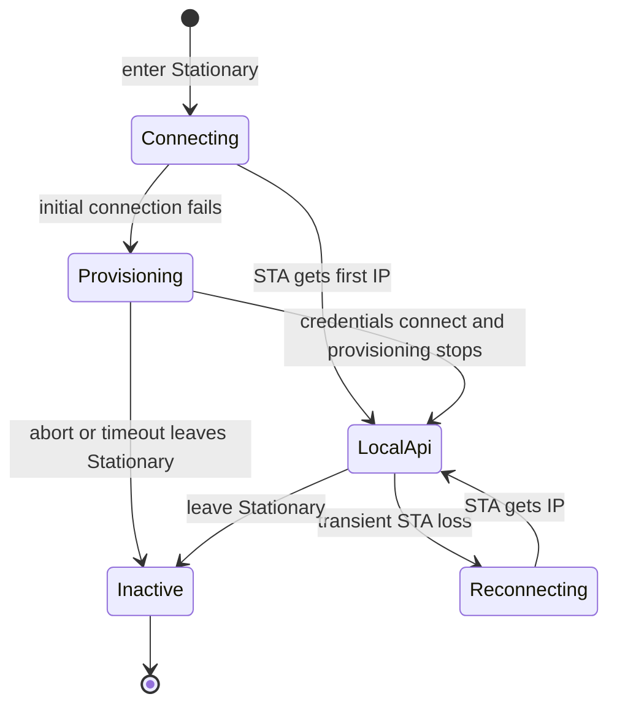

# Local Server Integration

> **This is a spec.** It describes how a feature **will be built**, not what
> currently exists. Once the feature ships, the corresponding doc under
> `products/go/docs/` becomes the source of truth and this file is typically
> deleted. See [`docs/STYLE.md`](../../../docs/STYLE.md) → "Doc Lifecycle".

Integrate [`airgradient-local-server`](../../../components/airgradient-local-server/README.md)
into AirGradient Go so a connected Stationary device exposes the versioned
local HTTP API and advertises it for Home Assistant discovery. The integration
will reuse the HTTP listener already used by captive-portal provisioning,
publish corrected measurement snapshots, accept product-supported config and
CO2 calibration requests without blocking the single httpd task, and keep all
product state changes under orchestrator ownership. The generic v1 config
contract will change from synchronous `204 No Content` to asynchronous
`202 Accepted` so concurrent clients can queue updates without one PUT blocking
all other HTTP handlers.

## Problem

The generic local-server component and its host tests exist, but Go does not
link the component, provide its three provider interfaces, register its routes,
or advertise `_airgradient._tcp`. Go already owns one process-lifetime
`IdfHttpServer`, but only captive-portal provisioning uses it. Starting a second
listener would waste memory and conflict on the HTTP port, while repeatedly
stopping and restarting the existing listener during a Stationary session would
add unnecessary task and heap churn.

The component's current config contract is also a poor fit for the underlying
server concurrency model. `esp_http_server` invokes handlers synchronously on
one httpd task. The current `ConfigProvider::apply_config()` contract waits for
validation, persistence, and runtime application before returning `204`. While
that provider waits for Go's orchestrator, the httpd task cannot run GET or
action handlers. A phone issuing several parallel PUT requests therefore causes
head-of-line blocking, and requests beyond the configured four open sockets may
time out before their handlers run.

Go's authoritative settings and corrected measurements live on the
orchestrator task, while local-server providers run on the httpd task. Reading
those objects directly would introduce data races. PUT and action requests also
cannot carry `LocalServerConfig` through the central event union because it owns
`std::string` values and is not trivially copyable.

Several product semantics must be made explicit as part of the integration:

- local measures must use the corrected view defined by
  [`measure_correction.md`](measure_correction.md), not the raw cloud, storage,
  and BLE view
- Go supports only a subset of the generic config catalog
- local and cloud correction writes need an explicit source-control policy
- `cloudConnection` must be a true master cloud switch, including automatic
  Wi-Fi OTA
- CO2 calibration requests from HTTP, BLE, and UI must not overwrite one
  another in the sensor producer's task-notification slot
- provisioning and local discovery use separate mDNS advertisements, while the
  costly HTTP listener should be reused

## Goals

- Expose the v1 local API on every connected Stationary session, including the
  ephemeral manufacturing-mode Stationary session.
- Reuse one HTTP listener for captive-portal provisioning and the local API for
  the lifetime of a Stationary session.
- Advertise the ready local API as `_airgradient._tcp` with `api=1` and identity
  values matching the measures payload.
- Change the global v1 PUT config contract to non-blocking `202 Accepted` after
  complete validation and successful queue admission.
- Buffer four validated Go local requests in a fixed FIFO and apply one request
  for every central `LocalApiRequestReady` event.
- Return a retryable structured `503 busy` response when either the local FIFO
  or the central event queue cannot admit a request.
- Publish thread-safe, corrected measurement, system-info, and active-config
  snapshots for GET handlers.
- Expose `pmStandard`, `temperatureUnit`, `cloudConnection`,
  `configurationControl`, and `corrections` as Go's supported config subset.
- Make `configurationControl` arbitrate Local Server PUT against Cloud Fetch
  while leaving BLE, UI, provisioning, factory reset, and system writes
  unrestricted by that field.
- Support fire-and-forget CO2 calibration with one shared queued-or-active busy
  gate across HTTP, BLE, and UI.
- Keep local GET routes available from cached snapshots during foreground OTA
  while rejecting valid PUT and action requests.
- Host-test mappings, queue behavior, snapshots, source policy, action gating,
  and lifecycle decisions without ESP-IDF dependencies.

## Non-Goals

- Serving the local API in Portable or Offline mode.
- Exposing battery, pressure, GPS, saved recordings, route history, or other
  Go-specific resources in v1.
- Adding Go-only fields such as measurement interval, GPS mode, auto-lock,
  buzzer, static IP, or operating mode to the generic catalog.
- Adding TLS, authentication, authorization, or CORS. The API uses the existing
  trusted-LAN security boundary.
- Adding a dedicated local-server task. Handlers continue to run on the httpd
  task and application work continues to run on existing product tasks.
- Reporting asynchronous config completion through a request-status resource,
  callback, or retained request identifier.
- Retrying config persistence after a post-acceptance failure.
- Adding multi-key transactional rollback to `ConfigStore`; Go retains its
  documented best-effort NVS persistence model.
- Adding a new LED-test sequence. Go will report the catalog `test-leds` action
  as unsupported.
- Redesigning manufacturing cleanup. Local writes in manufacturing mode follow
  the existing factory-reset-on-shutdown policy and its existing unexpected
  reset or power-loss limitations.
- Changing legacy local-server endpoints or legacy client behavior. The
  asynchronous change applies to the unshipped `/api/v1` contract only.

## Design

### Component Responsibilities

| Concern | Owner | Responsibility |
|---|---|---|
| HTTP listener and route table | `airgradient-http-server` | Bind port 80, invoke handlers, reject incomplete bodies, and support runtime route registration |
| v1 wire contract | `airgradient-local-server` | Parse/serialize JSON, own routes and errors, and map provider submission results to HTTP |
| Product providers and local FIFO | `GoLocalServerService` | Map Go values, own GET snapshots, validate submissions, and queue compact requests |
| Settings and command authority | Go orchestrator | Merge, persist, activate, and apply config; dispatch calibration |
| Stationary network lifecycle | `WifiService` and orchestrator | Reuse the listener and coordinate provisioning, local routes, and mDNS |
| Sensor execution | `SensorProducer` | Serialize measurement and calibration operations on the sensor task |
| Product persistence | `GoSettings` and `ConfigStore` | Validate complete candidates and use best-effort multi-key NVS persistence |

The dependency direction remains product to component. The generic component
will not include `GoSettings`, `GoConfigUpdate`, or Go service headers.



### Global V1 Config Contract

`PUT /api/v1/config` will become asynchronous for every product using the v1
component. The component will parse the complete request, then call a
non-blocking provider submission method. A successful provider result means the
product accepted responsibility for later processing, not that persistence or
runtime application has finished.

The provider interface will become equivalent to:

```cpp
enum class ConfigSubmitStatus : uint8_t {
  Accepted,
  InvalidValue,
  Forbidden,
  NotSupported,
  Busy,
  Internal,
};

struct ConfigSubmitResult {
  ConfigSubmitStatus status = ConfigSubmitStatus::Internal;
  ConfigFieldId field = ConfigFieldId::None;
};

class ConfigProvider {
public:
  virtual ~ConfigProvider() = default;
  virtual LocalServerConfig get_config() = 0;
  virtual ConfigSubmitResult submit_config(const LocalServerConfig &partial) = 0;
};
```

The handler mapping will be:

| Provider Result | HTTP Status | Error Code | Meaning |
|---|---:|---|---|
| `Accepted` | `202` | — | Validated and admitted for asynchronous processing |
| `InvalidValue` | `400` | `invalid_value` | Product semantic validation failed |
| `Forbidden` | `403` | `forbidden` | Runtime or source-control policy rejected the request |
| `NotSupported` | `404` | `not_found` | A known catalog field is unsupported by the model |
| `Busy` | `503` | `busy` | Temporary local or central queue saturation |
| `Internal` | `500` | `internal` | Unexpected provider failure |

`202` and action success will have empty bodies. A `503 busy` response will not
include `Retry-After`; clients own their retry timing.

An empty object, `{}`, is a valid no-op. The provider will still enforce the
current write gate, then return `Accepted` without adding a FIFO entry. It will
therefore return `202` during normal operation and `403` while valid writes are
disabled.

There will be no completion resource in the MVP. A client that needs
confirmation will poll `GET /api/v1/config` until the desired values appear or
its own deadline expires. A value may never appear because persistence failed,
another writer superseded it, or a transition discarded the queued request.

### Request Body Completeness

Validation applies to the complete HTTP entity, not a buffered prefix.
`IdfHttpRequest` currently truncates bodies above
`CONFIG_AG_HTTP_MAX_BODY_SIZE` and retains partial bytes after a socket read
failure. A truncated prefix could itself be valid JSON and be accepted
incorrectly.

The HTTP request abstraction will expose body-read completeness. The local
config handler will return `400 invalid_body` without parsing when:

- `Content-Length` exceeds the configured body cap
- the socket closes before the declared body is read
- a receive operation fails before all declared bytes are read
- the body is otherwise empty or malformed

The existing strict JSON rules remain: object root, explicit-length parsing,
no trailing non-whitespace, unknown-key rejection, and known-field type/enum
validation.

Parsing occurs before provider policy. Consequently, malformed PUT during OTA
returns `400`, while a structurally valid PUT reaches the provider and returns
`403`. After parsing, endpoint policy takes precedence over product support:
while writes are disabled, a valid PUT containing an otherwise unsupported Go
field returns `403`, not `404`.

### Go Config Catalog

Go will emit and accept this subset:

| V1 Field | Go Mapping | Values |
|---|---|---|
| `pmStandard` | `GoSettings::pm_use_usaqi` | `ugm3` ↔ `false`, `us-aqi` ↔ `true` |
| `temperatureUnit` | `GoSettings::use_fahrenheit` | `c` ↔ `false`, `f` ↔ `true` |
| `cloudConnection` | inverse of `GoSettings::disable_cloud` | Boolean |
| `configurationControl` | new persisted Go enum | `cloud`, `local`, `both` |
| `corrections` | `GoSettings::corrections` | Partial PM2.5, temperature, and humidity entries |

All other catalog fields are omitted from GET. If any unsupported catalog field
is present in PUT while local writes are otherwise allowed, the entire request
returns structured `404 not_found` and nothing is queued. `postDataToCloud` will
not alias `cloudConnection`; Go has only the master `disable_cloud` setting.

The provider will translate validated `LocalServerConfig` into a compact,
trivially-copyable product update before queueing. The existing cloud update
type was designed to become product-wide, so it will move from a cloud-specific
name/header to a shared Go config-update type equivalent to:

```cpp
enum class ConfigurationControl : uint8_t {
  Cloud,
  Local,
  Both,
};

enum class GoConfigField : uint32_t {
  PmStandard = 1U << 0,
  TemperatureUnit = 1U << 1,
  CloudConnection = 1U << 2,
  ConfigurationControl = 1U << 3,
  Pm25Correction = 1U << 4,
  TemperatureCorrection = 1U << 5,
  HumidityCorrection = 1U << 6,
};

struct GoConfigUpdate {
  uint32_t update_mask = 0;
  bool pm_use_usaqi = false;
  bool use_fahrenheit = false;
  bool disable_cloud = false;
  ConfigurationControl configuration_control = ConfigurationControl::Both;
  MeasurementCorrections corrections{};
};
```

A compile-time assertion will keep `GoConfigUpdate` trivially copyable.
`FetchConfigEventPayload` will carry this product-wide type rather than a
`GoCloudConfigUpdate`.

Cloud Fetch will populate the same product update from its existing legacy
wire vocabulary:

| Cloud Field | Product Mapping |
|---|---|
| `pmStandard` | `GoConfigField::PmStandard` |
| `temperatureUnit` | `GoConfigField::TemperatureUnit` |
| `disableCloudConnection` | `GoConfigField::CloudConnection`, same polarity as `disable_cloud` |
| `configurationControl` | `GoConfigField::ConfigurationControl` |
| `corrections.pm02` | `GoConfigField::Pm25Correction` |
| `corrections.atmp` | `GoConfigField::TemperatureCorrection` |
| `corrections.rhum` | `GoConfigField::HumidityCorrection` |

Cloud parsing remains tolerant per field: an absent, malformed, unsupported,
or case-mismatched field leaves its update bit clear while valid sibling fields
remain in the product update. After merging all valid bits, complete-candidate
validation remains all-or-nothing. An invalid cross-field candidate is logged
and not activated.

### Configuration Control

`configurationControl` will default to and factory-reset to `both`. It governs
only the two competing remote config sources:

| Active Value | Local Server PUT | Cloud Fetch |
|---|---|---|
| `cloud` | Reject with `403` | Apply |
| `local` | Apply | Ignore config fields |
| `both` | Apply | Apply |

BLE, UI, provisioning, factory reset, and system writes bypass this gate. They
still use the common persist-before-activate settings path so side effects do
not drift. Bypassing the source gate does not bypass complete-candidate
validation.

The active source gate is checked twice for Local Server PUT:

1. The httpd provider checks its synchronized active-config snapshot before
   queue admission.
2. The orchestrator checks current authoritative settings after dequeue.

The second check is required because several PUTs can receive `202` while the
active value is `both`; an earlier queued PUT may switch control to `cloud`
before a later local update is processed. The later accepted update is then
dropped and logged. This is valid under the noncommittal `202` contract.

After component parsing succeeds, Go provider checks use this precedence:

1. Endpoint access (`Inactive` or OTA `ReadOnly`) → `403`.
2. Active `configurationControl` source gate → `403`.
3. Go field support → `404`.
4. Product semantic and cross-field validation → `400`.
5. FIFO and central queue admission → `202` or `503`.

Thus a structurally valid unsupported field returns `403` while control is
`cloud`, but `404` while control permits Local Server writes. Component-owned
JSON type/enum/unknown-field errors are detected before this list and remain
`400`.

Cloud Fetch uses the inverse rule. When control is `local`, transport and JSON
parsing may complete, but applicable cloud config fields are ignored. When
control is `both`, the last successfully processed writer wins.

A complete candidate with both of these values is invalid:

```json
{
  "configurationControl": "cloud",
  "cloudConnection": false
}
```

The same validation applies when one field is already active and an update
supplies the other. Local Server returns `400 invalid_value` when its active
snapshot already makes the submitted combination invalid. If an earlier queued
request creates the conflict before this request reaches the orchestrator, the
already accepted request is dropped and logged during the authoritative
recheck. Cloud Fetch logs and drops an invalid candidate.
`configurationControl` is identified as the offending field for Local Server
errors.

Provisioning is a special bootstrap source because credentials are already
accepted before its `disable_cloud` metadata reaches the orchestrator. If
provisioning requests cloud disable while the active control is `cloud`, the
candidate will normalize control to `local` before persistence instead of
rejecting already accepted credentials or creating the invalid combination.
BLE and UI writes do not receive this normalization; they reject a complete
candidate that violates the invariant through their existing result/feedback
paths.

`cloudConnection: false` is valid with `local` or `both`. It disables cloud
POST, Cloud Fetch, and automatic Wi-Fi OTA without stopping Wi-Fi, the local
HTTP API, or local mDNS.

### Corrections Mapping

Go will expose all three existing correction targets. A partial corrections
object updates only its present targets; absent siblings retain their active
values.

| Target | Accepted Algorithms | Local `slr` Fields |
|---|---|---|
| `pm25` | `none`, `epa_2021`, `custom_via_pm25_raw` | `intercept`, `scalingFactor`, `useEpa2021` |
| `temp` | `none`, `custom` | `intercept`, `scalingFactor` |
| `humidity` | `none`, `custom` | `intercept`, `scalingFactor` |

The local v1 schema's PM `scalingFactor` maps to Go's internal
`Pm25Correction::scaling_factor`. Go's Cloud Fetch payload continues to require
the cloud-specific `scalingFactorViaPm25`; it is not accepted as an alias by the
strict local parser.

The product provider validates algorithm support, required `slr` presence,
finite and float-representable coefficients, PM-only `useEpa2021`, and the
complete merged `MeasurementCorrections` value before queueing. Structural
shape and JSON types remain component-owned.

The generic correction value type currently defaults absent `intercept` and
`scalingFactor` members to valid-looking numeric values. That loses the presence
information required for product semantic validation. The component types or
parse result will therefore preserve presence for both coefficients, for
example with `std::optional<double>` members or an explicit presence mask.
Serialization will still require complete parameters for an emitted non-null
`slr`. Host tests will cover every missing required coefficient separately.

### Local Request FIFO

`GoLocalServerService` will own one four-entry fixed FIFO for validated config
and action requests. It will use fixed storage and `head`, `tail`, and `count`;
there will be no per-slot allocation, occupied flag, or response semaphore.

```cpp
enum class LocalApiRequestKind : uint8_t {
  Config,
  Action,
};

struct LocalApiRequest {
  LocalApiRequestKind kind = LocalApiRequestKind::Config;
  GoConfigUpdate config{};
  ActionId action = ActionId::CalibrateCo2;
};

static constexpr size_t LOCAL_API_REQUEST_QUEUE_DEPTH = 4;

LocalApiRequest _requests[LOCAL_API_REQUEST_QUEUE_DEPTH]{};
size_t _head = 0;
size_t _tail = 0;
size_t _count = 0;
uint32_t _queue_epoch = 0;
```

One accepted entry posts one `LocalApiRequestReady` event. The event carries the
current queue epoch, not the request payload. The orchestrator pops one FIFO
entry for every matching event.

The epoch prevents stale events from consuming entries from a later endpoint
generation:

```text
clear FIFO -> increment epoch -> old events become no-ops
```

Without the epoch, an event left in the central queue during a transition could
pop a newly accepted request after the endpoint resumes.

Admission will be atomic across both queues:

1. Lock the local FIFO.
2. Recheck endpoint access and local capacity.
3. Append the compact request.
4. Call a zero-wait, bool-returning `RTOS::queue_send()` for
   `LocalApiRequestReady` while the FIFO remains protected.
5. Retain the append on success; roll it back on central queue failure.
6. Unlock and return `Accepted`/`Dispatched` or `Busy`.

An action reservation made before FIFO admission is part of the same
transaction. Local FIFO full, central event failure, endpoint-policy failure,
or any other admission rollback must release the reservation before returning
`503` or `403`.

The mutex covers only POD copies, index changes, and a zero-wait queue send. It
does not cover JSON, NVS, logging, sensor calls, or runtime side effects.

The global `RTOS::queue_send()` API will return the underlying admission result.
Existing callers may ignore it; local request admission and calibration
completion paths will check it where loss affects correctness.

### Asynchronous Config Application

The orchestrator will process a dequeued config request as follows:



Every request remains all-or-nothing at the in-memory candidate level. A later
request merges onto the last successfully activated settings, not onto an
earlier failed candidate.

Go retains its existing best-effort multi-key persistence model. All fields are
validated before writes, and the candidate becomes active only after every
write plus `commit()` reports success. On failure:

- previous runtime settings remain active
- GET snapshots remain unchanged
- no volatile-only candidate is applied
- the failure is logged
- the request is not retried

This does not guarantee rollback of NVS writes staged before a later write or
commit failure. Existing grouped-load validation continues to prevent
incomplete correction groups from becoming active after reboot.

All settings writers will converge on one orchestrator-owned candidate
activation helper. Transport-specific parsing may remain separate, but NVS
save, assignment, runtime side effects, UI synchronization, BLE notification,
local snapshot publication, and corrected-measure recomputation will not be
duplicated.

### Measures and System Information

`GET /api/v1/measures` will use the latest corrected `MeasuresAGo` converted to
the shared `Measures` type. Unsupported extended groups retain invalid
sentinels and are not serialized by v1.

| V1 Field | Go Source |
|---|---|
| `co2` | corrected `co2.co2` |
| `pm01` | corrected `pm_a.pm_01` |
| `pm25` | corrected `pm_a.pm_25` |
| `pm10` | corrected `pm_a.pm_10` |
| `pm003Count` | corrected `pm_a.pm_03_pc` |
| `temp` | corrected `temp_hum_a.temperature`, always Celsius |
| `humidity` | corrected `temp_hum_a.humidity` |
| `tvocIndex`, `tvocRaw` | corrected `tvoc_nox` fields |
| `noxIndex`, `noxRaw` | corrected `tvoc_nox` fields |

The component's field-specific validators decide whether to serialize every
field. There is no `null` form.

System information will be:

| V1 Field | Go Source | Behavior |
|---|---|---|
| `serialNumber` | `GoBoard::serial_number()` | Process-lifetime identity |
| `model` | `P-1PSG` | Same value used by BLE and mDNS |
| `firmware` | `GoBoard::firmware_version()` | Process-lifetime identity |
| `wifiRssi` | `WifiService::rssi()` | Omitted unless Stationary is online |
| `boot` | orchestrator cycle counter | Starts at `0`, first delivered completed cycle reports `1` |

The boot counter increments once for every `SensorDataReady` handled by the
orchestrator, even if all sensor fields are invalid. A fast-path measurement
handed into the interactive boot counts as the first cycle. Reapplying
corrections does not increment it. The counter resets on CPU restart and counts
cycles completed before local API activation in the same boot.

### Snapshot Ownership

The orchestrator will never expose references to `_settings`, `_raw_measures`,
or `_corrected_measures` to the httpd task. `GoLocalServerService` will own
cached copies protected by a short-held RTOS mutex:

- shared `Measures` containing the corrected common view
- `SystemInfo`
- `LocalServerConfig` containing only supported active fields
- endpoint access state and calibration admission state

Snapshots initialize measurements to invalid sentinels and RSSI to absent. The
orchestrator publishes after:

- interactive initialization or a fast-path handoff
- every `SensorDataReady`
- every successfully activated settings candidate
- factory reset
- Wi-Fi online/RSSI state changes

GET provider methods copy under the mutex and return by value. Serialization and
cJSON allocation occur after the lock is released.

### Actions and Calibration

The action routes remain fire-and-forget:

| Action | Success | Rejected | Unsupported | Queue Full |
|---|---:|---:|---:|---:|
| `calibrate-co2` | `200` | `403` | — | `503` |
| `test-leds` | — | — | `404` | — |

One shared calibration coordinator will cover Local Server, BLE, and UI. It
will reserve busy state before queueing or notifying the sensor task so two
requests cannot overwrite the same task-notification value. A duplicate request
while queued or executing returns the existing channel-specific rejection; HTTP
maps it to `403 forbidden`.

Endpoint policy precedes catalog support for actions. During OTA,
`test-leds` returns `403` like every other valid action request; while normal
read/write access is active it returns its model-specific `404`.

The coordinator will cache CO2 calibration support after sensor initialization.
It will not query sensor capabilities from the httpd task. It will clear busy
state independently of delivery of `Co2CalibrationDone`, so a full central
event queue cannot leave calibration permanently busy.

Entering OTA, entering provisioning, or leaving Stationary will discard a
queued local calibration and release its queued reservation. If sensor
calibration has started, the transition will proceed and logically abandon the
local request. Firmware has no sensor-level abort command, so the physical CO2
module may continue its internal operation. The shared execution-busy guard
will remain until the sensor producer completes or is stopped, preventing a new
channel from overwriting the operation. A transient STA disconnect is not an
endpoint transition and will not cancel calibration.

### Stationary HTTP Lifecycle

One `IdfHttpServer` remains owned by `GoHardwareBoard` for process lifetime.
The listener will start lazily when either captive-portal provisioning or the
local API first needs it, then remain running until Go leaves Stationary.

Go's current state machine guarantees that provisioning starts only before the
first successful Stationary IP:

- initial saved/default connection failure may enter provisioning
- initial connection success activates the local API without provisioning
- after `WifiService::has_been_online()` becomes true, all disconnects retry
  indefinitely and never enter provisioning
- no normal UI path starts Stationary provisioning after first online

There is therefore no local-routes-to-provisioning-routes transition in this
iteration.



Direct first-IP and provisioning-success paths will both call one idempotent
`activate_local_endpoint()` operation. It will:

1. Keep local request access `Inactive`.
2. Register local routes.
3. Start or confirm the listener on `CONFIG_AG_HTTP_PORT`.
4. Publish online/RSSI state and change access to `ReadWrite`.
5. Start local mDNS only after the routes are reachable.

Route-registration or listener-start failure rolls back local routes, leaves
access `Inactive`, suppresses local mDNS, and logs the failure. While Stationary
remains online, the orchestrator retries after the named
`LOCAL_API_ACTIVATION_RETRY_MS` interval; reconnect and a later Stationary entry
also trigger the same operation. mDNS-start failure does not tear down an
otherwise reachable HTTP API; it is logged and retried by the same endpoint
retry timer, and no partial advertisement is retained.

Provisioning success will:

1. Keep the existing portal success response available for its configured hold.
2. Stop provisioning mDNS and captive DNS.
3. Tear down the provisioning transport and remove its routes.
4. Leave the listener running when the next owner is the local API.
5. Call `activate_local_endpoint()`.

BLE-only provisioning may not have started the listener. Local activation will
therefore use the same idempotent `start()` path after registering routes.

Transient STA loss will stop local mDNS through the Wi-Fi lifecycle but retain
the listener and local routes. Reconnect will refresh online/RSSI state and
restart local mDNS without rebuilding `LocalServer`.

Leaving Stationary will:

1. Disable local request admission, clear the FIFO, and increment its epoch.
2. Stop local mDNS.
3. Stop the HTTP listener, quiescing in-flight handlers.
4. Call `LocalServer::end()` while the listener is stopped.
5. Continue the existing cloud and Wi-Fi teardown.

Provisioning must keep route ownership scoped to its active session and must be
able to stop after success without stopping an HTTP listener that is being
handed to the local API. Abort/timeout paths that leave Stationary may still
stop it.

### Local Discovery

Local discovery remains product wiring outside `airgradient-local-server`.
The advertisement will be:

| Property | Value |
|---|---|
| Hostname Label | `airgradient-<serial>` |
| Resolvable Name | `airgradient-<serial>.local` |
| Service | `_airgradient._tcp` |
| Port | `CONFIG_AG_HTTP_PORT` |
| TXT `vendor` | `AirGradient` |
| TXT `model` | `P-1PSG` |
| TXT `serialno` | same serial as `SystemInfo::serial_number` |
| TXT `fw_ver` | same firmware as `SystemInfo::firmware` |
| TXT `api` | `1` |

Provisioning owns this separate mDNS advertisement in addition to its captive
DNS responder:

| Property | Provisioning Value |
|---|---|
| Hostname Label | `airgradient-<serial>` |
| Resolvable Name | `airgradient-<serial>.local` |
| Service | `_http._tcp` |
| Port | `CONFIG_AG_HTTP_PORT` |
| TXT Records | None; specifically no `api=1` |

It advertises the captive HTTP service only while the Wi-Fi provisioning
transport is active. It does not advertise `_airgradient._tcp`, which remains
the Home Assistant discovery signal for a ready local v1 API. The provisioning
component/service documentation will become the source of truth for this
profile after implementation.

mDNS is cheap to recreate; the design does not attempt to reuse an
advertisement or switch it in place. The local advertisement is stopped before
provisioning or Stationary teardown and recreated after local route readiness
or STA reconnect.

`airgradient-wifi` will expose explicit start, stop, and profile-clear operations
without Go calling ESP-IDF mDNS APIs directly. Local profile configuration will
not be installed before the HTTP routes are ready, because `WifiManager`
otherwise auto-starts a retained profile before the product got-IP callback.
Stationary exit and any transition to provisioning will stop mDNS and clear the
local profile so a later AP/STA transition cannot advertise stale `api=1`
metadata. Reconnect may retain and auto-restart the profile only while the local
endpoint remains the active Stationary owner. String and TXT storage will have
lifetime at least as long as the active advertisement.

### OTA Behavior

Foreground Wi-Fi OTA keeps the STA and HTTP listener alive while the
orchestrator is blocked. Before committed OTA work begins, Go will set local
access to read-only, clear and log all queued local requests, increment the FIFO
epoch, and logically cancel local queued calibration.

During OTA:

- `GET /api/v1/measures` returns the last cached snapshot
- `GET /api/v1/config` returns the last active config snapshot
- structurally valid PUT returns `403 forbidden`
- actions return `403 forbidden`
- local mDNS remains advertised

A non-rebooting OTA outcome restores read/write admission with an empty FIFO.
A successful OTA reboots. Automatic Wi-Fi OTA is not scheduled when
`cloudConnection` is false.

GET serialization builds a transient cJSON tree while the TLS OTA path already
has tight ESP32-C5 heap margins. Firmware verification must measure concurrent
GET requests during TLS handshake/download. If this fails the memory budget,
the implementation will disable the whole local endpoint during OTA rather
than introduce a second serialization design; that fallback requires updating
this spec before implementation is considered complete.

### Transition Queue Policy

The following endpoint transitions discard queued requests and log the count:

- committed OTA entry
- provisioning entry, if a future product path permits it after local activation
- leaving Stationary

Discarding increments `_queue_epoch`. Stale central events become no-ops. A
post-acceptance config failure or discard is observable only because later GET
does not converge to the requested value.

Transient STA loss does not clear the FIFO because the orchestrator remains
available and the endpoint is expected to resume on reconnect.

### Manufacturing Mode

Manufacturing-mode Stationary uses the same routes, mDNS identity, config
access, and actions as normal Stationary. Local writes use normal persistence.
The existing manufacturing shutdown path remains responsible for factory-reset
cleanup. This feature will not add a second ephemeral settings overlay or a
new boot-persistent manufacturing marker.

### Memory and Tasking

- No local-server task is added.
- The listener and its httpd task live for the Stationary session.
- The component retains its `CONFIG_AG_LOCAL_SERVER_JSON_BUF` static response
  buffer, initially 3072 bytes.
- The four-entry FIFO stores compact `GoConfigUpdate` values, not
  `LocalServerConfig` strings.
- GET serialization retains the component's transient cJSON allocation.
- Product snapshots use one short-held RTOS mutex and copy by value.
- Local submit performs no NVS, display, cloud, sensor, or other hardware work.

Go's initial `wifiRssi` will be the connection-time sample already cached by
`WifiService`; this iteration will not add periodic RSSI polling. The key is
omitted while offline and refreshed on the next got-IP transition.

The firmware build and hardware checks must capture heap before/after listener
start, cloud start, local GET, config bursts, and OTA. The JSON buffer will be
increased only if a fully populated Go config cannot serialize with measured
headroom.

## Implementation Plan

1. Extend `airgradient-http-server` with `202 Accepted` and
   `503 Service Unavailable`, body-read completeness, status phrases, and tests.
   Update its README.
2. Change `RTOS::queue_send()` to return admission success while preserving
   ignored-return behavior for existing callers. Update host queue mocks and
   full/drop tests.
3. Redesign `airgradient-local-server` config submission around non-blocking
   `submit_config()`, `ConfigSubmitStatus`, `202`, and structured `503 busy`.
   Preserve correction coefficient presence, add action `Busy` mapping, update
   host tests, update the component spec and README, and update the reference
   product example.
4. Move `GoConfigField` and the cloud update payload into a product-wide
   `GoConfigUpdate` type. Add scalar fields, `ConfigurationControl`, source
   metadata/helpers, and trivial-copy assertions. Keep cloud transport result
   types in `go_cloud_types.h`.
5. Add `configuration_control` to `GoSettings`, NVS load/save/defaults, print
   output, validation, and factory reset. Extend Cloud Fetch parsing for
   `pmStandard`, `temperatureUnit`, `disableCloudConnection`, and
   `configurationControl` in addition to corrections, and gate automatic OTA
   with `disable_cloud`.
6. Consolidate Go settings persistence and activation into one
   orchestrator-owned helper. Migrate Cloud Fetch, BLE, UI, provisioning, and
   existing direct settings paths while applying `configurationControl` only
   to Local Server and Cloud Fetch.
7. Add `go_local_server.h/.cpp` with the three provider implementations,
   corrected/system/config snapshots, mapping helpers, four-entry FIFO,
   checked admission, access state, queue epoch, and host tests.
8. Add `LocalApiRequestReady` to the Go event model and process one matching
   FIFO entry per event. Publish snapshots from sensor, settings, Wi-Fi, boot
   handoff, and factory-reset paths.
9. Add one shared CO2 calibration coordinator across HTTP, BLE, and UI. Cache
   support, reject duplicates, make busy cleanup independent of result-event
   delivery, and implement transition abandonment semantics.
10. Wire `GoLocalServerService` through both interactive `GoApp` construction
    paths and orchestrator dependencies. Add the component and sources to Go
    firmware and host-test CMake targets.
11. Implement Stationary listener ownership: direct-IP activation,
    provisioning-success handoff without listener stop, reconnect retention,
    and stop-before-route-removal on mode exit. Keep current no-runtime-
    reprovisioning policy explicit in tests.
12. Add local mDNS start/stop through `airgradient-wifi`, using identity storage
    shared with `SystemInfo`, and add explicit local-profile clearing. Verify
    provisioning and local advertisements are never active together, and wire
    the existing provisioning-owned profile where Go does not already do so.
13. Add OTA read-only gating, transition FIFO discard/epoch handling,
    manufacturing-mode coverage, and heap instrumentation for verification.
14. Update shipped docs during implementation: component READMEs, Go
    architecture and service docs, settings/cloud/orchestrator/Wi-Fi docs, and
    the measurement-correction doc. After shipping, create
    `products/go/docs/local_server.md` and delete this spec.
15. Coordinate the global v1 response change with `python-airgradient` and Home
    Assistant: accept `202`, treat `503` as temporary, and poll GET for config
    convergence while preserving the legacy backend.

## Testing Strategy

### Component Host Tests

- HTTP status phrase and empty-body tests for `202` and `503`.
- Request adapter tests for oversized, short-read, receive-failure, and complete
  bodies.
- Local-server handler tests for `Accepted`, `Busy`, validation errors, parse-
  before-policy precedence, and empty-object behavior.
- Config parser regressions for unknown keys, trailing data, nested corrections,
  and dotted error fields.
- RTOS queue tests for successful admission, full queue, null/invalid handle,
  and ignored return compatibility.
- Reference provider tests updated from synchronous apply/`204` to
  submit/`202`.

### Go Host Tests

- GET mappings for every common measure, invalid-field omission, Celsius
  temperature, identity, optional RSSI, and boot counter.
- Config GET subset and omission of every unsupported catalog field.
- Config PUT translation for all scalar fields and partial correction targets.
- Local PM `scalingFactor` mapping, missing-coefficient presence, and rejection
  of unsupported algorithms.
- `configurationControl` source matrix, second-stage gate changes, invalid
  cloud-control/cloud-disabled candidates, provider error precedence, and
  factory defaults.
- Cloud Fetch mappings for `pmStandard`, `temperatureUnit`, inverted
  `disableCloudConnection`, and `configurationControl`, including malformed
  fields with valid siblings.
- FIFO enqueue/dequeue, wraparound, mixed config/action order, four-entry full
  state, fifth-request `Busy`, and central event-send rollback.
- Queue clear/epoch behavior proving stale events cannot consume new entries.
- Four sequential accepted PUTs and last-successful-candidate merge behavior.
- Same-field updates proving last processed value wins.
- Persistence failure retaining active settings and allowing the next request
  to merge from the prior successful state.
- Empty PUT returning `Accepted` without consuming FIFO capacity.
- Duplicate calibration rejection, unsupported LED action, queue-full action,
  reservation rollback, result-event loss cleanup, transition abandonment, and
  OTA policy-before-support precedence.
- Snapshot publication after measurement, correction, Wi-Fi, config, factory
  reset, and boot handoff.
- Direct first-IP activation, provisioning-success handoff, transient reconnect,
  activation failure/retry, Stationary exit, OTA gating, and manufacturing-mode
  availability.
- Existing settings writer tests migrated to the common persist-before-activate
  helper.

### Firmware and Manual Verification

- Build Go after exporting ESP-IDF and verify no route, stack, or component
  dependency failures.
- Connect directly with saved credentials and verify local routes appear only
  after the first IP and mDNS advertises `api=1`.
- Complete BLE-only and captive-portal provisioning and verify the local API
  takes over the existing listener without a port rebind where the listener was
  already running.
- Issue several parallel PUT requests from separate phone/client connections;
  verify prompt `202` responses, FIFO application, eventual GET convergence,
  and no GET/action head-of-line stall beyond individual short handlers.
- Force local and central queue saturation and verify structured `503 busy`
  without `Retry-After`.
- Verify malformed PUT during OTA returns `400`, valid PUT/action returns
  `403` (including otherwise unsupported fields/actions), GET remains
  available, and mDNS remains advertised.
- Measure free heap during listener start, cloud TLS, local GET serialization,
  config bursts, and OTA TLS with concurrent GET.
- Verify `cloudConnection=false` suppresses cloud POST, Cloud Fetch, and
  automatic Wi-Fi OTA while local HTTP remains reachable.
- Verify all `configurationControl` modes against Local Server and Cloud Fetch.
- Verify transient Wi-Fi loss does not enter provisioning, restart the listener,
  clear accepted updates, or change device identity.
- Verify leaving Stationary stops mDNS and the listener and leaves no stale
  routes on the next Stationary entry.
- Verify Home Assistant discovers Go by `P-1PSG`, uses v1 endpoints, and handles
  asynchronous config convergence alongside a legacy device.

### Final Verification Commands

The implementer will run the repository's required commands and capture their
output before claiming completion:

```sh
cmake -S tests -B tests/build -DCMAKE_EXPORT_COMPILE_COMMANDS=ON
cmake --build tests/build
ctest --test-dir tests/build --output-on-failure
```

```sh
. "$HOME/Tools/esp/esp-idf/export.sh"
idf.py -C products/go build
```

```sh
pre-commit run markdownlint-cli2 --all-files
```

## Open Questions

- None for the MVP.
