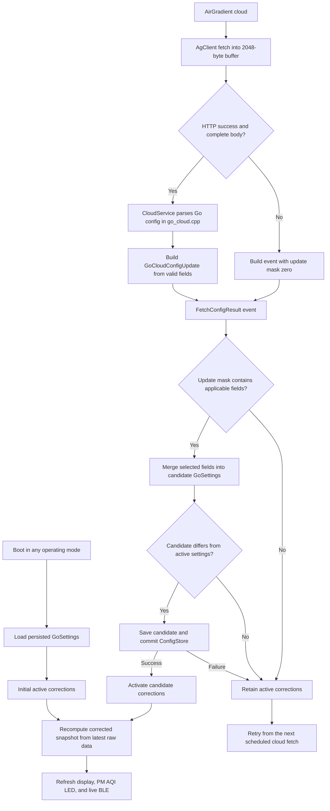
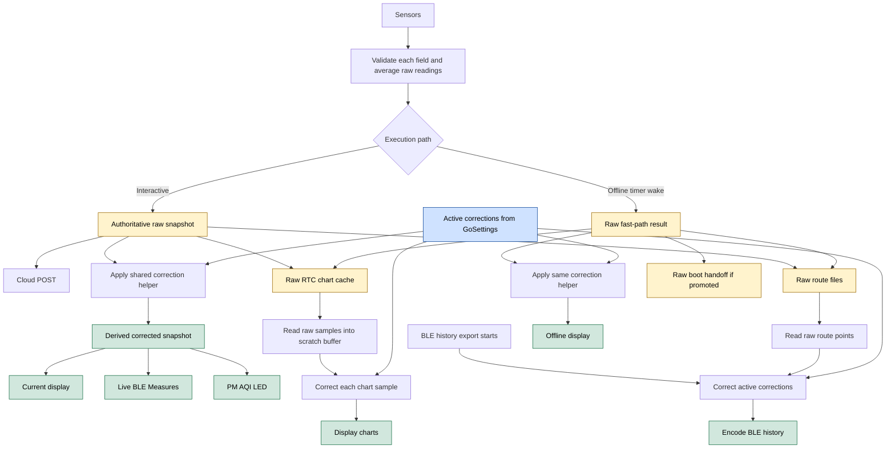

# Measurement Correction From Cloud Configuration

> **This is a spec.** It describes how a feature **will be built**, not what
> currently exists. Once the feature ships, the corresponding doc under
> `docs/` (or the relevant component README) becomes the source of truth and
> this file is typically deleted. See `docs/STYLE.md` → "Doc Lifecycle".

Add on-device measurement correction to AirGradient Go for PM2.5,
temperature, and humidity, driven by the `corrections` block of the
AirGradient cloud configuration. The device will validate and persist the
configuration, retain raw measurements as its authoritative data, and derive
corrected values for user-facing consumers. Corrections will therefore survive
reboots and work in Offline mode without changing the raw values posted to the
AirGradient cloud or written to storage.

## Problem

AirGradient Go already fetches its cloud configuration, but the response body
is logged and discarded. Only the HTTP result byte reaches the orchestrator,
so no field is parsed, persisted, or applied.

Raw PM2.5, temperature, and humidity currently flow through one shared
`MeasuresAGo` snapshot to every consumer. Applying correction directly to that
snapshot would also change cloud uploads and stored route data, which must
remain raw. The Offline timer-wake fast path also bypasses the orchestrator, so
an orchestrator-only implementation would fail to correct the display while
offline.

The correction math does not yet exist in the Go firmware or its shared
components. The persistence abstraction, `ConfigStore`, also cannot store the
floating-point coefficients required by custom corrections.

## Goals

- Parse the cloud `corrections` entries named `pm02`, `atmp`, and `rhum`.
- Support only these correction algorithms:
  - PM2.5: `none`, `epa_2021`, and `custom_via_pm25_raw`
  - Temperature and humidity: `none` and `custom`
- Validate algorithms, JSON types, required parameters, and finite numeric
  values before accepting an update.
- Persist correction settings so they survive reboot and apply in Portable,
  Stationary, and Offline modes.
- Keep raw measurements authoritative and derive corrected copies without
  changing storage formats.
- Apply corrected values to the current display, display charts, PM AQI LED,
  live BLE measurements, and BLE route-history export.
- Keep cloud POST payloads, RTC chart storage, and persistent route files raw.
- Keep the correction implementation pure, reusable, and host-testable.
- Apply a valid cloud update only after its settings commit succeeds.

## Non-Goals

- Correcting values posted to the AirGradient cloud. The cloud continues to
  receive raw values and correct its own copy.
- Storing corrected chart samples or corrected route points.
- Supporting PM batch algorithms whose names start with `slr_`.
- Supporting PM `custom` or `factory_calibration`, which depend on PM0.3
  particle counts.
- Supporting the PMS5003T-specific `ag_pms5003t_2024` temperature and humidity
  algorithm.
- Correcting PM1, PM10, CO2, TVOC, NOx, pressure, GPS, or power measurements.
- Parsing correction configuration from the local-server configuration path.
- Adding the currently absent local-server service to AirGradient Go. A future
  local-server provider must use the corrected measurement view defined here.
- Changing the endpoint selected by `AgClient::http_fetch_config()`. This
  feature keeps the existing Go endpoint and raw fetch API.
- Adding a separate configuration parser task, service, header, or source file.
- Adding transactional or rollback support to the complete `ConfigStore`
  abstraction.

## Design

### Design Principles

- Raw measurements remain the source of truth.
- Corrected measurements are temporary derived values and are never persisted.
- One shared helper performs all correction math for every consumer.
- Configuration parsing is strict about supported fields but tolerant of
  unrelated cloud configuration fields.
- Each measure is updated independently, so one malformed correction does not
  block valid sibling corrections.
- Missing or invalid configuration never silently resets an active correction.
- Explicit `correctionAlgorithm: "none"` is the only cloud command that
  disables an active correction.

### Component Responsibilities

| Concern | Location | Responsibility |
|---|---|---|
| Correction types and math | `airgradient-common` | Typed configuration, validation, and pure transforms |
| Go cloud JSON parsing | `CloudService` in `go_cloud.cpp` | Parse the product payload and validate a typed update |
| Float persistence | `airgradient-config` | Store and retrieve 32-bit floating-point values |
| Product settings | `GoSettings` | Defaults, grouped load, validation, and save |
| Cloud update types and delivery | `go_cloud_types.h` and Go events | Define and queue a fixed POD update |
| Live application | `go_orchestrator` | Maintain raw and corrected snapshots and route consumers |
| Offline application | `go_app` fast path | Store raw values and render corrected values |
| Historical application | UI and `BleService` | Correct raw samples at read or export time |

### Supported Algorithms

| Measure | Algorithm | Required Parameters | Transform |
|---|---|---|---|
| PM2.5 | `none` | None | Raw PM2.5 |
| PM2.5 | `epa_2021` | None | EPA 2021 compensation using raw PM2.5 and raw humidity |
| PM2.5 | `custom_via_pm25_raw` | `slr.intercept`, `slr.scalingFactorViaPm25`, `slr.useEpa2021` | Linear PM2.5 correction followed optionally by EPA 2021 |
| Temperature | `none` | None | Raw temperature |
| Temperature | `custom` | `slr.intercept`, `slr.scalingFactor` | Linear correction |
| Humidity | `none` | None | Raw humidity |
| Humidity | `custom` | `slr.intercept`, `slr.scalingFactor` | Linear correction |

Algorithm names and JSON property names are case-sensitive. The legacy `slr`
object name remains part of the cloud wire format even though the supported
custom corrections are simple linear transforms.

The canonical supported shape is:

```json
{
  "corrections": {
    "pm02": {
      "correctionAlgorithm": "custom_via_pm25_raw",
      "slr": {
        "intercept": 0,
        "scalingFactorViaPm25": 1.08,
        "useEpa2021": true
      }
    },
    "atmp": {
      "correctionAlgorithm": "custom",
      "slr": {
        "intercept": -0.4,
        "scalingFactor": 1.0
      }
    },
    "rhum": {
      "correctionAlgorithm": "none",
      "slr": null
    }
  }
}
```

`custom_via_pm25_raw` requires `scalingFactorViaPm25`. The parser will not
accept `scalingFactor` as an alias for this algorithm.

The example algorithm `slr_PMS5003_20231030` is deliberately unsupported. If
it is received, the active PM2.5 correction is retained. On a device with
default settings, PM2.5 therefore remains uncorrected. Valid `atmp` or `rhum`
entries in the same response still apply.

### Correction Types

The shared configuration will use scoped enums and `float` coefficients. The
exact names may follow local naming conventions, but the data model will be
equivalent to:

```cpp
enum class Pm25CorrectionAlgorithm : uint8_t {
  None,
  Epa2021,
  CustomViaPm25Raw,
};

enum class LinearCorrectionAlgorithm : uint8_t {
  None,
  Custom,
};

struct Pm25Correction {
  Pm25CorrectionAlgorithm algorithm = Pm25CorrectionAlgorithm::None;
  float scaling_factor = 1.0f;
  float intercept = 0.0f;
  bool use_epa2021 = false;
};

struct LinearCorrection {
  LinearCorrectionAlgorithm algorithm = LinearCorrectionAlgorithm::None;
  float scaling_factor = 1.0f;
  float intercept = 0.0f;
};

struct MeasurementCorrections {
  Pm25Correction pm25{};
  LinearCorrection temperature{};
  LinearCorrection humidity{};
};
```

The active configuration is a complete `MeasurementCorrections` value.

### Go Cloud Update Types

The CloudService event will use one product-wide update mask, not a
correction-specific presence or validity protocol. Each bit means that the
corresponding value was parsed successfully and should be merged into candidate
settings. It does not mean the value differs from active settings.

The initial event types will be equivalent to:

```cpp
enum class GoConfigField : uint32_t {
  Pm25Correction = 1U << 0,
  TemperatureCorrection = 1U << 1,
  HumidityCorrection = 1U << 2,
};

struct GoCloudConfigUpdate {
  uint32_t update_mask = 0;
  MeasurementCorrections corrections{};
};

struct FetchConfigEventPayload {
  CloudResultByte result = 0;
  GoCloudConfigUpdate update{};
};
```

An absent, malformed, or unsupported field leaves its bit clear. The
CloudService logs malformed and unsupported fields while parsing; the
orchestrator does not need to distinguish them from absent fields because all
three cases retain the active setting. A valid explicit `none` value sets its
bit and carries the identity correction, allowing the orchestrator to disable
that correction.

The event contains no parse-status field. HTTP and transport status remains in
`result`. When transport succeeds but no applicable field is parsed,
`update_mask` is zero. The payload must be trivially copyable because the RTOS
event queue copies event bytes.

`GoConfigField` is product-wide so future persistent scalar settings can extend
the same event. For example, supporting `temperatureUnit` will add a
`TemperatureUnit` mask bit and a typed value to `GoCloudConfigUpdate`; it will
not add a second mask. One-shot cloud requests need separate command semantics
so they are not repeated on every fetch. Dynamic collections may need bounded
storage or a mailbox if they would make the event payload too large.

### Config Parsing

`CloudService::_do_fetch()` in `go_cloud.cpp` will perform product-specific,
length-aware JSON parsing after `AgClient::http_fetch_config()` returns a
complete successful response. `airgradient-client` remains responsible only
for the existing endpoint and raw HTTP fetch.

Parsing will execute in the existing CloudService task. There will be no
separate parser task, service, header, or source file. File-local helpers in
`go_cloud.cpp` will keep `_do_fetch()` focused while keeping the implementation
private to AirGradient Go. Only the typed event/update structures shared with
the orchestrator will live in `go_cloud_types.h`.

The parser will use the response body and reported byte count rather than
depending only on NUL termination. It will create and destroy the cJSON tree in
the CloudService task before queuing the result. It will require a JSON object
root and reject trailing non-whitespace data, but it will ignore unrelated root
fields such as `country`, `displayMode`, and `satellites`.

The root document will be parsed once. If Go later consumes other cloud fields,
additional file-local section helpers in `go_cloud.cpp` will extract them from
the same root into an extended `GoCloudConfigUpdate`. The parser may be split
into separate files later only if its size becomes difficult to maintain.

For each correction target, a valid parsed entry sets the corresponding
`GoConfigField` bit and stores its typed value. An absent, malformed, or
unsupported entry leaves the bit clear. Valid siblings remain applicable when
another entry is rejected.

Parsing behavior is:

| Input | Behavior |
|---|---|
| HTTP failure or truncated body | Do not parse; retain all active corrections |
| Malformed JSON or non-object root | Retain all active corrections |
| Missing `corrections` | Successful no-op; retain all active corrections |
| `corrections` is not an object | Reject the block; retain all active corrections |
| Missing measure entry | Retain that measure's active correction |
| Measure entry is not an object | Log rejection and leave its update bit clear |
| Missing or non-string `correctionAlgorithm` | Log rejection and leave its update bit clear |
| Unsupported or case-mismatched algorithm | Log rejection and leave its update bit clear |
| Valid `none` | Set its update bit with identity correction values |
| Valid `epa_2021` | Set the PM update bit and reset unused PM parameters |
| Missing or non-object `slr` for a custom algorithm | Log rejection and leave its update bit clear |
| Missing or incorrectly typed required parameter | Log rejection and leave its update bit clear |
| Non-finite or non-`float`-representable number | Log rejection and leave its update bit clear |
| Extra root, entry, or `slr` fields | Ignore them |

For `none` and `epa_2021`, `slr` is optional and ignored, including when it is
`null`. For custom algorithms, every listed parameter is required. Numeric JSON
values may be integers or fractional numbers, but strings containing numbers
are rejected. `useEpa2021` must be a JSON Boolean.

Finite coefficients do not receive arbitrary policy limits. Runtime output
validation handles coefficients that produce overflow or physically invalid
measurements.

### Configuration Update Flow

Cloud parsing occurs in the cloud task after a successful complete fetch. Only
the typed update is sent to the orchestrator; the event never contains a
pointer into the reusable fetch buffer.



The cloud fetch allocation will be 2048 bytes, including the terminating NUL.
The largest accepted body is therefore 2047 bytes. A larger body produces
`BufferTooSmall`, is not parsed, and leaves the active configuration unchanged.

The event queue remains best-effort. If a configuration event is dropped
because the queue is full, the old correction remains active and the retained
cloud configuration is retried at the next periodic fetch.

### Correction Math

Correction is applied after sensor field validation and averaging. The helper
will copy the complete `MeasuresAGo` input and modify only:

- `pm_a.pm_25`
- `temp_hum_a.temperature`
- `temp_hum_a.humidity`

All other measurement fields remain unchanged from the input value.

Before arithmetic, each raw field is checked with its field-specific validator
and an explicit finite check. Invalid input produces that field's existing
invalid sentinel. Correction math does not round; existing presentation and
serialization layers retain responsibility for rounding and unit conversion.

#### Temperature and Humidity

For either custom temperature or custom humidity correction:

```text
corrected = scalingFactor * raw + intercept
```

The corrected result must be finite and pass the field-specific validator:

- temperature: `-40..125` °C
- humidity: `0..100` percent

An out-of-range result becomes the field's invalid sentinel. It is not clamped.
Temperature correction occurs in Celsius before any display conversion to
Fahrenheit.

#### Custom PM2.5

`custom_via_pm25_raw` mirrors the Arduino reference behavior:

```text
if rawPm25 == 0:
    linearPm25 = 0
else:
    linearPm25 = scalingFactorViaPm25 * rawPm25 + intercept

linearPm25 = max(0, linearPm25)
```

The zero special case bypasses the intercept. A non-finite intermediate or
result becomes the PM invalid sentinel.

When `useEpa2021` is `false`, `linearPm25` is the final result. When it is
`true`, EPA correction is applied to `linearPm25` using the raw averaged
humidity. EPA correction never uses humidity after the humidity correction.

If EPA correction is required but raw humidity is invalid or non-finite, the
entire PM correction falls back to the original raw PM2.5. It does not return
the partially corrected linear result.

#### EPA 2021 PM2.5

Let `p` be the PM2.5 value entering EPA correction and `h` be raw relative
humidity. Valid humidity is defensively clamped to `0..100`. If `p` is exactly
zero, the result is zero.

For `p < 30`:

```text
result = 0.524 * p - 0.0862 * h + 5.75
```

For `30 <= p < 50`, let `x = 0.05 * p - 1.5`:

```text
result = (0.786 * x + 0.524 * (1 - x)) * p
         - 0.0862 * h
         + 5.75
```

For `50 <= p < 210`:

```text
result = 0.786 * p - 0.0862 * h + 5.75
```

For `210 <= p < 260`, let `y = 0.02 * p - 4.2`:

```text
result = (0.69 * y + 0.786 * (1 - y)) * p
         - 0.0862 * h * (1 - y)
         + 2.966 * y
         + 5.75 * (1 - y)
         + 8.84e-4 * p * p * y
```

For `p >= 260`:

```text
result = 2.966 + 0.69 * p + 8.84e-4 * p * p
```

The branch boundaries are exact: `30`, `50`, `210`, and `260` enter the next
branch. The final result is clamped to a minimum of zero. A non-finite result
becomes the PM invalid sentinel.

### Measurement Data Flow

Interactive operation maintains two independent snapshots:

- `_raw_measures` is authoritative and feeds cloud and storage.
- `_corrected_measures` is derived from `_raw_measures` and feeds current
  user-facing consumers.

The implementation will not add raw or corrected duplicate fields to
`MeasuresAGo`. This preserves the RTC cache layout, route-file layout, RTOS
event size, and existing serializer contracts.



### Consumer Boundary

| Consumer or Use | Value | Notes |
|---|---|---|
| AirGradient cloud POST | Raw | Cloud applies its own correction |
| RTC chart cache | Raw | Corrected into a scratch buffer when rendered |
| Persistent route files | Raw | Corrected into temporary copies during BLE export |
| Current display | Corrected | Temperature converts to Fahrenheit afterward if enabled |
| Display charts | Corrected | Uses the correction active at render time |
| Live BLE Measures | Corrected | PM1 and PM10 remain unchanged |
| BLE route-history export | Corrected | Applies active corrections to temporary wire copies |
| PM AQI LED | Corrected PM2.5 | AQI conversion occurs after PM correction |
| SGP41 temperature/humidity compensation | Raw | Sensor compensation remains independent of display correction |
| Sensor health and recovery logic | Raw | User correction must not affect hardware diagnostics |
| RTC display snapshot | Corrected display state | Must never seed raw cloud or storage state |
| Future Go local server | Corrected | Integration is outside this feature |

Raw historical values are reinterpreted using current settings. Changing a
correction can therefore change previously recorded values when charts are
rendered or a new BLE history export begins. No correction version is stored
with individual samples.

BLE history export applies the active configuration to temporary wire copies.
History `start` and `fill` requests use the active corrections at the time each
request is processed, so a user can change the correction between requests.

### Interactive Application

`Orchestrator::on_sensor_data()` will update `_raw_measures`, send it to raw
consumers, derive `_corrected_measures`, and then update corrected consumers.
Logging that represents sensor acquisition will continue to log raw values.

When a new correction configuration activates, the orchestrator will derive a
new `_corrected_measures` value from the latest `_raw_measures` immediately. It
will refresh the display and PM AQI LED. It will not rewrite cache or route
storage; live BLE receives corrected values on the next sensor update or
accepted BLE correction write.

When the UI builds chart data, the orchestrator will read raw samples into its
existing scratch buffer and correct each sample there before constructing the
`BuildContext`.

### Offline Fast Path

The Offline timer-wake path loads `GoSettings` before measuring, so it already
has the persisted correction configuration without constructing
`CloudService` or entering the orchestrator.

After measurement it will:

1. Retain the measured `MeasuresAGo` as the raw value.
2. Write the raw value to the RTC cache and route file.
3. Derive a corrected copy with the shared helper.
4. Build the e-paper frame from the corrected copy.
5. Preserve the raw value in the boot handoff if execution is promoted to the
   interactive path.

An RTC display snapshot represents corrected display state. The orchestrator
must not reconstruct its authoritative raw snapshot from corrected PM2.5,
temperature, or humidity fields in that snapshot.

### Persistence

`ConfigStore` will gain these methods:

```cpp
virtual ConfigStoreResult get_float(const char *key, float &out) = 0;
virtual ConfigStoreResult set_float(const char *key, float value) = 0;
```

`NvsConfigStore` will encode a float as a four-byte NVS blob. The backend will
require `sizeof(float) == 4` and IEEE-754 semantics. A missing key maps to
`NOT_FOUND`; a type mismatch, wrong blob length, or NVS error maps to `ERROR`.
All `ConfigStore` fakes and mocks will implement the new methods.

`GoSettings` will contain one complete `MeasurementCorrections` value. Its
defaults are:

| Measure | Algorithm | Scaling Factor | Intercept | EPA After Custom |
|---|---|---:|---:|---|
| PM2.5 | `none` | `1.0` | `0.0` | `false` |
| Temperature | `none` | `1.0` | `0.0` | Not applicable |
| Humidity | `none` | `1.0` | `0.0` | Not applicable |

Each measure loads as a group:

- A missing or invalid algorithm falls back to `none` for that measure.
- `none` and PM `epa_2021` require no persisted coefficients.
- A custom algorithm becomes active only when all of its required parameters
  are present, finite, and valid.
- A missing or corrupt custom parameter makes that measure fall back to
  `none`; it is never combined with an incomplete custom configuration.

An explicit cloud `none` update restores identity parameters before saving so
stale coefficients do not remain in active settings.

For a cloud update, the orchestrator will merge valid entries into a candidate
copy of `GoSettings`, validate it, and call `save_go_settings()`. The candidate
becomes active only after all writes and `commit()` succeed. On failure, the
previous in-memory configuration remains active and the next cloud fetch
retries the update.

This follows the existing best-effort multi-key persistence model. It does not
add rollback for writes queued before a later write or commit failure. Grouped
load validation prevents missing or corrupt custom configurations from
becoming active after reboot.

Factory reset saves default `GoSettings`, which disables all corrections and
restores identity parameters. It does not need separate correction cleanup.

### Cloud Availability

Cloud fetches occur only while Stationary mode has an active Wi-Fi connection
and cloud communication is enabled. Portable and Offline modes use the most
recent persisted configuration but do not refresh it. Setting `disable_cloud`
also disables correction refresh while retaining and applying persisted
corrections.

## Implementation Plan

1. Add correction enums, configuration structures, validation, and pure math
   to `airgradient-common`; add a native host-test target for the module.
2. Extend `ConfigStore`, `NvsConfigStore`, and all fakes and mocks with float
   accessors; document the four-byte NVS blob representation.
3. Add correction fields, grouped load behavior, validation, save behavior,
   logging, and factory-reset coverage to `GoSettings`.
4. Add the product-wide `GoConfigField` update mask, `GoCloudConfigUpdate`, and
   `FetchConfigEventPayload` to `go_cloud_types.h`; extend `FetchConfigResult`
   with this fixed POD payload.
5. Increase the cloud fetch allocation to 2048 bytes and add file-local cJSON
   helpers directly to `go_cloud.cpp`. Parse successful fetches in the existing
   CloudService task and add direct firmware and host-test JSON dependencies.
6. Split the orchestrator's measurement state into authoritative raw and
   derived corrected snapshots; route cloud and storage raw while routing the
   display, charts, PM AQI LED, and live BLE corrected.
7. Apply the same correction helper in the Offline fast path while preserving
   raw storage and boot handoff behavior.
8. Apply active correction settings to BLE history start and fill requests while
   correcting temporary route-point copies before wire encoding.
9. Add grouped correction read/write support to the Portable BLE Config
   characteristic, with validation, persistence, runtime propagation, and
   immediate corrected Measures notification.
10. Update component and Go service documentation after implementation,
    including correction math, cloud events, settings, storage, UI, Offline
    startup, and BLE live/history behavior.
11. Run native tests, the relevant AirGradient Go firmware build, and Markdown
    lint before considering the feature complete.

## Testing Strategy

### Correction Math Host Tests

- `none` preserves every valid target field and leaves unrelated fields
  unchanged.
- Invalid and non-finite raw fields preserve the correct invalid sentinel.
- Temperature and humidity custom transforms cover positive and negative
  intercepts, fractional scaling, and range boundaries.
- Out-of-range and non-finite temperature/humidity results become invalid.
- Custom PM2.5 covers the zero special case, positive intercept, negative
  result clamp, non-finite result, and optional EPA ordering.
- EPA tests cover values immediately below, at, and above `30`, `50`, `210`,
  and `260`, plus humidity endpoints and negative-result clamping.
- EPA with invalid humidity falls back to original raw PM2.5.

### Cloud Config Parsing Host Tests

- Exercise parsing through `CloudService::_do_fetch()` and the existing
  CloudService test access and `AgClient` stubs; do not expose a production
  parser API only for tests.
- Valid parsed entries set their product-wide update bits and carry the
  expected typed values.
- Missing, malformed, and unsupported entries leave their update bits clear
  while valid siblings remain selected.
- Missing `corrections` and independently missing measure entries.
- Every supported algorithm and its exact case-sensitive spelling.
- The canonical `scalingFactorViaPm25` PM key and rejection of
  `scalingFactor` as its alias.
- `slr: null` for algorithms without parameters.
- Missing, null, non-object, and partial `slr` values for custom algorithms.
- Wrong JSON types, non-finite conversions, float overflow, and unrelated
  extra fields.
- Unsupported algorithms, including `slr_PMS5003_20231030`, retain only the
  affected measure while valid siblings remain applicable.
- Malformed roots and trailing non-whitespace data.

### Persistence Host Tests

- Empty storage produces all-`none` identity defaults.
- Every supported complete configuration round-trips through `GoSettings`.
- Invalid enums and missing, corrupt, or non-finite custom parameters fall back
  per measure.
- Float fake-store behavior and backend encoding assumptions are covered.
- Write and commit failures leave the previous active configuration unchanged.
- Factory reset disables all corrections.

### Cloud and Event Host Tests

- Successful fetch forwards the product-wide update mask and typed values.
- HTTP, truncation, and JSON failures forward no applicable update.
- The 2048-byte buffer accepts bodies up to 2047 bytes and rejects larger
  responses.
- The event contains no pointer into the fetch buffer and remains trivially
  copyable.

### Product Routing Host Tests

- Cloud POST, RTC cache, and route append receive exact raw values.
- Current display, PM AQI LED, and live BLE receive corrected PM2.5,
  temperature, and humidity.
- PM1, PM10, and unrelated fields remain unchanged in corrected copies.
- A successful config update immediately recomputes current corrected values.
- A persistence failure keeps the previous corrected view.
- Charts correct scratch-buffer copies while stored cache entries remain raw.
- BLE history corrects exported copies while route files remain raw.
- History fill requests use the active correction settings at request time.

### BLE Config Host Tests

- The full Config snapshot exposes PM2.5, temperature, and humidity correction
  maps within the 512-byte Read-Long buffer.
- Each correction map uses schema version `s` and a positional `v` array. Schema
  version 1 uses `[algorithm, scale, intercept]` for linear corrections and
  `[algorithm, scale, intercept, flags]` for PM2.5. Coefficients are float32;
  PM2.5 flag bit 0 is `use_epa`.
- A correction delta contains one nested correction group plus the `config`
  discriminator.
- Valid PM2.5 and linear correction groups decode into `GoSettings`.
- Unsupported schemas or algorithms, unknown fields, malformed arrays, invalid
  flags, and non-finite coefficients are rejected without changing settings.
- A valid BLE correction write persists, updates the active BLE corrections,
  recomputes the corrected view, refreshes display/AQI, and notifies Measures.
- A later BLE correction write affects the next history request in an active
  export session.

### Offline Fast-Path Host Tests

- Persisted corrections apply without Wi-Fi or cloud-service construction.
- Raw measurements are cached and appended to routes.
- Corrected values are rendered on the Offline display.
- Promotion hands raw measurements to the orchestrator.
- A corrected RTC display snapshot is not reused as raw cloud or storage data.

### Verification

- Native host-test configuration and build succeed with `TEST_HOST`.
- All relevant component and AirGradient Go tests pass.
- The AirGradient Go ESP-IDF product build succeeds.
- Markdown lint passes for the spec and all implementation-time documentation
  changes.
- Manual verification confirms that display, charts, PM AQI LED, live BLE, and
  BLE history are corrected while cloud payloads and stored route data remain
  raw across reboot and Offline operation.

## Open Questions

- None for the MVP.
