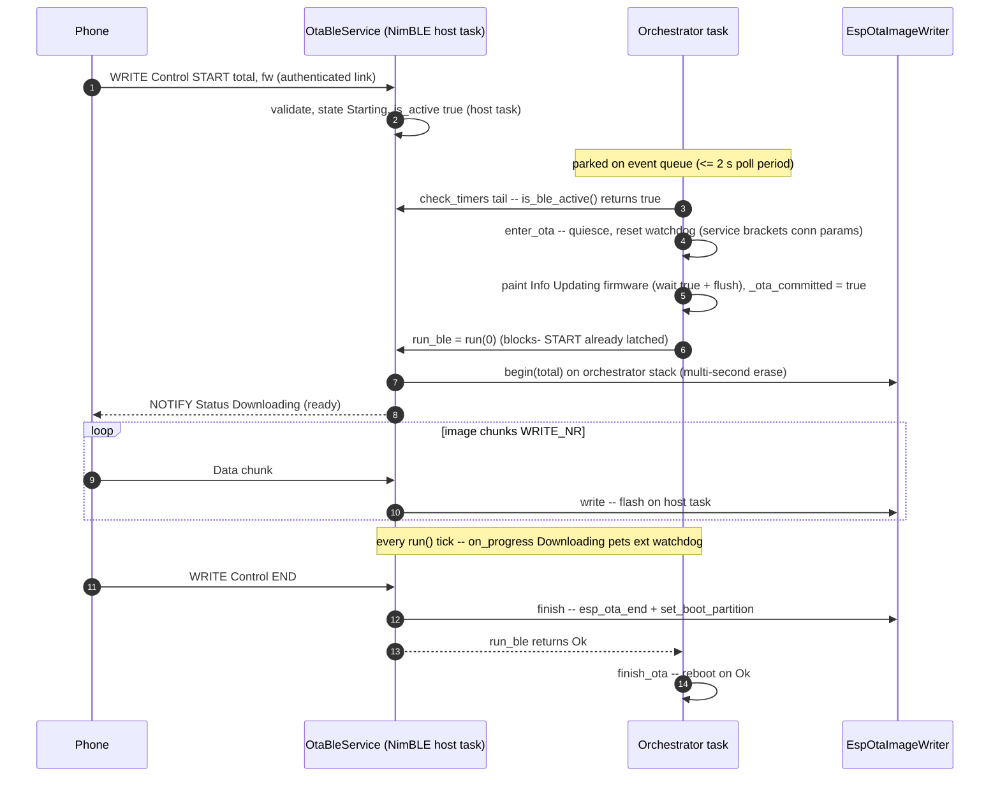
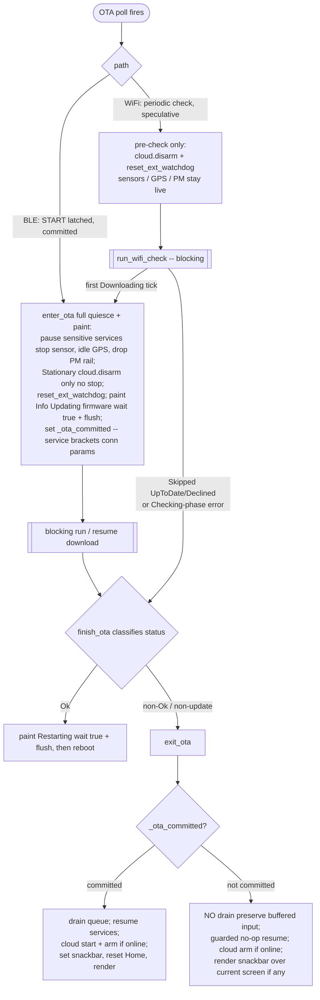

# AirGradient Go OTA Integration

> **This is a spec.** It describes how a feature **will be built**, not what
> currently exists. Once the feature ships, the corresponding doc under
> `docs/` (or the relevant component README) becomes the source of truth and
> this file is typically deleted. See `docs/STYLE.md` → "Doc Lifecycle".

Wire the `airgradient-ota` component into the AirGradient Go product so the
device can update its firmware over the radio that matches its operating mode:
**BLE push** while Portable, **WiFi pull** while Stationary, and nothing while
Offline. OTA is treated as a foreground, exclusive activity — when a transfer
runs, the product quiesces every other service and lets the blocking
`OtaBleService::run()` / `OtaUpdater::run()` own the orchestrator task until the
transfer reaches a terminal state.

## Problem

The Go firmware has no field-update path today. The `airgradient-ota`
component already ships both transports the product needs (a WiFi pull
orchestrator and a v2 BLE push service over a borrowed `AgBleServer`) plus the
universal `EspOtaImageWriter` flash core, and the Go partition table already
carries two OTA app slots and an `otadata` partition. What is missing is the
**product-side glue**:

- A product service (`OtaService`) that owns the per-mode OTA wiring and the
  borrowed-server BLE registration.
- Orchestrator policy: when to check (WiFi), how a phone-initiated transfer
  (BLE) wakes the event loop, and how the device quiesces around a transfer.
- A safe quiesce/resume sequence that protects the ESP32-C5 heap and keeps the
  external hardware watchdog fed across a multi-second blocking transfer.
- A clean handling of mode-change / shutdown requested mid-transfer, and of the
  events that accumulate while the orchestrator is blocked.

The product must integrate these without changing the OTA component's drive
models, and without letting OTA run concurrently with sensors, GPS, cloud, or
the Go BLE data service.

## Goals

- Run **BLE push OTA in Portable** mode on the same `AgBleServer` the Go BLE
  data service advertises, gated by the existing authenticated pairing
  (`DISPLAY_ONLY` + `BOND | MITM`).
- Run **WiFi pull OTA in Stationary** mode, device-initiated: a first check due
  shortly after the connection settles, then every `OTA_WIFI_CHECK_INTERVAL_MS`
  (1 h) while online and idle.
- Run **no OTA in Offline** mode.
- Make OTA exclusive **once a transfer commits**: stop the sensor producer, idle
  GPS, drop the PM rail, pause the cloud (Stationary, `cloud.disarm()` — not
  `stop()`), and suppress Go BLE data-service traffic (Portable). The
  speculative hourly WiFi check does **not**
  quiesce — it only `cloud.disarm()`s up front and commits the full quiesce lazily
  on the first `Downloading` tick — so a no-op check never interrupts sensing.
  Resume on a non-rebooting terminal.
- Keep the orchestrator task safe while it blocks in `run()`: the external
  GPIO2 watchdog is fed from the OTA progress callback in both paths, and a
  pre-transfer `reset_ext_watchdog()` (in `enter_ota()` for BLE, in the WiFi
  pre-check for the periodic check) covers the start gap.
- Reboot only on `OtaStatus::Ok`; surface a failure on the display and return
  to normal operation otherwise.
- Rely on the blocking model for exclusivity: because the orchestrator loop does
  not run during a transfer, mode switches and shutdown are implicitly deferred
  (no interlock flag); on a **committed** failure resume the orchestrator drains
  the event queue so the now-obsolete events are dropped rather than acted on
  (a lightweight no-op check preserves its buffered events instead).
- Keep `OtaService` host-testable through the existing `GoApp` / orchestrator
  test-access seams.

## Non-Goals

- **No change to the OTA component's drive models.** WiFi stays pull
  (`OtaUpdater` + `OtaImageSource`); BLE stays push (`OtaBleService`).
- **No rollback / anti-rollback this iteration.**
  `CONFIG_BOOTLOADER_APP_ROLLBACK_ENABLE` stays off, so a flashed image boots
  directly with no `esp_ota_mark_app_valid_cancel_rollback()` step and no
  automatic revert if a bad image ships. Enabling rollback is captured as an
  Open Question.
- **No live progress UI.** The display paints "Updating firmware…" once at the
  start edge only; progress ticks do not refresh the slow e-paper panel.
- **No transport security beyond what the component provides.** WiFi downloads
  are plain HTTP; BLE relies on the product's authenticated pairing. HTTPS and
  signed images remain future work.
- **No server-driven OTA trigger this iteration.** The WiFi check is a local
  periodic timer; keying the check off the Cloud `FETCH` config body is an Open
  Question.
- **No concurrent OTA.** Only one transfer runs at a time, and only in the mode
  whose radio is up.

## Design

### Mode-to-transport mapping

| Operating Mode | OTA path | Drive model | Component pieces |
|---|---|---|---|
| Portable | BLE push | phone-initiated | `OtaBleService` on the borrowed `AgBleServer` + `EspOtaImageWriter` |
| Stationary | WiFi pull | device-initiated | `WifiHttpOtaSource` + `EspOtaImageWriter` + `OtaUpdater` |
| Offline | none | — | — |

Both paths terminate at the same `EspOtaImageWriter`. The product never
reboots inside the component; it decides reboot from the returned `OtaStatus`.

### Foreground, exclusive execution model

There is **no dedicated OTA task**. Both component entry points
(`OtaUpdater::run()` and `OtaBleService::run()`) are single blocking calls, and
the product runs them on the **orchestrator task itself**, invoked from the
unified OTA poll timer at the tail of `check_timers()` (a 2 s `is_active()` poll
in Portable, the 1 h WiFi check in Stationary — see "BLE start detection" and
"WiFi trigger"). This is safe — and intended — because the orchestrator first
quiesces every other service.

The decisive consequence: **between `enter_ota()` and the transfer's terminal,
the orchestrator main loop never iterates.** `compute_queue_timeout_ms()`,
`check_timers()`, `dispatch()`, sleep evaluation, `change_mode()`, and
`shutdown()` are all frozen. This is why there is **no `_ota_active` gate and no
`is_active()` interlock** in the product: there is no running loop to gate, and
no other product task consults OTA state (every other service is quiesced).
Exclusivity is enforced _actively_ by `enter_ota()` stopping services, not by a
flag.

Queue safety while blocked: the central event queue has depth
`EVENT_QUEUE_DEPTH` (16) and every `RTOS::queue_send()` uses the default
`timeout_ms = 0` (non-blocking, drop-on-full). No producer can ever block on a
full queue, so a queue overflow during a blocked `run()` is harmless. For a
**committed transfer** the high-rate sensor and GPS producers are stopped by the
quiesce step; **`InputService` is _not_ stopped** (its button/touch path must
stay live for the hardware power path), so input events keep posting during a
transfer — but they only **buffer** in the queue and are discarded by the
committed `exit_ota()` drain, exactly like the shared-radio callbacks (Go BLE /
provisioner writes, Wi-Fi events) that **buffer + post deferred events**. None of
these dispatch while the loop is frozen. The BLE `START` itself posts **no** event
(it is handled inside `OtaBleService` on the NimBLE host task and only flips
`is_active()`); the orchestrator notices it by polling, not by a queued event. On
a reboot (`Ok`) the queue is discarded; on a committed failure resume `exit_ota()`
**drains the queue** so the now-obsolete events are dropped rather than acted on.

The **speculative WiFi check** is the exception: its lightweight pre-check leaves
the sensor / GPS producers running and blocks the loop only briefly, so a no-op
resume (`_ota_committed == false`) **does not drain** — events buffered during the
check are real user intent / transitions and dispatch normally once the loop
resumes (see "Quiesce and resume"). The full quiesce and the drain both apply
only once a download actually commits.

**OTA and Go BLE history export are serialized, not concurrent.** The Go data
service's `handle_history_start()` streams its points in a blocking loop **on the
orchestrator task** (dispatched from `on_ble_history_write()`), so while an export
runs the orchestrator likewise never reaches the `is_ble_active()` poll. The two
foreground activities therefore cannot overlap: each holds the single orchestrator
task for its whole duration. The only interleaving is benign — a phone that writes
`START` _during_ an export latches `is_active()` on the host task, but **no image
bytes flash**, because the phone protocol waits for the `Downloading` "ready"
NOTIFY, which is only emitted after the export finishes and OTA's `run()` reaches
`begin()`. When the export completes, the next `check_timers()` poll picks up the
pending `START` and runs the transfer; if the phone's `START` timeout expires
first it simply retries. The product enforces no hard interlock here (it would
need cross-service coupling); the phone-app contract is to **not interleave an OTA
`START` with an active history export**.

If the phone breaks that contract and the `START` times out — or the link drops —
**during** a long export, the latched OTA is not lost: the post-export poll still
sees `is_ble_active()` (the gate's `is_ble_active()` term, see "BLE start
detection") and runs `run_ble()`, which now performs a **delayed** quiesce +
`begin()` partition erase before servicing the abort and returning
`TransportError` → "Update failed". This is the same accepted stillborn-abort race
as a disconnect-before-`begin()`, just deferred by the export's duration — one
wasted quiesce + erase, then a clean failure. Accepted this iteration (Open
Questions); not worth a guard.

### `OtaService` interface

`OtaService` (product, `products/go/main/go_ota.{h,cpp}`) owns the OTA wiring
for both modes. It borrows the shared `AgBleServer` and owns the
`EspOtaImageWriter`; the orchestrator drives it.

```cpp
// products/go/main/go_ota.h
class OtaService {
public:
  struct Config {
    const char *serial_number = nullptr;     // 12-hex device serial
    const char *firmware_version = nullptr;  // GoBoard::firmware_version()
    const char *http_domain = nullptr;       // same AirGradient host as Cloud
    // The WiFi "started downloading" paint does NOT live here — it needs the
    // orchestrator, which is built after the services, so it is passed per-call
    // to run_wifi_check() instead.
  };

  // Borrows the shared BLE server and the PowerService (for the external
  // watchdog); owns the writer. Both are alive before OtaService is constructed.
  // PowerService is injected as a plain reference (like _server) rather than a
  // std::function watchdog seam — it is a concrete, already host-stubbed class,
  // so the reference keeps the wiring simple without dragging a functional
  // indirection through Config. No event-queue dependency: the BLE START is
  // detected by the orchestrator polling is_ble_active(), so OtaService never
  // posts events (the queue drain on a failure resume is the orchestrator's
  // concern, not OtaService's).
  OtaService(AgBleServer &server, PowerService &power, const Config &cfg);

  // Register the OTA GATT service on the borrowed server. MUST run between the
  // BLE server's register phase and start_advertising() (Portable only).
  bool setup_ble();

  // Forward the borrowed server's disconnect so an in-flight transfer aborts.
  // Invoked synchronously from BleService::on_disconnect() via the disconnect
  // observer — see "BLE disconnect forwarding".
  void handle_disconnect();

  // Non-blocking start-edge probe for the orchestrator's periodic poll. Thin
  // wrapper over _ble_ota.is_active(), which the component flips true on the
  // NimBLE host task the moment a valid START latches (before begin()) and clears
  // at the terminal. The orchestrator polls this at the tail of check_timers()
  // every OTA_BLE_POLL_INTERVAL_MS while Portable + a phone is connected.
  bool is_ble_active() const;

  // Drive a phone-initiated BLE transfer to its terminal. Called by the
  // orchestrator after is_ble_active() returns true. Wraps _ble_ota.run(0):
  // because the START is already latched, run() drives the transfer immediately
  // (no idle park). Blocks on the caller (orchestrator) task. Returns the result.
  OtaStatus run_ble();

  // Run one device-initiated WiFi availability check + download. Blocks on the
  // caller (orchestrator) task. Returns the result (UpToDate when no update).
  // on_download_started is invoked exactly once, on the first Downloading tick
  // (i.e. only when an image is really being pulled), so the orchestrator can
  // lazily paint "Updating firmware…" — an hourly UpToDate/Declined check never
  // touches the e-paper. Passed per-call (not via Config) because it wraps the
  // orchestrator, which is constructed after the services. May be empty in tests.
  OtaStatus run_wifi_check(const std::function<void()> &on_download_started);

  // Abort any in-flight transfer and clear the OTA GATT registration.
  // Idempotent. Never deinit()s the server. Portable-only — a no-op when no OTA
  // service was registered. Called on leaving Portable, before ble_service.deinit().
  void teardown_ble();

  // is_ble_active() exists (for the start-edge poll above) but there is no
  // _ota_active product flag and no generic is_active(): the orchestrator blocks
  // for the whole transfer, so no other product code runs to consult one. See
  // "Foreground, exclusive execution model".

private:
  // Named BLE progress handler the OtaBleService fires. Since b4ee952 ("merge
  // poll() into run()") it runs entirely on the run() (orchestrator) task — the
  // Starting edge and the Downloading/Applying ticks. It is wired via a thin
  // forwarder (`_ble_ota.set_on_progress([this](const OtaProgress &p){
  // _on_ble_progress(p); })`), so the logic lives in this named method, not an
  // anonymous lambda — matching the WifiService/BleService seam convention. Its
  // only job here is to keep the external watchdog fed across the blocking
  // transfer: call _power.reset_ext_watchdog() on every non-terminal tick
  // (Starting/Downloading/Applying). (The START itself is not observed here for
  // initiation — the orchestrator detects it by polling is_ble_active(); see
  // "BLE start detection".)
  void _on_ble_progress(const OtaProgress &progress);

  // Named WiFi pull progress handler, the analogue of _on_ble_progress. Wired
  // per-run via a thin forwarder onto the local OtaUpdater (see run_wifi_check()).
  // Feeds _power.reset_ext_watchdog() on every non-terminal tick and fires the
  // stored _on_download_started once on the first Downloading tick (one-shot
  // guarded by _wifi_download_painted). See "Quiesce and resume".
  void _on_wifi_progress(const OtaProgress &progress);

  AgBleServer &_server;
  PowerService &_power;         // external-watchdog feeder; alive before OtaService
  Config _config;
  EspOtaImageWriter _writer;
  OtaBleService _ble_ota;       // constructed over (_server, _writer)
  // Per-call commit notification, stored for the duration of run_wifi_check() so
  // the named _on_wifi_progress() member can invoke it (not an inline lambda).
  std::function<void()> _on_download_started;
  bool _wifi_download_painted = false;  // one-shot guard; reset at run_wifi_check() start
};
```

### BLE start detection — periodic `is_active()` poll

The phone initiates a BLE transfer by writing `START` to the OTA Control
characteristic, which runs on the NimBLE host task inside `OtaBleService`. Since
the component merged `poll()` into `run()` (b4ee952), there is **no host-task
hook** the product can use to post a wake event: `START` only flips the
component's `is_active()` flag (set true on the host task in `_handle_start`,
before `begin()`), and the `Starting` progress callback now fires on the `run()`
task — too late to wake a parked orchestrator. The progress callback is therefore
**not** used for start detection; it only feeds the watchdog (see below).

Instead the orchestrator **polls `is_ble_active()`** at the tail of
`check_timers()` on the unified OTA timer (`_last_ota_check_ms`), every
`OTA_BLE_POLL_INTERVAL_MS` (2 s) while Portable and the phone link is either
**authenticated** or **already has an OTA latched**:

```cpp
// end of Orchestrator::check_timers(), unified OTA timer
if (_mode == OperatingMode::Portable &&
    (_svc.ble_service.is_authenticated() || _svc.ota.is_ble_active())) {
  if ((now - _last_ota_check_ms) >= OTA_BLE_POLL_INTERVAL_MS) {
    _last_ota_check_ms = now;
    if (_svc.ota.is_ble_active()) {
      _ota_committed = false;
      // BLE: a latched START is a committed transfer — quiesce + paint up front.
      enter_ota();                // full quiesce (no paint, no conn-params)
      paint_updating_firmware();  // Screen::Info + update_display(wait=true) + flush()
      _ota_committed = true;
      finish_ota(_svc.ota.run_ble());  // reboot on Ok, else exit_ota()
    }
  }
}
```

Properties:

- **No new event, no component wake hook.** Detection is a cheap boolean read on
  a 2 s cadence. `_last_ota_check_ms` is shared with the Stationary WiFi check
  (the interval is mode-dependent — see "WiFi trigger").
- **Gated on `is_authenticated()` _or_ `is_ble_active()`.** The OTA Control
  characteristic is `WRITE_AUTHEN`, so a `START` cannot latch `is_active()` until
  pairing/encryption has completed — the authenticated term keeps the loop from
  waking every 2 s during the connect→pair window where a `START` is impossible.
  But the `is_ble_active()` term is **required for correctness**: a disconnect
  clears `BleService::is_authenticated()` immediately, while the component's
  `is_active()` only clears inside `run()`. If a phone writes `START` (latching
  `is_active()`) and then disconnects before the next poll, the link is no longer
  authenticated yet the OTA is still latched; without the `is_ble_active()` term
  the gate (and the matching deadline candidate) would never fire again and the
  transfer would be stranded active. With it, one more poll runs `run_ble()`,
  which services the pending abort and clears the latch. (Gating on
  `is_connected()` instead would have the same hole — the lingering `is_active()`
  outlives the connection either way.)
- **Start latency is bounded by more than the poll period.** The phone's
  `START → Downloading`("ready") wait is **poll interval (≤ 2 s) + quiesce +
  display flush + `begin()` partition erase (multi-second)**. The "ready" NOTIFY
  is only emitted after `begin()` completes, so the phone app's `START → ready`
  timeout must comfortably exceed this budget (target ≥ ~10 s; confirm on HIL —
  see Open Questions). This is a property of the exclusive, blocking model, not a
  tunable.

There is a **disconnect-before-`begin()` race**: the phone can disconnect within
the ≤ 2 s `START → poll` window. `is_active()` stays true (only `run()` clears
it) while `handle_disconnect()` has already latched the abort, so the orchestrator
runs a full quiesce and `run(0)` calls `begin()` — a multi-second partition erase
— before the loop services the pending abort, then returns `TransportError`
(`handle_disconnect()` latches `TransportError`, not `Aborted`). The transfer
ends cleanly (`finish_ota()` → `exit_ota("Update failed")`); the only cost is one
wasted quiesce + erase. This is **accepted for this iteration** and captured as
an Open Question (closing it would require a component change to guard `begin()`
against a pending abort).



### WiFi trigger — periodic while online

The orchestrator owns a **single OTA poll timer** (`_last_ota_check_ms`) shared
by both modes; the interval and gate depend on the operating mode. In Stationary
it is the WiFi availability check, active only while online and not inside a
setup session:

- The **first check is due shortly after the Stationary connection settles** —
  i.e. the first time the gate (`is_online() && !_setup_session_active`) holds,
  not one hour after Stationary entry. Implementation: seed `_last_ota_check_ms`
  so the first deadline lands immediately once online (e.g. baseline
  `= now − OTA_WIFI_CHECK_INTERVAL_MS` on entry, or trigger on the online
  transition).
- Re-armed `OTA_WIFI_CHECK_INTERVAL_MS` (1 h) after each check, regardless of
  outcome.
- The OTA deadline candidate in `compute_queue_timeout_ms()` is **mode-selected**
  from the same `_last_ota_check_ms` baseline, and the action in `check_timers()`
  uses the matching gate:
  - `_mode == Stationary && is_online() && !_setup_session_active` →
    interval `OTA_WIFI_CHECK_INTERVAL_MS` (1 h).
  - `_mode == Portable && (is_authenticated() || _svc.ota.is_ble_active())` →
    interval `OTA_BLE_POLL_INTERVAL_MS` (2 s, the `is_ble_active()` poll). The
    authenticated term skips the connect→pair window where a `WRITE_AUTHEN`
    `START` cannot latch; the `is_ble_active()` term keeps the deadline a
    candidate after a disconnect clears auth while an OTA is still latched, so the
    stranded transfer is drained (see "BLE start detection").
  - otherwise (Offline, or the gate does not hold) → **no** OTA deadline
    candidate.
- Including the candidate only while eligible is required: an overdue
  `_last_ota_check_ms` while ineligible would otherwise clamp the timeout to 0
  and busy-spin the loop. (No `_ota_active` term — `compute_queue_timeout_ms()`
  does not run during a transfer.)

When due, the orchestrator runs a **lightweight pre-check** — it does **not**
fully quiesce, because most hourly checks find nothing and stopping the sensor /
GPS / PM rail every hour for a no-op is wasteful. It only `cloud.disarm()`s (so
the check's HTTP does not race cloud traffic) and feeds the watchdog, then calls
`run_wifi_check(on_download_started)`. All progress logic lives in the **named
member** `_on_wifi_progress()` (the analogue of `_on_ble_progress`); the per-call
commit notification is stored as a member for the duration of the call and the
`OtaUpdater` is wired with only a **thin forwarder** — no logic in an anonymous
lambda, matching the `WifiService` / `BleService` seam convention:

```cpp
OtaStatus OtaService::run_wifi_check(const std::function<void()> &on_download_started) {
  _wifi_download_painted = false;          // re-arm the one-shot lazy paint
  _on_download_started = on_download_started;  // store for the named progress handler
  OtaRequest request{_config.serial_number, _config.firmware_version,
                     _config.http_domain, OtaDeviceModel::Go};
  WifiHttpOtaSource source(request);
  OtaUpdater updater(source, _writer);
  updater.set_on_progress([this](const OtaProgress &p) { _on_wifi_progress(p); }); // thin forwarder
  const OtaStatus status = updater.run();  // single blocking call
  _on_download_started = nullptr;          // notification valid only during the call
  return status;
}

void OtaService::_on_wifi_progress(const OtaProgress &p) {
  const bool terminal = p.state == OtaState::Done || p.state == OtaState::Failed ||
                        p.state == OtaState::Skipped;
  if (!terminal) {
    _power.reset_ext_watchdog();  // non-terminal ticks only
  }
  // Lazy commit: only once an image is actually being pulled.
  if (p.state == OtaState::Downloading && !_wifi_download_painted) {
    _wifi_download_painted = true;
    if (_on_download_started) {
      _on_download_started();  // orchestrator: enter_ota() + paint (see call site)
    }
  }
}
```

The orchestrator's call site does the lightweight pre-check, then passes a **thin
forwarder** to its named handler `on_ota_download_started()` (which owns the
display, the quiesce, and `_ota_committed`) — again, no logic in the lambda:

```cpp
// Stationary OTA-check branch in check_timers()
_ota_committed = false;
_svc.cloud.disarm();                      // pause cloud HTTP for the speculative check
_svc.power_service.reset_ext_watchdog();  // cover the check window before it blocks
finish_ota(_svc.ota.run_wifi_check([this] { on_ota_download_started(); }));

// Named handler — runs on the first WiFi Downloading tick (a real image is
// being pulled), synchronously on the (blocked) orchestrator task:
void Orchestrator::on_ota_download_started() {
  enter_ota();                // full quiesce: pause sensitive services + cloud.disarm()
  paint_updating_firmware();  // Screen::Info + update_display(wait=true) + flush()
  _ota_committed = true;
}
```

`OtaStatus::UpToDate` / `Declined` are normal non-update outcomes — the
periodic check must resume **silently** (no snackbar, no display paint, and
without ever having stopped sensing), or it would nag the user, flash the
e-paper, and drop a measurement cycle every hour. This is why **both** the full
quiesce **and** the "Updating firmware…" paint are deferred to the first
`Downloading` tick rather than done up front (see "Quiesce and resume"). A
`Downloading` tick fires only after `writer.begin()`, so the partition erase
runs with sensing still live; this is accepted (separate buses; the erase is
brief), because there is no pull-path progress state between "update confirmed"
and `begin()` to hook an earlier quiesce. `finish_ota()` classifies all
terminals (see below).

### Quiesce and resume

`enter_ota()` and `exit_ota()` bracket every transfer. They reuse the existing
provisioning service-pause machinery and extend it:



`enter_ota()` is the **full quiesce** and **does no display work**: it pauses the
sensitive services (sensor / GPS / PM rail), pauses cloud (Stationary:
`cloud.disarm()` only — **not** `cloud.stop()`; the parked task + heap stay alive
so resume is a plain `arm()`, and the blocked loop + stopped sensor producer keep
the cloud task dormant for the whole transfer), suppresses Go BLE traffic
(Portable — the loop is blocked anyway), feeds the watchdog once
(`reset_ext_watchdog()`), and
returns without touching the panel. It is invoked **up front for BLE** (a latched
`START` is committed) and **lazily for WiFi** (only on the first `Downloading`
tick, from the named `on_ota_download_started()` handler). The Portable BLE
connection-interval window is
**not** a product concern: `OtaBleService` requests the fast window on `begin()`
and restores the relaxed window on a non-success terminal itself.

Both the quiesce **and** the "Updating firmware…" paint are owned **outside** the
speculative WiFi pre-check, so an hourly check that finds nothing never stops
sensing or refreshes the slow e-paper:

- **BLE (Portable):** a latched `START` is a committed transfer, so the
  orchestrator runs `enter_ota()` then paints the `Screen::Info` "Updating
  firmware…" frame with `update_display(/*wait=*/true)` **followed by**
  `DisplayService::flush()` and sets `_ota_committed = true`, all **before**
  `run_ble()`.
- **WiFi (Stationary):** both `enter_ota()` and the paint are **deferred**. The
  pre-check only `cloud.disarm()`s + feeds the watchdog; the orchestrator's named
  `on_ota_download_started()` handler runs `enter_ota()` + the same paint +
  flush (and sets `_ota_committed`) once, on the **first `OtaState::Downloading`**
  tick — i.e. only when an image is actually being pulled. `UpToDate` /
  `Declined` never reach `Downloading`, so sensing is never stopped, the panel is
  never touched, and the check is truly silent.

What the blocking flush guarantees differs slightly by path. For **BLE** the
paint runs before `run_ble()`, so the e-paper worker is idle before any OTA flash
activity, including the `begin()` erase. For **WiFi** the `Downloading` tick fires
**after** `writer.begin()`, so the erase has already happened on an idle panel;
the flush there only guarantees the worker is idle again **before the image
read/write loop resumes**, not before all flash activity. Either way no flash and
no display paint run concurrently (the paint happens synchronously inside the
progress callback, between flash operations). (E-paper SPI and the internal flash
controller are separate buses, so this is about exclusivity, not bus contention.)
`_ota_committed` (an `Orchestrator` member, reset at the start of each OTA poll
branch) records whether the transfer **committed** — i.e. the full `enter_ota()`
quiesce + "Updating firmware…" paint ran (BLE always; WiFi once a download
started). `exit_ota()` uses it to choose the **full resume + queue-drain** vs the
**lightweight cloud re-arm**, and to decide whether to restore the screen. (It is
a general "OTA is committed" signal, so later work — e.g. an LED animation — can
read it too.)

`finish_ota(status)` is the terminal dispatcher. It classifies by `OtaStatus`
and is the **only** place the reboot-vs-resume and the snackbar choice is made
— so `UpToDate`/`Declined` never surface a failure:

| `OtaStatus` | Action |
|---|---|
| `Ok` | `update_display(wait=true)` + `flush()` ("Restarting…"), then `reboot()` (no `exit_ota()`) |
| `UpToDate` / `Declined` | `exit_ota(no_snackbar)` — silent resume |
| `Aborted` | `exit_ota("Update cancelled")` — **explicit phone ABORT command** (`Cmd::Abort`) only |
| `TransportError` / `FlashError` / `InvalidImage` / `ServerError` / `InvalidArgument` | `exit_ota("Update failed")` |

A mid-transfer **BLE disconnect** is **not** `Aborted`: `handle_disconnect()`
latches `OtaStatus::TransportError` (`ota_ble_service.cpp`), as does the
silent-phone stall watchdog, so both surface "Update failed". Only the phone
app's explicit `ABORT` Control write produces `Aborted` → "Update cancelled".
(The `Ok` row paints "Restarting…" with a blocking flush so the frame is actually
rendered before the reboot tears the panel worker down.)

`exit_ota(snackbar)` runs only on a non-rebooting terminal and **branches on
`_ota_committed`** — a committed transfer (BLE, or WiFi after a download started)
held the loop blocked for multiple seconds with sensing stopped; a lightweight
WiFi check only blocked briefly with sensing live.

**Committed resume** (`_ota_committed == true`). **Order matters** — the queue is
drained _before_ anything generates fresh events, so the resume's own work (e.g.
the immediate measurement request) is not discarded:

1. **Drain the event queue** — every event that piled up during the blocked
   window (button presses, BLE config/history writes, provisioner requests,
   Wi-Fi events) is now obsolete, so `exit_ota()` empties the queue first
   (`while (RTOS::queue_receive(_event_queue, &evt, 0)) {}`). This is why the
   shared-radio write callbacks need **no** OTA-aware guard: their buffered
   writes and posted events are simply dropped here. (On `Ok` there is no
   `exit_ota()` — the reboot discards everything.)
2. `resume_provisioning_sensitive_services()` — re-enable PM, restart sensor +
   GPS, request one immediate measurement (its events arrive _after_ the drain
   and are kept).
3. `rebase_periodic_clocks()` so paused timers do not fire back-to-back.
4. **Re-arm cloud** (Stationary): `cloud.arm(/*fire_now=*/false)` **only when
   `_svc.wifi.is_online()`** — the committed path only `cloud.disarm()`ed (task +
   heap stayed alive), so a plain `arm()` restores the cadence with no `start()`.
   If Wi-Fi dropped mid-OTA (how the pull aborts — the source read fails and
   `run()` returns `TransportError`), cloud is left disarmed; the device stays
   Stationary-but-offline, matching the existing "no outer-loop reconnect"
   behavior. `exit_ota()` reconciles this itself rather than depending on a
   queued `WifiDisconnected`, because step 1 discarded it.
5. **Set the snackbar first, then render once.** `update_display()` builds its
   frame from the `UIManager` snackbar state, so the snackbar must be set
   _before_ the render. Set it (`"Update cancelled"` / `"Update failed"`; silent
   outcomes pass `nullptr`), then **reset the UI to `Screen::Home`** (a committed
   transfer always painted "Updating firmware…", so the stuck frame must be
   replaced), `update_display(/*wait=*/true)`, and clear `_ota_committed`.

**Lightweight resume** (`_ota_committed == false` — a WiFi `UpToDate` / `Declined`,
or a `Checking`-phase `TransportError` before any download). The pre-check only
`cloud.disarm()`ed and never stopped sensing, so the resume is minimal and,
crucially, **does NOT drain the queue**:

1. **No drain.** Events buffered during the brief check (an `InputPress`, a
   `UserChangeMode`, a `WifiDisconnected`) are legitimate user intent / real
   transitions, not OTA debris, so they stay and dispatch normally once the loop
   resumes. Dropping a button press the user made during a benign hourly check
   would be a regression — this is the point of not quiescing speculatively.
2. `resume_provisioning_sensitive_services()` is a **guarded no-op** (sensing was
   never paused), so there is nothing to restart and no immediate-measurement
   request.
3. **Re-arm cloud** (Stationary): `cloud.arm(/*fire_now=*/false)` **only when
   `_svc.wifi.is_online()`** — cloud was only disarmed (task + heap alive), so a
   plain `arm()` restores the cadence with no `start()`. If Wi-Fi dropped during
   the check, `is_online()` is false → leave cloud disarmed and let the buffered
   (un-drained) `WifiDisconnected` event drive the offline transition.
4. **Render only if a snackbar was set** (a check failure): set it, then render
   **over the current screen** without a `Screen::Home` reset, so an hourly check
   from a menu / detail screen surfaces "Update failed" without snapping the user
   away. A silent `UpToDate` / `Declined` (no snackbar) renders **nothing** — no
   paint ever happened, the screen is untouched.

### Watchdog handling

The BMS chip watchdog is **disabled** at BMS init
(`WatchdogTimeout::Disable` in `bq25629_bms.cpp`), so it does not need feeding
during a blocking transfer. (The `power_management.md` claim that it "must be
reset every 10 s" is stale and is corrected as part of this work.)

The external GPIO2 watchdog (~6 min window, normally pulsed every 60 s) is the
only one to manage. It is fed two ways during OTA:

- A single pre-transfer `reset_ext_watchdog()` covering the gap to the first
  progress tick. **BLE** feeds it inside `enter_ota()` (the up-front quiesce).
  **WiFi** feeds it in the lightweight pre-check (alongside `cloud.disarm()`),
  **before** the blocking `run_wifi_check()` — because `enter_ota()` is deferred
  to the first `Downloading` tick on the WiFi path, the pre-check carries the
  start-gap feed for the whole speculative check (which may itself block on HTTP).
- `reset_ext_watchdog()` on every **non-terminal** progress tick in **both**
  paths, via the component's `set_on_progress()` (provided by both `OtaUpdater`
  and `OtaBleService`). "Non-terminal" means `Starting`, `Checking`,
  `Downloading`, and `Applying`; the terminal tick (`Done` / `Skipped` /
  `Failed`) needs no feed because the transfer is over. Both named handlers — BLE
  (`_on_ble_progress()`) and WiFi (`_on_wifi_progress()`) — fire on the `run()`
  (orchestrator) task and feed via the borrowed
  `PowerService` reference (`_power.reset_ext_watchdog()`), with no cross-task
  access to reason about. This removes any reliance on the transfer fitting
  inside a single 6-min window.

### Mode-switch and shutdown during a transfer

There is **no explicit interlock**. `change_mode()`, `shutdown()`, lock/unlock,
and every other UI action run on the orchestrator task, which is blocked for the
whole transfer — so none of them can execute mid-flash. The triggering events
(`UserChangeMode`, a long-press `InputPress`, a BLE config-set) just queue:

- On `Ok` → reboot discards the queue, so the deferred actions vanish.
- On failure → `exit_ota()` **drains the queue** (see above), so the now-obsolete
  actions are dropped; the device returns to its pre-OTA mode/state and the user
  re-initiates if they still want the change.
- A held power button still triggers the hardware `/QON` ship-mode restart on
  battery; that is below firmware and unstoppable — an acceptable, rare edge.

`teardown_ble()` is a **Portable-only** concern: on a legitimate (idle) leave of
Portable, the orchestrator clears the disconnect observer
(`set_disconnect_observer(nullptr)`), calls `teardown_ble()`, then
`ble_service.deinit()`. Leaving Stationary needs no OTA teardown — no OTA GATT
service is registered there, and a WiFi check can never be in flight at the
moment of leaving because the leave handler only runs when the loop is not
blocked.

### BLE server co-registration

In Portable mode the OTA GATT service must be registered between the BLE
server's register phase and advertising, exactly where the Portable Wi-Fi
provisioner co-registers. This happens in
`Orchestrator::init_ble_if_portable()` (`go_orchestrator.cpp`), which already
runs `init_stack_and_register()` → `portable_provisioner.attach()` →
`start_advertising()`:

```cpp
// Orchestrator::init_ble_if_portable() — between attach() and start_advertising()
bool ota_ready = _svc.ota.setup_ble();
if (!ota_ready) {
  AG_LOGW(TAG, "OTA setup failed — advertising without OTA");
  _svc.ota.teardown_ble();  // idempotent: clear any partial registration/callbacks
  // continue: Go BLE + provisioning stay usable; WiFi OTA (Stationary) unaffected
} else {
  _svc.ble_service.set_disconnect_observer(
      [this](uint16_t, int) { _svc.ota.handle_disconnect(); });
}
if (!_svc.ble_service.start_advertising()) {
  AG_LOGE(TAG, "start_advertising failed");
  if (ota_ready) {
    // Roll back the OTA wiring we just installed so nothing dangles on the
    // (about-to-be-released) server.
    _svc.ble_service.set_disconnect_observer(nullptr);
    _svc.ota.teardown_ble();
  }
  _svc.portable_provisioner.stop();  // existing release-on-adv-failure path
}
```

`setup_ble()` failure is **non-fatal** (mirrors the existing
`portable_provisioner.attach()` failure path): log, call `teardown_ble()` to drop
any partially-registered OTA characteristics/callbacks, and keep advertising the
Go data service + provisioning without OTA. Symmetrically, if `start_advertising()`
fails **after** a successful `setup_ble()`, the orchestrator clears the disconnect
observer and calls `teardown_ble()` before the server is released, so neither the
observer nor the OTA registration outlives the torn-down server. `teardown_ble()`
is idempotent, so both cleanup paths are safe to run unconditionally.

The OTA characteristics demand an authenticated link (`WRITE_AUTHEN` /
`READ_AUTHEN`); Go's existing `DISPLAY_ONLY` + `BOND | MITM` security satisfies
them, so OTA rides the same pairing with no second bond.

### BLE disconnect forwarding

A central disconnect mid-transfer must abort the in-flight `run_ble()` so the
blocked orchestrator unblocks. Because the orchestrator is blocked during
`run_ble()`, the abort **cannot** be driven from the queued `BleDisconnected`
event — that event is not dispatched until `run_ble()` has already returned (via
the ~10 s silent-phone stall watchdog), by which point OTA is idle and a late
`handle_disconnect()` is a no-op. `OtaService::handle_disconnect()` must instead
run **synchronously in the NimBLE host-task callback context** for a sub-second
abort.

`NimbleBleServer` exposes a **single** disconnect callback slot, already owned by
`BleService` (`go_ble.cpp` registers `on_disconnect` in
`init_stack_and_register()`). Rather than override that slot, `BleService` stays
its sole owner and **fans out to an optional observer**:

```cpp
// go_ble.h — reuse AgBleDisconnectCallback from ble_types.h:
//   std::function<void(uint16_t conn_handle, int reason)>
public:
  void set_disconnect_observer(AgBleDisconnectCallback cb);  // nullable
private:
  AgBleDisconnectCallback _disconnect_observer;
```

```cpp
// go_ble.cpp — BleService::on_disconnect (NimBLE host task)
void BleService::on_disconnect(uint16_t conn_handle, int reason) {
  if (_disconnect_observer) {
    _disconnect_observer(conn_handle, reason);  // OTA aborts FIRST, synchronously
  }
  // ... existing handling: _connected=false, post BleDisconnected, restart adv ...
}
```

```cpp
// Orchestrator::init_ble_if_portable() — installed after a successful setup_ble()
_svc.ble_service.set_disconnect_observer(
    [this](uint16_t, int) { _svc.ota.handle_disconnect(); });  // OTA ignores h/r
```

Properties:

- Runs in the **callback context**, so `handle_disconnect()` sets the terminal
  flag and wakes the blocked `run()` immediately — sub-second abort instead of
  the ~10 s stall fallback.
- Invoked **before** `BleService` restarts advertising / posts `BleDisconnected`,
  so the stale transfer clears before any reconnecting phone can `START`.
- The nested `std::function` (server slot → `on_disconnect` → observer) is
  accepted: both are small-buffer (single-reference capture, no heap) and
  disconnect is a rare event, so the extra indirection is negligible.
- `BleService` keeps sole ownership of the server slot — no override, no exposed
  handler. **The orchestrator owns the observer's lifetime** (`OtaService` has no
  `BleService` reference): it installs the observer in `init_ble_if_portable()`
  and clears it (`set_disconnect_observer(nullptr)`) on leaving Portable, before
  `teardown_ble()` / `ble_service.deinit()`.

### Reboot and image validity

On `OtaStatus::Ok` the orchestrator paints a brief `"Restarting…"` frame and
calls the shared `reboot()` free function from `airgradient-common`
(`common.h`) — the same abstraction `factory_reset()` already uses
(`go_orchestrator.cpp`); the orchestrator never calls `esp_restart()` directly.
The bootloader selects the newly written slot. Because
`CONFIG_BOOTLOADER_APP_ROLLBACK_ENABLE` is off, the image boots directly with
no pending-verify state and no mark-valid call. The trade-off — no automatic
revert if a bad image ships — is accepted for this iteration (see Open
Questions).

### State and event additions

| Addition | Location | Purpose |
|---|---|---|
| `_last_ota_check_ms` (uint32) | `Orchestrator` | Unified OTA poll-timer baseline: 2 s BLE `is_ble_active()` poll (Portable), 1 h WiFi check (Stationary) |
| `_ota_committed` (bool) | `Orchestrator` | Records whether a transfer **committed** — the full `enter_ota()` quiesce + "Updating firmware…" paint ran (BLE always; WiFi once a download started). Gates `exit_ota()`'s full-resume + queue-drain vs the lightweight cloud re-arm, and the `Screen::Home` restore (a silent WiFi `UpToDate` leaves the screen untouched). General "OTA committed" signal (reusable later, e.g. LED animation). Reset at the start of each OTA poll branch |
| `OtaService &ota` | `Orchestrator::Services` | Service reference |
| `on_ota_download_started()` | `Orchestrator` | Named private handler for the WiFi commit edge: `enter_ota()` + paint + set `_ota_committed`. Wired into `run_wifi_check()` via a thin forwarder (logic in the named method, not a lambda) — matches the `WifiService`/`BleService` seam convention |
| `run_wifi_check(on_download_started)` param + `_on_download_started`, `_on_wifi_progress()` | `OtaService` | Per-call **commit seam**: the named `_on_wifi_progress()` handler feeds the watchdog and, on the first WiFi `Downloading` tick, invokes the stored `_on_download_started` (passed at call time, not via `Config`, since it wraps the orchestrator) |
| `set_disconnect_observer()` + `_disconnect_observer` | `BleService` | Synchronous disconnect fan-out to OTA |

No new event type: the BLE `START` is detected by polling `is_ble_active()`, not
by a queued event. No `_ota_active` flag: the blocking model makes it unnecessary
(see "Foreground, exclusive execution model"). `OtaService::is_ble_active()` does
exist — a thin wrapper over the component's `is_active()` used only for the
Portable start-edge poll — but there is no generic product activity gate.

### Build and configuration

- `products/go/main/CMakeLists.txt`: add `go_ota.cpp` to `SRCS`,
  `airgradient-ota` to `REQUIRES`. `products/go/CMakeLists.txt`: add
  `airgradient-ota` to `COMPONENTS`.
- Reuse the component's `CONFIG_AG_OTA_*` Kconfig knobs as-is. Set
  `CONFIG_BT_NIMBLE_ATT_PREFERRED_MTU = 512` and provision the mbuf pool for
  the larger MTU. Note the MTU is not the value-payload size: at MTU 512 the
  ATT Write-Command payload is `MTU − 3 = 509` bytes, so the phone must chunk
  Data writes to ≤ 509 bytes. The component rejects any single Data write larger
  than `CONFIG_AG_OTA_BLE_DATA_MAX_BYTES` (512).
- No partition change (two OTA slots + `otadata` already present). No
  `sdkconfig` rollback change.

New product constants (file-local in `go_orchestrator.cpp` / `go_ota.cpp`):

| Symbol | Default | Purpose |
|---|---|---|
| `OTA_WIFI_CHECK_INTERVAL_MS` | `3600000` | Stationary WiFi OTA check cadence (1 h) |
| `OTA_BLE_POLL_INTERVAL_MS` | `2000` | Portable BLE `is_ble_active()` start-edge poll cadence (2 s), gated on an authenticated client or a still-latched `is_ble_active()` |

The BLE connection-interval window (fast 15–30 ms on `begin()`, relaxed 30–50 ms
on a non-success terminal) is owned by `OtaBleService` as fixed constants, so the
product defines no conn-param symbols.

## Implementation Plan

The OTA component already provides everything this integration needs for its
_logic_ (`OtaBleService::run(timeout)`, `set_on_progress()`, `is_active()`,
`handle_disconnect()`; `OtaUpdater` for the pull path), so the integration work is
**entirely product-side**. The one **required component task before ship** is
unrelated to integration logic: the OTA GATT UUIDs are placeholders
(`ota_ble_service.cpp:44–49`) and must be allocated/finalized alongside the
existing AirGradient provisioning / Go data-service UUIDs before the phone-app
docs and release.

1. **(Component, pre-ship)** Finalize the OTA service / Control / Data / Status
   GATT UUIDs (replace the `ab9a000x-…` placeholders) and update any phone-app
   reference. No code-flow change; gated only by UUID allocation.
2. Add `OtaService` (`go_ota.{h,cpp}`): constructor over the borrowed server +
   the `PowerService` reference + `Config` (value-only; no event-queue
   dependency), `setup_ble()`, `handle_disconnect()`, `is_ble_active()`, `run_ble()` (wraps
   `_ble_ota.run(0)`), `run_wifi_check(on_download_started)` (re-arms the lazy
   paint, stores the per-call notify, wires the local `OtaUpdater` to the named
   `_on_wifi_progress` via a thin forwarder), `teardown_ble()`, and the named
   `_on_ble_progress` / `_on_wifi_progress` handlers. Wire
   `_ble_ota.set_on_progress([this](const OtaProgress &p){ _on_ble_progress(p); })`
   (thin forwarder; all logic in the named methods, no logic-bearing lambdas).
   No `_ota_active` flag / generic `is_active()`.
3. Construct `OtaService` in `go_app.cpp` (interactive + button-wake paths)
   alongside `BleService` / `WifiService`, passing the `power_service` reference
   (for the external watchdog) and sourcing serial, firmware version, and HTTP
   domain into `Config`. The WiFi paint callback is **not** wired here — it is
   passed per-call to `run_wifi_check()` by the orchestrator (it needs the
   orchestrator, which is built after the services).
4. Orchestrator integration: add `_last_ota_check_ms`, `_ota_committed`, the
   `paint_updating_firmware()` and named `on_ota_download_started()` helpers, and
   the unified OTA poll timer at the tail of `check_timers()` — mode-selected
   interval/gate (`Stationary && is_online() && !_setup_session_active` → 1 h WiFi
   check; `Portable && (ble_service.is_authenticated() || ota.is_ble_active())` →
   2 s `is_ble_active()` poll), with the matching deadline candidate in
   `compute_queue_timeout_ms()` — plus `enter_ota()` / `exit_ota()` /
   `finish_ota()` (no `_ota_active` flag). The BLE branch runs `enter_ota()` +
   paint directly before `run_ble()`; the WiFi branch runs the **lightweight
   pre-check** (`cloud.disarm()` + `reset_ext_watchdog()`) and passes a **thin
   forwarder** (`[this]{ on_ota_download_started(); }`) to `run_wifi_check(...)`,
   with the commit logic (`enter_ota()` + paint, on the first `Downloading` tick)
   in the named `on_ota_download_started()` handler — no logic-bearing lambdas.
5. Co-register `ota.setup_ble()` in `init_ble_if_portable()` between
   `init_stack_and_register()` / `attach()` and `start_advertising()`, with the
   non-fatal failure path **and the cleanup paths** (`teardown_ble()` on
   `setup_ble()` failure; clear observer + `teardown_ble()` on a
   `start_advertising()` failure that follows a successful setup). Add
   `BleService::set_disconnect_observer()` + `_disconnect_observer`, invoke it
   first in `BleService::on_disconnect()`, and have the orchestrator install it
   after a successful `setup_ble()` and clear it on leaving Portable (before
   `teardown_ble()` / `deinit()`).
6. Quiesce/resume: `enter_ota()` (full quiesce) reuses
   `pause_provisioning_sensitive_services()`, adds `cloud.disarm()` (Stationary —
   **not** `cloud.stop()`; disarm keeps cloud quiet for the blocked transfer and
   avoids stop()/start() heap churn) + watchdog feed (**no paint**, no
   conn-params — the service brackets those). It is called up front for BLE and
   lazily for WiFi (the named `on_ota_download_started()` handler, on the first
   `Downloading` tick), which also paints and sets `_ota_committed`. The WiFi
   **pre-check** (before `run_wifi_check()`) only `cloud.disarm()`s + feeds the
   watchdog — it does **not** fully quiesce. `exit_ota(snackbar)` **branches on
   `_ota_committed`**: when committed it **drains the queue first**, reuses
   `resume_provisioning_sensitive_services()` + `rebase_periodic_clocks()`,
   re-arms cloud via `arm(false)` on `is_online()` (no `start()` — cloud was only
   disarmed), then sets the snackbar and renders with a `Screen::Home` reset;
   when not committed (a no-op WiFi check) it **does not drain** (preserving
   buffered input), leaves the guarded resume a no-op, only `cloud.arm()`s on
   `is_online()`, and renders a snackbar over the current screen only if one was
   set (nothing for a silent `UpToDate`/`Declined`).
7. Mode-switch / shutdown need **no interlock code** (blocking defers them);
   ensure the leave-Portable path clears the observer + calls `teardown_ble()`
   before `ble_service.deinit()`.
8. `finish_ota(status)` dispatch: `Ok` → `update_display(wait=true)` + `flush()`
   ("Restarting…") then `reboot()`; `UpToDate` / `Declined` → `exit_ota()` silent;
   `Aborted` (explicit phone ABORT) → `exit_ota("Update cancelled")`; other errors
   (incl. disconnect/stall `TransportError`) → `exit_ota("Update failed")`.
9. Build wiring (CMake, MTU/mbuf sdkconfig) and the new product constants.
10. Docs: update `ARCHITECTURE.md`, `ble_service.md` (OTA co-registration +
    the new `set_disconnect_observer()` fan-out), `wifi_service.md`,
    `cloud_service.md`, `orchestrator.md`, `power_management.md` (BMS-watchdog
    correction), `go_ble_client.md` (phone-side OTA, referencing the
    component's allocated UUIDs), and the product `README.md` mode table. On
    ship, add `docs/ota_service.md` and delete this spec.

## Testing Strategy

`run_wifi_check()` and `run_ble()` are **thin shells over ESP-IDF / NimBLE**
(`WifiHttpOtaSource` and the `OtaBleService::run()` loop are both compiled out
under `TEST_HOST`), so they are not meaningfully driven on host and are
HIL-verified. The host-testable surface is the **trigger, quiesce, and outcome
handling in the orchestrator**, exercised against a **stubbed `OtaService`** —
the same boundary at which `WifiService` / `BleService` are already stubbed. The
stub returns a canned `OtaStatus` (`Ok` / `UpToDate` / error) so the orchestrator
paths can be asserted without a real transfer.

Concrete test wiring (call this out — it is **not** as trivial as the existing
pointer-backed `BleService` stub). `BleService` holds its server by pointer, so
its stub constructor just passes `nullptr` (`go_orchestrator_stubs.cpp`).
`OtaService`, by contrast, embeds `EspOtaImageWriter` and `OtaBleService`
**by value**, so any translation unit that constructs an `OtaService` drags in
those two types' constructors. The host build must therefore:

- **Link the `airgradient-ota` host sources** into the orchestrator test target,
  so the by-value `EspOtaImageWriter` + `OtaBleService` members construct under
  `TEST_HOST` (both have host-friendly cores — their ESP-IDF / NimBLE bodies are
  `#ifndef TEST_HOST`). This is the "link OTA test support" step.
- Provide a **link-time `go_ota` stub** (e.g. `OtaService` method bodies in
  `products/go/tests/go_orchestrator_stubs.cpp`, replacing `go_ota.cpp`) that
  overrides the public methods with `test_spy` values: a settable
  `is_ble_active()`, canned `run_ble()` / `run_wifi_check()` `OtaStatus`, and a
  `run_wifi_check()` stub that invokes the passed `on_download_started` when the
  test wants to exercise the lazy paint. The stub's constructor still
  default-constructs the real members (cheap host shells) but never drives them.
- `go_ota.h` on the orchestrator test-access include path, and the matching
  `OtaService` construction (passing the already-host-stubbed `PowerService`
  reference; the `on_download_started` is a per-call arg, not constructed here)
  in `products/go/tests/go_app_stubs.cpp`.

The alternative — adding a `TEST_HOST` construction seam (e.g. an interface /
pimpl) to keep the heavy members out of the header — is intentionally **avoided**
as over-engineering; linking the component's host sources is the smaller change.

- **Host tests** (`TEST_HOST`), via the existing `GoApp` / orchestrator
  test-access, a stubbed `OtaService`, a stubbed `AgBleServer`, and the
  component's host fake writer:
  - Mode gating: WiFi check only fires Stationary + online + idle; the BLE
    `is_ble_active()` poll runs only Portable + an **authenticated** client (or a
    still-latched `is_ble_active()`); nothing in Offline.
  - `finish_ota()` classification against the stubbed `OtaService`: `Ok` →
    reboot (asserts `update_display(wait=true)` + `flush()` before `reboot()`);
    `UpToDate` / `Declined` → silent resume (**no snackbar, no paint**); `Aborted`
    → `"Update cancelled"`; `TransportError` (disconnect/stall) and other errors
    → `"Update failed"`. Cloud re-arm gated on `is_online()`.
  - **UI lifecycle**: BLE path paints "Updating firmware…" before `run_ble()` and
    sets `_ota_committed`; a non-`Ok` BLE terminal restores `Screen::Home`. WiFi
    `UpToDate` (no `Downloading`) never paints and `exit_ota()` leaves the current
    screen untouched (`_ota_committed == false`); a WiFi `Downloading` tick fires
    the named `on_ota_download_started()` (quiesce + paint + `_ota_committed`), and
    the failure terminal then restores Home.
  - The `check_timers()` tail poll: `is_ble_active()` true (Portable +
    authenticated) runs the enter/run path; `is_ble_active()` false, or
    unauthenticated **and** not latched, or non-Portable, is skipped.
  - **Stranded-active recovery** (the auth-cleared-but-latched case): with
    `is_authenticated() == false` but `is_ble_active() == true`, both the gate and
    the `compute_queue_timeout_ms()` deadline candidate still hold, so the next
    poll runs `run_ble()` and the latch clears (no permanent stuck-active).
  - **Committed transfer** (BLE, or WiFi after a `Downloading` tick):
    `enter_ota()` / `exit_ota()` pause and resume the sensitive services,
    `cloud.disarm()` then `cloud.arm(false)` (gated on `is_online()`; never
    `stop()`/`start()`), rebase periodic clocks, and **drain the event queue** on
    a failure resume (assert pre-seeded queued events — incl. an `InputPress` —
    are gone afterward).
  - **Lightweight WiFi check** (no `Downloading`, `_ota_committed == false`): the
    pre-check only `cloud.disarm()`s and feeds the watchdog — the sensitive
    services keep running (assert the sensor producer is **not** stopped) — and
    the resume only `cloud.arm()`s (gated on `is_online()`) and **does NOT drain
    the queue** (assert a pre-seeded `InputPress` is **still present** afterward,
    so a button press during a benign hourly check survives).
  - **Snackbar order**: `exit_ota()` sets the snackbar via `show_snackbar()`
    _before_ the single render; a non-painting WiFi failure (`_ota_committed ==
    false`, snackbar set) renders "Update failed" over the current screen without
    a Home reset; a silent `UpToDate` (no snackbar, not painted) performs no
    render at all.
  - Unified OTA poll timer: Stationary 1 h deadline arming + re-arm after each
    outcome; Portable 2 s `is_ble_active()` poll cadence; deadline candidate
    excluded from `compute_queue_timeout_ms()` while ineligible (offline / setup
    session in Stationary, unauthenticated **and** not latched in Portable, or
    Offline) — no busy-spin.
  - Progress callback feed cadence (the named `_on_ble_progress` and
    `_on_wifi_progress` handlers) is **HIL-verified, not host-asserted**: both fire
    inside the component's `run()` loop, whose body is `#ifndef TEST_HOST`
    (compiled out on host) and is replaced by the `go_ota` stub's canned
    `run_ble()` / `run_wifi_check()` in orchestrator tests, so the real watchdog
    feeds never execute on host. The watchdog wiring (`_power.reset_ext_watchdog()`
    on every non-terminal tick — `Starting` / `Checking` / `Downloading` /
    `Applying` — and not on the terminal tick) is checked on HIL via "the external
    watchdog does not fire during a transfer".
- **HIL:** real BLE update from the phone app in Portable (fresh image applies
  and boots; mid-stream disconnect ends in `TransportError` → "Update failed" and
  resumes cleanly without bricking; an explicit phone ABORT shows "Update
  cancelled"; the Go BLE data service is quiet during the transfer; the
  `START → Downloading` ready latency — poll + quiesce + flush + erase — stays
  within the phone app's `START` timeout; the external watchdog does not fire);
  real WiFi update in Stationary (1 h check applies an image and reboots;
  `304` reports `UpToDate` with **no reboot and no e-paper repaint**; a
  mid-download Wi-Fi drop ends in `TransportError` and resumes); an OTA `START`
  attempted during an active history export is serialized (no concurrent flash);
  NimBLE host-task stack high-water and MTU-512 mbuf headroom confirmed.

## Open Questions

- **Rollback + mark-valid (improvement).** Should a later iteration enable
  `CONFIG_BOOTLOADER_APP_ROLLBACK_ENABLE` and add an
  `esp_ota_mark_app_valid_cancel_rollback()` after a healthy boot self-check,
  so a bad image auto-reverts? Out of scope here.
- **Disconnect-before-`begin()` race (improvement).** A `START` then disconnect
  within the ≤ 2 s `is_ble_active()` poll window currently triggers a full
  quiesce + multi-second partition erase before `run()` services the latched
  abort and returns `TransportError` ("Update failed") — a wasted, stillborn
  transfer. Accepted this iteration. Closing it needs an additive component
  change: `run()` checks `_pending == Abort` before `_begin_step()` and
  terminates without erasing (`_writer.abort()` is idempotent pre-`begin`).
- **`START → ready` phone timeout (confirm on HIL).** The device's
  `START → Downloading`("ready") delay is poll interval (≤ 2 s) + quiesce +
  display flush + `begin()` partition erase (multi-second), so it can run several
  seconds. Confirm the phone app's `START` handshake timeout comfortably exceeds
  this (target ≥ ~10 s) on iOS and Android, and that the device-side fast
  conn-param window does not shorten it.
- **OTA GATT UUIDs.** The OTA service/Control/Data/Status UUIDs are placeholders
  (`ab9a000x-…`) in the component and must be allocated/finalized alongside the
  existing AirGradient UUID scheme before the phone-app docs and ship (tracked as
  the pre-ship component task in the Implementation Plan).
- **Config-driven WiFi trigger.** Should the 1 h check be replaced or augmented
  by a target-firmware signal parsed from the Cloud `FETCH` config body (today
  log-only)?
- **HTTPS / signed images.** `esp_ota` verifies the image's own embedded
  SHA-256, which catches corruption and truncation but is not transport
  security — plain HTTP provides no authentication, so a man-in-the-middle can
  serve a valid-but-malicious image. HTTPS and signed images remain future
  hardening.
- **Connection-parameter values.** Confirm the BLE OTA window owned by
  `OtaBleService` (fast 15 ms / 30 ms, latency 0, ~2 s supervision; relaxed
  30 ms / 50 ms restore) against the real phone app on iOS and Android.
- **HTTP domain source.** Confirm the exact accessor for the AirGradient host
  shared with the Cloud service so `OtaService::Config::http_domain` is wired
  from a single source of truth.
