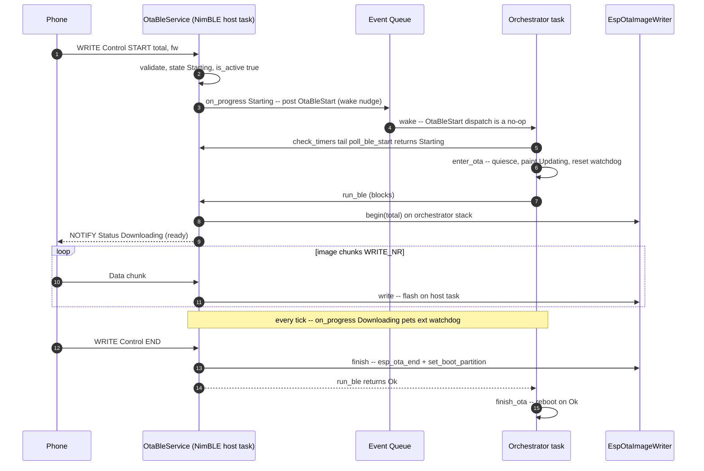
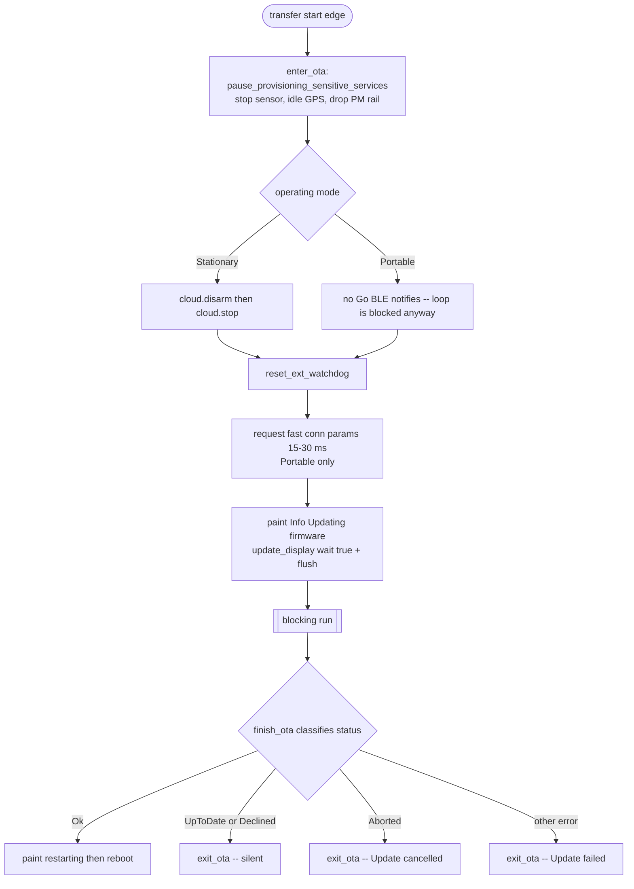

# AirGradient Go OTA Integration

> **This is a spec.** It describes how a feature **will be built**, not what
> currently exists. Once the feature ships, the corresponding doc under
> `docs/` (or the relevant component README) becomes the source of truth and
> this file is typically deleted. See `docs/STYLE.md` → "Doc Lifecycle".

Wire the `airgradient-ota` component into the AirGradient Go product so the
device can update its firmware over the radio that matches its operating mode:
**BLE push** while Portable, **WiFi pull** while Stationary, and nothing while
Offline. OTA is treated as a foreground, exclusive activity — when a transfer
runs, the product quiesces every other service and lets the blocking
`OtaBleService::run()` / `OtaUpdater::run()` own the orchestrator task until the
transfer reaches a terminal state.

## Problem

The Go firmware has no field-update path today. The `airgradient-ota`
component already ships both transports the product needs (a WiFi pull
orchestrator and a v2 BLE push service over a borrowed `AgBleServer`) plus the
universal `EspOtaImageWriter` flash core, and the Go partition table already
carries two OTA app slots and an `otadata` partition. What is missing is the
**product-side glue**:

- A product service (`OtaService`) that owns the per-mode OTA wiring and the
  borrowed-server BLE registration.
- Orchestrator policy: when to check (WiFi), how a phone-initiated transfer
  (BLE) wakes the event loop, and how the device quiesces around a transfer.
- A safe quiesce/resume sequence that protects the ESP32-C5 heap and keeps the
  external hardware watchdog fed across a multi-second blocking transfer.
- A clean handling of mode-change / shutdown requested mid-transfer, and of the
  events that accumulate while the orchestrator is blocked.

The product must integrate these without changing the OTA component's drive
models, and without letting OTA run concurrently with sensors, GPS, cloud, or
the Go BLE data service.

## Goals

- Run **BLE push OTA in Portable** mode on the same `AgBleServer` the Go BLE
  data service advertises, gated by the existing authenticated pairing
  (`DISPLAY_ONLY` + `BOND | MITM`).
- Run **WiFi pull OTA in Stationary** mode, device-initiated: a first check due
  shortly after the connection settles, then every `OTA_WIFI_CHECK_INTERVAL_MS`
  (1 h) while online and idle.
- Run **no OTA in Offline** mode.
- Make OTA exclusive: before any transfer, stop the sensor producer, idle GPS,
  drop the PM rail, pause/stop the cloud (Stationary), and suppress Go BLE
  data-service traffic (Portable). Resume them on a non-rebooting terminal.
- Keep the orchestrator task safe while it blocks in `run()`: the external
  GPIO2 watchdog is fed from the OTA progress callback in both paths, and a
  pre-transfer `reset_ext_watchdog()` covers the start gap.
- Reboot only on `OtaStatus::Ok`; surface a failure on the display and return
  to normal operation otherwise.
- Rely on the blocking model for exclusivity: because the orchestrator loop does
  not run during a transfer, mode switches and shutdown are implicitly deferred
  (no interlock flag); on a failure resume the orchestrator drains the event
  queue so the now-obsolete events are dropped rather than acted on.
- Keep `OtaService` host-testable through the existing `GoApp` / orchestrator
  test-access seams.

## Non-Goals

- **No change to the OTA component's drive models.** WiFi stays pull
  (`OtaUpdater` + `OtaImageSource`); BLE stays push (`OtaBleService`).
- **No rollback / anti-rollback this iteration.**
  `CONFIG_BOOTLOADER_APP_ROLLBACK_ENABLE` stays off, so a flashed image boots
  directly with no `esp_ota_mark_app_valid_cancel_rollback()` step and no
  automatic revert if a bad image ships. Enabling rollback is captured as an
  Open Question.
- **No live progress UI.** The display paints "Updating firmware…" once at the
  start edge only; progress ticks do not refresh the slow e-paper panel.
- **No transport security beyond what the component provides.** WiFi downloads
  are plain HTTP; BLE relies on the product's authenticated pairing. HTTPS and
  signed images remain future work.
- **No server-driven OTA trigger this iteration.** The WiFi check is a local
  periodic timer; keying the check off the Cloud `FETCH` config body is an Open
  Question.
- **No concurrent OTA.** Only one transfer runs at a time, and only in the mode
  whose radio is up.

## Design

### Mode-to-transport mapping

| Operating Mode | OTA path | Drive model | Component pieces |
|---|---|---|---|
| Portable | BLE push | phone-initiated | `OtaBleService` on the borrowed `AgBleServer` + `EspOtaImageWriter` |
| Stationary | WiFi pull | device-initiated | `WifiHttpOtaSource` + `EspOtaImageWriter` + `OtaUpdater` |
| Offline | none | — | — |

Both paths terminate at the same `EspOtaImageWriter`. The product never
reboots inside the component; it decides reboot from the returned `OtaStatus`.

### Foreground, exclusive execution model

There is **no dedicated OTA task**. Both component entry points
(`OtaUpdater::run()` and `OtaBleService::run()`) are single blocking calls, and
the product runs them on the **orchestrator task itself**, invoked from inside
`check_timers()` (BLE) or the WiFi-check timer (WiFi). This is safe — and
intended — because the orchestrator first quiesces every other service.

The decisive consequence: **between `enter_ota()` and the transfer's terminal,
the orchestrator main loop never iterates.** `compute_queue_timeout_ms()`,
`check_timers()`, `dispatch()`, sleep evaluation, `change_mode()`, and
`shutdown()` are all frozen. This is why there is **no `_ota_active` gate and no
`is_active()` interlock** in the product: there is no running loop to gate, and
no other product task consults OTA state (every other service is quiesced).
Exclusivity is enforced _actively_ by `enter_ota()` stopping services, not by a
flag.

Queue safety while blocked: the central event queue has depth
`EVENT_QUEUE_DEPTH` (16) and every `RTOS::queue_send()` uses the default
`timeout_ms = 0` (non-blocking, drop-on-full). No producer can ever block on a
full queue, so a queue overflow during a blocked `run()` is harmless. The
high-rate producers (sensor, GPS, input) are stopped by the quiesce step
anyway; the only remaining posters are shared-radio callbacks (Go BLE / provisioner
writes, Wi-Fi events) that merely **buffer + post deferred events** — none of which
dispatch while the loop is frozen. On a reboot (`Ok`) the queue is discarded; on a
failure resume `exit_ota()` **drains the queue** so the now-obsolete events are
dropped rather than acted on.

### `OtaService` interface

`OtaService` (product, `products/go/main/go_ota.{h,cpp}`) owns the OTA wiring
for both modes. It borrows the shared `AgBleServer` and owns the
`EspOtaImageWriter`; the orchestrator drives it.

```cpp
// products/go/main/go_ota.h
class OtaService {
public:
  struct Config {
    const char *serial_number = nullptr;     // 12-hex device serial
    const char *firmware_version = nullptr;  // GoBoard::firmware_version()
    const char *http_domain = nullptr;       // same AirGradient host as Cloud
    // External-watchdog feeder seam. Injected by the orchestrator as a thin
    // wrapper over PowerService::reset_ext_watchdog(). A functional seam (not a
    // PowerService& dependency) so host tests can pass a counting lambda and
    // assert the feed cadence without dragging PowerService into OtaService.
    std::function<void()> feed_watchdog;
  };

  // Borrows the shared BLE server and the central event queue; owns the writer.
  OtaService(AgBleServer &server, RtosQueueHandle event_queue, const Config &cfg);

  // Register the OTA GATT service on the borrowed server. MUST run between the
  // BLE server's register phase and start_advertising() (Portable only).
  bool setup_ble();

  // Forward the borrowed server's disconnect so an in-flight transfer aborts.
  // Invoked synchronously from BleService::on_disconnect() via the disconnect
  // observer — see "BLE disconnect forwarding".
  void handle_disconnect();

  // Non-blocking confirmation gate for the BLE start edge. Returns
  // OtaState::Starting once a valid START has latched, OtaState::Idle otherwise.
  // Thin wrapper over _ble_ota.poll(0); the orchestrator calls it at the tail of
  // check_timers().
  OtaState poll_ble_start();

  // Drive a phone-initiated BLE transfer to its terminal. Called by the
  // orchestrator after poll_ble_start() confirms Starting. Blocks on the caller
  // (orchestrator) task. Returns the result.
  OtaStatus run_ble();

  // Run one device-initiated WiFi availability check + download. Blocks on the
  // caller (orchestrator) task. Returns the result (UpToDate when no update).
  OtaStatus run_wifi_check();

  // Abort any in-flight transfer and clear the OTA GATT registration.
  // Idempotent. Never deinit()s the server. Portable-only — a no-op when no OTA
  // service was registered. Called on leaving Portable, before ble_service.deinit().
  void teardown_ble();

  // No is_active() / activity flag: the orchestrator blocks for the whole
  // transfer, so no other product code runs to consult it. See "Foreground,
  // exclusive execution model".

private:
  // Single OtaState-discriminated callback the OtaBleService fires. It runs on
  // TWO task contexts, distinguished by progress.state:
  //  - Starting   (NimBLE host task): post OtaBleStart to the event queue. This
  //               branch never touches the watchdog.
  //  - Downloading (orchestrator task, run() tick): call _config.feed_watchdog.
  // Because feed_watchdog runs only from the Downloading branch (orchestrator
  // task), there is no cross-task watchdog access to reason about.
  void _on_ble_progress(const OtaProgress &progress);

  // WiFi pull progress callback (orchestrator task): call _config.feed_watchdog.
  void _on_wifi_progress(const OtaProgress &progress);

  AgBleServer &_server;
  RtosQueueHandle _event_queue;
  Config _config;
  EspOtaImageWriter _writer;
  OtaBleService _ble_ota;  // constructed over (_server, _writer)
};
```

### BLE start detection — event-driven (Option B)

The phone initiates a BLE transfer by writing `START` to the OTA Control
characteristic, which runs on the NimBLE host task inside `OtaBleService`. To
wake the parked orchestrator without polling, the OTA component gains **one**
additive callback, `OtaBleService::set_on_progress(OtaProgressCallback)`
(prerequisite, see Implementation Plan). It reuses the existing
`OtaProgress` / `OtaState` types and fires on two low-frequency, non-hot-path
events:

- `OtaState::Starting` — emitted from the Control callback (NimBLE host task)
  when a valid `START` latches.
- `OtaState::Downloading` — emitted from the `run()` progress tick
  (orchestrator task) every `CONFIG_AG_OTA_BLE_PROGRESS_INTERVAL_MS`.

`OtaService::_on_ble_progress()` branches on `progress.state`:

```cpp
void OtaService::_on_ble_progress(const OtaProgress &progress) {
  if (progress.state == OtaState::Starting) {
    // NimBLE host task — callback-safe, non-blocking post. Wake-only nudge.
    Event event{};
    event.type = EventType::OtaBleStart;
    RTOS::queue_send(_event_queue, &event, 0);
    return;
  }
  // Downloading tick — orchestrator task, inside run(). Keep the external
  // watchdog fed across the blocking transfer.
  if (_config.feed_watchdog) {
    _config.feed_watchdog();
  }
}
```

`OtaBleStart` is a **wake-only nudge** — its sole purpose is to wake an
orchestrator that may be parked on its queue (up to the ~5 s BMS deadline) so it
notices the start promptly. Its dispatch handler does nothing:

```cpp
case EventType::OtaBleStart:
  break;  // wake-only; the start is serviced by the poll at the tail of
          // check_timers() (single initiation point)
```

The **single initiation point** is a non-blocking poll at the tail of
`check_timers()`, which already runs every loop iteration. `poll_ble_start()`
returns `Idle` immediately when nothing is pending, so calling it
unconditionally each pass is cheap:

```cpp
// end of Orchestrator::check_timers()
if (_mode == OperatingMode::Portable &&
    _svc.ota.poll_ble_start() == OtaState::Starting) {
  enter_ota();
  finish_ota(_svc.ota.run_ble());  // reboot on Ok, else exit_ota()
}
```

This makes start detection **provably correct without a dedicated poll timer**:
the event gives promptness, and if it is ever dropped (queue full — drop-on-full
semantics), the next `check_timers()` pass still picks up the latched `Starting`.

There is a **disconnect-before-dispatch race**: the phone can disconnect in the
`START → poll_ble_start()` window. Today the component would still report
`Starting` (`poll()` checks only its internal `_state`, not the latched abort)
and `run()` would call `begin()` — a multi-second partition erase — before the
loop sees the abort, so the orchestrator runs a full quiesce for a stillborn
transfer. The product **cannot** detect this from `poll_ble_start()` /
`is_active()` alone, so it is closed by a **prerequisite component change** (see
Implementation Plan): an abort latched while `Starting` must make `poll()`
return `Idle` and `run()` skip `begin()`, returning the service cleanly to
`Idle`.



### WiFi trigger — periodic while online

The orchestrator owns a single OTA-check timer, active only in Stationary mode
while online and not inside a setup session:

- The **first check is due shortly after the Stationary connection settles** —
  i.e. the first time the gate (`is_online() && !_setup_session_active`) holds,
  not one hour after Stationary entry. Implementation: seed `_last_ota_check_ms`
  so the first deadline lands immediately once online (e.g. baseline
  `= now − OTA_WIFI_CHECK_INTERVAL_MS` on entry, or trigger on the online
  transition).
- Re-armed `OTA_WIFI_CHECK_INTERVAL_MS` (1 h) after each check, regardless of
  outcome.
- The OTA deadline is included in `compute_queue_timeout_ms()` **only when**
  `_mode == Stationary && _svc.wifi.is_online() && !_setup_session_active`, and
  the action in `check_timers()` uses the same gate. Including the deadline
  candidate only while eligible is required: an overdue `_last_ota_check_ms`
  while offline / in a setup session would otherwise clamp the timeout to 0 and
  busy-spin the loop. (No `_ota_active` term — `compute_queue_timeout_ms()` does
  not run during a transfer.)

When due, the orchestrator quiesces and calls `run_wifi_check()`, which builds
the request and runs the blocking pull:

```cpp
OtaStatus OtaService::run_wifi_check() {
  OtaRequest request{_config.serial_number, _config.firmware_version,
                     _config.http_domain, OtaDeviceModel::Go};
  WifiHttpOtaSource source(request);
  OtaUpdater updater(source, _writer);
  updater.set_on_progress([this](const OtaProgress &p) { _on_wifi_progress(p); });
  return updater.run();  // single blocking call
}
```

`OtaStatus::UpToDate` / `Declined` are normal non-update outcomes — the
periodic check must resume **silently** (no snackbar), or it would nag the user
every hour. `finish_ota()` classifies all terminals (see below).

### Quiesce and resume

`enter_ota()` and `exit_ota()` bracket every transfer. They reuse the existing
provisioning service-pause machinery and extend it:



`enter_ota()` ordering matters. After the service pause, cloud stop (Stationary)
and BLE-traffic suppression (Portable), it: feeds the watchdog once
(`reset_ext_watchdog()`); in Portable requests the fast OTA connection window via
`_board.ble_server().request_conn_params(OTA_CONN_MIN_MS, OTA_CONN_MAX_MS, 0,
OTA_CONN_SUPERVISION_MS)` (a hint the central may clamp); then paints the
`Screen::Info` "Updating firmware…" frame with `update_display(/*wait=*/true)`
**followed by** `DisplayService::flush()`. The blocking flush guarantees the
e-paper worker finishes and goes idle **before** the blocking `run()` starts — so
OTA truly runs exclusive, with no display worker active alongside it. (E-paper
SPI and the internal flash controller are separate buses, so this is about
exclusivity, not bus contention.)

`finish_ota(status)` is the terminal dispatcher. It classifies by `OtaStatus`
and is the **only** place the reboot-vs-resume and the snackbar choice is made
— so `UpToDate`/`Declined` never surface a failure:

| `OtaStatus` | Action |
|---|---|
| `Ok` | paint "Restarting…", `reboot()` (no `exit_ota()`) |
| `UpToDate` / `Declined` | `exit_ota(no_snackbar)` — silent resume |
| `Aborted` | `exit_ota("Update cancelled")` — phone/user cancel or product teardown |
| `TransportError` / `FlashError` / `InvalidImage` / `ServerError` / `InvalidArgument` | `exit_ota("Update failed")` |

`exit_ota(snackbar)` runs only on a non-rebooting terminal. **Order matters** —
the queue is drained _before_ anything generates fresh events, so the resume's
own work (e.g. the immediate measurement request) is not discarded:

1. **Drain the event queue** — every event that piled up during the blocked
   window (button presses, BLE config/history writes, provisioner requests,
   Wi-Fi events) is now obsolete, so `exit_ota()` empties the queue first
   (`while (RTOS::queue_receive(_event_queue, &evt, 0)) {}`). This is why the
   shared-radio write callbacks need **no** OTA-aware guard: their buffered
   writes and posted events are simply dropped here. (On `Ok` there is no
   `exit_ota()` — the reboot discards everything.)
2. Restore the product's relaxed connection parameters (Portable).
3. `resume_provisioning_sensitive_services()` — re-enable PM, restart sensor +
   GPS, request one immediate measurement (its events arrive _after_ the drain
   and are kept).
4. `rebase_periodic_clocks()` so paused timers do not fire back-to-back.
5. **Reconcile cloud directly** (Stationary): `cloud.start()` + `cloud.arm()`
   **only when `_svc.wifi.is_online()`**. If Wi-Fi dropped mid-OTA (how the pull
   aborts — the source read fails and `run()` returns `TransportError`), cloud
   is left stopped; the device stays Stationary-but-offline, matching the
   existing "no outer-loop reconnect" behavior. `exit_ota()` reconciles this
   itself rather than depending on a queued `WifiDisconnected`, because step 1
   discarded it.
6. Show the snackbar passed by `finish_ota()` (`"Update cancelled"` /
   `"Update failed"`), or none for the silent outcomes.

### Watchdog handling

The BMS chip watchdog is **disabled** at BMS init
(`WatchdogTimeout::Disable` in `bq25629_bms.cpp`), so it does not need feeding
during a blocking transfer. (The `power_management.md` claim that it "must be
reset every 10 s" is stale and is corrected as part of this work.)

The external GPIO2 watchdog (~6 min window, normally pulsed every 60 s) is the
only one to manage. It is fed two ways during OTA:

- `reset_ext_watchdog()` once in `enter_ota()`, covering the gap from the start
  edge to the first progress tick.
- `reset_ext_watchdog()` on every progress callback tick in **both** paths —
  the WiFi pull `OtaUpdater::set_on_progress()` (already provided by the
  component) and the new BLE `OtaBleService::set_on_progress()`
  (`OtaState::Downloading` branch). This removes any reliance on the transfer
  fitting inside a single 6-min window.

### Mode-switch and shutdown during a transfer

There is **no explicit interlock**. `change_mode()`, `shutdown()`, lock/unlock,
and every other UI action run on the orchestrator task, which is blocked for the
whole transfer — so none of them can execute mid-flash. The triggering events
(`UserChangeMode`, a long-press `InputPress`, a BLE config-set) just queue:

- On `Ok` → reboot discards the queue, so the deferred actions vanish.
- On failure → `exit_ota()` **drains the queue** (see above), so the now-obsolete
  actions are dropped; the device returns to its pre-OTA mode/state and the user
  re-initiates if they still want the change.
- A held power button still triggers the hardware `/QON` ship-mode restart on
  battery; that is below firmware and unstoppable — an acceptable, rare edge.

`teardown_ble()` is a **Portable-only** concern: on a legitimate (idle) leave of
Portable, the orchestrator clears the disconnect observer
(`set_disconnect_observer(nullptr)`), calls `teardown_ble()`, then
`ble_service.deinit()`. Leaving Stationary needs no OTA teardown — no OTA GATT
service is registered there, and a WiFi check can never be in flight at the
moment of leaving because the leave handler only runs when the loop is not
blocked.

### BLE server co-registration

In Portable mode the OTA GATT service must be registered between the BLE
server's register phase and advertising, exactly where the Portable Wi-Fi
provisioner co-registers. This happens in
`Orchestrator::init_ble_if_portable()` (`go_orchestrator.cpp`), which already
runs `init_stack_and_register()` → `portable_provisioner.attach()` →
`start_advertising()`:

```cpp
// Orchestrator::init_ble_if_portable() — between attach() and start_advertising()
if (!_svc.ota.setup_ble()) {
  AG_LOGW(TAG, "OTA setup failed — advertising without OTA");
  // continue: Go BLE + provisioning stay usable; WiFi OTA (Stationary) unaffected
} else {
  _svc.ble_service.set_disconnect_observer(
      [this](uint16_t, int) { _svc.ota.handle_disconnect(); });
}
_svc.ble_service.start_advertising();
```

`setup_ble()` failure is **non-fatal** (mirrors the existing
`portable_provisioner.attach()` failure path): log and keep advertising the Go
data service + provisioning, just without the OTA characteristics.

The OTA characteristics demand an authenticated link (`WRITE_AUTHEN` /
`READ_AUTHEN`); Go's existing `DISPLAY_ONLY` + `BOND | MITM` security satisfies
them, so OTA rides the same pairing with no second bond.

### BLE disconnect forwarding

A central disconnect mid-transfer must abort the in-flight `run_ble()` so the
blocked orchestrator unblocks. Because the orchestrator is blocked during
`run_ble()`, the abort **cannot** be driven from the queued `BleDisconnected`
event — that event is not dispatched until `run_ble()` has already returned (via
the ~10 s silent-phone stall watchdog), by which point OTA is idle and a late
`handle_disconnect()` is a no-op. `OtaService::handle_disconnect()` must instead
run **synchronously in the NimBLE host-task callback context** for a sub-second
abort.

`NimbleBleServer` exposes a **single** disconnect callback slot, already owned by
`BleService` (`go_ble.cpp` registers `on_disconnect` in
`init_stack_and_register()`). Rather than override that slot, `BleService` stays
its sole owner and **fans out to an optional observer**:

```cpp
// go_ble.h — reuse AgBleDisconnectCallback from ble_types.h:
//   std::function<void(uint16_t conn_handle, int reason)>
public:
  void set_disconnect_observer(AgBleDisconnectCallback cb);  // nullable
private:
  AgBleDisconnectCallback _disconnect_observer;
```

```cpp
// go_ble.cpp — BleService::on_disconnect (NimBLE host task)
void BleService::on_disconnect(uint16_t conn_handle, int reason) {
  if (_disconnect_observer) {
    _disconnect_observer(conn_handle, reason);  // OTA aborts FIRST, synchronously
  }
  // ... existing handling: _connected=false, post BleDisconnected, restart adv ...
}
```

```cpp
// Orchestrator::init_ble_if_portable() — installed after a successful setup_ble()
_svc.ble_service.set_disconnect_observer(
    [this](uint16_t, int) { _svc.ota.handle_disconnect(); });  // OTA ignores h/r
```

Properties:

- Runs in the **callback context**, so `handle_disconnect()` sets the terminal
  flag and wakes the blocked `run()` immediately — sub-second abort instead of
  the ~10 s stall fallback.
- Invoked **before** `BleService` restarts advertising / posts `BleDisconnected`,
  so the stale transfer clears before any reconnecting phone can `START`.
- The nested `std::function` (server slot → `on_disconnect` → observer) is
  accepted: both are small-buffer (single-reference capture, no heap) and
  disconnect is a rare event, so the extra indirection is negligible.
- `BleService` keeps sole ownership of the server slot — no override, no exposed
  handler. **The orchestrator owns the observer's lifetime** (`OtaService` has no
  `BleService` reference): it installs the observer in `init_ble_if_portable()`
  and clears it (`set_disconnect_observer(nullptr)`) on leaving Portable, before
  `teardown_ble()` / `ble_service.deinit()`.

### Reboot and image validity

On `OtaStatus::Ok` the orchestrator paints a brief `"Restarting…"` frame and
calls the shared `reboot()` free function from `airgradient-common`
(`common.h`) — the same abstraction `factory_reset()` already uses
(`go_orchestrator.cpp`); the orchestrator never calls `esp_restart()` directly.
The bootloader selects the newly written slot. Because
`CONFIG_BOOTLOADER_APP_ROLLBACK_ENABLE` is off, the image boots directly with
no pending-verify state and no mark-valid call. The trade-off — no automatic
revert if a bad image ships — is accepted for this iteration (see Open
Questions).

### State and event additions

| Addition | Location | Purpose |
|---|---|---|
| `EventType::OtaBleStart` | `go_events.h` | NimBLE-callback wake-only nudge that a valid BLE `START` latched |
| `_last_ota_check_ms` (uint32) | `Orchestrator` | WiFi 1 h check timer baseline (Stationary) |
| `OtaService &ota` | `Orchestrator::Services` | Service reference |
| `set_disconnect_observer()` + `_disconnect_observer` | `BleService` | Synchronous disconnect fan-out to OTA |

No `_ota_active` flag and no `OtaService::is_active()`: the blocking model makes
both unnecessary (see "Foreground, exclusive execution model").

### Build and configuration

- `products/go/main/CMakeLists.txt`: add `go_ota.cpp` to `SRCS`,
  `airgradient-ota` to `REQUIRES`. `products/go/CMakeLists.txt`: add
  `airgradient-ota` to `COMPONENTS`.
- Reuse the component's `CONFIG_AG_OTA_*` Kconfig knobs as-is. Set
  `CONFIG_BT_NIMBLE_ATT_PREFERRED_MTU = 512` and provision the mbuf pool for
  the larger MTU. Note the MTU is not the value-payload size: at MTU 512 the
  ATT Write-Command payload is `MTU − 3 = 509` bytes, so the phone must chunk
  Data writes to ≤ 509 bytes. The component rejects any single Data write larger
  than `CONFIG_AG_OTA_BLE_DATA_MAX_BYTES` (512).
- No partition change (two OTA slots + `otadata` already present). No
  `sdkconfig` rollback change.

New product constants (file-local in `go_orchestrator.cpp` / `go_ota.cpp`):

| Symbol | Default | Purpose |
|---|---|---|
| `OTA_WIFI_CHECK_INTERVAL_MS` | `3600000` | Stationary WiFi OTA check cadence (1 h) |
| `OTA_CONN_MIN_MS` / `OTA_CONN_MAX_MS` | `15` / `30` | Fast BLE connection-parameter window requested in `enter_ota()` (Portable); restored to relaxed values in `exit_ota()` |
| `OTA_CONN_SUPERVISION_MS` | `2000` | Supervision timeout for the fast OTA connection window |

## Implementation Plan

1. **Prerequisite (component) — `airgradient-ota`:** two additive changes.
   1. Add `OtaBleService::set_on_progress(OtaProgressCallback)`, firing
      `OtaState::Starting` from the Control callback (NimBLE host task) when
      `START` latches and `OtaState::Downloading` from the `run()` progress tick
      (product task). Update the `ota_types.h` `OtaProgressCallback` doc comment
      (currently "fires synchronously on the run() task") to document the
      two-context emission, the BLE host tests to assert both emissions, and the
      README.
   2. **Close the disconnect-before-`begin()` race:** when a `Cmd::Abort` is
      latched while `_state == Starting`, `poll()` must return `Idle` (consuming
      the latched terminal — emit the terminal NOTIFY, clear `_is_active` /
      `_pending`, reset `_state = Idle`), and `run()` must check the pending
      abort **before** `_begin_step()` and `_terminate()` without erasing
      (`_writer.abort()` is idempotent pre-`begin`). Add host tests: a disconnect
      latched during `Starting` makes `poll()` return `Idle` and never calls
      `writer.begin()`.
2. Add `EventType::OtaBleStart` to `go_events.h`.
3. Add `OtaService` (`go_ota.{h,cpp}`): constructor over the borrowed server +
   event queue + `Config` (incl. `feed_watchdog`), `setup_ble()`,
   `handle_disconnect()`, `poll_ble_start()`, `run_ble()`, `run_wifi_check()`,
   `teardown_ble()`, and the two progress callbacks. Wire
   `set_on_progress(_on_ble_progress)` on the BLE service. No `is_active()`.
4. Construct `OtaService` in `go_app.cpp` (interactive + button-wake paths)
   alongside `BleService` / `WifiService`, sourcing serial, firmware version,
   HTTP domain, and the `feed_watchdog` lambda (wrapping
   `power_service.reset_ext_watchdog()`).
5. Orchestrator integration: add `_last_ota_check_ms`, the no-op `OtaBleStart`
   dispatch case, the gated Stationary 1 h check timer (deadline + action gated
   on `Stationary && is_online() && !_setup_session_active`), the
   `poll_ble_start()` call at the tail of `check_timers()`, and `enter_ota()` /
   `exit_ota()` / `finish_ota()` (no `_ota_active` flag).
6. Co-register `ota.setup_ble()` in `init_ble_if_portable()` between
   `init_stack_and_register()` / `attach()` and `start_advertising()`, with the
   non-fatal failure path. Add `BleService::set_disconnect_observer()` +
   `_disconnect_observer`, invoke it first in `BleService::on_disconnect()`, and
   have the orchestrator install it after a successful `setup_ble()` and clear it
   on leaving Portable (before `teardown_ble()` / `deinit()`).
7. Quiesce/resume: `enter_ota()` reuses `pause_provisioning_sensitive_services()`,
   adds `cloud.disarm()+stop()` (Stationary), conn-params + watchdog + paint;
   `exit_ota(snackbar)` **drains the event queue first**, then restores conn
   params, reuses `resume_provisioning_sensitive_services()` +
   `rebase_periodic_clocks()`, reconciles cloud on `is_online()`, and shows the
   passed snackbar (if any).
8. Mode-switch / shutdown need **no interlock code** (blocking defers them);
   ensure the leave-Portable path clears the observer + calls `teardown_ble()`
   before `ble_service.deinit()`.
9. `finish_ota(status)` dispatch: `Ok` → `reboot()`; `UpToDate` / `Declined` →
   `exit_ota()` silent; `Aborted` → `exit_ota("Update cancelled")`; other errors
   → `exit_ota("Update failed")`.
10. Build wiring (CMake, MTU/mbuf sdkconfig) and the new product constants.
11. Docs: update `ARCHITECTURE.md`, `ble_service.md` (OTA co-registration +
    the new `set_disconnect_observer()` fan-out), `wifi_service.md`,
    `cloud_service.md`, `orchestrator.md`, `power_management.md` (BMS-watchdog
    correction), `go_ble_client.md` (phone-side OTA, referencing the
    component's allocated UUIDs), and the product `README.md` mode table. On
    ship, add `docs/ota_service.md` and delete this spec.

## Testing Strategy

`run_wifi_check()` and `run_ble()` are **thin shells over ESP-IDF / NimBLE**
(`WifiHttpOtaSource` and the `OtaBleService::run()` loop are both compiled out
under `TEST_HOST`), so they are not meaningfully driven on host and are
HIL-verified. The host-testable surface is the **trigger, quiesce, and outcome
handling in the orchestrator**, exercised against a **stubbed `OtaService`** —
the same boundary at which `WifiService` / `BleService` are already stubbed. The
stub returns a canned `OtaStatus` (`Ok` / `UpToDate` / error) so the orchestrator
paths can be asserted without a real transfer.

- **Host tests** (`TEST_HOST`), via the existing `GoApp` / orchestrator
  test-access, a stubbed `OtaService`, a stubbed `AgBleServer`, and the
  component's host fake writer:
  - Mode gating: WiFi check only fires Stationary + online + idle; BLE start
    handled only in Portable; nothing in Offline.
  - `finish_ota()` classification against the stubbed `OtaService`: `Ok` →
    reboot; `UpToDate` / `Declined` → silent resume (**no snackbar**); `Aborted`
    → `"Update cancelled"`; other errors → `"Update failed"`. Cloud re-arm gated
    on `is_online()`.
  - The `check_timers()` tail poll confirms `Starting` and runs the enter/run
    path; a stale start (edge no longer holds) is skipped.
  - `enter_ota()` / `exit_ota()` pause and resume the sensitive services,
    disarm/rearm cloud, rebase periodic clocks, and **drain the event queue** on
    a failure resume (assert pre-seeded queued events are gone afterward).
  - 1 h WiFi check timer: deadline arming, re-arm after each outcome, deadline
    candidate excluded from `compute_queue_timeout_ms()` while offline / in a
    setup session (no busy-spin).
  - Progress-callback branching: `Starting` posts `OtaBleStart`; `Downloading`
    invokes the injected `feed_watchdog` seam (a counting lambda asserts the
    feed cadence — no `PowerService` dependency).
- **Component host tests** (prerequisites): `set_on_progress` fires `Starting`
  on the `START` edge and `Downloading` on each `run()` tick; and an abort
  latched while `Starting` makes `poll()` return `Idle` and `run()` skip
  `begin()` (no `writer.begin()` call, service back to `Idle`).
- **HIL:** real BLE update from the phone app in Portable (fresh image applies
  and boots; mid-stream disconnect aborts cleanly without bricking; the Go BLE
  data service is quiet during the transfer; the external watchdog does not
  fire); real WiFi update in Stationary (1 h check applies an image and reboots;
  `304` reports `UpToDate` with no reboot; a mid-download Wi-Fi drop ends in
  `TransportError` and resumes); NimBLE host-task stack high-water and MTU-512
  mbuf headroom confirmed.

## Open Questions

- **Rollback + mark-valid (improvement).** Should a later iteration enable
  `CONFIG_BOOTLOADER_APP_ROLLBACK_ENABLE` and add an
  `esp_ota_mark_app_valid_cancel_rollback()` after a healthy boot self-check,
  so a bad image auto-reverts? Out of scope here.
- **Config-driven WiFi trigger.** Should the 1 h check be replaced or augmented
  by a target-firmware signal parsed from the Cloud `FETCH` config body (today
  log-only)?
- **HTTPS / signed images.** `esp_ota` verifies the image's own embedded
  SHA-256, which catches corruption and truncation but is not transport
  security — plain HTTP provides no authentication, so a man-in-the-middle can
  serve a valid-but-malicious image. HTTPS and signed images remain future
  hardening.
- **Connection-parameter values.** Confirm the BLE OTA window (15 ms / 30 ms,
  latency 0, ~2 s supervision) and the relaxed restore values against the real
  phone app on iOS and Android.
- **HTTP domain source.** Confirm the exact accessor for the AirGradient host
  shared with the Cloud service so `OtaService::Config::http_domain` is wired
  from a single source of truth.
