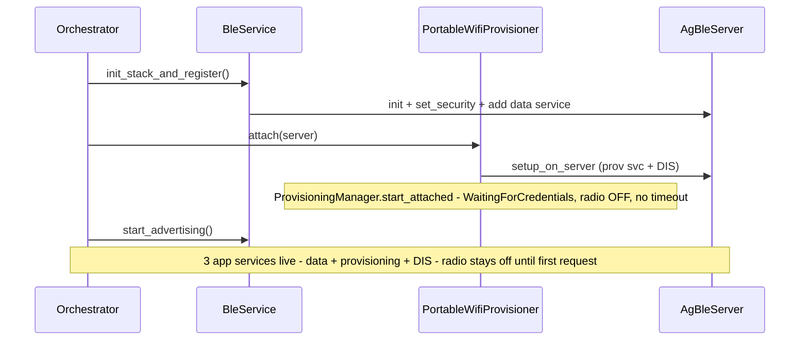
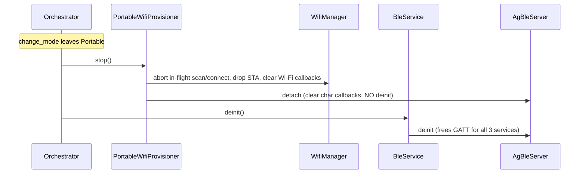
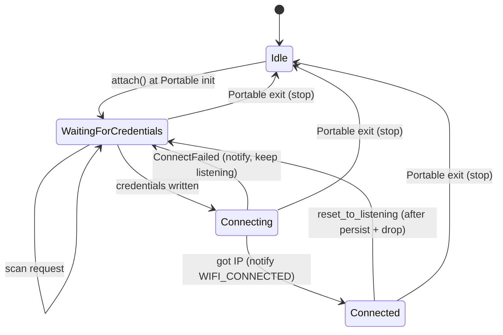
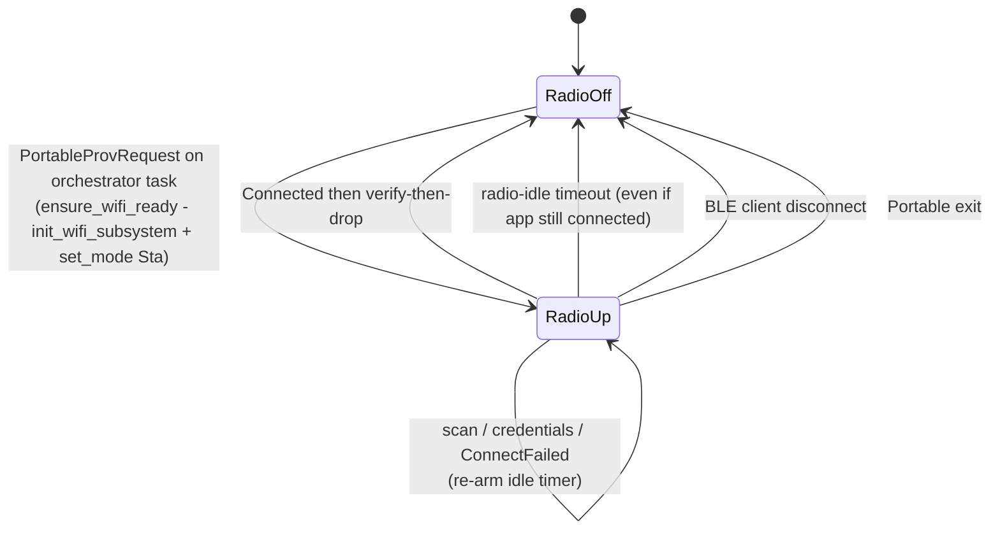
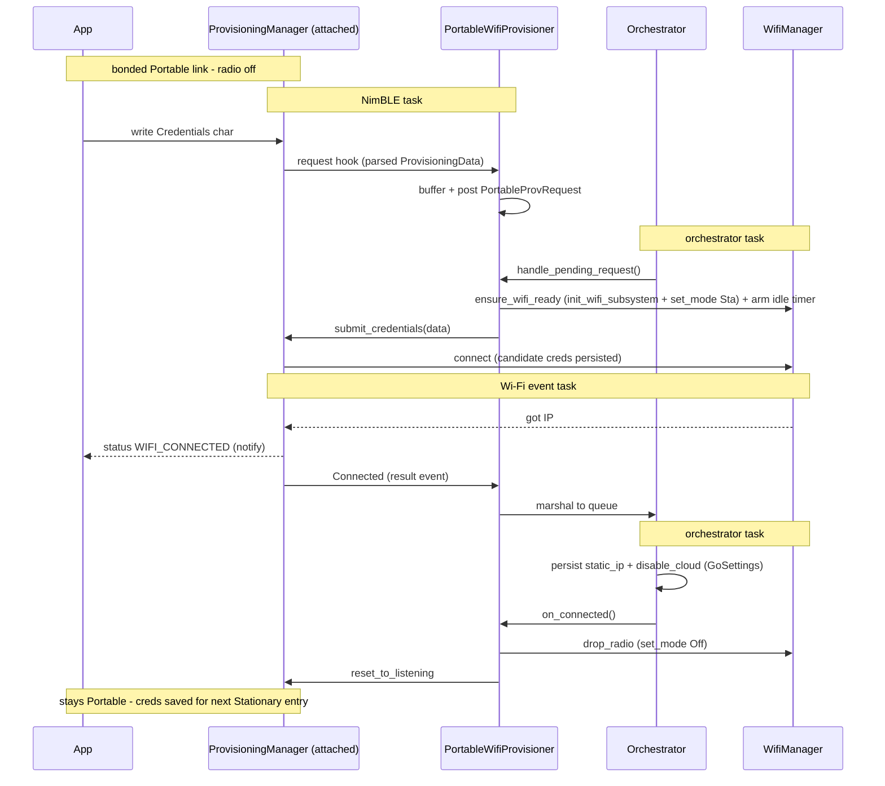

# Portable Wi-Fi Provisioning

The AirGradient Go pairs with the companion app over a bonded BLE link in
Portable mode (`BleService`, service `d1c0c0a0-...`). Wi-Fi provisioning,
however, only exists inside Stationary mode through a separate, mutually
exclusive BLE service (`ProvisioningManager` / `BleTransport`, service
`acbcfea8-...`). The app therefore cannot send Wi-Fi credentials over the
link it already paired with — it would have to switch the device to
Stationary and re-pair against a weaker Just-Works service. This spec adds an
"attached" provisioning path so the existing Wi-Fi provisioning flow (scan +
set credentials + live status) runs over the **already-bonded Portable link**,
with no mode switch and no re-pairing.

## Problem

- The app pairs in **Portable** (service A, bonded + MITM via
  AccessorySetupKit). Wi-Fi provisioning lives in **Stationary** (service B,
  `AgBleAuth::SC` Just Works, no bond).
- The two BLE GATT surfaces are **mutually exclusive**: the orchestrator
  enforces a single owner of the shared `AgBleServer`
  (`init_ble_if_portable()` brings up `BleService` only in Portable;
  `enter_stationary()` hands the server to `ProvisioningManager`). NimBLE has
  `CONFIG_BT_NIMBLE_MAX_CONNECTIONS=1`, and all GATT services must be
  registered before `start_advertising()` — you cannot hot-add a service onto
  a live, advertising, bonded connection.
- Result: the iOS spec's "submit credentials over the Go provisioning
  transport" (Wi-Fi step) is blocked. The app already implements the
  provisioning scan/credentials protocol, so the firmware should expose that
  **same** protocol on the Portable link rather than invent a new one.
- BLE/Wi-Fi coexistence is **not** the blocker — it already works: the
  `BleOnly` transport runs Wi-Fi in `Sta` for scan and STA connect while the
  BLE GATT service is connected.

## Goals

- Run the existing provisioning flow (Wi-Fi scan, credential submit, live
  connect status) over the **bonded Portable BLE link**, reusing the
  provisioning service's two characteristics and their JSON/pagination wire
  protocol verbatim so the shipped app needs no protocol changes.
- Decouple the **Wi-Fi scan + single-shot STA connect** capability from the
  Stationary mode switch so it can run in Portable on demand.
- Keep the device in **Portable** throughout; persist working credentials and
  metadata, then drop the Wi-Fi radio (verify-then-drop) to preserve
  Portable's power profile.
- Make the capability **available on every Portable boot**, not only during
  first-boot onboarding, so users can (re)configure Wi-Fi anytime from the
  app.
- Reuse the provisioning state machine and BLE transport (approach **A1**)
  rather than reimplementing them product-side, to guarantee wire-protocol
  parity with the existing app.

## Non-Goals

- **No change to the standalone Stationary path.** The on-device captive
  portal + BLE service B + on-screen QR provisioning (entered by switching to
  Stationary) stays exactly as-is for app-less users.
- **No permanent mode change on provisioning.** Receiving credentials does
  not switch the device to Stationary. Saved credentials are used the next
  time the device enters Stationary (or auto-switches in future firmware).
- **No on-device provisioning UI.** The app owns all Wi-Fi setup UX; the
  device shows nothing during the flow (the existing pairing passkey screen
  is unaffected). Silent by decision.
- **No account/registration/claim concept in firmware.** Dashboard
  registration remains app- and cloud-side.
- **No always-on Wi-Fi in Portable.** The radio is powered only for the few
  seconds of an active scan/connect and dropped afterward.

## Design

### Approach: A1 (attached provisioning)

The capability we need — BLE provisioning that scans, single-shot connects,
and notifies status, with no AP/portal — reuses the `ProvisioningTransport::BleOnly`
**transport wiring** (GATT registration, JSON parse, scan pagination, status
notifications), but the **lifecycle differs**:

| Aspect | `BleOnly` today | Attached (new) |
|---|---|---|
| BLE server `init()` / `set_security()` | done by `BleTransport::setup()` | **skipped** — `BleService` owns it |
| BLE advertising | started by transport | **skipped** — `BleService` owns it |
| BLE connect/disconnect callbacks | installed by transport | **skipped** — `BleService` owns them (single-owner) |
| GATT service registration | `add_service()` after `init()` | `add_service()` on the **already-initialised** server, before `BleService` calls `start_advertising()` |
| `stop()` server teardown | `ble.deinit()` | **`detach()`** — no deinit; server lives on with `BleService` |
| `POST_CONNECT_HOLD_MS` on stop | 1.5 s hold | **skipped** — no portal |
| Wi-Fi mode at start | `Sta` (radio on immediately) | **off** — radio brought up lazily on first request |
| `Connected` state | terminal until `stop()` | `reset_to_listening()` re-opens after verify-then-drop |
| Inactivity timeout | `overall_timeout_ms` | `0` (disabled); radio bounded by product-side idle timer |
| AP / DNS / HTTP | none | none |

### Component changes (`airgradient-provisioning`)

1. **`BleTransport`** — split `setup()` so GATT registration can target a
   borrowed, already-initialised server:

   ```cpp
   // existing: owns the server (init + security + advertising) — standalone path
   bool setup(AgBleServer &ble, const ProvisioningBleConfig &config);

   // new: register the provisioning service + DIS on an already-init'd
   // server; no init / set_security / advertising; teardown does not deinit.
   bool setup_on_server(AgBleServer &ble, const ProvisioningBleConfig &config);
   ```

   `setup_on_server()` registers the **same two GATT services the standalone
   path already builds** — the AirGradient Provisioning service
   (`acbcfea8-...`, scan + credentials/status chars) **and** the Device
   Information Service (`0x180A`) — so the app's existing provisioning client
   finds the device-info it expects. DIS Model/Serial/Firmware are populated
   from the Go-supplied `ProvisioningBleConfig` (`model_name`, `serial_number`,
   `firmware_version`); DIS Manufacturer (`0x2A29`) is the component's hardcoded
   `"AirGradient"` (`ProvisioningBleConfig::manufacturer_data` is **advertising**
   manufacturer data, _not_ DIS — and attached mode does not own advertising, so
   it is unused here).

   Two further differences from `setup()`, both required so the attached
   transport does not fight `BleService` for the shared server:

   - **No connect/disconnect callbacks.** `setup()` calls
     `set_connect_callback()` / `set_disconnect_callback()` on the server
     (`ble_transport.cpp:257–258`), which are single-owner and already used by
     `BleService` (`go_ble.cpp:238–240`). `setup_on_server()` must **not**
     install them — advertising is `BleService`'s job, and the per-client
     inactivity timeout is disabled in attached mode (see below).
   - **`detach()`, not `teardown()`.** A new `detach()` clears the char write
     callbacks and cancels the scan-pagination timer but **does not** call
     `_ble->deinit()` (which `teardown()` does, `ble_transport.cpp:299`) — the
     server's lifetime belongs to `BleService`.

   Credential parsing, paginated scan notifications, and `send_status()` are
   unchanged.

2. **`ProvisioningManager`** — add an attached start entry that reuses the
   existing state machine (`Idle → WaitingForCredentials → Connecting →
   Connected`), scan, single-shot connect, and status codes, but borrows an
   externally-owned BLE server and never touches AP/DNS/HTTP or advertising:

   ```cpp
   // Attached BLE-only provisioning on a server the caller already owns and
   // advertises. No HttpServer needed. stop()/detach do NOT deinit the server.
   // Registers BLE GATT and installs the WifiManager RESULT callbacks
   // (got_ip / disconnected / scan_complete) but does NOT power the radio
   // and does NOT run scan/connect synchronously from the BLE write callback.
   bool start_attached(WifiManager &wifi, AgBleServer &ble,
                       const ProvisioningConfig &config);

   // Attached request hook. In attached mode, when a scan / credentials write
   // arrives, BleTransport parses it (NimBLE task) and the manager forwards the
   // *parsed* request here instead of acting on it synchronously. The product
   // buffers it and marshals to its own task (see Threading model). Carries a
   // kind (Scan | Credentials) and, for credentials, the parsed ProvisioningData.
   //
   // Invoked OUTSIDE the manager mutex (see Threading model) — it is product
   // code that does queue_send() (can block) and the orchestrator re-enters the
   // manager via request_scan()/submit_credentials() under the lock.
   void set_attached_request_hook(std::function<void(const AttachedRequest&)> hook);

   // Driver entrypoints, called by the product on its task AFTER the radio is
   // ready. These are the existing _trigger_scan / _accept_credentials bodies,
   // now invokable from outside the BLE callback.
   bool request_scan();
   bool submit_credentials(const ProvisioningData &data);

   // Attached verify-then-drop: after the product has handled Connected
   // (persisted creds + dropped the radio), re-open the session so a later
   // scan/credentials write is accepted again. Connected -> WaitingForCredentials.
   void reset_to_listening();
   ```

   A new `ProvisioningTransport::BleAttached` value (appended; existing values
   are locked) selects this path. It reuses `BleOnly`'s transport wiring
   (`BleTransport::setup_on_server()`, scan pagination, status notifications,
   and the same scan/connect bodies), but the **lifecycle differs** from
   `start()` in six ways the reviews surfaced:

   - **Result callbacks at start, radio off.** `start()` calls
     `wifi.set_mode(Sta)` during start (`provisioning_manager.cpp:211`), and
     `EspWifiHal::set_mode(Sta)` calls `esp_wifi_start()`
     (`esp_wifi_hal.cpp:186,189`) — the radio powers on immediately.
     `start_attached()` instead sets `_wifi` and installs the **result
     callbacks** (`set_on_got_ip` / `set_on_disconnected` /
     `set_on_scan_complete`, normally installed in `start()` at `:191–196`) —
     free `std::function` assignments, no radio — but does **not** call
     `set_mode(Sta)`. It parks in `WaitingForCredentials` with the radio
     **off**.
   - **Request marshaling instead of synchronous work.** Today `_trigger_scan()`
     / `_accept_credentials()` run on the NimBLE write callback and call
     `_wifi->start_scan()` / `connect()` directly (`:547`, `:531`). In attached
     mode those BLE write paths instead invoke the **attached request hook**
     with the parsed request (no Wi-Fi work on the NimBLE task — see _Threading
     model_). The product powers the radio on its own task and then calls
     `request_scan()` / `submit_credentials(data)`.
   - **`Connected → WaitingForCredentials` reset.** Today `Connected` is
     terminal until `stop()` — `_accept_credentials` / `_trigger_scan` reject
     unless `WaitingForCredentials` (`:496`, `:540`), and `_on_sta_disconnected`
     only transitions out of `Connecting` (`:384`). So after verify-then-drop
     the manager would be stuck. `reset_to_listening()` provides the explicit
     transition back so the user can re-provision in the same session.
   - **No portal hold on teardown.** `stop()` blocks `POST_CONNECT_HOLD_MS`
     (1.5 s) when leaving `Connected` (`:283–287`) so a captive-portal browser
     can poll once. Attached mode has no portal — skip the hold.
   - **No server deinit.** Attached teardown uses `BleTransport::detach()`
     (above), never `_ble->deinit()`.
   - **STA-only coexistence.** Attached mode keeps Wi-Fi in `Sta` only (never
     `Ap`/`ApSta`) while BLE is up — the only coexistence combination that is
     safe on this target.

   Attached mode runs with `overall_timeout_ms = 0` — the component's
   per-client inactivity timeout pauses while a BLE client is connected
   (`:451`), and the app is always connected on the Portable link, so it would
   never fire. The radio is instead bounded by a product-side idle timeout (see
   _Radio lifecycle_).

The existing `BleOnly` / `WifiOnly` / `Both` transports and the reference
product are untouched — all changes are **additive** (`setup_on_server`,
`detach`, `start_attached`, `reset_to_listening`, `BleAttached`); no existing
characteristic property, security flag, or contract is modified (see
_Security_).

### Product changes (Go)

1. **`BleService` co-registration.** In `BleService::init()`, after the AGo
   data service is started and **before** `start_advertising()`, register the
   provisioning service **and DIS** on the same `_server` via the attached
   path. This makes the live Portable link expose **three** application GATT
   services (plus the NimBLE-default GAP `0x1800` / GATT `0x1801`):

   | Service | UUID | Characteristics |
   |---|---|---|
   | AGo data (existing) | `d1c0c0a0-...` | Measures, Status, Config, History |
   | AirGradient Provisioning | `acbcfea8-...` | Credentials/Status `703fa252-...`, Wi-Fi Scan `467a080f-...` |
   | Device Information | `0x180A` | Model `0x2A24`, Serial `0x2A25`, Firmware Rev `0x2A26`, Manufacturer `0x2A29` |

   The provisioning + DIS characteristics keep their existing `READ_ENC` /
   `WRITE_ENC` requirements, which on the Portable link are satisfied by the
   bonded MITM connection (see _Security_ for why these stay `ENC`, not
   `AUTHEN`). The provisioning UUID is **not** added to the advertised payload
   (the app is already connected; nothing else needs to discover it).
   `BleService` populates the `ProvisioningBleConfig` Model (`P-1PSG`) / Serial /
   Firmware fields from the same sources used elsewhere in the product.

   **Required structural change — two-phase `BleService::init()`.** Because all
   GATT services must be registered before `start_advertising()`, the current
   single `init()` (which registers the data service _and_ advertises) must be
   split so the provisioner can slot its services in between:

   1. `init_stack_and_register()` — `_server->init()`, `set_security()`,
      register the AGo data service + chars, `svc->start()`.
   2. `attach_extra_service(...)` hook — the provisioner calls
      `BleTransport::setup_on_server()` here (registers prov + DIS).
   3. `start_advertising()` — called last by `init_ble_if_portable()` after the
      provisioner has attached.

   The standalone Stationary path and any non-Portable caller still get the
   full sequence; only Portable inserts step 2. Note `adv_name` is currently a
   local in `init()` (`go_ble.cpp:160–161`) consumed by `set_advertising_name()`
   (`:253`); the split must store it as a member (or recompute it) so phase 3
   can still set the advertised name.

2. **`PortableWifiProvisioner` (mechanics only).** A GoApp-constructed service
   (see _Ownership and construction_) holding the **Portable**
   `ProvisioningManager`. It owns mechanics; **persistence and verify/drop
   sequencing stay in the orchestrator** (which owns `GoSettings` /
   `ConfigStore` and already runs `on_provisioning_state_changed`). The split:

   **Provisioner owns (the actual Wi-Fi/manager work):**
   - The **attached request hook** (set via `manager.set_attached_request_hook()`):
     runs on the NimBLE task, copies the parsed request (`Scan` |
     `Credentials` + `ProvisioningData`) into a pending buffer under a mutex,
     posts a `PortableProvRequest` event, returns. No Wi-Fi work here.
   - `handle_pending_request()` (orchestrator task): take the pending request →
     `ensure_wifi_ready()` → arm/re-arm idle timer → call `manager.request_scan()`
     or `manager.submit_credentials(data)`. On `ensure_wifi_ready()` failure,
     reject (empty scan result / `WIFI_CONNECT_FAILED`).
   - `ensure_wifi_ready()`: `board.init_wifi_subsystem()` (idempotent, lazy on
     first request) + `wifi.set_mode(Sta)` — **STA only**, never `Ap`/`ApSta`.
   - `drop_radio()`: `set_mode(Off)`, cancel the idle timer (the manager keeps
     its result callbacks installed; they simply do not fire while the radio is
     off).
   - `on_connected()`: `drop_radio()` then `manager.reset_to_listening()` (the
     verify-then-drop mechanics; the manager is the provisioner's, not the
     orchestrator's).
   - The **radio-idle timer** (`next_deadline_ms()`/`tick()`), dropping the
     radio after inactivity even while the app stays connected.
   - `on_ble_disconnected()` → `drop_radio()` (wired from the orchestrator,
     since the transport's own disconnect callback is not installed).
   - `is_radio_active()` — true while the radio is up (between bring-up and
     drop). Trivially observable since the provisioner powers/drops the radio.
     Used to gate History export — see _Notification contention_.
   - Marshaling the manager's `ProvisioningEventInfo` result callbacks (Wi-Fi
     task) onto the central event queue.

   **Orchestrator owns only routing + its own settings data:**
   - `PortableProvRequest` event → `provisioner.handle_pending_request()`.
   - On `Connected`: persist `static_ip` / `disable_cloud` into its `GoSettings`
     (same path as Stationary; SSID/password were already written to Wi-Fi NVS
     by `esp_wifi_set_config()` **at connect time** — `WifiStaConfig::persist`
     defaults to `true`, `wifi_types.h:136` — i.e. _candidate_ creds persisted
     before verification, see _Credential persistence_) → then call
     `provisioner.on_connected()`. The orchestrator never reaches into the
     manager directly.
   - On `ConnectFailed`: nothing to persist; the manager stays
     `WaitingForCredentials` and the radio stays up (idle timer re-armed) so the
     app can retry.
   - `BleDisconnected` → `provisioner.on_ble_disconnected()`; gate History
     export on `provisioner.is_radio_active()`.

### Ownership and construction

`PortableWifiProvisioner` follows the existing service pattern: **GoApp
constructs it and the orchestrator borrows it** via the `Services` struct
(exactly like `BleService` / `WifiService`). The label "orchestrator-owned"
from earlier drafts is imprecise — the orchestrator owns the **policy**, the
service owns the **mechanics**.

| Concern | Owner | Notes |
|---|---|---|
| `ProvisioningManager` (Portable, its own instance) | `PortableWifiProvisioner` | Separate from WifiService's instance (Shape Y) |
| `WifiManager`, `AgBleServer` | borrowed (`board.*()`) | Shared singletons; mode-exclusive use |
| BLE callback marshaling → central queue | `PortableWifiProvisioner` | Mirrors WifiService's `_post_provisioning_event` (callbacks fire on NimBLE/Wi-Fi tasks) |
| Trigger gating (`_mode == Portable`), persistence (`GoSettings` + `ConfigStore`), verify-then-drop sequencing, teardown ordering | Orchestrator | All this state lives only in the orchestrator |

Deps the provisioner borrows: `WifiManager` and `AgBleServer` (the same
instances `BleService` uses). It does **not** borrow `HttpServer` (no
AP/portal in attached mode).

### Concurrency invariants (two `ProvisioningManager` instances)

Shape Y means two managers exist (WifiService's for Stationary, the
provisioner's for Portable). They are safe **only** under these invariants,
which the orchestrator's `change_mode()` already structures (teardown-before-
bring-up):

- **Single started manager.** At most one `ProvisioningManager` is in a
  started state at any instant. Assert/test this; the two never run
  concurrently because Portable and Stationary never overlap.
- **No shared runtime state.** The instances share nothing at runtime. The
  only cross-mode seam is **persisted** state: Wi-Fi credentials in ESP-IDF
  NVS (written in Portable, read in Stationary) plus `static_ip` /
  `disable_cloud` in `GoSettings`.
- **Single-writer of the shared radios.** One `WifiManager`, one
  `AgBleServer`. Callback ownership is handed off cleanly: a manager's
  `start()` installs Wi-Fi callbacks, `stop()` clears them — so the outgoing
  manager must be fully stopped before the incoming one starts.
- **`init_wifi_subsystem()` is idempotent** and never torn down on mode
  change; both managers rely on it.

### Threading model

Attached provisioning touches three task contexts. The rule: **no Wi-Fi work on
the NimBLE task**, because `init_wifi_subsystem()` / `set_mode(Sta)` /
`start_scan()` / `connect()` are blocking and the BLE host task must not block
(stalls the link, risks supervision timeouts), and the manager mutex must not be
held across them.

| Task | Attached-mode work |
|---|---|
| **NimBLE host** | `BleTransport` parses the scan/credentials write and invokes the manager's **attached request hook**; the provisioner's hook copies the parsed request into a pending buffer + posts `PortableProvRequest`, then returns. Nothing else. |
| **Orchestrator** | Drains `PortableProvRequest` → `provisioner.handle_pending_request()` → `ensure_wifi_ready()` (lazy `init_wifi_subsystem` + `set_mode(Sta)`) → `manager.request_scan()` / `submit_credentials()`. Also persists settings and drives `tick()`. All blocking Wi-Fi work lives here. |
| **Wi-Fi event** | Result callbacks (`got_ip` / `disconnected` / `scan_complete`) update the manager and emit `ProvisioningEventInfo`; the provisioner marshals those onto the central queue (unchanged from the standalone pattern). |

This mirrors the existing `BleService` config/history-write marshaling
(`go_ble.cpp:358–366`: copy under mutex → `queue_send` → return).

**Locking contract.** The attached request hook is invoked **outside
`ProvisioningManager`'s `_mutex`**, consistent with the manager's existing
callback discipline — `_emit()` copies the callback under the lock then unlocks
before calling it (`provisioning_manager.cpp:481–489`). The manager must not
hold its lock across the hook because the hook is product code that runs
`queue_send()` (can block on a full queue, which would also stall the Wi-Fi
event task — it takes the same `_mutex` in `_on_scan_results`/`_on_sta_connected`),
and the orchestrator later re-enters the manager via `request_scan()` /
`submit_credentials()`, which take the lock.

**Init vs radio — what "on-demand" actually buys.** These are two separate
costs:

- `init_wifi_subsystem()` → `EspWifiHal::init()` (`nvs` / `netif` /
  event-loop / `esp_wifi_init`) only allocates the Wi-Fi driver **heap**; it
  does **not** power the RF or draw meaningful current. It is idempotent and has
  **no deinit/teardown path** (the board contract, and the standalone Stationary
  flow, leave it initialised for the rest of the runtime).
- `set_mode(Sta)` → `esp_wifi_start()` is what powers the 2.4 GHz radio (tens of
  mA) and time-slices it with BLE (coexistence). `set_mode(Off)` →
  `esp_wifi_stop()` turns it back off.

So **on-demand radio buys power + BLE-link quality, not memory**: dropping the
radio (`set_mode(Off)`) between provisioning operations saves the radio current
and frees the Portable BLE stream from coexistence interference except during
the brief scan/connect. Memory-wise, the only benefit is **lazy init** —
`init_wifi_subsystem()` runs only on a real first provisioning request, so a
Portable session that never provisions (and never entered Stationary) pays no
Wi-Fi heap at all. Once it has run, the subsystem stays initialised; Portable
exit and the idle/verify/disconnect drops only call `set_mode(Off)` — there is
**no** Wi-Fi-subsystem free. (On-demand radio does not reduce the _peak_ heap
during an active session — stack + BLE + sensors coexist then regardless; that
peak is the #1 risk in _Open Questions_.)

Note: `ensure_wifi_ready()` brings Wi-Fi up in **`Sta` mode only** while BLE is
active — the one coexistence combination that is safe on this target (never
`Ap`/`ApSta`).

### Security

The provisioning characteristics keep their existing `READ_ENC` / `WRITE_ENC`
properties. They are **not** raised to `READ_AUTHEN` / `WRITE_AUTHEN` (which the
Portable data chars use), for two reasons:

- **Raising them would break other products.** The properties live in the
  shared `airgradient-provisioning` component. Its other consumers pair with
  **no MITM** — the reference product uses `AgBleAuth::BOND | SC` (Just Works +
  bond) and AGo's standalone Stationary path uses `SC` only. Just Works
  produces an **encrypted but not authenticated** link. `WRITE_ENC` accepts it;
  `WRITE_AUTHEN` would **reject every credential write** on those products,
  breaking their provisioning entirely.
- **`ENC` is already effectively `AUTHEN` on the Portable link.** The Portable
  server is configured `DISPLAY_ONLY + BOND | MITM` (`go_ble.cpp:172`), so a
  link can only become encrypted after a passkey-authenticated bond. On that
  link, "encrypted" implies "MITM-authenticated" — so `ENC` already restricts
  provisioning to authenticated bonded clients. No characteristic change is
  needed to satisfy the "only bonded clients may provision" intent.

Caveat (dev only): with `CONFIG_AGO_BLE_SECURITY_ENABLED=n`, an `ENC`
characteristic on an unencrypted link is a non-shippable development
configuration — the same class of caveat the data chars already carry when
their `AUTHEN` flags are dropped in dev builds.

### Credential persistence

Credentials are **candidate-persisted before verification**, matching today's
behavior: `_accept_credentials()` calls `WifiManager::connect()` with
`WifiStaConfig::persist == true` (default), so ESP-IDF writes SSID/password to
Wi-Fi NVS via `esp_wifi_set_config()` at the connect attempt, _before_ the
connect succeeds. Implications:

- A failed connect leaves the (bad) candidate creds in NVS. This is benign: the
  app re-prompts and the next write overwrites them, and stale bad creds are
  harmless because the Stationary saved-credentials path falls through to
  on-device provisioning when they fail.
- This matches the existing standalone Stationary provisioning exactly, so it
  is not a regression and needs no new API for MVP.
- A RAM-first trial + commit-on-success path is possible future work but is
  **out of scope** here.

### Lifecycle: construct and Portable entry

On entering Portable, `init_ble_if_portable()` drives the two-phase init so
both services land before advertising, and the provisioner parks idle (no
radio):



### Lifecycle: Portable exit teardown

Order is mandatory — the provisioner must release the server **before**
`BleService` deinitialises it:



### Mode-change interaction

`change_mode()` (orchestrator, lines 895–927) already does teardown-before-
bring-up. Shape Y adds exactly two hooks:

- **Leaving Portable** (branch `old == Portable`): call
  `provisioner.stop()` **before** `ble_service.deinit()`.
- **Entering Portable** (branch `new == Portable`): `init_ble_if_portable()`
  runs the two-phase init incl. `provisioner.attach(server)` before
  advertising.

Because verify-then-drop normally leaves Portable with Wi-Fi off and no live
session, leaving Portable is usually a no-op `stop()` + `ble_service.deinit()`.
The meaningful direction is **Portable → Stationary**, where the creds saved
during Portable provisioning are consumed by the existing `enter_stationary()`
logic:

| Wi-Fi state when switching to Stationary | Outcome |
|---|---|
| **Configured + connectable** (app provisioned, AP in range) | `has_saved_credentials()` → `connect_with_saved_credentials(static_ip)` → online → cloud POST/FETCH (unless `disable_cloud`). The payoff path. |
| **Not configured** (no creds) | Fallback AP attempt → fails → standalone Stationary provisioning page (service B + portal + QR). Unchanged. |
| **Configured but cannot connect** (AP gone / moved / pw changed) | Saved-cred connect fails within the connect window → before-online disconnect policy → standalone provisioning page. |
| **Mid-provisioning** (app scanning/connecting when user changes mode on device) | `provisioner.stop()` aborts the in-flight session and drops the radio; `ble_service.deinit()` disconnects the app; `enter_stationary()` starts fresh. Creds already written to NVS persist and feed the saved-cred path; otherwise it falls to the provisioning page. |

Other directions:

- **Portable → Offline:** `provisioner.stop()` + `ble_service.deinit()`;
  Wi-Fi stays off; creds remain in NVS.
- **Stationary → Portable:** existing `cloud.stop()` + `wifi.shutdown()`
  (stops WifiService's manager if provisioning, drops STA, Wi-Fi off) →
  `init_ble_if_portable()` re-attaches the Portable provisioner. Creds remain.

`change_mode()` also already calls `mark_onboarding_done()` (line 882), so a
mode change counts as onboarding engagement — no extra wiring needed for the
first-boot flag.

### Provisioner state machine

The Portable session maps onto the component's existing states plus the
product-side verify-then-drop:

This is the **manager** state (`ProvisioningManager`). The **radio** state
(off/up) is orthogonal and product-driven — see _Radio lifecycle_.



The component's per-client inactivity timeout is disabled
(`overall_timeout_ms = 0`): it pauses while a BLE client is connected, and the
app is always connected on the bonded Portable link, so it could never fire.
The BLE provisioning service lives for the whole Portable session and is torn
down by mode exit, not by a timer. The **radio** is bounded separately below.

### Availability and power

- **Capability: always available, every Portable boot.** The provisioning
  GATT characteristics are idle until the app writes a scan/credentials
  request, so the cost of always registering them is negligible. Users can
  (re)configure Wi-Fi anytime, not just at first boot.
- **Radio: on-demand only.** The Wi-Fi radio is off by default in Portable
  (`set_mode(Off)` → `esp_wifi_stop()`), powered only across an active
  scan/connect (`set_mode(Sta)` → `esp_wifi_start()`), and dropped on verify,
  idle, BLE disconnect, or mode exit. This saves the radio current and frees the
  BLE stream from coexistence; the Wi-Fi **stack stays initialised** (no deinit
  path — see _Threading model_). No standing Wi-Fi power cost.

### Radio lifecycle

The Wi-Fi radio is **request-driven**, owned by `PortableWifiProvisioner` and
independent of the BLE connection:



Drop on `RadioUp -> RadioOff` = `provisioner.drop_radio()` (`set_mode(Off)`,
cancel idle timer). The manager keeps its result callbacks installed (they do
not fire while the radio is off). The BLE provisioning service stays live
throughout; only the radio toggles. From `RadioOff`, the next request lazily
brings it back up via `ensure_wifi_ready()` on the orchestrator task (see
_Threading model_).

**BLE disconnect wiring.** Because `setup_on_server()` deliberately does not
install the transport's connect/disconnect callbacks (single-owner — they
belong to `BleService`), the provisioner learns of disconnect from the
orchestrator: `Orchestrator::on_ble_disconnected()` (`go_orchestrator.cpp:1098`,
already dispatched from the `BleDisconnected` event at `:448`) calls
`provisioner.on_ble_disconnected()` → `drop_radio()`.

**Radio-idle timeout.** A product-side timer (not the component timeout) drops
the radio after inactivity **even while the app stays connected** — this is the
key case the component timeout cannot cover, since an app may bring Wi-Fi up
then background/abandon the flow. Default
`CONFIG_GO_PORTABLE_PROV_RADIO_IDLE_MS = 90000` (90 s), adjustable via Kconfig.
The timer is armed/re-armed on every scan/credentials request and cancelled
when the radio drops. It plugs into the orchestrator's existing
`next_deadline_ms()` / `tick()` timer mechanism (same pattern as `WifiService`).

**No-client and disconnect edge cases.** Because the radio is request-driven,
all of these converge on the same safe resting state — **radio off, BLE
advertising, manager `WaitingForCredentials`**:

| Situation | Behavior |
|---|---|
| No client ever connects (long idle in Portable) | No request can arrive, so the radio is never brought up and the idle timer is never armed. Zero provisioning drain. |
| Client connected but idle | Radio stays off until a request; if a request brought it up, the radio-idle timeout drops it after 90 s. |
| Disconnect while radio off | No-op. |
| Disconnect mid-scan | Drop radio; a late scan-complete notifying a gone char is harmless (`notify()` returns false). |
| Disconnect mid-connect | Drop radio (aborts the in-flight STA attempt → `WaitingForCredentials`). Candidate creds already in NVS persist and are verified on a later request or the next Stationary entry. |

Note: the broader fact that **Portable mode never sleeps and advertises
indefinitely** regardless of client presence is pre-existing product behavior,
not changed by this feature (see _Open Questions_).

### Flow

Credentials path (the scan path is the same shape — request hook → marshal →
`ensure_wifi_ready` → `request_scan()`):



## Implementation Plan

1. **`components/airgradient-provisioning/internal/ble_transport.{h,cpp}`** —
   add `setup_on_server()` (register prov + DIS on an already-init'd server; no
   init/security/advertising; **no connect/disconnect callbacks**) and
   `detach()` (clear char callbacks + cancel page timer, **no `deinit`**). DIS
   Manufacturer stays the hardcoded `"AirGradient"`. Host tests for the attached
   registration + detach paths.
2. **`components/airgradient-provisioning/services/provisioning_manager.{h,cpp}`**
   and **`types/provisioning_types.h`** — add `ProvisioningTransport::BleAttached`
   (appended) and the `AttachedRequest` type; `start_attached()` (**no `set_mode`
   at start, but install the result callbacks** — `got_ip`/`disconnected`/`scan_complete`);
   `set_attached_request_hook()` (attached BLE writes forward the parsed request
   instead of acting synchronously; **invoked outside `_mutex`** per the locking
   contract); the orchestrator-task driver entrypoints
   `request_scan()` / `submit_credentials(data)`; and `reset_to_listening()`
   (`Connected → WaitingForCredentials`). Attached `stop()` skips the
   `POST_CONNECT_HOLD_MS` hold and uses `detach()` (no server deinit); keep
   characteristic properties `ENC` (do **not** change to `AUTHEN`); STA mode
   only. Host tests for the attached state machine incl. request-hook
   forwarding, driver entrypoints, reset-to-listening, and re-provision.
3. **`products/go/main/go_ble.{h,cpp}`** — split `init()` into
   `init_stack_and_register()` + `attach_extra_service()` hook +
   `start_advertising()` (two-phase init, see _Product changes_); populate DIS
   Model/Serial/Firmware from the product sources. The data-service chars
   stay owned by `BleService`; the provisioning chars are owned by the attached
   transport.
4. **`products/go/main/` new `PortableWifiProvisioner`** + a `PortableProvRequest`
   event in `go_events.h` — GoApp-constructed service holding the Portable
   `ProvisioningManager`. Sets the manager's request hook (buffer parsed
   request, post `PortableProvRequest`, on the NimBLE task);
   `handle_pending_request()`
   (orchestrator task: `ensure_wifi_ready()` + arm idle timer + call
   `request_scan()`/`submit_credentials()`); `ensure_wifi_ready()` (lazy
   `init_wifi_subsystem` + `set_mode(Sta)`, STA only); `drop_radio()`,
   `on_connected()` (drop + `reset_to_listening`), `on_ble_disconnected()`,
   `is_radio_active()`, the **radio-idle timer** (`next_deadline_ms()`/`tick()`),
   `attach()`/`stop()`, and result-event marshaling. Host-tested with stubbed
   `WifiManager` / `ProvisioningManager`.
5. **`products/go/main/Kconfig.projbuild`** — add
   `CONFIG_GO_PORTABLE_PROV_RADIO_IDLE_MS` (default `90000`).
6. **`products/go/main/go_orchestrator.cpp`** — borrow the provisioner via
   `Services`; in `change_mode()` add `provisioner.stop()` to the leaving-
   Portable branch (before `ble_service.deinit()`) and `provisioner.attach()`
   to the two-phase `init_ble_if_portable()`; drive the provisioner's
   `next_deadline_ms()`/`tick()` from the existing timer loop. Route events
   only: `PortableProvRequest` → `provisioner.handle_pending_request()`;
   provisioning `Connected` → persist `static_ip`/`disable_cloud` (own
   `GoSettings`) → `provisioner.on_connected()`; `BleDisconnected` →
   `provisioner.on_ble_disconnected()`; gate History export on
   `provisioner.is_radio_active()`. The orchestrator never calls the manager
   directly. No Wi-Fi bring-up until a request arrives.
7. **Docs** — update
   [`docs/ble_service.md`](../docs/ble_service.md),
   [`docs/wifi_service.md`](../docs/wifi_service.md),
   [`../../../components/airgradient-provisioning/README.md`](../../../components/airgradient-provisioning/README.md),
   and [`ARCHITECTURE.md`](../ARCHITECTURE.md); follow
   [`docs/STYLE.md`](../../../docs/STYLE.md).

## Testing Strategy

Host tests under `tests/`:

- **`BleTransport::setup_on_server()` / `detach()`** — registers prov + DIS on
  a mock already-init'd server **without** touching connect/disconnect
  callbacks; `detach()` clears char callbacks and the page timer without
  `deinit`.
- **`ProvisioningManager::start_attached()`** — `set_mode` is **not** called at
  start but the result callbacks are installed; an attached scan/credentials
  write invokes the **request hook** (not `_wifi`) — assert no `WifiManager`
  call happens on that path; `request_scan()`/`submit_credentials()` drive the
  scan/connect when called; state-machine transitions (scan → credentials →
  connect success/fail/retry), `reset_to_listening()` re-opens after
  `Connected`, attached `stop()` skips the hold and does not deinit the server,
  no AP/DNS/HTTP touched.
- **`PortableWifiProvisioner`** — request hook buffers + posts
  `PortableProvRequest`; `handle_pending_request()` calls `ensure_wifi_ready()`
  (STA only) then the manager driver; failed `ensure_wifi_ready()` rejects;
  `drop_radio()` on radio-idle timeout (while a client stays connected), on
  `on_ble_disconnected()`, and via `on_connected()`; `is_radio_active()` true
  between bring-up and drop.
- **Orchestrator** — provisioning service co-registered/torn down across
  Portable enter/leave; no Wi-Fi brought up before a request;
  `PortableProvRequest` routes to `handle_pending_request()`; on `Connected`
  persists `static_ip`/`disable_cloud` then calls `provisioner.on_connected()`
  (no direct manager call); `on_ble_disconnected()` forwards to the provisioner;
  History export rejected **only while `is_radio_active()`** (not while parked);
  saved creds feed a later Stationary `connect_with_saved_credentials()`.

Verification commands (run after exporting ESP-IDF in the same shell):

```sh
idf.py -C products/go build
cmake --build tests/build
ctest --test-dir tests/build --output-on-failure
```

## Open Questions

- **Heap / coexistence headroom (primary risk).** Bringing Wi-Fi up while the
  full Portable BLE data service + sensors + GPS run is a new radio-state
  combination — the proven coexistence ran the provisioning transport
  _instead of_ the data service, not alongside it. Provisioning notes
  ~28–30 KB BLE plus per-cycle heap fragmentation. Must validate free /
  largest-DMA-block headroom on target before relying on this; if marginal,
  consider deferring sensor/GPS activity during an active provisioning
  session.
- **BLE link stability during scan.** 2.4 GHz time-slicing may add latency on
  the BLE link during the scan dwell; confirm no disconnects on hardware.
- **iOS GATT cache / Service Changed (upgrade-path risk).** Adding the
  provisioning + DIS services changes the GATT layout. New devices discover all
  three services on first bond — fine. Devices **already bonded before this
  firmware** have a cached GATT without the provisioning service; iOS will not
  see it unless a Service Changed (`0x1801`) indication invalidates the cache.
  Verify NimBLE's Service Changed indication is enabled and fires on the layout
  change; otherwise document re-pair as the mitigation for upgraded units.
- **Notification contention (decided policy).** Portable Measures/Status notifies
  and the History export (a blocking retry loop) now coexist with provisioning
  scan/status notifies on one link. MVP policy: provisioning notifies are
  best-effort, and **History export is rejected only while the provisioning
  radio is active** — i.e. `provisioner.is_radio_active()` (radio up between
  lazy bring-up and drop), **not** for the whole Portable session (the attached
  manager is parked `WaitingForCredentials` the entire time, so gating on
  session existence would reject History export always in Portable). The radio
  is up only during active provisioning (bounded by verify-then-drop / the 90 s
  idle timeout) — exactly when provisioning BLE traffic may occur — and the
  provisioner already owns this flag, so no scan-pagination/connect
  introspection is needed. When the radio is off — the common case — History
  export proceeds normally. Re-validate once both run together on hardware.

## Out of Scope

- **Portable idle power policy.** Portable mode never sleeps and advertises
  indefinitely regardless of client presence (pre-existing behavior, unchanged
  by this feature). A "Portable inactivity → Offline/sleep" policy is possible
  future work and is **out of scope** for this spec.
- **RAM-first credential trial.** A trial-before-persist path (vs the current
  candidate-persist) is possible future work; see _Credential persistence_.
