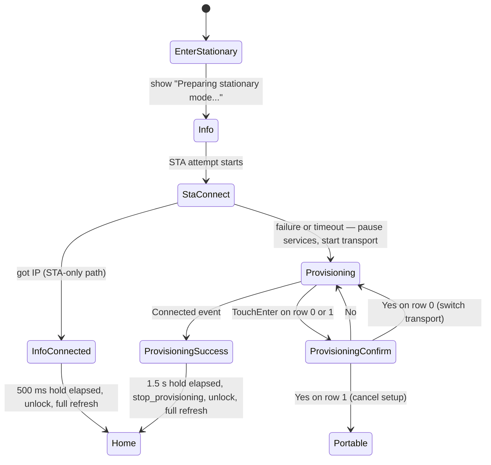
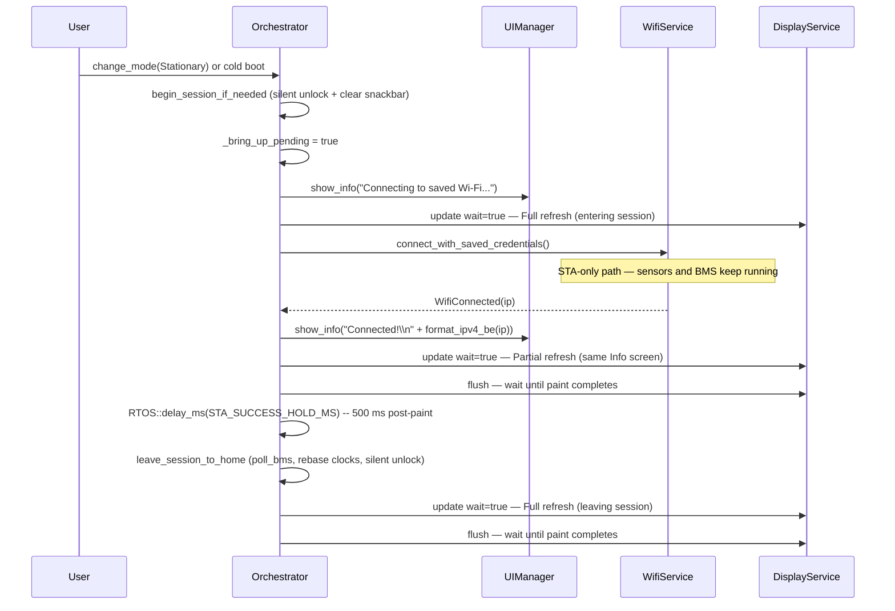
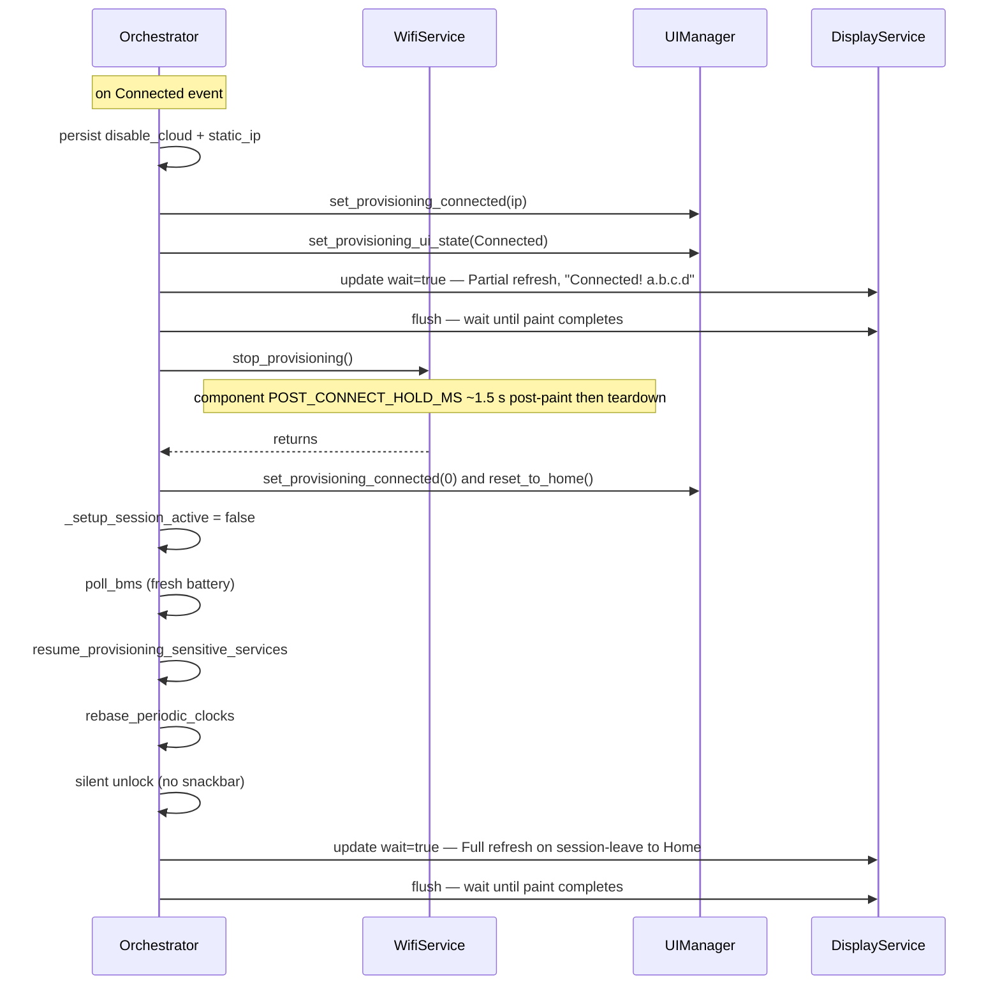
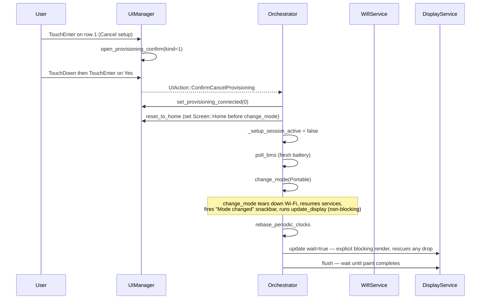

# Stationary Provisioning UX Polish — Implementation Spec

> **This is a spec.** It describes how a feature **will be built**, not what
> currently exists. Once the feature ships, the corresponding doc under
> `docs/` (or the relevant component README) becomes the source of truth and
> this file is typically deleted. See [`docs/STYLE.md`](../../../docs/STYLE.md)
> → "Doc Lifecycle".

Polish the on-device Stationary setup experience layered on top of
[`stationary_networking.md`](stationary_networking.md). The underlying
networking mechanics (saved-credential connect, factory fallback, transport
switching, disconnect policy) stay as-is. This spec adds a generic
single-text `Screen::Info` page used to narrate the Stationary bring-up
phase, rebuilds the Provisioning screen layout, adds a Yes/No confirmation
guard for both on-screen actions, suppresses the lock toggle and auto-lock
for the duration of the setup session, surfaces success on the page itself,
hides the status bar, narrows refresh-mode use to partial within the
session, pauses BMS polling alongside the existing sensor pause, and
rebases the periodic clocks on resume.

## Problem

The provisioning lifecycle implemented under [`stationary_networking.md`](stationary_networking.md)
is mechanically correct but has several UX rough edges observed on hardware:

- The current Provisioning screen mixes a status bar (battery, BLE, Wi-Fi
  and GPS icons) with three action rows (`BLE`, `Wi-Fi`, `Abort`). The
  status-bar icons are misleading mid-setup, and any of the three rows can
  be selected and triggered with a single Touch Enter — there is no
  confirmation guard, so an accidental press immediately switches transport
  or aborts the whole flow.
- A short press of the power button while on the Provisioning screen locks
  the device, hiding the instructions the user is following on their phone.
  Auto-lock can fire mid-setup with the same effect.
- Successful provisioning currently fires the generic `Wi-Fi connected`
  snackbar on top of Home. Users do not see the negotiated IP, and the
  transition from setup to Home feels abrupt — there is no on-page
  acknowledgement that credentials were accepted.
- Battery monitor polling (BMS full poll at 60 s, BMS status poll at 5 s)
  and the snackbar refresh timer keep running during provisioning. They
  serve no purpose while the page is dedicated to setup and contribute
  needless background work and partial-refresh churn.
- After provisioning ends (success or cancel) the orchestrator returns to
  Home with stale battery state and the next BMS / measurement deadlines
  may trigger immediately, replaying every poll that was skipped during
  the setup session.
- The display service treats every transition into and out of the
  Provisioning screen with the same Partial / Fast / Full logic it uses
  for the home dashboard. Mid-setup status changes (`Waiting for app...`
  → `Connecting...` → `Connected!`) need only a body partial refresh, but
  entering and leaving the page should always do a full refresh so no
  ghosting from prior content remains on the e-paper.
- When the user switches to Stationary (or cold-boots into Stationary),
  the saved-credentials STA attempt can take up to 30 s and the
  factory-default fallback can take up to 15 s before the Provisioning
  page appears. The screen stays on Home with stale data and no
  feedback during that window — users have no indication the device is
  doing anything until either a `Wi-Fi connected` snackbar fires or the
  Provisioning page suddenly takes over.
- Cold boot defaults to `LockState::Locked`. The current
  `Orchestrator::on_input()` drops all touch input while locked, and
  this spec's planned power-short-press suppression would also block
  the unlock path on session screens. Without an explicit fix, a
  cold-boot Stationary user that lands on the Provisioning page is
  locked out — touch is ignored, power short-press is suppressed, and
  the page is unusable.

[`stationary_networking.md`](stationary_networking.md) covered the back-end
wiring. This spec covers the front-of-house experience and the periodic
housekeeping that should pause with it.

## Goals

- A new generic `Screen::Info` page in the display layer that renders a
  single centered text block with auto word-wrap. The page has no status
  bar, no snackbar, no interactive elements. It is designed so the
  orchestrator (and future callers) can show a transient "device is
  doing X" message without authoring a new screen each time.
- Use `Screen::Info` to narrate the Stationary bring-up phase. As soon
  as the user enters Stationary (cold boot or warm `change_mode`), the
  device shows `Screen::Info` with text such as `Preparing stationary
  mode...` so the user gets immediate feedback instead of a stale-looking
  Home for up to 30 s.
- A dedicated Provisioning page with a layout matched to the reference
  prototype at `/home/bles/Work/airgradient/dev/test/go-ui/main/go-ui.cpp`:
  full-screen content, no status bar, title, QR code, instructions,
  transport-specific status, two action rows.
- Two on-screen actions only — `Use portal` / `Use app` (transport switch)
  and `Cancel setup`. Each action requires a Yes/No confirmation on a
  dedicated `ProvisioningConfirm` screen before it takes effect. `No`
  always returns to the Provisioning page; `Yes` invokes the underlying
  action.
- On session entry the orchestrator silently sets
  `_lock_state = LockState::Unlocked` (no `unlock()` call, no
  `"Unlocked"` snackbar, no input forwarding). This guarantees the
  session is usable on cold-boot Stationary even though the device
  defaults to `Locked`. The session leave path mirrors the same silent
  pattern when returning to Home so the `"Unlocked"` snackbar never
  fires on the success or cancel transitions.
- On session entry the orchestrator also clears any pending snackbar
  (the buffer and the refresh deadline). Pre-existing snackbars like
  `"Mode changed"`, `"Locked"`, `"Unlocked"`, or a stale
  `"Wi-Fi connected"` from a previous session cannot leak onto session
  screens or fire when the device returns to Home.
- The power button short-press is suppressed (does not toggle lock) on
  any setup-session screen — `Screen::Info`, `Screen::Provisioning`, or
  `Screen::ProvisioningConfirm`. Auto-lock is paused for the same
  duration. Power long-press (shutdown) and Boot long-press (factory
  reset) remain functional as recovery paths from every screen.
- Success feedback lives on the Provisioning page itself. On
  `ProvisioningEvent::Connected` the page shows `Connected! <ip>` for
  approximately 1.5 s before the device transitions to Home with the
  screen unlocked. The orchestrator does **not** add its own
  `delay_ms(1500)` — the ~1.5 s hold is provided by the existing
  `ProvisioningManager::stop()` internal `POST_CONNECT_HOLD_MS` hold.
  The `Wi-Fi connected` snackbar does **not** fire on this path.
- The STA-only success path (saved-credentials connect or factory-default
  fallback succeeds before provisioning opens) shows a brief
  `Connected!` confirmation on `Screen::Info` before transitioning to
  Home. Because there is no component-side hold on this path, the
  orchestrator uses an inline `RTOS::delay_ms(STA_SUCCESS_HOLD_MS)`
  (proposed 500 ms) — intentionally shorter than the provisioning hold
  so the cold-boot success path does not feel slow.
- The `Wi-Fi connected` snackbar continues to fire on post-online
  reconnects (the device is already on Home, Wi-Fi drops, then comes
  back). It does **not** fire on the initial Stationary bring-up STA
  success because `Screen::Info` already shows `Connected!` in that
  case.
- Every display update that drives a session-visible state transition
  uses `update_display(/*wait=*/true)` so the new frame is **queued
  without being dropped** even when the worker is mid-paint on the
  previous frame. Critical transitions that gate a fixed-duration
  on-screen dwell (the `Connected!` hold on Info, the
  `Connected! a.b.c.d` hold on Provisioning, the leaving-session
  frame, the `SwitchingTransport` ack) additionally call a new
  `DisplayService::flush()` to wait until the worker finishes painting
  the queued frame. See "Session Display Update Discipline" for the
  full call-site table. Non-critical background renders (sensor data
  on Home, etc.) keep the existing non-blocking semantics.
- The status bar (title region, battery icon, top divider, dynamic
  BLE/Wi-Fi/GPS icons, tracking dot, lock icon) is omitted from all
  three session screens (`Info`, `Provisioning`, `ProvisioningConfirm`).
  The full y=0..249 region is available for setup content.
- Refresh policy is keyed to the "setup session", which is the triple
  `Screen::Info` + `Screen::Provisioning` + `Screen::ProvisioningConfirm`
  treated as one logical unit:
  - **Full refresh** on session boundaries — any non-session screen →
    session, or any session screen → non-session. Prevents prior or
    residual content from ghosting under the new layout.
  - **Full refresh** on the single in-session transition `Info →
    Provisioning`, because the two layouts are visually disjoint
    (`Info` is a small centered text block, `Provisioning` is a
    full-canvas QR + instructions + rows). A partial would ghost the
    Info text under the Provisioning layout.
  - **Partial refresh** for every other intra-session transition —
    `Info` text updates (`Preparing stationary mode...` →
    `Connecting...` → `Connected!`), Provisioning status-text updates,
    `Provisioning ↔ ProvisioningConfirm`, and `No ↔ Yes` toggling inside
    `ProvisioningConfirm`.
- All non-essential periodic work is paused while
  `Screen::Provisioning` or `Screen::ProvisioningConfirm` is active:
  - BMS full poll (60 s).
  - BMS fast charging-status poll (5 s).
  - Sensor measurement timer in `Orchestrator::check_timers()` — the
    sensor producer task is stopped via
    `pause_provisioning_sensitive_services()`, but the orchestrator's
    own deadline check would still call `request_measurement()` and
    advance `_last_measurement_ms` unless explicitly gated.
  - PM pre-wake deadline (already covered by the existing pause but
    explicitly gated alongside the BMS deadlines).
  - GPS and PM sensor power rail — already paused by the existing
    `pause_provisioning_sensitive_services()`; this spec does not
    change those.
  - Snackbar refresh timer — moot because snackbars do not render on
    the Provisioning page, but explicitly suppressed for clarity.
  - **`Screen::Info` does not pause periodic work.** The STA-only
    bring-up phase runs without provisioning transports up, so per the
    parent spec it does not need heap headroom. Sensor producer, BMS,
    GPS, and PM keep running while `Screen::Info` is on screen.
- Background display updates are suppressed while the setup session is
  active. `request_background_display_update()` becomes a no-op when
  `_setup_session_active` is true. All session-screen content changes
  go through explicit `update_display(/*wait=*/true)` calls in the
  orchestrator's bring-up / provisioning handlers. This prevents
  silent sensor / BMS / BLE-status events on `Screen::Info` from
  triggering wasteful partial refreshes that compete with the
  setup-driven frames.
- On provisioning end (success or cancel) the orchestrator:
  - Immediately polls the battery once so the icon reflects the current
    charge instead of the value captured before setup started.
  - Re-requests one measurement (already done by
    `resume_provisioning_sensitive_services()`).
  - Rebases the periodic clocks (`_last_measurement_ms`,
    `_last_bms_poll_ms`, `_last_bms_status_poll_ms`) to the current time
    so missed cycles are not replayed back-to-back on resume.

## Non-Goals

- No change to the underlying provisioning transport mechanics. BLE auth
  flags, AP SSID/password, IO capabilities, and the
  `ProvisioningManager`/`WifiManager`/`HttpServer` ownership rules all
  stay as defined in [`stationary_networking.md`](stationary_networking.md).
- No change to the entry policy. Provisioning still opens only when saved
  credentials fail, the factory-default fallback fails, or post-online
  `auth_failed` arrives — same as the parent spec.
- No change to the disconnect policy or the `has_been_online()` gate.
- No transport-aware QR encoding. The QR payload is a static AirGradient
  URL in both transports; only the caption changes. Auto-join Wi-Fi QR is
  a possible follow-up.
- No non-blocking variant of `WifiService::stop_provisioning()`. The
  shared component still holds for ~1.5 s after `Connected`; the
  orchestrator deliberately blocks during the page-success hold (see
  `Connected Hold Implementation` below).
- No new persistent settings. Transport selection still starts at
  `BleOnly` for every Stationary entry.
- No re-provision-while-online Settings entry. Cancel still drops to
  Portable per the parent spec.
- No change to factory reset semantics beyond what the parent spec
  already specifies.

## Design

### High-Level Flow



The `Info` state corresponds to `Screen::Info` showing the bring-up
narration text. `Provisioning` corresponds to `Screen::Provisioning`
and `ProvisioningConfirm` to `Screen::ProvisioningConfirm`. The
`InfoConnected` and `ProvisioningSuccess` substates are transient page
renders — the screen stays on `Screen::Info` or `Screen::Provisioning`
with updated text during the hold so the display service keeps using
partial refresh, then the leaving transition to `Home` triggers a full
refresh.

### Info Screen Layout

`Screen::Info` is a generic single-text presentation surface. It owns
the full canvas (no status bar, no snackbar) and centers a word-wrapped
text block horizontally and vertically.

```text
+-----------------------------------+
|                                   |
|                                   |
|                                   |
|         Preparing                 |    <- centered, word-wrapped
|         stationary                |       on word boundaries
|         mode...                   |
|                                   |
|                                   |
|                                   |
+-----------------------------------+
```

Layout rules:

- Single font for the entire text block. Initial choice:
  `u8g2_font_helvB12_tf` (bold, ~12 px tall). The font selection is an
  open question — revisit after hardware legibility testing.
- ASCII text only. The orchestrator (and any future caller) passes
  plain ASCII strings. UTF-8 is **not** supported in `Screen::Info`
  text; the renderer uses `u8g2_DrawStr` / `u8g2_GetStrWidth`. If a
  future caller needs UTF-8 (degree sign, em-dash, etc.) the helper
  can be migrated to `u8g2_DrawUTF8` / `u8g2_GetUTF8Width` in a
  follow-up — out of scope for this spec.
- Word wrap at space boundaries. Words wider than the screen width
  hard-break at the last pixel that fits, then continue on the next
  line; nothing is truncated.
- Multi-line authoring: explicit `\n` characters in the input text
  force a hard line break. Runs of text between newlines are
  word-wrapped independently.
- Each line is centered horizontally based on its rendered pixel width.
- The full block (all lines together) is centered vertically against
  the **body region y=18..249** (height 232 px) rather than the full
  canvas. Vertical centering uses the line count and the font's line
  height to compute the top baseline, **clamped so the first line's
  top edge is never above y=18**. This guarantees the entire text
  block lives in the body region so it stays consistent with the
  existing partial-refresh region (see "Display Refresh Policy").
  Setting the block to cover y=0..17 would require an oversized
  partial-refresh region; that is out of scope and tracked as an open
  question.
- No background fill or borders.

Text input contract:

- `DisplayValues::info_text` is the active source string. The display
  layer is responsible for word-wrap and centering — callers
  (`UIManager` / orchestrator) pass plain ASCII text and trust the
  renderer.
- A null or empty `info_text` renders a blank canvas; the orchestrator
  is expected to either set a meaningful string or transition off
  `Screen::Info` before render.

Reuse: although the only caller in this spec is the Stationary bring-up
flow, the screen is intentionally generic so future transient
informational phases (boot splash, firmware update progress, factory
reset progress, etc.) can use it without authoring new screens. Future
uses are out of scope for this spec.

Word-wrap logic is split in two so the pure layout math is host-testable
without pulling in the `u8g2_t` rendering context. The pure helper
lives in a new `products/go/main/text_wrap.{h,cpp}`; the
display-side renderer in `go_display.cpp` consumes it and adds the
actual `u8g2_DrawStr` calls.

Pure helper API:

```cpp
// products/go/main/text_wrap.h — host-testable, no u8g2 dependency

struct WrapLine {
  const char *begin;  // pointer into the caller's source string
  size_t      length; // number of bytes from `begin`; not NUL-terminated
};

/// Function pointer that returns the rendered pixel width of `[text,
/// text+len)` for the font selected by the caller's font context.
/// The host test injects a deterministic stub (e.g. fixed glyph width).
/// The display-side caller passes a closure that forwards to
/// u8g2_GetStrWidth on a NUL-terminated copy.
using StrWidthFn = int(*)(const char *text, size_t len, void *ctx);

/// Wrap `text` (ASCII, may contain '\n') into `out` lines that each
/// fit in `max_width_px` when measured by `width_fn`. Splits on '\n'
/// for hard breaks, then word-wraps each paragraph at the last space
/// boundary that fits. Words wider than `max_width_px` hard-break at
/// the last character whose cumulative width fits, then continue on
/// the next line.
///
/// Degenerate overlong-character case: if even a single character
/// measures wider than `max_width_px`, the line emits exactly that
/// one character and the next line continues from the next character.
/// This guarantees forward progress against any `StrWidthFn` and
/// prevents infinite loops in pathological / fuzzed inputs.
///
/// Whitespace handling at wrap boundaries:
///
/// - The space character that triggers a wrap is consumed — it
///   appears in neither the line that ended nor the line that begins.
///   Output of `"hello world"` (with the space triggering the wrap)
///   is `"hello"` + `"world"`, not `"hello "` + `"world"` or
///   `"hello"` + `" world"`.
/// - Runs of multiple consecutive spaces at a wrap point collapse to
///   a single break: any leading whitespace on an auto-wrapped line
///   is skipped.
/// - Spaces inside a line that does not need to wrap are preserved
///   verbatim. `WrapLine::begin` / `length` point at the source
///   string without re-formatting internal spans.
/// - Explicit `\n` is also consumed at the break — it appears in
///   neither the line that ended nor the line that begins.
/// - Leading whitespace at the very start of the input (or the start
///   of a paragraph after `\n`) is preserved on the first line of
///   that paragraph; the wrap-boundary trim rule only applies to
///   whitespace introduced by an auto-wrap.
///
/// Returns the number of lines written, capped at `out_cap`. Excess
/// lines beyond the cap are dropped without writing past the buffer.
size_t compute_wrapped_lines(const char *text, int max_width_px,
                             StrWidthFn width_fn, void *width_ctx,
                             WrapLine *out, size_t out_cap);
```

Display-side renderer (lives in `go_display.cpp`, not host-tested):

```cpp
// Inside go_display.cpp's anonymous namespace:
//   1. Call compute_wrapped_lines() with a width_fn that wraps
//      u8g2_GetStrWidth (copies the WrapLine into a small stack
//      buffer + NUL-terminates so u8g2 accepts it).
//   2. Compute the vertical-center top baseline against y=18..249,
//      clamping to y >= 18 if the block is taller than the body
//      region.
//   3. For each WrapLine, NUL-terminate into a scratch buffer and
//      draw with u8g2_DrawStr at the centered x.
void _draw_info(const DisplayValues &v);
```

This split lets us unit-test wrap behaviour deterministically (single
word, two words, three-word wrap, overlong-word hard-break,
single-character overlong fallback, explicit `\n`, mixed `\n` +
auto-wrap, whitespace-trim rules) using a fake `StrWidthFn` that
returns a fixed per-character width — no `u8g2_t` context, no display
hardware, no host-test stubs for the rendering backend.

Vertical-center top-baseline math + the y >= 18 clamp stays inside
`_draw_info()` (display-side, not host-tested). The math is a single
expression (`top = max(body_y, body_y + (body_h - line_count *
line_h) / 2)`) and is covered by the manual hardware verification
list.

### Provisioning Page Layout

The new layout is ported from
`/home/bles/Work/airgradient/dev/test/go-ui/main/go-ui.cpp` (the design
sandbox). No status bar is drawn; the body uses the full y=0..249 region.

```text
+-----------------------------------+
|                                   |
|   Connect                         |  Title line 1   (logisoso16)
|   to Wi-Fi                        |  Title line 2   (logisoso16)
|                                   |
|       +-------------+             |
|       |             |             |
|       |     QR      |             |  Static AirGradient URL QR
|       |             |             |
|       +-------------+             |
|       Scan to get the app         |  QR caption     (helvR08)
|                                   |
|   Use AirGradient app             |  Instruction L1 (helvR08)
|   to continue                     |  Instruction L2 (helvR08)
|                                   |
|   ---------- (HLine) ----------   |
|   Waiting for app...              |  Status line    (helvB08)
|   ---------- (HLine) ----------   |
|                                   |
|   Setup without app?              |  Helper text    (6x10_tr)
|   +------------ Use portal ----+  |  Action row 0   (6x10_tr)
|   +------------ Cancel setup -+   |  Action row 1   (6x10_tr)
+-----------------------------------+
```

Captions and instruction text vary by active transport. All strings
are ASCII only:

| Element | `BleOnly` (default) | `WifiOnly` |
|---|---|---|
| Title L1 / L2 | `Connect` / `to Wi-Fi` | `Connect` / `to Wi-Fi` |
| QR caption | `Scan to get the app` | `Scan to learn more` |
| Instruction L1 | `Use AirGradient app` | `airgradient-aabbccddeeff` |
| Instruction L2 | `to continue` | `Password: cleanair` |
| Default status | `Waiting for app...` | `Waiting for setup...` |
| Helper text | `Setup without app?` | `Prefer the app?` |
| Action row 0 label | `Use portal` | `Use app` |
| Action row 1 label | `Cancel setup` | `Cancel setup` |

Status line transitions while on the page (each is a partial refresh):

| `ProvisioningUiState` | Text |
|---|---|
| `WaitingForCredentials` | `Waiting for app...` or `Waiting for setup...` |
| `SwitchingTransport` | `Switching to Wi-Fi...` or `Switching to BLE...` |
| `Connecting` | `Connecting...` |
| `ConnectFailed` | `Connect failed - try again` |
| `Connected` (new) | `Connected! a.b.c.d` (formatted from the IP via `format_ipv4_be`) |

`ProvisioningUiState` is the existing enum in `go_ui.h`. The new
`Connected` member is appended explicitly:

```cpp
enum class ProvisioningUiState : uint8_t {
  Idle,
  WaitingForCredentials,
  SwitchingTransport,
  Connecting,
  ConnectFailed,
  Connected,             // new — page-success state for ~1.5 s hold
};
```

`Screen::ProvisioningConfirm` reuses the same full-screen, no-status-bar
canvas:

```text
+-----------------------------------+
|                                   |
|                                   |
|     Switch to Wi-Fi setup?        |  Question  (helvB08)
|     or                            |
|     Cancel setup?                 |
|                                   |
|        [  No  ]   [  Yes  ]       |  Two buttons; No is default
|                                   |
+-----------------------------------+
```

The two buttons use the same selection rectangle pattern as the existing
list rows (filled black for the selected button, framed for the other).
`No` is index 0 (default highlighted on entry); `Yes` is index 1.

Question text is keyed off `provisioning_confirm_kind` **and** the
currently-active transport (`UIManager::provisioning_transport()`):

| `kind` | Active transport | Question text |
|---|---|---|
| 0 (switch transport) | `BleOnly` | `Switch to Wi-Fi setup?` |
| 0 (switch transport) | `WifiOnly` | `Switch to app setup?` |
| 1 (cancel setup) | any | `Cancel setup?` |

The switch question describes the action the user is about to take
(switch to the _other_ transport), not the source.

### Input Grammar

| Screen | Input | Action |
|---|---|---|
| `Info` | TouchUp / TouchDown / TouchEnter | Ignored (no interactive elements on the screen) |
| `Info` | ButtonPower ShortPress | Suppressed (no lock toggle) |
| `Info` | ButtonPower LongPress | Shutdown — unchanged |
| `Info` | ButtonBoot LongPress | Factory reset — unchanged |
| `Provisioning` | TouchUp | Move selection between row 0 and row 1 |
| `Provisioning` | TouchDown | Move selection between row 0 and row 1 |
| `Provisioning` | TouchEnter on row 0 | Open `ProvisioningConfirm(kind=switch)` |
| `Provisioning` | TouchEnter on row 1 | Open `ProvisioningConfirm(kind=cancel)` |
| `Provisioning` | ButtonPower ShortPress | Suppressed (no lock toggle) |
| `Provisioning` | ButtonPower LongPress | Shutdown — unchanged |
| `Provisioning` | ButtonBoot LongPress | Factory reset — unchanged |
| `ProvisioningConfirm` | TouchUp / TouchDown | Toggle index between No and Yes |
| `ProvisioningConfirm` | TouchEnter on No | Return to `Provisioning` |
| `ProvisioningConfirm` | TouchEnter on Yes (switch) | Emit `UIAction::ConfirmSwitchProvisioningTransport`; return to `Provisioning` |
| `ProvisioningConfirm` | TouchEnter on Yes (cancel) | Emit `UIAction::ConfirmCancelProvisioning`; orchestrator routes to `change_mode(Portable)` |
| `ProvisioningConfirm` | ButtonPower ShortPress | Suppressed |
| `ProvisioningConfirm` | ButtonPower LongPress | Shutdown — unchanged |
| `ProvisioningConfirm` | ButtonBoot LongPress | Factory reset — unchanged |

The current `UIAction::AbortProvisioning` and
`UIAction::SwitchProvisioningTransport` enum entries are removed because the
orchestrator no longer routes those directly; the page now always goes
through the confirmation screen.

### UIAction Enum

```cpp
enum class UIAction : uint8_t {
  None,
  StartTracking,
  StopTracking,
  ChangeMode,
  SettingsChanged,
  ClearData,
  CalibrateCo2,
  SaveTag,
  ConfirmSwitchProvisioningTransport, // new — replaces SwitchProvisioningTransport
  ConfirmCancelProvisioning,          // new — replaces AbortProvisioning
};
```

### DisplayValues Additions

The renderer needs four new fields on `DisplayValues`:

```cpp
struct DisplayValues {
  // ... existing fields ...

  // --- Info screen ---
  const char *info_text = nullptr;          // active on Screen::Info; NUL or null = blank

  // --- Provisioning page additions ---
  uint32_t provisioning_connected_ip = 0;   // network byte order; non-zero -> "Connected! a.b.c.d"
  uint8_t  provisioning_confirm_kind = 0;   // 0 = switch transport, 1 = cancel setup
  uint8_t  provisioning_confirm_index = 0;  // 0 = No (default), 1 = Yes
};
```

`info_text` points to a caller-owned ASCII string. The pointer must
remain valid through the next `DisplayValues` snapshot. `UIManager`
holds the backing storage; the orchestrator passes string literals
through `show_info()` which copies into the manager's internal buffer.

`provisioning_connected_ip` is the **network-byte-order** IPv4 address
(low byte = first octet) from `ProvisioningEventPayload::ip`. This
matches every other IP in the codebase
(`WifiStaticIpConfig::ip`, `WifiGotIpCallback`, `format_ipv4_be`).
Zero means "no success yet" and the existing `provisioning_status`
mapping is used. Non-zero overrides the status-line text to
`Connected! a.b.c.d`, formatted via the shared
`format_ipv4_be(uint32_t ip_be, char out[16])` helper in
`components/airgradient-common/include/common.h`. No `ntohl()` calls
anywhere on this path.

### UIManager Additions

```cpp
class UIManager {
public:
  // ... existing API ...

  /// Show the Info screen with the given ASCII text. Copies into an
  /// internal buffer; caller does not need to keep `text` alive.
  /// Sets _screen = Screen::Info.
  void show_info(const char *text);

  /// Enter the Provisioning page with the given active transport.
  /// Idempotently resets per-session UI sub-state to a clean baseline:
  ///   _provisioning_connected_ip  = 0
  ///   _provisioning_ui_state      = WaitingForCredentials
  ///   _provisioning_confirm_kind  = 0
  ///   _provisioning_confirm_index = 0   // No
  /// Sets _provisioning_transport = active, _provisioning_row_index = 0,
  /// and _screen = Screen::Provisioning.
  ///
  /// The reset is performed at every entry (not only on leave) so the
  /// first render of the new session never shows residual state
  /// (`Connected! a.b.c.d`, a stale Connecting status, a stale Yes
  /// highlight, etc.) from a prior session — regardless of how that
  /// prior session was torn down. Setting
  /// `_provisioning_ui_state = WaitingForCredentials` directly means
  /// the first render shows the transport-specific waiting text from
  /// frame 1; the orchestrator's subsequent
  /// `set_provisioning_ui_state(WaitingForCredentials)` on the
  /// `Started` event is a harmless no-op.
  void open_provisioning(ProvisioningTransport active);

  /// Open the Yes/No confirmation overlay for the current row.
  /// Sets _provisioning_confirm_kind = kind and resets
  /// _provisioning_confirm_index = 0 (No default) so the cursor never
  /// inherits a stale Yes-highlight from a prior confirm session.
  /// kind: 0 = switch transport, 1 = cancel setup.
  void open_provisioning_confirm(uint8_t kind);

  /// Set the connected IP for the success state on the Provisioning page.
  /// Pass 0 to clear (called when leaving the page).
  void set_provisioning_connected(uint32_t ip);

private:
  // ... existing state ...

  // Info screen text (UIManager owns the storage; renderer borrows pointer)
  static constexpr size_t INFO_TEXT_CAPACITY = 96;
  char _info_text[INFO_TEXT_CAPACITY] = {};

  uint8_t  _provisioning_row_index = 0;       // 0 = action row 0, 1 = action row 1
  uint8_t  _provisioning_confirm_kind = 0;    // mirrors DisplayValues field
  uint8_t  _provisioning_confirm_index = 0;   // mirrors DisplayValues field (default 0 = No)
  uint32_t _provisioning_connected_ip = 0;    // 0 until success
};
```

`_provisioning_index` (the old three-row cursor) is replaced by
`_provisioning_row_index` with two values. `INFO_TEXT_CAPACITY` is sized
for the short transient strings this spec uses (`Preparing stationary
mode...`, `Connecting to saved Wi-Fi...`, `Connected! 255.255.255.255`).
Strings longer than the capacity are truncated at copy-in.

### Orchestrator Additions

```cpp
class Orchestrator {
private:
  // ... existing state ...

  // True between the entering-session boundary (Screen::Info shown on
  // Stationary entry, or Screen::Provisioning on post-online auth_failed)
  // and the leaving-session boundary (Home or Portable). Used as the
  // gate for power-button lock suppression, auto-lock suppression,
  // touch-driven post-input renders (wait=true), background-update
  // suppression, and (when the active screen is Provisioning or
  // ProvisioningConfirm) sensor + BMS poll suppression.
  bool _setup_session_active = false;

  // True while Screen::Info is showing the STA-attempt narration; lets
  // on_wifi_connected() branch between "on-Info success"
  // (Connected! page + Home transition) and "post-online reconnect"
  // (snackbar on Home, no page transition).
  bool _bring_up_pending = false;

  // --- New helpers ---

  // Idempotent session-entry preamble: silent unlock + snackbar clear.
  // No-op when _setup_session_active is already true.
  void begin_session_if_needed();

  // Opens Screen::Provisioning, pauses sensitive services, starts the
  // transport, renders wait=true. Called from both the bring-up
  // failure path (Info -> Provisioning, session already active via
  // begin_session_if_needed no-op) and post-online auth_failed
  // (Home -> Provisioning, session starts here).
  void enter_provisioning_page(ProvisioningTransport transport);

  // Session-leave helpers. Both call rebase_periodic_clocks() and end
  // with update_display(wait=true) + DisplayService::flush(). See
  // "Resume And Clock Rebase".
  void leave_session_to_home();
  void leave_session_to_portable();

  void rebase_periodic_clocks();

  // --- Display update overload ---

  // Drop-free render variant. Delegates to
  // _svc.display_service.update(values, wait). Existing zero-arg
  // update_display() forwards as update_display(false).
  void update_display(bool wait);

  // --- New constant ---
  static constexpr uint32_t STA_SUCCESS_HOLD_MS = 500;
};
```

`_setup_session_active` is distinct from
`_provisioning_sensitive_services_paused` (the existing flag). The
sensitive-services pause flag tracks the heap-headroom pause and only
becomes true when the active transport (BLE or Wi-Fi portal) is up — i.e.
when the screen is `Provisioning` or `ProvisioningConfirm`. The new
`_setup_session_active` flag tracks the UI session and is true whenever
any of `Info`, `Provisioning`, or `ProvisioningConfirm` is on screen.
They are independent because `Screen::Info` (STA-only bring-up phase)
does not need the heap-headroom pause per the parent spec.

`_bring_up_pending` is set in `enter_stationary()` after the Info
screen is shown, and cleared by either the success path
(`on_wifi_connected()` while `_bring_up_pending`) or the failure path
(`enter_provisioning_page()` clears it before starting the transport).

### Silent Lock-State Management

The session is gated on `_setup_session_active`, not on `_lock_state`,
so the lock-state value alone never blocks setup interaction. Even so,
the orchestrator silently flips `_lock_state` so:

- Any code path that reads `_lock_state` (e.g. the sleep decision, the
  status-bar icon on a future render, future input dispatchers) sees a
  consistent state.
- The leave-to-Home transition does not need an extra `unlock()` call
  that would fire the `"Unlocked"` snackbar (review point 2).

The session-entry preamble (silent unlock + snackbar clear) is the same
on every path that opens a session screen — bring-up via
`enter_stationary()` and direct provisioning entry via
`enter_provisioning_page()` (e.g. post-online `auth_failed`). Both
paths funnel through a single idempotent helper:

```cpp
void Orchestrator::begin_session_if_needed() {
  if (_setup_session_active) {
    return; // Already inside the session (Info -> Provisioning transition).
  }
  _setup_session_active = true;

  // Silent unlock — no snackbar, no update_display() side effect.
  _lock_state = LockState::Unlocked;
  _last_input_ms = static_cast<uint32_t>(RTOS::get_time_ms());

  // Clear any pending snackbar so a leftover "Mode changed", "Locked",
  // "Unlocked", or stale "Wi-Fi connected" cannot leak onto the
  // session screens or fire when the device returns to Home.
  _svc.ui_manager.show_snackbar(nullptr);
  _snackbar_refresh_deadline_ms = 0;
}
```

`begin_session_if_needed()` is idempotent: when STA fails during
bring-up and `enter_provisioning_page()` runs after
`enter_stationary()`, the session is already active and the helper
short-circuits without re-clearing the (Info-set) state. When
post-online `auth_failed` calls `enter_provisioning_page()` directly
from Home, the helper runs fresh and the unlock + clear take effect.

`leave_session_to_home()` performs the inverse silent unlock instead of
calling `unlock()` directly (see "Resume And Clock Rebase").

### Power Button and Auto-Lock Suppression

In `Orchestrator::on_input()`, before the existing lock-toggle branch:

```cpp
if (_setup_session_active && input.source == InputSource::ButtonPower &&
    input.type == InputType::ShortPress) {
  // Suppress lock toggle on any session screen (Info, Provisioning,
  // ProvisioningConfirm). Long-press shutdown remains above this.
  return;
}
```

The long-press shutdown check at the top of `on_input()` already runs
before this guard, so power long-press still fires `shutdown()`. The Boot
long-press path also runs above this guard.

Touch events on `Screen::Info` are also dropped — the dispatcher already
skips per-screen handling for `Screen::Shutdown` and `Screen::PairingPasskey`,
and `Screen::Info` is added to the same skip list because it has no
interactive elements.

Because session entry silently sets `_lock_state = Unlocked` (see
"Silent Lock-State Management"), the existing `on_input()`
locked-branch early-return at `go_orchestrator.cpp:577-583` never trips
on session screens — Provisioning touch input flows to the dispatcher
even on a cold-boot-locked device.

In `Orchestrator::compute_queue_timeout_ms()`, the auto-lock deadline
clause already guards on `_lock_state == LockState::Unlocked`. Extend the
guard so it also requires `!_setup_session_active`:

```cpp
if (_lock_state == LockState::Unlocked && _settings.auto_lock_seconds > 0 &&
    !_setup_session_active) {
  // ... existing deadline computation ...
}
```

`Orchestrator::check_timers()` mirrors the same guard around the
auto-lock firing branch.

### Periodic Poll Suppression

The pause is gated on `_provisioning_sensitive_services_paused`, not on
`_setup_session_active`, because:

- `Screen::Info` (STA-only bring-up) keeps sensors and BMS running per
  the parent spec — saved-credentials connect and factory-default
  fallback do not need heap headroom.
- `Screen::Provisioning` and `Screen::ProvisioningConfirm` (transport
  active) are when `pause_provisioning_sensitive_services()` runs and
  flips `_provisioning_sensitive_services_paused` true.

`compute_queue_timeout_ms()` and `check_timers()` are extended so that
the following deadlines/branches are skipped while
`_provisioning_sensitive_services_paused`:

- **Sensor measurement timer.** The orchestrator's own deadline check
  at `go_orchestrator.cpp:266-271` would still call
  `request_measurement()` and advance `_last_measurement_ms` even
  though the sensor producer task is stopped by
  `pause_provisioning_sensitive_services()`. Both the deadline term in
  `compute_queue_timeout_ms()` and the firing branch in
  `check_timers()` are gated, so `_last_measurement_ms` stays frozen
  until `rebase_periodic_clocks()` overwrites it.
- BMS full poll (`_last_bms_poll_ms + BMS_POLL_INTERVAL_MS`).
- BMS status poll (`_last_bms_status_poll_ms + BMS_STATUS_POLL_INTERVAL_MS`).
- PM pre-wake deadline.
- Snackbar refresh deadline. Snackbars do not render on the Provisioning
  page anyway; explicit suppression avoids an otherwise-harmless wake.

The auto-lock deadline is gated on the broader `_setup_session_active`
(see previous section) so it is paused on `Screen::Info` too — users on
the bring-up narration screen should not get auto-locked out.

Deadlines explicitly **not** suppressed:

- External watchdog reset (`EXT_WDT_INTERVAL_MS`) — must keep running to
  prevent a WDT reboot during a long setup.
- Wi-Fi initial-connect / fallback deadline — moot because
  `start_provisioning()` zeros it, but the read-side guard is unchanged.

The skipped timers retain their stored `_last_*_ms` values throughout the
pause. On resume, `rebase_periodic_clocks()` overwrites them so the next
deadline lands one full interval in the future rather than firing
immediately to catch up.

### Background Display Update Suppression

`Orchestrator::request_background_display_update()` is called from
multiple hot paths: `on_sensor_data()` (line 489), `on_bms_status_timer()`
(line 336), every BLE handler (lines 853-916), and the snackbar refresh
timer (line 295). On `Screen::Info` (where sensor producer / BMS still
run) and on the brief windows when stray BLE events arrive after
session entry, these background renders would compete with the
explicit `update_display(wait=true)` calls the orchestrator uses to
drive session state, and could cause unwanted partial refreshes that
churn the e-paper.

Gate the helper on `_setup_session_active`:

```cpp
void Orchestrator::request_background_display_update() {
  if (_setup_session_active) {
    // Session screens only re-render on explicit setup state changes.
    return;
  }
  if (!_svc.ui_manager.is_on_menu_screen()) {
    update_display();
  }
}
```

Every session-driven render still happens because the setup helpers
call `update_display(/*wait=*/true)` directly, never through
`request_background_display_update()`.

### Resume And Clock Rebase

```cpp
void Orchestrator::rebase_periodic_clocks() {
  const uint32_t now = static_cast<uint32_t>(RTOS::get_time_ms());
  _last_measurement_ms = now;
  _last_bms_poll_ms = now;
  _last_bms_status_poll_ms = now;
  // _last_ext_wdt_ms is deliberately not rebased — ext WDT was not paused.
  // _last_input_ms is set by lock()/unlock() and on_input(); not touched here.
}
```

The leave-to-home and leave-to-portable helpers both invoke
`rebase_periodic_clocks()` after resuming services and polling BMS
once. Note the inline silent unlock — no `unlock()` call so the
`"Unlocked"` snackbar does not fire — and the explicit
`update_display(wait=true) + flush()` on both paths so the leave frame
both queues without being dropped and is actually painted before the
helper returns:

```cpp
void Orchestrator::leave_session_to_home() {
  _svc.ui_manager.set_provisioning_connected(0);
  _svc.ui_manager.reset_to_home();
  _bring_up_pending = false;

  // Fresh battery snapshot before resume requests an immediate measurement.
  _latest_power = _svc.power_service.poll_bms();

  // Keep _setup_session_active = true through resume so the immediate
  // measurement that resume_provisioning_sensitive_services() requests
  // cannot trigger request_background_display_update() against the
  // half-torn-down UI state. Cleared just before the final blocking
  // render below.
  resume_provisioning_sensitive_services(); // no-op if not paused (Info exit)
  rebase_periodic_clocks();

  // Silent unlock — page already showed success; no "Unlocked" snackbar.
  _lock_state = LockState::Unlocked;
  _last_input_ms = static_cast<uint32_t>(RTOS::get_time_ms());

  _setup_session_active = false; // gate cleared after teardown completes
  update_display(/*wait=*/true);  // Full refresh on session-leave; no drop.
  _svc.display_service.flush();   // Paint completes before caller returns.
}

void Orchestrator::leave_session_to_portable() {
  _svc.ui_manager.set_provisioning_connected(0);
  // reset_to_home() first so change_mode()'s update_display() and the
  // subsequent explicit render below both build values against
  // Screen::Home (review point 1 — change_mode does not change the
  // UI screen on its own).
  _svc.ui_manager.reset_to_home();
  _bring_up_pending = false;
  _latest_power = _svc.power_service.poll_bms();

  // Keep _setup_session_active = true through change_mode() so any
  // background-render path that fires mid-teardown (e.g. resume's
  // immediate measurement, a stray BLE event during init_ble_if_portable)
  // still no-ops through the suppression gate. Cleared just before the
  // final blocking render below.
  change_mode(OperatingMode::Portable);
  rebase_periodic_clocks();

  _setup_session_active = false; // gate cleared after teardown completes
  update_display(/*wait=*/true); // No drop even if change_mode's queued.
  _svc.display_service.flush();  // Paint completes before caller returns.
}
```

`resume_provisioning_sensitive_services()` is a no-op when called from
the `Screen::Info` exit because polls were never paused there — the
early return in the existing helper handles that case already.

`change_mode(Portable)` from `leave_session_to_portable()` fires its
own `"Mode changed"` snackbar on the way out, which is intentional and
consistent with normal mode transitions. For the success path
`leave_session_to_home()` we do not fire any snackbar — the on-page
`Connected!` text already conveyed success.

The two trailing `update_display(/*wait=*/true) + flush()` pairs are
critical for two different reasons:

- `leave_session_to_home()` only has this one render call, so it must
  not be dropped and must complete before the helper returns (the
  caller's next user-visible action — e.g. accepting touch input —
  depends on Home being painted).
- `leave_session_to_portable()` runs after `change_mode()`'s own
  non-blocking `update_display()`. On an idle worker those two calls
  collapse (the worker dispatches one frame, the second update queues
  while the first is dispatching, the worker then dispatches the
  second). On a busy worker the first call may be dropped silently;
  the explicit `wait=true` second call rescues it. `flush()` then
  guarantees the final frame is painted before we return.

`_setup_session_active` stays **true** through both leave helpers'
teardown phases and is cleared only just before the final blocking
render. This preserves the background-update suppression invariant
across the few hot paths that can race teardown:

- `leave_session_to_home()`: `resume_provisioning_sensitive_services()`
  ends with `_svc.sensor_producer.request_measurement(1, ...)`. If a
  measurement completes synchronously and posts a sensor-data event,
  the orchestrator could process it (and call
  `request_background_display_update()`) before reaching the leave
  render. Keeping the gate true until just before the leave render
  ensures any such background-render path no-ops.
- `leave_session_to_portable()`: `change_mode(Portable)` runs Wi-Fi
  teardown, resumes services, fires the `"Mode changed"` snackbar,
  and may run `init_ble_if_portable()` (which can emit BLE-status
  events). Same reasoning — the gate stays true through the entire
  `change_mode()` call so no in-flight background-update path races
  the leave render.

The single-threaded orchestrator makes the race window small in
practice, but the deferred-clear ordering removes the dependency on
that assumption entirely.

### Stationary Bring-up Phase

`Orchestrator::enter_stationary()` is rewritten to open `Screen::Info`
immediately, before the STA attempt. The page text narrates which
attempt is in progress:

```cpp
void Orchestrator::enter_stationary() {
  _svc.board.init_wifi_subsystem();

  // Silent unlock + snackbar clear — required so a cold-boot Locked
  // device can interact with the session, and so leftover snackbars
  // do not leak onto the Info / Provisioning screens or fire when we
  // eventually return to Home. Idempotent — see "Silent Lock-State
  // Management".
  begin_session_if_needed();

  _bring_up_pending = true;

  if (_svc.wifi.has_saved_credentials()) {
    _svc.ui_manager.show_info("Connecting to saved Wi-Fi...");
    const WifiStaticIpConfig *ip =
        _settings.static_ip.ip != 0 ? &_settings.static_ip : nullptr;
    _svc.wifi.connect_with_saved_credentials(ip);
  } else {
    _svc.ui_manager.show_info("Trying default Wi-Fi...");
    _svc.wifi.try_default_fallback_credentials();
  }

  update_display(/*wait=*/true); // Full refresh — entering setup session
}
```

The Info text is intentionally specific to the attempt (`saved` vs.
`default`) so the user understands what is happening. Alternative
wording (`"Preparing stationary mode..."`) is an open question.

`enter_stationary()` is called both from `change_mode(Stationary)` (warm
transition from Portable) and from `Orchestrator::init()` (cold boot
into Stationary). Both paths now go through `Screen::Info` so the
behaviour is uniform.

`change_mode()` is adjusted so that the Stationary branch does **not**
fire the existing `"Mode changed"` snackbar and does **not** call its
own `update_display()` — `enter_stationary()` already runs both with
the correct page state. Mode changes to Portable or Offline keep
their existing snackbar + display update path. The existing
`set_pm_power(true)` idempotent call moves **above** the Stationary
early-return so Stationary entry still re-enables the PM power rail
after a prior Portable session may have power-cycled it off:

```cpp
void Orchestrator::change_mode(OperatingMode new_mode) {
  // ... existing teardown + bring-up ordering ...

  // Idempotent — ensures PM is powered on across any mode transition.
  // Must run before the Stationary early-return below so the Stationary
  // branch still re-enables PM after a prior Portable session.
  _svc.power_service.set_pm_power(true);

  if (new_mode == OperatingMode::Stationary) {
    // enter_stationary() already showed Screen::Info with the bring-up
    // text and called update_display(wait=true). Skip the generic
    // snackbar + update so the Info text is not stomped.
    return;
  }

  _svc.ui_manager.show_snackbar("Mode changed");
  update_display();
}
```

### STA-Only Success Path

`on_wifi_connected(uint32_t ip)` branches on `_bring_up_pending`. The
IP is passed through `format_ipv4_be` from
`components/airgradient-common/include/common.h` — `ip` is already in
network byte order per the parent spec's `WifiGotIpCallback` contract,
so no `ntohl()` translation is needed:

```cpp
void Orchestrator::on_wifi_connected(uint32_t ip) {
  if (_mode != OperatingMode::Stationary) {
    return; // ignore stray late events
  }

  if (_bring_up_pending) {
    // Initial bring-up STA success — show "Connected!" on Info, then Home.
    _bring_up_pending = false;

    char ip_str[16];
    format_ipv4_be(ip, ip_str);
    char buf[32];
    std::snprintf(buf, sizeof(buf), "Connected!\n%s", ip_str);
    _svc.ui_manager.show_info(buf);
    update_display(/*wait=*/true);    // queue the success frame, no drop
    _svc.display_service.flush();     // wait until it actually paints

    RTOS::delay_ms(STA_SUCCESS_HOLD_MS); // proposed 500 ms — post-paint

    leave_session_to_home();
  } else if (!_setup_session_active &&
             _svc.ui_manager.current_screen() == Screen::Home) {
    // Post-online reconnect on Home — keep the existing snackbar behaviour.
    _svc.ui_manager.show_snackbar("Wi-Fi connected");
    update_display();
  }
  // Otherwise: ignore — late event during session, on a menu screen,
  // or on a session screen. No snackbar arms, nothing to leak.
}
```

`STA_SUCCESS_HOLD_MS` is a private `constexpr` on the orchestrator;
proposed value `500` (half a second — long enough to read `Connected!`
plus the IP, short enough that the cold-boot path does not feel slow).

`update_display(/*wait=*/true)` only prevents the new frame from being
dropped if the worker is still busy with the previous (entering-session
Full) refresh — it does **not** wait for the new frame to finish
painting (see "Session Display Update Discipline"). To make the 500 ms
on-screen dwell start **after** the `Connected!\n<ip>` page is actually
visible, we follow with `_svc.display_service.flush()`, which spins
until `_worker_busy` clears.

The late-event guard on the else branch covers a few defensive cases:

- `_setup_session_active == true` while on `Screen::Provisioning` /
  `Screen::ProvisioningConfirm` — a stray `WifiConnected` racing the
  `start_provisioning()` callback hand-off would otherwise arm a
  hidden snackbar that leaks onto Home after the session ends.
- `_setup_session_active == false` but the user navigated into a
  Settings / About / TagList / Confirm menu — the snackbar should not
  push them out of the menu they are using.

A reconnect that happens while the user is on a session screen is
treated as observable via the existing status-bar Wi-Fi icon on the
post-session Home; no snackbar is needed.

### STA-Only Failure Path → Provisioning

When the disconnect policy decides to open provisioning during the
bring-up phase, the orchestrator transitions directly from
`Screen::Info` to `Screen::Provisioning`. `_bring_up_pending` is
cleared inside `enter_provisioning_page()` so a late `WifiConnected`
that arrives after teardown is ignored as a stray. The helper is also
the entry point for the post-online `auth_failed` path where the
device is on Home and the session is not yet active — so it calls
`begin_session_if_needed()` (idempotent — no-op if Info already set
the session up) and ends with a drop-free `wait=true` render:

```cpp
void Orchestrator::enter_provisioning_page(ProvisioningTransport transport) {
  // Idempotent — no-op if Info already set up the session; otherwise
  // performs silent unlock + snackbar clear so a post-online auth_failed
  // entry from Home lands on the page in a clean state.
  begin_session_if_needed();

  // Stop the on-Info bring-up arm from acting on any further events
  // (a late WifiConnected post-handoff would otherwise try to render
  // "Connected!" on the wrong screen).
  _bring_up_pending = false;

  pause_provisioning_sensitive_services();
  _svc.ui_manager.open_provisioning(transport);
  _svc.wifi.start_provisioning(transport);
  update_display(/*wait=*/true); // Full refresh — entering session or Info -> Provisioning
}
```

`_setup_session_active` stays true across the Info → Provisioning
transition (the session never ended; `begin_session_if_needed()` is a
cheap no-op).

### Connected Hold Implementation (Provisioning Success)

`on_provisioning_state_changed(Connected)` renders the success page
then calls `stop_provisioning()`. The shared component holds inside
`stop()` for `POST_CONNECT_HOLD_MS` (1500 ms — see
`provisioning_manager.cpp:37`), which provides the on-screen dwell
time. The orchestrator does **not** add its own `delay_ms()` so total
page-hold lands close to the 1.5 s goal:

```cpp
case ProvisioningEvent::Connected:
  _settings.disable_cloud = payload.disable_cloud;
  _settings.static_ip = payload.static_ip;
  save_go_settings(_config_store, _settings);

  // Render the success message on the Provisioning page first.
  // queue + flush guarantee "Connected! a.b.c.d" is painted before
  // stop_provisioning()'s internal 1.5 s hold starts running against
  // the prior frame.
  _svc.ui_manager.set_provisioning_connected(payload.ip);
  _svc.ui_manager.set_provisioning_ui_state(ProvisioningUiState::Connected);
  update_display(/*wait=*/true);   // queue without drop
  _svc.display_service.flush();    // wait until paint completes

  // Tear down the provisioning transport. ProvisioningManager::stop()
  // blocks for POST_CONNECT_HOLD_MS (~1.5 s) when called after
  // Connected, which doubles as our on-screen hold now that the page
  // is actually visible. No snackbar — the page already shows success.
  _svc.wifi.stop_provisioning();

  leave_session_to_home();
  break;
```

Notes:

- The 1.5 s on-page dwell is the **component's** internal hold, not an
  orchestrator-side `delay_ms`. There is exactly one hold on this
  path, and the goal of "Connected! a.b.c.d for ~1.5 s" is met now
  that `flush()` guarantees the dwell starts post-paint.
- During the component-internal 1.5 s, the orchestrator is blocked
  inside `stop_provisioning()`. Power-button events queue up and are
  processed when the call returns. This matches the pre-existing
  blocking behaviour of `stop_provisioning()` on the success path.
- Under `TEST_HOST`, `RTOS::delay_ms()` is a stub that returns
  immediately, so the orchestrator host tests exercise the full
  sequence without actually sleeping. The component's internal hold
  is also a no-op under `TEST_HOST` via the same stub. `flush()` is
  also a no-op under `TEST_HOST` because the host stub
  `DisplayService::update()` never sets `_worker_busy = true`. The
  `_bring_up_pending` and `_setup_session_active` state transitions
  are still asserted.
- `STA_SUCCESS_HOLD_MS` (STA-only path on `Screen::Info`) remains as
  an orchestrator-side `RTOS::delay_ms(500)` because there is no
  component-side hold to lean on for that branch — `flush()` is used
  on that path too so the dwell starts post-paint.

### Display Refresh Policy

The display service treats `Screen::Info`, `Screen::Provisioning`, and
`Screen::ProvisioningConfirm` as one logical "setup session". The
refresh policy has three rules:

- **Crossing the session boundary in either direction forces
  `RefreshMode::Full`.** This covers entering the session (any other
  screen → any session screen) and leaving the session (any session
  screen → any other screen). Full refresh guarantees no ghosting from
  the previous layout under the new one.
- **The single in-session jump `Info → Provisioning` also forces
  `RefreshMode::Full`.** The two layouts are visually disjoint — `Info`
  is a small centered text block on an otherwise blank canvas, and
  `Provisioning` is a full-canvas QR + instructions + action rows. A
  partial refresh would leave the Info text ghosting under the
  Provisioning layout.
- **Every other in-session transition uses `RefreshMode::Partial`.**
  This includes `Info` text updates (`Preparing stationary mode...` →
  `Connecting...` → `Connected!\n<ip>`), intra-page status-text updates
  on `Screen::Provisioning`, opening the `ProvisioningConfirm` overlay
  (`Provisioning ↔ ProvisioningConfirm`), and the No ↔ Yes selection
  toggle inside `ProvisioningConfirm`.

The existing per-screen Fast / Full / Partial heuristics in `update()`
(header-change detection, navigable-screen detection, partial-op
counter) do not apply to the setup session — the session boundary check
fires first and overrides them.

Implementation: extend `is_navigable()` to include all three session
screens so the in-session transitions naturally take the Partial path,
then add the session-boundary and `Info → Provisioning` checks at the
top of the `update()` selector that override everything else:

```cpp
auto is_session = [](Screen s) {
  return s == Screen::Info || s == Screen::Provisioning ||
         s == Screen::ProvisioningConfirm;
};
const bool prev_in_session = is_session(_prev_values.screen);
const bool next_in_session = is_session(values.screen);
const bool crossing_session_boundary = prev_in_session != next_in_session;
const bool info_to_prov =
    _prev_values.screen == Screen::Info &&
    (values.screen == Screen::Provisioning ||
     values.screen == Screen::ProvisioningConfirm);

if (crossing_session_boundary || info_to_prov) {
  // Highest priority: full refresh on entering, leaving, or jumping
  // from the Info layout to the Provisioning layout.
  _pending_mode = RefreshMode::Full;
  _diff_count = 0; // reset partial-op counter at the boundary
  _menu_exited = false;
} else if (prev_in_session && next_in_session) {
  // In-session transition — always Partial, never escalate to Fast.
  _pending_mode = RefreshMode::Partial;
  _menu_exited = false;
} else if (menu_navigation) {
  _pending_mode = RefreshMode::Partial;
  _menu_exited = true;
}
// ... existing branches for non-session screens unchanged ...
```

Refresh-mode truth table for the relevant transitions:

There is no `Screen::Portable` — Portable mode renders the same
`Screen::Home` as Stationary. "Home" entries in the table below mean
`Screen::Home` regardless of operating mode; the leaving-session frame
for the cancel-to-Portable path is still a `Screen::Home` frame after
`change_mode(Portable)` runs.

| Previous screen | New screen | Mode | Reason |
|---|---|---|---|
| Home / Settings / etc. | Info | Full | Entering session |
| Home / Settings / etc. | Provisioning | Full | Entering session |
| Home / Settings / etc. | ProvisioningConfirm | Full | Entering session |
| Info | Home (Stationary mode) | Full | Leaving session (STA success path) |
| Provisioning | Home (Stationary mode) | Full | Leaving session (Connected) |
| ProvisioningConfirm | Home (Portable mode) | Full | Leaving session (cancel) |
| Info | Info (text change) | Partial | Intra-session same screen |
| Info | Provisioning | **Full** | In-session but layouts disjoint |
| Provisioning | Provisioning (status text change) | Partial | Intra-session same screen |
| Provisioning | ProvisioningConfirm | Partial | Intra-session compatible canvas |
| ProvisioningConfirm | Provisioning | Partial | Intra-session compatible canvas |
| ProvisioningConfirm | ProvisioningConfirm (No ↔ Yes) | Partial | Intra-session same screen |

Worst-case refresh count for the no-creds → fallback-fails → user-provisions
journey:

```text
Home -> Info (Full) -> Provisioning (Full) -> Home (Full) = 3 Full
```

Best case for saved-creds-work journey:

```text
Home -> Info (Full) -> Home (Full) = 2 Full
```

Three consequences worth noting:

- The status-bar omission on session screens means `_is_header_changed()`
  returns false for any intra-session render, so the existing heuristic
  would already pick Partial here. The explicit in-session branch above
  is kept for clarity and so future header changes never accidentally
  escalate to Fast / Full.
- The partial-op counter (`max_partial_ops`) is **not** consulted inside
  the session. A long session with many status updates will never trip
  the ceiling and force an unwanted full refresh. The counter is reset
  to zero at the entering-session boundary and the Info → Provisioning
  boundary, and resumes normal behaviour after the leaving-session
  boundary.
- **Partial refresh only touches y=18..249** (`BODY_Y = 18`,
  `BODY_H = 232` in `go_display.cpp`). Any mutable in-session content
  must stay within that region or it will ghost across partial
  updates. The Provisioning page title (y=21, y=40) and the
  ProvisioningConfirm question (y around 100) already satisfy this
  trivially. The Info text block enforces it via the `y >= 18` clamp
  in `_draw_info()` (see "Info Screen Layout"). Extending the
  partial-refresh region to full y=0..249 is tracked as an open
  question.

Every critical session-render call uses `update_display(/*wait=*/true)`
to prevent the new frame from being silently dropped when the worker
is busy on a prior frame. Transitions that gate a subsequent
fixed-duration dwell follow with `DisplayService::flush()` to wait for
paint completion (see "Session Display Update Discipline").

`_render_frame()` is extended:

```cpp
void DisplayService::_render_frame(const DisplayValues &v) {
  memset(_render_buf, 0xFF, sizeof(_render_buf));
  u8g2_SetDrawColor(&_u8g2, 0);

  if (v.screen == Screen::Shutdown) { /* unchanged */ return; }

  // Session screens own the full canvas — no status bar, no snackbar.
  if (v.screen == Screen::Info) {
    _draw_info(v);
    return;
  }
  if (v.screen == Screen::Provisioning) {
    _draw_provisioning(v);
    return;
  }
  if (v.screen == Screen::ProvisioningConfirm) {
    _draw_provisioning_confirm(v);
    return;
  }

  _draw_status_bar(v);
  // ... existing per-screen dispatch ...
  _draw_snackbar(v);
}
```

`_draw_info()`, `_draw_provisioning()`, and `_draw_provisioning_confirm()`
are new methods. `_draw_info()` uses the word-wrap helper from the
Info Screen Layout section. `_draw_provisioning()` and
`_draw_provisioning_confirm()` are modeled on the reference sandbox.
The QR pixel matrix is copied verbatim into the spec as Appendix A so
this document stands alone without referring back to the sandbox file.

### Session Display Update Discipline

`DisplayService::update()` defaults to `wait = false` and returns
false (silently dropping the frame) if the worker is busy. The
existing `wait = true` path only spins until any **previous** worker
job clears `_worker_busy`, then queues the new frame and returns — it
does **not** wait for the newly queued frame to finish painting.
During the setup session both behaviours matter for different
reasons, and we use **two** APIs to compose them:

- `update_display(/*wait=*/true)` — guarantees the new frame is
  queued (not dropped) even when the worker is mid-paint on a prior
  frame. Returns as soon as the frame is dispatched to the worker;
  paint completion is asynchronous.
- A new `DisplayService::flush()` — spins until `_worker_busy ==
  false`. Returns only after the most-recently-queued frame has
  finished painting on the e-paper. Cheap polling loop with
  `RTOS::delay_ms(1)` per iteration, mirroring the existing
  `clear()` / `stop()` busy-wait pattern in `go_display.cpp`.

Pattern for session state transitions where the orchestrator needs a
fixed-duration on-screen dwell to start _after_ the new frame is
visible:

```cpp
update_display(/*wait=*/true);   // queue the new frame, no drop
_svc.display_service.flush();    // wait until paint completes
RTOS::delay_ms(DWELL_MS);        // dwell starts post-paint
```

Pattern where the dwell is provided by an external blocking call
(`ProvisioningManager::stop()`'s internal `POST_CONNECT_HOLD_MS`) and
the same guarantee is required:

```cpp
update_display(/*wait=*/true);   // queue the success frame
_svc.display_service.flush();    // ensure success page is painted
_svc.wifi.stop_provisioning();   // component-side 1.5 s hold runs post-paint
```

Pattern where we just need the leave frame eventually painted
(no subsequent caller-observable dwell, but next interaction depends
on the new frame being visible):

```cpp
update_display(/*wait=*/true);   // no drop
_svc.display_service.flush();    // helper returns only after paint
```

Every orchestrator call that drives a user-visible session transition
uses `update_display(/*wait=*/true)`; calls that gate a subsequent
fixed-duration dwell or that must guarantee post-paint state before
returning to the caller additionally call `flush()`:

| Call site | `wait=true`? | `flush()`? | Reason |
|---|---|---|---|
| `enter_stationary()` final render | Yes | No | Entering Info — the bring-up STA attempt is the next caller-visible action and its outcome will trigger the next render. No pre-paint dwell needed. |
| `enter_provisioning_page()` final render | Yes | No | Entering Provisioning — `start_provisioning()` runs next; no pre-paint dwell needed. |
| `on_input()` final render while `_setup_session_active` | Yes | No | Touch-driven session transitions (row toggle, confirm-open, No/Yes toggle, No-back) must queue without being dropped on a busy worker. No subsequent caller-observable dwell. |
| `on_input()` `ConfirmSwitchProvisioningTransport` case | Yes | **Yes** | The `Switching to ...` text is the user-visible ack of the Yes confirmation; must paint before `switch_provisioning_transport()`'s back-to-back stop/start fires further status events that would overwrite the transient frame. |
| `on_wifi_connected()` `Connected!\n<ip>` Info update | Yes | **Yes** | The 500 ms `STA_SUCCESS_HOLD_MS` dwell starts after this; must be post-paint. |
| `on_provisioning_state_changed(Connected)` `Connected!` update | Yes | **Yes** | `stop_provisioning()`'s ~1.5 s component hold runs after this; must be post-paint. |
| Status-line updates (`Started`, `Connecting`, `ConnectFailed`, `SwitchingTransport` driven by events — not the touch-driven case above) in `on_provisioning_state_changed` | Yes | No | Partial refreshes; not gating a fixed dwell, may overlap with subsequent updates harmlessly. |
| `leave_session_to_home()` final render | Yes | **Yes** | Caller's next user-visible action (touch input on Home, sleep decision) depends on Home being painted. |
| `leave_session_to_portable()` trailing render | Yes | **Yes** | Same — Home with Portable mode must be painted before the helper returns. |

Non-critical, opportunistic renders
(`request_background_display_update()` on sensor data when not in
session) keep the existing non-blocking semantics. They are also
gated off entirely while `_setup_session_active` (see "Background
Display Update Suppression").

#### Touch-driven session transitions

Touch input on session screens (`Provisioning` row toggle, Enter →
`ProvisioningConfirm`, `ProvisioningConfirm` No/Yes toggle,
`ProvisioningConfirm` No → `Provisioning`) flows through the
orchestrator's standard `on_input()` path, which ends with a single
catch-all `update_display()` after the `UIAction` switch. On a busy
worker this non-blocking call may silently drop the post-input frame,
leaving the page out of sync with the new selection.

Add a session-aware branch at the tail of `on_input()`:

```cpp
// Session screens demand drop-free renders even though no subsequent
// dwell follows the touch transition. Other touch paths keep the
// existing non-blocking default.
if (_setup_session_active) {
  update_display(/*wait=*/true);
} else {
  update_display();
}
```

No `flush()` is needed on this path — there is no caller-observable
dwell after a touch-driven transition; the drop-free queue plus the
worker's normal dispatch is sufficient.

#### Confirm-switch case wires its own render discipline

`UIAction::ConfirmSwitchProvisioningTransport` is the one input-driven
case where the catch-all tail render is **not** enough. The user just
confirmed Yes; the page must show the `Switching to ...` ack before
`switch_provisioning_transport()` issues a back-to-back `stop()` +
`start()` that fires further status events (and their own render
calls). If the worker hasn't painted the ack yet, those follow-up
events can overwrite it before it is visible.

The case body therefore performs its own `wait=true` + `flush()` pair
and `return`s from `on_input()` before reaching the catch-all tail
render:

```cpp
case UIAction::ConfirmSwitchProvisioningTransport:
  // Latch the transient state so the page shows "Switching to ..."
  // immediately, drop-free, and actually painted.
  _svc.ui_manager.set_provisioning_ui_state(
      ProvisioningUiState::SwitchingTransport);
  update_display(/*wait=*/true);  // queue without drop
  _svc.display_service.flush();   // paint before transport flips
  _svc.wifi.switch_provisioning_transport();
  return;  // skip the catch-all update_display() at function tail
```

The other input-driven session transitions (row toggle, confirm-open,
No/Yes toggle, No-back) take the standard catch-all `wait=true` render
from the touch-driven branch above.

A thin wrapper on the orchestrator makes the call-site intent explicit:

```cpp
void Orchestrator::update_display(bool wait) {
  // ... existing body ...
  _svc.display_service.update(values, wait);
  // ... snackbar deadline arming ...
}
```

Existing callers continue to call `update_display()` (zero args,
defaults to `wait=false`); session callers pass `wait=true` explicitly
and follow up with `_svc.display_service.flush()` when post-paint
state is required.

`DisplayService::flush()` declaration:

```cpp
class DisplayService {
public:
  // ... existing API ...

  /// Wait until the most-recently-queued frame has finished painting.
  /// Returns immediately when the worker is idle. Cheap polling loop
  /// using RTOS::delay_ms(1).
  ///
  /// MUST NOT be called from the display worker task itself —
  /// doing so self-deadlocks because the worker clears _worker_busy
  /// only when it returns to its own loop. Safe from any other task,
  /// including the orchestrator task that is the only caller in this
  /// spec.
  ///
  /// Host stub returns immediately because the host DisplayService
  /// never schedules worker activity.
  void flush();
};
```

### Lifecycle Sequence — Saved-Creds STA Success



### Lifecycle Sequence — Provisioning Success



### Lifecycle Sequence — Cancel Setup



### Files

Modified files:

| File | Change |
|---|---|
| `components/airgradient-common/include/common.h` | Promote `format_ipv4_be(uint32_t ip_be, char out[16])` from a file-local helper in `provisioning_manager.cpp` to a shared declaration. Document the network-byte-order convention. |
| `components/airgradient-common/common.cpp` | Implement `format_ipv4_be`. |
| `components/airgradient-provisioning/services/provisioning_manager.cpp` | Drop the local copy of `format_ipv4_be`; include `common.h` and use the shared helper. No behaviour change. |
| `components/airgradient-provisioning/tests/CMakeLists.txt` | Add `airgradient-common/common.cpp` to the `provisioning_test_support` sources so the host test link picks up the shared helper; add `airgradient-gpio/hal` to the include path because `common.h` references `gpio::Hal`. |
| `products/go/main/go_display.h` | Add `Screen::Info` and `Screen::ProvisioningConfirm`; add `info_text`, `provisioning_connected_ip`, `provisioning_confirm_kind`, `provisioning_confirm_index` to `DisplayValues`. Document IP byte-order as network byte order. Add `DisplayService::flush()` declaration (and the host-stub no-op variant inside the `TEST_HOST` block). |
| `products/go/main/text_wrap.h` (new) | Pure host-testable word-wrap helper. Declares `WrapLine`, `StrWidthFn`, and `compute_wrapped_lines()` per the Info Screen Layout subsection. No `u8g2` dependency. |
| `products/go/main/text_wrap.cpp` (new) | Implementation of `compute_wrapped_lines()`. ASCII-only; splits on `\n` for hard breaks, then word-wraps each paragraph at the last space boundary that fits, with hard-break fallback for overlong words. |
| `products/go/main/go_display.cpp` | Add `_draw_info()` that calls `compute_wrapped_lines()` (passing a `StrWidthFn` closure over `u8g2_GetStrWidth`), computes the y >= 18 clamped top baseline, and draws each line centered via `u8g2_DrawStr`. Add `_draw_provisioning()` and `_draw_provisioning_confirm()`. Skip status bar and snackbar on all three session screens. Force full refresh on session-boundary transitions and on the in-session `Info → Provisioning` jump; include all three session screens in `is_navigable()` for the other in-session partials. Copy the QR matrix from Appendix A. Implement `flush()` as a busy-wait on `_worker_busy` using `RTOS::delay_ms(1)`, mirroring the existing `clear()` / `stop()` pattern. |
| `products/go/main/CMakeLists.txt` | Add `text_wrap.cpp` to the product sources. |
| `products/go/main/go_ui.h` | Add `show_info()` and the backing `_info_text` buffer. Append `ProvisioningUiState::Connected` to the existing enum. Replace `UIAction::AbortProvisioning` + `UIAction::SwitchProvisioningTransport` with `UIAction::ConfirmCancelProvisioning` + `UIAction::ConfirmSwitchProvisioningTransport`. Replace the three-row provisioning index with `_provisioning_row_index` (two rows). Add `_provisioning_confirm_kind`, `_provisioning_confirm_index`, `_provisioning_connected_ip`. Add `open_provisioning()`, `open_provisioning_confirm()`, `set_provisioning_connected()`. |
| `products/go/main/go_ui.cpp` | Implement `show_info()` (snprintf into `_info_text`, set `_screen = Screen::Info`). Surface `info_text` in `build_values()` (and force `snackbar_text = nullptr` for the three session screens — belt-and-braces against snackbar leakage). Implement `open_provisioning()` so it idempotently clears `_provisioning_connected_ip = 0`, `_provisioning_ui_state = WaitingForCredentials`, `_provisioning_confirm_kind = 0`, `_provisioning_confirm_index = 0` (No) before setting transport / row / screen — every entry renders cleanly regardless of how the prior session was torn down. Implement `open_provisioning_confirm(kind)` to reset `_provisioning_confirm_index = 0` (No) before setting `_provisioning_confirm_kind = kind` and `_screen = Screen::ProvisioningConfirm`. Rewrite `dispatch_provisioning()` for the two-row + confirm-overlay flow. Add `dispatch_provisioning_confirm()` with transport-aware question text. Drop input handling on `Screen::Info`. Rewrite `populate_provisioning_rows()` for the new labels. Add `populate_provisioning_confirm_rows()`. Update `provisioning_status_text()` to return `Connected! a.b.c.d` (formatted via `format_ipv4_be`) when `_provisioning_connected_ip != 0`. |
| `products/go/main/go_orchestrator.h` | Add `_setup_session_active` and `_bring_up_pending` fields; add `begin_session_if_needed()`, `enter_provisioning_page()`, `leave_session_to_home()`, `leave_session_to_portable()`, `rebase_periodic_clocks()`. Add `STA_SUCCESS_HOLD_MS` constant. Add an `update_display(bool wait)` overload that forwards to `_svc.display_service.update(values, wait)`. |
| `products/go/main/go_orchestrator.cpp` | Add `begin_session_if_needed()` (silent unlock + snackbar clear, idempotent). Rewrite `enter_stationary()` to call it, show `Screen::Info`, kick off STA attempt, then `update_display(wait=true)`. Move `set_pm_power(true)` in `change_mode()` to fire **before** the Stationary early-return so PM is re-enabled across Portable → Stationary transitions. Branch `on_wifi_connected()` on `_bring_up_pending` for the on-Info success (with `flush()` + 500 ms post-paint dwell) vs. post-online-reconnect snackbar split; gate the reconnect branch on `!_setup_session_active && current_screen() == Home`; use `format_ipv4_be` for the IP. Suppress power-button short-press lock toggle when `_setup_session_active`; auto-lock when `_setup_session_active`; sensor measurement timer + BMS + PM-pre-wake + snackbar-refresh deadlines when `_provisioning_sensitive_services_paused`. Gate `request_background_display_update()` on `!_setup_session_active`. The `UIAction::ConfirmSwitchProvisioningTransport` case runs `update_display(wait=true) + flush()` **inside the case body** (before `switch_provisioning_transport()`) and `return`s, bypassing the catch-all tail render. The catch-all tail render itself uses `update_display(wait=true)` when `_setup_session_active`, non-blocking otherwise. Route `UIAction::ConfirmCancelProvisioning` to `leave_session_to_portable()`. Rewrite `Connected` event handling: render with `wait=true + flush()`, call `stop_provisioning()` (provides the 1.5 s on-screen hold via the component's internal `POST_CONNECT_HOLD_MS` post-paint), then `leave_session_to_home()`. `enter_provisioning_page()` calls `begin_session_if_needed()`, clears `_bring_up_pending`, and ends with `update_display(wait=true)`. `leave_session_to_home()` performs an inline silent unlock and ends with `update_display(wait=true) + flush()`. `leave_session_to_portable()` calls `reset_to_home()` first, then `change_mode(Portable)`, then trailing `update_display(wait=true) + flush()`. Update `Stopped`-without-online to route through `leave_session_to_portable()`. |
| `products/go/tests/CMakeLists.txt` | Add `components/airgradient-common/common.cpp`, `components/airgradient-common/rtos.cpp` to `go_ui_test_support` sources, and `components/airgradient-gpio/hal` to its include directories so `go_ui_tests` links the shared `format_ipv4_be` helper introduced via `provisioning_status_text()`. Add a new `text_wrap_test_support` library compiling `products/go/main/text_wrap.cpp` and a new `text_wrap_tests` executable. |
| `products/go/tests/go_ui.tests.cpp` | Add tests for `show_info()` text storage and screen transition, two-row provisioning navigation, confirm overlay open/cancel/confirm, transport-aware question text, transport-aware labels, success-state status text via `format_ipv4_be`, snackbar suppression on session screens. **Word-wrap behaviour is host-tested separately in `text_wrap.tests.cpp` because the wrap math lives in `text_wrap.cpp`, not in `UIManager`.** |
| `products/go/tests/text_wrap.tests.cpp` (new) | Host tests for `compute_wrapped_lines()` driven by a deterministic injected `StrWidthFn` (e.g. fixed 6 px per character). Covers basic fit/wrap, overlong-word hard-break, overlong-single-character fallback (forward-progress guarantee), explicit `\n`, mixed `\n` + auto-wrap, whitespace-trim rules at wrap boundaries (single space consumed, multi-space run collapsed, internal spaces preserved, leading whitespace of input or post-`\n` paragraph preserved), empty / NULL input, `out_cap` cap. Full case list under "Testing Strategy". |
| `products/go/tests/go_orchestrator.tests.cpp` | Add tests for `enter_stationary()` opening Info with silent unlock and snackbar clear, on-Info STA success path (`Connected!\n<ip>` then Home, no snackbar), Info → Provisioning failure path, post-online reconnect snackbar regression guard, late-`WifiConnected`-during-session snackbar suppression, post-online reconnect while on a menu screen does not snackbar, power-button suppression on all three session screens, auto-lock suppression on all three session screens, sensor measurement + BMS suppression only on `Provisioning`/`ProvisioningConfirm` (not on `Info`), `request_background_display_update()` no-op while session active, leave-to-Home does not fire `"Unlocked"` snackbar, leave-to-Home `_lock_state == Unlocked`, `format_ipv4_be(0x0104a8c0) == "192.168.4.1"`, cancel-confirm flow leaves on `Screen::Home` (not `Screen::ProvisioningConfirm`), cancel-confirm fires `"Mode changed"` snackbar, fresh BMS + rebased clocks on both leave paths, `change_mode(Stationary)` still calls `set_pm_power(true)` (PM-on regression guard), pre-existing snackbar before Stationary entry does not leak. |
| `products/go/tests/go_orchestrator_stubs.cpp` | Extend the `PowerService` test double with a `poll_bms` call counter so resume-once assertions are tight. Extend the `DisplayService` test double with a `spy_flush_count` counter so the orchestrator tests can assert flush was called on the critical session paths. The non-host `DisplayService` is excluded from host builds (`#ifndef TEST_HOST` in `go_display.h`), so there is no host test for `flush()` itself — hardware behaviour is covered by the manual-verification scenarios. |

Two shared-component edits land in step 1 (`format_ipv4_be` promotion):
`components/airgradient-common/{include/common.h, common.cpp}` and
`components/airgradient-provisioning/services/provisioning_manager.cpp`
plus its tests CMake.

Three new product files land for the host-testable word-wrap helper
(step 4):

- `products/go/main/text_wrap.h`
- `products/go/main/text_wrap.cpp`
- `products/go/tests/text_wrap.tests.cpp`

All other edits are product-local modifications to existing files.

## Implementation Plan

Implementation is split into focused commits so each lands as a
reviewable, buildable unit.

1. **Shared util: promote `format_ipv4_be`.** _(landed — verified
   green firmware build and full host-test pass.)_ Add the declaration
   to `components/airgradient-common/include/common.h`, implement in
   `components/airgradient-common/common.cpp`, and drop the local copy
   from `provisioning_manager.cpp`. Update
   `components/airgradient-provisioning/tests/CMakeLists.txt` to add
   `airgradient-common/common.cpp` to the test-support sources and to
   add `components/airgradient-gpio/hal` to the test include path.
2. **Orchestrator: blocking-update overload.**
   Add `Orchestrator::update_display(bool wait)` overloading the
   existing zero-arg version. No callers yet — pure additive helper
   for the session-display discipline.
3. **Display: `flush()` wait-for-paint API.**
   Add `DisplayService::flush()` as the post-paint synchronisation
   primitive used by every session transition that gates a
   fixed-duration dwell. The non-host implementation in `go_display.cpp`
   spins on `_worker_busy` using `RTOS::delay_ms(1)`, mirroring the
   existing `clear()` / `stop()` pattern. The host-stub variant inside
   the `#ifdef TEST_HOST` block of `go_display.h` increments
   `spy_flush_count` and returns immediately — sufficient for
   orchestrator-test assertions of "flush was called". No dedicated
   host test for `flush()` itself (no `DisplayService` host test
   suite exists today); hardware behaviour is covered by the manual
   verification scenarios.
4. **Display: word-wrap helper + generic Info screen.**
   Add the pure helper `compute_wrapped_lines()` in
   `products/go/main/text_wrap.{h,cpp}` (no `u8g2_t` dependency,
   injected `StrWidthFn`). Implementation must honor the documented
   contract for the **overlong-single-character fallback** (emit one
   character and advance to guarantee forward progress) and the
   **whitespace-trim rules** at wrap boundaries (consume the
   wrap-trigger space, collapse multi-space runs at wrap, preserve
   internal spaces, preserve leading whitespace of input or post-`\n`
   paragraph). Register `text_wrap.cpp` in the product
   `CMakeLists.txt` and add a `text_wrap_tests` executable in
   `products/go/tests/CMakeLists.txt` with the full case list under
   "Testing Strategy" — basic fit/wrap, overlong-word hard-break,
   overlong-single-character forward progress, explicit `\n`, mixed
   `\n` + auto-wrap, whitespace-trim variants, empty / NULL input,
   `out_cap` cap. Then add `Screen::Info` to the display enum,
   `info_text` to `DisplayValues`, and `_draw_info()` that calls
   `compute_wrapped_lines()` (via a `StrWidthFn` closure over
   `u8g2_GetStrWidth`) + computes the y >= 18 clamped top baseline +
   draws via `u8g2_DrawStr`. Add `UIManager::show_info()` with the
   internal `_info_text` buffer. No orchestrator wiring yet.
5. **Display: status-bar + snackbar suppression on session screens.**
   Add `Screen::ProvisioningConfirm` to the enum. Skip
   `_draw_status_bar()` and `_draw_snackbar()` on `Screen::Info`,
   `Screen::Provisioning`, and `Screen::ProvisioningConfirm`. In
   `UIManager::build_values()`, force `v.snackbar_text = nullptr`
   for the three session screens. Stub `_draw_provisioning_confirm()`
   as a minimal "Confirm?" placeholder. Verify the existing
   Provisioning page renders without the header.
6. **Display: new Provisioning page layout.**
   Copy the QR matrix from Appendix A into `_draw_provisioning()`
   along with the title, caption, instructions, helper text, and
   action labels driven by the active transport. ASCII strings only
   (`"Connect failed - try again"`, not the em-dash variant).
7. **Display: full refresh on session boundary and Info → Provisioning.**
   Add all three session screens to `is_navigable()` and force
   `RefreshMode::Full` on session-boundary transitions and on the
   `Info → Provisioning` jump. Manually verify no ghosting on hardware
   when entering, jumping, and leaving the session.
8. **UI: two-row Provisioning + confirm overlay.**
   Update `products/go/tests/CMakeLists.txt` so `go_ui_test_support`
   links `components/airgradient-common/{common,rtos}.cpp` and adds
   `components/airgradient-gpio/hal` to its include path — `go_ui.cpp`
   now references the shared `format_ipv4_be`. Replace the three-row
   index with two rows, add `Screen::ProvisioningConfirm` dispatch,
   add the two new `UIAction` values (and remove the old ones), append
   `ProvisioningUiState::Connected`, and update
   `provisioning_status_text()` for the new `Connected!` formatting
   (uses `format_ipv4_be`) and for the new helper / action labels.
   Update `populate_provisioning_rows()` and add
   `populate_provisioning_confirm_rows()` with transport-aware
   question text. Drop input handling on `Screen::Info`. Update host
   tests in `go_ui.tests.cpp`.
9. **Orchestrator: setup-session state + leave helpers + silent unlock.**
   Add `_setup_session_active`, `_bring_up_pending`,
   `begin_session_if_needed()`, `enter_provisioning_page()`,
   `leave_session_to_home()`, and `leave_session_to_portable()`.
   `enter_provisioning_page()` calls `begin_session_if_needed()` and
   ends with `update_display(wait=true)`. `leave_session_to_home()`
   does the inline silent unlock (no `unlock()` call) and ends with
   `update_display(wait=true) + flush()`. `leave_session_to_portable()`
   calls `reset_to_home()` first, then `change_mode(Portable)`, then
   trailing `update_display(wait=true) + flush()`. Route the new
   `UIAction` values. Wire `Stopped`-without-online to
   `leave_session_to_portable()`. Keep the existing inline `Connected`
   flow as-is in this commit. Add host tests confirming cancel-confirm
   leaves on `Screen::Home` (not `Screen::ProvisioningConfirm`).
10. **Orchestrator: Stationary bring-up wiring.**
    Rewrite `enter_stationary()` to call `begin_session_if_needed()`,
    set `_bring_up_pending`, open `Screen::Info` with the
    attempt-specific text, kick off the STA attempt, then
    `update_display(wait=true)`. Move `set_pm_power(true)` in
    `change_mode()` to fire **before** the Stationary early-return so
    PM is re-enabled on Portable → Stationary transitions. Skip the
    `"Mode changed"` snackbar + `update_display()` in the Stationary
    branch of `change_mode()` so the Info text is not stomped. Branch
    `on_wifi_connected()` on `_bring_up_pending`: on-Info success
    path shows `Connected!\n<ip>`, calls `flush()`, holds 500 ms
    post-paint, and transitions to Home (no snackbar); else-branch
    gates the `"Wi-Fi connected"` snackbar on
    `!_setup_session_active && current_screen() == Home` so late /
    misrouted events do not arm a hidden snackbar. Update
    `enter_provisioning_page()` to clear `_bring_up_pending`. Add
    host tests for both bring-up branches, the snackbar split, the
    cold-boot Locked → session-interactive case, the silent-unlock /
    snackbar-clear on entry, the PM-on regression after
    `change_mode(Stationary)`, and the late-`WifiConnected` snackbar
    suppression.
11. **Orchestrator: power button, auto-lock suppression, session
    input renders.**
    Add the `_setup_session_active` guards in `on_input()` and around
    the auto-lock deadline in `compute_queue_timeout_ms()` /
    `check_timers()`. Replace the catch-all tail `update_display();`
    in `on_input()` with the session-aware branch
    (`update_display(wait=true)` when `_setup_session_active`,
    non-blocking otherwise). Implement the
    `UIAction::ConfirmSwitchProvisioningTransport` case as
    `set_provisioning_ui_state(SwitchingTransport)` →
    `update_display(wait=true) + flush()` →
    `switch_provisioning_transport()` → early `return` to skip the
    catch-all tail render. Add host tests covering all three session
    screens, the touch-driven session render (the `update_display`
    overload picks up `wait=true` while a session is active), and the
    Confirm-switch `flush()` ordering (`spy_flush_count` increments
    before `switch_provisioning_transport()` is observed by the
    `WifiService` spy).
12. **Orchestrator: periodic poll suppression, background-update
    suppression, and clock rebase.**
    Add the `_provisioning_sensitive_services_paused` guards around
    the sensor measurement timer, BMS full poll, BMS status poll, PM
    pre-wake, and snackbar-refresh deadlines. Gate
    `request_background_display_update()` on `!_setup_session_active`.
    Confirm `Screen::Info` keeps polls running per design. Implement
    `rebase_periodic_clocks()` and call it from both leave helpers.
    Add an immediate `poll_bms()` call before resume. Add host tests
    that drive long simulated time forward and assert exactly one
    poll-on-resume + rebased deadlines, and that sensor data arriving
    during a session does not trigger background renders.
13. **Orchestrator: on-page provisioning success + snackbar suppression.**
    Rewrite the `Connected` event handler for the on-page success
    message: set `provisioning_connected_ip`, render with `wait=true`,
    call `flush()`, then `stop_provisioning()` (its internal
    `POST_CONNECT_HOLD_MS` provides the on-screen hold against the
    already-painted frame), then `leave_session_to_home()`. Remove
    the `Wi-Fi connected` snackbar from that path. Add host tests
    asserting `spy_flush_count` increments on the critical session
    paths.
14. **Cleanup and docs.**
    Confirm `pre-commit run --files <spec>.md` passes. Run the full
    host test suite and the firmware build. Mark the parent
    `stationary_networking.md` and this spec as ready for promotion
    when the user is satisfied with the on-device behaviour.

Each step keeps the firmware build and host tests green.

## Testing Strategy

Host tests:

- `components/airgradient-common/tests/`:
  - `format_ipv4_be(0x0104a8c0)` returns `"192.168.4.1"`.
  - `format_ipv4_be(0xffffffff)` returns `"255.255.255.255"`.
  - `format_ipv4_be(0x00000000)` returns `"0.0.0.0"`.
  - Output is NUL-terminated within the 16-byte buffer for all
    inputs.
- `DisplayService::flush()` itself has no host test — the non-host
  `DisplayService` is excluded under `TEST_HOST` and we have no
  dedicated display host test suite today. The host stub increments
  `spy_flush_count` so the orchestrator tests can assert flush was
  invoked on the critical session paths (see below). Hardware
  behaviour is covered by the manual verification list at the end of
  this section.

Host tests (extend `products/go/tests/`):

- `text_wrap.tests.cpp` (new — pure wrap math, no `UIManager`
  dependency). All cases use a deterministic `fixed6` `StrWidthFn`
  that returns 6 px per character.
  - **Basic fit / wrap:**
    - `compute_wrapped_lines("hello", 60, fixed6, ctx, out, 4)` →
      one line `"hello"` (length 5).
    - `compute_wrapped_lines("hello world", 60, fixed6, ctx, out, 4)`
      → two lines `"hello"` (length 5) + `"world"` (length 5).
      `"hello world"` is 66 px (>60); wrap-trigger space consumed.
    - Three-word input that overflows wraps at the last space
      boundary that fits.
  - **Overlong word hard-break:**
    - A word wider than `max_width_px` (e.g. `"abcdefghij"` against
      `max_width_px=36`, fits 6 chars) hard-breaks at the last
      character whose cumulative width fits — output `"abcdef"` +
      `"ghij"`. Nothing truncated.
  - **Overlong single character (forward-progress guarantee):**
    - `compute_wrapped_lines("ABC", 3, fixed6, ctx, out, 8)` → three
      lines `"A"`, `"B"`, `"C"`. Each char is 6 px > 3 px
      `max_width_px`, but the implementation emits one character per
      line instead of looping forever.
  - **Explicit `\n`:**
    - `\n` inside the input forces a line break independent of width.
    - Mixed `\n` + auto-wrap produces the expected interleaved line
      list (e.g. `"hello world\nfoo"` against `max_width_px=60`
      yields `"hello"`, `"world"`, `"foo"`).
  - **Whitespace-trim rules:**
    - `"hello world"` → `"hello"` + `"world"` (lengths 5, 5) — wrap
      space consumed; lines have no trailing or leading spaces.
    - `"hello   world"` (three spaces) → same two lines of length 5
      each — multi-space run collapses at wrap.
    - `"a b c d e f"` against narrow `max_width_px` that forces a
      wrap after every word → all output lines are single letters
      (length 1) with no leading or trailing spaces.
    - `"  hi"` (two leading spaces) → one line `"  hi"` (length 4) —
      leading whitespace at the start of input is preserved.
    - `"hi\n  there"` (two leading spaces after newline) → `"hi"` +
      `"  there"` — leading whitespace after explicit `\n` is
      preserved.
    - `"foo  bar"` that fits in one line preserves the internal
      double space (`"foo  bar"`, length 8).
  - **Edge cases:**
    - Empty `text` returns 0 lines.
    - NULL `text` returns 0 lines (no crash).
    - Output respects `out_cap` — additional lines beyond the cap
      are dropped without writing past the buffer.
- `go_ui.tests.cpp`:
  - `show_info("text")` sets `_screen = Screen::Info` and the rendered
    `DisplayValues::info_text` equals the input.
  - `Screen::Info` ignores all touch input (TouchUp / TouchDown /
    TouchEnter produce `UIAction::None`).
  - `build_values()` forces `snackbar_text = nullptr` when `_screen`
    is `Info`, `Provisioning`, or `ProvisioningConfirm` — even when
    a snackbar string is currently armed in the UIManager buffer.
  - Provisioning row count is two; labels match the active transport.
  - TouchUp/TouchDown toggles between row 0 and row 1; no third row.
  - TouchEnter on row 0 opens `ProvisioningConfirm` with `kind=0`,
    index defaulting to No.
  - TouchEnter on row 1 opens `ProvisioningConfirm` with `kind=1`,
    index defaulting to No.
  - ProvisioningConfirm TouchUp/TouchDown toggles index 0 ↔ 1.
  - TouchEnter on No returns to `Provisioning` with no action.
  - TouchEnter on Yes for `kind=0` emits
    `UIAction::ConfirmSwitchProvisioningTransport` and returns to
    `Provisioning`.
  - TouchEnter on Yes for `kind=1` emits
    `UIAction::ConfirmCancelProvisioning`.
  - `ProvisioningConfirm` question text on `kind=0` is
    `"Switch to Wi-Fi setup?"` when transport is `BleOnly` and
    `"Switch to app setup?"` when transport is `WifiOnly`.
  - `ProvisioningConfirm` question text on `kind=1` is always
    `"Cancel setup?"`.
  - `set_provisioning_connected(ip)` flips the status text to
    `Connected! a.b.c.d` (verified via `format_ipv4_be(ip)`).
  - `set_provisioning_connected(0)` restores the transport-derived
    status text.
  - **`open_provisioning()` clears stale connected-IP state from a
    prior session.** Arrange:
    `set_provisioning_connected(0x0104a8c0)` (192.168.4.1) followed
    by `open_provisioning(ProvisioningTransport::WifiOnly)`. Assert
    the rendered `DisplayValues::provisioning_connected_ip == 0` and
    `provisioning_status_text()` returns `"Waiting for setup..."`
    (transport-derived), **not** `"Connected! 192.168.4.1"`.
  - **`open_provisioning()` clears stale UI-state from a prior
    session.** Arrange:
    `set_provisioning_ui_state(ProvisioningUiState::Connected)`
    followed by `open_provisioning(ProvisioningTransport::BleOnly)`.
    Assert `provisioning_status_text()` returns `"Waiting for
    app..."` from the very first build_values call, before any
    `Started` event has been dispatched.
  - **`open_provisioning_confirm()` resets the Yes/Yes-No cursor.**
    Arrange: simulate the user toggling the confirm cursor to Yes
    (set `_provisioning_confirm_index = 1` via `move_provisioning_confirm`),
    then dismiss back to Provisioning, then re-open via
    `open_provisioning_confirm(0)`. Assert the rendered
    `DisplayValues::provisioning_confirm_index == 0` (No default) so
    the new confirm session never inherits a stale Yes highlight.
- `go_orchestrator.tests.cpp`:
  - `enter_stationary()` with saved credentials opens `Screen::Info`
    with text `"Connecting to saved Wi-Fi..."` and sets
    `_setup_session_active = true`, `_bring_up_pending = true`,
    `_lock_state = LockState::Unlocked` (cold-boot Locked is
    silently flipped).
  - `enter_stationary()` clears any pre-existing snackbar buffer (no
    `"Locked"` / `"Mode changed"` / `"Wi-Fi connected"` survives
    onto session screens or fires after the session ends).
  - `enter_stationary()` without saved credentials opens
    `Screen::Info` with text `"Trying default Wi-Fi..."`.
  - `change_mode(Stationary)` does **not** fire the `"Mode changed"`
    snackbar and does **not** stomp the Info text with an additional
    `update_display()`.
  - `on_wifi_connected(ip)` while `_bring_up_pending`: Info text is
    updated to `"Connected!\n<a.b.c.d>"` (via `format_ipv4_be`), no
    snackbar is fired, after the inline hold the screen is Home,
    `_lock_state == Unlocked`, no `"Unlocked"` snackbar fires,
    `_setup_session_active == false`, fresh `poll_bms()` ran once,
    clocks rebased.
  - `on_wifi_connected(ip)` while `!_bring_up_pending` (post-online
    reconnect): `"Wi-Fi connected"` snackbar fires, screen stays on
    Home, no Info transition — regression guard.
  - STA failure path: `enter_stationary()` → STA `auth_failed` →
    `enter_provisioning_page(BleOnly)` is called, screen transitions
    Info → Provisioning, `_bring_up_pending` becomes false,
    `_setup_session_active` stays true,
    `_provisioning_sensitive_services_paused` becomes true.
  - Cold-boot Locked → Stationary: device starts with
    `_lock_state = LockState::Locked`, `enter_stationary()` flips it
    to `Unlocked` silently. `dispatch_provisioning()` receives touch
    input (the locked-input early-return in `on_input()` does not
    fire).
  - `"Mode changed"` snackbar is **not** fired when entering
    Stationary; it **is** fired when entering Portable or Offline
    (including from `leave_session_to_portable()`).
  - On all three session screens (`Info`, `Provisioning`,
    `ProvisioningConfirm`), `ButtonPower` short-press does not toggle
    the lock.
  - Power long-press during any session screen still fires
    `shutdown()`.
  - Boot long-press during any session screen still fires
    `factory_reset()`.
  - Auto-lock does not fire while `_setup_session_active`, even after
    `auto_lock_seconds * 1000 + ε` of simulated idle time, on any of
    the three session screens.
  - Sensor measurement timer does not fire while
    `_provisioning_sensitive_services_paused`; `_last_measurement_ms`
    stays frozen across an interval that would normally trigger
    measurements.
  - BMS full poll and BMS status poll are not called while
    `_provisioning_sensitive_services_paused` (i.e. on Provisioning /
    ProvisioningConfirm), even after their intervals have elapsed.
  - Sensor measurement timer + BMS full poll + BMS status poll
    **continue to run** while on `Screen::Info` — STA-only bring-up
    keeps polls active.
  - `request_background_display_update()` is a no-op while
    `_setup_session_active`. A simulated sensor-data event on
    `Screen::Info` does not call `DisplayService::update()`.
  - On provisioning `Connected` event: status text is set to
    `"Connected! a.b.c.d"`, `update_display(wait=true)` is called,
    the orchestrator then calls `wifi.stop_provisioning()` and
    transitions to Home with `_lock_state == Unlocked`, no
    `"Unlocked"` snackbar fires, `_setup_session_active == false`,
    services resumed, exactly one extra `poll_bms()` call, and
    `_last_measurement_ms` / `_last_bms_poll_ms` /
    `_last_bms_status_poll_ms` rebased to the current time.
  - On cancel-confirm Yes (`UIAction::ConfirmCancelProvisioning`):
    `change_mode(Portable)` is called (fires `"Mode changed"`), page
    state is cleared, fresh `poll_bms()` runs exactly once, and the
    clocks are rebased.
  - On provisioning `Connected`, the `"Wi-Fi connected"` snackbar
    does **not** fire.
  - **Cancel-confirm leaves on `Screen::Home`, not
    `Screen::ProvisioningConfirm`.** `leave_session_to_portable()`
    calls `reset_to_home()` before `change_mode(Portable)` so the
    final render uses Home (review point 1).
  - **`change_mode(Stationary)` still calls `set_pm_power(true)`**
    (PM-on regression guard for review point 6). Verified by counting
    `PowerService::set_pm_power` calls or asserting state via the
    test double.
  - **`update_display(wait=true)` + `flush()` are paired** on the
    critical session paths. `spy_flush_count` increments exactly
    once per: `on_wifi_connected` on-Info success, `Connected` event
    on Provisioning, `leave_session_to_home()`, and
    `leave_session_to_portable()`.
  - **Late `WifiConnected` during Provisioning does not arm a
    snackbar** (review point 5). With `_setup_session_active == true`
    and `_screen == Screen::Provisioning`, calling
    `on_wifi_connected(ip)` while `_bring_up_pending == false` leaves
    the snackbar buffer empty and the refresh deadline at 0.
  - **Post-online reconnect on a menu screen does not arm a
    snackbar.** With `_setup_session_active == false` but
    `current_screen() == Screen::Settings`, the snackbar branch is
    skipped.
  - **Post-online reconnect on Home does arm the snackbar.** Baseline
    behaviour preserved.
  - `begin_session_if_needed()` is idempotent: calling it twice in a
    row leaves `_setup_session_active == true` without re-clearing
    any state the first call set.

Manual hardware verification:

- `Screen::Info` text rendering:
  - Short single-line input renders centered, no overflow.
  - Multi-line input (e.g. `Connected!\n192.168.1.42`) renders both
    lines centered independently, no clipping.
  - The first line's top edge never goes above y=18 — the entire
    block is contained in the partial-refresh body region so
    transitions between Info text values do not leave ghost pixels
    in y=0..17.
- Cold boot into Stationary with saved valid credentials:
  - `Screen::Info` appears immediately showing
    `Connecting to saved Wi-Fi...`.
  - On STA success, Info shows `Connected!` + IP for ~500 ms, then
    Home appears unlocked, no `Wi-Fi connected` snackbar.
- Cold boot into Stationary with no saved credentials, factory AP in
  range:
  - `Screen::Info` shows `Trying default Wi-Fi...`.
  - On success, Info shows `Connected!` + IP, then Home appears.
- Cold boot into Stationary with no saved credentials, no factory AP:
  - `Screen::Info` shows `Trying default Wi-Fi...` until fallback
    deadline.
  - Provisioning page appears (Full refresh) with the new layout and
    no status bar.
  - Power short-press has no visible effect.
  - Auto-lock does not fire within `2 × auto_lock_seconds`.
  - Press `Use portal` → confirmation screen → No → returns to BLE.
  - Press `Use portal` → confirmation screen → Yes → page switches to
    Wi-Fi transport, AP `airgradient-<12-hex>` is visible to a phone.
  - Submit credentials from the phone → page shows
    `Connected! <ip>` → after ~1.5 s the device returns to Home,
    unlocked, with a freshly-polled battery icon and no `Wi-Fi connected`
    snackbar.
- Warm `change_mode(Stationary)` from Portable:
  - Same Info screen behaviour as cold boot. No `"Mode changed"`
    snackbar.
- Cancel from confirmation screen:
  - Device returns to Portable, BLE comes back cleanly, battery icon
    is current. `"Mode changed"` snackbar fires.
- Saved invalid credentials cold boot:
  - `Screen::Info` shows `Connecting to saved Wi-Fi...` until
    `auth_failed` fires.
  - Provisioning page opens (Full refresh) within the 30 s window.
- Post-online outage and recovery:
  - Stationary device on Home. Toggle AP off.
  - Wi-Fi icon clears; no Provisioning page, no snackbar (per parent
    spec).
  - Toggle AP back on. `Wi-Fi connected` snackbar fires on Home
    (regression guard).

## Open Questions

- **Transport-aware QR.** Current spec uses a single static
  AirGradient URL QR matrix (Appendix A) for both transports; only the
  caption differs (`"Scan to get the app"` vs.
  `"Scan to learn more"`). The longer-term plan is two static QR
  matrices, one per transport, with different URL payloads — a
  BLE-mode QR that opens the AirGradient app deep-link, and a
  Wi-Fi-mode QR that opens a setup help page (still static, no
  runtime `WIFI:S=...;P=...;;` encoding). This spec defers that to a
  follow-up; here we use the same QR for both transports.
- Exact text for the bring-up Info screen. Options include:
  - `"Connecting to saved Wi-Fi..."` / `"Trying default Wi-Fi..."`
    (attempt-specific, current draft).
  - `"Preparing stationary mode..."` (generic, single string for both
    paths).
  - Hybrid (generic title + small status text). Beyond the current
    scope of the single-text Info screen.
- Hold duration for `Connected!` on `Screen::Info` (STA-only success).
  Draft is 500 ms. Should we go shorter (300 ms) so the cold-boot
  saved-creds path feels nearly instant, or longer (1000 ms) for
  parity with the provisioning-success hold?
- Font choice for `Screen::Info`. Draft is `u8g2_font_helvB12_tf`
  (bold, ~12 px). Larger could improve legibility at a glance but
  reduces words-per-line and forces more wrap. Decision to be revised
  after hardware preview.
- Extending the partial-refresh region to full y=0..249. Today
  `BODY_Y = 18` / `BODY_H = 232` constrains the partial region to the
  body. `_draw_info()` clamps its text block to y >= 18 as a result.
  A future enhancement could let `Screen::Info` use the full canvas
  by switching `RefreshMode::Partial` to a full-canvas pixel region
  when on `Screen::Info`. This is intentionally **not** in this
  spec — the clamp is the safer change.
- Should the Provisioning page show a connection-elapsed countdown or
  any progress indicator while `Connecting...` is on screen? The
  shared component does not expose progress; for now we display only
  the discrete state strings.
- Whether `_setup_session_active` should also gate display-service
  worker watchdog or other background activities not enumerated here.
  None are known to misbehave today; revisit if hardware testing
  surfaces new candidates.
- Future `Screen::Info` callers (boot splash, firmware update progress,
  factory reset progress, etc.) are out of scope for this spec but
  worth tracking so the font, capacity, and word-wrap behaviour stay
  generic enough not to need rework when they land.

## Resolved Decisions

For traceability — items previously listed as open questions, now
decided:

- **`"Mode changed"` snackbar on Stationary entry: dropped.**
  Replaced by the `Screen::Info` bring-up text. Snackbar still fires
  for Portable / Offline transitions (including from
  `leave_session_to_portable()` on cancel).
- **Provisioning-success orchestrator hold: removed.** The on-screen
  ~1.5 s hold is provided exclusively by the shared component's
  `POST_CONNECT_HOLD_MS` inside `ProvisioningManager::stop()`. The
  goal of "Connected! a.b.c.d for ~1.5 s" is met without an
  additional orchestrator-side `delay_ms`.

## Appendix A — QR Matrix

Static QR pixel matrix used by `_draw_provisioning()` on the
Provisioning page. Encodes `https://www.airgradient.com`. Version 2-L,
mask 0. Painted at 2 px per QR module with a 4-module quiet zone, so
the rendered block is `(25 + 8) * 2 = 66 px` square and the helper
centers it horizontally on the 128 px canvas.

Both BLE and Wi-Fi transport variants of the Provisioning page use
this same matrix in this spec. The longer-term plan (transport-aware
QR) is documented in the Open Questions section.

```cpp
namespace {
// 25 rows of 25-bit QR module data, MSB first. Bit set means dark
// module. Drawn at 2 px / module with a 4-module quiet zone.
constexpr uint8_t QR_MODULES = 25;
constexpr uint8_t QR_MODULE_PX = 2;
constexpr uint8_t QR_QUIET_MODULES = 4;
constexpr int QR_SIZE_PX =
    (QR_MODULES + QR_QUIET_MODULES * 2) * QR_MODULE_PX; // 66

constexpr uint32_t QR_ROWS[QR_MODULES] = {
    0x1FC967F, 0x1047A41, 0x175D35D, 0x174E75D, 0x174465D,
    0x1048F41, 0x1FD557F, 0x001D900, 0x1DF79C4, 0x01A6141,
    0x09785E7, 0x0F33C42, 0x12F38EB, 0x0309949, 0x14D00E7,
    0x0E21E52, 0x1267BF8, 0x001531B, 0x1FDCB5B, 0x1050919,
    0x17519F8, 0x174DCBC, 0x1755111, 0x1059B5A, 0x1FD7F23,
};

// Centered on (center_x, y_top). Caller positions the block; the
// quiet zone is part of QR_SIZE_PX so no extra margin is needed.
void draw_airgradient_qr(u8g2_t *u, int center_x, int y_top) {
  const int x_origin = center_x - QR_SIZE_PX / 2;
  const int qr_x = x_origin + QR_QUIET_MODULES * QR_MODULE_PX;
  const int qr_y = y_top + QR_QUIET_MODULES * QR_MODULE_PX;
  for (uint8_t row = 0; row < QR_MODULES; ++row) {
    for (uint8_t col = 0; col < QR_MODULES; ++col) {
      const uint32_t mask = 1UL << (QR_MODULES - 1 - col);
      if ((QR_ROWS[row] & mask) != 0) {
        u8g2_DrawBox(u, qr_x + col * QR_MODULE_PX,
                     qr_y + row * QR_MODULE_PX,
                     QR_MODULE_PX, QR_MODULE_PX);
      }
    }
  }
}
} // namespace
```
