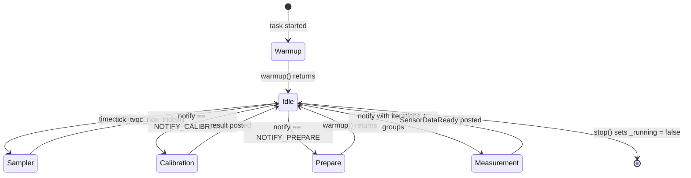

# SGP41 Gas Index in Always-Awake Modes

> **This is a spec.** It describes how a feature **will be built**, not what
> currently exists. Once the feature ships, the corresponding doc under
> `components/airgradient-sensors/` and `products/go/docs/` becomes the
> source of truth and this file is deleted. See `docs/STYLE.md` →
> "Doc Lifecycle".

Wire the Sensirion gas-index algorithm into the SGP41 driver and drive it
from a periodic sampler tick inside the AirGradient Go `SensorProducer`
task. The result is a meaningful TVOC and NOx index in the always-awake
operating modes (Portable and Stationary), decoupled from the user-facing
measurement interval. Offline mode is excluded because deep sleep between
cycles wipes the algorithm state.

## Problem

The SGP41 driver only returns raw VOC and NOx ticks. The
`TVOCNOxData::tvoc_index` and `nox_index` fields exist but are never
populated. As a temporary workaround, `go_sensor_producer.cpp` copies the
raw values into the index fields, which produces values outside the
documented `1..500` index range and is misleading to consumers (display,
storage, BLE).

The Sensirion gas-index algorithm is the supported way to convert raw SGP41
samples into a calibrated index. The algorithm requires:

- Continuous, regularly-spaced raw samples (Sensirion-tested at 1 s and
  10 s intervals).
- An initial 45 s blackout window during which it returns 0.
- Roughly 45 minutes of operation before the long-term mean and variance
  estimators stabilise.

Portable mode on AirGradient Go uses a configurable measurement interval
(default 10 s, range 1..3600 s). Calling the algorithm only on the
measurement timer would violate the sampling-interval contract whenever the
user picks an interval above 10 s, and would produce an index that never
escapes the initial learning phase.

AirGradient Go has three operating modes. Portable and Stationary keep the
CPU awake (`PowerService::decide_sleep` returns `SleepType::None` for any
non-Offline mode); the producer task runs continuously and can drive a
sampler at a fixed cadence. Offline mode deep-sleeps between measurements,
which destroys the algorithm's RAM state and prevents it from clearing the
45 s blackout when the sleep duration approaches or exceeds the measurement
interval. This spec targets the always-awake modes only.

## Goals

- Populate `TVOCNOxData::tvoc_index` and `nox_index` with values produced
  by the Sensirion algorithm whenever the SGP41 sensor is wired and the
  device is in Portable or Stationary mode.
- Run the algorithm at a fixed, Kconfig-configurable interval (default
  10 s, range 1000..10000 ms) inside the `SensorProducer` task,
  independent of `measure_interval_seconds`.
- Keep the shared `airgradient-sensors` component sensor-agnostic — algorithm
  state lives inside the `SGP41` driver.
- Vendor the upstream Sensirion source as a separate component with its
  BSD-3 license preserved.
- Remove the temporary `tvoc_index = tvoc_raw` workaround from the
  AirGradient Go sensor producer.

## Non-Goals

- Offline mode is out of scope. The producer task still runs while the
  device is awake, but every deep sleep cycle resets the algorithm and
  index reads invalid until the next 45 s blackout clears — which never
  happens when sleep duration approaches the measurement interval.
  Document the limitation; do not work around it.
- Persisting algorithm state across deep sleep is out of scope. The
  algorithm resets on every wake; the resulting 45 s blackout per wake is
  documented as a known limitation.
- A new `SensorGroup::TVOC` bitmask value is not added in this spec.
  Today no caller needs a "TVOC-only" measurement path; the orchestrator
  always requests `SensorGroup::All`. After this feature ships,
  `SGP41::read()` is O(1) (cache copy), so the cost of `All` is dominated
  by the other sensors. If a future consumer (UI live-index refresh, BLE
  gas-index characteristic, high-rate TVOC logging) needs a cheaper path,
  adding the bit is a pure-additive ABI change to the `SensorGroup` enum
  and can land then without breaking existing callers.
- The fixed-point variant of the algorithm
  (`sensirion_gas_index_algorithm_fixpoint`) is not vendored. ESP32 has an
  FPU; the float variant is sufficient.
- No changes to the `TVOCNOxData` schema or to `MeasuresInvalid::TVOC` /
  `MeasuresInvalid::NOX` sentinels.

## Design

### Component Topology

```text
products/go/main/go_sensor_producer.cpp
  └─ SensorProducer task loop (timeout-driven)
       ├─ on notify   → SensorManager::start_measures() / warmup() / calibrate_co2()
       └─ on timeout  → SensorManager::tick_tvoc_nox_index()
                         └─ TVOCNOxSensor::tick_index()  (virtual)
                              └─ SGP41::tick_index()
                                   ├─ I2C measure_raw
                                   └─ GasIndexAlgorithm_process(VOC, NOx)
                                        └─ components/sensirion-gas-index-algorithm/
```

`SensorProducer` is the only caller that drives the algorithm. The shared
`SensorManager` exposes thin pass-through methods so the wiring stays
identical for any future product that also wants the algorithm.

### Vendor Component

A new managed-style component `components/sensirion-gas-index-algorithm/`
mirrors the layout of `components/embedded-i2c-scd4x/`:

| File | Source | Purpose |
|---|---|---|
| `sensirion_gas_index_algorithm.c` | upstream `sensirion_gas_index_algorithm/` | Algorithm implementation (float variant) |
| `sensirion_gas_index_algorithm.h` | upstream | Public C API |
| `LICENSE` | upstream `LICENSE` | BSD-3-Clause, preserved verbatim |
| `README.md` | new | Provenance, version, license summary, link upstream |
| `CMakeLists.txt` | new | `idf_component_register(SRCS ... INCLUDE_DIRS .)` |

The upstream `.c` and `.h` files are not patched. If a wrapper is ever
needed, it lives in the SGP41 driver, not in vendor source.

Provenance recorded in the README:

- Upstream: `https://github.com/Sensirion/gas-index-algorithm`, tag
  `v3.2.0`.
- Variant: `sensirion_gas_index_algorithm/` (float).
- License: BSD-3-Clause (Sensirion AG, 2022).

### TVOCNOxSensor Interface

`components/airgradient-sensors/hal/tvoc_nox_sensor.h` gains two new
non-pure-virtual methods so non-SGP41 implementations remain valid:

```cpp
#include <cmath>  // for NAN

class TVOCNOxSensor {
public:
  virtual ~TVOCNOxSensor() = default;

  virtual bool init() = 0;
  virtual bool read(TVOCNOxData &out) = 0;
  virtual bool run_conditioning() { return true; }

  /// Configure on-driver gas-index algorithm.
  ///
  /// `sampling_interval_ms` must match the cadence at which `tick_index()`
  /// is invoked. Sensirion supports 1000 ms or 10000 ms; other values are
  /// unvalidated.
  ///
  /// Default no-op: drivers that do not host a gas-index algorithm ignore
  /// this call.
  virtual void configure_index(uint32_t sampling_interval_ms) {
    (void)sampling_interval_ms;
  }

  /// Sample the sensor and advance the gas-index algorithm by one tick.
  ///
  /// Implementations cache the latest raw + index values internally.
  /// The next call to `read(out)` returns those cached values without
  /// issuing further I2C transactions.
  ///
  /// Optional `temperature_c` and `humidity_pct` arguments allow the
  /// caller to supply per-tick raw-signal compensation. When either is
  /// `NAN` (the default) the implementation falls back to its built-in
  /// defaults. The values are not retained across calls — every tick
  /// must pass them again to keep compensation active.
  ///
  /// Default no-op for sensors without an on-driver algorithm.
  virtual bool tick_index(float temperature_c = NAN,
                          float humidity_pct = NAN) {
    (void)temperature_c;
    (void)humidity_pct;
    return true;
  }
};
```

### SGP41 Driver Changes

`components/airgradient-sensors/drivers/sgp41/sgp41.{h,cpp}` adds
algorithm state and overrides the new virtuals. The semantics of the
existing `read()` change from "issue I2C now" to "return last cached
values".

```cpp
extern "C" {
#include "sensirion_gas_index_algorithm.h"
}

class SGP41 : public TVOCNOxSensor {
public:
  // Existing API
  bool init() override;
  bool read(TVOCNOxData &out) override;          // now a cache reader
  bool run_conditioning() override;

  // New overrides
  void configure_index(uint32_t sampling_interval_ms) override;
  bool tick_index(float temperature_c = NAN,
                  float humidity_pct = NAN) override;

private:
  GasIndexAlgorithmParams _voc_params{};
  GasIndexAlgorithmParams _nox_params{};
  bool _index_configured = false;
  uint32_t _sampling_interval_ms = 0;

  TVOCNOxData _last_cached{
      .tvoc_index = MeasuresInvalid::TVOC,
      .tvoc_raw   = MeasuresInvalid::TVOC,
      .nox_index  = MeasuresInvalid::NOX,
      .nox_raw    = MeasuresInvalid::NOX,
  };
};
```

Behaviour:

- `configure_index(ms)` calls
  `GasIndexAlgorithm_init_with_sampling_interval()` for both algorithm
  types using `ms / 1000.0f`. Sets `_index_configured = true`. Resets
  `_last_cached` to invalid sentinels.
- `tick_index(temp, hum)` first applies compensation: if both
  `temperature_c` and `humidity_pct` are finite (`!std::isnan`), the
  driver calls the existing private `setCompensation()` so the next I2C
  command uses the caller-supplied values. If either is `NAN`, the
  driver leaves its current compensation state untouched (initially the
  built-in `DEFAULT_TEMPERATURE = 25 °C` / `DEFAULT_HUMIDITY = 50 %`).
  The driver then calls `_readRawSignals(voc_raw, nox_raw)`. On I2C
  success and when `_index_configured`, it calls
  `GasIndexAlgorithm_process()` for VOC and NOx, then updates
  `_last_cached`. While the algorithm is in its 45 s blackout it returns
  `0`; the driver maps `0` to `MeasuresInvalid::TVOC` and
  `MeasuresInvalid::NOX` so existing validity helpers
  (`is_tvoc_index_valid()`, `is_nox_index_valid()`) report invalid until
  the algorithm produces a real value (`>= 1`).
- The driver does not retain a separate "latest temp/hum" cache for the
  algorithm. The producer is the single source of truth for the live
  ambient values and passes them in on every tick. The existing
  `_hasCompensation` / `_compTemperature` / `_compHumidity` members
  remain (touched only by `setCompensation()` calls inside `tick_index`),
  so direct callers of the legacy `setCompensation()` API still work.
- `read(out)` copies `_last_cached` to `out` and returns `true` when at
  least one of the cached fields is valid. It does **not** issue I2C, so
  `SensorManager::start_measures()` no longer competes with the sampler
  tick for the SGP41 bus.
- `run_conditioning()` is unchanged — it still issues
  `CMD_CONDITIONING (0x2612)` with default compensation. The producer
  invokes it during `SensorManager::warmup()` before the first sampler
  tick.

### SensorManager Additions

`components/airgradient-sensors/services/sensor_manager.{h,cpp}` exposes
three thin pass-throughs so callers do not need to know about the SGP41
driver concrete type. Existing `start_measures()` is unchanged.

```cpp
#include <cmath>  // for NAN

class SensorManager {
public:
  // ... existing API unchanged ...

  /// True if a TVOC/NOx sensor is wired into this manager.
  bool has_tvoc_nox_sensor() const { return _sensors.tvoc_nox != nullptr; }

  /// Configure the on-driver gas-index algorithm.  No-op when no
  /// TVOC/NOx sensor is wired.  Call once during product wiring before
  /// the producer task starts.
  void configure_tvoc_nox_index(uint32_t sampling_interval_ms);

  /// Run one gas-index sampler tick.  No-op when no TVOC/NOx sensor.
  /// Intended to be called by the product's sensor task at the
  /// configured cadence.
  ///
  /// Optional `temperature_c` and `humidity_pct` are forwarded to the
  /// driver as per-tick raw-signal compensation. When either is `NAN`
  /// (the default) the driver falls back to its built-in compensation
  /// defaults.
  bool tick_tvoc_nox_index(float temperature_c = NAN,
                           float humidity_pct = NAN);
};
```

`_accumulate_tvoc_nox()` continues to call `_sensors.tvoc_nox->read()`,
which now returns cached values. The `tvoc_index` and `nox_index` fields
in the averaging accumulator are populated from those cached values, so
multi-iteration averaging still works without sampling the sensor twice.

### Compensation Refresh

The Sensirion algorithm operates on raw SGP41 signals that depend on
ambient temperature and humidity compensation. Without correct
compensation the raw-to-index mapping drifts, especially in conditions
far from the driver default (25 °C, 50 % RH).

`SensorProducer` already owns the live ambient measurements: it caches
the last valid `temp_hum_a` produced by `SensorManager::start_measures()`
and passes the values inline to `tick_tvoc_nox_index(temp, hum)` at
every sampler tick. The driver applies them for the I2C command issued
in that tick only — there is no separate compensation cache inside the
driver to keep in sync, and no separate setter call to make.

Caching from the measurement cycle (rather than reading SHT40 inline at
every sampler tick) is intentional:

- Indoor temperature and humidity drift slowly (sub-degree per minute is
  typical), so a one-`measure_interval_seconds` lag is acceptable.
- It avoids extra I2C traffic at the sampler cadence (especially at the
  1 s setting).
- It avoids any cross-task coordination — the producer is the sole owner
  of both the cache and the SGP41 driver invocation.

Until the first valid `temp_hum_a` is captured (e.g. immediately after
boot), the producer calls `tick_tvoc_nox_index()` with the default
`NAN` arguments and the driver uses its built-in defaults
(`DEFAULT_TEMPERATURE = 25 °C`, `DEFAULT_HUMIDITY = 50 %`).

### SensorProducer Sampler Loop

The Go `SensorProducer` task loop changes from "block on notify
indefinitely" to "block on notify with a timeout that lands on the next
sampler tick". Single-task execution serialises the sampler against
`start_measures()` without explicit locking.



Pseudo-code (real implementation lives in `go_sensor_producer.cpp`):

```cpp
static constexpr uint32_t TICK_MS = CONFIG_SGP41_INDEX_SAMPLING_INTERVAL_MS;

void SensorProducer::run() {
  _manager.warmup();
  _manager.configure_tvoc_nox_index(TICK_MS);

  uint32_t next_tick_ms = static_cast<uint32_t>(RTOS::get_time_ms()) + TICK_MS;

  while (_running) {
    uint32_t now = static_cast<uint32_t>(RTOS::get_time_ms());
    uint32_t timeout = (next_tick_ms > now) ? (next_tick_ms - now) : 0;

    uint32_t notify_value = 0;
    const bool got = RTOS::task_notify_wait(&notify_value, timeout);

    if (!_running) {
      break;
    }

    if (got) {
      handle_notification(notify_value);            // existing branches
      capture_temp_hum_from_last_measurement();     // refresh _last_temp_hum
    }

    now = static_cast<uint32_t>(RTOS::get_time_ms());
    if (now >= next_tick_ms) {
      const bool have_th =
          _last_temp_hum.is_temp_valid() && _last_temp_hum.is_hum_valid();
      _manager.tick_tvoc_nox_index(
          have_th ? _last_temp_hum.temperature : NAN,
          have_th ? _last_temp_hum.humidity    : NAN);
      next_tick_ms = now + TICK_MS;
    }
  }
}
```

Notes:

- `RTOS::task_notify_wait` already distinguishes timeout (`false`) from a
  delivered notification (`true`).
- The sampler tick runs after the notification handler so a measurement
  request never starves it.
- `start_measures()` blocks the task for ~50–200 ms with one iteration on
  AirGradient Go, which jitters the sampler tick by the same amount. The
  Sensirion algorithm is robust to small jitter at the 10 s setting; this
  is documented as a known acceptable deviation.
- The temporary `basic.tvoc_nox.tvoc_index = basic.tvoc_nox.tvoc_raw`
  workaround in `go_sensor_producer.cpp` is removed.

### Wiring in Go Product

`products/go/main/go_hardware_board.cpp` (or its equivalent wiring
location) constructs the SGP41 driver, then constructs the
`SensorManager`, then constructs the `SensorProducer`. The producer's
own `run()` invokes `SensorManager::configure_tvoc_nox_index(TICK_MS)`
immediately after `warmup()`, so no extra wiring step is required outside
the producer.

### Sleep and Wake

#### Portable and Stationary

The CPU stays awake in both modes. The producer task runs continuously,
and the algorithm experiences a single 45 s blackout at boot followed by
roughly 45 minutes of stabilisation. After that, the cached index values
stay current as long as the device remains powered.

#### Offline (out of scope)

Offline mode deep-sleeps when the device is Locked and the measurement
interval exceeds the deep-sleep threshold. Deep sleep wipes RAM, which
destroys the algorithm parameters. On wake:

1. The Go boot path constructs a fresh `SensorProducer` and starts the
   task.
2. The task runs `SensorManager::warmup()` (10 s SGP41 conditioning).
3. The task calls `SensorManager::configure_tvoc_nox_index(TICK_MS)`,
   which resets both VOC and NOx algorithm parameters.
4. The first ~45 s of sampler ticks fall inside the algorithm's blackout
   window and produce invalid index values.

When the sleep duration is comparable to or larger than 45 s, the
blackout never clears and the cached index reads invalid sentinels for
the entire Offline session. This spec does not work around the
limitation; it is documented in `products/go/docs/sensor_producer.md`
and in the SGP41 driver's section of the airgradient-sensors README.

### Configuration

Three new Kconfig symbols are added under the existing "AirGradient
Sensors" menu in `components/airgradient-sensors/Kconfig`. The choice
block exposes only the two Sensirion-supported sampling intervals (1 s
and 10 s); the derived `_MS` integer is what production code reads.

| Symbol | Default | Purpose |
|---|---|---|
| `CONFIG_SGP41_INDEX_ENABLE` | `y` | Compile-time switch for the SGP41 on-driver gas-index algorithm |
| `CONFIG_SGP41_INDEX_SAMPLING_INTERVAL_1S` | unset | When selected in the choice, sampler ticks every 1000 ms |
| `CONFIG_SGP41_INDEX_SAMPLING_INTERVAL_10S` | `y` | When selected in the choice, sampler ticks every 10000 ms (recommended) |
| `CONFIG_SGP41_INDEX_SAMPLING_INTERVAL_MS` | `10000` | Integer derived from the choice; consumed by the producer task |

Kconfig source (proposed):

```text
config SGP41_INDEX_ENABLE
    bool "Enable SGP41 gas-index algorithm processing"
    default y

choice SGP41_INDEX_SAMPLING_INTERVAL
    prompt "SGP41 gas-index sampling interval"
    depends on SGP41_INDEX_ENABLE
    default SGP41_INDEX_SAMPLING_INTERVAL_10S

    config SGP41_INDEX_SAMPLING_INTERVAL_1S
        bool "1 second"
    config SGP41_INDEX_SAMPLING_INTERVAL_10S
        bool "10 seconds (recommended)"
endchoice

config SGP41_INDEX_SAMPLING_INTERVAL_MS
    int
    default 1000  if SGP41_INDEX_SAMPLING_INTERVAL_1S
    default 10000 if SGP41_INDEX_SAMPLING_INTERVAL_10S
```

When `CONFIG_SGP41_INDEX_ENABLE` is `n`, `SGP41::tick_index()` skips the
algorithm calls but still issues `_readRawSignals()` and caches raw
values, so `tvoc_raw` / `nox_raw` remain available. Index fields stay at
their invalid sentinels.

## Implementation Plan

Each step is intended as a focused commit. The producer test rewrite in
step 9 lands together with the producer change in step 8 to keep the
sampler loop and its tests in sync.

1. **Add vendor component.** Create
   `components/sensirion-gas-index-algorithm/` with the float `.c` / `.h`,
   `LICENSE`, `README.md`, and `CMakeLists.txt`. Add an `idf_component.yml`
   only if existing vendor components in this repository require one.
2. **Extend Kconfig.** Add `CONFIG_SGP41_INDEX_ENABLE`, the
   `SGP41_INDEX_SAMPLING_INTERVAL` choice block (`_1S` / `_10S`), and the
   derived `CONFIG_SGP41_INDEX_SAMPLING_INTERVAL_MS` integer to
   `components/airgradient-sensors/Kconfig`.
3. **Extend `TVOCNOxSensor` HAL.** Add the two virtual methods
   (`configure_index`, `tick_index(temp = NAN, hum = NAN)`) with default
   no-op bodies in
   `components/airgradient-sensors/hal/tvoc_nox_sensor.h`.
4. **Rewire SGP41 driver.** Add algorithm state, `configure_index()`,
   and `tick_index(temp, hum)` (forwarding finite values through the
   existing `setCompensation()` private method before issuing
   `_readRawSignals()`). Change `read()` into a cache reader. Update
   CMake `REQUIRES` (or `PRIV_REQUIRES`) on `airgradient-sensors` to
   depend on the new `sensirion-gas-index-algorithm` component.
5. **Add `SensorManager` pass-throughs.** `has_tvoc_nox_sensor()`,
   `configure_tvoc_nox_index()`, and
   `tick_tvoc_nox_index(temp = NAN, hum = NAN)`.
6. **Wire compensation refresh into the producer.** Cache the last valid
   `temp_hum_a` from each `start_measures()` result and forward the
   values inline via `tick_tvoc_nox_index(temp, hum)` at every sampler
   tick. Pass `NAN` until the first valid pair is captured.
7. **Remove the index-from-raw workaround.** Drop the
   `tvoc_index = tvoc_raw` lines from
   `products/go/main/go_sensor_producer.cpp`.
8. **Rewrite the `SensorProducer` task loop.** Convert the indefinite
   `task_notify_wait` into a timeout-driven loop that calls
   `tick_tvoc_nox_index()` on every timeout. Call
   `configure_tvoc_nox_index(TICK_MS)` after `warmup()`.
9. **Update / add host tests.** Cover the SGP41 driver, the
   `SensorManager` pass-throughs, the compensation forwarding path, and
   the producer sampler loop. See "Testing Strategy" below.
10. **Update docs.** Refresh
    `components/airgradient-sensors/README.md`, the SGP41 driver section
    (adding a `README.md` if substantial unique content emerges), and
    `products/go/docs/sensor_producer.md`. Add a note about Portable +
    Stationary always-awake operation and the Offline-mode limitation.
11. **Verify builds and tests.** Run the reference and Go ESP-IDF builds
    plus `cmake --build tests/build` and
    `ctest --test-dir tests/build --output-on-failure`. Run
    `pre-commit run --all-files` on staged Markdown.
12. **Delete this spec.** After the doc updates land and verification
    passes, remove `products/go/specs/sgp41_gas_index.md`.

## Testing Strategy

### `airgradient-sensors` host tests

- Extend the existing `TVOCNOxSensor` test mock to track
  `configure_index()` and `tick_index(temp, hum)` calls (capturing the
  forwarded compensation arguments) and to expose a programmable
  `read()` cache.
- Verify `SensorManager::has_tvoc_nox_sensor()` reflects the wiring.
- Verify `configure_tvoc_nox_index()` forwards the interval to the mock.
- Verify `tick_tvoc_nox_index()` returns `false` when no TVOC/NOx sensor
  is wired and forwards otherwise.
- Verify `tick_tvoc_nox_index(temp, hum)` forwards both arguments to the
  mock unchanged, and that the default-argument call passes `NAN` for
  both.
- Verify `start_measures()` continues to populate `tvoc_index` /
  `nox_index` from the mock's cached `read()` output and that the existing
  averaging counters still increment.

### SGP41 driver host tests

The current driver has no host tests; this spec adds one focused suite
that exercises the algorithm wrapper without real I2C:

- Inject a stub for `_readRawSignals()` (via a `#ifdef TEST_HOST` hook or
  link-time replacement) that returns scripted raw values.
- Verify that, after `configure_index(10000)` and a sequence of
  `tick_index()` calls with synthetic raw values, `read()` returns
  cached index values that follow the algorithm's expected progression
  (zero during the first 45 s of simulated wall-clock, monotonically
  increasing index after the blackout for a constant raw input).
- Verify that `tick_index(NAN, NAN)` leaves the driver's compensation
  state untouched and that `tick_index(temp, hum)` with finite arguments
  calls the existing `setCompensation()` path before the next
  `_readRawSignals()`.
- Verify that `read()` does **not** issue I2C in `TEST_HOST` builds
  beyond what `tick_index()` already drove.

### Go producer tests

`products/go/tests/`:

- Verify the sampler tick fires after `CONFIG_SGP41_INDEX_SAMPLING_INTERVAL_MS`
  in `TEST_HOST` mode by driving `run()` directly and stepping the
  faked monotonic clock.
- Verify a `request_measurement()` notification still produces a
  `SensorDataReady` event with the cached index fields populated by the
  mock.
- Verify the producer caches `temp_hum_a` from the most recent
  `start_measures()` result and that the cache survives across multiple
  sampler ticks.
- Verify the producer forwards `NAN` for both arguments until a valid
  `temp_hum_a` pair has been captured, and forwards the captured floats
  unchanged once the pair is valid.
- Verify a `request_prepare()` notification runs warmup but does not
  drop the next sampler tick (i.e. the tick still fires after warmup
  completes).
- Verify `stop()` exits the loop cleanly with both pending and recent
  notifications.

### Hardware-in-the-loop checks

- On a Go device, log the SGP41 raw + index for a 60-minute session
  starting from cold boot. Confirm:
  - The first ~45 s shows invalid sentinels for index.
  - After ~45 s, index values land in `1..500`.
  - After ~45 minutes of stable air, index trends toward
    `tvoc_index ≈ 100` and `nox_index ≈ 1`.
- Toggle `measure_interval_seconds` between 10 s, 60 s, and 300 s and
  confirm the sampler keeps ticking at `CONFIG_SGP41_INDEX_SAMPLING_INTERVAL_MS`
  regardless.
- Repeat the 60-minute session in Stationary mode and confirm the same
  blackout-then-learn pattern as Portable.
- Switch to Offline mode, lock the device (forcing deep sleep), and wake
  it; confirm the algorithm resets, the 45 s blackout repeats, and the
  cached index reads invalid sentinels for the duration of the Offline
  session when sleep approaches the measurement interval.

## Open Questions

- **Cross-product reuse.** The reference product currently lacks SGP41.
  When another product adopts SGP41 + the algorithm, should the sampler
  loop be promoted from `SensorProducer` into a shared
  `airgradient-sensors` helper? Out of scope until a second consumer
  exists.
