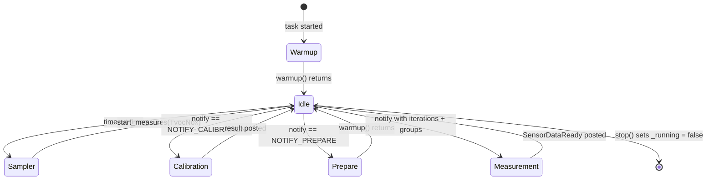

# SGP41 Gas Index in Always-Awake Modes

> **This is a spec.** It describes how a feature **will be built**, not what
> currently exists. Once the feature ships, the corresponding doc under
> `components/airgradient-sensors/` and `products/go/docs/` becomes the
> source of truth and this file is deleted. See `docs/STYLE.md` →
> "Doc Lifecycle".

Wire the Sensirion gas-index algorithm into `SensorManager` and drive it
from a periodic sampler tick inside the AirGradient Go `SensorProducer`
task. The result is a meaningful TVOC and NOx index in the always-awake
operating modes (Portable and Stationary), decoupled from the user-facing
measurement interval. Offline mode is excluded because deep sleep between
cycles wipes the algorithm state.

## Problem

The SGP41 driver only returns raw VOC and NOx ticks. The
`TVOCNOxData::tvoc_index` and `nox_index` fields exist but are never
populated. As a temporary workaround, both `go_sensor_producer.cpp` and
`go_app.cpp` (fast path) copy the raw values into the index fields, which
produces values outside the documented `1..500` index range and is
misleading to consumers (display, storage, BLE).

The Sensirion gas-index algorithm is the supported way to convert raw SGP41
samples into a calibrated index. The algorithm requires:

- Continuous, regularly-spaced raw samples (Sensirion-tested at 1 s and
  10 s intervals).
- An initial 45 s blackout window during which it returns 0.
- A long learning period after blackout. VOC learns faster (~0.75 h mean /
  ~1.45 h variance); NOx learns much more slowly (~4.75 h mean /
  ~5.70 h variance).

AirGradient Go uses a configurable measurement interval (default 10 s,
range 1..3600 s). Calling the algorithm only on the measurement timer
would violate the sampling-interval contract whenever the user picks an
interval above 10 s, and would produce an index that never escapes the
initial learning phase.

AirGradient Go has three operating modes. Portable and Stationary keep the
CPU awake (`PowerService::decide_sleep` returns `SleepType::None` for any
non-Offline mode); the producer task runs continuously and can drive a
sampler at a configured best-effort cadence. Offline mode deep-sleeps
between measurements, which destroys the algorithm's RAM state and prevents
it from clearing the 45 s blackout when the sleep duration approaches or
exceeds the measurement interval. This spec targets the always-awake modes
only.

## Goals

- Populate `TVOCNOxData::tvoc_index` and `nox_index` with values produced
  by the Sensirion algorithm whenever the SGP41 sensor is wired and the
  device is in Portable or Stationary mode.
- Run the algorithm at a Kconfig-configurable best-effort interval (1 s or
  10 s) inside the `SensorProducer` task, independent of
  `measure_interval_seconds`.
- Keep `TVOCNOxSensor` HAL minimal and the SGP41 driver pure I2C —
  algorithm state lives in `SensorManager`, not in the driver.
- Add a new `SensorGroup::TvocNox` bit so the producer can read SGP41
  alone for sampler ticks and the orchestrator's measurement timer can
  read everything-else without disturbing algorithm cadence.
- Remove the temporary `tvoc_index = tvoc_raw` workaround from
  `go_sensor_producer.cpp` (the duplicate in `go_app.cpp` is retained as a
  documented UX placeholder for the fast path; see "Sleep and Wake →
  Offline").

## Non-Goals

- Offline mode is out of scope for index-value support. Raw `tvoc_raw` /
  `nox_raw` continue to flow through the fast path because
  `_accumulate_tvoc_nox` issues `read()` (I2C) when the `TvocNox` bit is
  set, but algorithm state is never initialised in fast path
  (`SensorManager::configure_tvoc_nox_index()` is called by the producer
  and the producer never runs in fast path). Index fields therefore stay
  at invalid sentinels for the entire Offline tracking session. The
  existing `tvoc_index = tvoc_raw` placeholder in `execute_fast_path`
  (`go_app.cpp:185-186`) is retained as a documented UX hand-wave so the
  display still shows a value during fast-path Offline cycles. The duplicate
  raw-to-index overwrite in `measures_to_ago()` is removed so the placeholder
  has one explicit owner.
- Persisting algorithm state across deep sleep is out of scope. The
  algorithm resets on every wake; the resulting 45 s blackout per wake is
  documented as a known limitation.
- The fixed-point variant of the algorithm
  (`sensirion_gas_index_algorithm_fixpoint`) is not vendored. ESP32 has an
  FPU; the float variant is sufficient.
- No changes to the `TVOCNOxData` schema or to `MeasuresInvalid::TVOC` /
  `MeasuresInvalid::NOX` sentinels.

## Design

### Component Topology

```text
products/go/main/go_sensor_producer.cpp
  └─ SensorProducer task loop (timeout-driven when sampler is enabled)
       ├─ on notify   → SensorManager::start_measures(PM | Other)
       │                   → reads SHT40, S8, PMS5003, DPS368
       │                   → returns _last_tvoc_nox cache for TVOC fields
       └─ on timeout  → SensorManager::start_measures(TvocNox)
                           → SGP41::read()  (I2C measure_raw)
                           → GasIndexAlgorithm_process(VOC, NOx)
                           → updates _last_tvoc_nox cache
                                └─ uses components/sensirion-gas-index-algorithm/
```

`SensorManager` owns the algorithm state and the cached `TVOCNOxData`.
`SGP41` stays a pure I2C driver. The new `SensorGroup::TvocNox` bit is
the only signal that distinguishes a sampler tick from a regular
measurement, so producer and SensorManager are decoupled from any
algorithm-policy plumbing.

### Vendor Component (already in tree)

The vendored Sensirion algorithm is already present at
`components/sensirion-gas-index-algorithm/`. The vendor source and
`LICENSE` are **out of scope** for this spec and must not be changed. The
local `README.md` is updated because `SensorManager` becomes the in-tree
consumer; the CMake glue may also need host-build wiring. Refer to that
component's `README.md` for provenance (upstream, version, license,
sampling-interval notes).

This spec only consumes the component: `airgradient-sensors`'
`CMakeLists.txt` adds `sensirion-gas-index-algorithm` to its
`REQUIRES` (or `PRIV_REQUIRES`) list so the algorithm header is on the
include path and the algorithm object is linked into `SensorManager`.

### TVOCNOxSensor Interface

`components/airgradient-sensors/hal/tvoc_nox_sensor.h` gains exactly one
new non-pure-virtual method. No algorithm-related virtuals are added —
the algorithm lives in `SensorManager`, not in the driver.

```cpp
class TVOCNOxSensor {
public:
  virtual ~TVOCNOxSensor() = default;

  virtual bool init() = 0;
  virtual bool read(TVOCNOxData &out) = 0;
  virtual bool run_conditioning() { return true; }

  /// Update on-driver temperature/humidity compensation used during
  /// raw-signal acquisition. Stored values persist across `read()` calls
  /// until the next `set_compensation()` call.  Default no-op for
  /// drivers that do not compensate.
  virtual void set_compensation(float temperature_c, float humidity_pct) {
    (void)temperature_c;
    (void)humidity_pct;
  }
};
```

### SGP41 Driver Changes

`components/airgradient-sensors/drivers/sgp41/sgp41.{h,cpp}` adds **only**
the `set_compensation` override. The existing public API (`init`, `read`,
`run_conditioning`, and the already-public `setCompensation`) plus private
helpers such as `_readRawSignals` are otherwise unchanged.

```cpp
class SGP41 : public TVOCNOxSensor {
public:
  // Existing API — unchanged
  bool init() override;
  bool read(TVOCNOxData &out) override;          // I2C measure_raw
  bool run_conditioning() override;

  // New override — thin forwarder
  void set_compensation(float temperature_c, float humidity_pct) override;
};
```

Behaviour:

- `read(out)` continues to issue `CMD_MEASURE_RAW` and fill
  `out.tvoc_raw` / `out.nox_raw`. The index fields remain at the
  `TVOCNOxData` struct-init defaults (`MeasuresInvalid::TVOC` /
  `MeasuresInvalid::NOX`); the driver does not populate them — that is
  `SensorManager`'s responsibility.
- `set_compensation(temp, hum)` is a thin override that forwards to the
  existing public `setCompensation()` implementation. No new state. The
  existing `_hasCompensation` / `_compTemperature` / `_compHumidity`
  members already hold the values, and they persist across `read()`
  calls until the next `set_compensation()` call.
- `run_conditioning()` is unchanged — it still issues
  `CMD_CONDITIONING (0x2612)` with whatever compensation is currently
  stored. The producer invokes it during `SensorManager::warmup()`
  before the first sampler tick.

### SensorGroup Change

`components/airgradient-sensors/services/sensor_manager.h` extends the
`SensorGroup` enum:

```cpp
enum class SensorGroup : uint8_t {
  None    = 0x00,
  PM      = 0x01,
  Other   = 0x02,   // temp_hum, co2, pressure, o3_no2  (TVOC removed)
  TvocNox = 0x04,   // sgp41 only — sampler-tick-driven
  All     = 0x07,
};
```

TVOC/NOx is removed from the `Other` branch in `start_measures()` and
gated by the new `TvocNox` bit instead.

Caller contract (documented near the enum):

| Caller | Mask | Effect |
|---|---|---|
| Producer sampler tick (algo cadence) | `TvocNox` | SGP41 read + algorithm step + cache refresh |
| Producer measurement, sampler active | `PM \| Other` | All sensors except SGP41; TVOC fields served from cache |
| Producer measurement, sampler inactive | Original requested mask | `All` / `TvocNox` still read SGP41 raw values when a sensor exists; algorithm step skipped |
| Fast path `execute_fast_path` | `All` | All sensors including SGP41; algorithm step skipped (state not configured) |

When the sampler is active, the producer is responsible for stripping
`TvocNox` out of any measurement-mask it derives from an orchestrator
notification, so the orchestrator stays unaware of the algorithm cadence
policy. If the sampler is inactive (for example, no TVOC/NOx sensor is
wired or configuration fails), the producer does not strip `TvocNox`;
regular `All` / `TvocNox` notifications continue to read raw SGP41 values
at the normal measurement cadence when such a sensor exists.

### SensorManager Algorithm Hosting

`components/airgradient-sensors/services/sensor_manager.{h,cpp}` gains
algorithm state, a cached `TVOCNOxData`, and three new public methods.

```cpp
extern "C" {
#include "sensirion_gas_index_algorithm.h"
}

class SensorManager {
public:
  // ... existing API unchanged ...

  /// True if a TVOC/NOx sensor is wired into this manager.
  bool has_tvoc_nox_sensor() const { return _sensors.tvoc_nox != nullptr; }

  /// Initialise the gas-index algorithm for the wired SGP41 sensor.
  /// `sampling_interval_ms` must equal the cadence at which the caller
  /// invokes `start_measures(SensorGroup::TvocNox)`.  Sensirion supports
  /// 1000 ms or 10000 ms.
  ///
  /// Resets `_last_tvoc_nox` to invalid sentinels. Returns true and sets
  /// `_index_configured = true` on success. Returns false and leaves
  /// `_index_configured = false` when no TVOC/NOx sensor is wired or the
  /// interval is unsupported.
  bool configure_tvoc_nox_index(uint32_t sampling_interval_ms);

  /// Update on-driver compensation for the wired TVOC/NOx sensor.
  /// Forwards to `TVOCNOxSensor::set_compensation()`. No-op when no
  /// TVOC/NOx sensor is wired or when the driver does not override the
  /// virtual.
  void set_tvoc_nox_compensation(float temperature_c, float humidity_pct);

private:
  GasIndexAlgorithmParams _voc_params{};
  GasIndexAlgorithmParams _nox_params{};
  bool _index_configured = false;

  /// Last computed TVOC/NOx values. Individual fields are refreshed when
  /// `start_measures()` is called with the `TvocNox` bit and that field has
  /// a nonzero counter; served back when called without the bit. A failed
  /// SGP41 read therefore preserves the previous cache, and during blackout
  /// raw fields may refresh while index fields remain previous/invalid.
  TVOCNOxData _last_tvoc_nox{
      .tvoc_index = MeasuresInvalid::TVOC,
      .tvoc_raw   = MeasuresInvalid::TVOC,
      .nox_index  = MeasuresInvalid::NOX,
      .nox_raw    = MeasuresInvalid::NOX,
  };
};
```

`configure_tvoc_nox_index()` accepts only `1000` or `10000`. It converts
milliseconds to seconds before initialising the Sensirion state:

```cpp
const float sampling_interval_s = static_cast<float>(sampling_interval_ms) / 1000.0f;
GasIndexAlgorithm_init_with_sampling_interval(
    &_voc_params, GasIndexAlgorithm_ALGORITHM_TYPE_VOC, sampling_interval_s);
GasIndexAlgorithm_init_with_sampling_interval(
    &_nox_params, GasIndexAlgorithm_ALGORITHM_TYPE_NOX, sampling_interval_s);
```

`_accumulate_tvoc_nox()` runs only when the `TvocNox` bit is set. It
reads the SGP41 (raw values) and, when the algorithm has been
configured, advances the algorithm:

```cpp
void SensorManager::_accumulate_tvoc_nox(TVOCNOxData &sum,
                                         AverageMeasuresCounters &counters) {
  if (!_sensors.tvoc_nox) return;

  TVOCNOxData data;
  if (!_sensors.tvoc_nox->read(data)) return;

  const bool tvoc_raw_valid = data.is_tvoc_raw_valid();
  const bool nox_raw_valid = data.is_nox_raw_valid();

  // Raw accumulation (existing behaviour)
  if (tvoc_raw_valid) { sum.tvoc_raw += data.tvoc_raw; counters.tvoc_raw++; }
  if (nox_raw_valid)  { sum.nox_raw  += data.nox_raw;  counters.nox_raw++;  }

  // Algorithm step — gated by `_index_configured`.  Fast path never
  // configures the algorithm, so this branch is skipped there and
  // `_last_tvoc_nox` only carries raw values into the cache.
  if (_index_configured) {
    if (tvoc_raw_valid) {
      int32_t voc_idx = 0;
      GasIndexAlgorithm_process(&_voc_params, data.tvoc_raw, &voc_idx);
      // Sensirion returns 0 during the 45 s blackout. Do not average the
      // invalid sentinel; simply skip the field until a nonzero index exists.
      if (voc_idx != 0) { sum.tvoc_index += voc_idx; counters.tvoc_index++; }
    }
    if (nox_raw_valid) {
      int32_t nox_idx = 0;
      GasIndexAlgorithm_process(&_nox_params, data.nox_raw, &nox_idx);
      if (nox_idx != 0) { sum.nox_index += nox_idx; counters.nox_index++; }
    }
  }
}
```

`start_measures()` gates accumulation on the new bit and refreshes /
serves `_last_tvoc_nox` accordingly:

```cpp
Measures SensorManager::start_measures(int iterations, SensorGroup groups) {
  // ... existing accumulator and counter init, fallback resolution ...

  for (int i = 0; i < iterations; i++) {
    if (has_group(groups, SensorGroup::Other)) {
      // temp_hum, co2, pressure, o3_no2 — TVOC NOT included
    }
    if (has_group(groups, SensorGroup::TvocNox)) {
      _accumulate_tvoc_nox(sum_voc_nox, counters);
    }
    if (has_group(groups, SensorGroup::PM)) { /* unchanged */ }
    // ... pacing ...
  }

  Measures measures;
  // ... other averages unchanged ...
  if (has_group(groups, SensorGroup::TvocNox)) {
    measures.tvoc_nox = _calculate_tvoc_nox_average(sum_voc_nox, counters);
    if (counters.tvoc_index > 0) _last_tvoc_nox.tvoc_index = measures.tvoc_nox.tvoc_index;
    if (counters.tvoc_raw > 0)   _last_tvoc_nox.tvoc_raw   = measures.tvoc_nox.tvoc_raw;
    if (counters.nox_index > 0)  _last_tvoc_nox.nox_index  = measures.tvoc_nox.nox_index;
    if (counters.nox_raw > 0)    _last_tvoc_nox.nox_raw    = measures.tvoc_nox.nox_raw;
    measures.tvoc_nox = _last_tvoc_nox;          // return refreshed cache
  } else {
    measures.tvoc_nox = _last_tvoc_nox;          // serve cache
  }
  return measures;
}
```

`_calculate_tvoc_nox_average()` is unchanged — it already treats
zero-counter fields as invalid sentinels. `start_measures()` only copies
fields with nonzero counters into `_last_tvoc_nox`, so a sampler tick that
fires during blackout or before the first I2C success preserves the
previous cached value for those fields (the sentinel struct on first boot).

### SensorProducer Sampler Loop

The Go `SensorProducer` task loop changes from "block on notify
indefinitely" to "block on notify with a timeout that lands on the next
sampler tick" when an SGP41 sensor is wired and index configuration
succeeds. Single-task execution serialises the sampler against
notification-driven measurements without explicit locking. Sampler ticks
and measurements both go through `start_measures()`; the only difference
is the `SensorGroup` mask.

The cadence is best-effort, scheduled from the monotonic clock. Blocking
work in the same task (`warmup()`, CO2 calibration, PM prepare, or a
multi-iteration measurement) may delay sampler ticks. Missed intervals are
skipped, not replayed, because replaying stale raw samples would violate
the algorithm's input assumptions more than a delayed next sample.



Pseudo-code (real implementation lives in `go_sensor_producer.cpp`):

```cpp
static constexpr uint32_t TICK_MS = CONFIG_SGP41_INDEX_SAMPLING_INTERVAL_MS;

void SensorProducer::run() {
  _manager.warmup();

  const bool sampler_enabled = _manager.has_tvoc_nox_sensor() &&
                               _manager.configure_tvoc_nox_index(TICK_MS);

  uint32_t next_tick_ms = static_cast<uint32_t>(RTOS::get_time_ms()) + TICK_MS;

  while (_running) {
    uint32_t now = static_cast<uint32_t>(RTOS::get_time_ms());
    uint32_t timeout = UINT32_MAX;
    if (sampler_enabled) {
      timeout = (next_tick_ms > now) ? (next_tick_ms - now) : 0;
    }

    uint32_t notify_value = 0;
    const bool got = RTOS::task_notify_wait(&notify_value, timeout);

    if (!_running) break;

    if (got) {
      // Decode the orchestrator's request. When the sampler is enabled,
      // clear the TvocNox bit so measurement notifications never advance
      // the algorithm at an irregular cadence — only the sampler tick below
      // does. When inactive, preserve the original mask so All/TvocNox
      // notifications still read raw SGP41 values.
      uint32_t iters  = notify_value & 0xFF;
      auto orig_groups = static_cast<SensorGroup>((notify_value >> 8) & 0xFF);
      SensorGroup measurement_groups = orig_groups;
      if (sampler_enabled) {
        measurement_groups = static_cast<SensorGroup>(
            static_cast<uint8_t>(orig_groups) &
            ~static_cast<uint8_t>(SensorGroup::TvocNox));
      }

      // ... existing NOTIFY_CALIBRATION / NOTIFY_PREPARE branches ...

      Measures m = _manager.start_measures(iters, measurement_groups);
      // m.tvoc_nox is served from SensorManager's cached _last_tvoc_nox.

      // Cache the latest valid temp/hum_a for compensation push.
      if (m.temp_hum_a.is_temp_valid() && m.temp_hum_a.is_hum_valid()) {
        _last_temp_hum = m.temp_hum_a;
        _last_temp_hum_valid = true;
      }

      // Post SensorDataReady (existing).
    }

    now = static_cast<uint32_t>(RTOS::get_time_ms());
    if (sampler_enabled && now >= next_tick_ms) {
      if (_last_temp_hum_valid) {
        _manager.set_tvoc_nox_compensation(_last_temp_hum.temperature,
                                           _last_temp_hum.humidity);
      }
      // Sampler tick — runs SGP41 read + algorithm step.  Result is
      // discarded here; it lands in SensorManager's _last_tvoc_nox cache.
      (void)_manager.start_measures(1, SensorGroup::TvocNox);
      next_tick_ms = now + TICK_MS;
    }
  }
}
```

Notes:

- `RTOS::task_notify_wait` already distinguishes timeout (`false`) from a
  delivered notification (`true`).
- When the sampler is enabled, it runs after the notification handler so a
  measurement request never starves it indefinitely, but long blocking work
  can delay it; missed intervals are skipped.
- With the sampler enabled, measurement-cycle `start_measures(PM | Other)`
  does **not** read SGP41 at all — the cached `_last_tvoc_nox` value is
  served. Cost on the producer's hot path is one struct copy.
- With the sampler inactive, the producer preserves the requested group mask
  and `start_measures(All)` continues to read SGP41 raw values at the normal
  measurement cadence.
- Sampler-cycle `start_measures(TvocNox)` reads only SGP41; the call is
  inexpensive (one I2C measure_raw plus the algorithm step).
- The temporary `basic.tvoc_nox.tvoc_index = basic.tvoc_nox.tvoc_raw`
  workaround in `go_sensor_producer.cpp` is removed. The duplicate in
  `go_app.cpp` is retained — see "Sleep and Wake → Offline".

### Compensation Refresh

The Sensirion algorithm operates on raw SGP41 signals that depend on
ambient temperature and humidity compensation. Without correct
compensation the raw-to-index mapping drifts, especially in conditions
far from the driver default (25 °C, 50 % RH).

`SensorProducer` caches the last valid `temp_hum_a` produced by
`SensorManager::start_measures()` and pushes the values to the driver
via `SensorManager::set_tvoc_nox_compensation()` once per sampler tick
(immediately before the `start_measures(TvocNox)` call). The driver
stores them in its existing `setCompensation()` state, where they persist
across reads.

Caching from the measurement cycle (rather than reading SHT40 inline at
every sampler tick) is intentional:

- Indoor temperature and humidity drift slowly (sub-degree per minute is
  typical), so a one-`measure_interval_seconds` lag is acceptable.
- It avoids extra I2C traffic at the sampler cadence (especially at the
  1 s setting).
- It avoids any cross-task coordination — the producer is the sole owner
  of both the cache and the SGP41 driver invocation.

Until the first valid `temp_hum_a` is captured (e.g. immediately after
boot), the producer skips `set_tvoc_nox_compensation()` and the driver
uses its built-in defaults (`DEFAULT_TEMPERATURE = 25 °C`,
`DEFAULT_HUMIDITY = 50 %`).

### Wiring in Go Product

`products/go/main/go_hardware_board.cpp` (or its equivalent wiring
location) constructs the SGP41 driver, then `SensorManager`, then
`SensorProducer`. The producer's own `run()` invokes
`SensorManager::configure_tvoc_nox_index(TICK_MS)` immediately after
`warmup()` when a TVOC/NOx sensor is wired, so no extra wiring step is
required outside the producer.

### Sleep and Wake

#### Portable and Stationary

The CPU stays awake in both modes. The producer task runs continuously,
and the algorithm experiences a single 45 s blackout at boot followed by a
long learning period. VOC trends toward a stable baseline over ~0.75 h
mean / ~1.45 h variance learning; NOx trends more slowly over ~4.75 h mean
/ ~5.70 h variance learning. After blackout, `_last_tvoc_nox` carries
fresh index values that any `start_measures()` call (with or without the
`TvocNox` bit) sees consistently.

#### Offline (out of scope)

Offline has two boot sub-paths after deep sleep, and they behave
differently:

```text
Offline + button wake:
  GoApp::run_button_wake_path → run_interactive
    → SensorProducer constructed
    → producer warmup() + configure_tvoc_nox_index()
    → algorithm enters 45 s blackout from this moment
  Index becomes valid only if the device stays awake ≥ 45 s after promotion.

Offline + timer wake (the typical Offline cycle):
  GoApp::run_fast_path → execute_fast_path
    → No SensorProducer is ever created.
    → SensorManager is constructed via _board.sensors() but
      configure_tvoc_nox_index() is NEVER called, so _index_configured == false.
    → Fast path calls start_measures(1, SensorGroup::All), which now
      includes the TvocNox bit, so SGP41::read() runs and raw values
      flow through.  The algorithm branch in _accumulate_tvoc_nox is
      skipped because the algorithm has not been configured.
    → tvoc_index / nox_index leave _accumulate_tvoc_nox at invalid
      sentinels.
    → The retained workaround at go_app.cpp:185-186
      (`tvoc_index = tvoc_raw`) overwrites the index fields with the
      raw value before the route point and display call.  The display
      and stored route points therefore continue to show a value, but
      it is a raw tick count, not a calibrated 1..500 index.
    → `measures_to_ago()` does not perform any raw-to-index overwrite;
      the fast-path placeholder has this single explicit owner.
```

This spec does not work around the Offline limitation; it is documented
in `products/go/docs/sensor_producer.md` and in the SGP41 driver's
section of the airgradient-sensors README.

### Configuration

Three new Kconfig symbols are added under the existing "AirGradient
Sensors" menu in `components/airgradient-sensors/Kconfig`. The choice
block exposes only the two Sensirion-supported sampling intervals (1 s
and 10 s); the derived `_MS` integer is what production code reads when
the sampler is active. There is no compile-time enable switch; runtime
gating through `has_tvoc_nox_sensor()` and `configure_tvoc_nox_index()` is
the single source of truth.

| Symbol | Default | Purpose |
|---|---|---|
| `CONFIG_SGP41_INDEX_SAMPLING_INTERVAL_1S` | unset | When selected in the choice, sampler ticks every 1000 ms |
| `CONFIG_SGP41_INDEX_SAMPLING_INTERVAL_10S` | `y` | When selected in the choice, sampler ticks every 10000 ms (recommended) |
| `CONFIG_SGP41_INDEX_SAMPLING_INTERVAL_MS` | `10000` | Integer derived from the choice; consumed by the producer task |

Kconfig source (proposed):

```text
choice SGP41_INDEX_SAMPLING_INTERVAL
    prompt "SGP41 gas-index sampling interval"
    default SGP41_INDEX_SAMPLING_INTERVAL_10S

    config SGP41_INDEX_SAMPLING_INTERVAL_1S
        bool "1 second"
    config SGP41_INDEX_SAMPLING_INTERVAL_10S
        bool "10 seconds (recommended)"
endchoice

config SGP41_INDEX_SAMPLING_INTERVAL_MS
    int
    default 1000  if SGP41_INDEX_SAMPLING_INTERVAL_1S
    default 10000 if SGP41_INDEX_SAMPLING_INTERVAL_10S
    default 10000
```

If no TVOC/NOx sensor is wired, `configure_tvoc_nox_index()` returns false
and the producer keeps using an indefinite notification wait. If
configuration unexpectedly fails, the producer likewise leaves the sampler
inactive and preserves notification masks, so raw SGP41 reads still occur
for regular `All` / `TvocNox` requests when a sensor exists.

## Implementation Plan

Each step is intended as a focused commit. The producer test rewrite lands
together with the producer loop change to keep the sampler loop and its
tests in sync.

The vendored Sensirion algorithm component is already in tree at
`components/sensirion-gas-index-algorithm/`, so no "add vendor
component" step is needed.

1. **Extend Kconfig.** Add the `SGP41_INDEX_SAMPLING_INTERVAL` choice
   block (`_1S` / `_10S`) and the derived
   `CONFIG_SGP41_INDEX_SAMPLING_INTERVAL_MS` integer to
   `components/airgradient-sensors/Kconfig`.
2. **Extend `SensorGroup`.** Add `TvocNox = 0x04`, redefine
   `All = 0x07`, document the per-caller contract in the header.
3. **Extend `TVOCNOxSensor` HAL.** Add the `set_compensation` virtual
   with a default no-op body in
   `components/airgradient-sensors/hal/tvoc_nox_sensor.h`. Do **not**
   add `configure_index` or `tick_index` virtuals — the algorithm is
   hosted in `SensorManager`, not in the driver.
4. **SGP41 driver: add `set_compensation` override.** Forward to the
   existing public `setCompensation()` method. No other driver changes.
5. **Wire vendor dependency.** Add `sensirion-gas-index-algorithm` to
   `REQUIRES` (or `PRIV_REQUIRES`) in
   `components/airgradient-sensors/CMakeLists.txt` so the algorithm
   header is on the include path and the algorithm object links into
   `SensorManager`. Update host CMake if needed so native tests compile
   the vendor `.c` file and enable the C language where required.
6. **Host the algorithm in `SensorManager`.** Add `_voc_params`,
   `_nox_params`, `_index_configured`, `_last_tvoc_nox`. Add the public
   methods `configure_tvoc_nox_index()`, `has_tvoc_nox_sensor()`,
   `set_tvoc_nox_compensation()`. Make `configure_tvoc_nox_index()` return
   `bool`, reject unsupported intervals, and initialise VOC / NOx with
   `GasIndexAlgorithm_init_with_sampling_interval()`. Move TVOC
   accumulation out of the `Other` branch and gate it on the new `TvocNox`
   bit. Validate raw fields before algorithm processing, skip Sensirion
   blackout `0` outputs without incrementing counters, and refresh
   `_last_tvoc_nox` per field only when that field has a nonzero counter.
7. **Wire compensation refresh into the producer.** Cache the last valid
   `temp_hum_a` from each `start_measures()` result and push the values
   via `set_tvoc_nox_compensation()` once per sampler tick (immediately
   before the `start_measures(TvocNox)` call). Skip the call until the
   first valid pair is captured.
8. **Add producer test seam.** Extract a small loop-step helper or an
   equivalent host seam so `TEST_HOST` producer tests can inject task
   notifications and advance a fake monotonic clock deterministically
   without relying on the current `RTOS::task_notify_wait()` no-op.
9. **Rewrite the `SensorProducer` task loop.** Convert the indefinite
   `task_notify_wait` into a timeout-driven loop only when a TVOC/NOx
   sensor is wired and `configure_tvoc_nox_index(TICK_MS)` succeeds. On
   notify, decode the group mask and strip `TvocNox` only when the sampler
   is active. On timeout, call `start_measures(1, TvocNox)`. Treat cadence
   as best-effort and skip missed ticks rather than replaying them.
10. **Remove index-from-raw workarounds outside fast path.** Drop the
   `tvoc_index = tvoc_raw` lines from
   `products/go/main/go_sensor_producer.cpp` and from `measures_to_ago()`.
   The explicit placeholder at `products/go/main/go_app.cpp:185-186` is
   **retained** and noted in the spec / sensor-producer doc as a
   documented UX placeholder for the fast path.
11. **Update / add host tests.** Cover the `SensorManager` algorithm
    hosting, the `SensorGroup::TvocNox` gating, the compensation
    forwarding path, and the producer sampler loop. See
    "Testing Strategy" below.
12. **Update docs.** Refresh `components/airgradient-sensors/README.md`,
    `components/sensirion-gas-index-algorithm/README.md`,
    `products/go/docs/sensor_producer.md`, and the relevant sections of
    `products/go/ARCHITECTURE.md` (the SensorGroup table and any sensor-
    producer description). Add a note about Portable + Stationary
    always-awake operation, the Offline-mode raw-only fallback, and the
    retained `go_app.cpp` UX placeholder.
13. **Verify builds and tests.** Run the reference and Go ESP-IDF builds
    plus `cmake --build tests/build` and
    `ctest --test-dir tests/build --output-on-failure`. Run
    `pre-commit run --all-files` on staged Markdown.
14. **Delete this spec.** After the doc updates land and verification
    passes, remove `products/go/specs/sgp41_gas_index.md`.

## Testing Strategy

### `airgradient-sensors` host tests

- Extend the existing `TVOCNOxSensor` test mock to track
  `set_compensation()` calls (capturing the forwarded arguments) and to
  expose a programmable `read()` output.
- Verify `SensorManager::has_tvoc_nox_sensor()` reflects the wiring.
- Verify `configure_tvoc_nox_index()` returns true for `1000` / `10000`,
  initialises VOC and NOx with the matching algorithm types and sampling
  interval in seconds, flips `_index_configured`, and resets
  `_last_tvoc_nox` to invalid sentinels.
- Verify `configure_tvoc_nox_index()` returns false and leaves
  `_index_configured == false` when no TVOC/NOx sensor is wired, when the
  interval is unsupported, or when algorithm initialisation cannot proceed.
- Verify `set_tvoc_nox_compensation()` forwards both arguments to the
  mock and is a safe no-op when no TVOC/NOx sensor is wired.
- Verify `start_measures(SensorGroup::TvocNox)` calls
  `_sensors.tvoc_nox->read()` exactly once per iteration, advances the
  algorithm when configured, and refreshes `_last_tvoc_nox` per field only
  when that field has a nonzero counter.
- Verify invalid raw fields are not passed into the Sensirion algorithm.
- Verify Sensirion `0` outputs during blackout do not add invalid sentinels
  to sums and do not increment index counters, while valid raw fields still
  refresh the raw cache.
- Verify a failed SGP41 read preserves the previous `_last_tvoc_nox` cache.
- Verify `start_measures(SensorGroup::PM | SensorGroup::Other)` does
  **not** call `read()` and that the returned `Measures.tvoc_nox`
  matches the previously cached `_last_tvoc_nox`.
- Verify `start_measures(SensorGroup::All)` runs both branches; with
  `_index_configured == false` the algorithm step is skipped and the
  cached value carries raw values only (the fast-path scenario).
- Verify `_calculate_tvoc_nox_average()` continues to return invalid
  sentinels when counters are zero, regardless of which group bits were
  passed.

The SGP41 driver itself is exercised on hardware only — see the
"Hardware-in-the-loop checks" section. No host tests are added for the
driver in this spec.

### Go producer tests

`products/go/tests/`:

Add a small loop-step helper or equivalent host seam first; the current
`RTOS::task_notify_wait()` returns `false` unconditionally in `TEST_HOST`,
so tests should not depend on real task notifications.

- Verify the sampler tick fires after
  `CONFIG_SGP41_INDEX_SAMPLING_INTERVAL_MS` in `TEST_HOST` mode by
  driving the loop helper and stepping the faked monotonic clock.
- Verify the producer strips `SensorGroup::TvocNox` from the
  notify-decoded mask before calling `start_measures()` (i.e. an
  orchestrator sending `All` results in a measurement call that uses
  `PM | Other`) only when the sampler is enabled.
- Verify when no TVOC/NOx sensor is wired or configure fails, the producer
  does not start the sampler timeout and does not strip `TvocNox`, so an
  `All` measurement still reads raw SGP41 values if a sensor exists.
- Verify a `request_measurement()` notification still produces a
  `SensorDataReady` event and that the event payload's `tvoc_nox` is
  served from `SensorManager`'s cached `_last_tvoc_nox`.
- Verify the producer caches `temp_hum_a` from the most recent
  `start_measures()` result and that the cache survives across multiple
  sampler ticks.
- Verify the producer skips `set_tvoc_nox_compensation()` until a valid
  `temp_hum_a` pair has been captured, and pushes the values once the
  pair is valid.
- Verify a `request_prepare()` notification runs warmup and that any elapsed
  sampler interval is skipped, with the next tick scheduled from the time
  warmup completes.
- Verify `stop()` exits the loop cleanly with both pending and recent
  notifications.

### Hardware-in-the-loop checks

- On a Go device, log the SGP41 raw + index for a 6-hour Portable
  session starting from cold boot. Confirm:
  - The first ~45 s shows invalid sentinels for index.
  - After ~45 s, index values land in `1..500`.
  - After ~1.5 h of stable air, VOC has largely completed initial mean /
    variance learning and trends toward `tvoc_index ≈ 100`.
  - After ~6 h of stable air, NOx has largely completed initial mean /
    variance learning and trends toward `nox_index ≈ 1`.
- Toggle `measure_interval_seconds` between 10 s, 60 s, and 300 s and
  confirm the sampler keeps ticking best-effort at
  `CONFIG_SGP41_INDEX_SAMPLING_INTERVAL_MS` regardless of the measurement
  interval and that measurement events carry the cached index.
- Repeat a long Stationary-mode session and confirm the same
  blackout-then-learn pattern as Portable.
- Switch to Offline + Tracking and force fast-path wakes for at least
  30 minutes. Confirm:
  - Stored route points carry valid `tvoc_raw` / `nox_raw`.
  - `tvoc_index` / `nox_index` in the route points equal `tvoc_raw` /
    `nox_raw` respectively (the retained `go_app.cpp:185-186`
    placeholder), confirming the hand-wave still applies and no other
    code path is overwriting the fields.

## Open Questions

- **Cross-product reuse.** The reference product currently lacks SGP41.
  When another product adopts SGP41 + the algorithm, no extra
  per-product wiring should be needed beyond constructing
  `SensorManager` and calling `configure_tvoc_nox_index()` from that
  product's sensor task — the algorithm hosting is generic. Out of
  scope until a second consumer exists.
