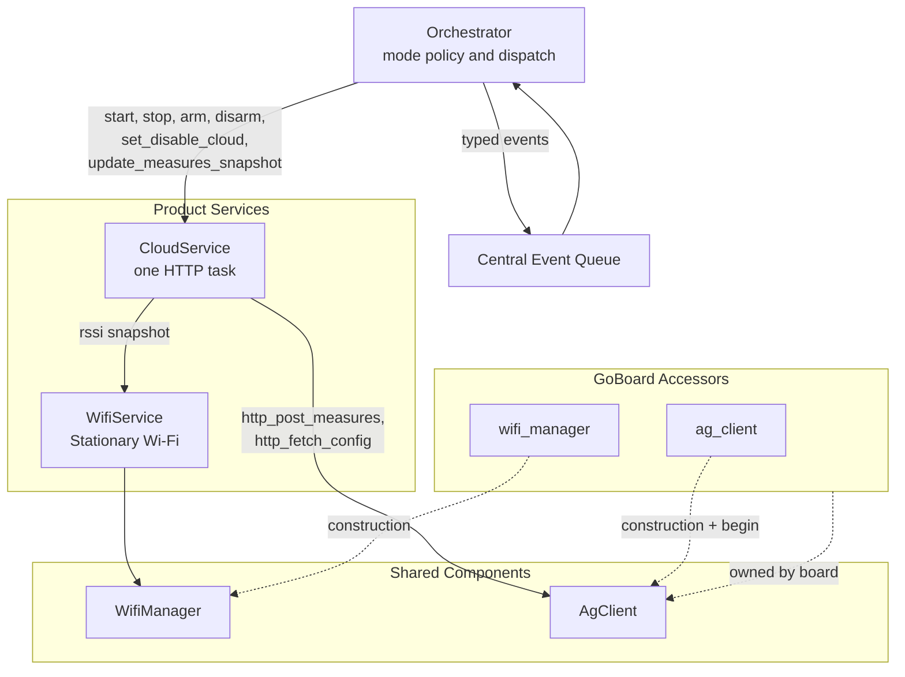

# Stationary Mode Cloud Transport — Implementation Spec

> **This is a spec.** It describes how a feature **will be built**, not what
> currently exists. Once the feature ships, the corresponding doc under
> `docs/` (or the relevant component README) becomes the source of truth and
> this file is typically deleted. See [`docs/STYLE.md`](../../../docs/STYLE.md)
> → "Doc Lifecycle".

Layer cloud transport on top of the already-shipped
[`WifiService`](../docs/wifi_service.md) so AirGradient Go in Stationary
mode periodically posts its latest `MeasuresAGo` snapshot to the
AirGradient HTTP backend and fetches device configuration. The
fetched-config body is logged only in this iteration; parsing and
applying server-pushed settings is a separate follow-up. A new product
service, `CloudService`, owns a dedicated low-priority task so the
synchronous `AgClient` HTTP calls never block the orchestrator.

## Problem

[`WifiService`](../docs/wifi_service.md) brings Wi-Fi online, persists
`disable_cloud` and `static_ip` from provisioning, and exposes
`is_online()`, `ip()`, and `rssi()`. The
[`airgradient-client`](../../../components/airgradient-client/README.md)
component is ready and host-tested for
`AgClient::http_post_measures(MeasuresAGo, signal)` and
`AgClient::http_fetch_config(buf, size, &written)`, with full
`AgClientResult` mapping. Nothing on AGo currently calls them:

- `BuildContext::wifi_enabled` is driven by `WifiService::is_online()`
  (`go_orchestrator.cpp:1474`), so the UI already shows the Wi-Fi icon,
  but no data leaves the device.
- `_settings.disable_cloud` round-trips through NVS
  (`go_settings.h:31`) but the comment still reads
  `"honored by future cloud transport"` — no honor today.
- `on_sensor_data()` updates `_cached_measures` and pushes to display /
  BLE / storage but never hands the value to a transport.

The shared `AgClient` HTTP calls are synchronous and block up to
`WifiHttpClient::DEFAULT_TIMEOUT_MS` (~15 s) on failure. Running them
on the orchestrator task would freeze sensor handling, UI input
dispatch, BMS polling, and the auto-lock deadline for the duration of
the call. AGo therefore needs a dedicated task for the cloud
transport.

The older end-to-end Stationary attempt
[`provisioning_research/stationary_mode.md`](../../../provisioning_research/stationary_mode.md)
proposed `CloudService` as part of the same checkpoint cascade as
networking. Networking shipped; cloud did not. This spec extracts the
cloud-only slice and adjusts it to the post-networking codebase.

## Goals

- Post the latest `MeasuresAGo` snapshot to the AirGradient HTTP
  backend every 60 s while Stationary and online.
- Fetch device configuration every 60 s on the same cadence as POST.
  POST takes priority on each cycle — when both deadlines are due,
  POST is checked and runs first; FETCH runs after POST completes.
  Raw FETCH response body and result code are logged to serial.
- Anchor the POST cadence to the **start** of the previous POST, not
  its completion. If a POST starts at T and takes 15 s, the next POST
  is scheduled for T + 60 s (45 s after this one finishes) rather than
  T + 75 s. Wall-clock cadence is preserved even when individual calls
  vary in duration. The same anchor scheme applies to FETCH.
- Honor `_settings.disable_cloud` on both legs (POST and FETCH). The
  check happens at tick time, so a settings change takes effect on the
  next tick without restarting the task.
- Surface `PostMeasuresResult` and `FetchConfigResult` as typed events
  on the central queue. Handlers are log-only in this iteration so a
  future UX layer can subscribe without touching producers.
- Fire the first POST and FETCH immediately on the first arm of each
  Stationary entry (cold-boot saved-credentials success, factory-default
  fallback success, and provisioning success) so the user / dashboard
  sees confirmation within seconds and the device pulls the latest
  config on every connect. Post-online reconnect arms wait for the
  next interval so transient AP outages do not trigger back-to-back
  posts.
- Source RSSI from `WifiService::rssi()` at post time, translating
  the `WIFI_RSSI_INVALID` (0) sentinel to `-127` (the `AgClient`
  "no RSSI" convention) so the dashboard never sees a misleading 0 dB.
- Cleanly tear down on mode change. `CloudService::stop()` blocks
  until an in-flight HTTP call completes, bounded by **one**
  `WifiHttpClient::DEFAULT_TIMEOUT_MS` (~15 s) — not two — because the
  task re-samples the shutdown latch and other state between every
  HTTP call. All state transitions (arm, disarm, set_disable_cloud,
  shutdown) flow through atomic stores rather than a command queue so
  no transition can be silently dropped.
- Keep heap claim deferred. `CloudService::start()` is the only call
  that allocates real heap (8 KB task stack + 1 KB fetch buffer +
  semaphore) and the orchestrator defers it until Wi-Fi is online so
  the cloud transport does not compete with provisioning for
  contiguous heap.
- Keep the orchestrator responsive: HTTP runs on a dedicated low-prio
  task; snapshot handoff is a mutex-protected `MeasuresAGo` copy held
  for microseconds.

## Non-Goals

- Do not parse the fetched-config JSON body or apply server-pushed
  settings to `GoSettings`. The body is logged only; a follow-up spec
  owns the parser and settings-merge story.
- Do not add MQTT, CoAP, or cellular transports. `AgClient`'s
  non-HTTP methods abort today; nothing in this spec calls them.
- Do not expose a product-local HTTP API or live-measures endpoint.
  `HttpServer` ownership remains with `ProvisioningManager` during
  provisioning and idle otherwise.
- Do not change the status-bar Wi-Fi icon, snackbar copy, or any UI
  surface. `BuildContext::wifi_enabled` and the post-online
  `"Wi-Fi connected"` snackbar are already wired
  (`go_orchestrator.cpp:1474, 1275`).
- Do not add an outer-loop reconnect scheduler after `WifiManager`
  retry exhaustion. Patient retry stays the rule; user recovery is
  mode switch / factory reset / reboot.
- Do not change the sensor measurement cadence in Stationary mode.
  Sensor scheduling stays mode-agnostic.
- Do not modify the fast-path measurement logic, the button-wake
  early-paint sequence, or any boot-time sensor / display ordering.
  This spec adds one `CloudService` construction line to both
  `run_interactive()` and `run_button_wake_path()` (mirroring the
  existing `WifiService` construction in both paths); the service
  object is inert in Portable / Offline (no task, no fetch buffer,
  no semaphore) and only `start()`s if the orchestrator enters
  Stationary and reaches a Wi-Fi-online state. `AgClient::begin()`
  does run via the board accessor on every interactive boot
  (Portable, Offline, Stationary) — see
  [Boot Construction Order](#boot-construction-order); the cost is
  sub-millisecond and opens no sockets, so it is acceptable in all
  paths including button-wake.

## Design

### High-Level Architecture

One new product service, `CloudService`, lives alongside
[`WifiService`](../docs/wifi_service.md) and `BleService`. The
orchestrator owns mode policy and event dispatch; the service owns the
HTTP cadence, snapshot lifetime, and the `AgClient` interactions.



`CloudService::Deps` borrows two references: `AgClient&` (for the HTTP
calls) and `WifiService&` (for `rssi()` at post time). It does **not**
borrow `WifiManager` directly — RSSI flows through the product service
so the snapshot reflects the same online state the orchestrator sees.

### Boot Construction Order

`GoBoard` gains one new lazy accessor, `ag_client()`. Construction is
side-effect-free; the accessor calls `AgClient::begin(serial,
NetworkType::Wifi)` on first invocation. `begin()` opens no sockets and
is safe to call before Wi-Fi is up.

```text
1. GoBoard accessors (existing): wifi_hal, wifi_manager, http_server,
   ble_server, plus new ag_client (lazy, runs AgClient::begin once)
2. BleService(event_queue, storage, ble_server)
3. WifiService(event_queue, { wifi, ble_server, http_server }, cfg)
4. CloudService(event_queue, { ag_client, wifi_service }, cloud_cfg)
5. Other services (sensor, GPS, input, display, storage, power, UI)
6. Orchestrator(event_queue, services_with_cloud_ref, settings, store, serial)
```

`AgClient` is constructed once at boot via the board accessor — both
Portable and Stationary interactive boots pay this cost. The cost is
trivial: `AgClient::begin()` stores the serial string and selects the
HTTP backend; it opens no sockets and runs in well under a millisecond.
The interesting deferral is downstream: the cloud task is spawned only
by `CloudService::start()`, which is called only by
`enter_stationary()`. Portable-only boots therefore never run an HTTP
call, never hold an HTTP socket, and never spawn the cloud task.

### Files

New files:

| File | Purpose |
|---|---|
| `products/go/main/go_cloud.h` | `CloudService` class declaration, `Deps` and `Config` structs, public action and state APIs |
| `products/go/main/go_cloud.cpp` | Task body, deadline math, snapshot mutex, command queue, `AgClient` calls, event posting |
| `products/go/main/go_cloud_types.h` | Public types referenced from `go_events.h` (currently just the `cloud_result` byte) |
| `products/go/tests/go_cloud.tests.cpp` | Host tests using friend-class access (`CloudServiceTestAccess`) and link-time `AgClient` stub |

Modified files:

| File | Change |
|---|---|
| `products/go/main/go_board.h` | Add `AgClient &ag_client()` to the lazy radio accessors. Forward-declare `AgClient`. |
| `products/go/main/go_hardware_board.{h,cpp}` | Implement lazy member-owned `AgClient`; first call constructs the instance and calls `AgClient::begin(serial, NetworkType::Wifi)`. |
| `products/go/main/go_events.h` | Add `PostMeasuresResult` and `FetchConfigResult` to `EventType`; add `uint8_t cloud_result` to the `Event` union. |
| `products/go/main/go_orchestrator.{h,cpp}` | Add `CloudService &cloud` to `Services`. Add `_cloud_first_post_pending` one-shot bool. Wire cloud calls per handler (see "Orchestrator Wiring"): `enter_stationary()` → `set_disable_cloud` only (NOT `start`); `on_wifi_connected()` → `start` then `arm(_cloud_first_post_pending)`; `on_wifi_disconnected()` → `disarm`; `on_provisioning_state_changed(Connected)` → `set_disable_cloud`, then existing teardown, then `start` then `arm(true)`; `change_mode()` Stationary teardown → `disarm` then `stop`; `apply_settings_change()` → `set_disable_cloud` on flag change; `on_sensor_data()` → `update_measures_snapshot`. Add log-only handlers for the two new event types. Delete the file-static `make_invalid_measures()` helper and simplify the constructor initializer to `_cached_measures()` (relies on Prereq A). |
| `products/go/main/go_app.cpp` | Construct `CloudService` after `WifiService` in `run_interactive()` and `run_button_wake_path()`. Pass into `Orchestrator::Services`. |
| `products/go/main/CMakeLists.txt`, `products/go/main/idf_component.yml` | Add the new sources and the `airgradient-client` component dependency. |
| `products/go/tests/CMakeLists.txt` | Register the new host test target; update existing targets that depend on the new `Services` member. |
| `products/go/tests/go_app_stubs.cpp`, `go_orchestrator_stubs.cpp` | Add stubs for `AgClient`, `CloudService`, and the new board accessor so host builds link. |

### Event Types

Added to [`go_events.h`](../main/go_events.h):

| EventType | Payload | Producer |
|---|---|---|
| `PostMeasuresResult` | `uint8_t cloud_result` (`AgClientResult`) | `CloudService` task after each POST attempt |
| `FetchConfigResult` | `uint8_t cloud_result` (`AgClientResult`) | `CloudService` task after each FETCH attempt |

The payload reuses the existing single-byte union slot pattern — the
result code is the only value the orchestrator needs at dispatch time.
The fetched-config body lives in a static buffer inside the task and
is logged before the result event is posted; nothing in the event
references it.

### Settings

No new `GoSettings` fields. The cloud transport keys off the existing
`disable_cloud` field that
[`stationary_networking.md`](stationary_networking.md) already added
and that `ProvisioningEventPayload` already carries.

### Constants

Hard-coded `static constexpr` values in `go_cloud.cpp` unless
promoted to settings later.

| Constant | Value | Notes |
|---|---|---|
| `POST_INTERVAL_MS` | `60'000` | Cadence for `http_post_measures`. |
| `FETCH_INTERVAL_MS` | `60'000` | Cadence for `http_fetch_config`; matches POST. |
| `CLOUD_TASK_STACK_SIZE` | `8192` | One HTTPS task. ESP-IDF `esp_http_client` + mbedTLS handshake is stack-heavy; 8 KB based on past TLS experience with the AirGradient backend. Allocated from heap **only on `start()`** — see "Lazy Heap Claim" below. |
| `CLOUD_TASK_PRIORITY` | `4` | Below `SensorProducer` (5), above `GpsService` (3). |
| `FETCH_BUFFER_BYTES` | `1024` | Fetch-config response buffer. Heap-allocated lazily by `start()` and freed by `stop()` so the buffer claims no heap in Portable mode. |

`POST_INTERVAL_MS` matches the AirGradient reference firmware
cadence. `FETCH_INTERVAL_MS` is intentionally set to the same value so
the device picks up server-pushed config changes within ~1 minute of
them being applied on the dashboard (the future GET-config parser spec
relies on this). If either needs to vary per product or per user,
promote to `GoSettings` in a later iteration; this spec keeps them
file-local.

There is **no command queue**. State changes (`arm`, `disarm`,
`set_disable_cloud`) are atomic stores; the task wakes via
`RTOS::task_notify_send()`. See "Task Body" for the rationale.

### Lazy Heap Claim

Provisioning is the heap-tightest moment in the Stationary lifecycle —
the SoftAP, captive-portal HTTP, and BLE GATT transport stacks compete
for DMA-capable contiguous heap. The cloud transport must not be alive
during that window. The orchestrator therefore defers
`CloudService::start()` until Wi-Fi is actually online and an HTTP
call is about to be useful:

- **CloudService construction at boot** claims only the small object
  footprint: a handful of atomic flags, a `MeasuresAGo` snapshot
  member, a `RtosMutex` handle, and pointers. No 8 KB task stack, no
  1 KB fetch buffer, no semaphore. Total constructor footprint stays
  in the low hundreds of bytes.
- **`start()`** is the first call that claims real heap: it allocates
  the 1 KB fetch buffer, creates `_done_sem`, and spawns the FreeRTOS
  task (8 KB stack from the FreeRTOS heap).
- **`stop()`** frees the fetch buffer, deletes the semaphore, and
  deletes the task — the service returns to its boot-time footprint.

The orchestrator calls `start()` **only after** the first successful
IP transition of a Stationary session (`on_wifi_connected()` for the
saved-credentials / factory-fallback paths, or
`on_provisioning_state_changed(Connected)` for the
provisioning-success path). In particular, **`enter_stationary()` does
not call `start()`** — if provisioning is needed, the cloud task is
not alive while provisioning runs. This matches the existing
"pause sensor producer / GPS / PM rail before provisioning" pattern
in [`WifiService`](../docs/wifi_service.md) — both keep heap-heavy
work out of the provisioning window.

Portable mode and Offline mode never call `start()`, so neither pays
the 8 KB stack nor the 1 KB buffer cost. The CloudService object
itself is constructed at boot in `run_interactive()` and
`run_button_wake_path()` (mirroring how `WifiService` is constructed
in both paths) but stays inert.

### CloudService API

The service owns the HTTP task, the deadline math, the snapshot
mutex, and a binary "task done" semaphore for race-free shutdown. It
does **not** own mode policy, settings persistence, the `WifiService`
lifecycle, or any UI state. There is no command queue — state is
held in atomics and the task is woken with `RTOS::task_notify_send()`.

```cpp
class CloudService {
public:
  struct Deps {
    AgClient    &client;
    WifiService &wifi; // for rssi() at post time
  };

  struct Config {
    uint32_t post_interval_ms  = 60'000;
    uint32_t fetch_interval_ms = 60'000;
    bool     disable_cloud     = false;
  };

  CloudService(RtosQueueHandle event_queue, const Deps &deps, const Config &cfg);
  ~CloudService();

  CloudService(const CloudService &)            = delete;
  CloudService &operator=(const CloudService &) = delete;

  /// Allocate the fetch-config buffer, create the done-semaphore, and
  /// spawn the task in Disarmed state.  Idempotent — a second call
  /// while the task is already running is a no-op and returns true.
  /// Returns false if buffer allocation, semaphore creation, or
  /// task_create failed; the service self-cleans on partial failure so
  /// the caller can retry.  Logs failures at error level.
  ///
  /// This is the only call that claims real heap (8 KB task stack +
  /// 1 KB fetch buffer + small semaphore).  The orchestrator defers
  /// it until Wi-Fi is online so the cloud transport does not compete
  /// with provisioning for heap.
  bool start();

  /// Set the shutdown latch, wake the task, wait for the task's done
  /// semaphore, then delete the task, free the fetch buffer, and
  /// delete the semaphore.  Bounded by
  /// WifiHttpClient::DEFAULT_TIMEOUT_MS (~15 s) — whichever HTTP call
  /// is in flight drains, then the task exits.  Idempotent.
  void stop();

  /// Enable periodic ticks.  When fire_now is true, both POST and
  /// FETCH fire immediately on the next loop iteration instead of
  /// waiting one full interval.  Subsequent arm calls while already
  /// armed do not reset the cadence (the new fire_now value is
  /// consumed only on a Disarmed -> Armed transition).
  ///
  /// After arming, the POST deadline is anchored to the start of each
  /// POST call (_post_due = post_started_at + post_interval_ms), not
  /// its completion.  A POST that takes 15 s therefore leaves 45 s
  /// before the next POST fires.  FETCH uses the same anchor scheme.
  ///
  /// Safe to call at any time.  Updates the atomic state immediately;
  /// the task samples it on its next loop iteration once it exists.
  /// Calls made while no task exists (before start() or after stop())
  /// update the same atomics and take effect on the next start().
  /// The wake-notify is dropped silently when no task exists.
  void arm(bool fire_now);

  /// Disable periodic ticks.  An in-flight HTTP call still drains and
  /// posts its result event; subsequent calls do not fire until the
  /// next arm.  Same any-time / drop-silent-when-no-task semantics as
  /// arm().
  void disarm();

  /// Push the disable_cloud flag.  Same any-time / drop-silent-when-
  /// no-task semantics as arm().  When the task exists, takes effect
  /// on the next loop iteration (sampled before each HTTP call).
  void set_disable_cloud(bool disable);

  /// Replace the cached MeasuresAGo snapshot under the internal mutex.
  /// Safe to call at any time; the snapshot is a plain member that
  /// exists for the lifetime of the service.  Hold is microseconds.
  void update_measures_snapshot(const MeasuresAGo &m);

#ifdef TEST_HOST
  friend class CloudServiceTestAccess;
#endif

private:
  void run();                                     ///< Task loop, called by task_entry
  static void task_entry(void *arg);              ///< RTOS task entry

  /// Wake the task via task_notify_send.  Safe to call before start()
  /// or after stop(): early-returns when no task exists.  State
  /// mutations always happen through atomic stores, which persist in
  /// the service object regardless of whether the wake-notify
  /// reaches a live task; the next start() picks them up.
  void _wake() {
    if (_task_handle == nullptr) return;
    RTOS::task_notify_send(_task_handle, 0);
  }

  void _do_post(uint32_t now_ms);   // mutates _post_due
  void _do_fetch(uint32_t now_ms);  // mutates _fetch_due

  RtosQueueHandle      _event_queue;
  AgClient            &_client;
  WifiService         &_wifi;
  Config               _cfg;

  // --- State, all writable from the orchestrator stack without locks ---
  std::atomic<bool>    _armed{false};
  std::atomic<bool>    _disable_cloud;            // initialised from cfg in ctor
  std::atomic<bool>    _fire_now_pending{false};
  std::atomic<bool>    _shutdown_pending{false};

  // --- Snapshot ---
  MeasuresAGo          _latest_snapshot{};        // invalid sentinels via Prereq A
  RtosMutex            _snapshot_mtx;

  // --- Deadlines (owned by the task, mutated by _do_post / _do_fetch /
  //     the transition handler in run(); friend-class read-only for tests) ---
  uint32_t             _post_due  = 0;            // 0 == NEVER while !_was_armed
  uint32_t             _fetch_due = 0;            // 0 == NEVER while !_was_armed
  bool                 _was_armed = false;        // tracks the last _armed.load() the task saw

  // --- Task / lifecycle (heap-allocated only by start()) ---
  RtosTaskHandle       _task_handle = nullptr;
  RtosBinarySemaphore  _done_sem;                 // created in start(), given by task on exit
  char                *_fetch_buf = nullptr;      // sized FETCH_BUFFER_BYTES; allocated in start()

#ifdef TEST_HOST
  // Increments inside the task's shutdown branch right before
  // _done_sem.give().  Host tests assert this hits 1 after driving
  // run_once() with _shutdown_pending set.  Real semaphore behaviour
  // is hardware-only because RtosBinarySemaphore::take() has no
  // timeout argument and is a no-op under TEST_HOST.
  uint32_t             _test_done_signal_count = 0;
#endif
};
```

`arm(bool fire_now)` exposes the cold-boot first-post semantics to the
orchestrator's one-shot latch. Both POST and FETCH react to the same
flag so an aligned cadence starts from the same anchor point on entry.

`set_disable_cloud()` is preferred over the older
`disarm + stop + start` dance: it flips an atomic, the next loop
iteration samples it, no task restart, no buffer churn.

The atomics + wake-notification design replaces the cmd-queue design
from earlier drafts. Three reasons:

- **No silent drops.** `RTOS::queue_send()` returns `void`, so a full
  cmd queue would silently swallow a `Disarm` or
  `SetDisableCloud(true)` and leave the task issuing unwanted HTTPS
  traffic. Atomic stores cannot be lost; the wake-notification is
  best-effort (the task will sample the new state on its next
  iteration regardless of whether the notify made it).
- **No mid-cycle inconsistency.** With atomics, the task samples
  `_armed` and `_disable_cloud` immediately before each HTTP call.
  A `disarm()` arriving during a POST is observed before the FETCH
  check fires; a `set_disable_cloud(true)` arriving during a POST
  similarly gates the FETCH out.
- **Host-testable.** `task_notify_wait_impl()` is mockable
  (`rtos.h:253`), while `queue_receive` is not. Friend-class tests
  can drive `run_once()` deterministically by injecting clock advances
  and atomic state changes without any RTOS queue plumbing.

### Task Body

The run loop samples atomic state at the top, handles the Disarmed →
Armed transition (consuming `_fire_now_pending`), and uses `continue`
after every HTTP call so the next iteration re-samples state and
re-checks POST priority before doing anything else.

```text
run():
  // _was_armed, _post_due, _fetch_due are CloudService members
  // (see class layout).  They survive across loop iterations and are
  // mutated only on the task thread.

  loop:
    if _shutdown_pending.load():
#ifdef TEST_HOST
      _test_done_signal_count += 1
#endif
      _done_sem.give()
      task_notify_take(INFINITE)   // block forever to avoid double-delete
                                   // race with stop()::task_delete
      return

    armed   = _armed.load()
    disable = _disable_cloud.load()

    // Transition handling: Disarmed -> Armed (re)arms deadlines;
    // explicit fire_now snaps both to now.  Armed -> Disarmed
    // resets the "no deadline" sentinel.
    if armed != _was_armed:
      if armed:
        fire_now   = _fire_now_pending.exchange(false)
        _post_due  = fire_now ? now() : now() + post_interval_ms
        _fetch_due = fire_now ? now() : now() + fetch_interval_ms
      _was_armed = armed
      // (When armed -> Disarmed, deadlines are irrelevant — the
      // !armed branch below sleeps INFINITE regardless.)

    if !armed or disable:
      // Idle.  When armed-but-disabled, slide expired deadlines
      // forward so the next set_disable_cloud(false) does not catch
      // up on missed intervals.
      if armed:
        if now() >= _post_due:  _post_due  = now() + post_interval_ms
        if now() >= _fetch_due: _fetch_due = now() + fetch_interval_ms
      wake_ms = armed ? clamp_to_future(min(_post_due, _fetch_due) - now())
                      : INFINITE
      task_notify_take(wake_ms)
      continue

    // Armed and enabled.  POST priority: check POST first, and if it
    // ran, `continue` to re-sample state before considering FETCH.
    // This guarantees:
    //   - A disarm/disable arriving during a POST gates the FETCH out.
    //   - An overrun POST (call > interval) fires the next POST again
    //     before FETCH gets a turn, preserving POST priority.

    if now() >= _post_due:
      _do_post(now())               // blocks up to WifiHttpClient timeout;
                                    // re-anchors _post_due from post_started_at
      continue

    if now() >= _fetch_due:
      _do_fetch(now())              // blocks up to WifiHttpClient timeout;
                                    // re-anchors _fetch_due from fetch_started_at
      continue

    // Nothing due — sleep until the next deadline or a wake.
    wake_ms = clamp_to_future(min(_post_due, _fetch_due) - now())
    task_notify_take(wake_ms)

// Helper: deadlines computed as past-times must clamp to 0 to avoid
// uint32_t underflow when fed to task_notify_take.
uint32_t clamp_to_future(int64_t delta):
  return delta > 0 ? static_cast<uint32_t>(delta) : 0

_do_post(uint32_t now_ms):
  post_started_at = now_ms
  snap            = copy_under_mutex(_latest_snapshot)
  raw             = _wifi.rssi()
  rssi            = (raw == WIFI_RSSI_INVALID) ? -127 : raw
  result          = _client.http_post_measures(snap, rssi)
  post_event(PostMeasuresResult{result})
  // Anchor next deadline to the START of this call, not its
  // completion: a 15 s POST leaves 45 s before the next one.
  _post_due = post_started_at + post_interval_ms

_do_fetch(uint32_t now_ms):
  fetch_started_at = now_ms
  size_t bytes = 0
  result = _client.http_fetch_config(_fetch_buf, FETCH_BUFFER_BYTES, &bytes)
  AG_LOGI(TAG, "fetch_config result=%d body=%.*s",
          static_cast<int>(result), static_cast<int>(bytes), _fetch_buf)
  post_event(FetchConfigResult{result})
  _fetch_due = fetch_started_at + fetch_interval_ms
```

### Shutdown Sequence

`stop()` is race-free because the done-semaphore is created in
`start()` **before** `task_create()`, so `stop()` called immediately
after `start()` cannot lose the synchronization handle. The task
gives the semaphore as its last act before blocking forever on a
notification — this avoids the FreeRTOS double-delete race where the
task self-deletes while `stop()` is about to call `task_delete()`.

```text
stop():
  if !_task_handle: return                  // never started or already stopped
  _shutdown_pending.store(true)
  _wake()                                   // task_notify_send to break notify-wait
  _done_sem.take()                          // wait indefinitely for task to signal done
                                            // (RtosBinarySemaphore::take() has no
                                            //  timeout arg; it is portMAX_DELAY-equivalent)
  RTOS::task_delete(_task_handle)           // task is parked on notify-wait; safe to delete
  _task_handle = nullptr
  delete[] _fetch_buf; _fetch_buf = nullptr
  _done_sem.destroy()
  _shutdown_pending.store(false)            // ready for a future start()
```

Latency budget for `stop()`:

- Task idle on `task_notify_take`: wake-notify returns immediately,
  task observes `_shutdown_pending`, gives semaphore. < 1 ms.
- Task mid-POST: POST blocks up to ~15 s, completes, returns to loop
  top, observes `_shutdown_pending`, gives semaphore.
- Task mid-FETCH: same bound.
- Task between POST and FETCH (`continue` re-loop): observes
  `_shutdown_pending` at loop top before any further HTTP call.

Worst-case is **one** HTTP timeout (~15 s), not two, because the
`continue`-per-HTTP-call pattern means at most one blocking call is in
flight when the latch is set.

### Heap Lifecycle

The atomic state (`_armed`, `_disable_cloud`, `_fire_now_pending`,
`_shutdown_pending`) and the snapshot (`_latest_snapshot`,
`_snapshot_mtx`) live in the CloudService object itself — no heap
beyond the one-time `new CloudService(...)` in `go_app.cpp`. The
1 KB fetch buffer, the done-semaphore, and the 8 KB task stack are
all allocated by `start()` and released by `stop()`. Portable / Offline
boots never call `start()` and therefore claim none of this. See
"Lazy Heap Claim" earlier for the rationale.

### Cadence Anchoring And POST Priority

Two scheduling rules govern the task:

- **POST priority within each cycle.** Both legs run on the same task
  sequentially; there is no preemption. POST is checked first on every
  loop iteration so a coincident deadline (which is the steady-state
  case once both legs share the 60 s cadence) always sends measures
  before fetching config. FETCH runs immediately after POST returns.
- **Start-anchored deadlines.** The next deadline is computed from the
  start time of the previous call, not its completion. A POST that
  takes 15 s leaves 45 s until the next POST; a POST that takes 5 s
  leaves 55 s. Wall-clock cadence is preserved across calls of varying
  duration.

Overrun (call duration > interval) is rare in practice because each
`AgClient` call is bounded by `WifiHttpClient::DEFAULT_TIMEOUT_MS`
(~15 s). When it does happen, the new deadline is already in the past
and the next loop iteration fires the call once more (re-anchoring
from the new start). The cycle does not "catch up" — only one missed
deadline fires per overrun, and subsequent cadence resumes from that
re-anchored start.

Coincident-deadline cycle in steady state (assume a 15 s POST and a
5 s FETCH; interval = 60 s for both):

```text
T=0:   POST starts (post_due was 0)   -> new post_due  = 0 + 60   = 60
T=15:  POST returns
       FETCH starts (fetch_due was 0) -> new fetch_due = 15 + 60  = 75
T=20:  FETCH returns; task idles until min(60, 75) = 60
T=60:  POST starts (post_due was 60)  -> new post_due  = 60 + 60  = 120
T=75:  POST returns
       FETCH starts (fetch_due was 75) -> new fetch_due = 75 + 60 = 135
T=80:  FETCH returns; task idles until min(120, 135) = 120
...
```

POST stays locked to the 0 / 60 / 120 / ... cadence — exactly one
minute apart, anchored to its own start times. FETCH drifts forward
by however long the preceding POST took (its starts at 15 / 75 /
135 / ...) because it is anchored to its own start time and always
runs after POST in each cycle. This is deliberate: POST is the
user-visible cadence guarantee; FETCH is best-effort and need only
happen "around once a minute".

### Snapshot Handoff

`MeasuresAGo` is ~100 bytes. The orchestrator writes the snapshot once
per measurement (default 10 s), the task reads it once per
`POST_INTERVAL_MS` (60 s). Mutex hold time is microseconds.
`RtosMutex` from `airgradient-common` has no RAII guard, so the
implementation uses explicit `lock()` / `unlock()`:

```cpp
void CloudService::update_measures_snapshot(const MeasuresAGo &m) {
  _snapshot_mtx.lock();
  _latest_snapshot = m;
  _snapshot_mtx.unlock();
}

// In the task body — single copy under the same mutex.
MeasuresAGo CloudService::_snapshot_copy() {
  _snapshot_mtx.lock();
  MeasuresAGo out = _latest_snapshot;
  _snapshot_mtx.unlock();
  return out;
}
```

`_latest_snapshot` is a plain `MeasuresAGo` member, value-initialized
to invalid sentinels by virtue of the
[Prereq A](#prereq-a--measures_typesh-default-invalid-initializers)
default initializers — no product-side helper is needed. If the cloud
task arms and ticks before the first `on_sensor_data()` (cold-boot
Stationary where Wi-Fi connects faster than the first sensor cycle
completes), every field fails `is_*_valid()` and the serializer omits
it. The only unconditional field in the POST payload is the `wifi`
signal byte (`payload_serializer.cpp:160` writes it without any
validity gate), so this minimal first POST still tells the dashboard
the device is alive and reports its RSSI. Subsequent POSTs at the
60 s cadence carry full measurement data once the sensor cycle has
populated `_cached_measures` and the orchestrator has pushed it
through `update_measures_snapshot()`.

### Cloud First-Post One-Shot

The orchestrator owns the one-shot `_cloud_first_post_pending` bool.
It is set true in three places (cold-boot Stationary entry and the
`ProvisioningEvent::Connected` arm path) and consumed in
`on_wifi_connected()`. The semantic is:

- **First arm of a Stationary entry** — fire the POST immediately so
  the user / dashboard sees confirmation within seconds.
- **Reconnect arm** (post-online disconnect followed by reconnect) —
  wait for the next interval. The cadence is unchanged by a router
  blip.

The flag is set in `enter_stationary()` regardless of whether saved
credentials or factory fallback are tried, because both paths converge
on `on_wifi_connected()` on success. `on_provisioning_state_changed`
on `Connected` does not consult the flag; it passes `true` to
`cloud.arm()` directly because provisioning success is unambiguously a
"first arm" for the rest of the Stationary session.

### Orchestrator Wiring

`Orchestrator::Services` gains an explicit reference to the cloud
service alongside the existing `WifiService` reference:

```cpp
struct Services {
  // ... existing fields ...
  WifiService   &wifi;
  CloudService &cloud; // new
  GoBoard       &board;
};
```

A new orchestrator member tracks the first-arm latch:

```cpp
bool _cloud_first_post_pending = false; // one-shot reset by on_wifi_connected
```

#### Enter Stationary

`enter_stationary()` arms the first-post one-shot and pushes the
current `disable_cloud` value into CloudService, **but does not call
`cloud.start()`**. The cloud task is heap-heavy (8 KB stack + 1 KB
fetch buffer + semaphore) and must not be alive during provisioning,
which is the heap-tightest moment of the Stationary lifecycle. The
task is spawned later, by the first-online callback, once Wi-Fi is up
and provisioning has torn down.

```cpp
void Orchestrator::enter_stationary() {
  _svc.board.init_wifi_subsystem();

  // ... existing session preamble (Screen::Info, etc.) ...

  // Cloud state is configured here, but the heap-claiming start() is
  // deferred to the first-online callback (see On Wi-Fi Connected and
  // On Provisioning Connected) so the cloud task does not exist
  // during a provisioning session.
  _cloud_first_post_pending = true;
  _svc.cloud.set_disable_cloud(_settings.disable_cloud);

  if (_svc.wifi.has_saved_credentials()) {
    _svc.wifi.connect_with_saved_credentials(
        _settings.static_ip.ip != 0 ? &_settings.static_ip : nullptr);
  } else {
    _svc.wifi.try_default_fallback_credentials();
  }
}
```

`set_disable_cloud()` is safe to call before `start()` — it writes an
atomic that the task reads on its next loop iteration after it is
eventually spawned. Same for `arm()` (deferred behavior is benign;
the first iteration after `start()` picks up the armed state).

#### On Wi-Fi Connected

`on_wifi_connected()` keeps its existing bring-up / reconnect / silent
branching from
[`provisioning_ux_polish.md`](provisioning_ux_polish.md). The
**cloud arm is unconditional** for every successful IP transition in
Stationary mode — it must not be gated on which UI branch ran,
because the user may be on a menu / Settings screen during a
post-online reconnect and cloud cadence must still resume. UI
feedback (snackbar, page transition) remains conditional.

```cpp
void Orchestrator::on_wifi_connected(uint32_t ip) {
  if (_mode != OperatingMode::Stationary) {
    return; // stray late event on non-Stationary modes
  }

  // --- UI: conditional on which path we are on ---
  if (_bring_up_pending) {
    // Initial bring-up STA success: Connected! Info screen +
    // leave_session_to_home (existing path).
  } else if (!_setup_session_active &&
             _svc.ui_manager.current_screen() == Screen::Home) {
    // Post-online reconnect while user is on Home — show the
    // existing snackbar.
    _svc.ui_manager.show_snackbar("Wi-Fi connected");
    update_display();
  }
  // else: stray event during an active session (Provisioning has its
  // own Connected handler) or the user is on a menu screen — UI stays
  // silent.  Cloud transport still resumes.

  // --- Cloud: unconditional on any Stationary IP transition ---
  // start() is idempotent: a no-op when the task already exists (the
  // common reconnect case), a heap-claim only on the first call of
  // the Stationary session (cold-boot success or post-provisioning
  // success going through this handler — note that the
  // provisioning-success path goes through
  // on_provisioning_state_changed(Connected) instead and starts the
  // cloud there; this branch covers the saved-credentials and
  // factory-fallback first-online paths and every post-online
  // reconnect).
  if (!_svc.cloud.start()) {
    AG_LOGE(TAG, "cloud.start() failed; cloud transport offline");
    return;
  }
  _svc.cloud.arm(_cloud_first_post_pending);
  _cloud_first_post_pending = false;
}
```

`start()` runs unconditionally so the cloud task is alive whenever the
device is online in Stationary mode. On the first call of a Stationary
session it spawns the task (8 KB stack + 1 KB buffer + semaphore); on
every subsequent call (every reconnect) it is a cheap no-op.

The arm always fires because cloud cadence is independent of UI
state. The one-shot `_cloud_first_post_pending` ensures only the
first arm of the Stationary session fires immediately; reconnect arms
pass `false`.

#### On Wi-Fi Disconnected

`on_wifi_disconnected()` calls `cloud.disarm()` for every reason
except `requested_by_user` (the service's own teardown path). The
disarm runs **before** the disconnect-policy router so an in-flight
HTTP call that completes during policy evaluation does not get its
deadline re-armed by an in-flight tick.

```cpp
void Orchestrator::on_wifi_disconnected(WifiDisconnectReason reason) {
  if (_mode != OperatingMode::Stationary) {
    return;
  }
  if (reason != WifiDisconnectReason::requested_by_user) {
    _svc.cloud.disarm();
  }
  // ... existing disconnect-policy router ...
}
```

#### On Provisioning Connected

The provisioning callback owns the Wi-Fi callback slot during the
session, so a successful provisioning surfaces as
`ProvisioningEvent::Connected` rather than `WifiConnected`. This is
the second entry point that may spawn the cloud task — and the
intended one for first-boot-with-no-saved-credentials. The handler
persists the inline `disable_cloud` and `static_ip` payload (already
implemented), runs the provisioning teardown (the existing
`leave_session_to_home()` path takes care of `stop_provisioning()`),
**then** spawns the cloud task. The ordering matters: the
provisioning transports must release their heap (AP, captive portal,
BLE GATT) before the cloud task claims its 8 KB stack.

```cpp
case ProvisioningEvent::Connected:
  _settings.disable_cloud = payload.disable_cloud;
  _settings.static_ip     = payload.static_ip;
  save_go_settings(_config_store, _settings);

  _svc.cloud.set_disable_cloud(_settings.disable_cloud);

  // ... existing Connected! page render + stop_provisioning +
  //     leave_session_to_home ...
  //
  // stop_provisioning() blocks ~1.5 s for the component-side
  // POST_CONNECT_HOLD and tears down the SoftAP / captive portal /
  // BLE GATT transport.  Only after it returns is the heap budget
  // available for the cloud task stack.

  if (!_svc.cloud.start()) {
    AG_LOGE(TAG, "cloud.start() failed; cloud transport offline");
    break;
  }
  _svc.cloud.arm(/*fire_now=*/true);
  break;
```

Provisioning success is always a "first arm" of the rest of the
Stationary session, so `arm(true)` is hard-coded here rather than
consulting `_cloud_first_post_pending`. The orchestrator does not
reset `_cloud_first_post_pending` on this path because no subsequent
`on_wifi_connected()` fires during the same continuous online window
(the Wi-Fi callbacks are reinstalled by `stop_provisioning()` and only
fire on the next disconnect / reconnect cycle).

#### Apply Settings Change

`apply_settings_change()` pushes a `disable_cloud` toggle into the
running task without restarting it:

```cpp
void Orchestrator::apply_settings_change() {
  GoSettings previous = _settings;
  // ... existing apply_to_settings + save_go_settings ...

  if (_settings.disable_cloud != previous.disable_cloud) {
    _svc.cloud.set_disable_cloud(_settings.disable_cloud);
  }
  // ... existing GPS / sensor reschedule ...
}
```

This avoids the old spec's disarm-stop-start dance and the resulting
~15 s mode-switch latency on a settings change.

#### On Sensor Data

`on_sensor_data()` pushes the latest snapshot to the cloud service
unconditionally. The service holds the value even when the cloud is
disarmed; the next arm tick reads whatever is current.

```cpp
void Orchestrator::on_sensor_data(const MeasuresAGo &data) {
  _cached_measures = data;
  // ... existing storage / BLE / display path ...
  _svc.cloud.update_measures_snapshot(_cached_measures);
}
```

The push runs even in Portable mode. The mutex hold is microseconds
and the task is not consuming the snapshot when disarmed, so there is
no observable cost; the alternative (gating the push on `_mode ==
Stationary`) would mean the first POST after a Portable → Stationary
switch sees a stale snapshot from the previous Stationary session
until the next sensor cycle.

#### Change Mode Teardown

`change_mode()` Phase 1 (tear down outgoing) calls `cloud.disarm()`
and `cloud.stop()` before `wifi.shutdown()` so an in-flight HTTP call
drains while Wi-Fi is still up:

```cpp
if (old_mode == OperatingMode::Stationary && new_mode != OperatingMode::Stationary) {
  _svc.cloud.disarm();
  _svc.cloud.stop();   // blocks up to WifiHttpClient::DEFAULT_TIMEOUT_MS;
                       // frees task stack, fetch buffer, semaphore;
                       // no-op if cloud was never started this session
  _svc.wifi.shutdown();
  _cloud_first_post_pending = false;
}
```

`cloud.stop()` is the heap-releasing counterpart to `cloud.start()`.
If the Stationary session was torn down before `cloud.start()` ever
ran (e.g. user aborts provisioning before Wi-Fi came online),
`stop()` is an idempotent no-op — it observes `_task_handle ==
nullptr` and returns immediately, having claimed no heap to release.
The `_cloud_first_post_pending` reset is defensive — if Stationary is
torn down before any `on_wifi_connected()` consumed the latch, a
later re-entry will set it true again.

Tearing down Wi-Fi before cloud would race the socket out from under
the in-flight call and produce a noisy `TransportError` in the log on
every mode change with a call in flight. Cloud-first is the
documented cost of the synchronous `AgClient` contract; it is
acceptable because the 15 s worst case is rare (one POST per 60 s
gives ~25% chance of intersecting a switch) and any user-initiated
mode change already updates the display before the change runs.

#### Log-Only Dispatch Handlers

```cpp
case EventType::PostMeasuresResult:
  AG_LOGI(TAG, "post_measures result=%d",
          static_cast<int>(event.cloud_result));
  break;

case EventType::FetchConfigResult:
  AG_LOGI(TAG, "fetch_config result=%d",
          static_cast<int>(event.cloud_result));
  break;
```

The events exist so a future UX layer (snackbar on persistent failure,
backend telemetry, retry-backoff tuning) can subscribe without forcing
producers to grow new callsites.

### Lifecycle Sequences

#### Cold-Boot Stationary, Saved Credentials, Online

```mermaid
sequenceDiagram
    participant Orch as Orchestrator
    participant Wifi as WifiService
    participant Cloud as CloudService
    participant AC as AgClient
    participant Queue as Event Queue

    Orch->>Orch: enter_stationary
    Orch->>Cloud: set_disable_cloud(false)
    Orch->>Orch: _cloud_first_post_pending = true
    Note over Cloud: object exists; task NOT spawned yet
    Orch->>Wifi: connect_with_saved_credentials
    Wifi-->>Queue: WifiConnected(ip)
    Queue-->>Orch: dispatch
    Orch->>Cloud: start
    Note over Cloud: NOW spawn task<br/>(8 KB stack + 1 KB buf + sem)
    Orch->>Cloud: arm(fire_now=true)
    Orch->>Orch: _cloud_first_post_pending = false
    Note over Cloud: tick immediately; POST checked first
    Cloud->>AC: http_post_measures(snap, rssi)
    AC-->>Cloud: AgClientResult::Ok
    Cloud-->>Queue: PostMeasuresResult(Ok)
    Note over Cloud: continue — re-sample state
    Cloud->>AC: http_fetch_config(buf, 1024, &bytes)
    AC-->>Cloud: AgClientResult::Ok
    Cloud-->>Queue: FetchConfigResult(Ok)
    Note over Cloud: post_due = post_start + 60s,<br/>fetch_due = fetch_start + 60s
```

#### Provisioning Success, Online

The heap-tight provisioning session runs **without** the cloud task
alive. The task is spawned only after `stop_provisioning()` tears
down the SoftAP, captive portal, and BLE GATT transport.

```mermaid
sequenceDiagram
    participant User as User
    participant Orch as Orchestrator
    participant Wifi as WifiService
    participant Cloud as CloudService
    participant Queue as Event Queue

    Note over Cloud: object exists; task NOT spawned during provisioning
    User->>Wifi: submit credentials
    Wifi-->>Queue: ProvisioningStateChanged(Connected, ip, disable_cloud, static_ip)
    Queue-->>Orch: dispatch
    Orch->>Orch: persist disable_cloud + static_ip
    Orch->>Cloud: set_disable_cloud(_settings.disable_cloud)
    Orch->>Wifi: stop_provisioning
    Note over Wifi: ~1.5 s POST_CONNECT_HOLD;<br/>releases AP / portal / BLE heap
    Orch->>Cloud: start
    Note over Cloud: NOW spawn task — provisioning heap freed first
    Orch->>Cloud: arm(fire_now=true)
    Note over Cloud: first POST fires now;<br/>FETCH fires immediately after
```

`_cloud_first_post_pending` is **not** consulted here — provisioning
success unambiguously means "fresh arm" and the call passes `true`
directly.

#### Post-Online Disconnect and Reconnect

```mermaid
sequenceDiagram
    participant Wifi as WifiService
    participant Orch as Orchestrator
    participant Cloud as CloudService
    participant Queue as Event Queue

    Note over Cloud: task already running from first online
    Note over Wifi: AP outage
    Wifi-->>Queue: WifiDisconnected(connection_lost)
    Queue-->>Orch: dispatch
    Orch->>Cloud: disarm
    Note over Cloud: in-flight HTTP drains, result event still posts;<br/>task stays alive, idle
    Note over Wifi: AP comes back, WifiManager retries
    Wifi-->>Queue: WifiConnected(ip)
    Queue-->>Orch: dispatch
    Orch->>Cloud: start
    Note over Cloud: no-op — task already alive
    Note over Orch: _cloud_first_post_pending == false (already consumed earlier)
    Orch->>Cloud: arm(fire_now=false)
    Note over Cloud: next POST and FETCH each wait one full interval
```

#### Mode Change Out of Stationary During In-Flight POST

```mermaid
sequenceDiagram
    participant User as User
    participant Orch as Orchestrator
    participant Cloud as CloudService
    participant AC as AgClient
    participant Wifi as WifiService

    User->>Orch: UserChangeMode(Portable)
    Note over Cloud: task is mid http_post_measures
    Orch->>Cloud: disarm
    Orch->>Cloud: stop
    Note over Cloud: _shutdown_pending set + wake notify;<br/>task is blocked in AC
    AC-->>Cloud: AgClientResult (Ok or TransportError)
    Note over Cloud: task wakes, observes _shutdown_pending,<br/>gives done_sem, parks on notify-wait
    Note over Orch: stop() takes done_sem,<br/>deletes task, frees buf + sem
    Note over Orch: cloud.stop() returns (up to ~15s)
    Orch->>Wifi: shutdown
    Orch->>Orch: init_ble_if_portable (Phase 2)
```

`disarm` + `stop` is intentional: `disarm` prevents the next deadline
from refiring while `stop` is waiting on the done semaphore, and
`stop` performs the actual blocking teardown that releases the 8 KB
task stack, the 1 KB fetch buffer, and the done semaphore.

## Prerequisites

One shared-component change must land before the cloud checkpoint.

### Prereq A — `measures_types.h` Default-Invalid Initializers

Today, `MeasuresPower` is the only struct in
[`measures_types.h`](../../../components/airgradient-common/include/measures_types.h)
that default-initializes its fields to `MeasuresInvalid::*` sentinels.
Every other measure struct (`CO2Data`, `TempHumData`, `PMData`,
`TVOCNOxData`, `O3No2Data`, `PressureData`) leaves its primitive
fields uninitialized, so a value-initialized aggregate
(`MeasuresAGo m{}`, `MeasuresBasic m{}`, `Measures m{}`) ends up with
zeros that pass several `is_*_valid()` checks (zero is a valid CO2
reading, a valid PM mass, a valid humidity, a valid TVOC index, etc.).
The
[`airgradient-client` README](../../../components/airgradient-client/README.md)
documents this as a "Measures Initialisation Contract" footgun and
requires every caller to manually walk every field and set each one
to the right `MeasuresInvalid::*` constant before populating the ones
it actually measured.

This prereq fixes the footgun at the source: extend every measure
struct to default-initialize each field to its invalid sentinel,
mirroring the existing `MeasuresPower` pattern.

Required changes in
[`components/airgradient-common/include/measures_types.h`](../../../components/airgradient-common/include/measures_types.h):

```cpp
struct CO2Data {
  int co2 = MeasuresInvalid::CO2;
  // is_valid() unchanged
};

struct TempHumData {
  float temperature = MeasuresInvalid::TEMPERATURE;
  float humidity    = MeasuresInvalid::HUMIDITY;
  // is_*_valid() unchanged
};

struct PMData {
  float pm_01    = MeasuresInvalid::PM;
  float pm_25    = MeasuresInvalid::PM;
  float pm_10    = MeasuresInvalid::PM;
  float pm_01_sp = MeasuresInvalid::PM;
  float pm_25_sp = MeasuresInvalid::PM;
  float pm_10_sp = MeasuresInvalid::PM;
  float pm_03_pc = MeasuresInvalid::PM;
  float pm_05_pc = MeasuresInvalid::PM;
  float pm_01_pc = MeasuresInvalid::PM;
  float pm_25_pc = MeasuresInvalid::PM;
  float pm_5_pc  = MeasuresInvalid::PM;
  float pm_10_pc = MeasuresInvalid::PM;
  // is_*_valid() unchanged
};

struct TVOCNOxData {
  int tvoc_index = MeasuresInvalid::TVOC;
  int tvoc_raw   = MeasuresInvalid::TVOC;
  int nox_index  = MeasuresInvalid::NOX;
  int nox_raw    = MeasuresInvalid::NOX;
  // is_*_valid() unchanged
};

struct O3No2Data {
  float o3_we    = MeasuresInvalid::VOLT;
  float o3_ae    = MeasuresInvalid::VOLT;
  float no2_we   = MeasuresInvalid::VOLT;
  float no2_ae   = MeasuresInvalid::VOLT;
  float afe_temp = MeasuresInvalid::VOLT;
  // is_*_valid() unchanged
};

struct PressureData {
  float pressure = MeasuresInvalid::PRESSURE;
  float altitude = MeasuresInvalid::ALTITUDE;
  // is_*_valid() unchanged
};
```

After this change, `MeasuresAGo m{}`, `MeasuresBasic m{}`, and
`Measures m{}` all produce structures whose every field is at its
invalid sentinel by construction. The serializer in
[`payload_serializer.cpp`](../../../components/airgradient-client/services/payload_serializer.cpp)
already gates every field on the corresponding `is_*_valid()` method,
so a default-constructed value posts only the unconditional
`{"wifi": <rssi>}` indicator — no zeros leak into the payload.

Knock-on cleanups required as part of this prereq (all mandatory):

| File | Change |
|---|---|
| `components/airgradient-common/include/measures_types.h` | Add default initializers as shown above. |
| `products/go/main/go_orchestrator.cpp` | Delete the file-static `make_invalid_measures()` helper (lines ~35-61); simplify the constructor initializer to `_cached_measures()`. |
| `components/airgradient-client/README.md` | Remove the "Measures Initialisation Contract" subsection — `{}` initialization becomes safe by construction. |
| `components/airgradient-client/tests/measures_default_init.tests.cpp` (new) | New host test asserting that default-constructed `Measures{}`, `MeasuresBasic{}`, `MeasuresAGo{}` have every field failing the corresponding `is_*_valid()` check. Lives in the airgradient-client test directory because the serializer at `payload_serializer.cpp` is the canonical consumer of the `is_*_valid()` gating contract. |
| `components/airgradient-client/tests/CMakeLists.txt` | Register the new test source against the existing `components_airgradient_client_tests` target. |

The new test is **not optional**: shipping default-invalid initializers
without coverage would leave a regression surface where a future
maintainer could accidentally change a `MeasuresInvalid` constant or
a struct field and silently break every product's serializer
contract. `components/airgradient-common/` has no host-test target of
its own today, and creating one is intentionally out of scope —
piggybacking on `airgradient-client/tests/` is the smallest correct
home for the assertion.

Acceptance criteria for the prereq:

- Firmware build for `products/go` and `products/reference` both succeed
  with no change to behaviour beyond the snapshot defaults.
- The new
  `components/airgradient-client/tests/measures_default_init.tests.cpp`
  compiles and passes:
  - `Measures{}`, `MeasuresBasic{}`, `MeasuresAGo{}` each have every
    field failing the corresponding `is_*_valid()` method.
  - `Measures{}.is_valid()` returns false (compound check) for every
    substruct that exposes one (`temp_hum_a.is_valid()`,
    `pm_a.is_valid()`, `co2.is_valid()`, `tvoc_nox.is_valid()`,
    `power.is_valid()`, `electrode.is_valid()`,
    `pressure.is_valid()`).
- All other native host tests pass.
- On hardware, no regression in Stationary, Portable, or Offline modes.

Risk audit (grep before landing):

- Sites that do `Measures m{}` and then assert or rely on a specific
  field being zero. Per the airgradient-client README this pattern was
  already documented as unsafe; any such site is a latent bug that
  this prereq surfaces and fixes.
- Sites that initialize a single field and pass the struct downstream
  expecting validation to "naturally pass" on default-zero fields.
  Same story — those callers should either initialize all fields or
  rely on the serializer's `is_*_valid()` gating (which is the
  contract).

This prereq makes `CloudService::_latest_snapshot{}` safe to default-
construct at boot. The cloud task may run its first POST before the
sensor producer has filled `_cached_measures`; with this change, that
first POST contains the `wifi` signal byte and no other fields —
acceptable behaviour because the signal alone tells the dashboard the
device is alive (see "Snapshot Handoff" below).

## Implementation Plan

One product checkpoint, plus Prereq A above.

### Checkpoint — Cloud Transport

Files added:

- `products/go/main/go_cloud.{h,cpp}`
- `products/go/main/go_cloud_types.h`
- `products/go/tests/go_cloud.tests.cpp`

Files modified:

- `products/go/main/go_board.h`,
  `products/go/main/go_hardware_board.{h,cpp}` — lazy `ag_client()`
  accessor with `begin()` on first call.
- `products/go/main/go_events.h` — `PostMeasuresResult`,
  `FetchConfigResult`, `cloud_result` union member.
- `products/go/main/go_orchestrator.{h,cpp}` — `Services::cloud`,
  `_cloud_first_post_pending`, wiring in `enter_stationary()`,
  `on_wifi_connected()`, `on_wifi_disconnected()`,
  `on_provisioning_state_changed(Connected)`, `change_mode()`,
  `apply_settings_change()`, `on_sensor_data()`, plus log-only result
  handlers.
- `products/go/main/go_app.cpp` — construct `CloudService` after
  `WifiService` in both `run_interactive()` and
  `run_button_wake_path()`; pass into `Orchestrator::Services`.
- `products/go/main/CMakeLists.txt`,
  `products/go/main/idf_component.yml` — add new sources and the
  `airgradient-client` component dependency.
- `products/go/tests/CMakeLists.txt`, `go_app_stubs.cpp`,
  `go_orchestrator_stubs.cpp`, plus updated existing tests that
  construct `Orchestrator::Services` — new stubs for `AgClient` and
  `CloudService`.

Acceptance criteria:

- Firmware build for `products/go` succeeds.
- Native host test build configures and builds successfully with the
  `TEST_HOST` path; relevant tests pass.
- On hardware in Portable mode, no cloud task is spawned (verifiable
  via `vTaskList` over a debug build, or by absence of cloud log lines
  during a Portable session). `AgClient::begin()` runs at boot for
  every interactive boot; the cost is sub-millisecond and opens no
  sockets.
- On hardware in Stationary with valid saved credentials: the first
  `PostMeasuresResult(Ok)` log line appears within seconds of
  `WifiConnected`, and subsequent ones appear every 60 s. Backend
  dashboard confirms data arriving. If the first POST fires before
  the first sensor cycle completes, the payload contains only the
  `wifi` signal field (Prereq A leaves all measure fields at invalid
  sentinels and the serializer omits them); subsequent POSTs include
  full measurements.
- The first POST and the first FETCH after
  `ProvisioningEvent::Connected` similarly fire within seconds of the
  event, not 60 s later.
- The first POST after a post-online reconnect (forced AP outage and
  recovery) does **not** fire immediately; it waits up to one full
  `POST_INTERVAL_MS` from the reconnect.
- POST cadence is anchored to the start of the previous POST: when a
  POST takes ~15 s (measurable from the timestamps of two consecutive
  log lines bracketing the call), the next POST fires ~45 s later, not
  ~60 s later. The cadence drift is below 1 s/minute under normal
  network conditions.
- `FetchConfigResult(Ok)` log line appears every 60 s alongside the
  POST log line; the raw response body is printed alongside the result
  code. POST always appears first in each cycle (priority); FETCH
  appears immediately after POST completes.
- The posted payload includes RSSI sourced from `WifiService::rssi()`;
  the placeholder `-55` from the old reference firmware is absent.
- On hardware: forced AP outage stops both legs; no log spam, no task
  crash. AP recovery + `WifiConnected` resumes ticks.
- `_settings.disable_cloud = true` set via BLE config write parks both
  legs; the next `apply_settings_change()` propagates without
  restarting the task (no `cloud.stop()` log line). Verifiable via
  packet capture or backend dashboard: zero HTTP traffic.
- `_settings.disable_cloud = false` re-enables both legs on the next
  tick; the next POST fires within one `POST_INTERVAL_MS` (no
  fire-immediate because the arm was never reset).
- Mode change from Stationary to Portable during an in-flight HTTP
  call returns from `change_mode()` within **one**
  `WifiHttpClient::DEFAULT_TIMEOUT_MS` (~15 s), **not two**, even when
  POST and FETCH are coincident — the `continue`-per-HTTP-call pattern
  guarantees at most one HTTP call is in flight when
  `_shutdown_pending` is observed. BLE service comes back up without
  issue.
- `cloud.stop()` returns reliably even when the orchestrator has been
  spamming `arm` / `disarm` / `set_disable_cloud` calls
  (synthesizable by a debug build that fires those in a tight loop).
  Atomic state plus the wake-only notification cannot drop a state
  change, and the done-semaphore guarantees ordered teardown.
- Factory reset clears `_settings.disable_cloud` (existing) and the
  next Stationary entry runs with `disable_cloud == false` until the
  user re-provisions with the "disable cloud" option.
- **Heap-claim deferral.** Cold-boot Stationary into provisioning:
  free heap measured just before `cloud.start()` (the moment after
  `stop_provisioning()` releases the SoftAP / portal / BLE GATT
  transport) is greater than free heap measured just after — the
  ~8 KB stack + ~1 KB buffer + semaphore allocation is visible. No
  intermediate moment shows the cloud task's 8 KB stack co-existing
  with provisioning transports. (Verifiable via
  `esp_get_free_heap_size()` log lines bracketing the calls.)
- **Stack high-watermark.** After the first POST+FETCH cycle and
  again after a forced AP outage / recovery, the cloud task's
  `uxTaskGetStackHighWaterMark` is logged. Headroom must stay above
  ~1 KB (free stack ≥ 1024 bytes after the worst observed cycle). If
  headroom falls below this, bump `CLOUD_TASK_STACK_SIZE`; if it
  stays comfortably above (≥ 3 KB free) for several builds, consider
  trimming to 6144 in a follow-up.

## Testing Strategy

`AgClient` is a concrete class with no virtual methods, so Trompeloeil
mocking is not possible without a component refactor. Host coverage
relies on link-time stubs, friend-class access, and a pure
deadline-decision helper extracted from the task body. The
orchestrator stub for `CloudService` mirrors the pattern used for
`WifiService` and `BleService`.

### `go_cloud.tests.cpp` (Host)

The host shim under `TEST_HOST` does not implement `task_create`,
`queue_create`, or `queue_receive` (they no-op or return failure
sentinels — verified at `rtos.cpp:64-138`). The CloudService design
sidesteps this by splitting the task body into a `run()` method called
by a thin `task_entry()`, matching the `SensorProducer` pattern
(`go_sensor_producer.cpp:85-86`). Tests drive `run()` indirectly via
a friend-class helper that exposes a single-iteration driver, and use
the existing mockable `RTOS::task_notify_wait_impl` (`rtos.h:253`-style
virtual) to inject deterministic wakeups.

Friend class `CloudServiceTestAccess` exposes:

- `run_once(now_ms)` — execute exactly one iteration of the run loop
  using the injected clock value. Does **not** call
  `task_notify_take` (the helper short-circuits the wait so the test
  controls the clock).
- `post_due()` / `fetch_due()` / `was_armed()` — read-only accessors
  that return `_post_due` / `_fetch_due` / `_was_armed` so tests can
  assert state transitions across `run_once()` calls.
- `done_signal_count()` — returns `_test_done_signal_count`
  (TEST_HOST-only counter incremented inside the task's shutdown
  branch).
- `set_atomic_state(armed, disable_cloud, fire_now_pending)` —
  shorthand for stamping atomic state without going through
  `arm()`/`disarm()`/`set_disable_cloud()` so tests can stage
  scenarios cleanly.

Coverage:

- **Transition handling.** Disarmed → Armed (with and without
  `fire_now`) sets both `_post_due` and `_fetch_due` correctly.
  Arm-while-armed leaves both deadlines untouched.
- **`_wake()` null-handle safety.** Call `arm()`, `disarm()`,
  `set_disable_cloud()` on the service before any `start()`; assert
  no crash and the atomics carry the new values. (The wake-notify
  is a no-op because `_task_handle == nullptr`.)
- **`update_measures_snapshot()` sequential read/write.** Friend-class
  writes snapshot A, reads back via `_snapshot_copy()`, asserts the
  read equals A; overwrites with B, reads back, asserts B. `RtosMutex`
  is a no-op under `TEST_HOST` (verified at `rtos.cpp:244-256`), so
  this test exercises only the assignment semantics — the real mutex
  behaviour is exercised on hardware by running without crashes or
  torn fields. A pthread-based concurrency test would race
  meaninglessly without a real host mutex and is intentionally not in
  scope.
- **`AgClient` interactions.** Hand-rolled non-virtual stub in
  `go_app_stubs.cpp` records the last `http_post_measures` /
  `http_fetch_config` call (snapshot bytes, RSSI, buffer size) and
  returns a configured `AgClientResult`. Test asserts the result is
  forwarded into the `PostMeasuresResult` / `FetchConfigResult` queue
  events via the mockable `queue_send_impl`.
- **POST priority cycle.** Inject a clock fast-forward to T=60 so both
  deadlines coincide; arm before fast-forward; `run_once(60'000)`
  observes both due and (per the `continue`-per-HTTP-call invariant)
  runs only POST in this iteration. Second `run_once(60'001)` observes
  POST already fired (post_due now 120'000) and runs FETCH. AgClient
  stub records invocation order: POST first, FETCH second.
- **Start-time anchoring.** Inject a stub `http_post_measures` that
  simulates a 15 s call by advancing the test clock during its body.
  Assert `post_due == post_started_at + post_interval_ms` (not
  `now_at_return + post_interval_ms`). The next POST fires 45 s after
  the previous one returned, not 60 s.
- **Overrun handling — POST priority preserved.** Inject a stub that
  simulates a >60 s POST. After it returns, `post_due` is in the past.
  Next `run_once()` fires POST again (re-anchoring) **before** FETCH
  is even considered, per the `continue` invariant. Subsequent
  `run_once()` then fires FETCH.
- **Disarm during POST gates FETCH.** Inject a POST stub that, in
  its body, sets `_armed.store(false)` via friend-class access. After
  POST returns, `run_once()` should observe `armed=false` at the top
  of the next iteration and skip FETCH entirely. The FETCH stub
  records zero invocations.
- **SetDisableCloud during POST gates FETCH.** Same shape: POST stub
  sets `_disable_cloud.store(true)` mid-call. Next `run_once()`
  observes `disable=true` and skips FETCH.
- **RSSI translation.** Drive `WifiService::rssi()` stub to return
  `WIFI_RSSI_INVALID` (0); assert the recorded AgClient call receives
  `-127`. Drive it to return `-57`; assert `-57` is forwarded
  unchanged.
- **Shutdown latch from any iteration point.** Set `_shutdown_pending`
  via friend-class before `run_once()`; assert the iteration returns
  without invoking AgClient stubs. Assert
  `_test_done_signal_count == 1` via friend-class — the task
  increments this counter immediately before calling
  `_done_sem.give()` so the host can verify the shutdown branch
  executed even though `RtosBinarySemaphore::take()` is a no-op
  under TEST_HOST and proves nothing on its own. Real semaphore
  blocking is exercised on hardware (see acceptance criteria).
- **`next_wake` clamp.** Force `post_due` and `fetch_due` to values in
  the past via friend-class; call `run_once(now)`; assert the loop
  did not pass a wrapped large value to `task_notify_take` — verified
  by mocking `task_notify_wait_impl` and recording the timeout it was
  called with (must be 0, not `UINT32_MAX`-ish).
- **First POST snapshot.** Run a POST iteration without ever calling
  `update_measures_snapshot()`. Per Prereq A, `_latest_snapshot{}` has
  every field at invalid sentinels; the AgClient stub records a
  payload with only the `wifi` signal field set.

Tests intentionally **not** covered at the host level (kept as
hardware-only checks in the acceptance criteria):

- `start()` returning `true` on real `task_create` success —
  `task_create` always returns false under TEST_HOST.
- Stack high-watermark verification — hardware only.
- Real `RtosBinarySemaphore` blocking — host stub is a no-op.
- Real `task_notify_send` wake of a real task — host has no task.

### `go_orchestrator.tests.cpp` (Extended)

Orchestrator tests use the existing stub pattern with a new
`StubCloudService` recording every action (counts per method).
Coverage:

- **`enter_stationary()` does NOT call `cloud.start()`.** The stub's
  `start()` invocation counter remains 0 across this call. The stub
  records exactly one `set_disable_cloud(_settings.disable_cloud)`
  call. `_cloud_first_post_pending` becomes true.
- **`on_wifi_connected()` (first online of the session)** calls
  `cloud.start()` then `cloud.arm(_cloud_first_post_pending)`.
  Stub records `start()` count = 1, `arm(true)` count = 1. After the
  call, `_cloud_first_post_pending` is false.
- **`on_wifi_connected()` (subsequent reconnect)** — same Stationary
  session, after a forced `on_wifi_disconnected()`: stub records
  `start()` count = 2 (idempotent on the real service; the stub still
  records the call), `arm(false)` count = 1.
- **`on_wifi_disconnected()`** calls `cloud.disarm()` for every reason
  except `requested_by_user`. Stub records `disarm()` exactly once
  per disconnect.
- **`on_provisioning_state_changed(Connected)`** calls
  `cloud.set_disable_cloud(payload.disable_cloud)` (after settings
  persist), then the existing `stop_provisioning()` /
  `leave_session_to_home()` path runs, then `cloud.start()` followed
  by `cloud.arm(true)`. Test asserts the ordering: `set_disable_cloud`
  before `start`, `start` before `arm`. `_cloud_first_post_pending`
  is untouched.
- **`change_mode(Portable)` from Stationary** tears down in the
  cloud-first order: `cloud.disarm` → `cloud.stop` →
  `wifi.shutdown`. Stub asserts the call ordering via timestamped
  counters.
- **`change_mode(Portable)` from a Stationary session that never
  reached online** (e.g. user aborts provisioning): `cloud.stop()` is
  still called (idempotent no-op since `start()` never ran). Stub
  records `start()` count = 0 and `stop()` count = 1 across the
  entire session.
- **`apply_settings_change()`** calls `cloud.set_disable_cloud()` only
  when the flag changed; unchanged settings produce no cloud call.
- **`on_sensor_data()`** calls `cloud.update_measures_snapshot()` with
  the same value written to `_cached_measures`. The push runs in
  every mode (Portable / Offline / Stationary), so the stub records
  one snapshot per sensor event regardless of mode.
- **Dispatch handlers.** `PostMeasuresResult` and `FetchConfigResult`
  dispatch reach the log handlers without touching settings or UI.

### Hardware Verification

The reference smoke test
[`products/reference/main/test_airgradient_client.cpp`](../../reference/main/test_airgradient_client.cpp)
remains the canonical end-to-end validation of the `AgClient` against
the live backend. The AGo checkpoint acceptance criteria add the
product-specific cadence, disable-cloud, and mode-change observations
listed above.

### Lint and Build

- `pre-commit run --all-files` for Markdown lint and clang-format.
- `idf.py -C products/go build` after the checkpoint.
- `cmake --build tests/build` and
  `ctest --test-dir tests/build --output-on-failure`.

## Open Questions

1. **Reprovision-while-online behaviour.** Today, re-entering
   provisioning while online is not exposed in the UI — factory reset
   is the only path. If a future spec adds a Settings entry that opens
   the Provisioning page mid-session, the cloud-arm sequence on
   `Connected` should still pass `true` to fire-immediate. Confirm the
   semantic before that work lands.
2. **Fetch-config buffer size.** `FETCH_BUFFER_BYTES = 1024` is sized
   for the current backend payload. With FETCH now firing every 60 s,
   any payload growth shows up quickly in serial logs as
   `AgClientResult::BufferTooSmall`. Revisit when the GET-config
   parser spec lands; that work may want to bump the buffer to 2 KB.
3. **FETCH cadence aggressiveness.** A 60 s FETCH interval is more
   chatty than the AirGradient reference firmware's 10-min default.
   The trade-off is faster dashboard-to-device config propagation
   versus extra cellular / Wi-Fi bytes (FETCH is small, but it adds
   up). Revisit if the AGo fleet rolls out at scale and bandwidth
   becomes a concern; promoting `FETCH_INTERVAL_MS` to `GoSettings`
   is the natural follow-up.
4. **Stop latency for hostile networks.** `cloud.stop()` blocking up
   to ~15 s on a hostile or unreachable backend is documented as the
   MVP trade-off. If users complain about laggy mode switches, a
   per-product shorter-timeout override on `WifiHttpClient` (or a
   per-call timeout setter on `AgClient`) is the smallest follow-up
   that does not require a component refactor.
5. **Outer-loop reconnect after retry exhaustion.** Still deferred,
   per the same open question in
   [`stationary_networking.md`](stationary_networking.md). When the
   reconnect scheduler lands, it should not need cloud-side changes —
   the existing `on_wifi_connected()` / `on_wifi_disconnected()`
   handlers already wire `arm` / `disarm` correctly.
6. **First-arm semantic on factory-default fallback.** Cold-boot
   without saved credentials runs the factory fallback for up to 15 s.
   On success, `on_wifi_connected()` fires and consumes the
   first-post latch — fire-immediate POST follows. On hardware,
   confirm this UX matches expectations; if dashboards prefer waiting
   one interval in this path (because the device may bounce back to
   provisioning if the fallback AP is the wrong network), the latch
   set in `enter_stationary()` can be gated on
   `wifi.has_saved_credentials()`.
7. **GET-config response handoff to a future parser spec.** Keeping
   the body buffer private inside `CloudService` and forwarding only
   the result code keeps this spec small. The follow-up parser spec
   needs to decide whether to widen the event payload (pointer +
   length, lifetime: valid until next fetch tick) or expose an
   accessor on `CloudService`. Either is straightforward; the
   decision belongs to that spec.
8. **`PressureData` missing from POST payload.**
   `AgClient::_make_input(MeasuresAGo)` at `ag_client.cpp:92-100`
   currently sets `temp_hum_a`, `pm_a`, `co2`, `tvoc_nox`, and `power`
   but ignores `pressure` — and `MeasuresInput` in
   `client_types.h` does not even have a `pressure` field. AGo is the
   first product with a pressure sensor, so the omission is invisible
   in production today; the value is cached in `MeasuresAGo::pressure`
   and shown on the local display but never reaches the dashboard.
   Sending it requires three shared-component changes (add field to
   `MeasuresInput`, populate it in both `_make_input(Measures)` and
   `_make_input(MeasuresAGo)`, add a `serialize_pressure()` helper to
   `payload_serializer.cpp` with the backend-canonical JSON property
   names for pressure and altitude) plus backend confirmation of those
   property names. Out of scope for this product spec — track as a
   follow-up `airgradient-client` change. CloudService picks up the
   pressure field automatically once `_make_input` includes it; no
   product-side change needed.
