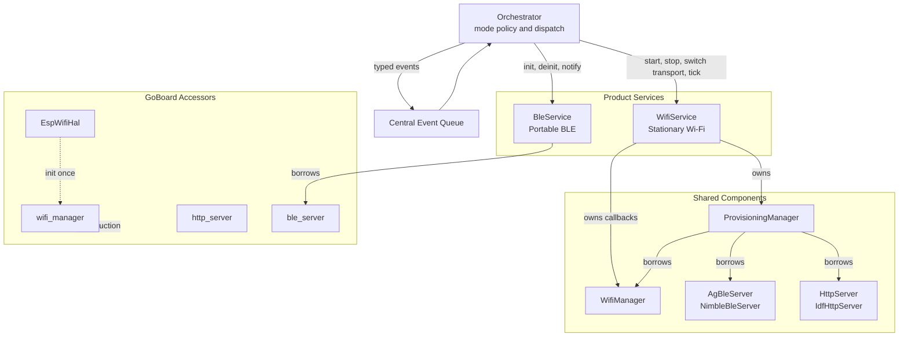
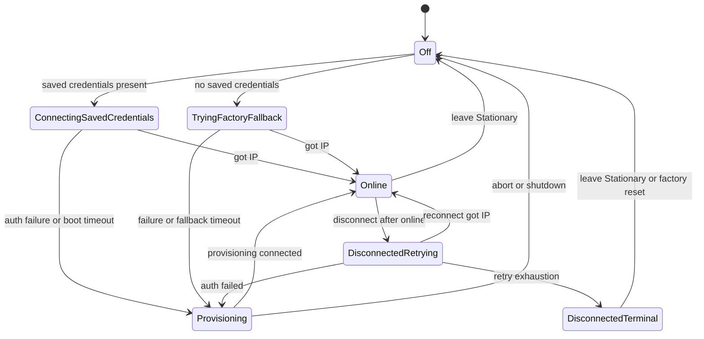

# Stationary Mode Wi-Fi Networking — Implementation Spec

> **This is a spec.** It describes how a feature **will be built**, not what
> currently exists. Once the feature ships, the corresponding doc under
> `docs/` (or the relevant component README) becomes the source of truth and
> this file is typically deleted. See [`docs/STYLE.md`](../../../docs/STYLE.md)
> → "Doc Lifecycle".

Bring up AirGradient Go Stationary mode through the point where Wi-Fi is
online, recoverable, and observable by the product. This spec owns the
Stationary Wi-Fi lifecycle: saved-credential connect, factory-default fallback,
interactive provisioning, credential metadata persistence, network events,
basic network UI state, teardown, and reconnect policy. Cloud posting,
get-config, and any backend transport are explicitly deferred to a separate
follow-up spec.

## Problem

`OperatingMode::Stationary` exists as an enum value, is selectable from the
Settings menu (`go_ui.cpp:728`), is reported over BLE (`go_ble.cpp:1367`), and
is persisted in [`GoSettings::operating_mode`](../main/go_settings.h), but the
runtime is still effectively a placeholder. `Orchestrator::change_mode()`
(`go_orchestrator.cpp:659`) handles only the Portable BLE lifecycle and leaves
Stationary as a future hook (`go_orchestrator.cpp:674`: `// Future:
enable/disable WiFi, HTTP server based on mode`). `BuildContext::wifi_enabled`
is hard-coded to `false` (`go_orchestrator.cpp:1062`).

The shared components needed for Stationary Wi-Fi networking already exist and
are host-tested:

- [`components/airgradient-wifi`](../../../components/airgradient-wifi/README.md)
  ships `WifiManager` with mode state machine, STA retry/backoff, mDNS,
  static IP, and credential pass-through.
- [`components/airgradient-provisioning`](../../../components/airgradient-provisioning/README.md)
  ships `ProvisioningManager` with `BleOnly` / `WifiOnly` / `Both` transports,
  runtime switching, and a single event callback.
- [`components/airgradient-http-server`](../../../components/airgradient-http-server/README.md)
  ships the `IdfHttpServer` used by the Wi-Fi captive portal transport.

A previous broader Stationary attempt failed with two simultaneous failure
modes: radio-side PMF SA-Query disassociation under BT-coexistence scan, and
heap exhaustion from the full Go service stack starving the Wi-Fi management
frame allocator. The component-level coexistence issue is addressed by using a
single active provisioning transport by default. The product-specific heap issue
is addressed by pausing heavy Go services during provisioning and bounded
initial connection windows.

Full failure-mode analysis and heap probes are documented in
[`provisioning_research/GO_PROVISIONING_RESEARCH.md`](../../../provisioning_research/GO_PROVISIONING_RESEARCH.md).
The older full Stationary attempt, including cloud transport, lives in
[`provisioning_research/stationary_mode.md`](../../../provisioning_research/stationary_mode.md).
This spec intentionally stops at Wi-Fi online plus provisioning plus reconnect
policy.

## Goals

- Bring Wi-Fi up automatically on entering Stationary mode when stored
  credentials are present, using a bounded initial-connect window.
- Attempt the factory-default `airgradient` / `cleanair` AP for a bounded 15 s
  upper-bound window when no stored credentials are present, matching the
  Arduino product's first-boot behaviour. Credential-class disconnects
  (`no_ap_found`, `assoc_failed`, `auth_failed`) open provisioning sooner per
  the disconnect policy; the 15 s deadline only fires when the radio is hung
  in handshake or unknown states.
- Open an on-device Provisioning screen with a single active transport
  (`BleOnly` by default, `WifiOnly` selectable by the user) when saved
  credentials fail or the factory-default fallback fails.
- Let the user switch the active provisioning transport between BLE and Wi-Fi
  without leaving Stationary mode.
- Pause `SensorProducer`, `GpsService`, and the PM sensor power rail when
  entering provisioning so the Wi-Fi driver has enough DMA-capable contiguous
  heap while the portal/BLE transport stack is active.
- Surface Wi-Fi and provisioning transitions as typed events on the central
  queue so display, orchestrator, and future cloud consumers can react.
- Persist provisioning metadata (`disable_cloud` and `static_ip`) in
  `GoSettings` while leaving SSID/password ownership to ESP-IDF Wi-Fi NVS.
- Resume paused services and return to normal Stationary Home after Wi-Fi is
  online, with a `Wi-Fi connected` snackbar.
- Keep Stationary responsive during post-online Wi-Fi outages: let
  `WifiManager` retry, show disconnected state, and avoid reopening
  provisioning for ordinary AP/router blips.
- Fall back to Portable mode on non-success provisioning exits (user abort,
  timeout, or teardown before a successful connection) so the device is never
  stranded in a broken provisioning state.
- Cleanly tear down Wi-Fi, provisioning, HTTP portal routes, and borrowed BLE
  ownership when leaving Stationary mode.

## Non-Goals

- Do not run cloud transport. `AgClient::http_post_measures()` and
  `http_fetch_config()` integration are deferred to a separate cloud spec.
- Do not parse fetched-config JSON, apply server-pushed settings, or pull
  schedules from the backend.
- Do not add MQTT, CoAP, cellular, Ethernet, or any non-Wi-Fi transport.
- Do not expose a product-local HTTP API or live-measures endpoint. The HTTP
  server instance is only borrowed by provisioning.
- Do not run BLE and Wi-Fi provisioning transports simultaneously by default.
  The user chooses one active transport at a time to avoid reintroducing the
  coexistence and heap failure surface from the research note.
- Do not change the sensor measurement cadence in Stationary mode. Sensor
  scheduling stays mode-agnostic and is paused only while provisioning needs
  heap headroom.
- Do not modify fast-path or button-wake boot paths. Stationary never sleeps
  and only enters through `run_interactive()` or a mode transition from a
  running orchestrator.
- Do not require a new full Wi-Fi diagnostics screen. This spec adds only the
  minimal Home/status-bar/provisioning UI needed to represent network state.
- Do not implement an outer-loop reconnect scheduler after `WifiManager` retry
  exhaustion in the post-online phase. That is tracked as an open question for a
  later self-healing iteration.
- Do not expose a "re-provision while online" Settings menu entry in this
  iteration. Factory reset remains the supported way to clear known-good stored
  credentials and re-enter provisioning.

## Design

On-the-wire provisioning formats and defaults intentionally match the existing
AirGradient Arduino product where compatibility matters: UUIDs, JSON shapes,
AP SSID style, AP password, BLE advertised name, manufacturer-data layout,
status notification codes, BLE auth flags, and the factory-default fallback
credentials. The reference is `arduino/src/AgWiFiConnector.cpp` in the
AirGradient Arduino tree. Items that deliberately differ are called out inline.

### High-Level Architecture

One new product service, `WifiService`, lives alongside
`BleService`. The service owns Stationary-specific Wi-Fi mechanics and
provisioning callback adapters; the orchestrator owns mode policy and event
dispatch.



The service name is intentionally broader than `ProvisioningService`.
Provisioning is one activity inside the Stationary networking lifecycle, but
the same service also owns saved-credential connect, factory fallback,
post-online disconnect state, and credential clearing.

### Boot Construction Order

In `GoApp::run_interactive()` after `_board.init_core()`, construct or borrow
network dependencies in this order:

```text
1. EspWifiHal &hal           = _board.wifi_hal();       lazy C++ construction only
2. WifiManager &wifi         = _board.wifi_manager();   callbacks bound; mode Off
3. HttpServer  &http         = _board.http_server();    routes owned by provisioning
4. AgBleServer &ble_srv      = _board.ble_server();     single shared BLE server
5. BleService(event_queue, storage, ble_srv);
6. WifiService(event_queue,
                            { wifi, ble_srv, http },
                            wifi_service_config);
7. Other services (sensor, GPS, input, display, storage, power, UI)
8. Orchestrator(event_queue, services_with_wifi_ref, settings, store, serial)
```

`BleService` and `WifiService` borrow the same `AgBleServer`, but
the orchestrator enforces mutual exclusion. Portable mode owns the BLE server
through `BleService`; Stationary provisioning owns it through
`ProvisioningManager`. Mode changes always tear down the outgoing owner before
initialising the incoming owner.

Wi-Fi subsystem init (the expensive ESP-IDF setup — NVS flash init, netif,
event loop, `esp_wifi_init`, storage mode, event handlers, single-shot
timers) is **not** performed by the accessor at step 1 and **not** part of
`_board.init_core()`. It is deferred to `Orchestrator::enter_stationary()`
through a new `_board.init_wifi_subsystem()` board method (see
[Files](#files)). Portable-only boots therefore never pay this cost.
Constructing `WifiManager` against an uninitialized HAL at step 2 is
provably safe: its constructor only registers callbacks via `_hal.set_on_*`,
which are pure `std::function` assignments at
`esp_wifi_hal.cpp:425-442`. No driver call fires until
`enter_stationary()` triggers init and the service's action methods call
`set_mode` / `connect` / etc.

### Files

New files:

| File | Purpose |
|---|---|
| `products/go/main/wifi_service.h` | `WifiService` declaration, dependency/config structs, public action and state APIs |
| `products/go/main/wifi_service.cpp` | Callback adapters, saved-credential connect, factory fallback, provisioning start/stop, timer handling |
| `products/go/main/wifi_service_types.h` | Public event payload and state helper types referenced by `go_events.h` |
| `products/go/tests/wifi_service.tests.cpp` | Host tests using friend-class access and link-time stubs |

Modified files:

| File | Change |
|---|---|
| `products/go/main/go_board.h` | Add `wifi_hal()`, `wifi_manager()`, `http_server()`, and `ble_server()` accessors. Add `init_wifi_subsystem()` to the existing fine-grained `init_*()` family. Deliberately NOT called by `init_core()`; mode-conditional callers invoke it explicitly |
| `products/go/main/go_hardware_board.{h,cpp}` | Implement lazy member-owned `EspWifiHal`, `WifiManager`, `IdfHttpServer`, and `NimbleBleServer`. Implement `init_wifi_subsystem()` to call `EspWifiHal::init()` once, guarded by a board-layer `_wifi_inited` flag on top of the HAL's own idempotency check |
| `products/go/main/go_ble.{h,cpp}` | Refactor `BleService` constructor to take `AgBleServer &` |
| `products/go/main/go_events.h` | Add Wi-Fi and provisioning event types and payload union members |
| `products/go/main/go_settings.{h,cpp}` | Add `disable_cloud` and `static_ip` NVS round-trip |
| `products/go/main/go_display.h` | Add `Screen::Provisioning`; add minimal Wi-Fi/provisioning display values |
| `products/go/main/go_display.cpp` | Render Provisioning screen and status-bar Wi-Fi state |
| `products/go/main/go_ui.{h,cpp}` | Add `UIAction::AbortProvisioning` and `UIAction::SwitchProvisioningTransport`; add provisioning-screen dispatch and status setters that emit them |
| `products/go/main/go_orchestrator.{h,cpp}` | Wire Stationary network lifecycle, events, timers, disconnect policy, pause/resume, `BuildContext::wifi_enabled`, and factory reset |
| `products/go/main/go_app.cpp` | Construct and wire shared radio objects plus `WifiService` |
| `products/go/main/CMakeLists.txt`, `products/go/main/idf_component.yml` | Add new sources and dependencies on Wi-Fi/provisioning/HTTP server components |
| `products/go/tests/CMakeLists.txt` | Register new host tests and update existing ctor signatures |
| `products/go/tests/go_app_stubs.cpp`, `go_orchestrator_stubs.cpp` | Add stubs for network service and shared components |
| `products/go/tests/go_ble.tests.cpp` | Pass a stub `AgBleServer &` into `BleService` |

### Event Types

Added to [`go_events.h`](../main/go_events.h):

| EventType | Payload | Producer |
|---|---|---|
| `WifiConnected` | `uint32_t wifi_ip` in network byte order | `WifiService` from `WifiManager::on_got_ip` |
| `WifiDisconnected` | `uint8_t wifi_disconnect_reason` (`WifiDisconnectReason`) | `WifiService` from `WifiManager::on_disconnected` or boot-window timeout |
| `ProvisioningStateChanged` | `ProvisioningEventPayload prov` | `WifiService` from `ProvisioningManager` callback |

The provisioning payload carries all data the orchestrator needs at dispatch
time:

```cpp
struct ProvisioningEventPayload {
  uint8_t  event;               // ProvisioningEvent enum value
  uint8_t  transport;           // ProvisioningTransport enum value
  uint8_t  stop_reason;         // ProvisioningStopReason enum value
  uint32_t ip;
  bool     disable_cloud;
  WifiStaticIpConfig static_ip; // zeroed when user picked DHCP
};
```

`ProvisioningEvent::Connected` carries `disable_cloud` and `static_ip` inline
so the orchestrator can persist them without querying service state after the
event. `static_ip` is zeroed when the user selected DHCP so stale static-IP
settings are cleared on re-provisioning.

### Settings

Add these fields to [`GoSettings`](../main/go_settings.h) and persist them
through `load_go_settings()` / `save_go_settings()`:

```cpp
struct GoSettings {
  // ... existing fields ...

  // --- Stationary connectivity ---
  bool disable_cloud = false;       // honored by future cloud transport
  WifiStaticIpConfig static_ip{};   // zeroed means DHCP
};
```

SSID and password remain owned by ESP-IDF Wi-Fi NVS through
`esp_wifi_set_config()` as used by `WifiManager` / `ProvisioningManager`.
The product persists only metadata that ESP-IDF Wi-Fi does not own.

Transport selection is not persisted. Every Stationary provisioning entry
starts with `ProvisioningTransport::BleOnly`; the user can switch to Wi-Fi for
that session.

### Constants And Derived Values

Hard-coded constants live as `static constexpr` values in
`wifi_service.cpp` unless they later prove worth promoting to
settings.

| Constant | Value | Notes | Reference |
|---|---|---|---|
| `INITIAL_CONNECT_WINDOW_MS` | `30'000` | Saved-credentials initial-connect timeout | Arduino uses `WIFI_CONNECT_COUNTDOWN_MAX 180`, but this product bounds initial Stationary connect at 30 s |
| `FALLBACK_CONNECT_WINDOW_MS` | `15'000` | Factory-default fallback upper bound; `no_ap_found`, `assoc_failed`, and `auth_failed` open provisioning sooner per the disconnect policy | Arduino default fallback path around `AgWiFiConnector.cpp:65` / `:538` |
| `STATIONARY_MAX_RETRY_COUNT` | `5` | `WifiStaConfig::max_retry_count` for saved credentials | New bounded AGo policy |
| `STATIONARY_AP_PASSWORD` | `"cleanair"` | Provisioning AP password, matching Arduino | `AgWiFiConnector.cpp:19` |
| `STATIONARY_FALLBACK_SSID` | `"airgradient"` | Factory-default fallback SSID | `AgWiFiConnector.cpp:65` / `:538` |
| `STATIONARY_FALLBACK_PASSWORD` | `"cleanair"` | Factory-default fallback password | `AgWiFiConnector.cpp:65` / `:538` |
| `STATIONARY_OVERALL_TIMEOUT_MS` | `0` | Provisioning overall timeout disabled | New AGo policy |
| `STATIONARY_AGO_MODEL_CODE` | `"P-1PSG"` | BLE manufacturer data and DIS Model Number | `AgWiFiConnector.cpp:782-788` |

Runtime-derived values are built once from `GoBoard::serial_number()`:

| Identifier | Value | Reference |
|---|---|---|
| Provisioning AP SSID | `"airgradient-" + serial_number()` using the full 12-hex MAC | `AgWiFiConnector.cpp:556` |
| BLE advertised device name | literal `"AirGradient"` | `AgWiFiConnector.cpp:743` |
| BLE manufacturer data payload | `"P-1PSG#" + serial_number()` after the `0xFFFF` company ID prefix | `AgWiFiConnector.cpp:782-788` |
| BLE auth flags | `AgBleAuth::SC` only, no BOND and no MITM | `AgWiFiConnector.cpp:747` |

AGo's `GoApp::run_interactive()` populates `ble_serial_number` and
`ble_manufacturer_data` from `_board.serial_number()`, `ble_firmware_version`
from `_board.firmware_version()`, and the `ble_model_name` / model-code values
from `STATIONARY_AGO_MODEL_CODE`.

### WifiService API

The service owns Wi-Fi/provisioning mechanics and state mirrors. It does not
own mode policy, UI policy, cloud transport, or settings persistence.

```cpp
class WifiService {
public:
  struct Deps {
    WifiManager &wifi;
    AgBleServer &ble;
    HttpServer  &http;
  };

  struct Config {
    const char *ap_ssid;
    const char *ap_password = "cleanair";
    uint8_t     ap_channel = 1;

    const char *ble_device_name = "AirGradient";
    const char *ble_model_name;
    const char *ble_serial_number;
    const char *ble_firmware_version;
    const char *ble_manufacturer_data;
    uint8_t     ble_auth_flags = AgBleAuth::SC;

    uint32_t    initial_connect_window_ms = 30'000;
    const char *fallback_ssid = "airgradient";
    const char *fallback_password = "cleanair";
    uint32_t    fallback_connect_window_ms = 15'000;
  };

  WifiService(RtosQueueHandle event_queue,
                           const Deps &deps,
                           const Config &cfg);
  ~WifiService();

  WifiService(const WifiService &) = delete;
  WifiService &operator=(const WifiService &) = delete;

  bool has_saved_credentials() const;

  void connect_with_saved_credentials(const WifiStaticIpConfig *static_ip = nullptr);
  void try_default_fallback_credentials();

  void start_provisioning(ProvisioningTransport transport = ProvisioningTransport::BleOnly);
  void switch_provisioning_transport();
  void stop_provisioning();

  void shutdown();
  void clear_credentials();

  bool is_online() const;
  bool is_connecting() const;
  bool is_provisioning() const;
  ProvisioningTransport current_transport() const;
  uint32_t ip() const;
  int rssi() const;
  WifiDisconnectReason last_disconnect_reason() const;
  bool has_been_online() const;

  uint32_t next_deadline_ms() const;
  void tick(uint32_t now_ms);
};
```

`is_connecting()` is true while the saved-credentials or factory-fallback
deadline is armed and the service has not yet observed `on_got_ip`.
`has_been_online()` is the disconnect-policy gate: it latches true after the
first IP event for the current attempt and resets on fresh connection attempts,
shutdown, and credential clearing.

`stop_provisioning()` blocks for approximately 1.5 s when called after
`ProvisioningEvent::Connected`, matching the shared component's captive-portal
success hold before teardown. It returns without that hold from other states.
Account for this when dispatching `ProvisioningStateChanged(Connected)` and
when leaving Stationary during an active provisioning session.

`start_provisioning()` calls `_wifi.disconnect()` unconditionally before
handing Wi-Fi callbacks to `ProvisioningManager`. The call is idempotent per
`wifi_manager.cpp:230-246`: a Disconnected state returns Ok without side
effects; an in-flight Connecting state has its retry timer cancelled and its
driver-echo disconnect swallowed via `_disconnect_requested`. No stale
`WifiDisconnected` leaks to the orchestrator after the callback hand-off, and
the synthetic `requested_by_user` event emitted by `disconnect()` is already
ignored by the disconnect policy.

`start_provisioning()` also zeros `_initial_connect_deadline_ms` and
`_clear_deadline_pending` before installing provisioning callbacks. This
closes a race where a fast credential-class fail (`auth_failed`,
`no_ap_found`, etc.) during `connect_with_saved_credentials()` or
`try_default_fallback_credentials()` triggers the disconnect policy to open
provisioning before the original deadline expired. Without the zero, a later
`tick()` would still see the armed deadline and synthesize a stale
`WifiDisconnected{connection_lost}` mid-provisioning, breaking mode policy.

The same invariant applies to every other deadline transition:
`shutdown()` zeros the deadline so a mode-switch out of Stationary cannot
leave a stale armed deadline behind; `connect_with_saved_credentials()` and
`try_default_fallback_credentials()` both zero before re-arming, so the
service has at most one armed deadline at any time. This makes
`_initial_connect_deadline_ms` single-writer in the same way
`_clear_deadline_pending` already is.

### BLE Security Cross-Mode Behaviour

Provisioning BLE uses `NO_INPUT_NO_OUTPUT` plus `AgBleAuth::SC` only: encrypted
Secure Connections, Just Works pairing, no BOND, and no MITM. This matches the
Arduino provisioning behaviour (`AgWiFiConnector.cpp:747`) and avoids creating
long-lived phone-side bonds during one-shot Wi-Fi onboarding.

Portable BLE keeps `DISPLAY_ONLY` plus `BOND | MITM`: the AGo screen shows a
passkey, the phone verifies it, and the companion session can reuse the
persistent bond. The asymmetry is intentional because provisioning and Portable
BLE serve different user flows.

| Scenario | Expected Behaviour |
|---|---|
| First use in Portable mode | Phone asks for the displayed passkey and creates an authenticated bond. |
| Stationary provisioning first, then Portable pairing | Provisioning completes with Just Works and no stored bond; first Portable use still asks for the passkey and creates the first real bond. |
| Portable pairing first, then Stationary provisioning | Existing authenticated bond may be reused by the phone stack; provisioning does not weaken or replace it. |
| Portable → Stationary → Portable | Portable bond remains valid because Stationary provisioning does not clear BLE bonding data. |
| Factory reset | Clears Wi-Fi credentials and product metadata as specified here; BLE bond clearing remains governed by existing Portable factory-reset behaviour. |

### Network States

The implementation may expose booleans rather than a stored state enum, but the
intended lifecycle is:



The key policy is the split between initial bring-up and post-online outage.
Before the first successful IP, credential-class failures open provisioning.
After the first successful IP, ordinary outages stay in Stationary and rely on
`WifiManager` retry or user recovery.

`TryingFactoryFallback` applies the same before-first-online disconnect policy
as `ConnectingSavedCredentials`. Credential-class disconnects open
provisioning as soon as they arrive; the 15 s deadline is an upper bound on
how long the device sits in fallback before the policy synthesizes
`connection_lost` and forces a transition.

### Callback Ownership

`ProvisioningManager::start()` installs its own callbacks on the borrowed
`WifiManager`; `stop()` clears them. Two services cannot own the same callback
slot.

The rule is:

- `ProvisioningManager` owns Wi-Fi callbacks during an active provisioning
  session.
- `WifiService` owns `on_got_ip` and `on_disconnected` at all
  other times.
- `ProvisioningManager::set_on_event()` is installed once by
  `WifiService` and stays installed for the lifetime of the
  service.

During provisioning, `ProvisioningEvent::Connected` is the online transition.
The service updates its atomics from that event and posts
`ProvisioningStateChanged(Connected)`; it does not also post `WifiConnected`
because provisioning owns the Wi-Fi callback slot at that moment.

Implementation detail: the service uses a private `_install_wifi_callbacks()`
helper that binds the `on_got_ip` and `on_disconnected` adapters to
`WifiManager`. It is called from the constructor and again after
`stop_provisioning()` returns, unless the service is transitioning to Idle.
The `on_got_ip` adapter cannot clear `_initial_connect_deadline_ms` directly
because the Wi-Fi event task races with `tick()` reads from the orchestrator
stack. Instead, it sets `_clear_deadline_pending`; the next `tick()` from
`check_timers()` consumes that latch and clears the deadline so deadline writes
remain single-writer.

### Entry Flow

`Orchestrator::enter_stationary()` selects one of two mutually-exclusive
connection attempts. Saved-credential and factory-fallback connections are
STA-only, so they do not pause sensors or power rails.

1. Saved credentials present: connect with saved credentials for up to 30 s.
2. No saved credentials: try factory-default `airgradient` / `cleanair` for
   up to 15 s, without writing credentials to NVS (uses `WifiStaConfig::persist
   = false` per Prereq B).

Provisioning opens only after the chosen attempt fails or times out.

```cpp
void Orchestrator::enter_stationary() {
  // Idempotent: cheap no-op on warm Stationary re-entry. Portable-only
  // boots never reach this line, so Wi-Fi NVS / netif / event loop /
  // esp_wifi_init / event handlers / timers are paid for only on the
  // first Stationary entry of the device's runtime.
  _board.init_wifi_subsystem();

  if (_svc.wifi.has_saved_credentials()) {
    const WifiStaticIpConfig *ip =
        _settings.static_ip.ip != 0 ? &_settings.static_ip : nullptr;
    _svc.ui_manager.set_network_status("Connecting with saved Wi-Fi...");
    _svc.wifi.connect_with_saved_credentials(ip);
  } else {
    _svc.ui_manager.set_network_status("Trying default Wi-Fi...");
    _svc.wifi.try_default_fallback_credentials();
  }
}
```

The factory fallback is single-shot per Stationary entry. If it fails, the
device opens provisioning; it does not retry the factory AP later in the same
boot.

Provisioning entry is the first memory-sensitive networking path. The
orchestrator pauses heavy services immediately before starting the active
provisioning transport:

```cpp
void Orchestrator::open_provisioning_screen(ProvisioningTransport transport) {
  pause_network_sensitive_services();
  _svc.ui_manager.set_provisioning_transport(transport);
  _svc.ui_manager.set_provisioning_status(initial_status_for(transport));
  _svc.ui_manager.set_screen(Screen::Provisioning);
  _svc.wifi.start_provisioning(transport);
  update_display();
}
```

### Provisioning Flow

Provisioning starts on `BleOnly`. The Provisioning screen lets the user switch
to `WifiOnly` using back-to-back component stop/start. `Both` remains supported
by the shared component but is not used by the product in this iteration.

```text
open_provisioning_screen(BleOnly)
  set screen Provisioning
  set status "BLE: AirGradient"
  network.start_provisioning(BleOnly)

switch transport
  set transient status "Switching to Wi-Fi..." or "Switching to BLE..."
  network.switch_provisioning_transport()

ProvisioningEvent Connected
  persist disable_cloud and static_ip
  network.stop_provisioning()
  resume paused services and request one immediate measurement
  set screen Home
  show "Wi-Fi connected"
```

Provisioning BLE uses Just Works Secure Connections with no bonding and no
MITM. Portable mode BLE keeps its stronger display-passkey, MITM, bonded
behaviour. This avoids creating long-lived phone-side bonds during one-shot
Wi-Fi onboarding while preserving Portable's authenticated companion-app
session.

### Transport Switching

`WifiService::switch_provisioning_transport()` is implemented as
back-to-back component stop / start with a service-internal latch that hides
the intermediate `Stopped` event from the orchestrator. Without the latch the
orchestrator would interpret the switch-internal `Stopped` as a user abort and
run `change_mode(Portable)`, breaking transport switching entirely.

Sequence:

1. Set `_switching_transport = true`.
2. Call `_prov.stop(stop_http_server = false)`. `stop_http_server = false`
   keeps the borrowed HTTP server up so the product does not pay a
   bind / unbind cycle while flipping transports.
3. Call `_prov.start(other_transport, ...)`.
4. **On success:** clear `_switching_transport`. The orchestrator sees
   `Started` on the new transport but never sees `Stopped`. The UI shows the
   transient `"Switching to ..."` status string between the old transport's
   teardown and the new transport's `Started`.
5. **On `_prov.start()` failure:** clear `_switching_transport`, then
   synthesize a `ProvisioningStateChanged(Stopped, stop_reason =
   ProductRequested)` to the orchestrator. The orchestrator's existing
   "Stopped before online → `change_mode(Portable)`" rule takes over so the
   user is never stranded on the Provisioning screen with no active
   transport. The user can re-enter Stationary from the Settings menu to
   start a fresh provisioning session.

Event-forwarding rules while `_switching_transport == true`:

| Event from `ProvisioningManager` | Forward to orchestrator? |
|---|---|
| `Started` | Yes (signals new transport is up) |
| `Connecting` | Yes |
| `ConnectFailed` | Yes (defensive: credential submit between stop and start) |
| `Connected` | Yes (defensive, same reason) |
| `Stopped` | **No** — swallowed |

The latch lifetime is bounded by `switch_provisioning_transport()`. The
service does not hold the latch across any external suspension point.

### Lifecycle Sequence — No-Creds Flow

This is the no-saved-credentials path when the factory-default AP is not in
range. It shows the intended policy ordering: fallback STA connect runs without
pausing heavy services, and pausing happens only when provisioning opens.

```mermaid
sequenceDiagram
    participant Orch as Orchestrator
    participant Wifi as WifiService
    participant UI as UI Display
    participant WM as WifiManager
    participant Prov as ProvisioningManager
    participant User as User Phone

    Orch->>Wifi: has_saved_credentials()
    Wifi-->>Orch: false
    Orch->>UI: set status "Trying default Wi-Fi..."
    Orch->>Wifi: try_default_fallback_credentials()
    Note over Wifi: connect to airgradient plus cleanair, 15 s window, no NVS write
    Wifi-->>Orch: WifiDisconnected connection_lost synthetic timeout
    Orch->>Orch: apply_disconnect_policy before first online
    Orch->>Orch: pause_network_sensitive_services()
    Orch->>UI: open Provisioning screen (BLE)
    Orch->>Wifi: start_provisioning(BleOnly)
    Wifi->>WM: disconnect (cancel in-flight STA)
    Wifi->>Prov: start(BleOnly)
    User->>UI: switch to Wi-Fi transport
    Orch->>Wifi: switch_provisioning_transport()
    Wifi->>Prov: stop(BleOnly)
    Wifi->>Prov: start(WifiOnly)
    Note over Prov: AP airgradient-12hex; password cleanair
    User->>Prov: submit credentials
    Prov-->>Wifi: Provisioning connected event
    Wifi-->>Orch: ProvisioningStateChanged(Connected)
    Orch->>Orch: persist disable_cloud + static_ip
    Orch->>Wifi: stop_provisioning()
    Note over Wifi: ~1.5 s success hold before teardown
    Orch->>Orch: resume_network_sensitive_services()
    Orch->>UI: Home + "Wi-Fi connected"
```

### Disconnect Policy

The policy gate is `WifiService::has_been_online()`.

| Reason | Before First Online | After First Online |
|---|---|---|
| `auth_failed` | Open provisioning. | Open provisioning. |
| `no_ap_found` | Open provisioning. | Stay disconnected and let `WifiManager` retry/exhaust. |
| `assoc_failed` | Open provisioning. | Stay disconnected. |
| `dhcp_failed` | Open provisioning. | Stay disconnected. |
| `connection_lost` | Open provisioning, including synthetic timeout. | Stay disconnected. |
| `ap_disconnected` | Stay until timeout may synthesize `connection_lost`. | Stay disconnected. |
| `handshake_failed` | Stay until timeout may synthesize `connection_lost`. | Stay disconnected. |
| `unknown` | Stay until timeout may synthesize `connection_lost`. | Stay disconnected. |
| `requested_by_user` | Ignore. | Ignore. |

`auth_failed` always opens provisioning because the stored credentials are no
longer trustworthy. Other credential-class failures open provisioning only
before the first successful IP. After the device has been online once, AP and
router outages are treated as recoverable Stationary conditions. The device
does not fall back to Portable simply because Wi-Fi is temporarily down.
`requested_by_user` is ignored because the service's own `disconnect_sta()` /
`shutdown()` path fires that reason; it is not an external failure.

When `WifiManager` exhausts its retry count after the device has already been
online, the product stays in Stationary and displays disconnected state. User
recovery for the MVP is mode switch, factory reset, or reboot. An outer-loop
retry scheduler is intentionally deferred.

### Timer Integration

The service owns connection-window deadlines; the orchestrator only drives the
clock.

```cpp
uint32_t Orchestrator::compute_queue_timeout_ms() const {
  uint32_t wifi_deadline = _svc.wifi.next_deadline_ms();
  if (wifi_deadline != 0) {
    next = std::min(next, wifi_deadline - now);
  }
  return next;
}

void Orchestrator::check_timers() {
  _svc.wifi.tick(static_cast<uint32_t>(RTOS::get_time_ms()));
}
```

`tick(now_ms)` clears a successful connection deadline when the Wi-Fi callback
has latched `_clear_deadline_pending`. If the deadline expires before any IP is
observed, it posts synthetic `WifiDisconnected{connection_lost}` so the normal
disconnect policy opens provisioning.

### UI Behaviour

Minimal network UI is included so the device state is visible without a cloud
consumer:

- The status-bar Wi-Fi icon is driven by `WifiService::is_online()`
  while in Stationary mode.
- Replace the hardcoded `BuildContext::wifi_enabled = false` at
  `go_orchestrator.cpp:1062` with `_svc.wifi.is_online()` while `_mode ==
  OperatingMode::Stationary`; keep `false` in Portable and Offline modes.
- During saved-credentials connect, UI status is `Connecting with saved Wi-Fi...`.
- During factory fallback, UI status is `Trying default Wi-Fi...`.
- On the first online transition for the current Stationary entry
  (`WifiConnected` or `ProvisioningEvent::Connected`), the screen returns to
  Home if needed and shows `Wi-Fi connected`.
- On post-online disconnect, Home remains active and only the status-bar Wi-Fi
  icon changes state. No snackbar fires on disconnect, retry exhaustion, or
  auto-reconnect, and Home does not gain a persistent Wi-Fi status line.
- On retry exhaustion, Home remains active with the Wi-Fi icon disconnected.
- The Provisioning screen shows transport-specific instructions and an `Abort`
  row.

Provisioning screen input grammar:

| Input | Action |
|---|---|
| TouchUp / TouchDown | Move selection, skipping the active transport row |
| TouchEnter on inactive transport | `UIAction::SwitchProvisioningTransport` → `_svc.wifi.switch_provisioning_transport()` |
| TouchEnter on active transport | No-op |
| TouchEnter on `Abort` | `UIAction::AbortProvisioning` → `change_mode(Portable)` |
| ButtonPower short-press | Suppress lock toggle on Provisioning screen |
| ButtonPower long-press | Shutdown unchanged |
| ButtonBoot long-press | Factory reset unchanged |

The `UIAction` enum in [`go_ui.h`](../main/go_ui.h) gains two values:

```cpp
enum class UIAction : uint8_t {
  None,
  StartTracking,
  StopTracking,
  ChangeMode,
  SettingsChanged,
  ClearData,
  CalibrateCo2,
  SaveTag,
  AbortProvisioning,           // new
  SwitchProvisioningTransport, // new
};
```

`UIActionResult` does not gain new payload fields. The orchestrator dispatch
loop at `go_orchestrator.cpp:562` gains two `case` arms:

- `AbortProvisioning` → `change_mode(OperatingMode::Portable)`.
- `SwitchProvisioningTransport` → `_svc.wifi.switch_provisioning_transport()`.
  No payload is needed because `_svc.wifi.current_transport()` exposes the
  active transport for status-string updates and screen rendering.

### Service Pause And Resume

Stationary pauses heap-heavy services only when entering provisioning.
Saved-credential connect and factory fallback are STA-only and do not start the
SoftAP, captive portal HTTP/DNS routes, or NimBLE provisioning transport, so
they keep sensors and PM power running. If a saved-credential or fallback
attempt fails and the disconnect policy opens provisioning, the pause happens
inside `open_provisioning_screen()` before `start_provisioning()`.

```cpp
void Orchestrator::pause_network_sensitive_services() {
  if (_network_services_paused) return;
  _svc.sensor_producer.stop();
  if (is_gps_active()) {
    _svc.gps_service.stop_and_idle_gnss();
  }
  _svc.power_service.set_pm_power(false);
  _network_services_paused = true;
}

void Orchestrator::resume_network_sensitive_services() {
  if (!_network_services_paused) return;
  _svc.power_service.set_pm_power(true);
  _svc.sensor_producer.start();
  if (is_gps_active()) {
    _svc.gps_service.start();
  }
  _network_services_paused = false;
  _svc.sensor_producer.request_measurement(1, SensorGroup::All);
}
```

Services resume on successful Wi-Fi online or when Stationary is torn down.
They stay paused while the Provisioning screen is active. The immediate
measurement request runs only on a real pause-to-resume transition because the
function returns early when `_network_services_paused` is already false.

### Mode Change And Teardown

`Orchestrator::Services` gains an explicit reference to the Stationary network
service so the mode policy can drive networking without reaching through board
objects:

```cpp
struct Services {
  // ... existing fields ...
  BleService  &ble_service;
  WifiService &wifi;
};
```

`change_mode()` uses strict two-phase ordering: tear down the outgoing mode,
then bring up the incoming mode.

```cpp
void Orchestrator::change_mode(OperatingMode new_mode) {
  OperatingMode old_mode = _mode;
  _mode = new_mode;
  _settings.operating_mode = new_mode;
  save_go_settings(_config_store, _settings);

  if (old_mode == OperatingMode::Portable && new_mode != OperatingMode::Portable) {
    _svc.ui_manager.dismiss_pairing_passkey();
    _svc.ble_service.deinit();
  }

  if (old_mode == OperatingMode::Stationary && new_mode != OperatingMode::Stationary) {
    _svc.wifi.shutdown();
    resume_network_sensitive_services();
  }

  if (new_mode == OperatingMode::Portable && old_mode != OperatingMode::Portable) {
    init_ble_if_portable();
  }

  if (new_mode == OperatingMode::Stationary && old_mode != OperatingMode::Stationary) {
    enter_stationary();
  }

  update_display();
}
```

`WifiService::shutdown()` stops provisioning if active, clears
HTTP portal routes through `ProvisioningManager::stop()`, drops STA, sets Wi-Fi
mode Off, detaches callbacks, and resets online latches.

Cold boot uses `Orchestrator::init()` as the equivalent entry point. After the
existing `init_ble_if_portable()` check, the orchestrator inspects
`_settings.operating_mode`; if it is `OperatingMode::Stationary`, it calls
`enter_stationary()`. The `change_mode()` Phase 1 / Phase 2 ordering does not
apply to cold boot because there is no outgoing mode to tear down.

Cold-boot Portable never calls `_board.init_wifi_subsystem()` — the Wi-Fi
ESP-IDF stack stays uninitialized for the lifetime of that boot.
Cold-boot Stationary initializes it inside `enter_stationary()` (the same
trigger as a warm `change_mode(Stationary)` from Portable). Warm
Stationary → Portable does not deinit the Wi-Fi stack; it leaves the HAL
initialized but `WifiMode::Off`, so a subsequent warm Portable → Stationary
hits the HAL-layer idempotency check and pays no init cost.

### Factory Reset And Credential Clearing

Factory reset clears both ESP-IDF Wi-Fi credentials and product-owned metadata:

- `WifiService::clear_credentials()` calls
  `WifiManager::clear_saved_credentials()` or the equivalent component API.
- `_settings.disable_cloud` resets to `false`.
- `_settings.static_ip` resets to zeroed DHCP state.
- `has_been_online()` resets to false.

After reset and reboot into Stationary, the device has no saved credentials and
therefore runs the factory-default fallback path before opening provisioning.

## Prerequisites

Three shared-component API changes must land before Checkpoint 2. Each one is a
real component edit outside this product spec; the spec depends on the
contracts named here.

### Prereq A — `airgradient-wifi` Saved-Credential Connect

`WifiManager::connect(const WifiStaConfig &config)` is extended so that
`config.ssid[0] == '\0'` means "use NVS-saved credentials":

1. `WifiManager::connect()` first calls `_hal.has_saved_credentials()`. If
   false, it returns `WifiStatus::NotFound` immediately without touching
   driver state.
2. Otherwise it forwards to the HAL connect form with empty SSID. The HAL
   skips `esp_wifi_set_config()` and calls `esp_wifi_connect()` directly,
   letting ESP-IDF auto-connect from NVS.
3. Retry / backoff fields (`max_retry_count`, `initial_retry_interval_ms`,
   `max_retry_interval_ms`) in `config` still apply because they are
   product-policy state owned by `WifiManager`, not the HAL.

`WifiManager::has_saved_credentials() const -> bool` is added and delegates
to `_hal.has_saved_credentials()`, so callers can branch between saved-creds
and fallback paths without an attempted connect.

Required lower-level changes:

- `enum class WifiStatus` in `wifi_types.h` gains a `NotFound` member.
- `WifiHal::has_saved_credentials() const -> bool` added as a new virtual
  method. `EspWifiHal` implements it via `esp_wifi_get_config(WIFI_IF_STA,
  &cfg)` and returns `cfg.sta.ssid[0] != '\0'`. The host mock returns a
  configurable bool so tests can drive both branches.
- The HAL `connect_sta` signature gains an empty-SSID branch — merged
  signature defined in Prereq B.

Documentation: `wifi_manager.h` and the `WifiStaConfig` declaration in
`wifi_types.h` both document the empty-SSID convention. The existing
reject-empty-SSID check at `wifi_manager.cpp:214` becomes "return
`WifiStatus::NotFound` when SSID is empty and the HAL reports no saved
credentials; otherwise proceed to the empty-SSID HAL connect path."

`WifiService::connect_with_saved_credentials()` builds a
`WifiStaConfig` with `ssid` left empty, `max_retry_count =
STATIONARY_MAX_RETRY_COUNT`, default backoffs, optional static IP, and calls
`WifiManager::connect()`. The status string stays generic
(`"Connecting with saved Wi-Fi..."`) because the saved SSID is not read out by
this API; a future `WifiManager::get_saved_ssid()` helper is orthogonal and
may be added later without touching `connect()`.

### Prereq B — `airgradient-wifi` Transient (Non-Persistent) Connect

`WifiStaConfig::persist = true` field is added. The default preserves current
behaviour for every existing caller.

Required HAL signature change:

```cpp
virtual WifiStatus connect_sta(const char *ssid,
                               const char *password,
                               bool persist = true) = 0;
```

The default `persist = true` keeps every existing caller (reference product,
host tests) source- and behaviour-compatible.

`EspWifiHal::connect_sta()` semantics:

- If `ssid == nullptr` or `ssid[0] == '\0'`: skip `esp_wifi_set_config()`
  and call `esp_wifi_connect()` directly so ESP-IDF uses NVS-saved
  credentials. `persist` is ignored in this path because nothing is being
  written.
- Else if `persist == false`: toggle
  `esp_wifi_set_storage(WIFI_STORAGE_RAM)` immediately before
  `esp_wifi_set_config()` and restore `WIFI_STORAGE_FLASH` immediately
  after. The set_config call writes RAM only and never touches NVS.
- Otherwise: current behaviour — `esp_wifi_set_config()` followed by
  `esp_wifi_connect()` against the default `WIFI_STORAGE_FLASH` setting.

Constraint: `esp_wifi_set_storage` is global driver state. The RAM / FLASH
toggle around `esp_wifi_set_config` must not interleave with any other
`esp_wifi_set_config` call. AGo's single-threaded mode-transition path
satisfies this; future callers must keep the toggle bounded to a single
set_config call inside `connect_sta()`.

`WifiManager::connect()` forwards `config.persist` into the HAL call.
`WifiService::try_default_fallback_credentials()` sets `persist =
false`. A WifiHal host test asserts NVS contents are unchanged after a
fallback round-trip.

### Prereq C — `airgradient-provisioning` BLE Auth Flags

`ProvisioningBleConfig::auth_flags` (default `AgBleAuth::BOND | AgBleAuth::SC`
for back-compat) and `ProvisioningBleConfig::io_capability` (default
`AgBleIoCapability::NO_INPUT_NO_OUTPUT`) are added. `ble_transport.cpp:180`
reads from config instead of the hard-coded `BOND | SC`. Existing
`ble_transport.tests.cpp` keeps its `BOND | SC` scenario and gains an SC-only
scenario for AGo's contract.

AGo sets `auth_flags = AgBleAuth::SC` (no BOND, no MITM) and `io_capability =
NO_INPUT_NO_OUTPUT`, matching Arduino `AgWiFiConnector.cpp:747`
(`setSecurityAuth(false, false, true)`).

## Implementation Plan

Implementation is split into three checkpoints so each layer can be validated
on hardware before the next one builds on top.

### Checkpoint 1 — Board And BLE Refactor

Introduce shared radio ownership without changing user-visible behaviour.

Files modified:

- `products/go/main/go_board.h` — add radio accessors.
- `products/go/main/go_hardware_board.{h,cpp}` — implement lazy
  member-owned Wi-Fi HAL, Wi-Fi manager, HTTP server, and BLE server.
- `products/go/main/go_ble.{h,cpp}` — make `BleService` borrow
  `AgBleServer &`.
- `products/go/main/go_app.cpp` — pass `_board.ble_server()` into
  `BleService` in interactive and button-wake paths.
- Build/test stubs and `go_ble.tests.cpp` — update constructor signatures.

Acceptance criteria:

- Firmware build for `products/go` succeeds.
- Native host test build and relevant tests pass.
- On hardware in Portable mode, existing BLE pairing, measure readout, config
  writes, and history download are unchanged.
- Portable → Stationary → Portable mode toggle does not crash even though
  Stationary networking is not active yet.
- Portable-only boots do not call `EspWifiHal::init()`. The Wi-Fi ESP-IDF
  stack stays uninitialized for the lifetime of those boots (verified via a
  host-test counter or hardware heap probe before / after boot in Portable
  mode).

### Checkpoint 2 — Stationary Network Bring-Up And Provisioning

Add `WifiService`, events, settings, Provisioning screen,
orchestrator wiring, service pause/resume, saved credentials, factory fallback,
and successful online path.

Files added:

- `products/go/main/wifi_service.{h,cpp}`
- `products/go/main/wifi_service_types.h`
- `products/go/tests/wifi_service.tests.cpp`

Files modified:

- `go_events`, `go_settings`, `go_display`, `go_ui`, `go_orchestrator`,
  `go_app`, build files, and host stubs as listed in [Files](#files).

Acceptance criteria:

- Firmware build for `products/go` succeeds.
- Native host test build and relevant tests pass.
- No saved creds and no factory AP in range: within at most 15 s (the
  fallback upper-bound window), Provisioning opens on BLE, phone submits
  credentials, device reaches Home with `Wi-Fi connected`, and services
  resume.
- No saved creds and factory `airgradient` / `cleanair` AP in range: device
  connects within 15 s, shows `Wi-Fi connected`, and never opens Provisioning.
  No credentials are written to NVS by this fallback, and heavy services are
  not paused.
- First Stationary entry calls `_board.init_wifi_subsystem()` before
  `has_saved_credentials()`; subsequent re-entries skip the actual ESP-IDF
  init via the board-layer and HAL-layer idempotency guards.
- Saved valid credentials: Stationary boots directly to online Home without
  showing Provisioning.
- Saved invalid credentials: `auth_failed` opens Provisioning within the 30 s
  saved-credentials window.
- Provisioning transport switch BLE → Wi-Fi shows transient switching status,
  starts AP `airgradient-<12-hex>`, accepts password `cleanair`, and completes
  provisioning. The orchestrator does not observe an intermediate `Stopped`
  payload during a successful switch and does not change mode to Portable.
- Forced failure of the new transport's `_prov.start()` after a switch causes
  a synthesized `Stopped`, falls back to Portable cleanly, and re-enables BLE.
- Abort from Provisioning changes to Portable and BLE comes back cleanly.
- Factory reset clears Wi-Fi credentials, `disable_cloud`, and `static_ip`.
- Static-IP-to-DHCP re-provisioning clears the persisted static IP field.

### Checkpoint 3 — Reconnect Policy And Network UX

Finalize post-online disconnect behaviour and minimal UI/status handling.

Files modified:

- `products/go/main/go_orchestrator.{h,cpp}` — final disconnect policy,
  snackbar suppression, retry-exhaustion behaviour.
- `products/go/main/go_ui.{h,cpp}` and `go_display.cpp` — status-bar Wi-Fi
  icon and minimal Home/provisioning status strings.
- Host tests for orchestrator and UI disconnect/status cases.

Acceptance criteria:

- Post-online AP outage disarms only future network consumers, keeps the device
  in Stationary Home, and shows disconnected Wi-Fi state without snackbar spam.
- Post-online AP recovery returns to online state without a reconnect snackbar.
- Post-online `auth_failed` opens Provisioning.
- Post-online `no_ap_found`, `assoc_failed`, `dhcp_failed`, and
  `connection_lost` do not open Provisioning automatically after the first
  successful IP.
- Retry exhaustion leaves the device in Stationary disconnected state; user
  recovery remains mode switch, factory reset, or reboot.

## Testing Strategy

The shared networking components are concrete classes with no virtual methods,
so host tests rely on pure helpers, friend-class access, and link-time stubs
rather than Trompeloeil mocks of the component classes.

### Host Tests

`wifi_service.tests.cpp`:

- Uses `WifiServiceTestAccess` to invoke private callback adapters
  and inspect state transitions.
- Uses link-time stubs for `WifiManager`, `ProvisioningManager`, `HttpServer`,
  `AgBleServer`, and `EspWifiHal` that record calls to `set_mode`, `connect`,
  `start`, `stop`, and `clear_saved_credentials`.
- Verifies saved-credential connect loads test credentials, applies static IP
  when present, sets Wi-Fi mode STA, calls `connect`, and arms the 30 s
  deadline.
- Verifies `connect_with_saved_credentials()` observes `WifiStatus::NotFound`
  when the HAL stub reports no saved credentials and routes through the
  disconnect policy (does NOT trigger factory fallback in that branch —
  factory fallback only runs when `has_saved_credentials()` returned false up
  front in `enter_stationary()`).
- Verifies factory fallback connects to `airgradient` / `cleanair` with
  `max_retry_count == 0` and `persist == false` and arms the 15 s upper-bound
  deadline. Verifies a `no_ap_found` disconnect within the window posts
  `WifiDisconnected` immediately without waiting for the deadline, and that a
  silent radio hang causes the deadline to fire synthetic
  `WifiDisconnected{connection_lost}`.
- Verifies `on_got_ip` updates online state, IP, RSSI source, and posts
  `WifiConnected`.
- Verifies `on_disconnected` clears online state and posts `WifiDisconnected`.
- Verifies `tick()` posts synthetic `WifiDisconnected{connection_lost}` only
  when the deadline is armed and no IP has arrived.
- Verifies `start_provisioning()` zeros `_initial_connect_deadline_ms` and
  `_clear_deadline_pending`; advancing the simulated clock well past the
  original deadline during an active provisioning session does NOT post a
  synthetic `WifiDisconnected`.
- Verifies `shutdown()` zeros the deadline; a subsequent
  `connect_with_saved_credentials()` observes a freshly armed deadline rather
  than a leaked one.
- Verifies `start_provisioning(BleOnly)` calls `_wifi.disconnect()` before
  installing provisioning callbacks.
- Verifies `switch_provisioning_transport()` sets the `_switching_transport`
  latch, swallows the component's `Stopped` event, then clears the latch
  after the new transport's `Started`. If `_prov.start()` is stubbed to fail
  on the new transport, the service clears the latch and synthesizes
  `ProvisioningStateChanged(Stopped, stop_reason = ProductRequested)`.
- Verifies `stop_provisioning()` action ordering.
- Verifies `ProvisioningEvent::Connected` posts inline `disable_cloud` and
  `static_ip` payloads and marks the service online.
- Verifies `shutdown()` and `clear_credentials()` are idempotent and reset
  latches.

`go_orchestrator.tests.cpp` extensions:

- `change_mode(Stationary)` chooses the saved-credential or factory-fallback
  path based on stubbed credential presence without pausing heavy services.
- `enter_stationary()` calls `_board.init_wifi_subsystem()` before any service
  action (verified via a `MockBoard` call counter or stub flag).
- Cold-boot Portable (`Orchestrator::init()` with persisted mode Portable)
  leaves the `init_wifi_subsystem()` call counter at zero.
- Cold-boot Stationary calls `init_wifi_subsystem()` exactly once before any
  HAL action.
- Warm Portable → Stationary → Portable → Stationary cycles invoke
  `init_wifi_subsystem()` on each Stationary entry, but the
  `MockWifiHal::init()` counter records the underlying ESP-IDF init exactly
  once (idempotency held at the board / HAL layers).
- Opening Provisioning pauses heavy services before starting the active
  transport.
- Strict two-phase ordering: Portable BLE deinit completes before Stationary
  network bring-up; Stationary shutdown completes before Portable BLE init.
- First online transition resumes paused services if needed, requests an
  immediate measurement after a real pause-to-resume transition, moves to Home
  if needed, and shows `Wi-Fi connected`.
- Initial-window credential-class disconnects open Provisioning.
- Post-online non-auth disconnects do not open Provisioning.
- Post-online `auth_failed` opens Provisioning.
- `ProvisioningEvent::Connected` persists `disable_cloud` and `static_ip`.
- `ProvisioningEvent::Stopped` before online changes back to Portable.
- Factory reset clears network credentials and metadata.

`go_ui.tests.cpp` extensions:

- Provisioning screen rows and status strings are populated for BLE and Wi-Fi
  transports.
- Up/Down skip the active transport row.
- Enter on inactive transport emits the matching switch action.
- Enter on `Abort` emits `AbortProvisioning`.
- Wi-Fi status-bar state reflects online, connecting/provisioning, and
  disconnected states as specified.

`go_ble.tests.cpp` extensions:

- Borrowed `AgBleServer` init/deinit sequence works across Portable →
  Stationary → Portable role handoff.

### Hardware Verification

Hardware validation is required for each checkpoint because the primary risks
are radio coexistence, heap availability, and NimBLE/Wi-Fi lifecycle behaviour.

- Run the existing reference provisioning smoke test at
  [`products/reference/main/test_provisioning.cpp`](../../reference/main/test_provisioning.cpp)
  to validate the underlying components.
- Exercise the Checkpoint 2 acceptance scenarios with no credentials, factory
  AP present, factory AP absent, valid credentials, invalid credentials,
  transport switching, abort, and factory reset.
- Verify provisioning BLE advertising shows literal device name `AirGradient`
  and manufacturer data `0xFF 0xFF "P-1PSG#<12-hex-mac>"`.
- Verify provisioning does not create a long-lived phone-side BLE bond; Portable
  pairing still does.
- Capture heap probes around provisioning start and confirm the largest
  DMA-capable contiguous block remains above the threshold observed in the
  research note.
- Exercise Checkpoint 3 AP outage/recovery and retry-exhaustion cases.

### Lint And Build

- `pre-commit run --all-files` for Markdown lint and formatting checks.
- `. "$HOME/Tools/esp/esp-idf/export.sh" && idf.py -C products/go build`
  after each implementation checkpoint.
- `cmake -S tests -B tests/build -DCMAKE_EXPORT_COMPILE_COMMANDS=ON`,
  `cmake --build tests/build`, and
  `ctest --test-dir tests/build --output-on-failure` after each checkpoint.

## Open Questions

- **AGo model code.** Confirm `"P-1PSG"` is the exact model code expected by
  the phone app for BLE manufacturer data and DIS Model Number.
- **Provisioning BLE status numeric mapping.** Verify component status codes
  match the Arduino values expected by the production phone app.
- **Retry exhaustion self-healing.** MVP stays disconnected after component
  retry exhaustion. A future outer-loop retry scheduler may improve unattended
  recovery after long AP outages.
- **Re-provision while online.** MVP requires factory reset to clear known-good
  credentials. Field support may eventually need a Settings menu action for
  `Clear Wi-Fi` or `Re-provision` without a full factory reset.
