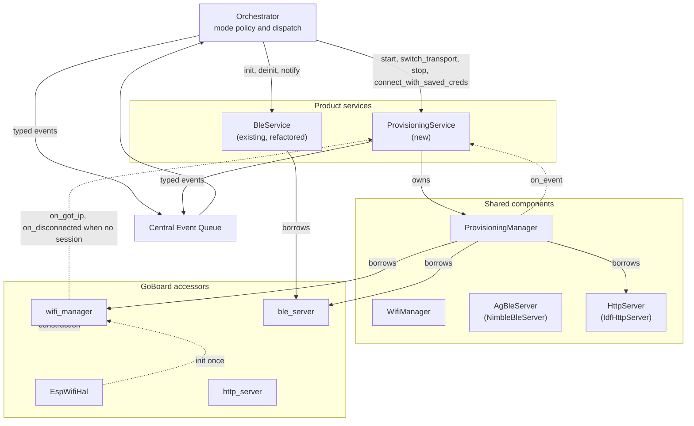
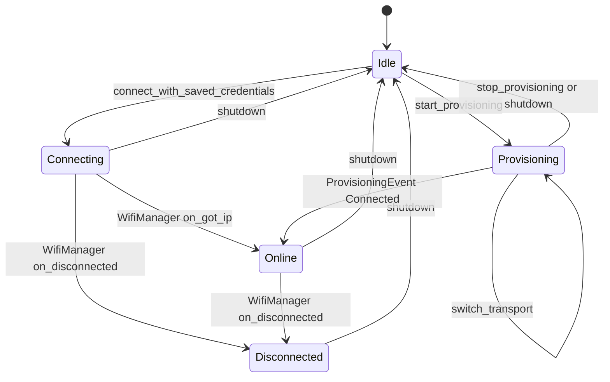
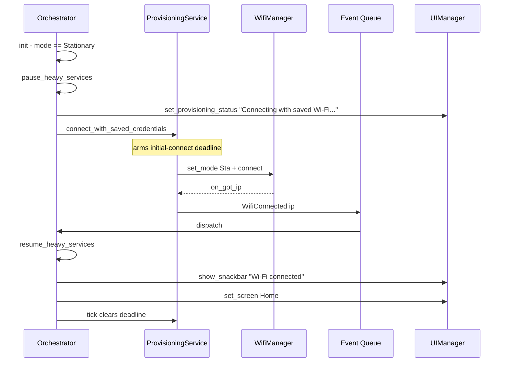
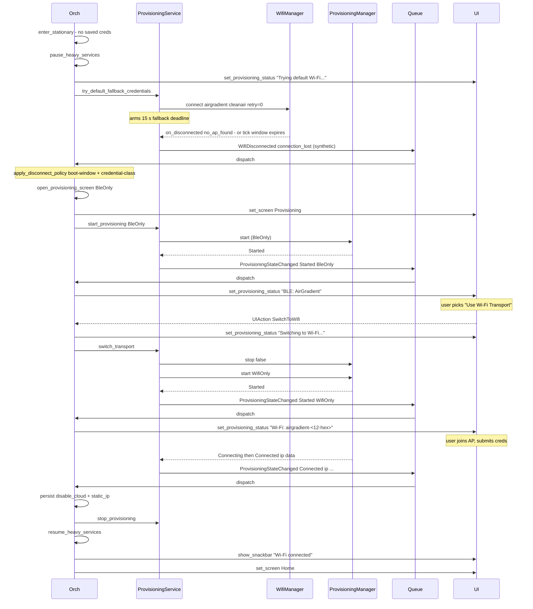
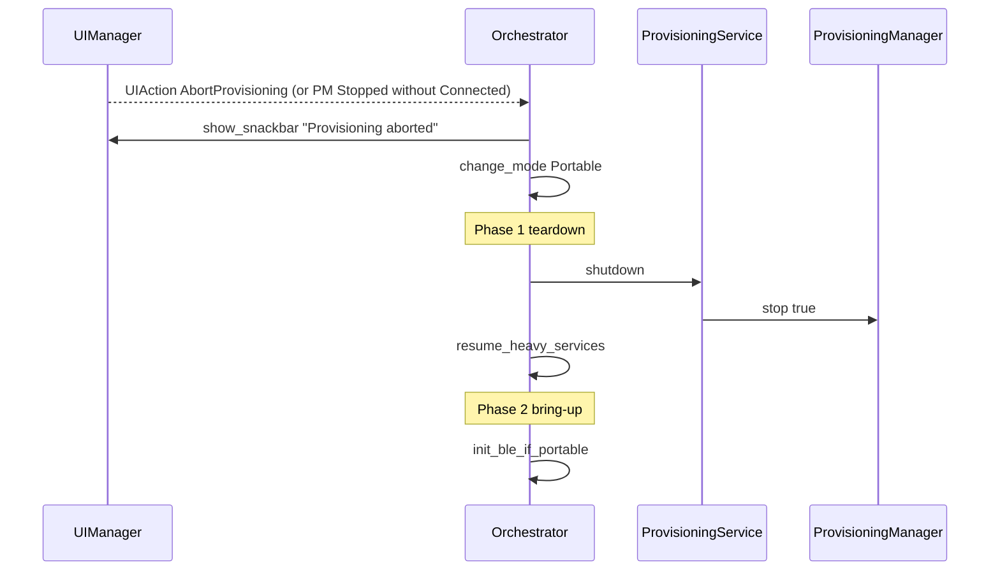
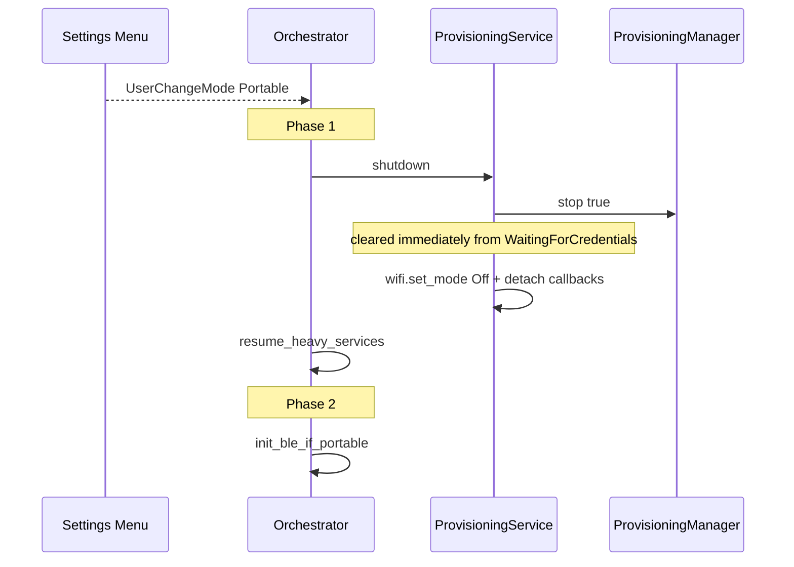

# Stationary Mode Provisioning — Implementation Spec

> **This is a spec.** It describes how a feature **will be built**, not what
> currently exists. Once the feature ships, the corresponding doc under
> `docs/` (or the relevant component README) becomes the source of truth and
> this file is typically deleted. See [`docs/STYLE.md`](../../../docs/STYLE.md)
> → "Doc Lifecycle".

Bring up the AGo Stationary operating mode end-to-end for the provisioning
path only. Entering Stationary opens an on-device Provisioning screen that
collects Wi-Fi credentials over a single active transport (BLE by default,
Wi-Fi captive portal as the alternate). Heavy product services (sensor
producer, GPS, PM sensor power) are paused for the duration of the
provisioning window so the radio driver has the heap headroom it needs.
Once credentials succeed, the device returns to a normal Stationary Home
screen with services resumed. Cloud transport, periodic measure-post, and
get-config are explicitly **out of scope** for this iteration.

## Problem

`OperatingMode::Stationary` exists as an enum value, is selectable from the
Settings menu (`go_ui.cpp:728`), is reported over BLE
(`go_ble.cpp:1367`), and is persisted in
[`GoSettings::operating_mode`](../main/go_settings.h), but the runtime is a
no-op. `Orchestrator::change_mode()` (`go_orchestrator.cpp:659`) handles
only the Portable BLE lifecycle and leaves Stationary as a placeholder
comment (`go_orchestrator.cpp:674`: `// Future: enable/disable WiFi, HTTP
server based on mode`). `BuildContext::wifi_enabled` is hard-coded to
`false` (`go_orchestrator.cpp:1062`).

The shared components needed to bridge the gap are already in tree and
host-tested:

- [`components/airgradient-wifi`](../../../components/airgradient-wifi/README.md)
  ships `WifiManager` with mode state machine, STA retry/backoff, mDNS,
  static IP, and credential pass-through.
- [`components/airgradient-provisioning`](../../../components/airgradient-provisioning/README.md)
  ships `ProvisioningManager` with `BleOnly` / `WifiOnly` / `Both`
  transports, runtime switching, and a single event callback.
- [`components/airgradient-http-server`](../../../components/airgradient-http-server/README.md)
  ships the `IdfHttpServer` the Wi-Fi captive portal borrows.

A previous attempt to wire these into AGo failed with two simultaneous
failure modes — radio-side PMF SA-Query disassoc under BT-coex scan, and
heap exhaustion from the full Go service stack starving the wifi
management-frame allocator. The first failure mode is solved at the
component level (default `BleOnly` keeps Wi-Fi as STA-only and `Both` mode
ships transport-aware teardown). The second remains product-specific and
is solved here by pausing heavy services for the provisioning window.

Full failure-mode analysis, validated branches, and heap probes are
documented in
[`provisioning_research/GO_PROVISIONING_RESEARCH.md`](../../../provisioning_research/GO_PROVISIONING_RESEARCH.md).
The earlier broader Stationary attempt lives in
[`provisioning_research/stationary_mode.md`](../../../provisioning_research/stationary_mode.md);
this spec narrows that scope to provisioning only.

## Goals

- Bring Wi-Fi up automatically on entering Stationary mode when stored
  credentials are present, using a bounded initial-connect window.
- Attempt the factory-default `airgradient` / `cleanair` AP for a bounded
  15 s window when no stored credentials are present, matching the
  Arduino product's first-boot behaviour.
- Open an on-device Provisioning screen with a single active transport
  (default `BleOnly`) when stored credentials fail within the
  initial-connect window or the factory-default fallback fails within
  its window.
- Let the user switch the active transport between BLE and Wi-Fi from the
  Provisioning screen without leaving Stationary mode.
- Pause `SensorProducer`, `GpsService`, and the PM sensor power rail for
  the duration of the provisioning window so the wifi driver has enough
  DMA-capable contiguous heap to run.
- Surface Wi-Fi and provisioning transitions as typed events on the
  central queue so the display and other future consumers can react.
- Resume paused services and return to the normal Home screen after
  provisioning succeeds, with a `Wi-Fi connected` snackbar.
- Fall back to Portable mode on any non-success exit from provisioning
  (timeout, user abort, mode-switch mid-session) so the device is never
  stranded in a broken Stationary state.

## Non-Goals

- Do not run any cloud transport. `AgClient::http_post_measures` and
  `http_fetch_config` integration is deferred to a follow-up iteration.
- Do not expose a "re-provision while online" menu entry. Once credentials
  are stored, the only way back to provisioning is factory reset →
  reboot. This is intentional for this iteration.
- Do not parse fetched-config JSON, apply server-pushed settings, or pull
  schedules from the backend.
- Do not support CoAP, MQTT, cellular, or any non-Wi-Fi transport.
- Do not change the sensor measurement cadence in Stationary mode. Sensor
  scheduling stays mode-agnostic; the cadence is paused only while
  provisioning is active.
- Do not modify the fast-path or button-wake boot paths. Stationary never
  sleeps and only ever enters via `run_interactive()` (or as a mode
  transition from a running orchestrator).
- Do not add new display rendering for the post-connect Home screen.
  `BuildContext::wifi_enabled` continues to drive the existing status-bar
  icon; new fields like `wifi_ip` are not exposed in this iteration.
- Do not attempt outer-loop reconnect after `WifiManager` retry exhaustion
  in the post-online phase. Patient retry by the component is acceptable.

## Design

On-the-wire formats and provisioning defaults (UUIDs, JSON shapes, AP
SSID style, AP password, BLE advertised name, manufacturer-data layout,
status notification codes, BLE auth flags, and the default-fallback
Wi-Fi credentials) intentionally match the existing AirGradient Arduino
product. The reference is
[`arduino/src/AgWiFiConnector.cpp`](../../../../arduino/src/AgWiFiConnector.cpp)
in the AirGradient Arduino tree. This preserves compatibility with the
production phone app, onboarding documentation, and field-installer
expectations. Items where this implementation deliberately differs from
Arduino are called out inline.

### High-Level Architecture

One new product service (`ProvisioningService`) lives alongside
`BleService`, both consumed by `Orchestrator` through `Services`
references. The `GoBoard` interface grows lazy accessors for the shared
radio plumbing so `BleService` and `ProvisioningService` can borrow the
same `AgBleServer` instance from a single owner.



The pattern matches `BleService` precedent: a product service owns the raw
component callback subscriptions and exposes a clean action API plus typed
events on the central queue. The orchestrator owns mode policy and
dispatch only — never the radio state machine itself.

### Boot Construction Order

In `GoApp::run_interactive()` (and the equivalent path in
`run_button_wake_path()`), after the existing `_board.init_core()` the
construction order becomes:

```text
1. EspWifiHal &hal           = _board.wifi_hal();       lazy; calls hal.init() on first access
2. WifiManager &wifi         = _board.wifi_manager();   mode stays Off until acted on
3. HttpServer  &http         = _board.http_server();    always constructed; routes registered
                                                        by ProvisioningManager, wiped on stop()
4. AgBleServer &ble_srv      = _board.ble_server();     lazy; the single NimbleBleServer
                                                        instance shared with BleService
5. BleService(event_queue, storage, ble_srv);           refactored ctor; borrows the server
6. ProvisioningService(event_queue,
                       { wifi, ble_srv, http },
                       provisioning_config);            owns the ProvisioningManager
7. Other services (sensor, GPS, input, display, storage, power, ui)
8. Orchestrator(event_queue, services_with_new_refs, settings, store, serial);
```

The orchestrator's mode policy enforces that only one of `BleService` and
`ProvisioningService` holds the BLE server initialised at any time —
Portable and Stationary are mutually exclusive, so the handoff is purely
sequential.

### New Files

| File | Purpose |
|---|---|
| `products/go/main/network/provisioning_service.h` | `ProvisioningService` class declaration, `Config` struct, accessor signatures |
| `products/go/main/network/provisioning_service.cpp` | Implementation: callback adapters, action API, atomic state, boot-window timer |
| `products/go/main/network/provisioning_types.h` | `ProvisioningEventPayload` struct referenced from `go_events.h`; any other public type-only declarations |
| `products/go/tests/provisioning_service.tests.cpp` | Host tests using `ProvisioningServiceTestAccess` friend class plus link-time stubs |

### Modified Files

| File | Change |
|---|---|
| `products/go/main/go_board.h` | Add `wifi_hal()`, `wifi_manager()`, `http_server()`, `ble_server()` accessors |
| `products/go/main/go_hardware_board.{h,cpp}` | Implement the new accessors with member-owned lazy `EspWifiHal`, `WifiManager`, `IdfHttpServer`, `NimbleBleServer` |
| `products/go/main/go_ble.{h,cpp}` | Constructor takes `AgBleServer &server`; `init()` initialises the borrowed server instead of creating its own |
| `products/go/main/go_events.h` | Add `WifiConnected`, `WifiDisconnected`, `ProvisioningStateChanged` `EventType` values and matching union members |
| `products/go/main/go_settings.{h,cpp}` | Add `disable_cloud` + `static_ip` fields with NVS round-trip |
| `products/go/main/go_display.h` | Add `Screen::Provisioning`; add `provisioning_status_line` field on `DisplayValues` |
| `products/go/main/go_display.cpp` | Render the Provisioning screen via the existing list-screen pipeline with a status-line header block |
| `products/go/main/go_ui.{h,cpp}` | New screen case in `build_values()` and `dispatch_provisioning()`; new `UIAction` enum values `SwitchToBle`, `SwitchToWifi`, `AbortProvisioning`; new `set_provisioning_status()` API; new `set_provisioning_transport()` API |
| `products/go/main/go_orchestrator.{h,cpp}` | Extend `Services` struct with `ProvisioningService &provisioning_service`; add `enter_stationary()`, `pause_heavy_services()`, `resume_heavy_services()`, `apply_disconnect_policy()`; strict two-phase `change_mode()`; new event handlers; fold service timer into `compute_queue_timeout_ms()` and `check_timers()`; lock-toggle suppression on Provisioning screen |
| `products/go/main/go_app.cpp` | Construct the new shared objects via `_board` accessors, pass into `BleService` and `ProvisioningService`, wire `ProvisioningService &` into `Orchestrator::Services`; same change in `run_button_wake_path()` |
| `products/go/main/CMakeLists.txt`, `products/go/main/idf_component.yml` | Declare new component deps (`airgradient-wifi`, `airgradient-provisioning`, `airgradient-http-server`) and new source files |
| `products/go/tests/CMakeLists.txt` | Register `provisioning_service_tests` target; update `go_ble_tests` / `go_orchestrator_tests` / `go_app_tests` for new ctor signatures |
| `products/go/tests/go_app_stubs.cpp`, `go_orchestrator_stubs.cpp` | Add host stubs for `WifiManager`, `ProvisioningManager`, `HttpServer`, `AgBleServer`, `EspWifiHal`, and the new `ProvisioningService` |
| `products/go/tests/go_ble.tests.cpp` | Update construction sites to pass a stub `AgBleServer &` |

### New Event Types

Added to [`go_events.h`](../main/go_events.h):

| EventType | Payload | Producer |
|---|---|---|
| `WifiConnected` | `uint32_t wifi_ip` (network byte order) | `ProvisioningService` (from `WifiManager::on_got_ip`) |
| `WifiDisconnected` | `uint8_t wifi_disconnect_reason` (`WifiDisconnectReason`) | `ProvisioningService` (from `WifiManager::on_disconnected`) |
| `ProvisioningStateChanged` | `ProvisioningEventPayload prov` | `ProvisioningService` (from `ProvisioningManager` callback) |

`ProvisioningEventPayload` is the inline carrier so the orchestrator never
queries provisioning state by separate callback after dispatch:

```cpp
struct ProvisioningEventPayload {
  uint8_t  event;               // ProvisioningEvent enum value
  uint8_t  transport;           // ProvisioningTransport enum value
  uint8_t  stop_reason;         // ProvisioningStopReason enum value
  uint32_t ip;
  bool     disable_cloud;
  WifiStaticIpConfig static_ip; // zeroed when user picked DHCP
};
```

Payload size still fits inside the existing `Event` union, which is
dominated by `GpsData` at ~68 bytes. `WifiStaticIpConfig` is ~16 bytes,
the rest is ~8 bytes — the struct stays well below the existing union
ceiling.

The `Connected` variant of `ProvisioningStateChanged` carries
`disable_cloud` and `static_ip` inline so the orchestrator can persist
them into `GoSettings` directly from the payload, with no follow-up
service query. `static_ip` is zeroed when the user opted for DHCP so the
orchestrator can unconditionally overwrite the persisted field — this
clears stale static IP on a DHCP-only re-provisioning.

### New `GoSettings` Fields

Added to [`go_settings.h`](../main/go_settings.h) and persisted through
the existing `load_go_settings()` / `save_go_settings()` path:

```cpp
struct GoSettings {
  // ... existing fields ...

  // --- Stationary connectivity ---
  bool disable_cloud = false;       // honored by future AgCloudClient (skip post + fetch)
  WifiStaticIpConfig static_ip{};   // zeroed = DHCP
};
```

`WifiStaticIpConfig` comes from
[`components/airgradient-wifi/types/wifi_types.h`](../../../components/airgradient-wifi/types/wifi_types.h).
These fields are delivered by `ProvisioningManager` via the inline event
payload. The product is responsible for persisting them per the
provisioning README contract: "The provisioning manager does not persist
anything beyond what `esp_wifi_set_config()` stores automatically (SSID +
password)."

Transport selection is **not** persisted. Every entry into Stationary
starts with `ProvisioningTransport::BleOnly`. The user can switch to
Wi-Fi each session.

### Hard-Coded Constants

Defined as `static constexpr` in `provisioning_service.cpp`. Promoted to
`GoSettings` in a later iteration only if needed. All defaults match
`arduino/src/AgWiFiConnector.cpp`.

| Constant | Value | Notes |
|---|---|---|
| `INITIAL_CONNECT_WINDOW_MS` | `30'000` | Saved-creds boot-window timeout |
| `FALLBACK_CONNECT_WINDOW_MS` | `15'000` | Factory-default `airgradient`/`cleanair` attempt (no-saved-creds path only); matches `AgWiFiConnector.cpp:69-77` |
| `STATIONARY_MAX_RETRY_COUNT` | `5` | `WifiStaConfig::max_retry_count` for saved-creds STA connect |
| `STATIONARY_AP_PASSWORD` | `"cleanair"` | Provisioning AP password (WPA2); matches `WIFI_HOTSPOT_PASSWORD_DEFAULT` at `AgWiFiConnector.cpp:19` |
| `STATIONARY_FALLBACK_SSID` | `"airgradient"` | Factory-default fallback SSID; matches `AgWiFiConnector.cpp:538` |
| `STATIONARY_FALLBACK_PASSWORD` | `"cleanair"` | Factory-default fallback password; matches `AgWiFiConnector.cpp:538` |
| `STATIONARY_OVERALL_TIMEOUT_MS` | `0` (disabled) | `ProvisioningConfig::overall_timeout_ms` |
| `STATIONARY_AGO_MODEL_CODE` | `"P-1PSG"` | Model code used in BLE manufacturer data and DIS Model Number (2A24) |

Runtime-derived values (not constants — built once at construction from
`GoBoard::serial_number()`):

| Identifier | Value | Reference |
|---|---|---|
| Provisioning AP SSID | `"airgradient-" + serial_number()` → e.g. `airgradient-d0cf13e838c8` (full 12-hex MAC) | `AgWiFiConnector.cpp:556` |
| BLE advertised device name | literal `"AirGradient"` (no per-device suffix) | `AgWiFiConnector.cpp:743` |
| BLE manufacturer data payload (after `0xFFFF` company ID prefix) | `"P-1PSG#" + serial_number()` ASCII bytes | `AgWiFiConnector.cpp:782-788` |
| BLE auth flags | `AgBleAuth::SC` only — **no BOND, no MITM** | matches `setSecurityAuth(false, false, true)` at `AgWiFiConnector.cpp:747` |

The BLE auth-flags choice is load-bearing for cross-mode UX; see
[BLE Security Cross-Mode Behaviour](#ble-security-cross-mode-behaviour)
below.

### `ProvisioningService`

#### Owns

- The internal `ProvisioningManager` instance (owned by value, lifetime
  matches the service).
- Subscriptions to `WifiManager::set_on_got_ip()` and
  `set_on_disconnected()` — **only outside the provisioning session**.
  See [Callback Ownership](#callback-ownership).
- The subscription to `ProvisioningManager::set_on_event()` — always
  active for the lifetime of the service.
- Authoritative transport state, mirrored on `std::atomic` scalars so the
  orchestrator can read it on demand without crossing a mutex.
- The saved-creds initial-connect deadline.

#### Does NOT Own

- Mode policy (orchestrator decides when to call
  `connect_with_saved_credentials` vs `start_provisioning`).
- Disconnect-reason routing (orchestrator decides whether `auth_failed`
  triggers a fallback to provisioning, using `has_been_online()` from the
  service as the policy gate).
- Static-IP persistence (orchestrator reads from `GoSettings` and passes
  to `connect_with_saved_credentials()`; service never writes NVS).
- Cloud transport. Anything that talks to the AirGradient backend is out
  of scope for this iteration.
- The "Resume paused services" decision. The service emits events and the
  orchestrator decides when to call `resume_heavy_services()`.

#### Public API

```cpp
class ProvisioningService {
public:
  struct Deps {
    WifiManager &wifi;
    AgBleServer &ble;
    HttpServer  &http;
  };

  struct Config {
    // --- Provisioning AP (Wi-Fi captive portal) ---
    const char *ap_ssid;                 // "airgradient-<12-hex-mac>"
    const char *ap_password = "cleanair";
    uint8_t     ap_channel = 1;

    // --- Provisioning BLE ---
    const char *ble_device_name = "AirGradient";    // literal, no suffix
    const char *ble_model_name;                     // "P-1PSG" for AGo
    const char *ble_serial_number;                  // 12-hex MAC string
    const char *ble_firmware_version;
    const char *ble_manufacturer_data;              // "P-1PSG#<12-hex-mac>"
    uint8_t     ble_auth_flags = AgBleAuth::SC;     // no BOND, no MITM

    // --- Saved-creds STA connect ---
    uint32_t    initial_connect_window_ms = 30'000;

    // --- Factory-default fallback (no-saved-creds path only) ---
    const char *fallback_ssid = "airgradient";
    const char *fallback_password = "cleanair";
    uint32_t    fallback_connect_window_ms = 15'000;
  };

  ProvisioningService(RtosQueueHandle event_queue, const Deps &deps, const Config &cfg);
  ~ProvisioningService();

  ProvisioningService(const ProvisioningService &) = delete;
  ProvisioningService &operator=(const ProvisioningService &) = delete;

  // --- Saved-credentials path ---

  /// True when WifiManager has SSID + password in NVS.
  bool has_saved_credentials() const;

  /// Drive WifiManager into Sta mode and start connecting using stored
  /// credentials. Pass a non-null `static_ip` to apply it before connect.
  /// Internally arms `initial_connect_window_ms`.
  void connect_with_saved_credentials(const WifiStaticIpConfig *static_ip = nullptr);

  // --- Factory-default fallback path ---

  /// Single-attempt connect to the hardcoded `fallback_ssid` /
  /// `fallback_password` AP with `max_retry_count = 0`. Internally arms
  /// `fallback_connect_window_ms`. No NVS write — purely ephemeral.
  ///
  /// On success: emits WifiConnected; `has_been_online()` becomes true.
  /// On failure or window expiry: emits synthetic
  /// `WifiDisconnected{connection_lost}`; the orchestrator's existing
  /// `apply_disconnect_policy` routes it through
  /// `open_provisioning_screen(BleOnly)`.
  ///
  /// Matches `AgWiFiConnector.cpp:60-82` and `:538`.
  void try_default_fallback_credentials();

  // --- Provisioning path ---

  /// Switch into the provisioning flow with the selected transport.
  /// Precondition: `BleService::deinit()` has run if old mode was Portable;
  /// HttpServer has no routes registered.
  void start_provisioning(ProvisioningTransport transport = ProvisioningTransport::BleOnly);

  /// Toggle BLE ↔ Wi-Fi mid-session via back-to-back stop + start. No-op
  /// if not currently active.
  void switch_transport();

  /// Tear down the active provisioning session. Idempotent; safe if not
  /// running. Bounded by ~1.5 s when called from the Connected state.
  void stop_provisioning();

  /// Full teardown: drop STA, stop provisioning, set Wi-Fi mode Off,
  /// detach callbacks, reset `has_been_online()` to false. Called by the
  /// orchestrator when leaving Stationary mode.
  void shutdown();

  /// Wipe stored credentials. Called by the orchestrator factory-reset
  /// path. Also resets `has_been_online()` to false.
  void clear_credentials();

  // --- State queries ---

  bool is_provisioning() const;
  ProvisioningTransport current_transport() const;
  bool is_online() const;                    // STA has an IP
  uint32_t ip() const;
  WifiDisconnectReason last_disconnect_reason() const;

  /// Policy gate for the orchestrator's disconnect-reason routing.
  /// True once on_got_ip has fired at least once since the most recent
  /// connect_with_saved_credentials() / start_provisioning() / shutdown()
  /// / clear_credentials() reset.
  bool has_been_online() const;

  // --- Clock integration (called from orchestrator's check_timers) ---

  /// 0 if no initial-connect deadline is armed. Otherwise the absolute
  /// RTOS time-ms at which the orchestrator should call tick().
  uint32_t next_deadline_ms() const;

  /// Drive internal timers. On boot-window expiry, posts a synthetic
  /// WifiDisconnected{connection_lost} so the orchestrator's existing
  /// dispatch path triggers the fallback to provisioning.
  void tick(uint32_t now_ms);
};
```

#### BLE Security Cross-Mode Behaviour

The provisioning BLE link uses `NO_INPUT_NO_OUTPUT + AgBleAuth::SC` —
Just Works pairing, Secure Connections, **no BOND, no MITM**. This is
deliberately weaker than `BleService` in Portable mode, which uses
`DISPLAY_ONLY + BOND | MITM` (6-digit passkey on the e-paper screen,
authenticated, bonded).

The asymmetry exists because provisioning is a one-shot setup event:
the session is encrypted (ephemeral key derived via Just Works) so the
Wi-Fi credentials are protected over the air, but no key is persisted
on either side. Bonding is reserved for the long-lived companion-app
session in Portable mode.

User-visible UX across mode transitions:

| Sequence | Phone-side bond state | What the user sees |
|---|---|---|
| First Portable use (no prior bond) | empty → MITM bond stored | Passkey shown on AGo display, user types on phone, paired |
| Stationary provisioning → first Portable use | empty (Stationary did not bond) → MITM bond stored | No prompt during provisioning; passkey-on-display flow on first Portable connect, identical to first-pair |
| Portable first → Stationary provisioning | MITM bond stored → reused | No prompt during provisioning; existing bond satisfies the lower `SC`-only requirement |
| Portable → Stationary → Portable | bond persists across all transitions | One passkey prompt total (at the original Portable pair); subsequent reconnects in either mode are silent |
| Factory reset → next pair (any mode) | stale orphan on phone until manually removed | Standard "delete and re-pair" recovery — pre-existing rough edge, not new |

Implementation impact: this requires a small change to the shared
`airgradient-provisioning` component to expose the auth flags as a
field on `ProvisioningBleConfig` (currently hardcoded to `BOND | SC` at
`components/airgradient-provisioning/internal/ble_transport.cpp:180`).
See [Open Questions](#open-questions) for the change scope.

#### Transport State And Accessors

The service mirrors current transport state on atomics so the orchestrator
can read it from any context without synchronization concerns. This
follows `BleService`'s precedent (`_connected` is a `std::atomic<bool>`
written from NimBLE callbacks, read from the orchestrator).

| Member | Type | Written by | Read by |
|---|---|---|---|
| `_online` | `std::atomic<bool>` | `on_got_ip`, `on_disconnected`, `ProvisioningEvent::Connected` adapter | Orchestrator (`is_online()`) |
| `_provisioning_active` | `std::atomic<bool>` | `start_provisioning()` / `stop_provisioning()` (orchestrator stack) | Orchestrator (`is_provisioning()`), internal callback-install decision |
| `_transport` | `std::atomic<uint8_t>` | `start_provisioning()` / `switch_transport()` | Orchestrator (`current_transport()`), UI |
| `_ip` | `std::atomic<uint32_t>` | Same writers as `_online` | Orchestrator (`ip()`) |
| `_last_disconnect_reason` | `std::atomic<uint8_t>` | `on_disconnected`; cleared in `connect_with_saved_credentials()` | Orchestrator (`last_disconnect_reason()`) |
| `_has_been_online` | `std::atomic<bool>` | Latched true on first `on_got_ip` / `ProvisioningEvent::Connected`; reset on `shutdown()`, `clear_credentials()`, and at the start of `connect_with_saved_credentials()` / `start_provisioning()` | Orchestrator (`has_been_online()`) |
| `_initial_connect_deadline_ms` | plain `uint32_t` | `connect_with_saved_credentials()` arms; `tick()` and `_clear_deadline_pending` consumer clear; `shutdown()` clears | Service `next_deadline_ms()` / `tick()` only |

`_initial_connect_deadline_ms` is touched exclusively from the
orchestrator stack (the action methods and the `tick()` driven from
`check_timers()`). No atomic needed; the callback-side clear is deferred
to `tick()` via a `_clear_deadline_pending` latch to avoid the
on-Wi-Fi-event-task race documented in §13 of the research note.

#### Internal Lifecycle



The diagram is conceptual. The implementation does not store a `State`
enum field — orchestrator-facing state is exposed via the booleans
`is_online()` / `is_provisioning()` plus the auxiliary accessors above.

`Provisioning → Online` does not go through `WifiManager::on_got_ip`
because the provisioning manager temporarily owns those callbacks (see
[Callback Ownership](#callback-ownership)). The `Online` transition is
driven by `ProvisioningEvent::Connected`, which carries the IP directly
in `info.ip`.

#### Callback Ownership

`ProvisioningManager::start()` installs its own callbacks on the borrowed
`WifiManager`. `stop()` clears them. Two services cannot own the same
callback slot.

The rule: **`ProvisioningManager` owns the Wi-Fi callbacks during the
provisioning session.** `ProvisioningService` owns them at all other
times. The service exposes a private `_install_wifi_callbacks()` helper
called:

- in the service constructor (so the saved-creds path works before any
  provisioning session),
- at the end of `stop_provisioning()` after `_prov.stop()` returns and
  only if the service is not transitioning to Idle / shutdown.

`ProvisioningManager::set_on_event` is set once in the constructor and
never overwritten — provisioning lifecycle events flow through that
callback regardless of session activity.

During provisioning, online transitions are signalled by
`ProvisioningEvent::Connected` with the IP. The service updates its
atomics inside the prov callback, posts
`ProvisioningStateChanged(Connected)` with `disable_cloud` and `static_ip`
carried inline, and the orchestrator treats that event as the "network
online" trigger — `WifiConnected` does not fire while provisioning owns
the Wi-Fi callback slot.

#### `switch_transport()` Flow

```text
switch_transport():
  if !is_provisioning(): return
  new = current_transport() == BleOnly ? WifiOnly : BleOnly
  _prov.stop(false)        // wipe routes; keep HTTP server up so WifiOnly start can reuse it
                           // (matches component README runtime-switching contract)
  _prov.start(_wifi, _ble, _http, build_config(new))
  _transport.store(new)
```

The component README explicitly supports this back-to-back pattern across
the same `ProvisioningManager` instance. Heap fragments ~3 KB / ~3.3 KB
DMA per cycle (research §19.4) — well above the management-frame
allocation threshold for a single switch in a session.

`switch_transport()` is bounded by the component's hold (~1.5 s only if
the prior side reached Connected, which by definition is not the case
mid-switch). For a user-initiated switch from `Started`, teardown is
immediate.

The orchestrator pushes a transient status line on the Provisioning
screen ("Switching to Wi-Fi…" / "Switching to BLE…") between the
`switch_transport()` call and the next `ProvisioningStateChanged(Started)`
event so the user sees the transition in progress.

### Orchestrator Wiring

#### `Services` Struct

```cpp
struct Services {
  SensorProducer      &sensor_producer;
  GpsService          &gps_service;
  InputService        &input_service;
  DisplayService      &display_service;
  StorageService      &storage_service;
  PowerService        &power_service;
  UIManager           &ui_manager;
  BleService          &ble_service;
  ProvisioningService &provisioning_service;   // new
};
```

#### `change_mode()` — Strict Two-Phase

```cpp
void Orchestrator::change_mode(OperatingMode new_mode) {
  OperatingMode old_mode = _mode;
  _mode = new_mode;
  _settings.operating_mode = new_mode;
  save_go_settings(_config_store, _settings);

  // ----- Phase 1: tear down outgoing mode -----
  if (old_mode == OperatingMode::Portable && new_mode != OperatingMode::Portable) {
    _svc.ui_manager.dismiss_pairing_passkey();
    _svc.ble_service.deinit();                  // releases AgBleServer
  }
  if (old_mode == OperatingMode::Stationary && new_mode != OperatingMode::Stationary) {
    _svc.provisioning_service.shutdown();       // bounded by component
    resume_heavy_services();                    // safe no-op if not paused
  }

  // ----- Phase 2: bring up incoming mode -----
  if (new_mode == OperatingMode::Portable && old_mode != OperatingMode::Portable) {
    init_ble_if_portable();                     // re-inits AgBleServer
  }
  if (new_mode == OperatingMode::Stationary && old_mode != OperatingMode::Stationary) {
    enter_stationary();
  }

  _svc.power_service.set_pm_power(true);
  _svc.ui_manager.show_snackbar("Mode changed");
  update_display();
}
```

Phase 1 always runs before Phase 2 — the BLE bring-up cannot collide with
provisioning's BLE ownership because `provisioning_service.shutdown()`
calls `prov.stop()` synchronously before Phase 2 begins.

#### `enter_stationary()`

The entry flow has three branches, in this priority order, matching the
behaviour of `arduino/src/AgWiFiConnector.cpp::WifiConnector::connect()`:

1. **Saved credentials present** → try them (30 s window).
2. **No saved credentials** → try the factory-default `airgradient` /
   `cleanair` AP (15 s window, no NVS write).
3. **No saved creds and fallback failed** → open the Provisioning page on
   `BleOnly`.

Branches 1 and 2 are mutually exclusive. Branch 3 is reached either
synchronously (no creds, no fallback configured) or asynchronously via
the synthetic `WifiDisconnected{connection_lost}` event the service
posts when the saved-creds or fallback window expires.

```cpp
void Orchestrator::enter_stationary() {
  pause_heavy_services();

  if (_svc.provisioning_service.has_saved_credentials()) {
    const WifiStaticIpConfig *ip =
        _settings.static_ip.ip != 0 ? &_settings.static_ip : nullptr;
    _svc.ui_manager.set_provisioning_status("Connecting with saved Wi-Fi...");
    _svc.provisioning_service.connect_with_saved_credentials(ip);
    // Stay on the current screen; the synthetic boot-timeout /
    // WifiConnected dispatch decides whether to surface the Provisioning
    // screen or Home.
  } else {
    // No NVS creds: try the factory-default 'airgradient'/'cleanair' AP
    // first (single 15 s attempt, no NVS write). Matches
    // AgWiFiConnector.cpp:60-82.
    _svc.ui_manager.set_provisioning_status("Trying default Wi-Fi...");
    _svc.provisioning_service.try_default_fallback_credentials();
    // On success: WifiConnected event resumes services and goes Home.
    // On failure: synthetic WifiDisconnected routes through
    // apply_disconnect_policy → open_provisioning_screen(BleOnly).
  }
}

void Orchestrator::open_provisioning_screen(ProvisioningTransport transport) {
  _svc.ui_manager.set_provisioning_transport(transport);
  _svc.ui_manager.set_provisioning_status(initial_status_for(transport));
  _svc.ui_manager.set_screen(Screen::Provisioning);
  _svc.provisioning_service.start_provisioning(transport);
  update_display();
}
```

The fallback attempt is **single-shot per boot**. If it fails (window
expires or `auth_failed`), the device opens the Provisioning page and
the user is expected to provision through BLE or Wi-Fi. There is no
retry of the fallback within the same boot, even if the user moves into
range of the factory AP after the window has expired — they would have
to reboot the device to retry.

`try_default_fallback_credentials()` builds a `WifiStaConfig` from the
service's `Config::fallback_ssid` / `fallback_password` with
`max_retry_count = 0` and arms `_initial_connect_deadline_ms` using
`fallback_connect_window_ms`. Internally it reuses the same
deadline-tracking mechanism as `connect_with_saved_credentials()` so the
orchestrator's `tick()` / `next_deadline_ms()` integration handles both
windows uniformly.

#### `pause_heavy_services()` / `resume_heavy_services()`

```cpp
void Orchestrator::pause_heavy_services() {
  if (_services_paused) return;
  _svc.sensor_producer.stop();                  // frees the 4 KB task stack
  if (is_gps_active()) {
    _svc.gps_service.stop_and_idle_gnss();
  }
  _svc.power_service.set_pm_power(false);
  _services_paused = true;
}

void Orchestrator::resume_heavy_services() {
  if (!_services_paused) return;
  _svc.power_service.set_pm_power(true);
  _svc.sensor_producer.start();
  if (is_gps_active()) {
    _svc.gps_service.start();
  }
  _services_paused = false;
  // First post-resume measurement is requested by the existing
  // measurement-timer dispatch on the next check_timers tick.
}
```

`_services_paused` is a new private bool on the orchestrator; it lives
only to make pause/resume idempotent.

#### Event Handlers

```cpp
case EventType::WifiConnected:
  AG_LOGI(TAG, "wifi got IP: %u.%u.%u.%u", /* ... */);
  // Saved-creds happy path: leave provisioning screen if shown, resume.
  if (_svc.ui_manager.current_screen() == Screen::Provisioning) {
    _svc.ui_manager.set_screen(Screen::Home);
  }
  resume_heavy_services();
  _svc.ui_manager.show_snackbar("Wi-Fi connected");
  update_display();
  break;

case EventType::WifiDisconnected: {
  auto reason = static_cast<WifiDisconnectReason>(e.wifi_disconnect_reason);
  AG_LOGI(TAG, "wifi disconnected reason=%d", (int)reason);
  apply_disconnect_policy(reason);
  break;
}

case EventType::ProvisioningStateChanged: {
  auto ev = static_cast<ProvisioningEvent>(e.prov.event);
  auto transport = static_cast<ProvisioningTransport>(e.prov.transport);
  _svc.ui_manager.set_provisioning_transport(transport);
  _svc.ui_manager.set_provisioning_status(status_line_for(ev, transport));

  if (ev == ProvisioningEvent::Connected) {
    // Persist the inline payload directly — service does not cache prov data.
    _settings.disable_cloud = e.prov.disable_cloud;
    _settings.static_ip     = e.prov.static_ip;
    save_go_settings(_config_store, _settings);

    _svc.provisioning_service.stop_provisioning();
    resume_heavy_services();
    _svc.ui_manager.set_screen(Screen::Home);
    _svc.ui_manager.show_snackbar("Wi-Fi connected");
  } else if (ev == ProvisioningEvent::Stopped) {
    // Stopped without prior Connected => non-success exit (timeout / our own teardown).
    // Distinguish via has_been_online(): false => fallback to Portable.
    if (!_svc.provisioning_service.has_been_online() &&
        _mode == OperatingMode::Stationary) {
      _svc.ui_manager.show_snackbar("Provisioning aborted");
      change_mode(OperatingMode::Portable);
    }
  }
  update_display();
  break;
}
```

#### Disconnect-Reason Policy

The policy gate is `ProvisioningService::has_been_online()`. The
orchestrator does not track its own deadline or boot flag.

```cpp
void Orchestrator::apply_disconnect_policy(WifiDisconnectReason reason) {
  if (_mode != OperatingMode::Stationary) return;

  const bool credential_class =
      reason == WifiDisconnectReason::auth_failed ||
      reason == WifiDisconnectReason::no_ap_found ||
      reason == WifiDisconnectReason::assoc_failed ||
      reason == WifiDisconnectReason::dhcp_failed ||
      reason == WifiDisconnectReason::connection_lost;   // synthetic boot-timeout

  const bool boot_window = !_svc.provisioning_service.has_been_online();

  switch (reason) {
  case WifiDisconnectReason::auth_failed:
    AG_LOGW(TAG, "auth_failed -> provisioning");
    open_provisioning_screen(ProvisioningTransport::BleOnly);
    break;
  case WifiDisconnectReason::requested_by_user:
    break;                                              // our own disconnect; ignore
  default:
    if (boot_window && credential_class) {
      AG_LOGW(TAG, "boot-window %d -> provisioning", (int)reason);
      open_provisioning_screen(ProvisioningTransport::BleOnly);
    }
    // After online: patient retry by WifiManager (within max_retry_count).
    // After exhaustion, the device sits in Disconnected; user recovery is
    // mode-switch or factory reset.
    break;
  }
}
```

| Reason | `!has_been_online()` (boot window) | `has_been_online()` (post-online) |
|---|---|---|
| `auth_failed` | Open provisioning screen | Open provisioning screen |
| `no_ap_found` | Open provisioning screen | Stay disconnected (patient retry) |
| `assoc_failed` | Open provisioning screen | Stay disconnected |
| `dhcp_failed` | Open provisioning screen | Stay disconnected |
| `connection_lost` (incl. synthetic boot-timeout from `tick()`) | Open provisioning screen | Stay disconnected |
| `ap_disconnected`, `handshake_failed`, `unknown` | Stay (next `tick()` may post the boot-timeout) | Stay disconnected |
| `requested_by_user` | Ignore | Ignore |

The synthetic `connection_lost` event posted by
`ProvisioningService::tick()` on boot-window expiry lands in the same
handler and routes through `boot_window && credential_class` →
`open_provisioning_screen()`. No special case needed.

#### `compute_queue_timeout_ms()` / `check_timers()` Integration

```cpp
uint32_t Orchestrator::compute_queue_timeout_ms() const {
  // ... existing folds ...
  uint32_t prov_deadline = _svc.provisioning_service.next_deadline_ms();
  if (prov_deadline != 0) {
    uint32_t prov_remaining = prov_deadline - now;
    next = std::min(next, prov_remaining);
  }
  // ...
}

void Orchestrator::check_timers() {
  // ... existing checks ...
  _svc.provisioning_service.tick(static_cast<uint32_t>(RTOS::get_time_ms()));
}
```

#### Boot Path

`Orchestrator::init()` checks `_settings.operating_mode == Stationary` and
calls `enter_stationary()` if so, after the existing
`init_ble_if_portable()` call (which is a no-op when mode is not
Portable).

#### Lock Toggle Suppression On Provisioning Screen

`Orchestrator::on_input()` early-rejects the lock-toggle path
(`ButtonPower` short-press) when the current screen is `Provisioning`,
optionally showing a `"Use Abort to exit"` snackbar. Long-press
ButtonPower (shutdown) and long-press ButtonBoot (factory reset) remain
fully active — factory reset is the documented escape hatch back into
provisioning when valid creds are stored.

### Provisioning Screen UI

#### Layout

```text
+-------------------------------------+
| [status bar — wifi/ble/batt icons]  |
+-------------------------------------+
| Provisioning                        |
| BLE: AirGradient                    |  <- provisioning_status_line
| Waiting for credentials...          |     (up to ~2-3 lines depending
|                                     |      on transport + state)
+-------------------------------------+
| > Use BLE Transport     (active)    |
|   Use Wi-Fi Transport               |
|   Abort                             |
+-------------------------------------+
```

#### Status Line State Machine

| Trigger | `provisioning_status_line` |
|---|---|
| `enter_stationary()` with creds, before initial connect | `Connecting with saved Wi-Fi...` |
| `enter_stationary()` no creds, before fallback attempt | `Trying default Wi-Fi...` |
| `WifiConnected` (saved-creds or fallback happy path) | n/a — screen leaves to Home |
| `ProvisioningStateChanged(Started, BleOnly)` | `BLE: AirGradient`<br>`Waiting for credentials` |
| `ProvisioningStateChanged(Started, WifiOnly)` | `Wi-Fi: airgradient-<12-hex>`<br>`http://192.168.4.1/` |
| `switch_transport()` issued by orchestrator | `Switching to Wi-Fi...` / `Switching to BLE...` (until next `Started`) |
| `ProvisioningStateChanged(Connecting)` | `Connecting to <ssid>...` |
| `ProvisioningStateChanged(ConnectFailed)` | `Connect failed; retry from your phone` |
| `ProvisioningStateChanged(Connected)` | n/a — screen leaves to Home with snackbar |

#### Input Grammar

| Input | Action |
|---|---|
| TouchUp | Move selection to previous row (skip the active transport row) |
| TouchDown | Move selection to next row (skip the active transport row) |
| TouchEnter on `Use BLE Transport` row | `UIAction::SwitchToBle` (no-op if already active) |
| TouchEnter on `Use Wi-Fi Transport` row | `UIAction::SwitchToWifi` (no-op if already active) |
| TouchEnter on `Abort` row | `UIAction::AbortProvisioning` (orchestrator → `change_mode(Portable)`) |
| ButtonPower short-press | **No-op** (orchestrator suppresses lock toggle); optionally a hint snackbar |
| ButtonPower long-press | Shutdown (unchanged) |
| ButtonBoot long-press | Factory reset (unchanged) |

The active transport row renders with a suffix (e.g. `(active)`) and is
marked non-selectable so Up/Down skips over it.

#### `UIManager` Additions

```cpp
class UIManager {
public:
  // ... existing API ...

  void set_provisioning_transport(ProvisioningTransport t);
  void set_provisioning_status(const char *line);   // copied into internal buffer

private:
  ProvisioningTransport _provisioning_transport = ProvisioningTransport::BleOnly;
  char _provisioning_status_line[96] = {};

  UIActionResult dispatch_provisioning(InputSource source, InputType type);
  void populate_provisioning_rows(DisplayValues &v) const;
};
```

### Lifecycle Sequences

#### Saved-Creds Happy Path



#### No-Creds Flow — Fallback Then Provisioning With Transport Switch



#### Abort Or Timeout



#### Mode Switch Mid-Portal



## Implementation Plan

Two checkpoints, each verifiable independently on hardware before the
next is started.

### Checkpoint 1 — Board + BLE Refactor (No Behaviour Change)

The smallest possible refactor that introduces the shared `AgBleServer`
ownership pattern and makes the new radio plumbing available, without
adding any user-visible behaviour.

**Files added:** none.

**Files modified:**

- `products/go/main/go_board.h` — add `wifi_hal()`, `wifi_manager()`,
  `http_server()`, `ble_server()` accessors.
- `products/go/main/go_hardware_board.{h,cpp}` — implement the new
  accessors with member-owned lazy `EspWifiHal`, `WifiManager`,
  `IdfHttpServer`, `NimbleBleServer`. `wifi_hal()` calls `hal.init()` on
  first access.
- `products/go/main/go_ble.{h,cpp}` — constructor takes `AgBleServer
  &server`; `init()` initialises the borrowed server instead of creating
  its own. No behaviour change in Portable mode.
- `products/go/main/go_app.cpp` — `run_interactive()` and
  `run_button_wake_path()` construct shared objects via the board and
  pass `_board.ble_server()` into `BleService`.
- `products/go/main/CMakeLists.txt`, `products/go/main/idf_component.yml`
  — declare new component deps.
- `products/go/tests/go_app_stubs.cpp` — stubs for the new shared objects
  in host builds; updated `BleService` ctor.
- `products/go/tests/go_ble.tests.cpp` — pass a stub `AgBleServer &` to
  the constructor.

**Checkpoint 1 acceptance criteria:**

- `idf.py -C products/go build` succeeds.
- `cmake --build tests/build` and
  `ctest --test-dir tests/build --output-on-failure` succeed.
- On hardware in Portable mode: phone app pairs over BLE, reads measures,
  writes config, downloads history — unchanged from pre-refactor.
- On hardware in Portable mode: mode toggle Portable → Stationary →
  Portable does not crash (Stationary itself is still a no-op at this
  checkpoint; the test is just that the BleService refactor survives
  the round-trip).

### Checkpoint 2 — Provisioning End-To-End

All other changes: the new service, events, settings, screen, orchestrator
wiring, UI, snackbars, and disconnect policy.

**Files added:**

- `products/go/main/network/provisioning_service.{h,cpp}`
- `products/go/main/network/provisioning_types.h`
- `products/go/tests/provisioning_service.tests.cpp`

**Files modified:**

- `products/go/main/go_events.h` — new `EventType` values and union
  members (`wifi_ip`, `wifi_disconnect_reason`, `prov` struct).
- `products/go/main/go_settings.{h,cpp}` — add `disable_cloud` and
  `static_ip` fields with NVS round-trip.
- `products/go/main/go_display.h` — add `Screen::Provisioning` and
  `provisioning_status_line` field on `DisplayValues`.
- `products/go/main/go_display.cpp` — render the Provisioning screen.
- `products/go/main/go_ui.{h,cpp}` — new screen case, dispatch,
  populate-rows helpers; new `UIAction` enum values; new
  `set_provisioning_status` / `set_provisioning_transport` accessors.
- `products/go/main/go_orchestrator.{h,cpp}` — extend `Services`; add
  `enter_stationary()`, `pause_heavy_services()`, `resume_heavy_services()`,
  `apply_disconnect_policy()`, `open_provisioning_screen()`; strict
  two-phase `change_mode()`; new event handlers; fold provisioning
  deadline into `compute_queue_timeout_ms()` and `check_timers()`;
  suppress lock toggle on Provisioning screen.
- `products/go/main/go_app.cpp` — construct `ProvisioningService`, wire
  into `Orchestrator::Services`.
- `products/go/tests/CMakeLists.txt` — register new test target.
- `products/go/tests/go_app_stubs.cpp`, `go_orchestrator_stubs.cpp` —
  stubs for the new service and shared components.

**Checkpoint 2 acceptance criteria:**

- `idf.py -C products/go build` succeeds.
- `cmake --build tests/build` and
  `ctest --test-dir tests/build --output-on-failure` succeed.
- On hardware: boot Portable, menu → Stationary with no saved creds and
  no factory `airgradient` AP in range → 15 s `Trying default Wi-Fi...`
  status, then Provisioning page shows BLE status with literal device
  name `AirGradient`; phone connects via Just Works (no passkey, no
  bond), submits creds; `Wi-Fi connected` snackbar; Home screen;
  sensors resume (serial log shows `sensor_data: ...` lines).
- On hardware: same flow but switch transport from the on-screen menu →
  page shows transient `Switching to Wi-Fi...` then settles on
  `Wi-Fi: airgradient-<12-hex>` with `http://192.168.4.1/`; phone joins
  the WPA2 AP (password `cleanair`), submits creds, Connected.
- On hardware: boot Portable, menu → Stationary with no saved creds and
  a factory `airgradient`/`cleanair` AP **in range** → fallback
  associates within 15 s, `Wi-Fi connected` snackbar, Home screen.
  Provisioning page is never shown. No NVS write — next reboot still
  has no saved creds and runs the fallback path again.
- On hardware: on the Provisioning page, select `Abort` → device returns
  to Portable mode, BLE service comes back up cleanly. If the phone had
  bonded with AGo in Portable previously, the bond is reused — no
  passkey prompt on reconnect.
- On hardware: power-button short-press while on Provisioning screen is
  ignored (no lock toggle); long-press still shuts down.
- On hardware: cold-boot with previously-saved creds → no Provisioning
  page shown; `Wi-Fi connected` snackbar; Home screen.
- On hardware: cold-boot with corrupted saved creds (force `auth_failed`)
  → Provisioning page opens automatically within the 30 s saved-creds
  window via the `auth_failed` policy route.
- On hardware: cold-boot with no saved creds, no factory AP in range →
  Provisioning page opens automatically after the 15 s fallback window
  via the synthetic `connection_lost` event.
- On hardware: switch from Stationary to Portable mid-portal → BLE
  service comes back up cleanly; the strict two-phase order is visible
  in logs (provisioning shutdown completes before BLE init begins).
- On hardware: re-provisioning from static-IP-configured Wi-Fi back to
  DHCP-only Wi-Fi clears `_settings.static_ip` (next boot uses DHCP).
- On hardware: factory reset via long-press BOOT clears stored Wi-Fi
  credentials (`clear_credentials()` called) and resets
  `_settings.disable_cloud` + `_settings.static_ip` to defaults.
- On hardware: provisioning BLE advertising shows literal device name
  `AirGradient` and manufacturer data `0xFF 0xFF "P-1PSG#<12-hex-mac>"`
  (verifiable with `nRF Connect` or similar BLE scanner).
- On hardware: phone-side BLE Settings does NOT show a bonded `AirGradient`
  entry after provisioning completes (no BOND in provisioning auth flags).
  The bond entry only appears after first Portable pairing.
- On hardware: heap probes around `prov.start()` show ≥ ~30 KB
  largest-DMA-capable contiguous block — matching §17 / §18 baselines
  from the research note.

## Testing Strategy

The shared components consumed by Stationary mode (`WifiManager`,
`ProvisioningManager`) are concrete classes with no virtual methods, so
Trompeloeil mocks of them are not possible without a component refactor.
RTOS task and queue APIs are no-op stubs under `TEST_HOST`. Host coverage
therefore favours:

- Pure logic extracted into testable free functions / static methods
  exercised directly under `TEST_HOST`.
- Friend-class access (`ProvisioningServiceTestAccess`) to drive private
  callback adapters and atomics.
- Link-time stubs in `go_app_stubs.cpp` providing minimal implementations
  of `WifiManager`, `ProvisioningManager`, `HttpServer`, `AgBleServer`,
  and `EspWifiHal`.

The reference smoke test in
[`products/reference/main/test_provisioning.cpp`](../../reference/main/test_provisioning.cpp)
remains the canonical "does the radio actually work" validation. The
checkpoint acceptance criteria above add product-specific hardware
checks on top.

### Host Tests

`provisioning_service.tests.cpp`:

- Uses `ProvisioningServiceTestAccess` (friend class) to invoke the bound
  `on_got_ip` / `on_disconnected` / `on_prov_event` adapters directly
  with synthetic payloads.
- Uses link-time stubs for `WifiManager` / `ProvisioningManager` /
  `HttpServer` / `AgBleServer`. Stubs record the last invocation of
  `set_mode`, `connect`, `start`, `stop`, etc. so tests can assert
  action ordering.
- `connect_with_saved_credentials()` causes the stub `WifiManager` to
  record `set_mode(Sta)` followed by `connect(cfg)`; `cfg` has SSID +
  password loaded by the host-side `_test_stored_creds_loader` injected
  via the test access seam. Verifies `next_deadline_ms()` becomes
  non-zero after the call.
- `start_provisioning(BleOnly)` causes the stub `ProvisioningManager` to
  record `start(...)` with `transport == BleOnly`, and flips
  `is_provisioning()` to true.
- `switch_transport()` causes the stub `ProvisioningManager` to record
  back-to-back `stop(false)` + `start(... transport=WifiOnly ...)`.
- After driving `on_got_ip(ip)`: `is_online()` true, `ip()` matches,
  `has_been_online()` true, a `WifiConnected{ip}` event sits in the
  host-side captured queue, and the next `tick()` clears
  `next_deadline_ms()` to 0.
- After driving `on_disconnected(auth_failed)`: `is_online()` false,
  `last_disconnect_reason()` matches, a `WifiDisconnected{auth_failed}`
  event sits in the queue.
- After driving `on_prov_event(Connected, ip, data{disable_cloud=true,
  static_ip=...})`: a `ProvisioningStateChanged{Connected}` event
  carries the inline payload (`e.prov.disable_cloud == true`,
  `e.prov.static_ip` matches), `is_online()` true, `has_been_online()`
  true.
- `tick()` boot-timeout test: arm via `connect_with_saved_credentials()`,
  advance time past `INITIAL_CONNECT_WINDOW_MS` without `on_got_ip`,
  verify `tick(now)` posts `WifiDisconnected{connection_lost}` and
  clears the deadline.
- `try_default_fallback_credentials()` causes the stub `WifiManager` to
  record `set_mode(Sta)` followed by `connect(cfg)` with
  `cfg.ssid == "airgradient"`, `cfg.password == "cleanair"`,
  `cfg.max_retry_count == 0`. Verifies `next_deadline_ms()` is
  approximately `now + FALLBACK_CONNECT_WINDOW_MS` (smaller window than
  saved-creds path). After `tick()` past the deadline without
  `on_got_ip`, a synthetic `WifiDisconnected{connection_lost}` is posted.
- `shutdown()` resets `has_been_online()` to false and stops provisioning
  if active; idempotent (call twice — second is no-op).
- `clear_credentials()` resets `has_been_online()` to false.
- `has_saved_credentials()` flips with the test-side loader.
- `Config::ble_auth_flags` is forwarded into the `ProvisioningBleConfig`
  passed to the stub `ProvisioningManager::start()`. Default is
  `AgBleAuth::SC` (no BOND, no MITM).

`go_orchestrator.tests.cpp` (extended):

- `change_mode(Stationary)` calls `connect_with_saved_credentials()`
  when stub `has_saved_credentials()` is true, or
  `try_default_fallback_credentials()` when it is false. Provisioning
  is **not** started directly from `enter_stationary()` in either
  branch — it is reached only via the `apply_disconnect_policy` dispatch
  after the chosen attempt fails. Verifies strict two-phase ordering
  (BLE deinit before Stationary bring-up; Stationary teardown before
  BLE init).
- `WifiConnected` event resumes paused services and routes the screen
  to Home with snackbar.
- `apply_disconnect_policy(auth_failed)` opens the Provisioning screen
  regardless of `has_been_online()`.
- With stub `has_been_online() == false`: `no_ap_found` / `assoc_failed`
  / `dhcp_failed` / `connection_lost` open the Provisioning screen.
- With stub `has_been_online() == true`: same reasons do **not** open
  the Provisioning screen.
- `ProvisioningEvent::Connected` payload persists `disable_cloud` +
  `static_ip` directly into `GoSettings`. Reprovision-from-static-to-DHCP
  test: payload `static_ip` is zeroed, settings field becomes zeroed.
- `ProvisioningEvent::Stopped` without prior Connected triggers
  `change_mode(Portable)`.
- `check_timers()` calls `_svc.provisioning_service.tick(now)` and folds
  `next_deadline_ms()` into the queue-timeout calculation.
- Factory reset path clears Wi-Fi credentials (stub records
  `clear_credentials()`), resets `_settings.disable_cloud` +
  `_settings.static_ip` to defaults, and the stub records
  `has_been_online()` reset to false.
- Lock toggle on the Provisioning screen is suppressed (orchestrator's
  `on_input` short-circuits before calling `lock()` / `unlock()`).

`go_ui.tests.cpp` (extended):

- `dispatch_provisioning()` Up/Down/Enter behaviour: skip the active
  transport row; Enter on `Use BLE Transport` while BLE is active
  returns `UIAction::None`; Enter on `Use Wi-Fi Transport` returns
  `UIAction::SwitchToWifi`; Enter on `Abort` returns
  `UIAction::AbortProvisioning`.
- `build_values(Screen::Provisioning)` populates the status line and
  three rows correctly for both transports.

`go_ble.tests.cpp` (extended):

- `BleService(event_queue, storage, stub_ble_server)` constructs; `init()`
  drives the stub server's `init()` once; `deinit()` drives the stub
  server's `deinit()` once. Re-init after a stop sequence (simulating
  the Portable → Stationary → Portable cycle) works without leaking.

### Hardware Verification

Each checkpoint has a hardware checklist in its acceptance criteria
above. The reference smoke test
[`products/reference/main/test_provisioning.cpp`](../../reference/main/test_provisioning.cpp)
remains the canonical "does the radio work" validation of the underlying
components.

### Lint And Build

- `pre-commit run --all-files` for Markdown lint and clang-format on
  staged sources.
- `idf.py -C products/go build` after each checkpoint.
- `cmake --build tests/build` and
  `ctest --test-dir tests/build --output-on-failure` after each
  checkpoint.

## Open Questions

- **`airgradient-provisioning` component change required.** This spec
  needs `ProvisioningBleConfig` to expose an `auth_flags` field
  (default `AgBleAuth::SC` only — no BOND, no MITM) so
  `BleTransport::setup()` forwards it to `set_security()` instead of
  the current hardcoded `BOND | SC` at
  `components/airgradient-provisioning/internal/ble_transport.cpp:180`.
  This aligns with `AgWiFiConnector.cpp:747` and prevents stale
  phone-side bonds from accumulating across provisioning sessions. The
  component is still flagged `Experimental` in its README so the
  default change is acceptable. Land this as a small companion PR
  before Checkpoint 2.
- **AGo model code confirmation.** Spec uses `"P-1PSG"` for the BLE
  manufacturer-data payload and DIS Model Number characteristic.
  Confirm against the AirGradient product catalog before Checkpoint 2.
  Arduino `modelName` parameter typically resolves to a 6-character SKU
  (`I-9PSL`, `O-1PST`, etc.); the AGo value needs to match the entry
  the phone app expects.
- **`ProvisioningBleStatus` numeric mapping vs Arduino phone-app.**
  Component defines `WIFI_CONNECTED = 0`, `WIFI_CONNECT_FAILED = 10`,
  `CONNECTING_TO_SERVER = 1`, `SERVER_REACHABLE = 2`,
  `MONITOR_CONFIGURED = 3`, `SERVER_UNREACHABLE = 11`,
  `GET_CONFIG_FAILED = 12`, `NOT_REGISTERED = 13`. Arduino source uses
  symbolic constants (`PROV_WIFI_CONNECT`, `PROV_ERR_WIFI_CONNECT_FAILED`,
  etc.) that resolve to integer values defined elsewhere in the Arduino
  tree. Verify the numeric values match exactly during phone-app
  integration testing. Mismatches would surface as wrong status text
  in the app; fixing requires renumbering the `ProvisioningBleStatus`
  namespace constants.
- **Snackbar text after `Abort` and after `Stopped(TimedOut)`.** Plan:
  `Provisioning aborted` followed by `Mode changed` (from `change_mode`).
  Confirm if a single, clearer message is preferred.
- **"Use Abort to exit" hint on power-button short-press during the
  Provisioning screen.** Plan: silently ignore. Alternative: show a
  one-shot snackbar with the hint on the first attempt. Implementer
  decides during Checkpoint 2 if the silent option feels too dead.
- **Outer reconnect after `WifiManager` retry exhaustion in the
  post-online phase.** Out of scope for this iteration. Worth tracking
  for the cloud-client iteration that follows.
- **First post-provisioning measurement.** After `resume_heavy_services()`
  the existing measurement-timer dispatch fires the next measurement on
  the configured interval. Confirm whether a request-immediate
  measurement on resume is desired for faster UI feedback (it adds one
  call to `request_measurement()` after `start()`).
- **Fallback retry within the same boot.** Plan: single attempt per
  boot. If the user moves into range of the `airgradient`/`cleanair` AP
  after the 15 s window has expired, they must reboot the device.
  Confirm this matches the existing Arduino product behaviour (Arduino
  `WiFi.begin()` at `AgWiFiConnector.cpp:65` also runs once per boot).
