# Tracking Durability

> **Implementation status.** The bulk of this spec shipped in commit
> `3da360a` (`fix(go): make tracking durable across power cuts and silent
> storage failures`). The corresponding living docs are
> [`products/go/docs/storage_service.md`](../docs/storage_service.md),
> [`products/go/docs/orchestrator.md`](../docs/orchestrator.md), and
> [`products/go/docs/ble_service.md`](../docs/ble_service.md); the BLE
> client contract is in
> [`AGo_BLE_Client_Spec.md`](AGo_BLE_Client_Spec.md). This file is kept
> as a historical record of the design discussion — it is **not** subject
> to the delete-on-ship rule in `docs/STYLE.md`.
>
> **Shipped:** explicit-intent `create_route` / `resume_route` /
> `route_file_exists` API split, empty-file fsync, first-append fsync
> guarantee, durability budget (`CONFIG_TRACKING_FSYNC_INTERVAL_MS`,
> default 30 s), resume-time torn-record `ftruncate()`, `start_tracking()`
> returns `bool` with inline storage-error snackbar and BLE
> `notify_status`, session-ID collision retry, `is_recording()` derived
> state on every BLE Status write, fast-path force-promote with
> `display_painted = false`, Status characteristic `READ | NOTIFY` with
> `update_status` / `notify_status` split, `TEST_HOST`-only
> `StorageTestSeam`.
>
> **Deferred (not implemented):** repeated-append-failure auto-stop and
> everything that fed it — `_tracking_append_streak_failures` /
> `_tracking_append_first_failure_ms` state, the
> `note_append_failure_should_auto_stop()` and
> `auto_stop_tracking_due_to_storage_error()` helpers, the
> `CONFIG_TRACKING_AUTOSTOP_FLOOR_MS` and
> `CONFIG_TRACKING_AUTOSTOP_PERIOD_MULTIPLIER` Kconfig symbols, the
> auto-stop transition in the lifecycle diagram, the Status NOTIFY
> "auto-stop" event, the `"Tracking stopped — storage"` snackbar on the
> append-failure path (the same snackbar on the init-resume-failure path
> _did_ ship), and the `TODO(buzzer)` / `TODO(led)` placeholders. Treat
> the spec sections that describe these as historical design context, not
> as a description of the running firmware.
>
> **Drift to be aware of:** the durability anchor uses
> `FSYNC_ANCHOR_NONE = UINT32_MAX` rather than the `0` shown in the spec
> snippets — needed to keep the budget math correct when the virtual
> clock starts at 0 in host tests.

Make tracking on AirGradient Go a transactional promise: every point between
a successful Start and the next Stop (manual or automatic) is either durable
on NAND, or the user is visibly told that recording stopped. Today,
`start_route()` failures are silent, the route file stays open across the
whole interactive session without intermediate `fsync`, and append failures
are swallowed. Users in non-Offline modes (Portable, Stationary) — i.e. the
**interactive paths** where the orchestrator runs and the file stays open
across many samples — can lose the trailing several minutes of a jog, or
the entire session, with no signal either on the device or on the phone
app.

The Offline fast-path (`go_app.cpp`) already closes and fsyncs after every
sample via `end_route()` on the way back to deep sleep, so a fast-path-only
session is already mostly safe against power loss. The durability hole is
specifically in the orchestrator path that keeps `_route_file` open across
many `on_sensor_data()` calls without flushing.

## Problem

The Go orchestrates tracking through `StorageService::start_route` /
`append_route_point` / `end_route`. Reviewing the current code:

- `start_route()` returns `bool`, but every call site ignores it:
  - `Orchestrator::start_tracking()` (`go_orchestrator.cpp:749`) sets
    `_tracking_active = true` before the call and shows the
    `"Tracking start = NNNNN"` snackbar unconditionally.
  - `Orchestrator::init()` resume after deep sleep
    (`go_orchestrator.cpp:144`).
  - `GoApp::execute_fast_path()` (`go_app.cpp:261`).
- `append_route_point()` returns `bool`, but the orchestrator
  (`go_orchestrator.cpp:542`) and fast-path (`go_app.cpp:267`) ignore it.
- `end_route()` is the **only** place that calls `fflush` + `fsync`. It
  fires on `stop_tracking()`, `clear_data()`, `shutdown()` and
  `prepare_for_sleep()`. The Offline fast-path (`go_app.cpp:268`) also
  calls `end_route()` after every sample, so it is safe. The hole is the
  **interactive** orchestrator path: while the device is awake in
  Portable or Stationary mode, points sit in the libc stdio buffer
  (typical `BUFSIZ` ≈ 1–4 KB) and the FATFS / NAND cache until the next
  deep sleep. A power loss, brown-out, WDT reset, or BMS cell-protection
  cut-off that bypasses `shutdown()` loses everything still in flight.
- BLE `Status` characteristic and the on-screen tracking icon are driven
  off `_tracking_active` (intent), not off whether the file is actually
  open. A silent storage failure leaves both lying to the user.
- The BLE `StartTracking` command-result currently reports success
  whenever the orchestrator was idle before the call
  (`go_orchestrator.cpp:1081-1085`). With silent storage failures, a
  successful command-result is reported even when no session actually
  opened.
- `start_route()` opens an existing route file with `"ab"` (append) on
  every call. This is correct for resume after deep sleep, but on a
  fresh `start_tracking()` it cannot distinguish "resume" from "fresh
  start" and the call sites cannot express their intent.
- On resume after an interrupted session, `start_route()` derives
  `_current_point_count = st.st_size / sizeof(RoutePoint)`. If the prior
  boot died mid-write and FATFS metadata caught up with a partial record,
  the file size is not a clean multiple of `sizeof(RoutePoint)` and the
  next append silently writes after a torn record.
- Session IDs are 5-digit random numbers (90,000 slots). With
  `create_route` rejecting an already-existing file as a safety net, a
  collision over a device's lifetime would otherwise surface to the user
  as a spurious "Storage error — can't track" snackbar.

User-visible symptoms reported on hardware:

- Snackbar says "Tracking start = NNNNN" and the icon appears, but no
  session is on the phone afterwards.
- Some sessions are short — the trailing minutes of a run are missing.

## Goals

- `start_tracking()` failure is **loud at the moment the user presses
  Start.** No tracking icon, no BLE lie, snackbar communicates the error,
  and the BLE command-result returns failure.
- Worst-case data loss on power cut while tracking is bounded by a
  configurable wall-clock window (default 30 s) **independent of the
  configured measurement period** (1 s … 1 h).
- Repeated `append_route_point()` failures **auto-stop** the session
  cleanly: file flushed and closed, `_tracking_active` cleared, snackbar
  plus immediate BLE status notify so the connected phone sees the
  change.
- Fast-path storage failures during a tracking cycle **force a promotion
  to interactive mode** so the same inline failure flow fires within one
  sample interval rather than being deferred.
- A connected BLE client receives an **immediate notification** on every
  tracking state transition (start success / start failure / manual stop
  / auto-stop), without having to poll. Steady-state polls keep using
  Read.
- File integrity is preserved across crashes: a torn trailing record
  from a prior boot is truncated on resume rather than appended over.
- Fresh `start_tracking()` can never silently append onto an existing
  file (the resume path is the only path that opens an existing file).
- Session-ID collisions are recovered transparently inside
  `start_tracking()` rather than being reported to the user as storage
  errors.

## Non-Goals

- Recovery of points lost before this spec is implemented.
- Cross-session integrity guarantees beyond what FATFS itself provides
  (this spec does **not** introduce a per-record CRC or framing).
- Per-record timestamp-validity bit — the phone app already treats values
  before year 2020 as "epoch / unsynced", which is sufficient.
- File-size cap per session — runaway sessions are bounded indirectly by
  the storage-full auto-stop path.
- Buzzer / LED feedback on auto-stop — hardware will exist in a future
  board revision; this spec drops placeholder `TODO(buzzer)` /
  `TODO(led)` comments at the right call sites and stops there.
- Greying-out the **Start Tracking** menu item when NAND is unmounted —
  the user wants the tap to surface the error via snackbar instead.
- Persistent latch state to remember a past storage failure. Every
  failure is surfaced **inline at the moment it happens**; nothing is
  stored on the orchestrator or in RTC memory between failure and user
  notification.

## Design

### State Model

The orchestrator gains **only** the two append-streak counters needed
for the auto-stop wall-clock threshold, plus two private helpers:

```cpp
class Orchestrator {
    // ...
    // Append-failure streak bookkeeping. Reset on any successful append
    // and on entry to a fresh session. Not persisted across sleep —
    // a streak is bounded by `_settings.measure_interval_seconds` and
    // the auto-stop threshold; deep sleep ends any session anyway.
    uint32_t _tracking_append_streak_failures = 0;
    uint32_t _tracking_append_first_failure_ms = 0;

    /// True iff a route file is currently open under the user's intent
    /// to track. Derived; never stored.
    bool is_recording() const;

    /// Record an append failure and return true if the wall-clock streak
    /// has crossed the auto-stop threshold. Called only on failure; the
    /// success path resets the counters inline.
    bool note_append_failure_should_auto_stop();

    /// End the session, snackbar, notify BLE, deactivate GPS if no
    /// longer needed. Called when the helper above returns true.
    void auto_stop_tracking_due_to_storage_error();
};
```

The "actually recording right now" state is **derived**, not stored:

```cpp
bool Orchestrator::is_recording() const {
    return _tracking_active && _svc.storage_service.is_route_active();
}
```

`_tracking_active` keeps its current meaning ("user intent is to track").
After an auto-stop or a `create_route` / `resume_route` failure we
**clear** `_tracking_active` immediately — the user-intent state and the
actually-recording state always agree from the orchestrator's point of
view.

**No persistent storage-error flag.** Every failure surface (snackbar +
BLE notify) is fired **inline at the moment of failure**, in the same
call frame that detected it. There is no latch, no breadcrumb, no
deferred notification, and no `RtcAppState` addition. Fast-path failures
that cannot render their own UI **force a promotion** so the orchestrator
runs and surfaces the failure within one sample interval; see
§Orchestrator Wiring → fast-path.

### Lifecycle

```mermaid
stateDiagram-v2
    [*] --> Idle
    Idle --> Recording: start_tracking — create_route OK
    Idle --> Idle: start_tracking — create_route FAIL — snackbar + BLE notify + cmd_result fail
    Recording --> Idle: stop_tracking (manual) — end_route + BLE notify
    Recording --> Idle: auto-stop — streak crossed — end_route + snackbar + BLE notify
    Recording --> Idle: shutdown — stop_tracking — end_route
    Recording --> [*]: prepare_for_sleep — end_route, RTC tracking_active stays
    [*] --> Recording: wake — resume_route OK
    [*] --> Idle: wake — resume_route FAIL — snackbar inline (BLE not up; Read authoritative)
    [*] --> Recording: fast-path wake — resume_route OK
    [*] --> Idle: fast-path wake — storage FAIL — FORCE PROMOTE → orchestrator handles
```



### Storage API Changes

Split `start_route` into two explicit-intent methods so the resume path
and the fresh-start path can never be confused. Add a cheap
existence-check helper used by the orchestrator to detect and retry
session-ID collisions:

```cpp
class StorageService {
public:
    /// Open a brand-new route file for `session_id`.
    /// Fails if NAND is unmounted, the directory cannot be created, the
    /// fopen call fails, a file for this session_id already exists
    /// (the implementation MUST stat() the path before opening — see
    /// below — because "wb" would otherwise silently truncate any
    /// existing session file), OR a route is already active when this
    /// method is called.
    ///
    /// Post-condition when called while no route is active and the open
    /// fails: no route is active (`is_route_active() == false`),
    /// `current_route_session_id() == 0`, `current_route_point_count()
    /// == 0`, the internal `_route_file` stays `nullptr`. Safe to call
    /// again with a different session_id.
    ///
    /// Post-condition when called while a route is already active:
    /// returns `false` without touching the existing route — the caller
    /// can continue using it. This guards against accidental double-open
    /// from misordered call sites (e.g. fast-path racing the orchestrator
    /// init() retry).
    [[nodiscard]] bool create_route(uint32_t session_id);

    /// Reopen an existing route file in append mode after deep-sleep wake.
    /// Fails if NAND is unmounted, the file does not exist, OR a route
    /// is already active when this method is called.
    /// Truncates the file to the nearest `sizeof(RoutePoint)` boundary
    /// before opening if a torn trailing record is detected; logs the
    /// number of bytes dropped at WARN.
    ///
    /// Post-condition on open failure (no route was active): same as
    /// create_route() — no route active, session id and point count
    /// both 0, no internal state leaked from the partial attempt.
    ///
    /// Post-condition when called while a route is already active:
    /// returns `false` without touching the existing route, same
    /// rationale as create_route().
    [[nodiscard]] bool resume_route(uint32_t session_id);

    /// Append one point. Returns false on no-active-route, fwrite
    /// failure, or fflush / fsync failure inside the durability budget.
    /// Internally fsync's when `now_ms - _last_fsync_ms >=
    /// CONFIG_TRACKING_FSYNC_INTERVAL_MS`. The caller does not need to
    /// drive the cadence.
    [[nodiscard]] bool append_route_point(const RoutePoint &point);

    /// Flush + fsync + close. Resets session state. No-op if no route open.
    void end_route();

    /// True if a route file already exists for this session_id on NAND.
    /// Cheap stat() check used by the orchestrator's session-ID retry
    /// loop to avoid surfacing collision-induced create_route failures
    /// to the user as storage errors. Returns false when NAND is not
    /// mounted (caller will hit the same condition on create_route()).
    bool route_file_exists(uint32_t session_id) const;

    bool is_route_active() const;
    uint32_t current_route_point_count() const;
    uint32_t current_route_session_id() const;
};
```

`start_route(session_id)` is **removed** from the public API. Both new
open methods route through a shared private `open_route_(session_id,
mode)` helper that owns the `fopen` and metadata bookkeeping.

`create_route()` MUST stat the path before calling `fopen(path, "wb")`
— never use `"wb"` without a prior existence check, because `"wb"`
truncates an existing file. Silently truncating a stale session file
(e.g. on a session-ID retry-loop race or a corrupted FATFS directory
entry that the retry loop's `route_file_exists()` probe missed) would
be exactly the silent-data-loss bug this spec exists to prevent.

```cpp
// Inside create_route(session_id), after the already-active check and
// ensure_route_dir():
char path[MAX_PATH_LEN];
snprintf(path, sizeof(path), "%s/routes/route_%05" PRIu32 ".bin",
         _nand.mount_path(), session_id);

struct stat st{};
if (stat(path, &st) == 0) {
    // File already exists — refuse rather than truncate.
    AG_LOGE(TAG, "create_route: file exists for session %" PRIu32, session_id);
    return false;
}

// stat() failed — only safe to proceed if the failure means "file
// genuinely does not exist." Any other errno (EIO from a NAND sector
// fault, ENAMETOOLONG, EACCES on a read-only mount, etc.) implies
// something is wrong with the filesystem that the truncating "wb"
// open might paper over, silently destroying real data behind a
// corrupted directory entry. Refuse defensively.
if (errno != ENOENT) {
    AG_LOGE(TAG,
            "create_route: stat probe failed for %s (errno=%d) — refusing to truncate-open",
            path, errno);
    return false;
}

_route_file = fopen(path, "wb");
if (_route_file == nullptr) {
    AG_LOGE(TAG, "create_route: fopen failed for %s (errno=%d)", path, errno);
    return false; // same post-condition
}

// Force the empty file's directory entry to NAND immediately so the
// session's existence is durable from the moment start_tracking() tells
// the user and the phone "tracking = true". See "Empty-file fsync
// guarantee" below.
if (fflush(_route_file) != 0 || fsync(fileno(_route_file)) != 0) {
    AG_LOGE(TAG, "create_route: initial fsync failed (errno=%d)", errno);
    fclose(_route_file);
    _route_file = nullptr;
    return false; // same post-condition — no half-open route leaks
}

_current_session_id = session_id;
_current_point_count = 0;
// Defensive: first-append fsync stays armed too (redundant with the
// create-time sync above, but cheap insurance if a future refactor
// moves or removes the create-time sync — see "First-append fsync
// guarantee" below).
_last_fsync_ms = 0;
return true;
```

`resume_route()` follows the same "fail leaves nothing behind" rule:
on any error (stat failure, ftruncate failure, fopen failure) the
function returns `false` and the internal state is left exactly as
the pre-call state, so the caller can safely retry or move on.

`StorageService` gains one new private field:

```cpp
uint32_t _last_fsync_ms = 0;
```

`append_route_point()` after a successful `fwrite` enforces the
durability budget and surfaces every failure to the caller — the
orchestrator's streak counter relies on honest return values:

```cpp
// _current_point_count was incremented after the successful fwrite.
// The point is in the libc buffer; the budget block makes it durable.
const uint32_t now_ms = RTOS::get_time_ms();
if (now_ms - _last_fsync_ms >= CONFIG_TRACKING_FSYNC_INTERVAL_MS) {
    if (fflush(_route_file) != 0) {
        AG_LOGE(TAG, "append_route_point: fflush failed (errno=%d)", errno);
        return false;
    }
    if (fsync(fileno(_route_file)) != 0) {
        AG_LOGE(TAG, "append_route_point: fsync failed (errno=%d)", errno);
        return false;
    }
    _last_fsync_ms = now_ms; // only updated on confirmed durability
}
return true;
```

Note: `_current_point_count` is incremented on `fwrite` success and is
**not** decremented when the subsequent `fflush`/`fsync` fails. The
point is still in the libc buffer and will either land on the next
successful sync or be lost together with whatever else is buffered;
keeping the count tied to `fwrite` outcomes matches what the file will
ultimately contain on disk at the next successful sync.

**Empty-file fsync guarantee.** `create_route()` performs an immediate
`fflush + fsync` on the newly opened (and still empty) file before
returning success. Without this, the new directory entry would live in
the FATFS metadata cache until the first successful `append_route_point()`,
opening a window in which the orchestrator has already told the user
("Tracking start = NNNNN" snackbar) and the phone (BLE
`notify_status(tracking=true, session=N)`) that the session exists,
while a power cut would erase any trace of session N from NAND on the
next boot. At long sample cadences (e.g. 1 h period) that window can
be most of the cadence interval. The create-time fsync closes the gap
— the session's existence is durable from the moment
`start_tracking()` returns true. Cost: one fsync per session start, on
an empty file (essentially just a directory-entry update, very fast).
A failure of this fsync is treated identically to any other
`create_route()` failure: the file is closed, no half-open state
leaks, and the caller sees the standard `"Storage error — can't
track"` snackbar.

`resume_route()` does not need this — it opens an existing file in
`"ab"` mode, which by definition was made durable by a prior session's
`end_route()` (or by `create_route()`'s empty-file fsync, in the
edge case of a session that started and immediately deep-slept
without sampling).

**First-append fsync guarantee.** Initial value of `_last_fsync_ms` is
set to `0` inside `create_route` / `resume_route` (not "now"). The first
successful `append_route_point()` after open therefore unconditionally
crosses the budget threshold and fsyncs, making the first point durable
on disk regardless of the configured sample period. This closes a hole
where a long-cadence session (e.g. 1 h period) opened just before a
measurement tick would otherwise leave the first buffered point sitting
in libc / FATFS cache for an entire cadence interval before the budget
anchor at open-time matures — violating Goal 2 ("worst-case data loss
bounded by 30 s independent of measurement period"). The cost is one
extra fsync per session, which is negligible compared to the
alternative of an unbounded-cadence worst-case loss. This guarantee
becomes strictly redundant with the empty-file guarantee above for
`create_route()` (the first append after a just-synced empty file
syncs again), but it is retained as defensive belt-and-braces in case
a future refactor moves or removes the create-time sync, and is
non-redundant for `resume_route()` (which doesn't sync on open).

Behavior at long cadence (period ≥ window): every append fsyncs anyway
because each is more than one window after the previous. No regression.

Behavior at short cadence (period < window): the first append fsyncs;
subsequent appends within the same window buffer normally; the next
fsync fires on the first append `≥ CONFIG_TRACKING_FSYNC_INTERVAL_MS`
after the previous successful sync. Identical to today after point 1.

`end_route()` keeps its current unconditional `fflush + fsync + fclose`.

#### Host-test seam for fflush / fsync

The host-test suite needs to verify three independent properties of the
durability budget — sync cadence, failure-return surfacing, and
`_last_fsync_ms` update behavior — without depending on libc buffering
or FATFS cache semantics (both of which `stat()` cannot meaningfully
probe). To support that, `StorageService` exposes a `TEST_HOST`-only
seam:

```cpp
#ifdef TEST_HOST
struct StorageTestSeam {
    int fflush_count = 0;
    int fsync_count = 0;
    int fflush_return = 0; // 0 = success; non-zero = simulate failure
    int fsync_return = 0;
};

// Caller-owned; nullptr disables the seam and uses libc directly.
void set_test_seam(StorageTestSeam *seam);
#endif
```

Inside `append_route_point()` (and `end_route()`), the `fflush` and
`fsync` calls route through the seam under `TEST_HOST`:

```cpp
#ifdef TEST_HOST
const int flush_rc = _test_seam
    ? (_test_seam->fflush_count++, _test_seam->fflush_return)
    : fflush(_route_file);
#else
const int flush_rc = fflush(_route_file);
#endif
if (flush_rc != 0) { /* log + return false */ }
// (same pattern for fsync)
```

Production builds compile to a direct `fflush` / `fsync` call with no
overhead — the seam exists only when `TEST_HOST` is defined.

### Resume-Truncate Helper

Inside `resume_route(session_id)`, drop any partial trailing record
**before** opening in append mode. Uses `ftruncate()` on a transient
`"rb+"` open rather than the path-based `truncate()`: ESP-IDF FATFS VFS
explicitly supports `ftruncate()` on an open fd, while path-based
`truncate()` is not guaranteed across all VFS implementations:

```cpp
struct stat st{};
if (stat(path, &st) != 0) return false;

const off_t rem = st.st_size % sizeof(RoutePoint);
if (rem != 0) {
    FILE *trunc_fp = fopen(path, "rb+");
    if (trunc_fp == nullptr) {
        AG_LOGE(TAG, "resume_route: truncate-open failed for %s (errno=%d)",
                path, errno);
        return false;
    }
    if (ftruncate(fileno(trunc_fp), st.st_size - rem) != 0) {
        AG_LOGE(TAG, "resume_route: ftruncate failed for %s (errno=%d)",
                path, errno);
        fclose(trunc_fp);
        return false;
    }
    fclose(trunc_fp);
    AG_LOGW(TAG, "resume_route: dropped %ld torn trailing bytes from %s",
            static_cast<long>(rem), path);
}

_route_file = fopen(path, "ab");
if (_route_file == nullptr) {
    AG_LOGE(TAG, "resume_route: fopen failed for %s (errno=%d)", path, errno);
    return false; // post-condition: no active route, ids/count zero
}
_current_session_id = session_id;
_current_point_count = static_cast<uint32_t>((st.st_size - rem) / sizeof(RoutePoint));
// Same first-append fsync guarantee as create_route — the first
// post-wake point must reach NAND regardless of cadence.
_last_fsync_ms = 0;
return true;
```

### Orchestrator Wiring

`start_tracking()` — **returns `bool` (signature change)** so the BLE
command path can report failure honestly. Validates the open and emits
inline snackbar + BLE notify on either outcome:

```cpp
bool Orchestrator::start_tracking() {
    if (_tracking_active) return false; // caller treats as "already tracking"

    // Capture GPS state before any policy change so we can decide
    // whether the session start needs to bring GPS up.
    const bool was_gps_active = is_gps_active();

    const uint32_t session_id = generate_session_id();
    if (session_id == 0 || !_svc.storage_service.create_route(session_id)) {
        _svc.ui_manager.show_snackbar("Storage error — can't track");
        update_display();
        // Notify BLE with the current (false) state so subscribed
        // clients see that tracking did not start. create_route()
        // post-condition guarantees current_route_session_id() == 0.
        _svc.ble_service.notify_status(_latest_power, _latest_gps,
                                       is_recording(),
                                       _svc.storage_service.current_route_session_id());
        return false;
    }

    _tracking_session_id = session_id;
    _tracking_active = true;
    _behavior = Behavior::Tracking;
    _tracking_append_streak_failures = 0;
    _tracking_append_first_failure_ms = 0;
    if (!was_gps_active && is_gps_active()) _svc.gps_service.start();

    char msg[48];
    (void)snprintf(msg, sizeof(msg), "Tracking start = %05" PRIu32, session_id);
    _svc.ui_manager.show_snackbar(msg);
    update_display();
    _svc.ble_service.notify_status(_latest_power, _latest_gps,
                                   is_recording(), _tracking_session_id);
    return true;
}
```

`stop_tracking()` stays `void` (a best-effort `end_route()` cannot fail
in a way the phone needs to know about) but additionally calls
`notify_status()` after closing the file so subscribed clients see the
manual stop:

```cpp
void Orchestrator::stop_tracking() {
    if (!_tracking_active) return;
    const uint32_t ended_session_id = _tracking_session_id;
    const bool was_gps_active = is_gps_active();
    _svc.storage_service.end_route();
    _tracking_active = false;
    _tracking_session_id = 0;
    _behavior = Behavior::Idle;
    if (was_gps_active && !is_gps_active()) deactivate_gps();
    char msg[48];
    (void)snprintf(msg, sizeof(msg), "Tracking stop = %05" PRIu32, ended_session_id);
    _svc.ui_manager.show_snackbar(msg);
    update_display();
    _svc.ble_service.notify_status(_latest_power, _latest_gps,
                                   is_recording(), _tracking_session_id);
}
```

`generate_session_id()` — bounded retry over an `route_file_exists()`
probe so collisions never reach `create_route()` as a user-visible
storage error. File-local constant matches existing
`SESSION_ID_LENGTH` style:

```cpp
static constexpr int SESSION_ID_MAX_RETRIES = 5;

uint32_t Orchestrator::generate_session_id() {
    for (int i = 0; i < SESSION_ID_MAX_RETRIES; ++i) {
        const uint32_t id = generate_random_number(SESSION_ID_LENGTH);
        if (!_svc.storage_service.route_file_exists(id)) {
            AG_LOGI(TAG, "generate_session_id: %" PRIu32 " (try %d)", id, i + 1);
            return id;
        }
    }
    AG_LOGE(TAG, "generate_session_id: exhausted %d retries", SESSION_ID_MAX_RETRIES);
    return 0; // start_tracking() treats 0 as failure → storage-error snackbar
}
```

At 5 retries with up to ~1000 stored sessions, the
all-5-collide probability is on the order of `(1000/90000)⁵ ≈ 1.7×10⁻¹⁰`
— effectively never happens.

`init()` resume-after-sleep path — surface the snackbar **inline**, no
deferred state:

```cpp
if (_tracking_active) {
    if (!_svc.storage_service.resume_route(_tracking_session_id)) {
        AG_LOGE(TAG, "init: resume_route failed for session %" PRIu32,
                _tracking_session_id);
        _tracking_active = false;
        _tracking_session_id = 0;
        _svc.ui_manager.show_snackbar("Tracking stopped — storage");
        // BLE is not yet up at this point in init(); on_ble_connected()
        // will see is_recording() == false and Read remains authoritative
        // for late-joining clients.
    }
}
```

`on_sensor_data()` append path delegates streak bookkeeping to the
private helper:

```cpp
if (_tracking_active) {
    RoutePoint p{...};
    const bool ok = _svc.storage_service.append_route_point(p);
    if (ok) {
        _tracking_append_streak_failures = 0;
        _tracking_append_first_failure_ms = 0;
    } else if (note_append_failure_should_auto_stop()) {
        auto_stop_tracking_due_to_storage_error();
        // TODO(buzzer): beep on tracking auto-stop
        // TODO(led): blink red while latch is set
    }
}
```

`Orchestrator::note_append_failure_should_auto_stop()` — private helper,
returns `true` exactly once when the streak crosses the wall-clock
threshold:

```cpp
bool Orchestrator::note_append_failure_should_auto_stop() {
    const uint32_t now_ms = RTOS::get_time_ms();
    if (_tracking_append_streak_failures == 0) {
        _tracking_append_first_failure_ms = now_ms;
    }
    _tracking_append_streak_failures++;
    const uint32_t period_ms =
        static_cast<uint32_t>(_settings.measure_interval_seconds) * 1000U;
    const uint32_t threshold_ms = std::max<uint32_t>(
        CONFIG_TRACKING_AUTOSTOP_FLOOR_MS,
        CONFIG_TRACKING_AUTOSTOP_PERIOD_MULTIPLIER * period_ms);
    return (now_ms - _tracking_append_first_failure_ms) >= threshold_ms;
}
```

`Orchestrator::auto_stop_tracking_due_to_storage_error()` — closes the
session cleanly, deactivates GPS if needed, resets streak state,
snackbar + BLE notify:

```cpp
void Orchestrator::auto_stop_tracking_due_to_storage_error() {
    const bool was_gps_active = is_gps_active();

    // Best-effort flush+close. end_route() is void; if the underlying
    // NAND is the failure cause, the close call may also fail silently,
    // but there is nothing useful to do about it on the way down.
    _svc.storage_service.end_route();

    _tracking_active = false;
    _tracking_session_id = 0;
    _behavior = Behavior::Idle;
    _tracking_append_streak_failures = 0;
    _tracking_append_first_failure_ms = 0;

    // Symmetric with manual stop_tracking(): turn GPS off if no longer
    // needed under the configured GpsMode.
    if (was_gps_active && !is_gps_active()) deactivate_gps();

    _svc.ui_manager.show_snackbar("Tracking stopped — storage");
    update_display();
    _svc.ble_service.notify_status(_latest_power, _latest_gps,
                                   is_recording(), _tracking_session_id);
}
```

**BLE command-result path** — the BLE `StartTracking` handler in
`on_ble_config_write()` switches from the current `was_idle` heuristic
to the actual return value of `start_tracking()`. Reuses the existing
`BLE_VAL_ERR_FLASH_ERROR` constant (already used by History writes for
the same root cause); no new protocol string needed:

```cpp
case BleCommand::StartTracking: {
    if (_tracking_active) {
        _svc.ble_service.notify_command_result(result.cmd, false,
                                               BLE_VAL_ERR_ALREADY_TRACKING);
        break;
    }
    const bool ok = start_tracking();
    _svc.ble_service.notify_command_result(result.cmd, ok,
                                           ok ? nullptr : BLE_VAL_ERR_FLASH_ERROR);
    break;
}
```

**Fast-path (`go_app.cpp`)** — uses `resume_route()` only. The fast path
can never start a new session: `state.tracking_active` is set exclusively
by the orchestrator's `prepare_for_sleep`, so any fast-path tracking
write is by definition a resume. On any storage failure during the
tracking block (resume or append), the fast path **forces a promotion**
to interactive mode rather than handling the failure itself — there is
no UI or BLE service active in the fast path to surface the error, and
the orchestrator already has a complete inline failure flow.

A new local `storage_failure_promote` bool gates two downstream
decisions:

1. **Skip the rest of fast-path work after the storage block** —
   no display init, no sleep decision. The existing `if (!promote)`
   gates on subsequent blocks already do the right thing once
   `promote = true`; the new bool just records _why_ we promoted.
2. **Set `handoff.display_painted = false`** when building the
   promotion `BootHandoff` (see below).

```cpp
bool storage_failure_promote = false;

if (state.tracking_active) {
    if (!stor.resume_route(state.tracking_session_id)) {
        AG_LOGW(TAG, "fast-path: resume_route failed → promote");
        promote = true;
        storage_failure_promote = true;
        // Do NOT clear state.tracking_active. The orchestrator will load
        // it from RTC, retry resume_route() (covering transient errors),
        // and on persistent failure run the init() inline failure path
        // above — snackbar within orchestrator boot time.
    } else {
        float battery_pct = -1.0f;
        _board.bms().get_battery_percentage(&battery_pct);
        RoutePoint point{};
        point.timestamp = time(nullptr);
        point.gps = gps;
        point.sensors = ago;
        point.battery_percentage = battery_pct;
        if (!stor.append_route_point(point)) {
            AG_LOGW(TAG, "fast-path: append_route_point failed → promote");
            promote = true;
            storage_failure_promote = true;
            // Orchestrator's resume_route() will likely succeed (the file
            // is openable; only the write side glitched). The streak
            // counter starts fresh on the orchestrator's first interactive
            // append — see latency note below.
        }
        stor.end_route(); // best-effort even on append failure
    }
}
```

**Display handoff** — the existing promotion-handoff builder
(`go_app.cpp:312-322`) treats non-button promotion as
"display already painted" because the original non-button promotion
reason ("sleep too short") happens **after** `disp.init(values)`. The
new storage-failure reason happens **before** the display block, so the
display has **not** been painted. The handoff builder MUST distinguish
the two cases:

```cpp
if (button_caused) {
    handoff.initial_lock_state = LockState::Unlocked;
    handoff.suppress_wake_press = true;
    handoff.display_snapshot = snapshot_valid ? snapshot : nullptr;
    handoff.display_painted = false;
} else {
    handoff.initial_lock_state = LockState::Locked;
    // display_painted is true only on the original "sleep too short"
    // path that actually called disp.init(). On a storage-failure
    // promotion the display block was skipped entirely.
    handoff.display_painted = !storage_failure_promote;
}
```

**Latency to user signal** — fast-path failures surface via two
different mechanisms depending on whether the open or the write fault:

| Fast-path failure | Orchestrator path | Latency to user signal |
|---|---|---|
| `resume_route` fails | Orchestrator's own `init()` `resume_route` retry usually also fails on a persistent fault → inline snackbar in `init()` | ≤ orchestrator boot time (~seconds) |
| `append_route_point` fails, orchestrator resume succeeds, fault was transient | None (correct — tracking actually works) | — |
| `append_route_point` fails, orchestrator resume succeeds, fault is persistent | Streak counter starts on the orchestrator's first interactive append failure, fires auto-stop after `max(CONFIG_TRACKING_AUTOSTOP_FLOOR_MS, CONFIG_TRACKING_AUTOSTOP_PERIOD_MULTIPLIER × period_ms)` of consecutive failures | one sample interval + auto-stop threshold |

The append-failure case is the same threshold as a mid-session
interactive append failure — intentionally consistent, and tracked as
future work alongside the long-period retry mechanism (see Open
Questions).

### BLE Status Characteristic Changes

**Property change**: `READ` → `READ | NOTIFY` (plus the existing
authentication flags). Existing clients that only read the value are
unaffected — they keep working unchanged. New clients can subscribe.

**Payload**: **unchanged.** The existing 10 keys carry enough signal —
on every tracking state transition (success / manual stop / auto-stop),
`tracking` flips to its new value and `session` is updated. Clients
treat any `tracking: true → false` notify that did not follow a
client-issued `stop_tracking` command as "session ended on device —
refresh and reconcile" without attempting to infer the cause; the
on-device snackbar carries the human-readable reason. No new key, no
CBOR map-size change.

**Notification semantics** — the status characteristic notifies **only on
urgent / immediate state changes**, not on every periodic poll:

| Event | Notify? |
|---|---|
| `start_tracking` success | Yes |
| `start_tracking` failed at storage open | Yes |
| `stop_tracking` (manual) | Yes |
| Tracking auto-stop on append failure | Yes |
| Resume-after-sleep failed in `init()` | No — BLE not up yet; Read on connect |
| BMS full-telemetry poll | No |
| GPS fix update | No |
| Background charging-status change | No |

NimBLE silently drops notifications to peers that have not yet enabled
the CCCD, so notification delivery is **best-effort**. The Read
characteristic is **authoritative**: a client that just connected should
issue a Read on Status before relying on subsequent notifies. Clients
that need the latest battery / GPS / used-kb between notifies keep
polling via Read (current behavior).

**`BleService` API change** — split the existing single `update_status()`
into two clearly-named methods so call sites express their intent:

```cpp
/// Encode + set the characteristic value for the next Read.
/// Does NOT push a notification. Called from steady-state internal
/// triggers (BMS poll, GPS fix, clear_data, history delete).
void BleService::update_status(const PowerSnapshot &power,
                               const GpsData &gps,
                               bool tracking, uint32_t session_id);

/// Encode + set the value AND push a notification to any subscribed
/// client. Called from the four urgent events above.
void BleService::notify_status(const PowerSnapshot &power,
                               const GpsData &gps,
                               bool tracking, uint32_t session_id);
```

Both share a private encoder helper so the on-wire payload is identical.
All call sites pass `is_recording()` (not `_tracking_active`) so the
characteristic value always reflects actual recording state.

### UI Behavior

- The tracking icon remains binary (off / on), driven off
  `is_recording()`. There is no new icon variant on the status bar — the
  user's "icon only makes sense while tracking" feedback rules it out.
- All user feedback for storage failures is via **snackbar at the moment
  of the failure**:
  - `"Storage error — can't track"` when `create_route` fails on
    `start_tracking`.
  - `"Tracking stopped — storage"` on append-failure auto-stop **and**
    on interactive `init()` resume-failure (the orchestrator's own
    retry after a fast-path-forced promotion lands here on persistent
    NAND faults).
- "Start Tracking" remains tappable when NAND is broken — the user
  explicitly chose snackbar-on-tap over a greyed menu item.

### Configuration

| Symbol | Default | Purpose |
|---|---|---|
| `CONFIG_TRACKING_FSYNC_INTERVAL_MS` | `30000` | Maximum age of unsynced points before `append_route_point()` forces an `fsync`. Lower = safer on power-loss, higher = lower FATFS wear at 1 s sample period. |
| `CONFIG_TRACKING_AUTOSTOP_FLOOR_MS` | `90000` | Minimum wall-clock duration of a consecutive append-failure streak before tracking auto-stops, regardless of sample period. |
| `CONFIG_TRACKING_AUTOSTOP_PERIOD_MULTIPLIER` | `3` | Auto-stop threshold = `max(floor, multiplier × measure_interval_ms)`. Ensures at least N missed sample windows even at very slow cadences. |

All three live in `products/go/main/Kconfig.projbuild`.

## Implementation Plan

Each step is a focused commit. Code, tests, and the corresponding doc
update for the storage / orchestrator / BLE service should land together.

**Ordering note.** The order below is chosen so each step is a focused
commit that compiles and tests cleanly on its own. In particular, the
BLE API split (step 5) lands **before** the orchestrator wiring (step
6) that calls `notify_status()` — wiring the urgent-event call sites
in step 6 would not compile if step 5 hadn't already introduced the
symbol.

1. **Kconfig** — add the three new symbols with the defaults above. Pure
   addition; nothing references them yet.
2. **StorageService API split** — introduce `create_route` /
   `resume_route` / `route_file_exists` alongside the current
   `start_route`. Internal refactor: shared `open_route_` helper. Adopt
   `[[nodiscard]]` on the two open methods and on `append_route_point`.
   Add the `_last_fsync_ms` field but do not yet enforce the budget.
   `create_route` includes the `stat()` pre-check with the explicit
   `errno != ENOENT` guard and the already-active rejection; both open
   methods include the already-active rejection from this step on.
   Update host tests to cover both methods, the post-condition probes,
   the non-ENOENT refusal, and the already-active rejection. `start_route`
   is kept as a thin shim during this step so the orchestrator keeps
   compiling — the shim is intentionally **not** `[[nodiscard]]` (it
   preserves current call-site semantics with no `-Wunused-result`
   churn) and is deleted in step 6.
3. **Durability budget** — implement the `fflush`/`fsync`-on-stale path
   inside `append_route_point()` with both returns checked and
   `_last_fsync_ms` updated only after a confirmed durable sync. Add
   the create-time `fflush + fsync` block inside `create_route()`
   (empty-file fsync guarantee — fails the create cleanly if the
   sync fails, no half-open route). Set `_last_fsync_ms = 0` inside
   `create_route` / `resume_route` so the first successful
   `append_route_point()` after open unconditionally syncs (the
   first-append fsync guarantee from §Storage API Changes). Add the
   `TEST_HOST`-only `StorageTestSeam` struct + `set_test_seam()`
   accessor described in §Storage API Changes. Route the `fflush` /
   `fsync` calls — including the new create-time ones — through the
   seam under `TEST_HOST`. Five focused host tests, all using the seam
   (no `stat()`-based durability probing — `stat()` only sees FATFS
   cache state, not NAND, and libc auto-flushes confound size-based
   cadence assertions):
   - **Empty-file-syncs test.** Call `create_route()` and immediately
     inspect the seam: assert `fflush_count == 1 && fsync_count == 1`
     before any `append_route_point()` is called. With
     `seam.fsync_return = -1` on the create call, assert
     `create_route()` returns `false`, `is_route_active() == false`,
     and `current_route_session_id() == 0` (the create-time failure
     leaves no half-open state).
   - **First-append-syncs test.** After a successful `create_route()`
     (counts already at 1 from the empty-file sync), append exactly
     one point. Assert `fflush_count == 2 && fsync_count == 2`
     regardless of where in the window the open call happened
     (parameterise across a few clock offsets to be safe). Then
     immediately append a second point inside the same window and
     assert `fsync_count` stays at 2 until the next budget crossing.
   - **Cadence test (deterministic).** Inject a virtual clock via the
     RTOS abstraction. After the first-append sync above, the next N
     appends inside one budget window assert `fsync_count` stays
     unchanged. Advance the virtual clock past the window, append once
     more, assert both counts increment by exactly 1.
   - **Failure-handling test.** Set `seam.fsync_return = -1`. Append
     across the window. Assert `append_route_point()` returns `false`
     AND `_last_fsync_ms` is **not** updated (verified by clearing
     `fsync_return = 0`, advancing the clock again, and observing the
     next sync still fires "as if no prior sync occurred" — i.e. the
     anchor was preserved across the failure).
   - **Update-on-success test.** With `seam.fsync_return = 0`, append
     across the window and assert `_last_fsync_ms` advances to the
     virtual "now."
4. **Resume-truncate** — add the partial-record check + `ftruncate()`
   inside `resume_route` via a transient `"rb+"` open. New host test:
   write 3 full + 1 partial record, then `resume_route` → file is 3
   records long, append works, no boundary drift.
   **Hardware verification:** run this step's host test on hardware as
   well as in the host suite before declaring it complete, to confirm
   ESP-IDF FATFS supports `ftruncate()` end-to-end on the target VFS.
5. **BLE Status NOTIFY** (pure BLE refactor; no orchestrator changes
   yet) — flip the property bits in `status_properties()` to add
   `NOTIFY`; split the existing `update_status()` into `update_status()`
   (set-value only) and `notify_status()` (set-value + push
   notification), both sharing the existing CBOR encoder. **All existing
   call sites continue to use `update_status()`** in this step — no
   urgent-event push notifications are wired until step 6. This keeps
   the step a small, focused, easy-to-review BLE-only change. Payload
   format is unchanged (no new keys). Update host tests
   (`go_ble.tests.cpp`), including a test that confirms `update_status()`
   does not invoke `notify()` on the test BLE server spy and that
   `notify_status()` does.
6. **Orchestrator: validate Start / resume; session-ID retry; BLE
   cmd-result; wire urgent notifies** — change
   `Orchestrator::start_tracking()` from `void` to `bool`. Implement the
   bounded session-ID retry loop in `generate_session_id()`. Switch
   `start_tracking` to `create_route`, show the storage-error snackbar
   inline, call `notify_status` (declared in step 5) inline on both
   success and failure paths. Update the BLE `StartTracking`
   command-result path to use the `bool` return (failure →
   `BLE_VAL_ERR_FLASH_ERROR`). `Orchestrator::init()` resume path
   switches to `resume_route` with return checked and inline snackbar on
   failure. Switch all status-related BLE call sites to pass
   `is_recording()` instead of `_tracking_active`. `stop_tracking()`
   additionally calls `notify_status()` after closing the file. Remove
   the `start_route` shim from `StorageService`. Update host tests,
   including the BLE command-result fail path.
7. **Orchestrator: auto-stop on append failures** — implement the streak
   counter, the `max(floor, multiplier × period)` threshold, the
   `note_append_failure_should_auto_stop` helper, and the
   `auto_stop_tracking_due_to_storage_error` helper (which itself calls
   `notify_status()`). Drop the `TODO(buzzer)` / `TODO(led)` comments.
   New host test parameterised over a few `(period, threshold)` cases.
8. **Fast-path: validate + force-promote** — `go_app.cpp` calls
   `resume_route` (no `create_route` in fast-path), checks return; on
   `resume_route` or `append_route_point` failure, sets `promote = true`
   AND a local `storage_failure_promote = true` flag without modifying
   `state.tracking_active`, so the orchestrator's `init()` retry handles
   the situation. The promotion-handoff builder uses
   `storage_failure_promote` to override the existing "non-button
   promotion implies display painted" assumption — when storage failed,
   the display block was skipped, so `handoff.display_painted = false`
   (with `initial_lock_state = LockState::Locked`, since the user did
   not press a button). No new `RtcAppState` fields; no breadcrumb. Host
   tests:
   - fast-path with `resume_route` failure → `promote == true` AND
     `state.tracking_active` remains unchanged in the saved state AND
     `handoff.display_painted == false`.
   - fast-path with `append_route_point` failure → same assertions.
   - fast-path with "sleep too short" (existing non-storage promotion)
     → `handoff.display_painted == true` (regression check that the
     storage-failure path didn't break the original behavior).
9. **Docs** — update:
   - `products/go/docs/storage_service.md` — new API (`create_route` /
     `resume_route` / `route_file_exists`), durability budget,
     truncate-on-resume, drop the "fsync only in end_route" caveat.
   - `products/go/docs/orchestrator.md` — intent vs recording,
     `start_tracking` returns `bool`, session-ID retry loop, auto-stop
     mechanism, fast-path force-promote, **note on auto-stop latency at
     very long sample periods** (see Open Questions).
   - `products/go/docs/ble_service.md` — Status NOTIFY, urgent-event
     table, `update_status` vs `notify_status` semantics, "Read is
     authoritative, notify is best-effort" guidance. **Payload format
     unchanged — no new keys.**
   - `products/go/specs/AGo_BLE_Client_Spec.md` — **deferred.** Not
     updated as part of this spec. Once steps 5–7 (BLE NOTIFY split +
     orchestrator urgent-event wiring + auto-stop) land, a follow-up will
     add: Status `Read, Notify` property; "notify is for urgent /
     immediate events only" semantics table; and the client guidance
     that any `tracking: true → false` notify not following a
     client-issued `stop_tracking` command should be treated as
     "session ended on device — refresh and reconcile" without
     attempting to infer the cause. Held off until firmware ships so
     the client spec only describes shipped behavior.
   - Delete this spec once steps 1–9 ship and the docs above describe
     reality.

## Testing Strategy

Host tests added to / extended in
`products/go/tests/go_storage.tests.cpp`,
`products/go/tests/go_orchestrator.tests.cpp`, and
`products/go/tests/go_ble.tests.cpp`.

Storage layer:

- `create_route` fails when file already exists; on failure
  `is_route_active() == false` and `current_route_session_id() == 0`
  (post-condition check).
- `create_route` followed by an `is_route_active()` probe never
  observes an "exists" failure leaving a half-open route — verify by
  pre-creating the file then calling `create_route` and asserting
  post-condition.
- `create_route` refuses to proceed when `stat()` fails with a non-ENOENT
  errno (simulate via a filesystem test hook or by exercising a
  permission-denied / IO-error case). No `"wb"` open is attempted in
  that path; post-condition same as other failure modes.
- `create_route` called while a route is already active returns `false`
  AND leaves `is_route_active() == true` with
  `current_route_session_id()` equal to the previously-opened session
  (verify the active route was not closed or replaced).
- `resume_route` fails when file does not exist; same post-condition.
- `resume_route` called while a route is already active returns `false`
  AND leaves the active route untouched, same assertion as above.
- `resume_route` truncates a trailing partial `RoutePoint` and keeps the
  rest intact; next `append_route_point` lands on a clean boundary.
- `route_file_exists` returns true / false correctly across mounted /
  unmounted / present / absent cases.
- **Empty-file-syncs test** via `StorageTestSeam`: after `create_route()`
  succeeds, the seam shows `fflush_count == 1 && fsync_count == 1`
  **before any append**. The empty file's directory entry is durable
  on disk from the moment `start_tracking()` could have told the user
  / phone the session started. With `seam.fsync_return = -1` set
  before `create_route()`, the call returns `false` and leaves no
  half-open state (`is_route_active() == false`,
  `current_route_session_id() == 0`).
- **First-append-syncs test** via the seam: after a successful
  `create_route()` (counts already at 1 from the empty-file sync),
  the very next `append_route_point()` unconditionally increments both
  counts to 2 — no matter where the virtual clock sits relative to the
  budget window. A second append in the same window does NOT trigger
  another sync. Same test repeated for `resume_route()` (which does
  not sync on open, so counts start from whatever the prior session
  left them at): the first post-resume append increments both by
  exactly 1.
- **fsync cadence test** via the seam: continuing from the first-append
  test, N further appends inside the same budget window assert
  `fsync_count` stays at 1. Advance the virtual clock past the window,
  append once → `fsync_count` increments to 2.
- **fsync failure-handling test** via the seam: `seam.fsync_return =
  -1` during a budget-crossing append → `append_route_point()` returns
  `false`, `_last_fsync_ms` is NOT updated (confirmed by re-arming
  with `fsync_return = 0`, crossing the next budget, observing the
  sync still fires as if no prior anchor was set).
- **fsync update-on-success test** via the seam: with `fsync_return =
  0`, append across the window → `_last_fsync_ms` advances to the
  virtual "now."
- `end_route` always invokes `fflush` + `fsync` regardless of budget
  state (verify via seam call-counts).

Orchestrator layer:

- Storage mount failed → `start_tracking()` returns `false`, does not
  flip `_tracking_active`, does not show the "Tracking start" snackbar,
  shows "Storage error — can't track", fires `notify_status` with
  `tracking == false`.
- BLE `StartTracking` command path with `create_route` failure → BLE
  `cmd_result` reports `ok: false` with `err: "flash_error"`.
- Session-ID collision exercised by pre-creating files for the first
  4 random draws → 5th draw succeeds → `start_tracking()` returns
  `true`, normal snackbar fires, no error.
- All 5 retries collide (pathological pre-seed) → `generate_session_id`
  returns 0 → `start_tracking()` returns `false`, storage-error
  snackbar fires.
- `append_route_point` failure streak below threshold → no auto-stop.
- Streak crosses threshold for both extremes (period = 1 s, period =
  3600 s) → exactly one auto-stop, `end_route` called, BLE
  `notify_status` fires with `tracking == false`, snackbar message
  correct.
- Resume after sleep with mounted NAND and existing file → tracking
  continues, no error path fires.
- Resume after sleep with NAND mount failure → `_tracking_active` is
  cleared inline, "Tracking stopped — storage" snackbar fires on first
  paint, no deferred state remains.
- Fast-path with `resume_route` failure → `promote == true` and
  `state.tracking_active` is **unchanged** in the saved state (the
  orchestrator's retry handles it).
- Fast-path with `append_route_point` failure → same as above.
- Manual `stop_tracking` fires `notify_status` with
  `tracking == false`.

BLE layer:

- Status payload still has exactly 10 keys; encoder unchanged.
- `update_status()` sets the characteristic value but does **not**
  invoke `notify()` (verified via the test BLE server spy).
- `notify_status()` sets the value **and** invokes `notify()` with the
  current `tracking` / `session` values.
- An immediate `notify_status()` is issued on each of the four urgent
  events; not issued on a BMS-only re-encode or a GPS-fix re-encode.

## Open Questions

- **fsync window for very long sessions on a charger.** At 1 s sample
  with a 30 s window we issue ~2 NAND syncs/min indefinitely. For a
  Stationary-mode device left plugged in for weeks this is still
  bounded, but worth re-evaluating once we have field telemetry.
- **Auto-stop while the user is mid-button-press.** If the auto-stop
  fires the same tick as the user taps Stop, the snackbar race is
  "Tracking stopped — storage" vs "Tracking stop = NNNNN". The proposed
  ordering — auto-stop runs before the input is dispatched on the next
  loop iteration — yields the storage-error snackbar, which is the truth
  the user needs. Confirm by test.
- **Auto-stop latency at very long sample periods.** With
  `measure_interval_seconds = 1800` (30 min), the threshold becomes
  `3 × 1800 s = 90 min` before auto-stop fires; at 1 h cadence it is 3
  hours. This is **accepted as-is** for the first cut — a ceiling would
  only save the user 1–2 lost samples (which are also already
  irrecoverable at that cadence) while complicating the test matrix. The
  proper fix is a **retry mechanism** that re-opens the file on
  transient NAND errors before the streak runs out; tracked as future
  work, not part of this spec. A note in
  `products/go/docs/orchestrator.md` will call this out so the next
  reviewer sees the rationale.
- **Phone-side handling of unexpected `tracking: false`.** The note
  added to `AGo_BLE_Client_Spec.md` will recommend the phone treat any
  `tracking: true → false` notify that did not follow a client-issued
  `stop_tracking` command as "session ended on device — refresh and
  reconcile" without attempting to infer the cause. The on-device
  snackbar carries the human-readable reason. Cross-team coordination
  item.
